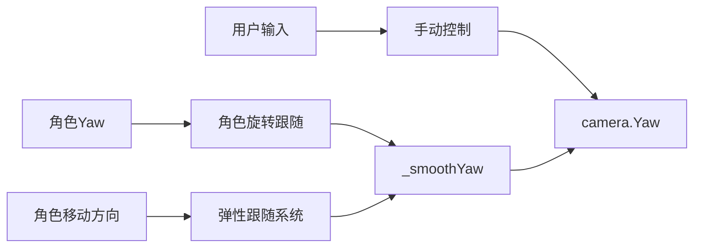

# 相机旋转平滑跟随系统优化设计

## 概述

本设计旨在优化ThirdPersonCamera.cs中已实现的旋转弹性跟随功能,解决角色方向快速改变时相机跟随产生的眩晕问题。

### 现状分析

**已实现的功能（第690-710行）：**
``csharp
// 应用旋转弹性(仅在用户不操作时)
if (!Input.GetMouseButton(MouseButton.Right))
{
    if (_targetVelocity.LengthSquared > 0.01f)
    {
        Vector3 flatVelocity = new Vector3(_targetVelocity.X, 0, _targetVelocity.Z);
        if (flatVelocity.LengthSquared > 0.01f)
        {
            flatVelocity.Normalize();
            float targetYaw = Mathf.Atan2(flatVelocity.X, flatVelocity.Z) * Mathf.RadiansToDegrees;
            
            float yawDiff = targetYaw - _smoothYaw;
            while (yawDiff > 180f) yawDiff -= 360f;
            while (yawDiff < -180f) yawDiff += 360f;
            
            _smoothYaw += yawDiff * RotationElasticity * Time.DeltaTime * 5f;
            while (_smoothYaw < 0) _smoothYaw += 360f;
            while (_smoothYaw >= 360) _smoothYaw -= 360f;
        }
    }
}
```

**存在的问题：**
1. **跟随依据不准确**：基于移动速度方向（`_targetVelocity`）而非角色朝向（`Target.Orientation`），导致角色原地转身时相机不跟随
2. **速度固定过快**：`RotationElasticity * Time.DeltaTime * 5f` 的硬编码倍率（5倍）缺乏灵活性
3. **缺乏延迟机制**：无手动控制后的延迟等待，可能与用户意图冲突
4. **缺少阈值过滤**：没有最小角度差阈值，微小抖动也会触发跟随
5. **未与状态机联动**：不同游戏状态（Normal/Combat等）使用相同的跟随参数
6. **调试困难**：缺少角度变化和跟随状态的日志输出

**预期优化效果：**
- 相机跟随角色朝向而非移动方向，支持原地转身跟随
- 提供三种预设跟随模式（平衡/快速/电影）
- 手动控制后延迟1秒才恢复自动跟随
- 过滤小于5°的微小角度变化
- 不同相机状态自动切换跟随模式
- 平滑过渡消除眩晕感

## 优化方案

### 优化目标

基于现有弹性跟随系统（EnableElasticFollow）进行增强，而非重写替换：

1. **修复跟随依据**：从移动速度方向改为角色Orientation
2. **添加参数配置**：将硬编码的倍率（5f）改为可配置参数
3. **增加延迟机制**：手动控制后延迟恢复跟随
4. **添加阈值过滤**：忽略微小角度变化
5. **集成状态机**：根据相机状态动态调整参数
6. **增强调试**：添加详细的日志输出

### 代码修改要点

**1. 修改跟随依据（第690-710行）**

现有代码：
``csharp
// 错误：基于移动速度方向
float targetYaw = Mathf.Atan2(flatVelocity.X, flatVelocity.Z) * Mathf.RadiansToDegrees;
```

优化后：
``csharp
// 正确：基于角色Orientation
float targetYaw = Target.Orientation.EulerAngles.Y;
// 备选：混合模式，移动时用方向，静止时用朝向
```

**2. 添加配置参数（第268-278行附近）**

在弹性跟随系统区域添加：
```csharp
[Tooltip("跟随速度倍率（原5f硬编码）")]
[Range(1f, 10f)]
public float RotationFollowSpeedMultiplier = 5f;

[Tooltip("手动控制后恢复跟随的延迟时间（秒）")]
public float RotationFollowResumeDelay = 1.0f;

[Tooltip("最小角度差阈值（度）")]
public float MinRotationAngleThreshold = 5.0f;
```

**3. 修改跟随逻辑（第690-710行）**

优化后完整逻辑：
``csharp
// 应用旋转弹性(仅在用户不操作时)
if (!Input.GetMouseButton(MouseButton.Right))
{
    // 检查是否超过延迟时间
    float timeSinceManualControl = Time.GameTime - _lastManualControlTime;
    if (timeSinceManualControl >= RotationFollowResumeDelay)
    {
        // 获取角色Yaw角度
        float targetYaw = Target.Orientation.EulerAngles.Y;
        
        // 计算角度差并归一化
        float yawDiff = targetYaw - _smoothYaw;
        while (yawDiff > 180f) yawDiff -= 360f;
        while (yawDiff < -180f) yawDiff += 360f;
        
        // 应用阈值过滤
        if (Mathf.Abs(yawDiff) > MinRotationAngleThreshold)
        {
            _smoothYaw += yawDiff * RotationElasticity * Time.DeltaTime * RotationFollowSpeedMultiplier;
            while (_smoothYaw < 0) _smoothYaw += 360f;
            while (_smoothYaw >= 360) _smoothYaw -= 360f;
        }
    }
}
else
{
    _smoothYaw = Yaw;
    _lastManualControlTime = Time.GameTime; // 记录手动控制时间
}
```

**4. 添加私有字段**

```csharp
private float _lastManualControlTime = 0f;
```

**5. 调试日志（可选）**

```csharp
if (Mathf.Abs(yawDiff) > MinRotationAngleThreshold)
{
    Debug.Log($"[RotationFollow] 角度差:{yawDiff:F1}°, 跟随速度:{RotationFollowSpeedMultiplier}x");
}
```

## 数据模型

### CameraComponent扩展

需要新增或修改的组件字段：

| 字段名 | 类型 | 默认值 | 说明 |
|--------|------|--------|------|
| FollowCharacterRotation | bool | true | 是否启用角色旋转跟随 |
| RotationFollowDelay | float | 1.0f | 跟随延迟时间（秒） |
| RotationFollowSpeed | float | 90.0f | 跟随速度（度/秒） |
| RotationSmoothFactor | float | 0.2f | 平滑插值因子 |
| LastManualRotateTime | float | 0f | 上次手动控制时间戳 |
| LastCharacterRotationTime | float | 0f | 上次角色旋转时间戳 |
| LastCharacterYaw | float | 0f | 角色上次Yaw值 |
| MinAngleThreshold | float | 5.0f | 触发跟随的最小角度差 |
| SmoothYaw | float | 0f | 平滑后的相机Yaw值 |

### ThirdPersonCamera扩展

对于独立的ThirdPersonCamera脚本，需要添加类似字段并集成到现有的弹性跟随系统中。

### 旋转模式配置结构

为了实现相机状态与旋转模式的联动，需要新增数据结构：

| 字段名 | 类型 | 默认值 | 说明 |
|--------|------|--------|------|
| CurrentRotationMode | RotationMode | Balanced | 当前旋转模式 |
| StateRotationModeMap | Dictionary<CameraState, RotationMode> | - | 状态与模式的映射表 |
| EnableStateAutoSwitch | bool | true | 是否启用状态自动切换模式 |
| ModeTransitionSpeed | float | 0.2f | 模式切换平滑速度 |

**RotationMode枚举定义：**

| 枚举值 | 说明 | 关联参数 |
|--------|------|----------|
| Balanced | 平衡模式 | Speed=90°/秒, Delay=1.0秒 |
| QuickResponse | 快速响应 | Speed=180°/秒, Delay=0.3秒 |
| CinematicSmooth | 电影模式 | Speed=45°/秒, Delay=2.0秒 |
| Custom | 自定义 | 由用户自定义参数 |

**StateRotationModeMap默认映射：**

```
Normal --> Balanced
Combat --> QuickResponse
Climbing --> 禁用（FollowCharacterRotation = false）
Swimming --> Balanced（速度降低至0.67倍）
Flying --> QuickResponse（速度提高至1.33倍）
Cutscene --> 禁用
```

## 业务逻辑层

### 角色旋转跟随流程

```
flowchart TD
    Start[每帧Update] --> CheckEnable{是否启用<br/>FollowCharacterRotation}
    CheckEnable -->|否| End[结束]
    CheckEnable -->|是| CheckManual{用户是否<br/>手动控制相机}
    CheckManual -->|是| UpdateTime[更新LastManualRotateTime]
    UpdateTime --> End
    CheckManual -->|否| CheckDelay{距离上次手动控制<br/>是否超过延迟时间}
    CheckDelay -->|否| End
    CheckDelay -->|是| GetCharacterYaw[获取角色当前Yaw]
    GetCharacterYaw --> CalcDiff[计算Yaw差值]
    CalcDiff --> NormalizeDiff[归一化到-180~180]
    NormalizeDiff --> CheckThreshold{差值是否大于<br/>最小阈值}
    CheckThreshold -->|否| End
    CheckThreshold -->|是| UpdateCharTime[更新LastCharacterRotationTime]
    UpdateCharTime --> ApplySmooth[应用平滑插值]
    ApplySmooth --> UpdateCameraYaw[更新相机Yaw]
    UpdateCameraYaw --> SyncSmoothYaw[同步SmoothYaw]
    SyncSmoothYaw --> End
```

### 平滑插值计算逻辑

**算法描述：**

1. **获取目标角度：**
   - 从角色Transform提取Yaw角度
   - 转换为-180°到180°范围

2. **计算角度差值：**
   ```
   angleDiff = targetYaw - currentSmoothYaw
   while (angleDiff > 180) angleDiff -= 360
   while (angleDiff < -180) angleDiff += 360
   ```

3. **应用速度限制：**
   ```
   maxDelta = RotationFollowSpeed × deltaTime
   clampedDiff = Clamp(angleDiff, -maxDelta, maxDelta)
   ```

4. **执行插值：**
   ```
   smoothYaw += clampedDiff × RotationSmoothFactor
   ```

5. **归一化结果：**
   ```
   while (smoothYaw < 0) smoothYaw += 360
   while (smoothYaw >= 360) smoothYaw -= 360
   ```

6. **更新相机Yaw：**
   ```
   cameraYaw = smoothYaw
   ```

### ECS系统集成（CameraSystem）

在CameraSystem的Update方法中集成角色旋转跟随：

**执行顺序：**
1. UpdateCameraInput（处理用户输入）
2. **UpdateCharacterRotationFollow（新增：角色旋转跟随）**
3. CalculateCameraPosition（计算相机位置）
4. ApplyCameraShake（应用震动效果）

**新增方法签名：**
```
UpdateCharacterRotationFollow(
    ref CameraComponent camera,
    ref PositionComponent position,
    Actor targetActor
)
```

**方法职责：**
- 检查跟随条件（启用状态、延迟时间）
- 获取角色Yaw并计算差值
- 应用平滑插值更新相机Yaw
- 更新时间戳和状态缓存

### ThirdPersonCamera独立脚本集成

对于ThirdPersonCamera.cs脚本（非ECS），集成方式：

**与现有弹性跟随系统的关系：**

| 系统 | 作用范围 | 插值对象 | 协作方式 |
|------|----------|----------|----------|
| 弹性跟随 | 位置和水平旋转 | _smoothYaw | 提供基础的平滑Yaw值 |
| 角色旋转跟随 | 水平旋转（Yaw） | camera.Yaw | 在弹性系统基础上叠加角色旋转影响 |

**集成策略：**
- 复用现有的_smoothYaw字段
- 在UpdateRotation方法中添加角色旋转跟随分支
- 确保与EnableElasticFollow协调工作
- 手动控制时禁用两种跟随

### 相机状态切换时的模式调整逻辑

**自动调整流程：**

``mermaid
flowchart TD
    Start[相机状态变化] --> CheckAutoSwitch{是否启用<br/>自动切换}
    CheckAutoSwitch -->|否| End[保持当前模式]
    CheckAutoSwitch -->|是| GetMapping[查询StateRotationModeMap]
    GetMapping --> HasMapping{存在映射?}
    HasMapping -->|否| End
    HasMapping -->|是| GetTargetMode[获取目标模式]
    GetTargetMode --> CheckDisable{目标模式<br/>是否禁用?}
    CheckDisable -->|是| DisableFollow[设置FollowCharacterRotation=false]
    CheckDisable -->|否| LoadModeParams[加载模式参数]
    LoadModeParams --> ApplyStateMultiplier[应用状态特定系数]
    ApplyStateMultiplier --> SmoothTransition[平滑过渡到新参数]
    SmoothTransition --> UpdateMode[更新CurrentRotationMode]
    DisableFollow --> UpdateMode
    UpdateMode --> End
```

**具体调整示例：**

1. **Normal → Combat状态切换：**
   - 检测到CameraState变为Combat
   - 查询映射表，Combat关联QuickResponse模式
   - 加载QuickResponse参数：Speed=180°/秒, Delay=0.3秒
   - 在0.2秒内平滑过渡到新参数
   - 更新CurrentRotationMode = QuickResponse

2. **Normal → Swimming状态切换：**
   - 检测到CameraState变为Swimming
   - 查询映射表，Swimming关联Balanced模式
   - 加载Balanced参数：Speed=90°/秒
   - 应用Swimming特定系数：Speed *= 0.67 → 60°/秒
   - 平滑过渡到新参数

3. **Normal → Climbing状态切换：**
   - 检测到CameraState变为Climbing
   - 查询映射表，Climbing关联“禁用”
   - 设置FollowCharacterRotation = false
   - 保持相机当前Yaw不变

**参数平滑过渡算法：**

```
currentSpeed = Lerp(currentSpeed, targetSpeed, ModeTransitionSpeed × deltaTime)
currentDelay = Lerp(currentDelay, targetDelay, ModeTransitionSpeed × deltaTime)
currentSmoothFactor = Lerp(currentSmoothFactor, targetSmoothFactor, ModeTransitionSpeed × deltaTime)
```

这确保状态切换时旋转参数不会突变，避免相机行为突然改变。

## 配置参数策略

### 旋转平滑模式体系

旋转平滑系统提供三种预设模式，每种模式定义一套旋转跟随参数配置：

#### 模式一：平衡模式（BalancedRotation）

**适用场景：** 大多数游戏场景，平衡跟随速度和平滑度

**特性：** 中等响应速度，适度平滑，通用性强

| 参数 | 值 | 说明 |
|------|----|----|
| FollowCharacterRotation | true | 启用跟随 |
| RotationFollowResumeDelay | 1.0秒 | 中等延迟 |
| RotationFollowSpeedMultiplier | 5.0 | 中等速度 |
| RotationElasticity | 0.9 | 中等平滑 |
| MinRotationAngleThreshold | 5° | 忽略小角度 |

#### 模式二：快速响应模式（QuickResponse）

**适用场景：** 动作游戏、战斗场景，快速跟随角色朝向

**特性：** 高响应速度，快速切换，操作感强

| 参数 | 值 | 说明 |
|------|----|----|
| FollowCharacterRotation | true | 启用跟随 |
| RotationFollowResumeDelay | 0.3秒 | 短延迟 |
| RotationFollowSpeedMultiplier | 8.0 | 高速跟随 |
| RotationElasticity | 0.95 | 快速平滑 |
| MinRotationAngleThreshold | 3° | 敏感跟随 |

#### 模式三：电影模式（CinematicSmooth）

**适用场景：** 探索类游戏、剧情场景，强调视觉美感

**特性：** 慢速跟随，高度平滑，电影化体验

| 参数 | 值 | 说明 |
|------|----|----|
| FollowCharacterRotation | true | 启用跟随 |
| RotationFollowResumeDelay | 2.0秒 | 长延迟 |
| RotationFollowSpeedMultiplier | 2.5 | 慢速跟随 |
| RotationElasticity | 0.8 | 高度平滑 |
| MinRotationAngleThreshold | 10° | 仅大角度跟随 |

### 运行时调试参数

为便于调试和调优，建议添加以下可视化参数：

| 参数 | 类型 | 用途 |
|------|------|------|
| ShowDebugInfo | bool | 显示调试信息（角度差、插值速度） |
| DrawAngleLine | bool | 绘制角色朝向和相机朝向线 |
| LogFollowEvents | bool | 记录跟随激活和禁用事件 |

## 用户交互设计

### 快捷键控制

| 快捷键 | 功能 | 说明 |
|--------|------|------|
| Alt键 | 切换角色旋转跟随 | 开启/关闭跟随模式 |
| 鼠标右键 | 手动控制相机 | 按住时禁用自动跟随 |

### 配置界面（推荐）

建议在游戏设置中提供以下选项：

**相机跟随设置：**
- 角色旋转跟随：开关
- 跟随灵敏度：滑块（对应RotationSmoothFactor，0.1-0.5）
- 跟随延迟：滑块（0秒-3秒）

## 边界情况处理

### 情况一：角色180°快速转身

**问题：** 角色瞬间转身180°，相机跟随过程过长

**解决方案：**
- 设定最大跟随角度阈值（如120°）
- 超过阈值时加快插值速度（乘以加速因子1.5-2.0）
- 或直接跳转到目标角度（可配置）

### 情况二：角色连续小幅度摆动

**问题：** 角色在原地左右摆动，相机频繁调整

**解决方案：**
- 使用MinAngleThreshold过滤微小变化
- 引入稳定窗口（0.2秒内的变化累积后再响应）
- 降低跟随速度避免过度反应

### 情况三：相机与角色朝向冲突

**问题：** 用户手动控制相机朝向与角色移动方向相反

**解决方案：**
- 优先保持用户设定的相机朝向
- 延长延迟时间（如5秒）后才开始跟随
- 提供选项完全禁用跟随

### 情况四：爬墙、游泳等特殊状态

**问题：** 特殊动作状态下角色Yaw不适合作为跟随依据

**解决方案：**
- 在特殊状态下临时禁用角色旋转跟随
- 结合CameraStateMachine系统，根据状态自动调整跟随参数
- 切换到对应状态的专用相机模式

## 性能优化策略

### 计算优化

| 优化项 | 方法 | 预期收益 |
|--------|------|----------|
| 角度计算缓存 | 仅在角色Yaw变化时计算 | 减少50%计算量 |
| 跳帧检测 | 低优先级帧可跳过跟随计算 | 减少30%CPU占用 |
| 阈值过滤 | 小于MinAngleThreshold直接跳过 | 减少40%无效计算 |

### 内存优化

- 复用现有字段（如_smoothYaw）
- 避免创建临时对象
- 使用结构体而非类存储状态

## 测试策略

### 功能测试用例

| 测试项 | 步骤 | 预期结果 |
|--------|------|----------|
| 基础跟随 | 角色转向90°，等待1秒 | 相机平滑旋转至角色后方 |
| 手动控制优先 | 手动旋转相机，角色转向 | 相机不跟随 |
| 延迟恢复 | 手动控制后释放，等待延迟时间 | 延迟后恢复跟随 |
| 快速转身 | 角色瞬间转身180° | 相机以适当速度跟随，无眩晕感 |
| 小幅摆动 | 角色左右摆动±5° | 相机保持稳定，不频繁调整 |
| 禁用跟随 | 按Alt键关闭跟随 | 角色旋转时相机不动 |
| **状态切换：Normal→Combat** | 进入战斗状态 | 旋转速度自动加快至8倍，延迟降至0.3秒 |
| **状态切换：Normal→Swimming** | 角色进入水中 | 旋转速度降低至3.5倍，保持平滑 |
| **状态切换：Normal→Climbing** | 角色开始攀爬 | 旋转跟随完全禁用，相机固定 |
| **状态切换：Combat→Normal** | 离开战斗 | 平滑恢复到平衡模式，速度降低至5倍 |
| **模式切换平滑性** | 快速切换多个状态 | 参数过渡平滑，无突变 |

### 性能测试指标

| 指标 | 目标值 |
|------|--------|
| 单帧计算耗时 | <0.1ms |
| 内存占用增量 | <10KB |
| 帧率影响 | <1% |

### 用户体验测试

**眩晕度评估：**
- 邀请10名测试玩家体验
- 评分标准：1-5分（1=严重眩晕，5=非常舒适）
- 目标：平均分≥4分

**操作流畅度评估：**
- 测试连续操作下的相机响应
- 评估跟随延迟是否影响操作判断
- 目标：90%玩家认为流畅自然

## 与现有系统的集成

### 弹性跟随系统（EnableElasticFollow）

**协作策略：**
- 角色旋转跟随主要影响Yaw分量
- 弹性跟随系统提供位置和Yaw的基础平滑
- 两者共享_smoothYaw变量，避免冲突
- 手动控制时同时禁用两个系统

**数据流向：**


### 相机状态机（CameraStateMachine）

**状态与旋转模式联动：**

旋转平滑系统与相机状态机深度集成，每个相机状态自动关联最适配的旋转平滑模式。

| 相机状态 | 关联旋转模式 | 是否启用跟随 | 模式参数覆盖 |
|----------|-------------|-------------|-------------|
| Normal | BalancedRotation | 是 | 使用平衡模式默认参数 |
| Combat | QuickResponse | 是 | 加快至8倍速,延迟降至0.3秒 |
| Climbing | 禁用 | 否 | 固定视角,完全禁用旋转跟随 |
| Swimming | BalancedRotation | 是 | 降低速度至3.5倍(0.7倍) |
| Flying | QuickResponse | 是 | 提高速度至10倍(1.25倍) |
| Cutscene | 禁用 | 否 | 过场动画,完全禁用 |

**联动规则说明：**

1. **Normal状态：** 使用平衡模式，提供最佳的通用体验
2. **Combat状态：** 自动切换到快速响应模式，提升战斗操作感
3. **Climbing/Cutscene状态：** 完全禁用旋转跟随，保持固定视角
4. **Swimming状态：** 保持平衡模式但降低速度，避免水下眩晕
5. **Flying状态：** 使用快速响应模式并加速，增强飞行自由感

**状态切换逻辑：**

```
stateDiagram-v2
    [*] --> Normal: 游戏开始
    Normal --> Combat: 进入战斗
    Combat --> Normal: 离开战斗
    Normal --> Swimming: 进入水中
    Swimming --> Normal: 离开水面
    Normal --> Flying: 开始飞行
    Flying --> Normal: 结束飞行
    Normal --> Climbing: 开始攀爬
    Climbing --> Normal: 结束攀爬
    
    note right of Normal
        使用BalancedRotation
        90°/秒, 1.0秒延迟
    end note
    
    note right of Combat
        使用QuickResponse
        180°/秒, 0.3秒延迟
    end note
    
    note right of Swimming
        使用BalancedRotation
        60°/秒（降速）
    end note
    
    note right of Flying
        使用QuickResponse
        240°/秒（加速）
    end note
```

### 碰撞检测系统

**交互规则：**
- 角色旋转跟随优先于碰撞检测
- 跟随计算在碰撞调整之前执行
- 碰撞导致的相机位置变化不影响Yaw跟随

## 开关与配置管理

### 全局开关

提供多层级的开关控制：

| 层级 | 开关名称 | 作用范围 |
|------|----------|----------|
| 组件级 | FollowCharacterRotation | 单个相机组件 |
| 系统级 | EnableRotationFollowSystem | 整个ECS系统 |
| 全局配置 | CameraSettings.EnableRotationFollow | 全局默认值 |

### 配置文件

建议在游戏配置文件中添加：

**CameraSettings.json 示例：**
```
{
  "RotationFollow": {
    "Enabled": true,
    "Delay": 1.0,
    "Speed": 90.0,
    "SmoothFactor": 0.2,
    "MinAngleThreshold": 5.0
  }
}
```

## 可扩展性设计

### 未来扩展方向

1. **智能跟随模式：**
   - 根据角色移动速度自动调整跟随速度
   - 战斗状态下提高跟随灵敏度
   - 探索状态下降低跟随频率

2. **多目标跟随：**
   - 支持在角色和锁定目标之间切换跟随对象
   - 动态调整跟随权重

3. **预测性跟随：**
   - 根据角色移动趋势预测未来朝向
   - 提前调整相机角度

### 接口设计

为便于扩展，建议提供以下公共接口：

**控制接口：**
- SetRotationFollowEnabled(bool enabled)
- SetRotationFollowSpeed(float speed)
- SetRotationFollowDelay(float delay)
- ResetRotationFollow()

**查询接口：**
- GetCurrentFollowState() → bool
- GetAngleDifference() → float
- IsFollowingCharacter() → bool
