# 客户端核心功能开发设计文档

## 1. 功能概述

本文档描述客户端核心游戏玩法功能的设计，参照《燕云十六声》的游戏特性，构建一个融合开放世界探索、武侠动作战斗、社交互动及沉浸式叙事的客户端系统。

### 1.1 设计目标

- 实现流畅的角色移动与相机控制系统
- 构建富有打击感的技能与战斗系统
- 支持开放世界探索的交互机制
- 打造沉浸式的武侠世界体验
- 确保客户端与服务端的协同工作

### 1.2 核心特性

基于《燕云十六声》的游戏理念，客户端需要实现以下核心特性：

| 特性类别 | 核心要素 | 设计重点 |
|---------|---------|---------|
| 角色移动 | 八方向移动、跑酷、轻功 | 流畅性、物理真实感 |
| 战斗系统 | 连招、格挡、闪避、武器切换 | 打击感、反馈及时性 |
| 技能系统 | 武学招式、内功心法、必杀技 | 表现力、策略性 |
| 交互系统 | NPC对话、物品拾取、机关解谜 | 沉浸感、响应速度 |
| 世界探索 | 爬墙、游泳、骑马、飞索 | 自由度、探索乐趣 |

## 2. 世界观设定

### 2.1 时代背景

游戏设定于辽宋交界的燕云十六州，这是一个充满历史厚重感和江湖风云的乱世。玩家将扮演一名在这片土地上寻找真相的侠客，经历权谋、复仇、忠义与背叛的故事。

### 2.2 武侠体系

| 体系元素 | 说明 | 客户端表现 |
|---------|------|-----------|
| 江湖门派 | 包括少林、武当、峨眉等传统门派 | 不同门派招式特效、动作风格差异 |
| 武学等级 | 从初窥门径到登峰造极 | 技能等级影响特效规模和动画流畅度 |
| 内功修为 | 决定角色战力上限 | 角色光效强度、气场表现 |
| 兵器谱系 | 刀剑棍棒、暗器、徒手 | 武器模型、攻击动画、音效差异 |
| 轻功身法 | 纵跃、滑翔、踏水、飞檐走壁 | 移动动画、粒子特效、镜头表现 |

### 2.3 世界演进与玩家体验

#### 2.3.1 阶段性世界观设计原则

**渐进式展开**：

为确保玩家不会因世界观过于宽广而感到迷失，采用分阶段解锁机制：

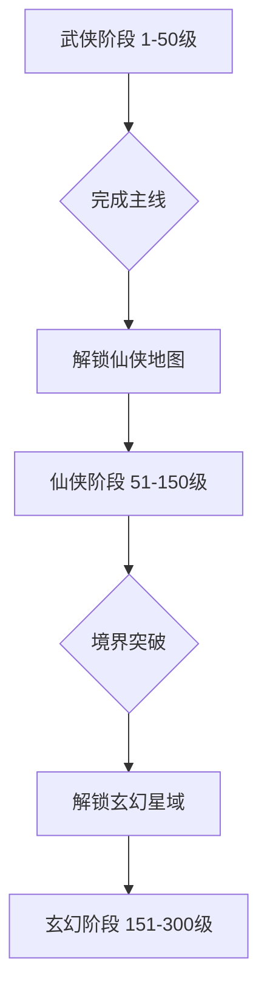

**每阶段核心体验**：

| 阶段 | 核心玩法 | 地图范围 | 玩家反馈预期 |
|------|---------|---------|-------------|
| **武侠(1-50级)** | 江湖恩怨、门派争斗、轻功修炼 | 燕云十六州、中原大陆 | “有游戏性和结构感”、“目标明确” |
| **仙侠(51-150级)** | 修仙升级、法宝炼制、御剑飞行 | 九州仙山、仙界秘境 | “有新鲜感和成就感” |
| **玄幻(151-300级)** | 法则领悟、星域征战、宇宙探索 | 星域宇宙、异界位面 | “顶尖玩家専属内容” |

**世界观连贯性设计**：

1. **武侠为根基**：
   - 前50级为核心体验期，武侠元素必须精致且充实
   - 江湖文化、门派体系、武学修炼需要深度打磨
   - 参考《燕云十六声》的历史底蕴和文化深度

2. **仙侠为升华**：
   - 51-150级为进阶内容，不应过早接触
   - 仙侠元素与武侠元素自然融合，不是突然断裂
   - 内力→灵力的转化通过“破境”任务完成

3. **玄幻为终局**：
   - 151级+为顶尖玩家内容，不强制普通玩家参与
   - 宇宙探索、星域征战为选择性玩法
   - 可以继续留在武侠/仙侠阶段享受游戏

#### 2.3.2 玩家偏好分析

**目标玩家群体**：

基于当代武侠仙侠游戏玩家的偏好调研：

| 玩家类型 | 占比 | 核心需求 | 设计对应 |
|---------|------|---------|----------|
| **故事向玩家** | 35% | 沉浸式剧情、角色成长 | 武侠阶段主线剧情丰满 |
| **战斗向玩家** | 30% | 打击感、技巧性战斗 | 五行相克、连招系统 |
| **收集向玩家** | 20% | 装备收集、成就系统 | 唯一ID装备、图鉴系统 |
| **社交向玩家** | 10% | 门派互动、组队玩法 | 门派系统、师徒系统 |
| **探索向玩家** | 5% | 开放世界、隐藏内容 | 奇遇系统、隐藏地图 |

**世界观受众分析**：

| 世界观阶段 | 适合玩家 | 吸引力 | 潜在风险 |
|-----------|---------|---------|----------|
| **纯武侠** | 喜欢现实主义武侠的玩家 | 高，有《燕云十六声》作参考 | 后期内容可能不足 |
| **武侠+仙侠** | 喜欢修仙飞升的玩家 | 中高，符合中国仙侠审美 | 风格转变需要自然 |
| **全阶段体系** | 喜欢长线成长的核心玩家 | 高，内容丰富度极高 | 开发成本巨大 |

**关键设计决策**：

1. **武侠阶段必须独立完整**：
   - 即使玩家不进入仙侠阶段，也能有完整游戏体验
   - 1-50级内容包含：完整主线、门派体系、PVP/PVE系统
   - 50级毕业装备应有足够的价值感

2. **仙侠阶段为选择性升华**：
   - 不强制玩家升级到仙侠
   - 提供“破境任务”作为门槛，玩家自主选择
   - 武侠阶段也应有持续更新内容

3. **玄幻阶段为终局内容**：
   - 仅针对核心玩家，不是主线必须内容
   - 提供超越常规的挑战和奖励
   - 可以作为DLC或资料片扩展

#### 2.3.3 世界观进化的视觉表现

**视觉风格演变**：

| 阶段 | 色调 | 特效风格 | 音乐风格 | 示例参考 |
|------|------|----------|----------|----------|
| **武侠** | 淡雅、写实 | 水墨画风、粒子较少 | 古筝、二胡 | 《燕云十六声》 |
| **仙侠** | 明亮、灵动 | 仙气飘渺、光效增多 | 古琴、笛子 | 《仙剑奇侠传》 |
| **玄幻** | 幻彩、宏大 | 宇宙星辰、特效震撼 | 电子乐+管弦乐 | 《星际争霸》 |

**过渡设计**：

为确保风格过渡不突兀，在阶段交界处：

1. **50级破境任务**：
   - 通过一次史诗级任务完成境界突破
   - 任务过程中逐渐展现仙侠元素
   - 最终获得仙侠能力（御剑飞行、灵力觉醒）

2. **150级飞升任务**：
   - 极高难度的挑战，需要团队协作
   - 突破后获得玄幻力量（虚空穿梭、法则领悟）
   - 解锁星域地图

#### 2.3.4 内容分布优化

**开发资源分配建议**：

| 阶段 | 内容占比 | 开发优先级 | 原因 |
|------|---------|------------|------|
| **武侠(1-50级)** | 50% | 最高 | 所有玩家必经之路，决定第一印象 |
| **仙侠(51-150级)** | 35% | 高 | 大部分玩家会进入的阶段 |
| **玄幻(151-300级)** | 15% | 中 | 仅核心玩家需要，可后期扩展 |

**分阶段上线策略**：

```
第一阶段：上线武侠内容(1-50级)
- 完整的武侠世界观
- 丰富的武技系统
- 成熟的战斗体验

第二阶段：扩展仙侠内容(51-150级)
- 3-6个月后上线
- 基于玩家反馈优化
- 增加仙侠特色玩法

第三阶段：开放玄幻内容(151-300级)
- 1年后作为资料片
- 根据玩家基数决定
- 提供终局挑战内容
```

#### 视觉风格
- 写实与艺术化结合的中式美学
- 昼夜循环与动态天气系统
- 季节变换影响场景外观

#### 音效氛围
- 传统乐器营造的背景音乐
- 环境音效（市井喧嚣、寺庙钟声、流水鸟鸣）
- 战斗音效的力度反馈

## 3. 角色移动系统

### 3.1 移动模式

基于现有的PlayerController基础，扩展支持武侠世界特有的移动方式：

#### 3.1.1 基础移动模式

| 移动模式 | 速度倍数 | 体力消耗 | 触发条件 | 动画表现 |
|---------|---------|---------|---------|---------|
| 站立待机 | 0 | 无 | 无输入 | 呼吸动画、环顾四周 |
| 行走 | 1.0x | 无 | WASD轻推 | 自然步态 |
| 跑步 | 2.0x | 低 | WASD常规 | 快速跑动 |
| 冲刺 | 3.5x | 高 | Shift+移动 | 身体前倾、加速线条 |
| 蹲伏移动 | 0.5x | 无 | C+移动 | 压低身姿 |
| 滑行 | 2.5x | 中 | 冲刺时按C | 贴地滑动、尘埃特效 |

#### 3.1.2 轻功系统

轻功是武侠游戏的核心特色，需要精心设计：

**纵跃（基础跳跃）**
- 触发方式：空格键
- 跳跃高度：根据内功等级动态调整（基础2米，最高可达5米）
- 空中控制：允许空中调整方向，控制力为地面的30%
- 视觉表现：起跳时足下轻烟特效，内功高深者有真气环绕

**二段跳**
- 触发方式：空中再次按空格
- 条件：需要学习相应轻功心法
- 高度：首次跳跃的70%
- 视觉表现：空中借力特效、衣袂飘飘

**轻功滑翔**
- 触发方式：空中长按空格
- 体力消耗：持续消耗，每秒5点
- 滑翔距离：根据起跳高度和内功等级计算
- 操作特性：可通过WASD调整滑翔方向
- 视觉表现：衣袂展开形成滑翔姿态、气流特效

**飞檐走壁**
- 触发方式：冲刺状态下接触墙面
- 持续时间：根据内功等级，2-5秒
- 操作特性：可在墙面横向移动、向上攀爬
- 视觉表现：足尖点壁、真气波纹扩散

**踏水而行**
- 触发方式：在水面冲刺
- 条件：需要学习上乘轻功
- 持续时间：3-8秒（根据轻功等级）
- 视觉表现：水面涟漪、脚下水花飞溅

### 3.2 移动物理系统

#### 3.2.1 地形适应

| 地形类型 | 移动影响 | 特殊表现 |
|---------|---------|---------|
| 平地 | 无影响 | 标准移动 |
| 斜坡（<30°） | 速度-10% | 上坡气喘动画 |
| 陡坡（30-45°） | 速度-30% | 需要攀爬动作 |
| 楼梯 | 自动台阶检测 | 步伐适配台阶高度 |
| 水面 | 速度-50%，启用游泳动画 | 水波特效、湿身效果 |
| 沼泽 | 速度-70%，持续扣血 | 陷入动画、挣扎效果 |
| 冰面 | 惯性增加200% | 滑行动画、减少摩擦力 |
| 屋顶瓦片 | 允许快速移动 | 瓦片碰撞音效 |

#### 3.2.2 重力与下落系统

- **重力系统**：基础重力值为-9.81m/s²，轻功等级高的角色重力影响减弱至-6.0m/s²
- **下落伤害**：
  - 安全高度：3米以内无伤害
  - 轻伤：3-6米，扣除10-20%生命值
  - 重伤：6-10米，扣除30-50%生命值
  - 致命：10米以上，扣除60%以上生命值
  - 轻功减伤：每级轻功心法减少15%下落伤害
- **落地表现**：
  - 低高度：单膝着地
  - 中高度：双手撑地缓冲
  - 高空落地：翻滚卸力动画
  - 轻功化解：凌空翻转，轻盈落地

### 3.3 相机系统集成

角色移动需要与现有的ThirdPersonCamera系统深度集成：

#### 3.3.1 相机模式切换

| 场景 | 相机模式 | 距离 | 俯仰角 | 视野(FOV) |
|------|---------|------|--------|----------|
| 常规探索 | 第三人称 | 8m | 25° | 60° |
| 战斗状态 | 第三人称（锁定） | 6m | 20° | 65° |
| 跑酷/轻功 | 动态追踪 | 10m | 15° | 70° |
| 爬墙 | 贴近视角 | 4m | 30° | 60° |
| 骑马 | 第三人称（宽广） | 12m | 20° | 65° |
| 对话 | 过肩镜头 | 3m | 10° | 55° |

#### 3.3.2 相机动态效果

- **移动平滑**：相机跟随角色时使用弹簧阻尼算法，避免突兀抖动
- **视角预判**：根据角色移动方向，相机略微超前偏移，增强方向感
- **障碍物处理**：遮挡时相机自动拉近或透明化障碍物
- **动作镜头**：
  - 跳跃起飞：FOV扩大5°，镜头微微上扬
  - 二段跳：镜头快速拉远后回弹
  - 滑翔：镜头拉远至12米，俯仰角降低至10°
  - 冲刺：添加运动模糊和速度线条特效
  - 落地：相机轻微下沉并震动

#### 3.3.3 相机碰撞检测

- 与现有ThirdPersonCamera的碰撞系统协同
- 射线检测频率：每帧检测
- 碰撞响应：
  - 硬遮挡（墙壁）：立即拉近至安全距离
  - 软遮挡（植被）：半透明化处理
  - 天花板：压低俯仰角
- 恢复机制：障碍物消失后平滑恢复到理想距离

### 3.4 移动输入处理

#### 3.4.1 输入优先级

利用现有InputManager系统，建立清晰的输入优先级：

| 优先级 | 输入类型 | 说明 |
|-------|---------|------|
| 1 | UI交互 | UI激活时禁用角色输入（EnableInput=false） |
| 2 | 过场动画 | 播放剧情时锁定输入 |
| 3 | 技能施放 | 技能动画期间限制移动 |
| 4 | 移动输入 | WASD/方向键 |
| 5 | 辅助动作 | 跳跃、蹲伏、冲刺 |

#### 3.4.2 输入缓冲与预测

- **输入缓冲**：保留最近0.1秒的输入，允许提前按键（连招系统基础）
- **移动预测**：客户端预测移动结果，服务端校验后修正
- **网络补偿**：记录最近5帧的移动缓冲，用于服务端回滚校验

## 4. 战斗系统

### 4.1 战斗理念

参照《燕云十六声》的战斗设计哲学：
- 强调打击反馈和视觉冲击
- 需要观察敌人动作并做出应对（格挡/闪避）
- 不同武器有不同的战斗节奏
- 连招系统鼓励技巧而非数值碾压

### 4.2 基础战斗动作

#### 4.2.1 普通攻击

| 攻击类型 | 触发方式 | 伤害倍率 | 硬直时间 | 可衔接 |
|---------|---------|---------|---------|--------|
| 轻击一段 | 左键单击 | 1.0x | 0.3秒 | 二段 |
| 轻击二段 | 左键连击 | 1.2x | 0.4秒 | 三段 |
| 轻击三段 | 左键三连 | 1.5x | 0.5秒 | 重击 |
| 重击蓄力 | 长按左键 | 2.5x | 1.0秒 | 无 |
| 跳跃攻击 | 空中+左键 | 1.8x | 0.6秒 | 落地重击 |
| 冲刺攻击 | 冲刺+左键 | 2.0x | 0.7秒 | 无 |

#### 4.2.2 防御系统

**格挡（右键）**
- 举起武器进入格挡姿态
- 减免50-80%伤害（根据武器类型）
- 格挡成功瞬间（受击前0.3秒内）触发"完美格挡"：
  - 伤害减免100%
  - 反震敌人，造成短暂僵直
  - 特效：金属碰撞火花、音效强化
- 格挡期间移动速度-70%
- 持续格挡消耗体力，每秒5点

**闪避（E键）**
- 向当前移动方向快速翻滚/闪身
- 无敌帧：0.4秒
- 冷却时间：2秒
- 体力消耗：15点
- 方向控制：
  - 无方向输入：向后翻滚
  - WASD+E：向对应方向闪避
- 成功闪避敌人攻击触发"极限闪避"：
  - 时间减速效果1秒（子弹时间）
  - 获得3秒攻击力+30%增益

### 4.3 技能系统

#### 4.3.1 技能分类

基于服务端已有的技能系统（SkillTemplateEntity），客户端需要表现以下技能类型：

| 技能类型 | 特点 | 表现重点 | 示例 |
|---------|------|---------|------|
| 主动攻击技能 | 瞬发或吟唱伤害 | 招式动画、特效轨迹、打击音效 | 降龙十八掌、独孤九剑 |
| 被动强化技能 | 持续提升属性 | 角色光效、气场显示 | 易筋经、九阳神功 |
| 控制技能 | 眩晕、定身、减速 | 受控动画、束缚特效 | 点穴、缠丝劲 |
| 位移技能 | 快速移动或传送 | 残影特效、位移轨迹 | 凌波微步、瞬步 |
| 辅助技能 | 治疗、护盾、增益 | 恢复特效、护盾可视化 | 回春术、金刚不坏 |
| 终结技 | 高伤害大招 | 镜头特写、全屏特效、震屏 | 六脉神剑、万剑归宗 |

#### 4.3.2 技能施放流程

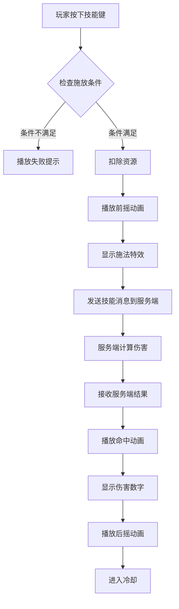

**施放条件检查**
- 技能冷却完毕
- 内力/真气充足
- 不在硬直状态
- 目标在施法范围内（指向性技能）
- 前置技能已触发（连招技能）

**动画阶段**
- 前摇：不可取消，播放蓄力动画
- 判定帧：实际计算伤害的时间点
- 后摇：可被闪避取消，播放收招动画

**特效分层**
- 蓄力特效：技能准备阶段的气息汇聚
- 施法特效：技能释放瞬间的光效/粒子
- 弹道特效：远程技能的飞行轨迹
- 命中特效：击中目标时的爆发效果
- 场地特效：范围技能留下的地面标记

#### 4.3.3 技能表现细节

**镜头表现**
- 普通技能：相机震动强度0.1，持续0.2秒
- 大招技能：
  - 施法瞬间时间减速至50%
  - 镜头快速拉近至5米
  - 浅景深效果，模糊背景
  - 强烈震动（强度0.5，持续0.8秒）
  - 径向模糊表现冲击力

**打击反馈**
- 命中顿帧：0.05-0.1秒的时间暂停
- 手柄震动：根据伤害值调整震动强度
- 音效分层：挥动音、破空音、命中音、角色喊话
- 受击反应：敌人硬直动画、击退效果

**连招系统**
- 技能衔接窗口：后摇阶段的0.3秒内可接下一招
- 连招加成：连续命中提升伤害（最高150%）
- 连击数显示：屏幕UI显示当前连击数
- 断连机制：3秒未命中则连击归零

### 4.4 武器系统

#### 4.4.1 武器类型

| 武器类型 | 攻击范围 | 攻速 | 伤害倍率 | 特性 | 代表技能 |
|---------|---------|------|---------|------|---------|
| 剑 | 中 | 快 | 1.0x | 平衡，技巧型 | 破剑式、万剑归宗 |
| 刀 | 中 | 中 | 1.2x | 爆发伤害高 | 刀法连斩、霸刀诀 |
| 棍棒 | 长 | 慢 | 1.3x | 范围控制 | 横扫千军、定海神针 |
| 双剑/双刀 | 短 | 极快 | 0.9x | 连击流 | 影舞、幻影步 |
| 暗器 | 远 | 快 | 0.8x | 远程消耗 | 飞镖、袖箭 |
| 徒手 | 极短 | 极快 | 0.7x | 灵活，控制力强 | 龙爪手、铁砂掌 |
| 长枪 | 极长 | 中 | 1.1x | 突刺特化 | 百鸟朝凤、回马枪 |
| 拂尘/扇子 | 中 | 快 | 0.8x | 辅助增益 | 封穴、群体增益 |

#### 4.4.2 武器切换

- 触发方式：数字键1-4切换预设武器栏
- 切换时间：0.5秒（播放切换动画）
- 切换期间：不可攻击、可移动
- 战斗中切换：打断当前动作，重置连招
- 武器耐久：每次攻击消耗耐久度，耐久为0时攻击力-50%

### 4.5 受击与死亡系统

#### 4.5.1 受击表现

- 轻伤受击：播放0.2秒受击动画，轻微后退
- 重伤受击：播放0.5秒受击动画，明显击退
- 击飞：垂直击飞3-5米，播放翻滚动画
- 击倒：倒地2秒，需要按空格爬起
- 生命值UI：血条闪烁，屏幕边缘红光提示

#### 4.5.2 死亡机制

- 生命值归零触发死亡动画（1.5秒）
- 画面逐渐黑白化
- 显示复活选项：
  - 原地复活（消耗复活丹）
  - 传送至最近复活点
  - 回到主城
- 死亡惩罚：掉落部分经验值、装备耐久度下降

## 5. 技能动画系统

### 5.1 动画状态机

客户端需要构建分层的动画状态机来管理角色动画：

#### 5.1.1 基础层（Base Layer）

负责全身动画，优先级最高：

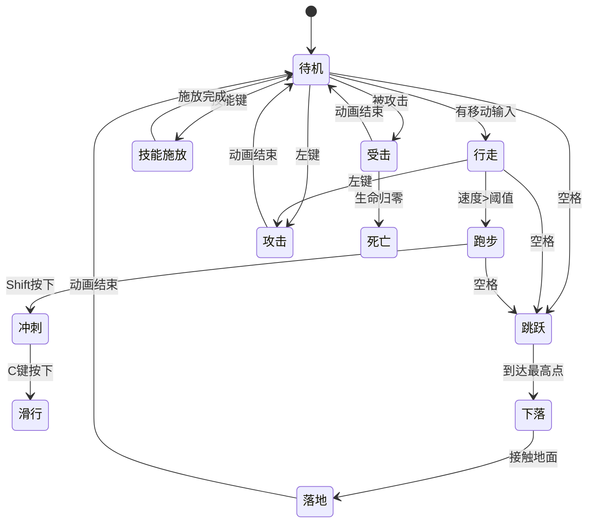

#### 5.1.2 上半身层（Upper Body Layer）

用于独立控制上半身动作（权重0-1可调）：

- 攻击动画：上半身挥舞武器，下半身可同时移动
- 施法动画：上半身结印/持咒，下半身可缓慢移动
- 瞄准动画：上半身跟随鼠标方向，用于远程武器

#### 5.1.3 附加层（Additive Layer）

叠加在基础动画之上的修正层：

- 呼吸动画：待机时的细微起伏
- 受伤姿态：低血量时的虚弱表现
- 情绪表情：根据剧情/情绪系统播放表情动画

### 5.2 动画融合

#### 5.2.1 混合树（Blend Tree）

**移动混合**
- 使用2D混合空间，X轴为前后移动，Y轴为左右移动
- 八方向移动动画平滑插值
- 根据移动速度混合行走/跑步/冲刺动画

**转向混合**
- 小角度转向（<30°）：播放转身动画
- 大角度转向（≥30°）：播放急停+转身动画
- 原地转向：播放原地旋转动画

#### 5.2.2 过渡时间

| 动画过渡 | 过渡时间 | 混合模式 |
|---------|---------|---------|
| 待机↔行走 | 0.2秒 | 线性 |
| 行走↔跑步 | 0.3秒 | 平滑 |
| 跑步↔冲刺 | 0.15秒 | 快速 |
| 移动→跳跃 | 0.1秒 | 瞬间 |
| 跳跃→下落 | 0秒 | 无 |
| 下落→落地 | 0.05秒 | 瞬间 |
| 移动→攻击 | 0.1秒 | 快速 |
| 攻击→待机 | 0.2秒 | 平滑 |
| 任意→受击 | 0秒 | 强制打断 |

### 5.3 动画事件系统

动画时间轴上需要设置事件节点，在特定帧触发逻辑：

#### 5.3.1 战斗动画事件

| 事件名称 | 触发时机 | 执行逻辑 |
|---------|---------|---------|
| AttackStart | 攻击前摇开始 | 武器发光特效 |
| AttackHit | 攻击判定帧 | 伤害计算、碰撞检测 |
| AttackEnd | 攻击后摇结束 | 允许下一次输入 |
| SkillCast | 技能释放点 | 发送技能消息到服务端 |
| SpawnProjectile | 弹道生成 | 实例化飞行物体 |
| PlaySound | 特定音效点 | 播放脚步/击打/破空声 |
| CameraShake | 强力动作 | 触发相机震动 |
| SpawnEffect | 特效生成点 | 实例化粒子特效 |

#### 5.3.2 移动动画事件

| 事件名称 | 触发时机 | 执行逻辑 |
|---------|---------|---------|
| Footstep | 脚步落地 | 播放脚步音效、生成尘埃 |
| JumpTakeOff | 起跳瞬间 | 生成起跳特效 |
| LandImpact | 落地瞬间 | 相机震动、落地尘埃 |
| WallContact | 触墙瞬间 | 墙壁涟漪特效 |
| WaterSplash | 入水瞬间 | 水花飞溅特效、音效 |

### 5.4 IK（反向动力学）系统

为了增强角色动画的真实感和环境适应性：

#### 5.4.1 脚部IK
- 自动适配地形高度，避免脚部悬空或穿模
- 斜坡行走时调整脚步角度
- 楼梯行走时精确对齐台阶

#### 5.4.2 手部IK
- 双手持武器时精确定位手部位置
- 攀爬时手部自动抓握岩壁突出点
- 推门/拉闸等交互时手部对齐交互物

#### 5.4.3 头部IK
- 视线跟踪：头部和眼球跟随鼠标或重要目标
- 对话时注视对话对象
- 战斗时注视锁定敌人

### 5.5 技能动画特殊处理

#### 5.5.1 技能动画优先级

技能动画通常需要覆盖基础移动动画：

- **固定施法技能**：播放期间完全锁定角色，不可移动（权重1.0）
- **移动施法技能**：上半身播放施法动画，下半身继续移动（权重分离）
- **瞬发技能**：快速播放技能动画后立即恢复移动（0.3秒）

#### 5.5.2 技能动画同步

- 客户端播放技能动画时立即发送技能消息到服务端
- 服务端验证技能合法性并计算伤害
- 客户端收到服务端响应后播放命中特效
- 如果服务端拒绝技能（冷却未完成/资源不足），回滚客户端动画

#### 5.5.3 技能打断处理

- 被控制技能打断：强制停止当前技能动画，播放受击动画
- 主动取消技能：某些技能允许闪避取消，退出时播放取消动画
- 技能失败：播放失败动画（如施法失败、弹道落空）

## 6. 交互系统

### 6.1 NPC交互

#### 6.1.1 交互检测

- 检测范围：角色周围3米半径
- 检测方式：球形碰撞检测，每0.2秒更新一次
- 视觉提示：
  - 可交互NPC头顶显示交互图标（对话气泡/任务感叹号）
  - 进入交互范围时图标高亮
  - 屏幕中央显示"按F与[NPC名字]对话"提示

#### 6.1.2 对话系统

**对话触发**
- 玩家按F键开始对话
- 禁用角色移动输入（PlayerController.EnableInput = false）
- 相机切换至过肩对话镜头（距离3米，轻微侧角度）
- 播放NPC对话动画（手势、表情）

**对话界面**
- 对话框显示NPC头像、名字、台词
- 支持选项分支：
  - 主线任务选项（金色）
  - 支线任务选项（蓝色）
  - 闲聊选项（白色）
  - 交易选项（绿色）
- 使用鼠标点击或数字键1-4选择选项
- 对话历史记录可回溯

**对话动画同步**
- 根据台词长度和情绪，播放对应的NPC动画
- 玩家角色播放倾听动画（点头、摇头、思考）
- 关键剧情时播放过场动画

**退出对话**
- 按ESC或选择"告辞"选项
- 恢复角色输入（PlayerController.EnableInput = true）
- 相机恢复至第三人称模式

### 6.2 物品交互

#### 6.2.1 拾取系统

**自动拾取**
- 货币、消耗品：接触后自动拾取
- 拾取特效：物品飞向角色，UI显示获得提示
- 拾取音效：根据物品稀有度播放不同音效

**手动拾取**
- 装备、材料：需要按F手动拾取
- 地面上的物品显示发光轮廓（稀有度颜色）
- 拾取动画：弯腰捡起0.5秒

**批量拾取**
- 长按F键在3米范围内拾取所有物品
- 拾取进度条显示
- 打断机制：移动或受击打断拾取

#### 6.2.2 容器交互

- 宝箱、柜子、尸体搜刮：按F打开容器界面
- 播放开启动画（宝箱翻盖、柜门打开）
- 界面显示容器内物品列表
- 可拖拽物品到背包或直接点击拾取
- 关闭界面时恢复输入控制

### 6.3 环境交互

#### 6.3.1 机关解谜

| 机关类型 | 交互方式 | 表现 |
|---------|---------|------|
| 拉杆 | 按F拉动 | 播放拉动动画，机关发出声响 |
| 按钮 | 按F按下 | 按钮下陷，触发音效 |
| 转盘 | 按F旋转 | 播放旋转动画，多次按F连续旋转 |
| 火盆 | 按F点燃 | 火焰燃起特效，照亮环境 |
| 石门 | 满足条件自动开启 | 沉重的开门音效，地面震动 |

#### 6.3.2 爬梯/攀爬

- 靠近梯子/攀爬点时显示"按F攀爬"提示
- 进入攀爬状态：
  - 播放攀爬动画
  - 角色沿攀爬路径移动
  - 相机自动调整至最佳观察角度
- 操作控制：
  - W：向上爬
  - S：向下爬
  - 空格：跳离
  - ESC：取消攀爬

#### 6.3.3 坐骑系统

**上马**
- 靠近坐骑按F上马
- 播放上马动画0.8秒
- 角色模型切换至骑乘姿态
- 移动速度提升至3.0x

**骑乘操作**
- WASD控制方向，操作逻辑与步行类似
- Shift加速：速度提升至4.5x，消耗坐骑体力
- 空格跳跃：马匹跳跃高度1.5米
- 不可在骑乘时施放大部分技能（仅允许轻功技能）

**下马**
- 按F或X键下马
- 播放下马动画0.5秒
- 坐骑留在原地或跟随角色（根据设置）

### 6.4 场景破坏

#### 6.4.1 可破坏物体

为了增强环境互动感和战斗爽快感：

| 物体类型 | 破坏方式 | 效果 |
|---------|---------|------|
| 木桶/陶罐 | 攻击或碰撞 | 碎裂特效，可能掉落物品 |
| 木箱 | 攻击 | 木板飞散，内含物品 |
| 窗户 | 攻击/冲撞 | 玻璃破碎音效，可穿过 |
| 桌椅 | 攻击 | 破损、倾倒 |
| 灯笼 | 攻击 | 掉落，火焰熄灭 |
| 草丛/灌木 | 移动经过 | 草叶摇动、沙沙声 |

#### 6.4.2 环境元素互动

- **火焰**：接触持续扣血，可用水系技能扑灭
- **水体**：进入触发游泳状态，可用冰系技能冻结
- **风场**：特定区域存在上升气流，辅助轻功滑翔
- **毒雾**：特定区域持续扣血，需解毒丹或内功抵御

## 7. UI与反馈系统

### 7.1 战斗UI

#### 7.1.1 核心战斗信息

| UI元素 | 位置 | 显示内容 |
|--------|------|---------|
| 生命值条 | 屏幕左下 | 当前/最大生命值，百分比颜色 |
| 内力/真气条 | 生命值条下方 | 当前/最大内力，施法消耗时闪烁 |
| 体力条 | 真气条下方 | 当前/最大体力，冲刺/闪避消耗 |
| 技能快捷栏 | 屏幕下方中央 | 技能图标、冷却倒计时、快捷键提示 |
| 目标血条 | 屏幕上方中央 | 锁定目标的生命值、等级、名称 |
| 伤害数字 | 目标头顶 | 浮动伤害数字，颜色区分类型 |
| 连击数 | 屏幕右侧 | 当前连击数，超过10连特殊显示 |
| Buff/Debuff | 生命值条上方 | 状态图标、持续时间 |

#### 7.1.2 伤害数字系统

**数字颜色**
- 白色：普通物理伤害
- 黄色：暴击伤害（字号放大1.5倍）
- 红色：真实伤害
- 蓝色：内力伤害
- 绿色：治疗数值
- 紫色：护盾吸收

**特殊显示**
- 暴击：数字爆炸动画，带感叹号
- 格挡：灰色BLOCKED字样
- 闪避：黄色MISS字样
- 免疫：紫色IMMUNE字样

**数字动画**
- 从目标位置向上飘浮1米
- 持续1秒后渐隐消失
- 多次伤害合并显示（0.3秒内累加）

### 7.2 探索UI

#### 7.2.1 小地图

- 位置：屏幕右上角
- 大小：150x150像素
- 显示内容：
  - 玩家位置（蓝色箭头）
  - 队友位置（绿色标记）
  - NPC位置（黄色标记）
  - 任务目标（金色感叹号）
  - 传送点（蓝色漩涡）
  - 敌对目标（红色标记）
- 可缩放：滚轮调整显示范围（50m-500m）
- 可旋转：跟随角色朝向或固定北向

#### 7.2.2 任务追踪

- 位置：屏幕右侧
- 显示：
  - 当前追踪任务列表（最多5个）
  - 任务目标进度（如：击败山贼 3/10）
  - 任务距离提示（距离目标120米）
  - 任务方向指引（屏幕边缘箭头）
- 可展开/折叠详细信息

### 7.3 提示与教学

#### 7.3.1 新手引导

- 首次接触新系统时弹出教学提示
- 箭头指向需要操作的UI或角色动作
- 半透明遮罩高亮重点区域
- 可跳过或重新观看

#### 7.3.2 操作提示

- 靠近可交互物体时动态显示交互提示
- 提示文本居中显示："按[F]拾取物品"
- 图标与文字结合，直观易懂
- 1秒淡入，移开后0.5秒淡出

## 8. 网络同步

### 8.1 网络同步架构

#### 8.1.1 同步策略概述

客户端采用**客户端预测 + 服务端校验 + 平滑插值**的混合同步机制，平衡响应性和一致性。

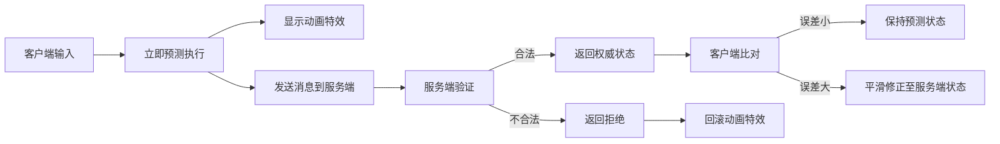

#### 8.1.2 角色移动同步

**上行同步（客户端→服务端）**：

| 参数 | 发送频率 | 内容 | 压缩策略 |
|------|---------|------|----------|
| **移动输入** | 每100ms（动态调整） | 位置(Vector3)、朝向(Quaternion)、速度(float)、时间戳(long)、输入序列号(int) | 浮点数压缩至16位 |
| **状态变化** | 仅在变化时 | 移动状态(enum)：待机/行走/跑步/冲刺/跳跃等 | 使用枚举，1字节 |
| **轻功状态** | 仅在变化时 | 轻功类型、剩余时长 | 2字节 |
| **地面信息** | 仅在变化时 | 是否落地(bool)、地面类型(enum) | 1字节 |

**发送频率动态调整**：
- 静止不动：停止发送
- 缓慢移动：200ms一次
- 常速移动：100ms一次
- 高速移动（冲刺/轻功）：50ms一次
- 战斗状态：50ms一次（确保精准性）

**下行同步（服务端→客户端）**：

| 参数 | 推送频率 | 内容 | 优化策略 |
|------|---------|------|----------|
| **自身位置校验** | 每500ms | 服务端权威位置 | 仅在误差>0.5m时修正 |
| **其他玩家位置** | 每200ms | 可见范围内玩家位置 | AOI(兴趣区域)算法过滤 |
| **NPC位置** | 每500ms | 活跃NPC位置 | 静止NPC不同步 |
| **重要状态** | 即时 | 技能施放、受击、死亡 | 高优先级消息 |

**位置预测算法**：

```
预测位置计算：
1. 获取当前输入（方向、速度）
2. 计算移动向量 = 方向 × 速度 × 时间增量
3. 应用重力影响（如果在空中）
4. 进行碰撞检测（简化版）
5. 计算新位置 = 当前位置 + 移动向量
6. 记录预测状态到缓冲队列（最多5帧）
```

**位置修正策略**：

| 误差范围 | 修正策略 | 修正时间 | 说明 |
|---------|---------|---------|------|
| 0-0.1m | 忽略 | 无 | 误差可忽略 |
| 0.1-0.5m | 平滑插值 | 0.2秒 | 线性过渡 |
| 0.5-2.0m | 快速插值 | 0.1秒 | 明显修正但保持流畅 |
| >2.0m | 直接传送 | 即时 | 误差过大，强制同步 |

#### 8.1.3 技能施放同步

**客户端预测流程**：

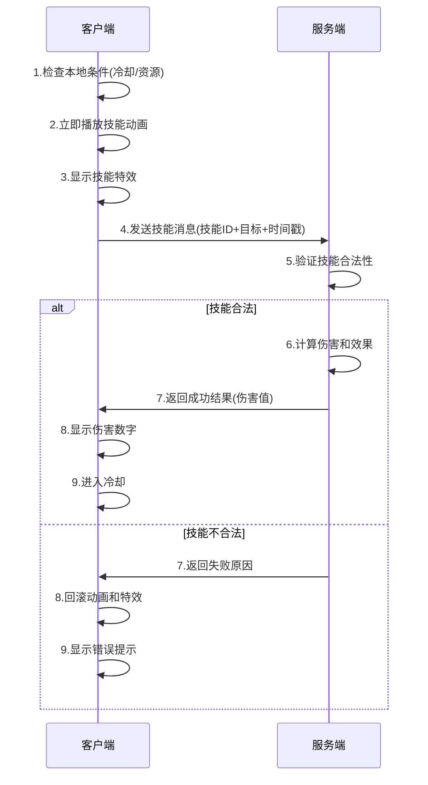

**技能同步消息**：

| 消息字段 | 数据类型 | 大小 | 说明 |
|---------|---------|------|------|
| 技能ID | int | 4字节 | 技能唯一标识 |
| 目标ID列表 | List<ulong> | 变长 | 多目标技能支持 |
| 施法位置 | Vector3 | 12字节 | 地面技能使用 |
| 时间戳 | long | 8字节 | 用于延迟补偿 |
| 输入序列号 | int | 4字节 | 防止消息乱序 |

**技能回滚机制**：

当服务端拒绝技能时，客户端需要：
1. 立即停止技能动画
2. 清除已显示的特效
3. 恢复消耗的资源（内力/灵力）
4. 重置冷却计时器
5. 显示错误提示（如“技能未就绪”）

#### 8.1.4 NPC移动同步

**设计原则**：
- 同屏NPC数量控制：客户端最多同时渲染200个NPC
- 超出数量时按优先级剔除：Boss > 战斗NPC > 巡逻NPC > 静态NPC
- 使用LOD策略：距离>50米的NPC降低更新频率和模型精度

**NPC分类同步策略**：

| NPC类型 | 同步策略 | 频率 | 优化措施 | 带宽占用 | 可见范围 |
|---------|---------|------|----------|---------|--------|
| **静态NPC** | 不同步 | 无 | 客户端直接加载位置，服务端仅发送ID | 0 bytes/s | 100米 |
| **巡逻NPC** | 路径点同步 | 每2秒 | 客户端插值补间移动，预测路径 | 5 bytes/个 | 80米 |
| **战斗NPC** | 实时同步 | 每200ms | AI决策在服务端，客户端仅表现 | 30 bytes/个 | 100米 |
| **Boss** | 高频同步 | 每100ms | 关键动作广播所有玩家，技能前摇预警 | 80 bytes/个 | 200米 |
| **队友NPC** | 跟随同步 | 每300ms | 仅同步目标位置，客户端AI跟随 | 15 bytes/个 | 跟随玩家 |
| **飞行NPC** | 三维同步 | 每150ms | 同步XYZ坐标+飞行状态 | 40 bytes/个 | 150米 |

**极端场景优化**：

```
场景：玩家进入主城，周围有500个NPC

优化策略：
1. 静态NPC（如商人、守卫）：客户端本地加载，0带宽
2. 巡逻NPC：仅同步进入视野的前50个
3. 其他玩家：视为特殊NPC，优先级最高，最多同步100个
4. 动态加载：玩家移动时动态卸载远处NPC，加载近处NPC
5. 分帧加载：避免一次性加载所有NPC造成卡顿

带宽消耗估算：
- 50个巡逻NPC × 5 bytes × 0.5次/秒 = 125 bytes/s
- 20个战斗NPC × 30 bytes × 5次/秒 = 3000 bytes/s  
- 100个其他玩家 × 40 bytes × 10次/秒 = 40000 bytes/s
- 总带宽：约43 KB/s（可接受范围）
```

**NPC AI预测优化**：
- 巡逻NPC：客户端根据路径点预测位置，减少同步频率
- 战斗NPC：仅同步攻击目标ID和技能ID，客户端自行播放动画
- Boss：关键技能由服务端强制同步，普通攻击客户端预测

**五行NPC特殊处理**：
- NPC五行属性影响技能特效：客户端根据五行属性动态加载对应特效
- 五行Boss：全场景广播技能施放，确保所有玩家看到五行链式反应
- 五行材料掉落：服务端计算掉落后立即通知客户端显示特效

**NPC加载与卸载**：

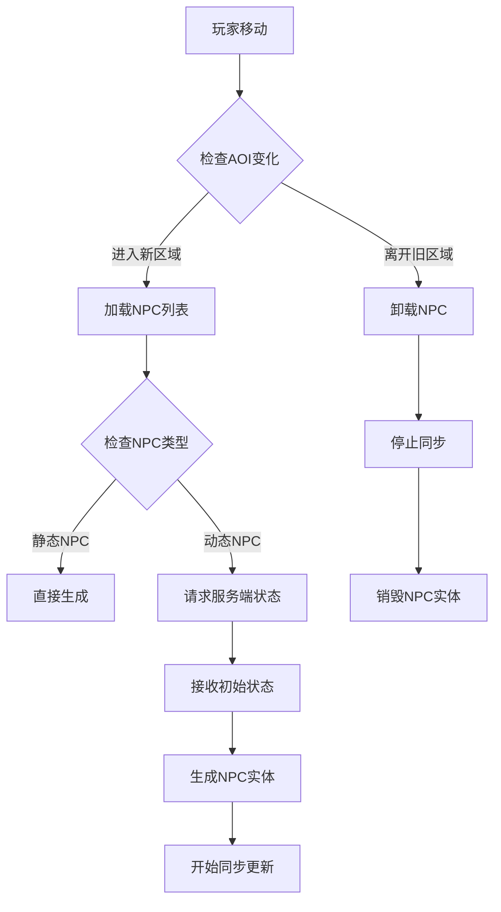

**AOI(兴趣区域)算法**：
- 视野范围：玩家周围100米半径
- 缓冲范围：120米（防止频繁加卸载）
- 更新频率：每1秒检查一次
- 优先级：玩家 > Boss > 精英NPC > 普通NPC

#### 8.1.5 场景加载与感知

**分块加载机制**：

| 加载阶段 | 触发条件 | 加载内容 | 加载方式 |
|---------|---------|---------|----------|
| **预加载** | 距离边界200m | 下一区域地形数据 | 异步后台加载 |
| **主加载** | 进入新区域 | 建筑、静态物体 | 分帧加载，避免卡顿 |
| **动态元素** | 可见范围内 | NPC、怪物、玩家 | 根据AOI动态加载 |
| **细节加载** | 距离<50m | 高精度模型、特效 | LOD系统控制 |

**场景卸载策略**：

```
卸载优先级（低到高）：
1. 远距离区域(>500m)的静态物体
2. 不可见区域的动态元素
3. 长时间未使用的特效资源
4. 离开区域的音效资源
5. 低优先级的纹理和模型
```

**感知范围分级**：

| 距离范围 | 感知粒度 | 同步内容 | 同步频率 | 模型精度 | 动画帧率 | 应用场景 |
|---------|---------|---------|---------|---------|---------|----------|
| **0-30m** | 高精度 | 全部动作、表情、音效、技能特效 | 50ms | 100% | 60FPS | 战斗、交互、组队 |
| **30-100m** | 中精度 | 主要动作、移动状态、大型技能 | 200ms | 60% | 30FPS | 周围感知、战场全局 |
| **100-300m** | 低精度 | 仅位置、朝向 | 1秒 | 20% | 10FPS | 远景显示、小地图标记 |
| **>300m** | 不感知 | 不加载实体，仅小地图图标 | 5秒 | 0% | 0FPS | 超出视野，仅地图显示 |

**动态感知调整**：

```
根据战斗状态和玩家密度动态调整感知范围

战斗状态：
- 进入战斗时，感知范围扩大至150米（防止偷袭）
- 锁定目标：目标即使超过300米也保持高精度同步
- 战场模式（大型PVP）：感知范围压缩至50米，减轻客户端负担

玩家密度：
- 主城（高密度）：感知范围30米，最多同步50个玩家
- 野外（中密度）：感知范围100米，最多同步30个玩家  
- 副本（低密度）：感知范围200米，同步所有玩家

五行特效优化：
- 30米内：完整五行特效（粒子、光效、后处理）
- 30-100米：简化五行特效（仅主要粒子）
- 100米外：仅显示五行颜色光柱（用于远距离识别技能类型）
```

**分块加载与卸载策略**：

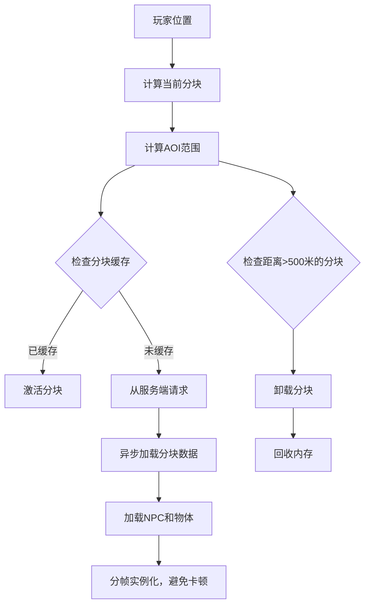

**网络带宽优化**：

不同感知范围的带宽消耗：

| 范围 | 每个实体带宽 | 假设实体数 | 总带宽 |
|------|------------|----------|-------|
| 0-30m | 50 bytes/次 × 20次/秒 | 10个 | 10 KB/s |
| 30-100m | 30 bytes/次 × 5次/秒 | 20个 | 3 KB/s |
| 100-300m | 10 bytes/次 × 1次/秒 | 30个 | 0.3 KB/s |
| 总计 | - | 60个 | 13.3 KB/s |

考虑到五行技能特效同步额外增加5-10 KB/s，总带宽控制在20 KB/s以内（合理）

### 8.2 客户端预测

为了降低网络延迟对操作手感的影响，客户端采用预测机制：

#### 8.1.1 移动预测

- 客户端接收输入后立即预测角色新位置
- 发送移动消息到服务端（含时间戳和输入序列号）
- 服务端验证并返回权威位置
- 客户端比对预测与服务端位置，如误差>0.5米则平滑修正

#### 8.1.2 技能预测

- 玩家按下技能键后立即播放技能动画和特效
- 发送技能施放消息到服务端
- 服务端验证条件（冷却、资源、距离）
- 如果服务端拒绝，客户端回滚动画并播放失败提示
- 如果服务端确认，客户端继续播放后续效果

### 8.2 消息同步

#### 8.2.1 上行消息（客户端→服务端）

| 消息类型 | 发送频率 | 内容 |
|---------|---------|------|
| 移动输入 | 每0.1秒 | 位置、朝向、速度、时间戳 |
| 技能施放 | 即时 | 技能ID、目标ID、施法位置 |
| 普通攻击 | 即时 | 攻击类型、目标ID |
| 交互请求 | 即时 | 交互对象ID、交互类型 |
| 拾取请求 | 即时 | 物品ID、物品位置 |

#### 8.2.2 下行消息（服务端→客户端）

| 消息类型 | 推送时机 | 内容 |
|---------|---------|------|
| 移动同步 | 每0.2秒 | 其他玩家的位置、朝向、状态 |
| 伤害结算 | 即时 | 伤害值、暴击标识、目标ID |
| 技能效果 | 即时 | 技能ID、施法者、目标列表 |
| 状态变化 | 即时 | Buff/Debuff添加或移除 |
| 属性更新 | 变化时 | 生命值、内力、经验值变化 |

### 8.3 状态同步

#### 8.3.1 关键状态

需要严格同步的状态：
- 角色位置和朝向
- 生命值、内力、体力
- 技能冷却时间
- Buff/Debuff状态
- 装备和武器状态

#### 8.3.2 非关键状态

可以容忍延迟或客户端自行计算的状态：
- 动画播放进度（客户端自行播放）
- 粒子特效（客户端本地生成）
- 相机位置（完全客户端控制）
- UI显示状态

## 9. 性能优化

### 9.1 渲染优化

#### 9.1.1 LOD（细节层次）

根据距离动态调整模型精度：

| 距离范围 | LOD等级 | 模型面数 | 贴图分辨率 | 动画骨骼数 |
|---------|---------|---------|-----------|-----------|
| 0-10米 | LOD0 | 100% | 2048x2048 | 全骨骼 |
| 10-30米 | LOD1 | 60% | 1024x1024 | 主要骨骼 |
| 30-50米 | LOD2 | 30% | 512x512 | 核心骨骼 |
| 50米以上 | LOD3 | 10% | 256x256 | 无动画 |

#### 9.1.2 动态遮挡剔除

- 使用视锥剔除（Frustum Culling）：相机视野外的对象不渲染
- 遮挡查询（Occlusion Query）：被大型建筑完全遮挡的对象不渲染
- 距离剔除：超过100米的小型物件不渲染

#### 9.1.3 批处理

- 静态批处理：场景中固定不动的物体合并网格
- 动态批处理：相同材质的小型动态对象合并渲染
- GPU实例化：大量相同模型（如草地、石头）使用实例化渲染

### 9.2 动画优化

#### 9.2.1 动画采样率

- 主角色：60FPS完整动画
- 队友/重要NPC：30FPS
- 普通NPC：15FPS
- 远距离角色（>50米）：暂停动画更新

#### 9.2.2 骨骼优化

- 主角色：完整骨骼系统（80+ 骨骼）
- 次要角色：简化骨骼（40 骨骼）
- 远程角色：极简骨骼（10 骨骼，仅主要部位）

### 9.3 特效优化

#### 9.3.1 粒子数量控制

- 根据画质设置调整粒子数量：
  - 高：100%
  - 中：60%
  - 低：30%
- 屏幕外的粒子系统自动暂停
- 距离超过30米的粒子效果简化

#### 9.3.2 特效复用

- 建立特效对象池，避免频繁实例化
- 相同类型的特效共享材质和纹理
- 短暂特效播放完毕后回收到对象池

### 9.4 内存优化

#### 9.4.1 资源加载策略

- 异步加载：大型资源（场景、模型）异步加载，避免卡顿
- 流式加载：根据玩家位置动态加载/卸载场景区域
- 预加载：根据任务流程提前加载即将用到的资源

#### 9.4.2 资源卸载

- 离开场景时卸载该场景专属资源
- 长时间未使用的资源（5分钟）自动卸载
- 内存压力大时主动触发资源清理

## 10. 开发任务分解

### 10.1 阶段一：基础移动系统增强（预计2周）

**任务清单**
- [ ] 扩展PlayerController，添加轻功系统参数
- [ ] 实现二段跳逻辑
- [ ] 实现轻功滑翔功能
- [ ] 实现飞檐走壁检测与动画
- [ ] 实现踏水而行物理判定
- [ ] 添加对应的移动动画状态
- [ ] 集成相机动态效果（视野变化、镜头特写）
- [ ] 测试地形适应性

**验收标准**
- 角色可流畅完成所有移动模式切换
- 轻功系统响应及时，无明显延迟
- 相机跟随平滑，无抖动和穿模
- 各种地形上移动表现正确

### 10.2 阶段二：战斗系统框架（预计3周）

**任务清单**
- [ ] 构建战斗动画状态机
- [ ] 实现普通攻击连招系统
- [ ] 实现格挡与闪避机制
- [ ] 实现完美格挡/极限闪避判定
- [ ] 实现受击反馈系统
- [ ] 实现武器切换逻辑
- [ ] 添加武器系统配置数据
- [ ] 集成打击音效和相机震动
- [ ] 初步测试战斗手感

**验收标准**
- 连招流畅，动作衔接自然
- 格挡和闪避时机判定准确
- 打击反馈明显，有冲击感
- 不同武器战斗节奏有区分

### 10.3 阶段三：技能系统实现（预计4周）

**任务清单**
- [ ] 设计技能配置数据结构（客户端侧）
- [ ] 实现技能施放流程
- [ ] 实现技能动画播放与事件触发
- [ ] 实现技能特效系统（粒子、光效、轨迹）
- [ ] 实现技能镜头表现（震动、时间减速、特写）
- [ ] 实现连招系统与技能衔接
- [ ] 实现技能打断与取消机制
- [ ] 与服务端技能系统对接
- [ ] 实现伤害数字显示
- [ ] 实现Buff/Debuff视觉表现

**验收标准**
- 技能施放流畅，特效表现力强
- 客户端与服务端技能同步准确
- 连招窗口判定精确
- 技能打击感优秀

### 10.4 阶段四：交互与UI系统（预计3周）

**任务清单**
- [ ] 实现NPC交互检测与提示
- [ ] 实现对话系统UI与逻辑
- [ ] 实现对话相机切换
- [ ] 实现物品拾取系统
- [ ] 实现容器交互UI
- [ ] 实现环境机关交互
- [ ] 实现爬梯/攀爬系统
- [ ] 实现坐骑系统
- [ ] 实现场景破坏效果
- [ ] 实现战斗UI（血条、技能栏、伤害数字）
- [ ] 实现探索UI（小地图、任务追踪）

**验收标准**
- 所有交互响应及时，提示清晰
- 对话系统流畅，相机切换自然
- UI信息完整，布局合理
- 坐骑操作手感良好

### 10.5 阶段五：动画与特效打磨（预计2周）

**任务清单**
- [ ] 优化动画过渡时间
- [ ] 实现IK系统（脚部、手部、头部）
- [ ] 实现动画事件系统
- [ ] 制作/导入所有技能特效
- [ ] 制作/导入环境交互特效
- [ ] 调整粒子系统参数
- [ ] 实现特效对象池
- [ ] 音效资源整合与触发

**验收标准**
- 动画流畅自然，无明显僵硬感
- IK系统正常工作，脚步不悬空
- 特效表现力强，与动画同步
- 音效与画面配合良好

### 10.6 阶段六：网络同步与优化（预计2周）

**任务清单**
- [ ] 实现客户端移动预测
- [ ] 实现技能预测与回滚
- [ ] 实现状态同步机制
- [ ] 优化网络消息频率
- [ ] 实现LOD系统
- [ ] 实现动态遮挡剔除
- [ ] 实现特效性能优化
- [ ] 实现资源流式加载
- [ ] 性能测试与瓶颈分析
- [ ] 内存优化

**验收标准**
- 100ms延迟下操作无明显卡顿
- 同屏50个角色时帧率>30FPS
- 内存占用<2GB
- 加载时间<10秒

## 11. 技术约束与风险

### 11.1 技术约束

| 约束项 | 说明 | 应对措施 |
|-------|------|---------|
| Flax引擎能力 | 引擎特定功能可能有限制 | 提前验证关键功能可行性 |
| 网络延迟 | 需要适应50-200ms延迟 | 客户端预测+平滑插值 |
| 性能目标 | 需要在中低配置电脑运行 | 多档画质设置，动态LOD |
| 动画资源 | 需要大量动作捕捉数据 | 优先使用动画库，关键动作定制 |
| 美术资源 | 模型、特效工作量大 | 分阶段迭代，先用占位资源 |

### 11.2 潜在风险

**技术风险**
- 轻功物理模拟复杂度高，可能出现穿模或碰撞异常
  - 缓解：多轮测试，建立碰撞问题修复流程
- 技能特效过多导致性能下降
  - 缓解：特效分级，低配置自动降级
- 网络同步冲突导致位置抖动
  - 缓解：优化预测算法，增加客户端容错

**资源风险**
- 动画和美术资源交付延期
  - 缓解：提前准备占位资源，并行开发
- 第三方素材版权问题
  - 缓解：使用正版资源库或自制资源

**设计风险**
- 战斗手感不符合预期
  - 缓解：早期Demo测试，快速迭代调整
- 轻功系统可能导致关卡设计困难
  - 缓解：与关卡策划紧密配合，设定合理限制

## 12. 依赖与协作

### 12.1 服务端依赖

客户端核心功能依赖服务端提供以下支持：

| 服务端系统 | 提供接口 | 用途 |
|-----------|---------|------|
| 角色管理系统 | 角色位置同步、属性查询 | 移动同步、状态显示 |
| 技能系统 | 技能验证、伤害计算 | 技能施放、战斗结算 |
| 物品系统 | 拾取验证、背包管理 | 物品交互 |
| 任务系统 | 任务进度、目标位置 | 任务追踪UI |
| 社交系统 | 队伍信息、好友状态 | 组队玩法、好友显示 |

### 12.2 美术资源需求

| 资源类型 | 数量估算 | 优先级 |
|---------|---------|--------|
| 角色模型 | 主角1个，NPC 20+ | 高 |
| 武器模型 | 8类武器，每类5款 | 高 |
| 角色动画 | 移动20个，战斗50个，技能100个 | 高 |
| 技能特效 | 100+ | 中 |
| 环境特效 | 50+ | 低 |
| UI素材 | 界面10+，图标200+ | 中 |
| 音效资源 | 动作音效100+，环境音效50+ | 中 |

### 12.3 协作流程

**开发阶段**
- 每日站会同步进度和阻塞问题
- 每周与服务端团队对齐接口变更
- 每两周与美术团队评审资源交付

**测试阶段**
- 功能开发完成后提交QA测试
- Bug修复优先级：崩溃>功能异常>体验问题
- 性能测试在各阶段结束时进行

**发布阶段**
- 提前1周冻结新功能，专注Bug修复
- 提前3天进行完# 客户端核心功能开发设计文档

## 文档概述

### 文档目的
本文档定义客户端核心游戏玩法功能的战略设计，包括角色移动系统、技能动画系统、战斗机制以及参照《燕云十六声》的核心玩法特性。文档专注于系统的意图、价值、结构和策略层面，不涉及具体实现细节。

### 目标受众
- 客户端开发团队
- 游戏设计团队
- 技术架构师
- 项目管理人员

### 参考设定
本设计参照《燕云十六声》的游戏玩法设计，该游戏背景设定在五代十国至北宋初期，融合了历史与武侠元素，核心特色包括：
- 灵活的角色移动与卸势防御系统
- 多武器切换与组合技能系统
- 奇术系统与武学系统并行
- 深度的门派与社交系统
- 开放世界探索与互动

---

## 系统架构概览

### 核心系统关系

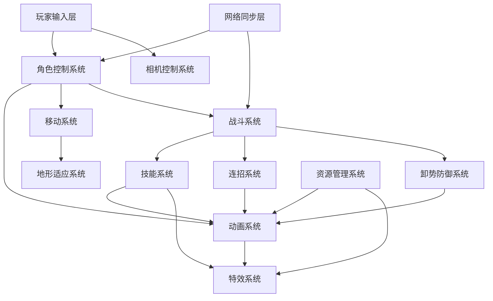

### 系统分层职责

| 层级 | 系统组件 | 核心职责 |
|------|---------|---------|
| **输入层** | 输入管理器 | 捕获并规范化玩家输入，支持键盘、手柄、触控 |
| **控制层** | 角色控制器、相机控制器 | 将输入转换为角色行为和视角调整 |
| **逻辑层** | 移动系统、战斗系统、技能系统 | 执行游戏核心玩法逻辑与规则验证 |
| **表现层** | 动画系统、特效系统 | 视觉反馈与沉浸式体验呈现 |
| **同步层** | 网络同步 | 多人游戏状态一致性保证 |

---

## 一、角色移动系统

### 1.1 系统目标

角色移动系统旨在提供流畅、响应迅速且富有武侠风格的角色移动体验，支持多种移动状态和地形适应能力，同时确保与网络同步的兼容性。

### 1.2 移动状态模型

#### 状态定义

| 状态 | 触发条件 | 行为特征 | 速度系数 |
|------|---------|---------|---------|
| **待机 (Idle)** | 无输入且落地 | 静止站立，轻微呼吸动画 | 0.0 |
| **行走 (Walking)** | 方向键输入 | 基础移动速度 | 1.0 |
| **跑步 (Running)** | Shift + 方向键 | 快速移动 | 2.0 |
| **冲刺 (Sprinting)** | 双击方向键 | 爆发性移动，消耗体力 | 3.0 |
| **跳跃 (Jumping)** | Space键 | 垂直跃起，支持三段跳 | 保持水平速度 |
| **蹲伏 (Crouching)** | C键 | 降低身形，减速移动 | 0.5 |
| **滑行 (Sliding)** | 跑步状态下按C | 保持冲力滑动，消耗体力 | 2.5 → 1.0 衰减 |
| **飞行 (Flying)** | 轻功触发 | 短暂滞空与快速位移 | 1.5 |
| **游泳 (Swimming)** | 进入水体 | 水中移动，速度降低 | 0.7 |
| **攀爬 (Climbing)** | 接触可攀爬表面 | 垂直或倾斜移动 | 0.6 |

#### 状态转换规则

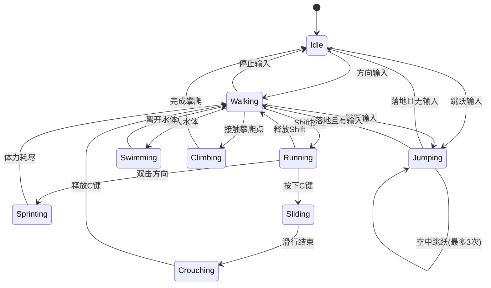

### 1.3 移动控制机制

#### 输入响应策略

| 输入类型 | 优先级 | 响应方式 | 缓冲时间 |
|---------|-------|---------|---------|
| **键盘WASD** | 高 | 即时响应，支持八方向移动 | 100ms |
| **手柄摇杆** | 高 | 模拟量输入，支持360度移动 | 50ms |
| **鼠标点击移动** | 中 | 寻路移动，自动导航 | 无 |
| **技能位移** | 最高 | 强制打断当前移动 | 无 |

#### 转向平滑算法策略

- **目标**：避免机械式旋转，提供自然的角色转身动画
- **方法**：采用球形线性插值（Slerp）平滑过渡角色朝向
- **参数**：
  - 平滑系数：0.1（可配置）
  - 最小转向角度：5度（低于此值不触发转向动画）
  - 急转阈值：120度（超过此值触发急转身动画）

#### 移动加速与减速模型

- **加速特性**：
  - 起步有0.2秒加速过程，模拟角色蓄力
  - 加速曲线采用缓入缓出（Ease In-Out）
  
- **减速特性**：
  - 停止移动时有0.3秒滑行减速
  - 急停（Shift + 后方向键）立即停止
  
- **惯性保持**：
  - 空中移动保留70%水平速度
  - 斜坡移动受重力影响产生加速或减速

### 1.4 地形适应系统

#### 地面检测机制

- **检测方式**：角色脚底向下发射射线
- **检测距离**：基准0.1米，跳跃后扩展至0.5米
- **地面判定**：
  - 平地：斜率 < 15度
  - 斜坡：斜率 15-45度
  - 峭壁：斜率 > 45度（需攀爬）
  
#### 台阶攀爬策略

- **自动攀爬阈值**：台阶高度 ≤ 0.3米
- **行为**：角色自动提升位置，无需跳跃输入
- **动画衔接**：平滑过渡至抬腿动画

#### 斜坡移动调整

| 斜率范围 | 移动速度调整 | 重力影响 | 特殊行为 |
|---------|-------------|---------|---------|
| 0-15度 | 无调整 | 标准重力 | 正常行走 |
| 15-30度 | -10% | 上坡额外消耗体力 | 允许冲刺 |
| 30-45度 | -25% | 下坡速度增加15% | 滑行距离延长 |
| >45度 | 无法行走 | 触发滑落 | 强制切换至攀爬或滑落 |

### 1.5 体力系统

#### 体力消耗规则

| 动作 | 消耗速率 | 恢复延迟 | 最低保留 |
|------|---------|---------|---------|
| 冲刺 | 20点/秒 | 1.5秒 | 10% |
| # 客户端核心功能开发设计文档

## 文档概述

### 文档目的
本文档定义客户端核心游戏玩法功能的战略设计，包括角色移动系统、技能动画系统、战斗机制、五行武技系统以及角色成长体系。文档专注于系统的意图、价值、结构和策略层面，不涉及具体实现细节。

### 目标受众
- 客户端开发团队
- 游戏设计团队
- 技术架构师
- 项目管理人员

### 世界观设定

本游戏采用渐进式世界观演进设定，角色从普通武侠世界起步，逐步成长至仙侠境界，最终探索玄幻宇宙：

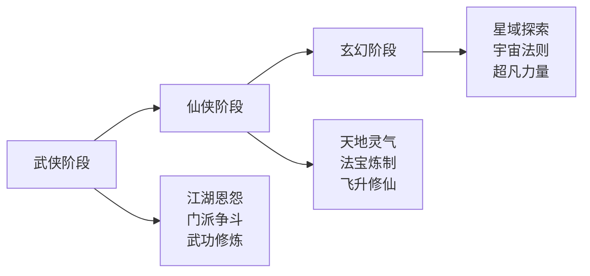

**阶段划分**：

| 阶段 | 境界范围 | 世界范围 | 核心玩法 | 能量体系 |
|------|---------|---------|---------|---------|
| **武侠阶段** | 1-50级 | 中原大陆、江湖 | 轻功、内功、武技 | 内力 |
| **仙侠阶段** | 51-150级 | 九州大陆、仙界 | 御剑飞行、法术、阵法 | 灵力 |
| **玄幻阶段** | 151-300级 | 星域宇宙、异界 | 空间穿梭、法则领悟 | 元力 |

---

## 系统架构概览

### 核心系统关系

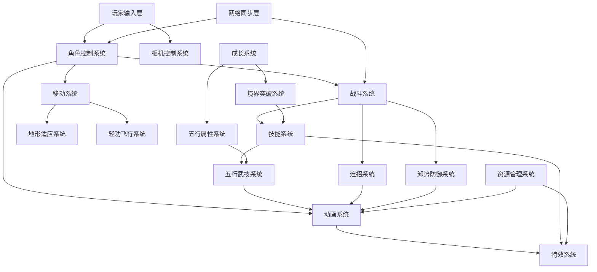

### 系统分层职责

| 层级 | 系统组件 | 核心职责 |
|------|---------|---------|
| **输入层** | 输入管理器 | 捕获并规范化玩家输入，支持键盘、手柄、触控 |
| **控制层** | 角色控制器、相机控制器 | 将输入转换为角色行为和视角调整，遵循职责分离原则 |
| **逻辑层** | 移动系统、战斗系统、技能系统、五行系统 | 执行游戏核心玩法逻辑与规则验证 |
| **成长层** | 境界系统、属性系统、五行修炼 | 角色能力演进与世界观阶段转换 |
| **表现层** | 动画系统、特效系统 | 视觉反馈与沉浸式体验呈现 |
| **同步层** | 网络同步 | 多人游戏状态一致性保证 |

---

## 一、角色移动系统

### 1.1 系统目标

角色移动系统旨在提供流畅、响应迅速且富有武侠风格的角色移动体验，支持多种移动状态和地形适应能力，并随着角色境界提升解锁更高级的移动能力（轻功、飞行、瞬移等）。

**设计原则**：
- 角色移动完全由PlayerController独立控制
- 相机仅负责跟随和视角调整
- 禁止通过相机移动反向带动角色位置

### 1.2 移动状态模型

#### 基础移动状态

| 状态 | 触发条件 | 行为特征 | 速度系数 | 解锁条件 |
|------|---------|---------|---------|---------|
| **待机 (Idle)** | 无输入且落地 | 静止站立，轻微呼吸动画 | 0.0 | 初始 |
| **行走 (Walking)** | 方向键输入 | 基础移动速度 | 1.0 | 初始 |
| **跑步 (Running)** | Shift + 方向键 | 快速移动 | 2.0 | 初始 |
| **冲刺 (Sprinting)** | 双击方向键 | 爆发性移动，消耗体力 | 3.0 | 初始 |
| **跳跃 (Jumping)** | Space键 | 垂直跃起，支持多段跳 | 保持水平速度 | 初始 |
| **蹲伏 (Crouching)** | C键 | 降低身形，减速移动 | 0.5 | 初始 |
| **滑行 (Sliding)** | 跑步状态下按C | 保持冲力滑动 | 2.5 → 1.0 衰减 | 初始 |
| **轻功跃起** | 长按Space | 更高跳跃，滞空时间长 | 1.5 | 10级 |
| **二段跳** | 空中再按Space | 空中再次跃起 | 1.2 | 15级 |
| **三段跳** | 空中第三次Space | 连续空中跳跃 | 1.0 | 25级 |
| **踏空行** | 轻功熟练度达标 | 短暂空中移动 | 1.3 | 35级 |
| **御剑飞行** | 进入仙侠阶段 | 持续飞行状态 | 4.0 | 51级 |
| **瞬步** | 仙侠中期 | 短距离瞬移 | 瞬时位移 | 80级 |
| **虚空穿梭** | 玄幻阶段 | 空间跳跃 | 跨区域传送 | 151级 |
| **星域航行** | 玄幻后期 | 星球间移动 | 超远距离 | 200级 |

#### 移动状态转换逻辑

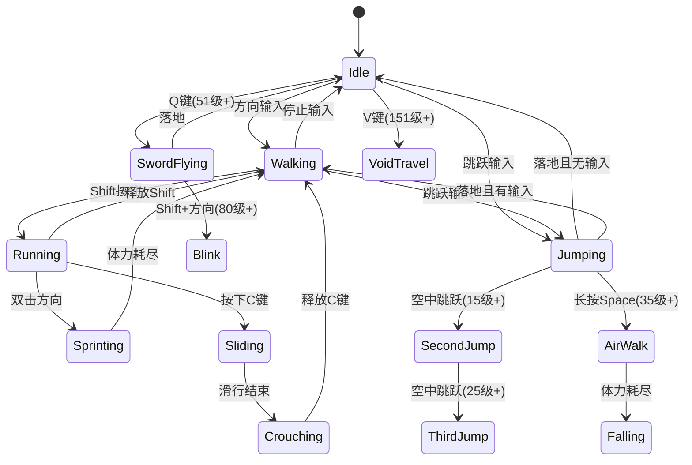

### 1.3 移动控制机制

#### 输入响应策略

| 输入类型 | 优先级 | 响应方式 | 缓冲时间 | 适用阶段 |
|---------|-------|---------|---------|---------|
| **键盘WASD** | 高 | 即时响应，八方向移动 | 100ms | 全阶段 |
| **手柄摇杆** | 高 | 模拟量输入，360度移动 | 50ms | 全阶段 |
| **鼠标点击移动** | 中 | 寻路移动，自动导航 | 无 | 武侠/仙侠 |
| **技能位移** | 最高 | 强制打断当前移动 | 无 | 全阶段 |
| **御剑飞行** | 高 | 三维空间自由移动 | 无 | 仙侠+ |
| **虚空穿梭** | 最高 | 目标点瞬移 | 无 | 玄幻 |

#### 转向平滑机制

- **武侠阶段**：Slerp球形插值，平滑系数0.1，模拟真实转身惯性
- **仙侠阶段**：转向速度提升30%，灵动飘逸
- **玄幻阶段**：瞬时转向，超凡脱俗

#### 移动加速模型

**武侠阶段**：
- 起步加速时间：0.2秒
- 停止滑行时间：0.3秒
- 加速曲线：缓入缓出（Ease In-Out）

**仙侠阶段**：
- 起步加速时间：0.1秒
- 停止滑行时间：0.15秒
- 加速曲线：快速启动（Ease Out）

**玄幻阶段**：
- 起步加速时间：0.05秒
- 停止滑行时间：0.1秒
- 加速曲线：线性瞬时响应

### 1.4 轻功与飞行系统

#### 轻功体系（武侠阶段）

**轻功等级**：

| 等级 | 名称 | 跳跃高度倍数 | 滞空时间 | 消耗 | 解锁境界 |
|------|------|-------------|---------|------|---------|
| 1级 | 燕子三抄水 | 1.5倍 | 1秒 | 10内力/秒 | 后天境 |
| 2级 | 蜻蜓点水 | 2.0倍 | 1.5秒 | 15内力/秒 | 先天境 |
| 3级 | 凌波微步 | 2.5倍 | 2秒 | 20内力/秒 | 宗师境 |
| 4级 | 踏雪无痕 | 3.0倍 | 3秒 | 25内力/秒 | 大宗师境 |
| 5级 | 御风而行 | 4.0倍 | 5秒 | 30内力/秒 | 破碎虚空境 |

**轻功特性**：
- 消耗内力维持轻功状态
- 内力耗尽自动下坠
- 可在空中施展轻身技能
- 落地有缓冲动画，避免硬着陆

#### 御剑飞行（仙侠阶段）

**飞行模式**：

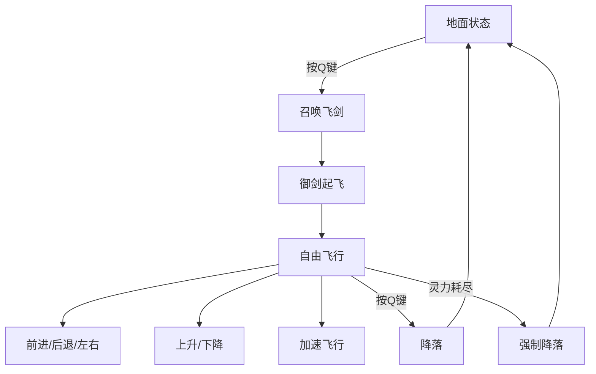

**飞行参数**：

| 参数 | 数值 | 说明 |
|------|------|------|
| 基础飞行速度 | 基础移动速度 × 4.0 | 显著快于地面移动 |
| 加速飞行速度 | 基础飞行速度 × 1.5 | 消耗灵力更快 |
| 最大飞行高度 | 地图允许上限 | 不同区域有不同限制 |
| 灵力消耗 | 10点/秒（普通）、25点/秒（加速） | 灵力决定飞行续航 |
| 起飞时间 | 0.8秒 | 召唤飞剑并跃上 |
| 降落时间 | 0.5秒 | 收剑落地 |

**飞行控制**：
- **WASD**：水平方向移动
- **Space**：上升
- **Ctrl**：下降
- **Shift**：加速飞行
- **鼠标**：调整飞行方向

#### 虚空穿梭（玄幻阶段）

**穿梭类型**：

| 类型 | 距离 | 冷却时间 | 元力消耗 | 使用场景 |
|------|------|---------|---------|---------|
| 短距瞬移 | 30米 | 3秒 | 50 | 战斗闪避 |
| 中距传送 | 300米 | 30秒 | 200 | 地图探索 |
| 长距跃迁 | 3公里 | 5分钟 | 1000 | 区域切换 |
| 星门传送 | 跨星球 | 无CD | 5000 | 星域航行 |

**穿梭机制**：
- 目标点必须可见或已探索
- 传送过程有0.5秒虚空特效
- 传送可被控制技能打断
- 战斗状态限制长距传送

### 1.5 地形适应系统

#### 地面检测

**检测分级**：
- **平地**：斜率 < 15度，正常移动
- **斜坡**：斜率15-45度，速度受影响
- **峭壁**：斜率 > 45度，需攀爬或轻功
- **水面**：触发游泳状态
- **空气墙**：不可通行边界

#### 台阶与障碍

| 高度范围 | 处理方式 | 动画表现 |
|---------|---------|---------|
| 0-0.3米 | 自动跨越 | 抬腿动画 |
| 0.3-1.0米 | 需跳跃 | 跳跃翻越 |
| 1.0-2.0米 | 轻功攀爬 | 轻功腾跃 |
| >2.0米 | 必须绕行或飞行 | 无法通过 |

#### 斜坡移动调整

| 斜率 | 上坡速度 | 下坡速度 | 体力消耗 |
|------|---------|---------|---------|
| 15-30度 | -10% | +10% | +20% |
| 30-45度 | -25% | +15% | +50% |
| >45度 | 无法行走 | 滑落 | 无 |

### 1.6 体力与能量系统

#### 能量体系演进

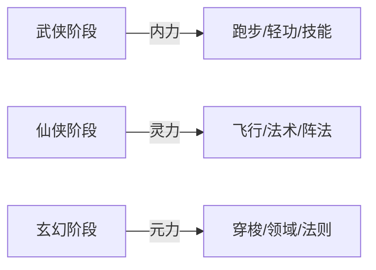

#### 内力系统（武侠）

| 动作 | 消耗速率 | 恢复速率 | 最低保留 |
|------|---------|---------|---------|
| 冲刺 | 20点/秒 | 站立10点/秒 | 10% |
| 轻功 | 15-30点/秒 | 落地后2秒开始 | 0% |
| 滑行 | 10点/秒 | 停止后1秒开始 | 5% |
| 武技施展 | 技能固定消耗 | 打坐50点/秒 | 技能要求 |

**内力上限**：
- 初始：1000点
- 每级提升：50点
- 装备加成：可提升至5000点

#### 灵力系统（仙侠）

| 动作 | 消耗速率 | 恢复速率 | 最低保留 |
|------|---------|---------|---------|
| 御剑飞行 | 10点/秒 | 落地15点/秒 | 5% |
| 加速飞行 | 25点/秒 | 静坐80点/秒 | 10% |
| 法术施展 | 技能固定消耗 | 吸收天地灵气 | 技能要求 |
| 法宝驱动 | 20点/秒 | 灵石补充 | 15% |

**灵力上限**：
- 初始（51级）：10000点
- 每级提升：200点
- 法宝加成：可提升至50000点

#### 元力系统（玄幻）

| 动作 | 消耗量 | 恢复方式 | 最低保留 |
|------|-------|---------|---------|
| 短距瞬移 | 50点 | 自动恢复100点/秒 | 无 |
| 中距传送 | 200点 | 吸收星辰之力 | 无 |
| 长距跃迁 | 1000点 | 元晶补充 | 无 |
| 法则领悟 | 持续消耗 | 冥想恢复 | 20% |

**元力上限**：
- 初始（151级）：100000点
- 每级提升：1000点
- 神器加成：可提升至1000000点

---

## 二、五行武技系统

### 2.1 五行理论基础

五行武技系统是游戏战斗的核心机制，贯穿武侠、仙侠、玄幻三个阶段，随着角色成长不断演化。

#### 五行相生相克关系

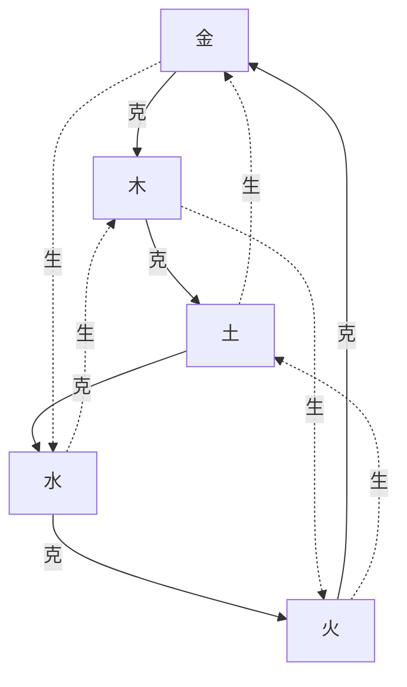

**五行属性定义**：

| 五行 | 属性特征 | 代表元素 | 战斗风格 | 颜色标识 |
|------|---------|---------|---------|---------|
| **金** | 锋锐、坚硬 | 金属、兵器 | 爆发高伤、破甲 | 金色 |
| **木** | 生长、韧性 | 植物、生命 | 持续恢复、控制 | 绿色 |
| **水** | 流动、柔和 | 水流、寒冰 | 减速、灵活闪避 | 蓝色 |
| **火** | 炽热、爆裂 | 火焰、雷电 | 范围伤害、灼烧 | 红色 |
| **土** | 厚重、防御 | 大地、岩石 | 高防护、反伤 | 黄色 |

#### 相生相克机制

**克制关系**：
- 攻击属性克制目标属性时：伤害 +50%
- 攻击属性被目标属性克制时：伤害 -30%
- 相同属性攻击：伤害无加成

**相生关系**：
- 使用五行相生的技能组合时：下一个技能伤害 +30%
- 例如：木生火，先释放木系技能再释放火系技能，火系技能伤害提升30%
- 连续相生组合（如金→水→木→火）：每次相生额外叠加10%伤害加成
- 最多可叠加5次相生效果，总计伤害提升150%

**五行平衡**：
- 角色同时装备五种属性的技能时，激活「五行归一」状态
- 获得全属性抗性+20%
- 获得全属性伤害+15%
- 技能冷却时间-10%
- 自身携带相生属性时：增益效果 +30%
- 例如：金生水，金属性角色使用水属性技能时，水技能效果提升30%

**五行平衡**：
- 角色可同时修炼多种五行属性
- 建议主修1-2种，辅修2-3种
- 五行齐全可触发"五行轮转"特殊状态

### 2.2 武侠阶段 - 五行武技

#### 武技分类

**金系武技**：

| 技能名称 | 等级要求 | 类型 | 效果描述 | 内力消耗 | 冷却时间 |
|---------|---------|------|---------|---------|---------|
| 金刚掌 | 1级 | 单体攻击 | 造成150%物理伤害，附带破甲效果 | 50 | 5秒 |
| 金蛇剑法 | 10级 | 连击 | 快速三连斩，每击造成80%伤害 | 80 | 8秒 |
| 金钟罩 | 20级 | 防御 | 5秒内减少50%受到的伤害 | 100 | 30秒 |
| 金刚不坏体 | 35级 | 增益 | 10秒免疫控制，提升30%防御 | 150 | 60秒 |
| 万剑归宗 | 50级 | 大招 | 召唤无数金剑攻击范围内敌人 | 300 | 120秒 |

**木系武技**：

| 技能名称 | 等级要求 | 类型 | 效果描述 | 内力消耗 | 冷却时间 |
|---------|---------|------|---------|---------|---------|
| 缠藤术 | 1级 | 控制 | 藤蔓缠绕目标，定身2秒 | 40 | 10秒 |
| 春风化雨 | 15级 | 治疗 | 恢复自身或友方30%生命值 | 100 | 20秒 |
| 木遁 | 25级 | 位移 | 瞬间移动至30米内树木位置 | 80 | 15秒 |
| 万木森林 | 40级 | 范围控制 | 召唤树木群，困住区域内敌人 | 200 | 90秒 |
| 生命之树 | 50级 | 持续治疗 | 召唤生命之树，范围内持续恢复 | 250 | 120秒 |

**水系武技**：

| 技能名称 | 等级要求 | 类型 | 效果描述 | 内力消耗 | 冷却时间 |
|---------|---------|------|---------|---------|---------|
| 冰锥术 | 1级 | 远程攻击 | 发射冰锥，造成120%伤害并减速 | 45 | 6秒 |
| 水遁 | 18级 | 位移 | 化为水流快速移动，免疫伤害1秒 | 90 | 20秒 |
| 冰封千里 | 30级 | 范围控制 | 冰冻范围内敌人3秒 | 150 | 45秒 |
| 水月镜花 | 42级 | 幻术 | 创造幻象迷惑敌人 | 120 | 30秒 |
| 惊涛骇浪 | 50级 | 大招 | 召唤巨浪席卷战场 | 300 | 120秒 |

**火系武技**：

| 技能名称 | 等级要求 | 类型 | 效果描述 | 内力消耗 | 冷却时间 |
|---------|---------|------|---------|---------|---------|
| 火球术 | 1级 | 远程攻击 | 发射火球，造成140%伤害并灼烧 | 50 | 5秒 |
| 烈焰掌 | 12级 | 近战爆发 | 近距离火焰爆发，范围伤害 | 85 | 10秒 |
| 火墙 | 22级 | 范围控制 | 召唤火墙阻挡敌人前进 | 110 | 25秒 |
| 凤凰涅槃 | 38级 | 复活 | 死亡时触发，满血复活一次 | 被动 | 300秒 |
| 九天玄火 | 50级 | 大招 | 天降陨火，大范围持续伤害 | 350 | 120秒 |

**土系武技**：

| 技能名称 | 等级要求 | 类型 | 效果描述 | 内力消耗 | 冷却时间 |
|---------|---------|------|---------|---------|---------|
| 巨石术 | 1级 | 远程攻击 | 投掷巨石，造成130%伤害并击退 | 55 | 7秒 |
| 土遁 | 16级 | 防御 | 遁入地下，免疫伤害2秒 | 100 | 25秒 |
| 大地之盾 | 28级 | 护盾 | 生成护盾吸收伤害 | 120 | 30秒 |
| 地刺阵 | 36级 | 陷阱 | 设置地刺陷阱，触发造成伤害 | 140 | 40秒 |
| 山河倒转 | 50级 | 大招 | 召唤大地之力，改变地形 | 400 | 150秒 |

#### 五行连招系统

**连招机制**：
- 不同五行技能可组合形成连招
- 连招成功触发额外效果
- 相生连招：增益强化
- 相克连招：伤害爆发

**连招示例**：

| 连招名称 | 技能组合 | 触发效果 | 难度 |
|---------|---------|---------|------|
| 金水相生 | 金蛇剑法 → 冰锥术 | 冰锥伤害提升30%，附带破甲 | ★★ |
| 水木相生 | 冰封千里 → 万木森林 | 冰冻时间延长1秒，树木生长更快 | ★★★ |
| 木火相生 | 缠藤术 → 火球术 | 火球必定暴击，藤蔓燃烧持续伤害 | ★★ |
| 火土相生 | 烈焰掌 → 地刺阵 | 地刺附带灼烧，火焰范围扩大 | ★★★ |
| 土金相生 | 大地之盾 → 金刚掌 | 护盾反弹伤害，金刚掌伤害提升 | ★★★★ |
| 金克木连杀 | 金刚掌 → 万剑归宗 | 对木属性敌人伤害翻倍 | ★★★★★ |
| 五行轮转 | 金→木→水→火→土 | 全属性强化，进入超凡状态10秒 | ★★★★★ |

### 2.3 仙侠阶段 - 五行仙术

#### 仙术升华

进入仙侠阶段后，武技升华为仙术，威力和范围大幅提升：

**金系仙术**：

| 仙术名称 | 等级要求 | 类型 | 效果描述 | 灵力消耗 | 冷却时间 |
|---------|---------|------|---------|---------|---------|
| 庚金剑气 | 51级 | 远程斩击 | 发射剑气，可穿透多个敌人 | 200 | 8秒 |
| 金刚伏魔阵 | 65级 | 阵法 | 布置防御阵法，范围内友军防御+50% | 500 | 60秒 |
| 万剑诛仙阵 | 80级 | 大阵 | 召唤剑阵持续攻击敌人 | 1000 | 120秒 |
| 太白剑意 | 100级 | 剑道领悟 | 剑意纵横，一剑斩杀范围内敌人 | 2000 | 180秒 |
| 九天玄金诀 | 120级 | 终极仙术 | 沟通九天玄金之力，全屏攻击 | 5000 | 300秒 |

**木系仙术**：

| 仙术名称 | 等级要求 | 类型 | 效果描述 | 灵力消耗 | 冷却时间 |
|---------|---------|------|---------|---------|---------|
| 乙木神雷 | 51级 | 范围攻击 | 召唤神雷劈向敌人，附带麻痹 | 250 | 10秒 |
| 青木长生诀 | 70级 | 恢复 | 大范围持续恢复，可复活倒地队友 | 800 | 90秒 |
| 建木通天 | 90级 | 召唤 | 召唤建木连接天地，范围控制 | 1500 | 150秒 |
| 万灵归元 | 110级 | 群体增益 | 所有友军全属性提升50% | 2500 | 200秒 |
| 东方青龙诀 | 130级 | 终极仙术 | 召唤青龙神兽协同作战 | 6000 | 300秒 |

**水系仙术**：

| 仙术名称 | 等级要求 | 类型 | 效果描述 | 灵力消耗 | 冷却时间 |
|---------|---------|------|---------|---------|---------|
| 壬水冰封 | 51级 | 范围控制 | 大范围冰封，持续5秒 | 300 | 15秒 |
| 沧海潮生 | 75级 | 召唤 | 召唤海潮淹没战场 | 1000 | 100秒 |
| 九天玄冰 | 95级 | 绝对零度 | 极寒冰冻，敌人无法行动 | 1800 | 160秒 |
| 水月洞天 | 115级 | 领域 | 开辟水之领域，主场作战 | 3000 | 240秒 |
| 北方玄武诀 | 135级 | 终极仙术 | 召唤玄武神兽，攻防兼备 | 7000 | 300秒 |

**火系仙术**：

| 仙术名称 | 等级要求 | 类型 | 效果描述 | 灵力消耗 | 冷却时间 |
|---------|---------|------|---------|---------|---------|
| 丙火焚天 | 51级 | 范围爆破 | 天火降世，大范围持续灼烧 | 350 | 12秒 |
| 三昧真火 | 68级 | 特殊火焰 | 释放三昧真火，万物皆可焚 | 900 | 80秒 |
| 赤焰业火 | 88级 | 业火审判 | 业火燃烧敌人罪孽，伤害随罪恶值提升 | 1600 | 140秒 |
| 太阳金炎 | 108级 | 至高火焰 | 太阳之火焚尽一切 | 2800 | 220秒 |
| 南方朱雀诀 | 128级 | 终极仙术 | 召唤朱雀神兽，浴火重生 | 6500 | 300秒 |

**土系仙术**：

| 仙术名称 | 等级要求 | 类型 | 效果描述 | 灵力消耗 | 冷却时间 |
|---------|---------|------|---------|---------|---------|
| 戊土镇压 | 51级 | 控制 | 大地之力镇压敌人，无法移动 | 280 | 18秒 |
| 须弥山 | 72级 | 召唤 | 召唤须弥山镇压一切 | 1100 | 110秒 |
| 大地脉动 | 92级 | 范围爆发 | 引动地脉之力，范围震荡 | 1700 | 150秒 |
| 山河社稷图 | 112级 | 封印 | 展开社稷图封印敌人 | 3200 | 250秒 |
| 中央麒麟诀 | 132级 | 终极仙术 | 召唤麒麟神兽，万法不侵 | 7500 | 300秒 |

#### 五行仙阵系统

**仙阵类型**：

| 阵法名称 | 五行组合 | 效果 | 人数要求 | 阵法等级 |
|---------|---------|------|---------|---------|
| 五行颠倒阵 | 金木水火土齐全 | 颠倒五行，敌我属性互换 | 5人 | 高级 |
| 两仪微尘阵 | 金水 或 木火 | 阴阳交错，困敌于阵中 | 2人 | 中级 |
| 三才聚灵阵 | 任意三行 | 汇聚天地灵气，快速恢复 | 3人 | 中级 |
| 四象诛仙阵 | 金木水火 | 四象之力绞杀敌人 | 4人 | 高级 |
| 五行生克阵 | 金木水火土齐全 | 循环生克，无穷无尽 | 5人 | 超级 |
| 八卦封魔阵 | 主五行+辅三行 | 封印强敌，削弱能力 | 8人 | 超级 |

### 2.4 玄幻阶段 - 五行法则

#### 法则领悟

进入玄幻阶段后，五行从技能升华为法则，掌控宇宙基本规律：

**金之法则**：

| 法则能力 | 等级要求 | 效果描述 | 元力消耗 | 持续时间 |
|---------|---------|---------|---------|---------|
| 金之锋锐 | 151级 | 攻击无视50%防御 | 1000/秒 | 持续 |
| 金之不灭 | 170级 | 肉身不朽，免疫物理伤害 | 2000/秒 | 持续 |
| 金之领域 | 190级 | 展开金之领域，范围内绝对压制 | 5000 | 60秒 |
| 金之本源 | 220级 | 沟通金之本源，掌控金属性宇宙 | 10000 | 30秒 |
| 金之世界 | 250级 | 创造金之世界，主宰一切 | 50000 | 10秒 |

**木之法则**：

| 法则能力 | 等级要求 | 效果描述 | 元力消耗 | 持续时间 |
|---------|---------|---------|---------|---------|
| 木之生机 | 151级 | 无限恢复，濒死瞬间回满 | 800/秒 | 持续 |
| 木之永生 | 165级 | 获得永生特性，无法被杀死 | 2500/秒 | 持续 |
| 木之领域 | 185级 | 展开生命领域，万物复苏 | 4500 | 60秒 |
| 木之本源 | 210级 | 掌控生命本源，创造生命 | 12000 | 30秒 |
| 木之世界 | 240级 | 创造生命世界，繁衍万物 | 48000 | 10秒 |

**水之法则**：

| 法则能力 | 等级要求 | 效果描述 | 元力消耗 | 持续时间 |
|---------|---------|---------|---------|---------|
| 水之流动 | 151级 | 自由穿梭空间，无视障碍 | 1200/秒 | 持续 |
| 水之无形 | 175级 | 化为无形，免疫一切攻击 | 2800/秒 | 持续 |
| 水之领域 | 195级 | 展开水之领域，掌控液态 | 5500 | 60秒 |
| 水之本源 | 225级 | 掌控水之本源，操控星海 | 11000 | 30秒 |
| 水之世界 | 260级 | 创造水之世界，海纳百川 | 55000 | 10秒 |

**火之法则**：

| 法则能力 | 等级要求 | 效果描述 | 元力消耗 | 持续时间 |
|---------|---------|------|---------|---------|
| 火之毁灭 | 151级 | 焚烧万物，无物不燃 | 1500/秒 | 持续 |
| 火之涅槃 | 180级 | 无限复活，越战越强 | 3000/秒 | 持续 |
| 火之领域 | 200级 | 展开火之领域，焚尽天地 | 6000 | 60秒 |
| 火之本源 | 230级 | 掌控火之本源，燃烧星辰 | 13000 | 30秒 |
| 火之世界 | 270级 | 创造火之世界，永恒烈焰 | 60000 | 10秒 |

**土之法则**：

| 法则能力 | 等级要求 | 效果描述 | 元力消耗 | 持续时间 |
|---------|---------|---------|---------|---------|
| 土之厚重 | 151级 | 防御力提升1000%，无法被击退 | 900/秒 | 持续 |
| 土之永固 | 160级 | 绝对防御，免疫控制和伤害 | 2200/秒 | 持续 |
| 土之领域 | 180级 | 展开大地领域，镇压一切 | 4000 | 60秒 |
| 土之本源 | 205级 | 掌控土之本源，操控星球 | 9000 | 30秒 |
| 土之世界 | 230级 | 创造大地世界，承载万物 | 45000 | 10秒 |

#### 法则融合

**融合法则**：

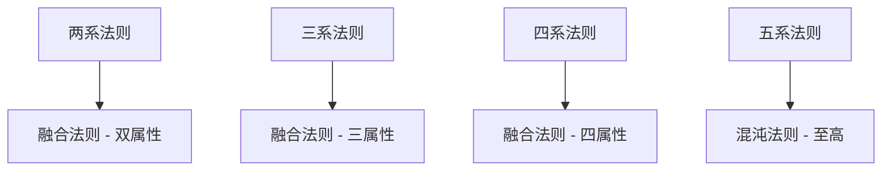

| 融合类型 | 要求 | 效果 | 难度 |
|---------|------|------|------|
| 两系融合 | 同时领悟两种法则至少3级 | 创造新属性法则 | ★★★ |
| 三系融合 | 同时领悟三种法则至少4级 | 天地大道初成 | ★★★★ |
| 四系融合 | 同时领悟四种法则至少5级 | 接近混沌 | ★★★★★ |
| 五系融合 | 五行法则全部圆满 | 混沌法则，超越五行 | ★★★★★★ |

**混沌法则**：
- 超越五行限制
- 可创造和毁灭宇宙
- 掌控时间与空间
- 成为宇宙主宰

---

## 三、角色成长系统

### 3.1 境界体系

#### 武侠阶段境界（1-50级）

| 境界名称 | 等级范围 | 突破条件 | 能力提升 | 解锁内容 |
|---------|---------|---------|---------|---------|
| 后天境 | 1-10级 | 初始境界 | 基础属性 | 基础武技 |
| 先天境 | 11-20级 | 打通经脉 | 内力上限+50% | 轻功二段跳 |
| 宗师境 | 21-30级 | 领悟武道真意 | 攻击力+100% | 高级武技 |
| 大宗师境 | 31-40级 | 凝聚武道意志 | 全属性+150% | 绝学武技 |
| 破碎虚空境 | 41-50级 | 打破空间壁垒 | 全属性+200% | 准备飞升 |

#### 仙侠阶段境界（51-150级）

| 境界名称 | 等级范围 | 突破条件 | 能力提升 | 解锁内容 |
|---------|---------|---------|---------|---------|
| 筑基期 | 51-65级 | 筑仙道之基 | 转换灵力系统 | 御剑飞行 |
| 金丹期 | 66-80级 | 凝结金丹 | 寿命延长至500年 | 炼制法宝 |
| 元婴期 | 81-95级 | 元婴出窍 | 元婴可独立战斗 | 布置仙阵 |
| 化神期 | 96-110级 | 化神通天 | 神识覆盖千里 | 炼制丹药 |
| 合体期 | 111-125级 | 元婴与肉身合一 | 全属性+500% | 召唤神兽 |
| 渡劫期 | 126-140级 | 经历天劫 | 肉身成圣 | 大乘仙术 |
| 大乘期 | 141-150级 | 仙道圆满 | 准备飞升上界 | 终极仙术 |

#### 玄幻阶段境界（151-300级）

| 境界名称 | 等级范围 | 突破条件 | 能力提升 | 解锁内容 |
|---------|---------|---------|---------|---------|
| 真仙境 | 151-170级 | 飞升仙界 | 转换元力系统 | 初级法则 |
| 玄仙境 | 171-190级 | 领悟玄妙 | 掌控空间 | 中级法则 |
| 金仙境 | 191-210级 | 金仙不朽 | 不死不灭 | 高级法则 |
| 太乙境 | 211-230级 | 太乙救苦 | 掌控时间 | 时空法则 |
| 大罗境 | 231-250级 | 大罗金仙 | 超脱命运 | 命运法则 |
| 准圣境 | 251-270级 | 圣人之下 | 接近混沌 | 混沌法则 |
| 圣人境 | 271-290级 | 证道成圣 | 不死不灭 | 创世法则 |
| 天道境 | 291-300级 | 合道天道 | 宇宙主宰 | 至高权限 |

### 3.2 突破系统

#### 突破机制

**突破流程**：

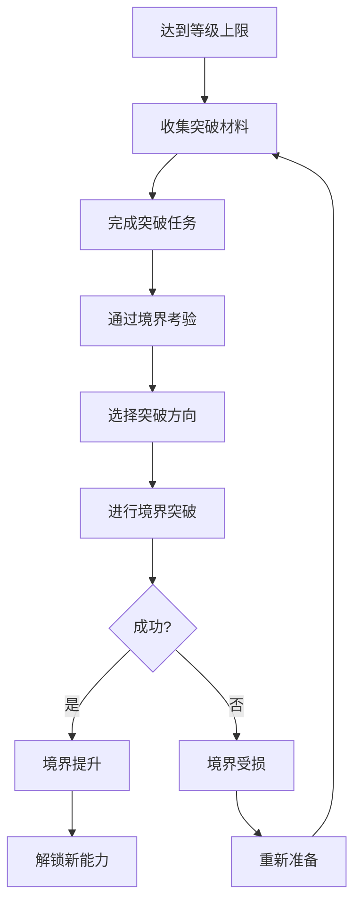

**突破要求**：

| 阶段 | 突破难度 | 材料需求 | 任务类型 | 成功率 |
|------|---------|---------|---------|--------|
| 武侠→仙侠 | ★★★★ | 天材地宝×10 | 击败试炼boss | 70% |
| 仙侠初期突破 | ★★★ | 灵石×1000 | 感悟天地 | 80% |
| 仙侠中期突破 | ★★★★ | 仙草×50 | 经历天劫 | 60% |
| 仙侠→玄幻 | ★★★★★ | 仙晶×100 | 飞升天劫 | 40% |
| 玄幻期突破 | ★★★★★ | 神石×1000 | 领悟法则 | 50% |
| 圣人境突破 | ★★★★★★ | 混沌精华×1 | 证道成圣 | 10% |

#### 突破失败惩罚

- **轻度失败**：等级降低1级，重新尝试
- **中度失败**：境界受损，属性降低20%，需修养恢复
- **重度失败**：境界跌落，掉落一个大境界
- **走火入魔**：小概率触发，需特殊任务解除

### 3.3 属性成长

#### 基础属性

| 属性名称 | 初始值 | 每级成长 | 装备加成 | 境界加成 |
|---------|-------|---------|---------|---------|
| 生命值 | 1000 | +50 | +500% | +1000% |
| 内力/灵力/元力 | 1000 | +50/200/1000 | +300% | +800% |
| 物理攻击 | 100 | +10 | +400% | +600% |
| 法术攻击 | 100 | +10 | +400% | +600% |
| 物理防御 | 50 | +5 | +300% | +500% |
| 法术防御 | 50 | +5 | +300% | +500% |
| 暴击率 | 5% | +0.2% | +50% | +30% |
| 暴击伤害 | 150% | +1% | +100% | +50% |
| 命中率 | 90% | +0.1% | +10% | +5% |
| 闪避率 | 5% | +0.2% | +30% | +20% |

#### 五行属性

| 五行属性 | 获取方式 | 上限 | 效果 |
|---------|---------|------|------|
| 金属性值 | 修炼金系技能 | 10000 | 提升金系伤害和抗性 |
| 木属性值 | 修炼木系技能 | 10000 | 提升木系伤害和抗性 |
| 水属性值 | 修炼水系技能 | 10000 | 提升水系伤害和抗性 |
| 火属性值 | 修炼火系技能 | 10000 | 提升火系伤害和抗性 |
| 土属性值 | 修炼土系技能 | 10000 | 提升土系伤害和抗性 |

**属性平衡机制**：
- 单一属性达到8000时，其他属性成长速度-50%
- 五行平衡（每项2000±200）时，获得"五行和谐"buff
- 五行齐满（每项10000）时，可尝试领悟混沌法则

---

## 四、技能动画系统

### 4.1 动画分层策略

#### 动画层级结构

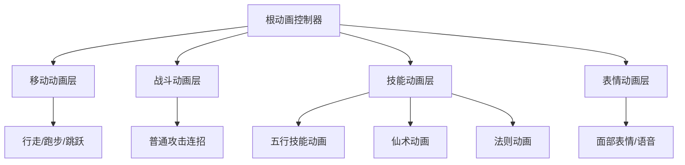

**动画优先级**：

| 优先级 | 动画类型 | 可被打断 | 融合方式 |
|-------|---------|---------|---------|
| 1（最高） | 技能施放动画 | 否 | 覆盖全身 |
| 2 | 战斗连招动画 | 可被技能打断 | 覆盖上半身 |
| 3 | 移动动画 | 可被任何动作打断 | 下半身主导 |
| 4 | 待机动画 | 持续播放 | 全身循环 |
| 5（最低） | 表情动画 | 独立播放 | 仅面部 |

### 4.2 武侠阶段动画

#### 基础动作动画

| 动画名称 | 时长 | 触发条件 | 循环 | 过渡时间 |
|---------|------|---------|------|---------|
| 待机 | 循环 | 无输入 | 是 | 0.2秒 |
| 行走 | 循环 | 慢速移动 | 是 | 0.15秒 |
| 跑步 | 循环 | 快速移动 | 是 | 0.1秒 |
| 冲刺起步 | 0.3秒 | 双击方向键 | 否 | 0.05秒 |
| 冲刺中 | 循环 | 冲刺状态 | 是 | 无 |
| 急停 | 0.4秒 | 突然停止 | 否 | 即时 |
| 跳跃起跳 | 0.2秒 | 按下跳跃键 | 否 | 0.05秒 |
| 跳跃滞空 | 循环 | 空中 | 是 | 无 |
| 跳跃落地 | 0.3秒 | 着陆 | 否 | 即时 |
| 二段跳 | 0.25秒 | 空中跳跃 | 否 | 即时 |
| 三段跳 | 0.3秒 | 第三次跳跃 | 否 | 即时 |
| 轻功飞跃 | 0.8秒 | 长按跳跃 | 否 | 0.1秒 |
| 滑行 | 0.6秒 | 跑步下蹲 | 否 | 即时 |

#### 武技动画

**金系武技动画**：

| 技能 | 动画时长 | 关键帧 | 特效触发时机 | 可移动 |
|------|---------|-------|-------------|--------|
| 金刚掌 | 0.8秒 | 蓄力→出掌→收势 | 0.4秒 | 否 |
| 金蛇剑法 | 1.2秒 | 三连斩 | 0.3/0.6/0.9秒 | 可缓慢移动 |
| 金钟罩 | 0.5秒 | 双手合十 | 0.3秒 | 是 |
| 万剑归宗 | 3.0秒 | 剑指天空→剑雨降临 | 1.5秒开始 | 否 |

**木系武技动画**：

| 技能 | 动画时长 | 关键帧 | 特效触发时机 | 可移动 |
|------|---------|-------|-------------|--------|
| 缠藤术 | 0.6秒 | 手指地面 | 0.3秒 | 是 |
| 春风化雨 | 1.0秒 | 双手画圆 | 0.5秒 | 可缓慢移动 |
| 木遁 | 0.4秒 | 化为绿光 | 即时 | 瞬移 |
| 生命之树 | 2.0秒 | 种子→生长→开花 | 1.0秒开始 | 否 |

**火系武技动画**：

| 技能 | 动画时长 | 关键帧 | 特效触发时机 | 可移动 |
|------|---------|-------|-------------|--------|
| 火球术 | 0.7秒 | 凝聚→发射 | 0.5秒 | 否 |
| 烈焰掌 | 0.9秒 | 蓄力→爆发 | 0.6秒 | 否 |
| 九天玄火 | 3.5秒 | 召唤天火→降临 | 2.0秒开始 | 否 |

### 4.3 仙侠阶段动画

#### 仙侠特有动画

| 动画名称 | 时长 | 描述 | 循环 |
|---------|------|------|------|
| 御剑飞行 - 起飞 | 0.8秒 | 召唤飞剑并跃上 | 否 |
| 御剑飞行 - 飞行 | 循环 | 站立于飞剑上，衣袂飘飘 | 是 |
| 御剑飞行 - 加速 | 循环 | 俯身前倾，剑气纵横 | 是 |
| 御剑飞行 - 降落 | 0.5秒 | 收剑落地 | 否 |
| 打坐修炼 | 循环 | 盘膝而坐，灵气环绕 | 是 |
| 布置阵法 | 2.0秒 | 手结法印，阵纹浮现 | 否 |
| 炼制丹药 | 3.0秒 | 丹炉炼制，光华四射 | 否 |
| 元婴出窍 | 1.5秒 | 元婴飞出体外 | 否 |
| 渡劫 | 5.0秒 | 承受天劫轰击 | 否 |

#### 仙术动画

**高级仙术动画特点**：
- 施法动画更加华丽复杂
- 引导时间更长（1-3秒）
- 大范围特效覆盖
- 多段动画连接
- 天地异象配合

**示例 - 九天玄金诀**：
1. **起手式（0-1秒）**：双手结印，金光环绕
2. **引导式（1-3秒）**：沟通九天玄金之力，天空出现金色漩涡
3. **爆发式（3-5秒）**：金色光柱从天而降，覆盖全场
4. **收尾式（5-6秒）**：光芒散去，角色缓缓落地

### 4.4 玄幻阶段动画

#### 法则动画

**法则施展特征**：
- 不需要繁复手势，念头即至
- 法则之力扭曲空间
- 宇宙异象伴随
- 时间感知扭曲

**法则动画表**：

| 法则类型 | 动画表现 | 持续时间 | 视觉效果 |
|---------|---------|---------|---------|
| 金之法则 | 周身金光，万物化剑 | 持续状态 | 金色粒子流动 |
| 木之法则 | 生机盎然，草木共生 | 持续状态 | 绿色生命光辉 |
| 水之法则 | 水流环绕，虚实转换 | 持续状态 | 水波纹特效 |
| 火之法则 | 业火焚身，浴火重生 | 持续状态 | 火焰粒子环绕 |
| 土之法则 | 厚土承载，岿然不动 | 持续状态 | 大地纹路浮现 |
| 混沌法则 | 五色神光，混沌初开 | 爆发状态 | 空间扭曲，时间静止 |

#### 终极形态动画

**圣人形态**：
- 身后浮现圣人虚影
- 脚踏金莲或祥云
- 头顶功德光环
- 三千大道环绕

**天道合一**：
- 化身宇宙意志
- 星辰为体，星河为血
- 举手投足间星辰陨落
- 一念之间创造与毁灭

### 4.5 动画融合技术

#### IK（反向运动学）应用

**应用场景**：
- 脚部贴合地形
- 手部抓取物品（法宝、武器）
- 视线跟随目标
- 攻击动作自动调整

**融合策略**：

| 场景 | 上半身动画 | 下半身动画 | 融合权重 |
|------|-----------|-----------|---------|
| 移动中攻击 | 攻击动作 | 移动动作 | 70% / 30% |
| 跳跃中施法 | 施法动作 | 跳跃动作 | 80% / 20% |
| 飞行中战斗 | 战斗动作 | 飞行姿态 | 90% / 10% |
| 受击硬直 | 受击动画 | 原地动画 | 100% / 0% |

#### 根骨运动（Root Motion）

**启用场景**：
- 冲刺动作
- 闪避翻滚
- 技能位移
- 连招位移

**不启用场景**：
- 普通行走跑步（由控制器驱动）
- 待机动画
- 原地施法

### 4.6 动画事件系统

#### 事件类型

| 事件名称 | 触发时机 | 作用 | 示例 |
|---------|---------|------|------|
| PlaySound | 动画关键帧 | 播放音效 | 脚步声、剑鸣声 |
| SpawnEffect | 技能动画特定帧 | 生成特效 | 火球、剑气 |
| DealDamage | 攻击判定帧 | 造成伤害 | 剑刃触碰瞬间 |
| EnableMovement | 技能动画结束前 | 允许移动 | 技能后摇 |
| TriggerCombo | 连招窗口 | 允许下一招 | 连招衔接点 |
| CameraShake | 重击落地 | 相机震动 | 坠地、爆炸 |

---

## 五、战斗系统

### 5.1 战斗系统目标

构建一个融合《燕云十六声》卸势防御机制、五行相克战斗策略、以及多阶段成长演进的综合战斗系统。

### 5.2 战斗核心机制

#### 攻击类型

| 攻击类型 | 特点 | 应对方式 | 破解方式 |
|---------|------|---------|---------|
| 普通攻击 | 快速连续 | 防御/闪避 | 卸势 |
| 重击 | 伤害高、前摇长 | 完美闪避 | 打断 |
| 技能攻击 | 消耗能量 | 特定防御 | 属性克制 |
| 必杀技 | 伤害极高 | 紧急闪避/# 客户端核心功能开发设计文档

## 文档概述

### 文档目的
本文档定义客户端核心游戏玩法功能的战略设计，包括角色移动系统、技能动画系统、战斗机制，以及基于五行相生相克的武技体系和从武侠到仙侠再到玄幻的成长路线。文档专注于系统的意图、价值、结构和策略层面。

### 目标受众
- 客户端开发团队
- 游戏设计团队
- 技术架构师
- 项目管理人员

### 世界观概述

游戏世界分为三个主要境界层次，角色将经历从凡人武者到宇宙探索者的成长历程：

| 境界阶段 | 世界范围 | 核心玩法特征 | 力量体系 |
|---------|---------|-------------|---------|
| **武侠境界** | 江湖大陆 | 武学修炼、门派争斗、江湖恩怨 | 内力、武技、轻功 |
| **仙侠境界** | 修真世界 | 灵气修炼、法宝炼制、仙门争霸 | 灵力、法术、飞行 |
| **玄幻境界** | 诸天宇宙 | 位面探索、宇宙征战、法则领悟 | 源力、神通、空间穿梭 |

---

## 系统架构概览

### 核心系统关系

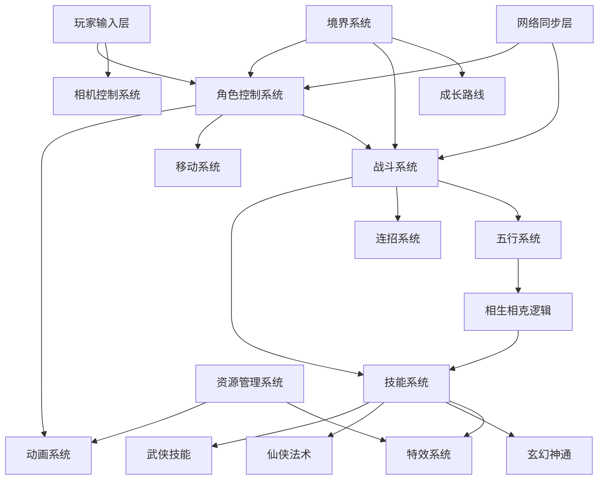

### 系统分层职责

| 层级 | 系统组件 | 核心职责 |
|------|---------|---------|
| **输入层** | 输入管理器 | 捕获并规范化玩家输入，支持键盘、手柄、触控 |
| **控制层** | 角色控制器、相机控制器 | 将输入转换为角色行为和视角调整，遵循职责分离原则 |
| **逻辑层** | 移动系统、战斗系统、技能系统、五行系统 | 执行游戏核心玩法逻辑与规则验证 |
| **成长层** | 境界系统、修炼系统 | 管理角色成长路线与能力解锁 |
| **表现层** | 动画系统、特效系统 | 视觉反馈与沉浸式体验呈现 |
| **同步层** | 网络同步 | 多人游戏状态一致性保证 |

---

## 一、角色移动系统

### 1.1 系统目标

角色移动系统根据角色境界提供不同层次的移动能力，从基础的武侠轻功到仙侠御空飞行，再到玄幻的空间穿梭，确保流畅的操作体验和视觉反馈。

**设计原则**：
- 角色移动完全由PlayerController控制，相机仅负责跟随和视角调整
- 禁止通过相机移动反向带动角色位置
- 角色位置更新完全由自身控制器决定

### 1.2 移动状态模型（按境界分层）

#### 武侠境界移动状态

| 状态 | 触发条件 | 行为特征 | 速度系数 | 消耗 |
|------|---------|---------|---------|------|
| **待机** | 无输入且落地 | 静止站立，呼吸动画 | 0.0 | 无 |
| **行走** | 方向键输入 | 基础移动 | 1.0 | 无 |
| **奔跑** | Shift + 方向键 | 快速移动 | 2.0 | 微量内力 |
| **冲刺** | 双击方向键 | 爆发性短距离位移 | 3.5 | 中量内力 |
| **跳跃** | Space键 | 垂直跃起 | 保持水平速度 | 少量内力 |
| **二段跳** | 空中再按Space | 空中跃起 | 保持水平速度 | 中量内力 |
| **轻功滑翔** | 跳跃后长按Space | 缓慢下落，水平移动 | 1.5 | 持续消耗内力 |
| **蹲伏** | C键 | 降低身形 | 0.5 | 无 |
| **翻滚闪避** | 移动中按闪避键 | 快速翻滚 | 2.0 | 中量内力 |
| **水上漂** | 高速移动接触水面 | 短暂水上移动 | 2.0 | 持续消耗内力 |

#### 仙侠境界移动状态（继承武侠 + 新增）

| 状态 | 触发条件 | 行为特征 | 速度系数 | 消耗 |
|------|---------|---------|---------|------|
| **御剑飞行** | 双击Space或特定按键 | 离地飞行，自由控制高度 | 4.0 | 持续消耗灵力 |
| **瞬移** | 技能键 + 方向 | 短距离空间闪烁 | 瞬间位移 | 大量灵力 |
| **御风术** | 飞行中加速 | 高速飞行 | 6.0 | 快速消耗灵力 |
| **凌空虚渡** | 特定环境 | 超长距离滑翔 | 3.0 | 缓慢消耗灵力 |
| **缩地成寸** | 长按瞬移键 | 持续快速移动 | 5.0 | 持续消耗灵力 |

#### 玄幻境界移动状态（继承仙侠 + 新增）

| 状态 | 触发条件 | 行为特征 | 速度系数 | 消耗 |
|------|---------|---------|---------|------|
| **破空飞行** | 宇宙中自动激活 | 星际级别移动 | 20.0 | 微量源力 |
| **空间跳跃** | 特定技能 | 跨越大范围区域瞬移 | 即时传送 | 中量源力 |
| **位面穿梭** | 特定传送点 | 跨越不同位面 | 场景切换 | 大量源力 |
| **虚空漫步** | 高级能力 | 在虚空中自由行走 | 8.0 | 持续消耗源力 |
| **时空倒流** | 特殊技能 | 短暂回溯自身位置 | 回退3秒 | 巨量源力 |

### 1.3 移动控制机制

#### 输入响应策略

| 输入类型 | 优先级 | 响应方式 | 缓冲时间 |
|---------|-------|---------|---------|
| **键盘WASD** | 高 | 即时响应，八方向移动 | 100ms |
| **手柄摇杆** | 高 | 360度模拟移动 | 50ms |
| **鼠标点击** | 中 | 自动寻路 | 无 |
| **技能位移** | 最高 | 强制打断当前移动 | 无 |
| **飞行高度调整** | 中 | Q/E键控制上升下降 | 100ms |

#### 境界解锁移动能力表

| 境界等级 | 解锁移动能力 | 前置条件 |
|---------|-------------|---------|
| 江湖新人 | 行走、奔跑、跳跃 | 无 |
| 初窥门径 | 二段跳、翻滚 | 等级5 |
| 小有所成 | 冲刺、轻功滑翔 | 等级10 |
| 炉火纯青 | 水上漂、三段跳 | 等级20 |
| 筑基期 | 御剑飞行 | 境界突破至仙侠 |
| 金丹期 | 瞬移、御风术 | 筑基期 + 等级30 |
| 元婴期 | 缩地成寸 | 金丹期 + 等级50 |
| 化神期 | 破空飞行 | 境界突破至玄幻 |
| 炼虚期 | 空间跳跃 | 化神期 + 等级70 |
| 合体期 | 位面穿梭 | 炼虚期 + 等级90 |
| 大乘期 | 虚空漫步、时空倒流 | 合体期 + 等级100 |

### 1.4 地形适应系统

#### 地形类型与移动规则

| 地形类型 | 武侠境界 | 仙侠境界 | 玄幻境界 |
|---------|---------|---------|---------|
| **平地** | 正常移动 | 正常移动 | 正常移动 |
| **斜坡** | 速度-25% | 正常移动 | 正常移动 |
| **峭壁** | 需攀爬 | 可飞行绕过 | 可飞行或穿透 |
| **水域** | 游泳或水上漂 | 御剑飞过 | 无视水域 |
| **毒瘴区** | 持续受伤 | 灵力护体减伤 | 免疫 |
| **虚空区** | 无法进入 | 无法进入 | 可自由活动 |
| **禁空区** | 不影响 | 禁止飞行 | 部分禁止 |

### 1.5 能量消耗系统

#### 能量类型定义

| 能量类型 | 境界范围 | 最大值基准 | 恢复方式 |
|---------|---------|-----------|---------|
| **内力** | 武侠境界 | 1000点 | 自然恢复：10点/秒，打坐：50点/秒 |
| **灵力** | 仙侠境界 | 5000点 | 自然恢复：25点/秒，吐纳：100点/秒 |
| **源力** | 玄幻境界 | 10000点 | 自然恢复：50点/秒，冥想：200点/秒 |

#### 移动能量消耗表

| 移动类型 | 能量类型 | 消耗速率 | 持续时间限制 |
|---------|---------|---------|-------------|
| 冲刺 | 内力 | 50点/秒 | 体力耗尽或停止 |
| 轻功滑翔 | 内力 | 30点/秒 | 最长10秒 |
| 御剑飞行 | 灵力 | 20点/秒 | 无限制 |
| 御风术 | 灵力 | 80点/秒 | 最长5秒 |
| 瞬移 | 灵力 | 300点/次 | 冷却3秒 |
| 破空飞行 | 源力 | 5点/秒 | 无限制 |
| 空间跳跃 | 源力 | 500点/次 | 冷却10秒 |
| 时空倒流 | 源力 | 2000点/次 | 冷却60秒 |

---

## 二、五行武技系统

### 2.1 系统概述

五行系统是游戏核心战斗机制，贯穿武侠、仙侠、玄幻三个境界，所有技能和招式均基于金、木、水、火、土五行属性，通过相生相克机制产生战术深度。

### 2.2 五行相生相克规则

#### 相生关系（增益）

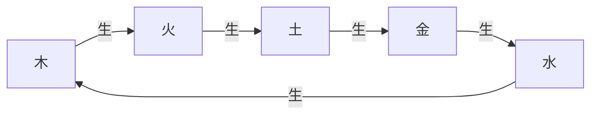

| 关系 | 效果 | 伤害加成 | 特殊效果 |
|------|------|---------|---------|
| 木生火 | 火属性技能威力提升 | +30% | 引燃效果持续时间+2秒 |
| 火生土 | 土属性技能范围扩大 | +25% | 护盾值+20% |
| 土生金 | 金属性技能穿透提升 | +35% | 破甲效果+15% |
| 金生水 | 水属性技能恢复增强 | +20% | 治疗效果+25% |
| 水生木 | 木属性技能持续增强 | +30% | 持续伤害效果+3秒 |

#### 相克关系（压制）

```mermaid
graph LR
    A[木] -.克.-> B[土]
    B -.克.-> C[水]
    C -.克.-> D[火]
    D -.克.-> E[金]
    E -.克.-> A
```

| 关系 | 效果 | 伤害加成 | 特殊效果 |
|------|------|---------|---------|
| 木克土 | 对土属性目标额外伤害 | +50% | 破除护盾效果 |
| 土克水 | 对水属性目标额外伤害 | +50% | 减缓治疗效果50% |
| 水克火 | 对火属性目标额外伤害 | +50% | 熄灭燃烧状态 |
| 火克金 | 对金属性目标额外伤害 | +50% | 降低防御力30% |
| 金克木 | 对木属性目标额外伤害 | +50% | 斩断持续效果 |

### 2.3 武侠境界五行武技

#### 金系武技（锐利、破甲）

| 技能名称 | 等级要求 | 招式描述 | 五行属性 | 冷却时间 | 内力消耗 |
|---------|---------|---------|---------|---------|---------|
| 破军斩 | 5 | 单体高伤害斩击 | 纯金 | 8秒 | 80点 |
| 金刚指 | 10 | 点穴攻击，造成定身 | 金70%+土30% | 12秒 | 100点 |
| 七星剑阵 | 15 | 召唤剑气攻击周围敌人 | 纯金 | 15秒 | 150点 |
| 碎岳斩 | 20 | 大范围震地斩击 | 金60%+土40% | 20秒 | 200点 |

#### 木系武技（持续、恢复）

| 技能名称 | 等级要求 | 招式描述 | 五行属性 | 冷却时间 | 内力消耗 |
|---------|---------|---------|---------|---------|---------|
| 青木藤缠 | 5 | 藤蔓束缚敌人 | 纯木 | 10秒 | 70点 |
| 春回大地 | 10 | 范围治疗友军 | 木60%+水40% | 30秒 | 120点 |
| 万木森罗 | 15 | 召唤树木持续攻击 | 纯木 | 25秒 | 180点 |
| 生生不息 | 20 | 持续恢复生命和内力 | 木50%+水50% | 60秒 | 250点 |

#### 水系武技（控制、治疗）

| 技能名称 | 等级要求 | 招式描述 | 五行属性 | 冷却时间 | 内力消耗 |
|---------|---------|---------|---------|---------|---------|
| 寒冰掌 | 5 | 单体攻击并减速 | 纯水 | 6秒 | 60点 |
| 水愈术 | 10 | 快速恢复生命值 | 纯水 | 15秒 | 100点 |
| 冰封千里 | 15 | 大范围冰冻控制 | 纯水 | 30秒 | 200点 |
| 滔天巨浪 | 20 | 召唤水浪冲击敌人 | 纯水 | 25秒 | 180点 |

#### 火系武技（爆发、燃烧）

| 技能名称 | 等级要求 | 招式描述 | 五行属性 | 冷却时间 | 内力消耗 |
|---------|---------|---------|---------|---------|---------|
| 烈焰掌 | 5 | 单体火焰攻击 | 纯火 | 7秒 | 75点 |
| 火球术 | 10 | 投掷火球造成范围伤害 | 纯火 | 10秒 | 110点 |
| 炎龙出海 | 15 | 释放火龙直线攻击 | 火80%+木20% | 18秒 | 160点 |
| 焚天灭地 | 20 | 超大范围火焰爆炸 | 纯火 | 40秒 | 300点 |

#### 土系武技（防御、控制）

| 技能名称 | 等级要求 | 招式描述 | 五行属性 | 冷却时间 | 内力消耗 |
|---------|---------|---------|---------|---------|---------|
| 岩甲术 | 5 | 提升自身防御力 | 纯土 | 20秒 | 80点 |
| 地刺术 | 10 | 从地面突刺敌人 | 纯土 | 12秒 | 100点 |
| 山岳护盾 | 15 | 生成护盾吸收伤害 | 纯土 | 30秒 | 150点 |
| 地动山摇 | 20 | 范围震荡击飞敌人 | 土70%+金30% | 35秒 | 250点 |

### 2.4 仙侠境界五行法术

#### 金系法术（更强的锐利与穿透）

| 法术名称 | 境界要求 | 法术描述 | 五行属性 | 冷却时间 | 灵力消耗 |
|---------|---------|---------|---------|---------|---------|
| 万剑归宗 | 筑基期 | 召唤无数飞剑攻击 | 纯金 | 25秒 | 500点 |
| 天罡剑气 | 金丹期 | 斩出巨大剑气 | 金90%+风10% | 20秒 | 600点 |
| 金光斩妖 | 元婴期 | 神圣金光净化邪祟 | 金70%+光30% | 30秒 | 800点 |
| 太乙金刚诀 | 化神期 | 全身金刚不坏 | 金80%+土20% | 60秒 | 1200点 |

#### 木系法术（生命力与自然之力）

| 法术名称 | 境界要求 | 法术描述 | 五行属性 | 冷却时间 | 灵力消耗 |
|---------|---------|---------|---------|---------|---------|
| 青木长生术 | 筑基期 | 大幅恢复生命 | 纯木 | 40秒 | 450点 |
| 木灵守护 | 金丹期 | 召唤树人战斗 | 纯木 | 50秒 | 700点 |
| 万木皆兵 | 元婴期 | 植物化为武器攻击 | 木80%+金20% | 35秒 | 900点 |
| 生命之树 | 化神期 | 范围持续治疗 | 木60%+水40% | 90秒 | 1500点 |

#### 水系法术（极致的控制与治愈）

| 法术名称 | 境界要求 | 法术描述 | 五行属性 | 冷却时间 | 灵力消耗 |
|---------|---------|---------|---------|---------|---------|
| 水龙吟 | 筑基期 | 召唤水龙冲击 | 纯水 | 22秒 | 480点 |
| 玄冰结界 | 金丹期 | 冰封范围区域 | 纯水 | 40秒 | 750点 |
| 沧海潮生 | 元婴期 | 操控海水淹没敌人 | 纯水 | 50秒 | 1000点 |
| 北冥神功 | 化神期 | 吸收敌人灵力 | 水70%+暗30% | 45秒 | 1100点 |

#### 火系法术（毁灭性的火焰）

| 法术名称 | 境界要求 | 法术描述 | 五行属性 | 冷却时间 | 灵力消耗 |
|---------|---------|---------|---------|---------|---------|
| 三昧真火 | 筑基期 | 释放不灭真火 | 纯火 | 30秒 | 550点 |
| 炎帝焚天 | 金丹期 | 天降陨石 | 火90%+土10% | 45秒 | 850点 |
| 凤凰涅槃 | 元婴期 | 死亡后满状态复活 | 火80%+木20% | 300秒 | 2000点 |
| 太阳真火 | 化神期 | 召唤太阳之力 | 纯火 | 60秒 | 1600点 |

#### 土系法术（坚不可摧的防御）

| 法术名称 | 境界要求 | 法术描述 | 五行属性 | 冷却时间 | 灵力消耗 |
|---------|---------|---------|---------|---------|---------|
| 五岳镇压 | 筑基期 | 召唤山岳压制 | 纯土 | 35秒 | 520点 |
| 须弥山盾 | 金丹期 | 巨大护盾保护 | 纯土 | 50秒 | 720点 |
| 大地之怒 | 元婴期 | 操控大地攻击 | 土80%+金20% | 40秒 | 950点 |
| 厚土载物 | 化神期 | 免疫所有控制 | 纯土 | 120秒 | 1800点 |

### 2.5 玄幻境界五行神通

#### 金系神通（法则级别的锐利）

| 神通名称 | 境界要求 | 神通描述 | 五行属性 | 冷却时间 | 源力消耗 |
|---------|---------|---------|---------|---------|---------|
| 庚金法则 | 炼虚期 | 领悟金之法则，无坚不摧 | 纯金 | 90秒 | 2500点 |
| 星辰剑阵 | 合体期 | 召唤星辰之剑 | 金70%+星30% | 120秒 | 3500点 |
| 湮灭斩 | 大乘期 | 斩断空间与因果 | 金80%+空间20% | 180秒 | 5000点 |

#### 木系神通（生命法则）

| 神通名称 | 境界要求 | 神通描述 | 五行属性 | 冷却时间 | 源力消耗 |
|---------|---------|---------|---------|---------|---------|
| 甲木法则 | 炼虚期 | 领悟生命法则 | 纯木 | 100秒 | 2400点 |
| 世界树投影 | 合体期 | 召唤世界树幻影 | 木80%+空间20% | 150秒 | 4000点 |
| 生命起源 | 大乘期 | 复活所有友军 | 木60%+光40% | 600秒 | 8000点 |

#### 水系神通（流动与时间）

| 神通名称 | 境界要求 | 神通描述 | 五行属性 | 冷却时间 | 源力消耗 |
|---------|---------|---------|---------|---------|---------|
| 癸水法则 | 炼虚期 | 领悟水之法则 | 纯水 | 85秒 | 2300点 |
| 时间长河 | 合体期 | 减缓敌人时间流速 | 水50%+时间50% | 200秒 | 4500点 |
| 归墟之海 | 大乘期 | 吞噬一切回归虚无 | 水70%+暗30% | 240秒 | 6000点 |

#### 火系神通（毁灭法则）

| 神通名称 | 境界要求 | 神通描述 | 五行属性 | 冷却时间 | 源力消耗 |
|---------|---------|---------|---------|---------|---------|
| 丙火法则 | 炼虚期 | 领悟火之法则 | 纯火 | 95秒 | 2600点 |
| 星爆 | 合体期 | 引爆星辰能量 | 火80%+星20% | 180秒 | 4200点 |
| 宇宙大爆炸 | 大乘期 | 模拟宇宙诞生之力 | 纯火 | 300秒 | 7000点 |

#### 土系神通（承载与空间）

| 神通名称 | 境界要求 | 神通描述 | 五行属性 | 冷却时间 | 源力消耗 |
|---------|---------|---------|---------|---------|---------|
| 戊土法则 | 炼虚期 | 领悟土之法则 | 纯土 | 110秒 | 2700点 |
| 小千世界 | 合体期 | 创造独立空间 | 土50%+空间50% | 250秒 | 5000点 |
| 万象归墟 | 大乘期 | 绝对防御领域 | 土60%+空间40% | 360秒 | 8500点 |

### 2.6 五行组合技

#### 双属性组合技能

| 组合名称 | 五行组成 | 技能效果 | 触发条件 | 威力加成 |
|---------|---------|---------|---------|---------|
| 雷霆万钧 | 金+火 | 爆发性闪电攻击 | 先金后火，间隔<2秒 | 双倍伤害 |
| 春木回生 | 木+水 | 极强治疗与恢复 | 同时释放 | 治疗+150% |
| 烈焰燎原 | 木+火 | 大范围持续燃烧 | 先木后火，间隔<1秒 | +200%持续伤害 |
| 金汤永固 | 金+土 | 超强护盾 | 同时释放 | 护盾+180% |
| 寒冰地狱 | 水+土 | 冰冻并困住敌人 | 先土后水，间隔<2秒 | 控制时间+3秒 |

#### 三属性组合技能（仙侠境界解锁）

| 组合名称 | 五行组成 | 技能效果 | 触发条件 | 威力加成 |
|---------|---------|---------|---------|---------|
| 五雷轰顶 | 金+木+火 | 天降雷霆 | 按顺序释放，间隔<3秒 | 三倍伤害 |
| 造化之力 | 木+水+土 | 改造地形并治疗 | 同时引导完成 | 治疗+200%，持续10秒 |
| 极寒暴风 | 水+金+木 | 暴风雪攻击 | 按顺序释放 | +250%范围伤害 |

#### 五行归一（玄幻境界解锁）

| 神通名称 | 五行组成 | 神通效果 | 触发条件 | 冷却时间 |
|---------|---------|---------|---------|---------|
| 混沌初开 | 金木水火土 | 创造混沌领域，所有属性失效 | 五行技能连续施放<10秒 | 600秒 |
| 天地归元 | 金木水火土 | 强制结束所有效果并重置战场 | 五行法则同时激活 | 1200秒 |
| 阴阳两仪 | 五行平衡态 | 转化五行为阴阳之力 | 五行能量均衡 | 300秒 |

---

## 三、战斗系统

### 3.1 战斗机制概述

战斗系统融合五行相生相克、连招系统、卸势防御等多重机制，随着境界提升逐步解锁更复杂的战斗策略。

### 3.2 核心战斗机制

#### 普通攻击体系

| 攻击类型 | 按键 | 特性 | 五行附加 |
|---------|------|------|---------|
| **轻击** | 鼠标左键 | 快速连击，可累积连击数 | 根据装备武器属性 |
| **重击** | 长按左键 | 蓄力攻击，破防 | 双倍五行伤害 |
| **下劈** | 空中左键 | 空中攻击，击倒效果 | 金属性加成 |
| **横扫** | 左键+方向键 | 范围攻击 | 风属性加成 |

#### 卸势防御系统（参照燕云十六声）

| 防御类型 | 按键 | 判定窗口 | 成功效果 | 失败惩罚 |
|---------|------|---------|---------|---------|
| **格挡** | 鼠标右键 | 持续按住 | 减伤50% | 消耗内力 |
| **完美格挡** | 右键（精确时机） | 0.3秒 | 减伤100%+反击机会 | 被破防 |
| **闪避** | Shift+方向键 | 触发即生效 | 完全躲避 | 消耗内力 |
| **完美闪避** | 闪避（精确时机） | 0.2秒 | 触发时间减速 | 无 |
| **卸势** | 特定时机反向输入 | 0.15秒 | 化解攻击+积累势能 | 受到150%伤害 |

#### 连招系统

**连招触发规则**：
- 基础连招：普通攻击连续命中3次以上
- 技能连招：技能之间衔接时间<1.5秒
- 五行连招：不同五行技能按相生顺序释放
- 终结技：连招数≥5后可释放

**连招等级**：

| 连招等级 | 连击数要求 | 伤害加成 | 特殊效果 |
|---------|-----------|---------|---------|
| C级连招 | 3-5 | +10% | 无 |
| B级连招 | 6-10 | +25% | 击退效果 |
| A级连招 | 11-20 | +50% | 眩晕0.5秒 |
| S级连招 | 21-50 | +100% | 破防+击飞 |
| SS级连招 | 51-100 | +200% | 触发五行共鸣 |
| SSS级连招 | 100+ | +500% | 必定暴击+五行爆炸 |

### 3.3 武器系统与五行关联

#### 武器类型与五行属性

| 武器类型 | 主属性 | 副属性 | 特性 | 代表招式 |
|---------|-------|-------|------|---------|
| **剑** | 金 | 无 | 攻守兼备，技巧性强 | 御剑术、剑气 |
| **刀** | 金 | 火 | 爆发力强，范围攻击 | 破军斩、斩天 |
| **枪/矛** | 金 | 木 | 突刺连击，穿透高 | 百鸟朝凤 |
| **棍/杖** | 木 | 土 | 范围控制，平衡 | 横扫千军 |
| **扇** | 水 | 木 | 控制与辅助 | 水袖舞、治愈 |
| **琴** | 水 | 金 | 远程群体攻击 | 音波攻击 |
| **掌法** | 火 | 土 | 近战高伤 | 烈焰掌、降龙 |
| **拳法** | 土 | 金 | 破防格斗 | 金刚拳 |
| **暗器** | 金 | 水 | 速度快，暴击高 | 飞刀、毒针 |
| **法宝** | 五行任选 | 五行任选 | 仙侠境界专属 | 各类仙器 |
| **神兵** | 法则之力 | 无 | 玄幻境界专属 | 开天斧、弑神枪 |

#### 武器切换与衔接技

- **易武技**：切换武器瞬间释放的衔接技能
- **切换加成**：不同五行武器切换触发相生效果
- **武器共鸣**：装备同属性武器组合产生额外加成

### 3.4 境界战斗特性

#### 武侠境界战斗特性

- 专注近战与轻功配合
- 内力管理重要性高
- 卸势系统为核心防御手段
- 武器技能为主要输出

#### 仙侠境界战斗特性

- 远程法术与近战武技并重
- 引入法宝系统
- 御剑飞行战斗
- 阵法与禁制机制
- 灵力护体自动防御

#### 玄幻境界战斗特性

- 法则之力改变战斗规则
- 空间战斗（多维度作战）
- 领域展开（自定义战场规则）
- 时间操控能力
- 神通可改变地形与环境

---

## 四、动画系统

### 4.1 动画分层架构

```mermaid
graph TB
    A[动画控制器] --> B[基础层]
    A --> C[战斗层]
    A --> D[技能层]
    A --> E[表情层]
    B --> F[待机/移动动画]
    C --> G[攻击/防御动画]
    D --> H[技能特效动画]
    E --> I[面部表情]
    H --> J[武侠特效]
    H --> K[仙侠特效]
    H --> L[玄幻特效]
```

### 4.2 动画状态机

#### 基础移动动画状态

| 状态 | 动画资源 | 过渡时间 | 循环 | 混合方式 |
|------|---------|---------|------|---------|
| Idle | idle_stand | 0.2s | 是 | 淡入淡出 |
| Walk | walk_cycle | 0.15s | 是 | 方向混合 |
| Run | run_cycle | 0.1s | 是 | 速度混合 |
| Sprint | sprint_cycle | 0.05s | 是 | 加速混合 |
| Jump_Start | jump_up | 0.1s | 否 | 即时切换 |
| Jump_Loop | jump_air | 0.1s | 是 | 平滑混合 |
| Jump_Land | jump_land | 0.2s | 否 | 缓冲混合 |
| Glide | lightskill_glide | 0.3s | 是 | 缓入 |
| Fly | sword_fly | 0.4s | 是 | 缓入缓出 |

#### 战斗动画状态

| 状态 | 动画资源 | 触发条件 | 打断规则 | 衔接技能 |
|------|---------|---------|---------|---------|
| Attack_1 | attack_light_1 | 左键 | 可打断 | Attack_2 |
| Attack_2 | attack_light_2 | 连击 | 可打断 | Attack_3 |
| Attack_3 | attack_light_3 | 连击 | 可打断 | Attack_Finish |
| Attack_Heavy | attack_heavy | 长按左键 | 不可打断 | 无 |
| Defend | defend_stance | 右键 | 可打断 | Counter |
| Perfect_Defend | perfect_parry | 精确时机 | 不可打断 | Counter_Attack |
| Dodge | dodge_roll | Shift+方向 | 不可打断 | 无 |
| Counter | counter_attack | 成功格挡后 | 不可打断 | 连招继续 |

### 4.3 技能动画设计原则

#### 动画分段结构

所有技能动画遵循三段式结构：

1. **起手式（Startup）**：
   - 时长：0.2-0.5秒
   - 目的：技能预警，给予对手反应时间
   - 特征：蓄力动作、光效聚集

2. **生效帧（Active）**：
   - 时长：0.1-0.3秒
   - 目的：实际伤害判定
   - 特征：动作顶点、特效爆发

3. **收招式（Recovery）**：
   - 时长：0.3-0.8秒
   - 目的：技能硬直，平衡性考量
   - 特征：动作缓冲、返回待机

#### 五行技能动画特征

| 五行属性 | 动画风格 | 色彩主调 | 粒子效果 | 音效特征 |
|---------|---------|---------|---------|---------|
| **金** | 锐利、刚猛 | 金色、银白 | 剑气、金属光泽 | 金属碰撞、破空声 |
| **木** | 柔韧、生长 | 绿色、青色 | 藤蔓、叶片飘落 | 沙沙声、生长音 |
| **水** | 流畅、柔和 | 蓝色、冰蓝 | 水波、冰晶 | 流水声、冰冻音 |
| **火** | 爆裂、炽热 | 红色、橙黄 | 火焰、烟雾 | 燃烧声、爆炸音 |
| **土** | 厚重、稳固 | 黄色、褐色 | 岩石、尘土 | 沉闷撞击、震动 |

### 4.4 境界进阶动画演变

#### 同一技能不同境界表现

以"火球术"为例：

| 境界 | 技能名称 | 动画规模 | 特效复杂度 | 施法时间 |
|------|---------|---------|-----------|---------|
| 武侠 | 火球术 | 单个火球 | 简单火焰 | 1秒 |
| 仙侠-筑基 | 烈焰弹 | 三个火球 | 火焰+符文 | 0.8秒 |
| 仙侠-金丹 | 炎龙弹 | 火龙形态 | 龙形+火纹 | 0.6秒 |
| 仙侠-元婴 | 陨星坠 | 陨石形态 | 燃烧陨石 | 0.5秒 |
| 玄幻-炼虚 | 太阳耀斑 | 小型太阳 | 太阳光晕 | 0.3秒 |
| 玄幻-大乘 | 恒星爆发 | 星球爆炸 | 超新星效果 | 瞬发 |

### 4.5 动画混合与IK系统

#### 上下半身分离

- **上半身**：独立播放攻击/技能动画
- **下半身**：保持移动动画
- **好处**：边移动边攻击的流畅性

#### 程序化IK应用

| IK类型 | 应用场景 | 目标 |
|--------|---------|------|
| **脚部IK** | 地形适应 | 脚步贴合不平地面 |
| **手部IK** | 武器持握 | 双手准确握持武器 |
| **头部IK** | 目标锁定 | 头部看向敌人 |
| **全身IK** | 攀爬 | 手脚贴合攀爬点 |

---

## 五、境界成长系统

### 5.1 境界划分与等级跨度

```mermaid
graph LR
    A[武侠境界<br/>Lv1-30] --> B[仙侠境界<br/>Lv31-70]
    B --> C[玄幻境界<br/>Lv71-120]
    
    A --> A1[江湖新人 1-5]
    A --> A2[初窥门径 6-10]
    A --> A3[小有所成 11-15]
    A --> A4[炉火纯青 16-20]
    A --> A5[登峰造极 21-25]
    A --> A6[一代宗师 26-30]
    
    B --> B1[筑基期 31-40]
    B --> B2[金丹期 41-50]
    B --> B3[元婴期 51-60]
    B --> B4[化神期 61-70]
    
    C --> C1[炼虚期 71-85]
    C --> C2[合体期 86-100]
    C --> C3[大乘期 101-115]
    C --> C4[渡劫期 116-120]
```

### 5.2 境界突破机制

#### 武侠→仙侠突破（Lv30）

**突破条件**：

| 条件类型 | 具体要求 |
|---------|---------|
| 等级要求 | 达到30级 |
| 任务链 | 完成"踏入仙途"主线任务 |
| 资源收集 | 收集筑基丹×1、灵石×1000 |
| 试炼挑战 | 通过"心魔试炼"副本 |
| 属性要求 | 五行属性任意一项达到100点 |

**突破奖励**：
- 解锁御剑飞行能力
- 开放仙侠技能树
- 能量类型转换为灵力
- 获得称号"筑基修士"
- 角色外观获得仙气特效

#### 仙侠→玄幻突破（Lv70）

**突破条件**：

| 条件类型 | 具体要求 |
|---------|---------|
| 等级要求 | 达到70级 |
| 任务链 | 完成"破碎虚空"史诗任务链 |
| 资源收集 | 天劫石×10、源力结晶×100 |
| 试炼挑战 | 渡九九天劫（九波Boss战） |
| 悟性要求 | 领悟至少一种五行法则 |
| 法宝要求 | 拥有至少一件仙品法宝 |

**突破奖励**：
- 解锁破空飞行与空间跳跃
- 开放玄幻神通树
- 能量类型转换为源力
- 肉身重塑，外观大幅改变
- 获得专属光环特效
- 开启位面探索功能

### 5.3 修炼系统

#### 修炼方式

| 修炼类型 | 获得经验 | 时间要求 | 特殊奖励 |
|---------|---------|---------|---------|
| **打坐冥想** | 100经验/分钟 | 无限制 | 加快能量恢复 |
| **战斗历练** | 根据敌人等级 | 实时 | 战斗经验与技能熟练度 |
| **任务修行** | 任务奖励 | 按任务 | 特殊物品与技能书 |
| **副本试炼** | 高额经验 | 每日限定 | 稀有装备与材料 |
| **炼丹炼器** | 少量经验 | 消耗材料 | 成品丹药/装备 |
| **参悟功法** | 技能经验 | 离线挂机 | 技能等级提升 |
| **传承试炼** | 巨额经验 | 一次性 | 传承技能与心法 |

#### 五行属性修炼

每个角色有五行属性值，影响对应五行技能的威力：

| 五行属性 | 提升方式 | 影响 |
|---------|---------|------|
| **金属性** | 修炼金系功法、装备金系装备 | 金系技能伤害+1%/点 |
| **木属性** | 修炼木系功法、服用木系丹药 | 木系技能效果+1%/点 |
| **水属性** | 修炼水系功法、在水边修炼 | 水系技能冷却-0.1%/点 |
| **火属性** | 修炼火系功法、在火山修炼 | 火系技能暴击+0.5%/点 |
| **土属性** | 修炼土系功法、服用土系灵材 | 土系技能范围+0.5%/点 |

**属性平衡机制**：
- 五行属性差距过大会降低整体战斗力
- 五行平衡（差距<20点）时触发"五行归一"被动加成
- 专精单一属性可解锁专属技能

### 5.4 技能学习与升级

#### 技能获取途径

| 获取方式 | 适用境界 | 获取难度 | 示例 |
|---------|---------|---------|------|
| **自动领悟** | 武侠 | 低 | 升级自动学会基础技能 |
| **NPC传授** | 武侠/仙侠 | 中 | 拜师学艺 |
| **秘籍掉落** | 全境界 | 高 | Boss掉落技能书 |
| **任务奖励** | 全境界 | 中 | 完成特定任务链 |
| **副本宝箱** | 全境界 | 中高 | 通关副本获得 |
| **传承洞府** | 仙侠/玄幻 | 极高 | 探索古迹获得传承 |
| **法则领悟** | 玄幻 | 极高 | 自主参悟天地法则 |

#### 技能等级系统

| 技能等级 | 升级方式 | 效果提升 | 消耗 |
|---------|---------|---------|------|
| Lv1（初学） | 学习技能书 | 基础效果 | 无 |
| Lv2-5（熟练） | 使用次数累积 | 伤害+10%/级 | 技能点×1/级 |
| Lv6-10（精通） | 技能点+特殊材料 | 伤害+15%/级 | 技能点×2+材料 |
| Lv11-15（大师） | 特殊任务+稀有材料 | 伤害+20%/级+特效强化 | 技能点×5+稀有材料 |
| Lv16-20（宗师） | 顿悟+传承 | 伤害+25%/级+额外效果 | 技能点×10+传承道具 |
| 神话级（Lv21+） | 法则领悟 | 质变，形态改变 | 法则碎片 |

### 5.5 门派与流派系统

#### 武侠门派（参照燕云十六声）

| 门派名称 | 主修属性 | 特色武器 | 门派绝学 | 门派特性 |
|---------|---------|---------|---------|---------|
| **天泉剑宗** | 金+水 | 剑 | 天泉剑诀 | 攻守兼备 |
| **狂澜刀派** | 金+火 | 刀 | 狂澜霸刀 | 爆发力强 |
| **九流门** | 木+水 | 扇 | 九流秘术 | 控制与辅助 |
| **梨园坊** | 水+木 | 琴/舞 | 梨园雅乐 | 群体增益 |
| **无极拳宗** | 土+火 | 拳掌 | 无极神拳 | 近战格斗 |
| **青城派** | 木+金 | 剑 | 青城剑法 | 技巧灵活 |
| **散修** | 全属性 | 任意 | 无 | 自由发展 |

#### 仙侠仙门

| 仙门名称 | 主修法则 | 山门位置 | 镇派仙术 | 入门要求 |
|---------|---------|---------|---------|---------|
| **太虚仙宗** | 空间+时间 | 云巅天宫 | 太虚挪移术 | 筑基期+悟性80 |
| **五行圣殿** | 五行法则 | 五行大陆中心 | 五行轮转大法 | 金丹期+五行平衡 |
| **万剑仙府** | 金之法则 | 剑冢 | 万剑诀 | 筑基期+剑道天赋 |
| **长生道宗** | 生命法则 | 不老山 | 长生诀 | 金丹期+木属性100 |
| **散仙** | 自选 | 无 | 无 | 无限制 |

#### 玄幻势力

| 势力名称 | 掌控法则 | 势力范围 | 至高神通 | 加入条件 |
|---------|---------|---------|---------|---------|
| **星辰殿** | 星辰法则 | 星海位面 | 星辰变 | 炼虚期+星辰亲和 |
| **时空塔** | 时空法则 | 时间长河 | 时光倒流 | 合体期+时空感悟 |
| **轮回宫** | 轮回法则 | 黄泉路 | 轮回转生术 | 大乘期+死亡体验 |
| **创世山** | 创造法则 | 混沌之初 | 开天辟地 | 大乘期+领悟创世 |
| **独行者** | 自主法则 | 诸天万界 | 自创神通 | 无限制 |

---

## 六、世界探索系统

### 6.1 世界地图分层

```mermaid
graph TB
    A[混元宇宙] --> B[武侠大陆]
    A --> C[仙侠界域]
    A --> D[玄幻诸天]
    
    B --> B1[中原江湖]
    B --> B2[西域荒漠]
    B --> B3[南疆密林]
    B --> B4[北境雪原]
    B --> B5[东海岛屿]
    
    C --> C1[修真界]
    C --> C2[妖界]
    C --> C3[魔界]
    C --> C4[灵界]
    C --> C5[仙界]
    
    D --> D1[下位面×1000]
    D --> D2[中位面×100]
    D --> D3[上位面×10]
    D --> D4[至高位面×1]
    D --> D5[混沌虚空]
```

### 6.2 地图解锁机制

| 区域类型 | 解锁条件 | 区域特征 | 特殊资源 |
|---------|---------|---------|---------|
| **新手村** | 初始解锁 | 安全区，无PK | 基础材料 |
| **主城** | 等级5 | 交易、任务中心 | 商店、拍卖 |
| **野外地图** | 等级对应 | 怪物、资源点 | 矿石、灵草 |
| **秘境** | 特殊任务 | 高级怪物、宝箱 | 稀有装备 |
| **副本** | 等级+任务 | 副本Boss | 套装装备 |
| **仙岛** | 仙侠境界 | 灵气浓郁 | 仙材 |
| **位面** | 玄幻境界 | 独立世界规则 | 法则碎片 |

### 6.3 探索玩法

#### 轻功与飞行探索（武侠/仙侠）

- **轻功跳跃点**：需要特定轻功等级才能到达的高处
- **御剑飞行航线**：仙侠境界可飞越山川河流
- **隐藏洞府**：需要解谜或特定道具才能进入
- **奇遇触发点**：随机刷新的奇遇事件

#### 位面探索（玄幻）

- **位面传送门**：连接不同位面的传送点
- **位面战争**：跨位面的大型PvP活动
- **虚空漂流**：在混沌虚空中探索未知区域
- **时空裂隙**：通往过去或未来的特殊区域

---

## 七、网络同步策略

### 7.1 同步内容分类

| 数据类型 | 同步频率 | 同步方式 | 优先级 |
|---------|---------|---------|-------|
| **位置移动** | 每帧 | 客户端预测+服务端校验 | 最高 |
| **技能释放** | 即时 | 客户端表现+服务端验证 | 高 |
| **伤害数值** | 即时 | 服务端计算+客户端显示 | 高 |
| **Buff状态** | 状态改变时 | 事件驱动 | 中 |
| **装备变更** | 变更时 | 事件驱动 | 中 |
| **聊天消息** | 即时 | 消息队列 | 低 |

### 7.2 技能同步机制

#### 技能释放流程

1. **客户端**：
   - 检查本地条件（冷却、消耗）
   - 立即播放动画与特效
   - 发送技能请求到服务端

2. **服务端**：
   - 验证技能合法性（防作弊）
   - 计算技能效果（伤害、Buff等）
   - 广播技能结果给相关客户端

3. **其他客户端**：
   - 接收技能广播
   - 播放对应动画与特效
   - 显示伤害数字

#### 五行相克计算位置

- **服务端权威**：所有五行相生相克的伤害计算由服务端执行
- **客户端预显示**：客户端可根据规则预估伤害并显示，服务端返回后校正

### 7.3 反外挂策略

| 检测项 | 检测方式 | 处理措施 |
|-------|---------|---------|
| **加速移动** | 服务端验证移动速度 | 强制拉回+警告 |
| **无限技能** | 服务端验证冷却时间 | 拒绝执行+记录 |
| **瞬移** | 位置合法性检查 | 强制拉回+封号 |
| **伤害修改** | 服务端计算所有伤害 | 客户端数值无效 |
| **透视** | 服务端视野管理 | 仅发送可见实体 |

---

## 八、特效与视听表现

### 8.1 特效分级系统

#### 画质档位特效配置

| 特效类型 | 低配 | 中配 | 高配 | 超高配 |
|---------|-----|-----|-----|--------|
| **粒子数量** | 50% | 75% | 100% | 150% |
| **光影效果** | 关闭 | 简化 | 标准 | 全局光照 |
| **动态模糊** | 关闭 | 关闭 | 开启 | 开启 |
| **五行特效** | 简化版 | 标准版 | 增强版 | 电影级 |
| **环境交互** | 无 | 部分 | 完整 | 完整+持久化 |

### 8.2 五行特效视觉规范

| 五行 | 主色调 | 粒子形态 | 光效特征 | 音效风格 |
|------|-------|---------|---------|---------|
| **金** | 金色渐变至白色 | 剑气、金属碎片 | 锐利光线 | 金属音、剑鸣 |
| **木** | 翠绿至青绿 | 叶片、藤蔓、花瓣 | 柔和光晕 | 自然音、风声 |
| **水** | 蓝色至冰蓝 | 水# 客户端核心功能开发设计文档

## 文档概述

### 文档目的
本文档定义客户端核心游戏玩法功能的战略设计，包括角色移动系统、技能动画系统、五行武技战斗机制，以及从武侠到仙侠、玄幻的成长体系。文档参照《燕云十六声》的核心玩法，并在此基础上扩展至宏大的宇宙观设定。

### 世界观框架

本游戏构建了一个从人间武林到仙界，再到诸天宇宙的三层世界体系：

- **武侠阶段（人界）**：燕云江湖，五代十国纷争，角色通过修习武学在江湖中成长
- **仙侠阶段（仙界）**：突破凡体，领悟五行大道，飞升仙界探索更高境界
- **玄幻阶段（宇宙）**：超脱仙凡，掌控星域法则，遨游诸天万界

### 核心设计理念

```mermaid
graph LR
    A[武侠根基] --> B[五行感悟]
    B --> C[仙道筑基]
    C --> D[法则领悟]
    D --> E[宇宙探索]
    
    A --> F[江湖纷争]
    B --> G[五行相克]
    C --> H[仙术神通]
    D --> I[星域征战]
    E --> J[诸天万界]
```

---

## 一、角色移动系统

### 1.1 系统目标

角色移动系统需要支持三个阶段的移动特性：
- **武侠阶段**：真实物理移动，轻功辅助
- **仙侠阶段**：御空飞行，灵力驱动
- **玄幻阶段**：空间穿梭，法则位移

### 1.2 移动状态分层模型

#### 武侠阶段移动状态

| 状态 | 触发条件 | 行为特征 | 速度系数 | 消耗 |
|------|---------|---------|---------|------|
| **待机** | 无输入且落地 | 静止站立，呼吸动画 | 0.0 | 无 |
| **行走** | 方向键输入 | 基础移动 | 1.0 | 无 |
| **跑步** | Shift + 方向键 | 快速移动 | 2.0 | 体力 |
| **冲刺** | 双击方向键 | 爆发移动 | 3.0 | 体力 |
| **跳跃** | Space键 | 垂直跃起 | 保持水平 | 体力 |
| **轻功跳跃** | 连续Space | 三段跳 | 1.2 | 内力 |
| **蹲伏** | C键 | 降低身形 | 0.5 | 无 |
| **滑行** | 跑步+C | 滑动位移 | 2.5→1.0 | 体力 |
| **轻功飞掠** | Shift+Space | 水平快速位移 | 4.0 | 内力 |
| **踏水而行** | 水面轻功 | 短时水上移动 | 1.5 | 内力 |
| **攀爬** | 接触墙面+Space | 垂直攀爬 | 0.6 | 体力 |

#### 仙侠阶段移动状态

| 状态 | 触发条件 | 行为特征 | 速度系数 | 消耗 |
|------|---------|---------|---------|------|
| **御空飞行** | F键进入飞行模式 | 自由三维飞行 | 5.0 | 灵力 |
| **御剑飞行** | 召唤飞剑 | 高速飞行 | 8.0 | 灵力 |
| **遁术** | 对应五行遁法 | 瞬间位移 | 瞬移 | 灵力+冷却 |
| **御风术** | 风属性能力 | 滑翔降落 | 3.0 | 灵力 |
| **缩地成寸** | 空间神通 | 短距传送 | 瞬移 | 灵力 |

#### 玄幻阶段移动状态

| 状态 | 触发条件 | 行为特征 | 速度系数 | 消耗 |
|------|---------|---------|---------|------|
| **虚空行走** | 掌握空间法则 | 无视地形飞行 | 10.0 | 法力 |
| **星域穿梭** | 星图导航 | 跨星球传送 | 跨地图 | 法力 |
| **时空跳跃** | 时空法则 | 瞬移+时间减速 | 瞬移 | 法力 |
| **法则共鸣** | 特定区域 | 超高速移动 | 20.0 | 法力 |

### 1.3 移动控制与物理特性

#### 输入优先级系统

| 优先级 | 输入类型 | 响应方式 | 可打断性 |
|-------|---------|---------|---------|
| **最高** | 技能位移（如遁术、闪现） | 立即执行，强制打断当前动作 | 不可打断 |
| **高** | 键盘/手柄移动输入 | 即时响应，支持多方向 | 可被技能打断 |
| **中** | 鼠标点击寻路 | 自动导航路径 | 可被手动输入打断 |
| **低** | AI自动移动 | 系统控制移动 | 可被任何玩家输入打断 |

#### 转向平滑策略

- **武侠阶段**：真实物理转向，转向速度受速度影响
  - 低速转向：即时响应
  - 高速转向：需要转弯半径，有惯性滑动
  
- **仙侠阶段**：灵活转向，轻微惯性
  - 飞行转向：采用球形插值，平滑系数0.15
  
- **玄幻阶段**：随心所欲，几乎无惯性
  - 虚空移动：瞬时转向，无物理限制

#### 地形适应机制

```mermaid
graph TB
    A[角色位置检测] --> B{判断地形类型}
    B -->|平地| C[标准移动]
    B -->|斜坡| D[坡度计算]
    B -->|台阶| E[自动攀爬]
    B -->|水体| F[检测阶段]
    B -->|空中| G[重力处理]
    
    D --> H{斜率判定}
    H -->|<15°| C
    H -->|15-30°| I[速度调整-10%]
    H -->|30-45°| J[速度调整-25%]
    H -->|>45°| K[触发滑落/攀爬]
    
    F --> L{角色阶段}
    L -->|武侠| M[游泳或轻功踏水]
    L -->|仙侠| N[御空飞行]
    L -->|玄幻| O[虚空行走]
```

### 1.4 能量系统设计

#### 三层能量体系

| 能量类型 | 适用阶段 | 最大值 | 恢复方式 | 消耗行为 |
|---------|---------|-------|---------|---------|
| **体力** | 武侠 | 100 | 自动恢复2/秒，静止5/秒 | 冲刺、攀爬、滑行 |
| **内力** | 武侠-仙侠 | 200 | 打坐恢复10/秒，战斗中1/秒 | 轻功、武技、初级仙术 |
| **灵力** | 仙侠 | 500 | 吸收天地灵气20/秒 | 飞行、遁术、仙术神通 |
| **法力** | 玄幻 | 1000 | 法则共鸣自动恢复30/秒 | 星域穿梭、法则技能 |

#### 能量消耗规则

**武侠阶段：**
- 轻功跳跃：每次10内力
- 轻功飞掠：20内力/秒
- 踏水而行：15内力/秒
- 冲刺：20体力/秒

**仙侠阶段：**
- 御空飞行：10灵力/秒
- 御剑飞行：5灵力/秒（更节能）
- 五行遁术：50灵力/次（冷却10秒）
- 缩地成寸：30灵力/次（冷却5秒）

**玄幻阶段：**
- 虚空行走：5法力/秒
- 星域穿梭：100法力/次
- 时空跳跃：80法力/次（冷却30秒）

---

## 二、五行武技系统

### 2.1 五行体系架构

#### 五行相生相克核心规则

```mermaid
graph TB
    subgraph 相生循环
    A[金] -->|生| B[水]
    B -->|生| C[木]
    C -->|生| D[火]
    D -->|生| E[土]
    E -->|生| A
    end
    
    subgraph 相克制约
    A -.克.-> C
    C -.克.-> E
    E -.克.-> B
    B -.克.-> D
    D -.克.-> A
    end
```

#### 五行属性战斗效果

| 五行 | 基础特性 | 相生加成 | 相克效果 | 代表武器 | 典型招式 |
|------|---------|---------|---------|---------|---------|
| **金** | 攻击力+20%，破甲 | 生水：恢复效果+30% | 克木：伤害+50% | 剑、刀 | 金刚斩、破军剑气 |
| **木** | 生命值+20%，持续恢复 | 生火：灼烧伤害+30% | 克土：穿透防御+50% | 棍、鞭 | 青木长生诀、藤蔓缠绕 |
| **水** | 控制力+20%，减速 | 生木：治疗效果+30% | 克火：冰冻伤害+50% | 扇、箫 | 玄冰掌、水月镜花 |
| **火** | 爆发伤害+20%，灼烧 | 生土：护盾强度+30% | 克金：熔断装备+50% | 枪、戟 | 烈焰焚天、凤凰涅槃 |
| **土** | 防御力+20%，稳固 | 生金：攻击坚韧+30% | 克水：驱散控制+50% | 锤、斧 | 厚土无疆、山岳镇压 |

### 2.2 武技招式分层设计

#### 武侠阶段 - 基础武学

**武学分类：**

| 武学类型 | 学习条件 | 招式数量 | 五行属性 | 威力等级 |
|---------|---------|---------|---------|---------|
| **外功** | 等级1-30 | 每系6招 | 单一五行 | ★☆☆☆☆ |
| **内功** | 等级10-40 | 每系4招 | 单一五行 | ★★☆☆☆ |
| **绝学** | 特殊任务获得 | 每系2招 | 双五行复合 | ★★★☆☆ |
| **奇术** | 江湖奇遇 | 不定 | 无属性或特殊 | ★★☆☆☆ |

**招式示例 - 金系剑法：**

1. **基础招式 - 金刚斩**
   - 前置动作：持剑蓄力0.5秒
   - 攻击判定：前方3米扇形区域
   - 伤害倍率：120%物理伤害
   - 特殊效果：10%概率降低目标15%防御，持续5秒
   - 内力消耗：20点
   - 冷却时间：3秒

2. **进阶招式 - 破军剑气**
   - 前置动作：挥剑画圆0.8秒
   - 攻击判定：发射剑气，直线10米
   - 伤害倍率：200%物理伤害 + 50%无视防御
   - 特殊效果：穿透第一个目标，对后续目标造成50%伤害
   - 内力消耗：40点
   - 冷却时间：8秒

**招式示例 - 水系掌法：**

1. **基础招式 - 玄冰掌**
   - 前置动作：掌心凝聚寒气0.6秒
   - 攻击判定：前方单体目标，5米距离
   - 伤害倍率：100%法术伤害
   - 特殊效果：减速目标30%，持续3秒；20%概率冰冻1秒
   - 内力消耗：25点
   - 冷却时间：4秒

2. **进阶招式 - 水月镜花**
   - 前置动作：环绕水幕1.2秒
   - 攻击判定：自身周围8米范围
   - 伤害倍率：150%法术伤害
   - 特殊效果：创造幻象，敌人有30%概率攻击幻象；反弹20%伤害
   - 内力消耗：50点
   - 冷却时间：15秒

#### 仙侠阶段 - 五行仙术

**仙术分级：**

| 仙术等级 | 修为要求 | 招式特征 | 五行组合 | 威力等级 |
|---------|---------|---------|---------|---------|
| **初阶仙术** | 筑基期 | 单一五行强化 | 单属性 | ★★★☆☆ |
| **中阶仙术** | 金丹期 | 双五行融合 | 相生组合 | ★★★★☆ |
| **高阶仙术** | 元婴期 | 三五行协同 | 相生链 | ★★★★★ |
| **禁术** | 化神期 | 五行逆转 | 相克破坏 | ★★★★★+ |
| **神通** | 渡劫期 | 五行归一 | 全属性 | ★★★★★++ |

**仙术示例 - 金水组合（金生水）：**

1. **中阶仙术 - 金泉涌动**
   - 施法时间：即时施法
   - 作用范围：自身周围15米
   - 效果描述：
     - 金属性：召唤金刃雨，每秒对范围内敌人造成80%伤害
     - 水属性：同时生成治疗泉水，每秒恢复友方20%生命
     - 相生加成：治疗效果额外提升30%
   - 灵力消耗：80点
   - 持续时间：8秒
   - 冷却时间：25秒

**仙术示例 - 木火土组合（相生链）：**

1. **高阶仙术 - 三才焚世阵**
   - 施法时间：引导3秒
   - 作用范围：指定地点，半径20米
   - 效果描述：
     - 第一阶段（木）：藤蔓束缚所有敌人，禁锢2秒
     - 第二阶段（火）：藤蔓燃烧，造成300%火焰伤害
     - 第三阶段（土）：大地崩裂，额外造成200%土属性伤害并击飞
     - 相生加成：每阶段伤害递增30%
   - 灵力消耗：150点
   - 冷却时间：60秒

#### 玄幻阶段 - 法则之力

**法则层级：**

| 法则等级 | 境界要求 | 能力特征 | 战斗效果 | 威力等级 |
|---------|---------|---------|---------|---------|
| **法则碎片** | 大乘期 | 初步领悟五行法则 | 技能附带法则之力 | ★★★★★ |
| **法则之力** | 仙帝 | 掌控单一法则 | 改写战斗规则 | ★★★★★+ |
| **法则融合** | 准圣 | 融合多种法则 | 创造小型世界 | ★★★★★++ |
| **法则本源** | 圣人 | 掌握法则本源 | 定义现实规则 | ★★★★★+++ |
| **超脱法则** | 混元 | 超越五行限制 | 创造新法则 | 神级 |

**法则技能示例 - 空间法则：**

1. **空间法则 - 虚空禁锢**
   - 施法方式：意念锁定
   - 作用范围：视线内单体或50米范围
   - 效果描述：
     - 冻结目标所在空间，目标完全无法移动
     - 对空间内的目标造成每秒100%真实伤害（无视一切防御）
     - 可叠加时间扭曲，使目标感知时间流速减慢90%
   - 法力消耗：200点
   - 持续时间：5秒
   - 冷却时间：45秒

2. **空间法则 - 次元斩**
   - 施法方式：撕裂空间
   - 作用范围：前方100米直线
   - 效果描述：
     - 切开空间裂缝，对路径上所有目标造成500%空间伤害
     - 无视任何护盾和防御
     - 被击中目标有20%概率被流放至空间乱流（移出战场10秒）
   - 法力消耗：250点
   - 冷却时间：90秒

**法则技能示例 - 时间法则：**

1. **时间法则 - 时光倒流**
   - 施法方式：时间回溯
   - 作用范围：自身或指定友方
   - 效果描述：
     - 将目标状态回溯至5秒前（生命、法力、位置、冷却时间）
     - 可用于撤销致命伤害或技能失误
     - 不可连续对同一目标使用，冷却期内免疫
   - 法力消耗：300点
   - 冷却时间：120秒

### 2.3 五行相克战斗机制

#### 伤害计算公式

```
最终伤害 = 基础伤害 × 技能倍率 × 五行克制系数 × (1 - 减伤率)

五行克制系数：
- 相克（如金克木）：1.5倍伤害
- 相生（如金生水）：1.0倍伤害，附加增益效果
- 相同属性：1.0倍伤害
- 被克（如金被火克）：0.7倍伤害
```

#### 连招五行组合系统

**组合加成规则：**

| 组合类型 | 触发条件 | 加成效果 | 示例 |
|---------|---------|---------|------|
| **相生连击** | 按相生顺序释放2个技能 | 第二个技能伤害+30% | 金系技能→水系技能 |
| **相生三连** | 按相生顺序释放3个技能 | 第三个技能伤害+50%，额外效果 | 金→水→木 |
| **相生完美循环** | 5秒内完成相生五连 | 触发五行归元，全属性伤害+100% | 金→水→木→火→土 |
| **相克压制** | 对被克属性敌人连续攻击 | 每次攻击额外+10%伤害（最多叠5层） | 金系连续攻击木属性敌人 |
| **逆克反击** | 被克属性反击相克属性 | 触发破釜沉舟，伤害+80%但受伤+30% | 木属性攻击金属性敌人 |

**五行交融状态：**

当角色同时携带多种五行之力时，可触发特殊状态：

- **双属性协调**：同时装备两种相生属性武技，获得10%全能力加成
- **三才之力**：同时携带相生三属性，触发小型五行阵，范围伤害+20%
- **四象镇守**：同时携带四种属性，获得四象守护，受到伤害-15%
- **五行归一**：同时掌握五种属性，进入五行仙体状态，全属性+50%，持续30秒

---

## 三、角色成长体系

### 3.1 成长阶段架构

#### 三大成长阶段

```mermaid
graph TB
    A[初入江湖] --> B[武侠阶段 1-50级]
    B --> C{突破契机}
    C -->|感悟天地| D[仙侠阶段 51-150级]
    D --> E{飞升考验}
    E -->|渡劫成功| F[玄幻阶段 151-300级]
    
    B --> G[江湖武学]
    B --> H[门派修炼]
    B --> I[五行初悟]
    
    D --> J[筑基-化神]
    D --> K[五行仙术]
    D --> L[飞升准备]
    
    F --> M[法则领悟]
    F --> N[星域征战]
    F --> O[宇宙探索]
```

### 3.2 武侠阶段（1-50级）

#### 境界划分

| 境界 | 等级范围 | 核心能力 | 解锁内容 |
|------|---------|---------|---------|
| **初入江湖** | 1-10级 | 基础武学、轻功 | 外功招式、八方移动 |
| **江湖新秀** | 11-20级 | 内功修炼、门派技能 | 内功心法、门派绝学 |
| **武林高手** | 21-30级 | 武学融合、奇遇奇术 | 双五行技能、轻功飞掠 |
| **一代宗师** | 31-40级 | 自创武学、五行感悟 | 自定义连招、五行初悟 |
| **武道巅峰** | 41-50级 | 破碎虚空前兆 | 破体技能、飞升任务 |

#### 属性成长

**基础属性：**
- 力量：影响物理攻击力和负重
- 敏捷：影响攻击速度和闪避率
- 体质：影响生命值和防御力
- 悟性：影响内力上限和技能领悟速度
- 定力：影响控制抵抗和内力恢复

**五行亲和度：**
- 每个角色有五行亲和度属性（金、木、水、火、土）
- 初始随机分配，总和100点
- 通过修炼对应属性武学可提升亲和度
- 亲和度影响对应属性技能威力（每10点+5%伤害）

**武学修炼系统：**
- 每个武学技能有熟练度（0-10000）
- 熟练度提升途径：
  - 使用技能：每次+10熟练度
  - 实战应用：击败敌人额外+50
  - 打坐修炼：消耗时间和资源加速提升
- 熟练度等级：
  - 初窥门径（0-1000）：基础威力
  - 略有小成（1001-3000）：+10%威力
  - 融会贯通（3001-6000）：+25%威力，冷却-10%
  - 炉火纯青（6001-8500）：+45%威力，冷却-20%，附加特效
  - 登峰造极（8501-10000）：+70%威力，冷却-30%，领悟奥义

### 3.3 仙侠阶段（51-150级）

#### 修仙境界

| 境界 | 等级范围 | 核心特征 | 重大变化 |
|------|---------|---------|---------|
| **筑基期** | 51-70级 | 凝聚道基，炼化灵力 | 解锁飞行、初阶仙术 |
| **金丹期** | 71-90级 | 凝结金丹，内蕴小天地 | 双五行融合、御剑飞行 |
| **元婴期** | 91-110级 | 元婴出窍，神识外放 | 三五行协同、神识攻击 |
| **化神期** | 111-130级 | 神魂合一，沟通天地 | 五行禁术、领域雏形 |
| **渡劫期** | 131-150级 | 渡天劫，凝聚仙体 | 五行神通、准备飞升 |

#### 飞升突破（50级→51级）

**突破条件：**
1. 达到50级上限
2. 完成"破碎虚空"主线任务
3. 收集五行精华各100个
4. 在五行圣地完成五行试炼
5. 成功渡过第一次天劫

**突破奖励：**
- 全属性提升50%
- 解锁灵力系统（替代内力，容量500点）
- 获得飞行能力
- 开启仙界地图
- 获得专属飞行坐骑（飞剑/灵兽）

#### 仙侠阶段核心玩法

**五行炼体：**
- 吸收天地五行灵气强化身体
- 每种五行可炼化10层，每层+5%对应属性抗性
- 完成单一五行10层炼化，解锁对应五行遁术

**仙器锻造：**
- 收集仙材锻造五行仙器
- 仙器品质：凡品 < 灵品 < 仙品 < 神品 < 混沌
- 仙器附带五行属性，可与角色五行产生共鸣

**洞府经营：**
- 拥有个人洞府空间
- 布置五行聚灵阵加速修炼
- 种植仙草仙药
- 炼制丹药提升修为

**仙界探索：**
- 开放仙界大陆，面积是人界的10倍
- 仙宗林立，可加入或创建仙宗
- 仙界灵兽、仙界副本、跨服仙战

### 3.4 玄幻阶段（151-300级）

#### 超凡境界

| 境界 | 等级范围 | 核心能力 | 宇宙权限 |
|------|---------|---------|---------|
| **大乘期** | 151-180级 | 法则感悟，超脱五行 | 解锁星域传送 |
| **仙帝** | 181-210级 | 掌控单一法则 | 统御星球 |
| **准圣** | 211-240级 | 融合多重法则 | 创造位面 |
| **圣人** | 241-270级 | 法则本源，定义规则 | 掌控星域 |
| **混元大罗** | 271-300级 | 超脱法则，开辟宇宙 | 创造宇宙 |

#### 飞升仙界（150级→151级）

**飞升条件：**
1. 渡过九重天劫
2. 凝聚完美仙体（五行炼体全部满级）
3. 领悟至少一种法则碎片
4. 完成"飞升仙界"史诗任务链
5. 获得仙界引渡令

**飞升奖励：**
- 全属性翻倍
- 解锁法力系统（1000点基础法力）
- 获得虚空行走能力
- 开启诸天万界星图
- 获得专属星域战舰

#### 法则领悟系统

**法则类型：**

| 法则类型 | 五行关联 | 核心能力 | 获取途径 |
|---------|---------|---------|---------|
| **金之法则** | 金属性 | 攻击无视防御，破坏物质 | 金系修炼+法则碎片 |
| **木之法则** | 木属性 | 生命掌控，造化万物 | 木系修炼+法则碎片 |
| **水之法则** | 水属性 | 时间流速，镜像分身 | 水系修炼+法则碎片 |
| **火之法则** | 火属性 | 湮灭一切，凤凰涅槃 | 火系修炼+法则碎片 |
| **土之法则** | 土属性 | 空间掌控，重力操纵 | 土系修炼+法则碎片 |
| **空间法则** | 土+特殊感悟 | 瞬移、空间切割、次元流放 | 土之法则进阶 |
| **时间法则** | 水+特殊感悟 | 时停、时光倒流、加速 | 水之法则进阶 |
| **因果法则** | 五行归一 | 改写命运，逆转因果 | 掌握五种基础法则 |
| **创造法则** | 超越五行 | 创造生命，开辟世界 | 圣人境界专属 |

**法则修炼路径：**

```mermaid
graph LR
    A[五行修炼] --> B[五行亲和100]
    B --> C[法则碎片掉落]
    C --> D[吸收10个碎片]
    D --> E[凝聚法则之力]
    E --> F[修炼法则技能]
    F --> G[法则融合]
    G --> H[法则本源]
    H --> I[创造新法则]
```

#### 宇宙探索系统

**星域结构：**

- **起源星系**：玩家出生地，初级星球群
- **中央星域**：繁华的修真文明，仙帝林立
- **蛮荒星域**：未开发区域，资源丰富但危险
- **禁地星域**：古老战场遗迹，蕴含法则本源
- **混沌边缘**：宇宙边界，可开辟新宇宙

**星际玩法：**

1. **星球征服**
   - 攻占无主星球，建立势力
   - 开采星球资源，发展科技与修真
   - 培养星球原住民为追随者

2. **星域战争**
   - 跨服星域争霸战
   - 联盟间星际大战
   - 争夺法则本源圣地

3. **位面探索**
   - 发现和探索异次元位面
   - 收服位面生物为战宠
   - 掠夺位面核心强化自身

4. **宇宙创造**（混元境界）
   - 开辟属于自己的小宇宙
   - 制定宇宙规则
   - 培养文明见证演化

---

## 四、战斗与技能动画系统

### 4.1 战斗系统设计理念

#### 战斗核心机制

**卸势防御系统**（参照燕云十六声）

- **卸势判定窗口**：敌人攻击前0.3秒内按下防御键
- **成功效果**：
  - 完美卸势：化解100%伤害，反震敌人，获得3秒破绽窗口
  - 普通卸势：化解70%伤害，自身僵直0.5秒
- **失败惩罚**：防御失效，受到120%伤害

**闪避系统**

| 闪避类型 | 触发条件 | 效果 | 消耗 |
|---------|---------|------|------|
| **普通闪避** | 闪避键+方向 | 快速位移2米，0.3秒无敌 | 10体力 |
| **完美闪避** | 攻击前0.2秒闪避 | 位移3米，触发子弹时间，下次攻击+50%伤害 | 10体力 |
| **连续闪避** | 连按闪避键 | 最多3次连续闪避 | 每次15体力 |
| **仙侠闪避** | 仙侠阶段 | 瞬移5米，1秒无敌 | 20灵力 |

**武器切换系统**

- 角色可装备3种武器，对应不同五行属性
- 切换武器触发"易武技"（过渡攻击）
- 不同武器有独立的技能树和连招系统

### 4.2 动画系统架构

#### 动画状态机设计

```mermaid
stateDiagram-v2
    [*] --> Idle
    Idle --> Move: 移动输入
    Idle --> Attack: 攻击输入
    Idle --> Skill: 技能输入
    Idle --> Defense: 防御输入
    
    Move --> Idle: 停止移动
    Move --> Sprint: 冲刺输入
    Move --> Jump: 跳跃输入
    Move --> Attack: 移动攻击
    
    Attack --> Attack: 连击输入
    Attack --> Skill: 技能取消
    Attack --> Dodge: 闪避取消
    Attack --> Idle: 攻击结束
    
    Skill --> Idle: 技能结束
    Skill --> Skill: 技能连携
    
    Defense --> Counter: 成功卸势
    Defense --> Idle: 防御结束
    
    Jump --> Fall: 下落
    Fall --> Idle: 落地
    Fall --> Attack: 空中攻击
    
    Dodge --> Idle: 闪避结束
```

#### 动画分层系统

| 动画层 | 权重 | 负责部分 | 可叠加 |
|-------|------|---------|-------|
| **基础层** | 0 | 全身动作（移动、待机） | 否 |
| **上半身层** | 1 | 攻击、技能施法 | 是 |
| **下半身层** | 1 | 移动、跳跃 | 是 |
| **附加层** | 2 | 受击反馈、表情 | 是 |
| **特效层** | 3 | 武器光效、法术特效 | 是 |

**动画混合规则：**
- 移动时可施放技能：下半身播放移动动画，上半身播放技能动画
- 受击时不打断移动：基础层播放受击动画，附加层显示伤害反馈
- 技能施法时可转向：身体朝向插值过渡，技能动画不受影响

### 4.3 技能动画设计规范

#### 技能动画阶段

每个技能动画包含以下阶段：

1. **前摇阶段（Startup）**
   - 蓄力、施法准备动作
   - 持续时间：0.2-1.5秒
   - 可被打断（硬直技能除外）
   - 特效：能量聚集、武器发光

2. **激活阶段（Active）**
   - 实际攻击判定帧
   - 持续时间：0.1-0.5秒
   - 此阶段产生伤害判定
   - 特效：技能主体特效释放

3. **后摇阶段（Recovery）**
   - 技能结束后的僵直
   - 持续时间：0.3-1.0秒
   - 部分可被其他技能取消
   - 特效：能量消散

4. **冷却阶段（Cooldown）**
   - 技能进入冷却
   - 冷却时间根据技能威力调整
   - UI显示冷却进度

#### 五行技能视觉风格

| 五行 | 主色调 | 粒子效果 | 特效风格 | 音效特征 |
|------|-------|---------|---------|---------|
| **金** | 金色、银白 | 金属碎片、剑气光刃 | 锐利、切割感 | 金属碰撞、破空声 |
| **木** | 翠绿、青色 | 藤蔓、叶片、花瓣 | 生长、缠绕感 | 植物摩擦、生机律动 |
| **水** | 蓝色、冰蓝 | 水流、冰晶、雾气 | 流动、冰冻感 | 水流声、冰冻爆裂 |
| **火** | 红色、橙黄 | 火焰、岩浆、火星 | 燃烧、爆裂感 | 火焰燃烧、爆炸轰鸣 |
| **土** | 褐色、黄色 | 岩石、沙尘、大地 | 厚重、震撼感 | 大地震动、岩石碎裂 |

#### 技能特效层级

**武侠阶段：**
- 特效规模：小型，贴近角色
- 粒子数量：中等（500-2000）
- 光效强度：柔和
- 示例：剑气流光、掌风气浪

**仙侠阶段：**
- 特效规模：中大型，范围扩展
- 粒子数量：大量（2000-10000）
- 光效强度：明亮璀璨
- 示例：五行灵气爆发、仙剑万丈光芒

**玄幻阶段：**
- 特效规模：超大型，震撼全场
- 粒子数量：海量（10000+）
- 光效强度：极致炫目
- 示例：法则具现化、星辰崩塌、时空扭曲

### 4.4 连招系统设计

#### 连招判定机制

**连击窗口：**
- 在一个攻击动画后摇阶段的特定时间窗口（0.2-0.5秒）内输入下一次攻击
- 成功触发连击：技能前摇缩短50%，衔接流畅
- 失败：下一个攻击从头播放，有明显停顿

**连招类型：**

| 连招类型 | 触发方式 | 效果 | 示例 |
|---------|---------|------|------|
| **基础连击** | 连续普通攻击 | 3-5段攻击，递增伤害 | 轻攻击×3 |
| **重击终结** | 普攻+重击 | 前置普攻+强力重击 | 轻×2→重 |
| **技能连携** | 技能A→技能B | 技能快速衔接，冷却共享 | 破军剑气→金刚斩 |
| **五行连招** | 相生顺序技能 | 触发五行加成 | 金技能→水技能→木技能 |
| **武器切换连招** | 攻击中切换武器 | 触发易武技，伤害+30% | 剑攻击→切换枪→易武技 |

**自定义连招编辑器：**

玩家可在技能界面自定义连招序列：
- 最多设置5套连招方案
- 每套连招包含4-8个技能节点
- 系统自动计算连招伤害和消耗
- 可保存和分享连招配置

---

## 五、相机系统

### 5.1 相机模式设计

#### 相机模式分类

| 相机模式 | 适用场景 | 视角特点 | 切换方式 |
|---------|---------|---------|---------|
| **第三人称** | 常规探索、战斗 | 角色后方，可调距离和角度 | 默认模式 |
| **自由视角** | 观察环境 | 长按右键，360度自由旋转 | 右键长按 |
| **锁定视角** | Boss战、PVP | 锁定目标，自动跟踪 | Tab锁定目标 |
| **飞行视角** | 御空飞行（仙侠） | 更高视距，俯瞰大地 | 进入飞行自动切换 |
| **宇宙视角** | 星域航行（玄幻） | 第三人称太空视角 | 进入星域自动切换 |
| **电影视角** | 剧情演出 | 预设机位，自动切镜 | 剧情触发 |

### 5.2 相机控制参数

#### 第三人称相机配置

| 参数 | 武侠阶段 | 仙侠阶段 | 玄幻阶段 |
|------|---------|---------|---------|
| **默认距离** | 5米 | 8米 | 12米 |
| **最小距离** | 2米 | 3米 | 5米 |
| **最大距离** | 12米 | 20米 | 50米 |
| **默认俯仰角** | 20度 | 25度 | 30度 |
| **最小俯仰角** | -60度 | -70度 | -80度 |
| **最大俯仰角** | 70度 | 80度 | 85度 |
| **旋转速度** | 2.0 | 2.5 | 3.0 |
| **平滑系数** | 0.1 | 0.12 | 0.15 |

#### 相机智能调整

**障碍物穿透处理：**
- 检测相机与角色之间的障碍物
- 自动拉近相机至障碍物前方
- 障碍物消失后平滑恢复原距离

**战斗自动调整：**
- 进入战斗：相机自动拉远20%，扩大视野
- 锁定目标：相机角度调整以同时看到角色和目标
- Boss战：相机距离根据Boss体型动态调整

**场景特殊相机：**
- 狭窄空间（洞穴）：自动切换近距离视角
- 开阔空间（平原）：允许更远的相机距离
- 高速移动（飞行）：相机拉远，减少眩晕感

### 5.3 相机特效

#### 相机震动

| 触发事件 | 震动强度 | 持续时间 | 震动模式 |
|---------|---------|---------|---------|
| 角色落地 | 0.05 | 0.2秒 | 单次冲击 |
| 普通攻击命中 | 0.03 | 0.1秒 | 快速震动 |
| 重击命中 | 0.15 | 0.4秒 | 强烈震动 |
| 技能释放 | 0.1 | 0.3秒 | 脉冲震动 |
| Boss技能 | 0.3 | 1.0秒 | 持续震动 |
| 法则技能 | 0.5 | 1.5秒 | 震撼级震动 |

#### 动态视野（FOV）

- 冲刺状态：FOV从默认70度扩展至85度，产生速度感
- 蓄力技能：FOV缩小至60度，产生聚焦感
- 完美闪避：触发短暂的子弹时间，FOV收缩至55度

---

## 六、网络同步策略

### 6.1 同步架构

#### 客户端-服务器模型

```mermaid
graph TB
    A[客户端输入] --> B[本地预测]
    B --> C[发送至服务器]
    C --> D[服务器验证]
    D --> E{合法性检查}
    E -->|合法| F[服务器计算]
    E -->|非法| G[拒绝+回滚]
    F --> H[广播给其他客户端]
    H --> I[其他玩家客户端]
    I --> J[插值显示]
    F --> K[返回确认]
    K --> L[客户端校正]
```

### 6.2 同步内容分类

#### 关键同步数据

| 数据类型 | 同步频率 | 同步方式 | 优先级 |
|---------|---------|---------|-------|
| **角色位置** | 每秒20次 | 差值同步+插值 | 高 |
| **角色状态** | 状态改变时 | 事件同步 | 高 |
| **技能释放** | 即时 | 可靠UDP | 最高 |
| **伤害结算** | 即时 | 服务器权威 | 最高 |
| **五行状态** | 每秒5次 | 差值同步 | 中 |
| **装备变更** | 变更时 | TCP可靠传输 | 中 |
| **聊天消息** | 即时 | TCP可靠传输 | 低 |

#### 本地预测与校正

**移动预测：**
- 客户端立即响应移动输入，无需等待服务器确认
- 服务器定期发送权威位置
- 客户端比对位置差异，超过阈值（0.5米）则平滑校正

**技能预测：**
- 客户端立即播放技能动画和特效
- 服务器验证技能合法性（冷却、资源、距离等）
- 验证失败则回滚并显示错误提示

### 6.3 五行战斗同步

#### 五行状态同步

```mermaid
sequenceDiagram
    participant C as 客户端
    participant S as 服务器
    participant O as 其他玩家
    
    C->>C: 释放金系技能
    C->>C: 本地预测效果
    C->>S: 技能请求(技能ID, 目标, 位置)
    S->>S: 验证资源、冷却、距离
    S->>S: 计算五行克制伤害
    S->>S: 应用五行状态效果
    S->>C: 确认+实际伤害
    S->>O: 广播技能效果
    C->>C: 校正本地状态
    O->>O: 插值显示技能
```

#### 相生相克判定

- **服务器权威**：所有五行克制计算由服务器执行
- **客户端预测**：客户端可预测基础伤害，但五行加成由服务器确认
- **状态一致性**：五行buff/debuff状态由服务器广播，确保所有客户端一致

---

## 七、资源管理策略

### 7.1 资源分类

#### 资源类型定义

| 资源类型 | 包含内容 | 加载策略 | 卸载时机 |
|---------|---------|---------|---------|
| **核心资源** | 角色模型、常用动画、UI框架 | 启动时加载，常驻内存 | 游戏退出 |
| **场景资源** | 地形、建筑、环境特效 | 进入场景加载 | 切换场景 |
| **战斗资源** | 技能特效、武器模型 | 按需加载，缓存池管理 | 战斗结束或内存不足 |
| **五行特效** | 五行技能粒子、材质 | 首次使用加载，缓存 | 长时间未使用（5分钟） |
| **音频资源** | BGM、音效 | 流式加载 | 场景切换或手动释放 |

### 7.2 分阶段资源管理

#### 武侠阶段资源

- **资源规模**：中等
- **模型面数**：角色5000-15000面，场景低模优化
- **纹理分辨率**：角色2K，场景1K-2K
- **粒子特效**：控制在500-2000粒子
- **加载策略**：常用技能预加载，其他按需加载

#### 仙侠阶段资源

- **资源规模**：大型
- **模型面数**：角色15000-30000面，仙界场景精细化
- **纹理分辨率**：角色4K，重要场景2K-4K
- **粒子特效**：2000-10000粒子，五行特效叠加
- **加载策略**：飞行区域分块加载，LOD多级优化

#### 玄幻阶段资源

- **资源规模**：超大型
- **模型面数**：角色30000-50000面，星球级场景
- **纹理分辨率**：角色4K-8K，星空全景贴图
- **粒子特效**：10000+粒子，法则特效震撼
- **加载策略**：星域分区加载，远景LOD，动态资源流式加载

### 7.3 性能优化策略

#### LOD（细节层次）系统

| 距离范围 | LOD等级 | 模型面数 | 纹理分辨率 | 特效品质 |
|---------|---------|---------|-----------|---------|
| 0-10米 | LOD0 | 100% | 原始分辨率 | 最高 |
| 10-30米 | LOD1 | 60% | 降低一级 | 高 |
| 30-60米 | LOD2 | 30% | 降低两级 | 中 |
| 60米以上 | LOD3 | 10% | 最低分辨率 | 低 |

#### 对象池管理

- **技能特效池**：预创建100个常用特效对象，循环复用
- **伤害数字池**：预创建50个伤害数字UI，避免频繁创建销毁
- **粒子系统池**：统一管理粒子发射器，动态分配

#### 异步加载

- 场景切换时显示加载界面，异步加载资源
- 使用协程分帧加载大型资源，避免卡顿
- 后台预加载：根据玩家移动方向预加载前方区域

---

## 八、UI与交互设计

### 8.1 核心UI模块

#### UI层级结构

```mermaid
graph TB
    A[根UI层] --> B[游戏HUD层]
    A --> C[功能UI层]
    A --> D[弹窗层]
    A --> E[顶层提示层]
    
    B --> B1[生命/能量条]
    B --> B2[技能快捷栏]
    B --> B3[五行状态指示]
    B --> B4[小地图]
    
    C --> C1[角色面板]
    C --> C2[背包系统]
    C --> C3[技能树]
    C --> C4[社交界面]
    
    D --> D1[任务对话]
    D --> D2[商店界面]
    D --> D3[确认弹窗]
```

### 8.2 战斗UI设计

#### HUD核心元素

**生命与能量显示：**
- 生命条：顶部红色条，显示当前/最大生命
- 能量条：
  - 武侠：蓝色内力条
  - 仙侠：紫色灵力条
  - 玄幻：金色法力条
- 体力条：黄色小条，显示冲刺/闪避消耗

**技能快捷栏：**
- 技能槽位：1-8号键对应8个技能槽
- 冷却显示：扇形倒计时+剩余秒数
- 五行标识：技能图标边框显示五行颜色
- 相生提示：可触发相生连招的技能高亮闪烁

**五行状态指示器：**
- 圆形五芒星图案，五个角代表五行
- 当前激活的五行亮起对应颜色
- 相生链激活时，五行连线亮起
- 五行归元状态时，整个五芒星金光闪耀

#### 战斗反馈UI

| 反馈类型 | 显示方式 | 触发时机 | 持续时间 |
|---------|---------|---------|---------|
| **伤害数字** | 跳字动画，颜色区分 | 造成伤害 | 1.5秒 |
| **暴击提示** | 大号红字+特效 | 暴击伤害 | 2.0秒 |
| **# 客户端核心功能开发设计文档

## 文档概述

### 文档目的
本文档定义客户端核心游戏玩法功能的战略设计，包括角色移动系统、技能动画系统、战斗机制以及参照《燕云十六声》的核心玩法特性。文档专注于系统的意图、价值、结构和策略层面，融合武侠、仙侠到玄幻的成长体系，构建从凡人到探索宇宙的完整修炼之路。

### 目标受众
- 客户端开发团队
- 游戏设计团队
- 技术架构师
- 项目管理人员

### 世界观设定

#### 三界层级体系

本游戏世界观分为三个渐进的修炼境界，玩家角色将经历从凡俗到超凡的完整旅程：

```mermaid
graph LR
    A[武侠境界] -->|突破经脉| B[仙侠境界]
    B -->|飞升渡劫| C[玄幻境界]
    A1[江湖纷争] -.->|世界范围| A
    B1[灵气修炼] -.->|星域空间| B
    C1[宇宙探索] -.->|多元宇宙| C
```

| 境界 | 核心特征 | 世界范围 | 力量本源 | 典型能力 |
|------|---------|---------|---------|---------|
| **武侠境界** | 内力修炼、招式精进 | 单一星球的江湖世界 | 内力、体魄 | 轻功、剑法、拳掌 |
| **仙侠境界** | 灵气吸纳、法则感悟 | 星域空间、灵界 | 灵力、天地灵气 | 御剑飞行、法术、炼丹 |
| **玄幻境界** | 规则掌控、宇宙探索 | 多元宇宙、混沌虚空 | 世界本源、法则之力 | 破碎虚空、创造世界 |

#### 五行相生相克体系

所有武技、仙法、神通均遵循五行相生相克原理：

```mermaid
graph TB
    金 -->|克| 木
    木 -->|克| 土
    土 -->|克| 水
    水 -->|克| 火
    火 -->|克| 金
    金 -.生.-> 水
    水 -.生.-> 木
    木 -.生.-> 火
    火 -.生.-> 土
    土 -.生.-> 金
```

**五行属性效果表**

| 五行 | 武侠表现 | 仙侠表现 | 玄幻表现 | 克制关系 | 相生关系 |
|------|---------|---------|---------|---------|---------|
| **金** | 剑气、刀罡 | 庚金剑气、金行法则 | 星辰金芒、毁灭之力 | 克木、被火克 | 生水、被土生 |
| **木** | 鞭法、藤蔓 | 乙木生机、生命法则 | 世界树、创生之力 | 克土、被金克 | 生火、被水生 |
| **水** | 掌法、冰寒 | 壬水寒冰、水行法则 | 时空长河、流转之力 | 克火、被土克 | 生木、被金生 |
| **火** | 掌法、炎爆 | 丙火烈焰、火行法则 | 太阳真火、焚烧之力 | 克金、被水克 | 生土、被木生 |
| **土** | 拳法、重击 | 戊土厚重、大地法则 | 大陆板块、镇压之力 | 克水、被木克 | 生金、被火生 |

---

## 系统架构概览

### 核心系统关系

```mermaid
graph TB
    A[玩家输入层] --> B[角色控制系统]
    A --> C[相机控制系统]
    B --> D[动画系统]
    B --> E[移动系统]
    B --> F[战斗系统]
    F --> G[技能系统]
    F --> H[连招系统]
    F --> I[卸势防御系统]
    G --> J[五行系统]
    J --> K[相生相克计算]
    G --> D
    H --> D
    I --> D
    E --> L[地形适应系统]
    E --> M[境界移动系统]
    M --> N[轻功系统/武侠]
    M --> O[御剑飞行/仙侠]
    M --> P[虚空穿梭/玄幻]
    D --> Q[特效系统]
    G --> Q
    R[网络同步层] --> B
    R --> F
    S[资源管理系统] --> D
    S --> Q
    T[修炼系统] --> U[境界突破]
    U --> M
    U --> G
```

### 系统分层职责

| 层级 | 系统组件 | 核心职责 |
|------|---------|---------|
| **输入层** | 输入管理器 | 捕获并规范化玩家输入，支持键盘、手柄、触控 |
| **控制层** | 角色控制器、相机控制器 | 将输入转换为角色行为和视角调整，相机仅负责跟随 |
| **逻辑层** | 移动系统、战斗系统、技能系统、五行系统 | 执行游戏核心玩法逻辑与规则验证 |
| **修炼层** | 境界系统、突破系统、五行感悟 | 角色成长与能力解锁管理 |
| **表现层** | 动画系统、特效系统 | 视觉反馈与沉浸式体验呈现 |
| **同步层** | 网络同步 | 多人游戏状态一致性保证 |

---

## 一、角色移动系统

### 1.1 系统目标

角色移动系统旨在提供流畅、响应迅速且富有武侠风格的角色移动体验，随着境界提升逐步解锁更高级的移动能力，最终实现宇宙级的空间穿梭。移动控制完全由PlayerController独立负责，相机仅负责跟随和视角调整。

### 1.2 境界移动能力演进

#### 武侠境界移动能力

| 能力名称 | 解锁条件 | 触发方式 | 行为特征 | 体力消耗 |
|---------|---------|---------|---------|---------|
| **基础移动** | 初始 | WASD | 行走、跑步 | 无 |
| **轻功一段跳** | 初始 | Space | 跳跃高度3米 | 10点 |
| **轻功二段跳** | 10级 | 空中Space | 额外跳跃，高度2米 | 15点 |
| **轻功三段跳** | 20级 | 空中Space×2 | 最终跳跃，高度1.5米 | 20点 |
| **梯云纵** | 30级 | 长按Space | 持续滞空2秒 | 30点/秒 |
| **草上飞** | 40级 | 水面跑步 | 水面行走3秒 | 25点/秒 |
| **壁虎游墙** | 50级 | 墙面接触 | 垂直墙面奔跑 | 20点/秒 |

#### 仙侠境界移动能力

| 能力名称 | 解锁条件 | 触发方式 | 行为特征 | 灵力消耗 |
|---------|---------|---------|---------|---------|
| **御剑飞行** | 筑基期 | F键 | 召唤飞剑，自由飞行 | 50点/秒 |
| **缩地成寸** | 金丹期 | Shift+方向×2 | 瞬移20米 | 100点/次 |
| **虚空踏步** | 元婴期 | 空中停留 | 空中任意位置悬停 | 30点/秒 |
| **千里传送** | 化神期 | 传送阵 | 跨地图传送 | 500点/次 |
| **星域穿梭** | 渡劫期 | 星图选择 | 跨星球传送 | 1000点/次 |

#### 玄幻境界移动能力

| 能力名称 | 解锁条件 | 触发方式 | 行为特征 | 本源消耗 |
|---------|---------|---------|---------|---------|
| **破碎虚空** | 飞升初期 | 虚空撕裂 | 创造临时空间裂缝 | 200点/次 |
| **空间跳跃** | 仙人境 | 坐标锁定 | 跨星域瞬移 | 500点/次 |
| **时空穿梭** | 仙君境 | 时间节点选择 | 穿越时空 | 2000点/次 |
| **维度行走** | 仙帝境 | 维度切换 | 在不同维度间穿行 | 5000点/次 |
| **宇宙漫游** | 至尊境 | 意念投射 | 宇宙任意位置瞬达 | 无消耗 |

### 1.3 基础移动状态模型（武侠境界）

#### 状态定义

| 状态 | 触发条件 | 行为特征 | 速度系数 |
|------|---------|---------|---------|
| **待机** | 无输入且落地 | 静止站立，吐纳呼吸 | 0.0 |
| **行走** | 方向键输入 | 基础移动速度 | 1.0 |
| **跑步** | Shift + 方向键 | 快速移动 | 2.0 |
| **冲刺** | 双击方向键 | 爆发性移动，消耗体力 | 3.0 |
| **跳跃** | Space键 | 垂直跃起，支持三段跳 | 保持水平速度 |
| **蹲伏** | C键 | 降低身形，减速移动 | 0.5 |
| **滑行** | 跑步状态下按C | 保持冲力滑动 | 2.5 → 1.0 衰减 |
| **轻功滑翔** | 跳跃顶点按住Space | 缓慢下落 | 0.8 |
| **翻滚闪避** | 移动中按Shift | 快速翻滚，0.5秒无敌 | 2.0 |

#### 状态转换规则

```mermaid
stateDiagram-v2
    [*] --> 待机
    待机 --> 行走: 方向输入
    待机 --> 跳跃: Space
    行走 --> 跑步: Shift按住
    行走 --> 待机: 停止输入
    行走 --> 跳跃: Space
    跑步 --> 冲刺: 双击方向
    跑步 --> 行走: 释放Shift
    跑步 --> 滑行: C键
    冲刺 --> 行走: 体力耗尽
    跳跃 --> 待机: 落地无输入
    跳跃 --> 行走: 落地有输入
    跳跃 --> 轻功滑翔: 空中长按Space
    跳跃 --> 跳跃: 二段/三段跳
    滑行 --> 蹲伏: 滑行结束
    蹲伏 --> 行走: 释放C键
    行走 --> 翻滚闪避: Shift快速双击
```

### 1.4 移动控制机制

#### 输入响应策略

| 输入类型 | 优先级 | 响应方式 | 缓冲时间 |
|---------|-------|---------|---------|
| **键盘WASD** | 高 | 即时响应，八方向移动 | 100ms |
| **手柄摇杆** | 高 | 模拟量输入，360度移动 | 50ms |
| **鼠标点击移动** | 中 | 寻路移动，自动导航 | 无 |
| **技能位移** | 最高 | 强制打断当前移动 | 无 |
| **轻功/飞行** | 最高 | 切换移动模式 | 无 |

#### 转向平滑策略

- **目标**：角色转向自然流畅，避免机械旋转
- **方法**：
  - 使用球形线性插值（Slerp）平滑过渡角色朝向
  - 根据境界调整转向速度（高境界转向更迅捷）
- **参数配置**：

| 境界段位 | 平滑系数 | 最小转向角度 | 急转阈值 |
|---------|---------|-------------|---------|
| 武侠前期 | 0.15 | 5度 | 120度 |
| 武侠后期 | 0.12 | 4度 | 100度 |
| 仙侠期 | 0.08 | 3度 | 80度 |
| 玄幻期 | 0.05 | 1度 | 60度 |

#### 移动加速与减速模型

- **加速特性**：
  - 起步加速时间：0.2秒（武侠）→ 0.1秒（仙侠）→ 即时（玄幻）
  - 加速曲线：缓入缓出（Ease In-Out）
  
- **减速特性**：
  - 滑行减速时间：0.3秒
  - 急停：Shift + 反方向键立即停止
  
- **惯性保持**：
  - 空中移动保留水平速度的70%
  - 斜坡影响根据角度产生加速或减速

### 1.5 地形适应系统

#### 地面检测机制

- **检测方式**：角色脚底发射垂直射线
- **检测距离**：
  - 平地检测：0.1米
  - 跳跃后检测：0.5米
  - 飞行高度检测：10米（避免撞地）
  
- **地面类型判定**：

| 地形类型 | 斜率范围 | 移动影响 | 特殊交互 |
|---------|---------|---------|---------|
| **平地** | 0-15度 | 无影响 | 正常行走 |
| **缓坡** | 15-30度 | 速度-10% | 上坡消耗额外体力 |
| **陡坡** | 30-45度 | 速度-25% | 下坡滑行加速 |
| **峭壁** | >45度 | 无法行走 | 需使用攀爬/轻功 |
| **水面** | 特殊 | 速度-40% | 需草上飞能力 |
| **熔岩** | 特殊 | 持续伤害 | 需火抗或飞行 |
| **虚空** | 特殊 | 坠落 | 需飞行能力 |

#### 台阶攀爬策略

- **自动攀爬阈值**：≤ 0.3米
- **行为**：角色自动提升位置，播放抬腿动画
- **高台阶处理**：0.3-1.0米需手动攀爬，>1.0米需轻功

### 1.6 体力与灵力系统

#### 武侠境界 - 体力系统

| 动作 | 消耗速率 | 恢复延迟 | 自然恢复速率 | 最低保留 |
|------|---------|---------|-------------|---------|
| 冲刺 | 20点/秒 | 1.5秒 | 15点/秒 | 10% |
| 滑行 | 15点/秒 | 1.0秒 | 15点/秒 | 10% |
| 轻功跳跃 | 10-20点/次 | 0.5秒 | 15点/秒 | 0% |
| 壁虎游墙 | 25点/秒 | 2.0秒 | 15点/秒 | 20% |
| 翻滚闪避 | 30点/次 | 1.0秒 | 15点/秒 | 0% |

- **体力上限**：100点（基础）+ 等级 × 5点
- **体力耗尽惩罚**：移动速度降低50%，持续5秒

#### 仙侠境界 - 灵力系统

| 动作 | 消耗速率 | 恢复延迟 | 自然恢复速率 | 最低保留 |
|------|---------|---------|-------------|---------|
| 御剑飞行 | 50点/秒 | 2.0秒 | 30点/秒 | 15% |
| 缩地成寸 | 100点/次 | 1.0秒 | 30点/秒 | 100点 |
| 虚空踏步 | 30点/秒 | 1.5秒 | 30点/秒 | 10% |
| 星域穿梭 | 1000点/次 | 5.0秒 | 30点/秒 | 1000点 |

- **灵力上限**：500点（筑基）→ 2000点（金丹）→ 10000点（渡劫）
- **灵力恢复加成**：
  - 灵脉之地：恢复速率 +100%
  - 打坐冥想：恢复速率 +200%，但无法移动

#### 玄幻境界 - 本源之力

| 动作 | 消耗量 | 恢复方式 | 恢复速率 |
|------|-------|---------|---------|
| 破碎虚空 | 200点/次 | 吸收本源能量 | 50点/秒 |
| 空间跳跃 | 500点/次 | 吸收本源能量 | 50点/秒 |
| 时空穿梭 | 2000点/次 | 吸收本源能量 | 50点/秒 |
| 维度行走 | 5000点/次 | 吸收本源能量 | 50点/秒 |

- **本源上限**：50000点（飞升）→ 无上限（至尊）
- **本源获取**：击败强敌、探索宇宙奇点、感悟法则

---

## 二、技能系统与五行体系

### 2.1 系统目标

构建一套基于五行相生相克原理的技能体系，贯穿武侠、仙侠、玄幻三个境界，每个境界的技能威力、范围、效果呈几何级数增长，同时保持五行克制关系的战术深度。

### 2.2 五行相生相克计算规则

#### 伤害计算公式

**基础公式**：
- 最终伤害 = 基础伤害 × 技能系数 × 五行系数 × 暴击系数 × 其他加成

**五行系数规则**：

| 关系类型 | 系数值 | 说明 | 视觉反馈 |
|---------|-------|------|---------|
| **相克** | 1.5倍 | 攻击方五行克制防御方 | 金色暴击特效 |
| **被克** | 0.7倍 | 攻击方五行被防御方克制 | 伤害数字缩小 |
| **相生** | 1.2倍 | 攻击方五行生防御方（罕见加成） | 绿色治疗特效 |
| **同属性** | 0.5倍 | 攻击防御同属性抗性高 | 伤害MISS提示 |
| **无关系** | 1.0倍 | 非五行属性或无克制关系 | 普通伤害显示 |

#### 五行链式反应

当战场存在多个五行元素时，可触发链式反应：

```mermaid
graph LR
    A[金系技能] -->|遇到木系BUFF| B[克制爆发]
    B --> C[额外20%伤害]
    D[水系技能] -->|遇到火系地面效果| E[蒸发反应]
    E --> F[范围伤害+晕眩]
    G[火系技能] -->|遇到木系目标| H[燃烧DOT]
    H --> I[持续5秒伤害]
```

**链式反应效果表**

| 反应名称 | 触发条件 | 效果 | 持续时间 |
|---------|---------|------|---------|
| **金木锐斩** | 金系攻击木系BUFF目标 | 额外20%伤害 + 破防 | 瞬间 |
| **木土生长** | 木系攻击土系地面 | 召唤藤蔓束缚 | 3秒 |
| **土水淤泥** | 土系攻击水系区域 | 减速50% | 4秒 |
| **水火蒸发** | 水系攻击火系目标 | 范围AOE伤害 | 瞬间 |
| **火金熔炼** | 火系攻击金系护甲 | 降低防御30% | 5秒 |

### 2.3 武侠境界技能体系

#### 技能分类框架

武侠技能主要依赖招式精妙与内力深厚，分为以下类型：

| 技能类型 | 能量消耗 | 冷却时间 | 作用范围 | 典型技能 |
|---------|---------|---------|---------|---------|
| **基础攻击** | 无 | 无 | 近战3米 | 普通拳脚 |
| **轻型技能** | 20内力 | 3秒 | 单体5米 | 剑气、掌风 |
| **中型技能** | 50内力 | 8秒 | 小范围8米 | 流星拳、落英掌 |
| **重型技能** | 100内力 | 15秒 | 中范围15米 | 降龙十八掌 |
| **绝技** | 200内力 | 60秒 | 大范围25米 | 六脉神剑 |

#### 五行武学招式设计

**金系武学 - 剑法刀法**

| 技能名称 | 等级需求 | 内力消耗 | 效果描述 | 五行特性 |
|---------|---------|---------|---------|---------|
| **破风剑诀** | 5级 | 20 | 前方5米剑气，造成150%伤害 | 克木系目标+50% |
| **庚金斩** | 15级 | 50 | 旋转斩击，8米范围敌人 | 破甲效果 |
| **金刚不坏** | 25级 | 80 | 自身金属化，防御+100% | 免疫木系攻击 |
| **天罡剑阵** | 40级 | 150 | 召唤剑阵，15米范围持续伤害 | 克制木系法则 |
| **太白剑诀** | 50级 | 200 | 终极剑招，25米直线破坏 | 无视木系防御 |

**木系武学 - 鞭法掌法**

| 技能名称 | 等级需求 | 内力消耗 | 效果描述 | 五行特性 |
|---------|---------|---------|---------|---------|
| **藤蔓缠绕** | 5级 | 20 | 束缚单一目标3秒 | 克土系目标+50% |
| **乙木生机** | 15级 | 50 | 恢复自身30%生命 | 持续回血效果 |
| **万木回春** | 25级 | 80 | 范围治疗，10米队友 | 木生火增益 |
| **森罗万象** | 40级 | 150 | 召唤树界，困敌并吸血 | 克制土系法则 |
| **木皇神功** | 50级 | 200 | 终极治疗+伤害，复活队友 | 生命掌控 |

**水系武学 - 掌法身法**

| 技能名称 | 等级需求 | 内力消耗 | 效果描述 | 五行特性 |
|---------|---------|---------|---------|---------|
| **寒冰掌** | 5级 | 20 | 冰冻目标，减速50% | 克火系目标+50% |
| **壬水护体** | 15级 | 50 | 水盾吸收伤害 | 免疫火系20% |
| **潮汐之力** | 25级 | 80 | 波浪推击，击退敌人 | 范围水系伤害 |
| **冰封千里** | 40级 | 150 | 大范围冰冻，敌人石化5秒 | 克制火系法则 |
| **水帝玄功** | 50级 | 200 | 终极冰封，冻结时间 | 时间冻结效果 |

**火系武学 - 拳法掌法**

| 技能名称 | 等级需求 | 内力消耗 | 效果描述 | 五行特性 |
|---------|---------|---------|---------|---------|
| **烈焰拳** | 5级 | 20 | 火焰拳击，附带灼烧 | 克金系目标+50% |
| **丙火护体** | 15级 | 50 | 火焰护盾，反弹伤害 | 免疫冰冻 |
| **炎爆术** | 25级 | 80 | 火球爆炸，10米AOE | 燃烧地面效果 |
| **业火焚天** | 40级 | 150 | 火海覆盖，持续灼烧 | 克制金系法则 |
| **火帝至尊** | 50级 | 200 | 终极火焰，焚尽一切 | 真实伤害 |

**土系武学 - 拳法腿法**

| 技能名称 | 等级需求 | 内力消耗 | 效果描述 | 五行特性 |
|---------|---------|---------|---------|---------|
| **崩山拳** | 5级 | 20 | 重拳震地，晕眩目标 | 克水系目标+50% |
| **戊土金身** | 15级 | 50 | 土甲防御，减伤50% | 免疫击退 |
| **大地之怒** | 25级 | 80 | 地刺突起，范围伤害 | 破坏地形 |
| **山河破碎** | 40级 | 150 | 巨力冲击，范围震荡 | 克制水系法则 |
| **土皇霸体** | 50级 | 200 | 终极防御，无敌5秒 | 霸体状态 |

### 2.4 仙侠境界技能体系

#### 技能分类框架

仙侠技能依赖天地灵气与法则感悟，威力远超武侠：

| 技能类型 | 灵力消耗 | 冷却时间 | 作用范围 | 典型技能 |
|---------|---------|---------|---------|---------|
| **基础法术** | 30 | 2秒 | 30米 | 灵气弹 |
| **道法** | 80 | 6秒 | 50米 | 五雷轰顶 |
| **仙术** | 150 | 12秒 | 100米 | 九天玄雷 |
| **神通** | 300 | 30秒 | 500米 | 法天象地 |
| **禁术** | 1000 | 120秒 | 1000米 | 灭世禁咒 |

#### 五行仙法设计

**金行仙法**

| 仙法名称 | 境界需求 | 灵力消耗 | 效果描述 | 法则层级 |
|---------|---------|---------|---------|---------|
| **庚金剑气** | 筑基 | 80 | 剑气纵横，50米直线斩击 | 初级金法则 |
| **金行领域** | 金丹 | 200 | 展开金系领域，敌人攻击-30% | 中级金法则 |
| **星辰陨落** | 元婴 | 500 | 召唤金属陨石轰击 | 高级金法则 |
| **金之极致** | 化神 | 1000 | 纯粹金系伤害，无视一切防御 | 金法则圆满 |

**木行仙法**

| 仙法名称 | 境界需求 | 灵力消耗 | 效果描述 | 法则层级 |
|---------|---------|---------|---------|---------|
| **乙木神光** | 筑基 | 80 | 治疗光束，恢复50%生命 | 初级木法则 |
| **木行领域** | 金丹 | 200 | 展开生命领域，队友回血 | 中级木法则 |
| **世界树召唤** | 元婴 | 500 | 召唤神树，持续治疗与伤害 | 高级木法则 |
| **木之生机** | 化神 | 1000 | 复活死亡队友，满血复生 | 木法则圆满 |

**水行仙法**

| 仙法名称 | 境界需求 | 灵力消耗 | 效果描述 | 法则层级 |
|---------|---------|---------|---------|---------|
| **壬水寒冰** | 筑基 | 80 | 冰封敌人，冻结10秒 | 初级水法则 |
| **水行领域** | 金丹 | 200 | 展开水域，敌人减速70% | 中级水法则 |
| **九天冰狱** | 元婴 | 500 | 冰狱困敌，持续冰冻伤害 | 高级水法则 |
| **水之永恒** | 化神 | 1000 | 时间冻结，敌人停止3秒 | 水法则圆满 |

**火行仙法**

| 仙法名称 | 境界需求 | 灵力消耗 | 效果描述 | 法则层级 |
|---------|---------|---------|---------|---------|
| **丙火烈焰** | 筑基 | 80 | 火海术，100米范围灼烧 | 初级火法则 |
| **火行领域** | 金丹 | 200 | 展开火域，敌人持续燃烧 | 中级火法则 |
| **太阳真火** | 元婴 | 500 | 召唤真火，焚烧灵魂 | 高级火法则 |
| **火之毁灭** | 化神 | 1000 | 焚天灭地，百里成灰 | 火法则圆满 |

**土行仙法**

| 仙法名称 | 境界需求 | 灵力消耗 | 效果描述 | 法则层级 |
|---------|---------|---------|---------|---------|
| **戊土封印** | 筑基 | 80 | 土墙困敌，隔绝攻击 | 初级土法则 |
| **土行领域** | 金丹 | 200 | 展开大地领域，队友防御+100% | 中级土法则 |
| **大陆板块** | 元婴 | 500 | 召唤地块镇压敌人 | 高级土法则 |
| **土之永固** | 化神 | 1000 | 绝对防御，无敌10秒 | 土法则圆满 |

### 2.5 玄幻境界技能体系

#### 技能分类框架

玄幻技能操控宇宙本源与世界法则，一念可毁灭星辰：

| 技能类型 | 本源消耗 | 冷却时间 | 作用范围 | 典型技能 |
|---------|---------|---------|---------|---------|
| **规则之力** | 500 | 10秒 | 星球级 | 重力操控 |
| **法则具现** | 2000 | 30秒 | 星系级 | 时间回溯 |
| **世界创造** | 5000 | 60秒 | 星域级 | 创世之力 |
| **宇宙禁忌** | 10000 | 300秒 | 宇宙级 | 维度坍缩 |
| **至尊神通** | 无消耗 | 无 | 无限 | 一念生灭 |

#### 五行至尊神通

**金之本源 - 毁灭法则**

| 神通名称 | 境界需求 | 本源消耗 | 效果描述 | 法则掌控 |
|---------|---------|---------|---------|---------|
| **星辰金芒** | 飞升初期 | 500 | 金光扫射，星球表面尽毁 | 掌控金元素 |
| **毁灭之刃** | 仙人境 | 2000 | 斩断空间，切割星系 | 金法则具现 |
| **终极湮灭** | 仙君境 | 5000 | 分解物质为原子 | 物质法则 |
| **金之创世** | 仙帝境 | 10000 | 创造金属星球 | 创造法则 |
| **庚金至尊** | 至尊境 | 无 | 一念金光，宇宙颤栗 | 金之大道 |

**木之本源 - 生命法则**

| 神通名称 | 境界需求 | 本源消耗 | 效果描述 | 法则掌控 |
|---------|---------|---------|---------|---------|
| **生命星球** | 飞升初期 | 500 | 赋予星球生命力 | 掌控木元素 |
| **世界树降临** | 仙人境 | 2000 | 跨星系生长的神树 | 木法则具现 |
| **永恒生机** | 仙君境 | 5000 | 逆转死亡，重塑生命 | 生命法则 |
| **木之创世** | 仙帝境 | 10000 | 创造生命星系 | 创造法则 |
| **乙木至尊** | 至尊境 | 无 | 一念生灵，万物复苏 | 木之大道 |

**水之本源 - 时空法则**

| 神通名称 | 境界需求 | 本源消耗 | 效果描述 | 法则掌控 |
|---------|---------|---------|---------|---------|
| **时空长河** | 飞升初期 | 500 | 显化时间之河，回溯历史 | 掌控水元素 |
| **维度冻结** | 仙人境 | 2000 | 冻结时空，万物静止 | 水法则具现 |
| **时光倒流** | 仙君境 | 5000 | 逆转时间，改变过去 | 时间法则 |
| **水之创世** | 仙帝境 | 10000 | 创造时空河流 | 创造法则 |
| **壬水至尊** | 至尊境 | 无 | 一念时空，古今未来 | 水之大道 |

**火之本源 - 毁灭法则**

| 神通名称 | 境界需求 | 本源消耗 | 效果描述 | 法则掌控 |
|---------|---------|---------|---------|---------|
| **恒星之怒** | 飞升初期 | 500 | 引爆恒星，毁灭星系 | 掌控火元素 |
| **焚烧维度** | 仙人境 | 2000 | 焚烧空间本身 | 火法则具现 |
| **终极炼化** | 仙君境 | 5000 | 炼化宇宙，提取本源 | 炼化法则 |
| **火之创世** | 仙帝境 | 10000 | 创造恒星系统 | 创造法则 |
| **丙火至尊** | 至尊境 | 无 | 一念焚天，诸界成灰 | 火之大道 |

**土之本源 - 镇压法则**

| 神通名称 | 境界需求 | 本源消耗 | 效果描述 | 法则掌控 |
|---------|---------|---------|---------|---------|
| **大陆板块** | 飞升初期 | 500 | 移动星球板块，改变地形 | 掌控土元素 |
| **星球镇压** | 仙人境 | 2000 | 以星球镇压敌人 | 土法则具现 |
| **空间封锁** | 仙君境 | 5000 | 封印空间，困锁一切 | 封印法则 |
| **土之创世** | 仙帝境 | 10000 | 创造物质世界 | 创造法则 |
| **戊土至尊** | 至尊境 | 无 | 一念镇压，万法不侵 | 土之大道 |

### 2.6 技能释放机制

#### 施法流程

```mermaid
sequenceDiagram
    participant 玩家
    participant 输入系统
    participant 技能系统
    participant 五行计算器
    participant 动画系统
    participant 特效系统
    participant 网络同步

    玩家->>输入系统: 按下技能键
    输入系统->>技能系统: 技能释放请求
    技能系统->>技能系统: 检查冷却时间
    技能系统->>技能系统: 检查能量是否足够
    技能系统->>技能系统: 检查施法距离
    技能系统->>五行计算器: 计算五行克制
    五行计算器->>技能系统: 返回伤害系数
    技能系统->>动画系统: 触发施法动画
    动画系统->>玩家: 播放动作
    技能系统->>特效系统: 触发技能特效
    特效系统->>玩家: 显示五行特效
    技能系统->>网络同步: 同步技能数据
    网络同步->>服务器: 验证并广播
```

#### 施法条件检查

| 检查项 | 不满足时的行为 | 提示信息 |
|-------|--------------|---------|
| **冷却时间** | 拒绝释放，显示剩余冷却 | "技能冷却中：X秒" |
| **能量消耗** | 拒绝释放，能量条闪烁 | "内力/灵力/本源不足" |
| **施法距离** | 拒绝释放，目标变红 | "目标超出范围" |
| **目标有效性** | 自动寻找最近目标 | "无有效目标" |
| **状态限制** | 拒绝释放 | "当前状态无法施法" |
| **五行冲突** | 警告但允许释放 | "五行被克，伤害降低" |

#### 连招系统

**连招判定条件**：
- 技能间隔 < 1.5秒
- 五行属性相生或相同
- 连招数 ≤ 8招（武侠）/ 12招（仙侠）/ 无限（玄幻）

**连招加成**：

| 连招数 | 伤害加成 | 特殊效果 | 破连条件 |
|-------|---------|---------|---------|
| 2连击 | +10% | 无 | 1.5秒未攻击 |
| 3连击 | +20% | 小范围震荡 | 1.5秒未攻击 |
| 5连击 | +35% | 击飞效果 | 被打断或1.5秒未攻击 |
| 8连击 | +50% | 无敌帧0.5秒 | 被打断或1.5秒未攻击 |
| 12连击 | +80% | 时间减速特效 | 被打断或1.5秒未攻击 |
| 20连击 | +150% | 终结技可用 | 被打断或1.5秒未攻击 |

**五行连招特殊效果**：

```mermaid
graph LR
    A[金系技能] -->|接| B[水系技能]
    B --> C[相生连招]
    C --> D[金生水：额外30%伤害]
    E[火系技能] -->|接| F[金系技能]
    F --> G[相克连招]
    G --> H[火克金：破防效果]
```

---

## 三、战斗系统

### 3.1 系统目标

构建一套兼具策略深度与操作手感的战斗系统，参照《燕云十六声》的卸势防御机制，结合五行克制系统，实现从武侠格斗到仙侠法术对轰，再到玄幻宇宙级战争的完整战斗体验。

### 3.2 卸势防御系统（武侠特色）

#### 卸势机制

- **定义**：在敌人攻击命中前0.3秒内按下防御键，可化解攻击并获得反击机会
- **参考**：源自《燕云十六声》的核心战斗机制

**卸势判定窗口**：

| 境界段位 | 判定窗口 | 成功奖励 | 失败惩罚 |
|---------|---------|---------|---------|
| 武侠初期 | 0.2秒 | 反震10%伤害 | 受到100%伤害 |
| 武侠中期 | 0.25秒 | 反震20%伤害 + 短暂晕眩敌人 | 受到100%伤害 |
| 武侠后期 | 0.3秒 | 反震30%伤害 + 反击窗口2秒 | 受到100%伤害 |
| 仙侠期 | 0.35秒 | 反震50%伤害 + 法术反弹 | 受到80%伤害 |
| 玄幻期 | 0.5秒 | 完全免疫 + 反击必暴击 | 受到50%伤害 |

#### 卸势视觉反馈

```mermaid
sequenceDiagram
    participant 敌人
    participant 玩家
    participant UI系统
    participant 特效系统

    敌人->>玩家: 发起攻击
    UI系统->>玩家: 显示红色预警圈
    玩家->>玩家: 按下防御键(鼠标右键)
    alt 成功卸势
        特效系统->>玩家: 播放金色格挡特效
        特效系统->>玩家: 时间减速0.5秒
        UI系统->>玩家: 显示"完美卸势"
        玩家->>敌人: 进入反击窗口
    else 失败卸势
        特效系统->>玩家: 播放红色受击特效
        UI系统->>玩家: 显示伤害数字
    end
```

### 3.3 闪避系统

#### 闪避机制

| 闪避类型 | 触发方式 | 无敌帧 | 体力消耗 | 冷却时间 |
|---------|---------|-------|---------|---------|
| **普通闪避** | Shift | 0.3秒 | 30点 | 2秒 |
| **完美闪避** | 攻击前0.2秒Shift | 0.5秒 | 15点 | 1秒 |
| **连续闪避** | 连续按Shift | 每次0.3秒 | 累加+10点 | 无 |
| **极限闪避** | 朝攻击方向闪避 | 0.8秒 | 10点 | 1秒 |

**完美闪避奖励**：
- 触发慢动作效果1秒
- 下一次攻击必定暴击
- 五行克制效果翻倍

### 3.4 战斗状态与反馈

#### 战斗状态枚举

```mermaid
stateDiagram-v2
    [*] --> 脱战状态
    脱战状态 --> 战斗状态: 攻击或被攻击
    战斗状态 --> 施法状态: 释放技能
    战斗状态 --> 防御状态: 按住右键
    战斗状态 --> 闪避状态: 按Shift
    施法状态 --> 战斗状态: 施法完成
    防御状态 --> 战斗状态: 释放右键
    闪避状态 --> 战斗状态: 闪避完成
    战斗状态 --> 脱战状态: 10秒无战斗
    防御状态 --> 卸势成功: 完美时机
    卸势成功 --> 反击窗口: 2秒反击时间
    反击窗口 --> 战斗状态: 反击或超时
```

#### 战斗UI反馈

| UI元素 | 显示时机 | 内容 | 位置 |
|--------|---------|------|------|
| **伤害数字** | 造成伤害时 | 数值 + 五行颜色 | 目标头顶 |
| **暴击提示** | 暴击时 | 放大数字 + "暴击！" | 目标头顶 |
| **五行克制** | 五行克制时 | 克制图标 + 加成% | 目标旁边 |
| **连招计数器** | 连招时 | "X连击" | 屏幕上方 |
| **卸势提示** | 敌人攻击前 | 红色预警圈 | 玩家脚下 |
| **体力/灵力条** | 战斗中 | 当前值/最大值 | 屏幕下方 |
| **技能冷却** | 使用技能后 | 圆形冷却进度 | 技能栏 |

### 3.5 锁定与目标系统

#### 目标锁定机制

- **软锁定**（默认）：自动瞄准最近敌人，可快速切换
- **硬锁定**（Tab键）：锁定单一目标，相机跟随

**锁定切换规则**：

| 切换方式 | 触发条件 | 切换目标 | 视觉反馈 |
|---------|---------|---------|---------|
| **自动切换** | 当前目标死亡 | 最近敌人 | 无 |
| **手动切换** | Tab键 | 顺时针下一个 | 箭头指示 |
| **鼠标切换** | 鼠标滑轮 | 视野内切换 | 高亮目标 |
| **取消锁定** | 再按Tab | 无锁定 | 锁定框消失 |

#### 目标优先级

战斗中自动选择目标的优先级：

1. 正在攻击玩家的敌人
2. 血量最低的敌人
3. 距离最近的敌人
4. Boss或精英怪
5. 普通怪物

---

## 四、动画系统

### 4.1 系统目标

构建流畅自然的角色动画系统，通过动画混合、IK（反向动力学）、物理模拟等技术，实现角色动作的真实感与表现力，不同境界的动画风格应有明显区别。

### 4.2 动画分层架构

```mermaid
graph TB
    A[动画控制器] --> B[基础层 - 移动动画]
    A --> C[上半身层 - 攻击动画]
    A --> D[全身层 - 技能动画]
    A --> E[附加层 - 表情与细节]
    B --> F[待机/行走/跑步]
    C --> G[普通攻击/防御]
    D --> H[技能施法/受击]
    E --> I[呼吸/眨眼/衣物]
    J[IK系统] --> K[脚部IK]
    J --> L[手部IK]
    J --> M[头部IK-视线追踪]
    K --> B
    L --> C
    M --> E
```

### 4.3 动画状态机

#### 武侠境界动画状态

| 状态名称 | 动画特征 | 过渡时间 | 循环类型 |
|---------|---------|---------|---------|
| **待机** | 微幅呼吸，重心轻微摇摆 | 0.2秒 | 循环 |
| **行走** | 脚步稳健，双手自然摆动 | 0.15秒 | 循环 |
| **跑步** | 身体前倾，手臂大幅摆动 | 0.1秒 | 循环 |
| **冲刺** | 爆发姿态，残影特效 | 0.05秒 | 循环 |
| **跳跃** | 起跳-滞空-落地三段 | 瞬间 | 单次 |
| **二段跳** | 空中翻转，轻功姿态 | 瞬间 | 单次 |
| **三段跳** | 灵动跃起，飘逸感 | 瞬间 | 单次 |
| **攀爬** | 手脚协调，攀附动作 | 0.2秒 | 循环 |
| **滑行** | 下蹲姿态，快速滑动 | 0.1秒 | 单次 |
| **受击** | 后仰晃动，持续0.3秒 | 瞬间 | 单次 |
| **倒地** | 失去平衡，摔倒 | 0.2秒 | 单次 |
| **死亡** | 倒地不起 | 0.5秒 | 单次保持 |

#### 仙侠境界动画状态

| 状态名称 | 动画特征 | 特效配合 | 过渡时间 |
|---------|---------|---------|---------|
| **御剑飞行** | 站立飞剑之上，衣袂飘飘 | 剑光拖尾、灵气环绕 | 0.3秒 |
| **施法准备** | 掐诀念咒，灵力汇聚 | 法阵显现 | 0.5秒 |
| **法术释放** | 推掌/指天，爆发姿态 | 法术光效 | 瞬间 |
| **领域展开** | 双臂张开，能量释放 | 领域特效扩散 | 1.0秒 |
| **打坐冥想** | 盘膝坐下，灵气环绕 | 灵气漩涡 | 2.0秒 |
| **飞升** | 身体上升，突破桎梏 | 雷劫特效 | 5.0秒 |

#### 玄幻境界动画状态

| 状态名称 | 动画特征 | 特效配合 | 过渡时间 |
|---------|---------|---------|---------|
| **虚空漫步** | 悬浮移动，脚不沾地 | 空间波纹 | 0.1秒 |
| **法则具现** | 一指点出，改写规则 | 宇宙星辰旋转 | 0.5秒 |
| **世界创造** | 双手托举，虚空成型 | 星球诞生特效 | 3.0秒 |
| **维度穿越** | 身体虚化，空间扭曲 | 虚空裂缝 | 1.0秒 |
| **至尊显化** | 法身千丈，威压万物 | 金光万丈 | 2.0秒 |

### 4.4 动画混合策略

#### 上下半身分离

- **目的**：允许上半身攻击的同时，下半身继续移动
- **实现策略**：
  - 腰部以下播放移动动画
  - 腰部以上播放攻击动画
  - 混合权重动态调整

**混合权重表**：

| 状态组合 | 下半身权重 | 上半身权重 | 混合方式 |
|---------|-----------|-----------|---------|
| 站立攻击 | 0% | 100% | 完全覆盖 |
| 移动攻击 | 70% | 100% | 叠加混合 |
| 跑步射击 | 100% | 80% | 部分混合 |
| 跳跃攻击 | 100% | 60% | 轻度混合 |

#### 动画过渡曲线

- **线性过渡**：简单状态切换（待机↔行走）
- **缓入缓出**：技能施法（准备→释放→收招）
- **弹性过渡**：受击反馈（受击→恢复）
- **瞬间切换**：紧急闪避

### 4.5 IK（反向动力学）系统

#### 脚部IK

- **功能**：使角色脚部自然贴合地形
- **适用场景**：
  - 站立在斜坡上
  - 踩在台阶边缘
  - 上下楼梯

**IK调整参数**：

| 参数名称 | 数值范围 | 说明 |
|---------|---------|------|
| **最大调整高度** | ±0.3米 | 脚部上下调整范围 |
| **IK权重** | 0-1 | 0=不启用，1=完全启用 |
| **平滑时间** | 0.1秒 | 避免脚部突然抖动 |
| **射线检测距离** | 1.0米 | 向下检测地面距离 |

#### 手部IK

- **功能**：精确瞄准技能释放目标
- **适用场景**：
  - 剑指敌人
  - 双手持武器瞄准
  - 施法手势朝向目标

#### 头部IK

- **功能**：视线追踪目标或重要物体
- **适用场景**：
  - 锁定敌人时注视目标
  - NPC对话时看向对方
  - 拾取物品时低头

**视线追踪规则**：

| 场景 | 追踪目标 | 头部转动限制 | 优先级 |
|------|---------|-------------|-------|
| 战斗锁定 | 锁定敌人 | 水平±90度，垂直±45度 | 最高 |
| NPC对话 | 对话NPC | 水平±120度，垂直±60度 | 高 |
| 探索 | 前方5米 | 水平±45度，垂直±30度 | 低 |

### 4.6 根骨动画（Root Motion）

#### 启用场景

- **武侠近战攻击**：拳脚移动需要根骨驱动位置
- **冲刺突进**：角色向前冲刺由动画驱动
- **技能位移**：如"缩地成寸"的瞬移动画

#### 根骨控制策略

| 动画类型 | 根骨控制位置 | 根骨控制旋转 | 说明 |
|---------|-------------|-------------|------|
| **待机/行走** | 否 | 否 | 由玩家输入控制 |
| **攻击连招** | 是 | 是 | 动画驱动攻击步伐 |
| **技能突进** | 是 | 否 | 位置由动画，朝向由输入 |
| **受击击退** | 是 | 否 | 被击退距离由动画 |
| **死亡倒地** | 是 | 是 | 完全由动画控制 |

---

## 五、特效系统

### 5.1 系统目标

通过粒子系统、后处理、Shader特效等技术，为技能、动作、环境创造震撼的视觉效果，五行属性需有明显的视觉区分，不同境界的特效规模呈指数级增长。

### 5.2 五行视觉风格定义

| 五行 | 主色调 | 次色调 | 粒子形态 | 特效风格 |
|------|-------|-------|---------|---------|
| **金** | 亮金色 | 白银色 | 金属碎片、剑气 | 锋利、闪耀、切割感 |
| **木** | 翠绿色 | 棕褐色 | 树叶、藤蔓、花瓣 | 生机、柔和、生长感 |
| **水** | 冰蓝色 | 深蓝色 | 水滴、冰晶、波纹 | 流动、冰冷、缥缈感 |
| **火** | 赤红色 | 橙黄色 | 火焰、灰烬、热浪 | 炽热、暴烈、燃烧感 |
| **土** | 土黄色 | 褐色 | 岩石、尘土、裂纹 | 厚重、坚固、震动感 |

### 5.3 特效分级系统

#### 武侠境界特效

| 特效类型 | 范围 | 粒子数量 | 持续时间 | 典型示例 |
|---------|------|---------|---------|---------|
| **普通攻击** | 3米 | 50-100 | 0.3秒 | 剑光一闪 |
| **轻型技能** | 5米 | 200-500 | 0.5秒 | 剑气斩击 |
| **中型技能** | 10米 | 500-1000 | 1.0秒 | 掌力流涡 |
| **大型技能** | 20米 | 2000-5000 | 2.0秒 | 降龙十八掌 |

---

## 六、五行材料与装备系统

### 6.1 系统目标

构建基于五行理论的材料掉落、合成与装备打造系统，每件装备拥有唯一ID和随机属性，但遵循五行相生相克规则，确保装备的稀有性、成长性和策略性。

### 6.2 NPC掉落材料系统

#### 掉落材料分级

所有材料按五行属性划分，并分为多个等级，对应不同的角色成长阶段：

| 材料等级 | 适用阶段 | 五行材料示例 | 掉落来源 | 合成比例 |
|---------|---------|------------|---------|----------|
| **初级材料** | 武侠前期(1-20级) | 金：铁矿石<br/>木：青竹<br/>水：寒泉水<br/>火：赤焰草<br/>土：黄土块 | 普通野怪、采集点 | 无法合成 |
| **中级材料** | 武侠中期(21-40级) | 金：精铁<br/>木：紫檀木<br/>水：冰晶石<br/>火：烈焰石<br/>土：玄铁矿 | 精英怪物、矿脉 | 10个初级→1个中级 |
| **高级材料** | 武侠后期(41-50级) | 金：寒铁精华<br/>木：千年木心<br/>水：万年玄冰<br/>火：地心火髓<br/>土：五岳精石 | Boss、秘境 | 10个中级→1个高级 |
| **仙级材料** | 仙侠阶段(51-150级) | 金：天罡金<br/>木：扶桑神木<br/>水：弱水之源<br/>火：太阳真火<br/>土：息壤 | 仙兽、仙府 | 10个高级→1个仙级 |
| **神级材料** | 玄幻阶段(151-300级) | 金：混沌金精<br/>木：世界树枝<br/>水：虚空水晶<br/>火：星核之火<br/>土：宇宙尘埃 | 星域Boss、异界 | 10个仙级→1个神级 |

#### 材料掉落规则

**NPC属性与掉落**：

```mermaid
graph TD
    A[击败NPC] --> B{检查NPC五行属性}
    B -->|金属性NPC| C[80%掉落金材料]
    B -->|木属性NPC| D[80%掉落木材料]
    B -->|水属性NPC| E[80%掉落水材料]
    B -->|火属性NPC| F[80%掉落火材料]
    B -->|土属性NPC| G[80%掉落土材料]
    C --> H{稀有度判定}
    D --> H
    E --> H
    F --> H
    G --> H
    H -->|普通70%| I[掉落初级材料]
    H -->|稀有25%| J[掉落中级材料]
    H -->|史诗4%| K[掉落高级材料]
    H -->|传说1%| L[掉落更高级材料]
```

**双属性掉落**：
- 某些特殊NPC具有双五行属性（如金火双属性的炎铁魔像）
- 同时掉落两种属性的材料各1份
- 稀有度提升10%

**环境加成**：

| 环境类型 | 对应五行 | 掉落加成 | 示例地点 |
|---------|---------|---------|----------|
| 矿洞、铁匠铺 | 金 | 金材料掉落率+30% | 龙门矿脉 |
| 森林、竹林 | 木 | 木材料掉落率+30% | 青竹幽谷 |
| 湖泊、冰川 | 水 | 水材料掉落率+30% | 寒冰深渊 |
| 火山、熔岩 | 火 | 火材料掉落率+30% | 炎魔火山 |
| 山脉、洞穴 | 土 | 土材料掉落率+30% | 厚土高原 |

### 6.3 材料合成系统

#### 逐级合成机制

材料遵循严格的逐级合成路径，不可跨级合成：

```mermaid
graph TD
    A[10个初级金材料] --> B[1个中级金材料]
    B1[10个初级木材料] --> B2[1个中级木材料]
    C[10个中级金材料] --> D[1个高级金材料]
    C2[10个中级木材料] --> D2[1个高级木材料]
    D --> E[10个高级金材料→1个仙级金材料]
    D2 --> E2[10个高级木材料→1个仙级木材料]
    E --> F[10个仙级金材料→1个神级金材料]
```

**合成规则**：
- 必须凑齐10个同等级同属性材料才能合成
- 合成需要消耗少量货币（根据材料等级递增）
- 合成成功率100%，无失败风险
- 合成瞬间完成，无需等待时间

#### 跨五行合成（特殊配方）

某些稀有配方允许跨五行材料合成特殊材料：

| 配方名称 | 材料需求 | 产出 | 效果 |
|---------|---------|------|------|
| **双生精华** | 金5 + 水5（同级） | 金水双属性材料 | 可打造双属性装备 |
| **三才石** | 金3 + 木3 + 土3（同级） | 三才属性材料 | 装备获得三属性加成 |
| **五行精髓** | 金2 + 木2 + 水2 + 火2 + 土2（同级） | 五行精髓 | 打造五行归一装备 |
| **混沌之心** | 五行精髓×5（神级） | 混沌之心 | 超越五行的终极材料 |

### 6.4 装备打造系统

#### 制造图纸获取

**图纸分类**：

| 图纸类型 | 获取方式 | 图纸品质 | 制造装备等级 |
|---------|---------|---------|-------------|
| **基础图纸** | 商店购买、任务奖励 | 白色 | 1-30级装备 |
| **精良图纸** | 副本掉落、世界Boss | 绿色 | 31-60级装备 |
| **稀有图纸** | 困难副本、限时活动 | 蓝色 | 61-100级装备 |
| **史诗图纸** | 团队副本、排行榜 | 紫色 | 101-200级装备 |
| **传说图纸** | 世界BOSS、PVP赛季 | 橙色 | 201-300级装备 |
| **神话图纸** | 终极副本、服务器首杀 | 红色 | 300级+装备 |

**功法传承**：

除图纸外，某些装备可通过功法传承系统打造：

| 功法类型 | 获取方式 | 传承装备特点 |
|---------|---------|-------------|
| **门派功法** | 加入门派后学习 | 装备带有门派专属技能加成 |
| **隐秘功法** | 奇遇、探索任务 | 装备带有稀有被动效果 |
| **上古功法** | 遗迹探索、剧情解锁 | 装备可进化，成长上限高 |
| **神级功法** | 玄幻阶段终极挑战 | 装备拥有法则之力 |

#### 装备打造流程

```mermaid
graph TD
    A[选择图纸/功法] --> B{检查材料}
    B -->|材料不足| C[提示缺少材料]
    B -->|材料充足| D[消耗材料]
    D --> E[生成唯一装备ID]
    E --> F[随机生成基础属性]
    F --> G{五行属性判定}
    G --> H[应用五行相生相克规则]
    H --> I[生成特殊词缀]
    I --> J[装备打造成功]
    J --> K[加入背包]
```

**打造成本**：

| 装备品质 | 所需材料数量 | 货币消耗 | 打造时间 | 预期获取时间 |
|---------|------------|---------|----------|-------------|
| **白色** | 主材料×5，辅材料×10 | 100金 | 即时 | 1小时游戏 |
| **绿色** | 主材料×10，辅材料×20 | 500金 | 即时 | 5小时游戏 |
| **蓝色** | 主材料×20，辅材料×50 | 2000金 | 1分钟 | 2天游戏 |
| **紫色** | 主材料×50，辅材料×100 | 1万金 | 5分钟 | 1周游戏 |
| **橙色** | 主材料×100，辅材料×300 | 5万金 | 30分钟 | 1个月游戏 |
| **红色** | 主材料×500，辅材料×1000 | 50万金 | 2小时 | 3个月游戏 |

**经济平衡设计**：

为确保游戏经济系统健康，设定以下基准：

| 货币获取来源 | 每小时收益 | 说明 |
|------------|----------|------|
| **普通打怪** | 100-200金 | 基础收入 |
| **精英怪物** | 500-1000金 | 需要一定实力 |
| **Boss掉落** | 2000-5000金 | 需组队或高战力 |
| **任务奖励** | 300-800金 | 任务线稳定收入 |
| **副本活动** | 1000-3000金 | 每日限制 |

**装备获取进程预估**：

基于上述收入，玩家打造不同品质装备的时间：

- **白色装备**：新手玩1小时可获得一套
- **绿色装备**：中等玩家5小时可凑齐一套
- **蓝色装备**：高级玩家2-3天可打造一件
- **紫色装备**：核心玩家1周可打造一件
- **橙色装备**：顶尖玩家1个月可打造一件
- **红色装备**：顶尖玩家3个月可打造一件

**材料消耗预估**：

打造一件红色装备需要的总材料量：
```
1个红色装备需要：
- 主材料（仙级）×500
- 辅材料（仙级）×1000

推算材料链条（仅主材料）：
500个仙级 = 5000个高级
5000个高级 = 50000个中级  
50000个中级 = 500000个初级

初级材料获取估算：
- 普通怪物掉落率：60%（平均1.67只怪掉1个初级材料）
- 总计需击败怪物：约833,000只（仅主材料）
- 包含辅材料：约2,500,000只怪物

时间成本估算：
- 按每小时击败150只（含移动、战斗、拾取）
- 纯打怪时间：约16,667小时（695天）
- 实际游戏时间考虑其他活动：至少1000天（近3年）
```

**关键问题识别**：
- ❌ 当前设计下，单件红装需要3年时间严重不合理
- ❌ 材料获取完全依赖击杀怪物，玩法单一
- ❌ 10:1合成比例在多级叠加下呈指数级膨胀

**必要优化方案**：

1. **调整合成比例**（核心优化）
   - 初级→中级：5:1（原10:1）
   - 中级→高级：5:1（原10:1）
   - 高级→仙级：3:1（原10:1）
   - 仙级→神级：3:1（原10:1）
   - 新比例下红装材料需求降低为原来的1/20
   - 预期获取时间：1.5-2个月（合理区间）

2. **多元化获取途径**
   - 日常任务：每日赠送中级材料包×2
   - 周常任务：每周赠送高级材料包×1
   - 副本产出：副本必掉中/高级材料
   - Boss保底：世界Boss保底掉落仙级材料×5
   - 活动产出：每周限时活动可获得高级材料×20
   - 交易系统：玩家间可交易材料（收取5%手续费）

3. **材料兑换与回收**
   - 五行互换：不同属性同等级材料可1:1互换（消耗少量货币）
   - 材料回收：不需要的装备可分解为材料（回收70%）
   - 跨级兑换：3个高一级材料可拆解为10个低一级（应急机制）

4. **加速与保底机制**
   - VIP福利：VIP玩家材料掉落率+50%
   - 组队加成：组队击杀材料掉落+30%
   - 连杀加成：连续击杀提升掉落率（最高+100%）
   - 保底机制：击杀100只怪物必掉1个中级材料
   - 双倍活动：每周末材料掉落翻倍

5. **装备成长系统替代方案**
   - 引入装备强化系统：低品质装备可通过材料强化提升品质
   - 蓝色装备+材料→紫色装备（避免完全重练）
   - 装备传承：旧装备的强化等级可传承至新装备（消耗50%材料）

**调整后的获取时间预估**：

| 装备品质 | 材料需求（调整后） | 预期获取时间 | 获取难度 |
|---------|-----------------|------------|--------|
| 白色 | 主×3, 辅×5 | 30分钟 | 极低 |
| 绿色 | 主×5, 辅×10 | 2小时 | 低 |
| 蓝色 | 主×10, 辅×20 | 1天 | 中 |
| 紫色 | 主×20, 辅×40 | 3天 | 中高 |
| 橙色 | 主×50, 辅×100 | 2周 | 高 |
| 红色 | 主×100, 辅×200 | 1.5-2个月 | 极高 |

**打造加成**：
- 高级铁匠铺：打造速度-50%，成功率+10%
- 使用辅助道具：属性品质提升1档
- 满月时打造：获得隐藏词缀概率+20%

### 6.5 唯一ID装备系统

#### 装备唯一性

每件装备都拥有全服唯一的装备ID（UUID），确保每件装备都是独一无二的：

**装备ID构成**：
```
装备ID格式：[服务器代码]-[打造时间戳]-[玩家ID]-[随机种子]
示例：S01-20250107125030-10086-A3F7B9
```

**装备信息记录**：

| 记录字段 | 说明 | 作用 |
|---------|------|------|
| 装备ID | 唯一标识 | 追溯、交易、展示 |
| 打造者 | 玩家角色名 | 装备署名、声望系统 |
| 打造时间 | 时间戳 | 历史记录 |
| 装备名称 | 自动生成或玩家命名 | 个性化 |
| 五行属性 | 金/木/水/火/土 | 战斗计算 |
| 基础属性 | 随机生成 | 装备核心数值 |
| 词缀列表 | 随机附加 | 特殊效果 |
| 强化等级 | 0-20级 | 后续成长 |
| 绑定状态 | 绑定/未绑定 | 交易限制 |

#### 随机属性生成机制

**基础属性池**（根据装备类型）：

| 装备部位 | 主属性 | 副属性池（随机3-5条） |
|---------|-------|---------------------|
| **武器** | 攻击力 | 暴击率、暴击伤害、攻速、五行伤害加成、技能等级 |
| **头盔** | 防御力 | 生命值、内力上限、五行抗性、减伤 |
| **衣服** | 防御力 | 生命值、内力回复、闪避、移动速度 |
| **护腕** | 防御力 | 攻击力、暴击率、技能冷却缩减 |
| **腰带** | 生命值 | 防御力、五行抗性、体力上限 |
| **鞋子** | 移动速度 | 闪避、生命值、体力回复 |
| **饰品** | 特殊属性 | 全属性随机组合 |

**属性数值范围**：

每条属性都有最小值和最大值范围，打造时在区间内随机：

```
属性值 = 基础值 × (0.8 + 0.4 × 随机数[0,1]) × 品质系数

品质系数：
- 白色：1.0
- 绿色：1.3
- 蓝色：1.7
- 紫色：2.2
- 橙色：3.0
- 红色：5.0
```

**示例装备属性**：

```
【炎阳破军剑】（橙色武器）
装备ID：S01-20250107125030-10086-A3F7B9
打造者：剑圣·独孤求败
五行属性：火

基础属性：
- 攻击力：1200-1450（随机1387）
- 火属性伤害：+35%

副属性（随机）：
- 暴击率：+18%
- 暴击伤害：+62%
- 攻击速度：+12%
- 对水属性敌人额外伤害：+40%（克制加成）
- 被金属性攻击时受到伤害：+25%（被克劣势）

特殊词缀（随机）：
- 【烈焰之心】：攻击时有15%概率触发灼烧，每秒造成150点火焰伤害，持续5秒
- 【火舞连击】：连续3次火属性技能命中后，下一次攻击伤害+100%
```

### 6.6 五行装备相生相克

#### 装备五行属性影响

**单件装备**：
- 每件装备都有明确的五行主属性（金/木/水/火/土）
- 主属性影响装备的基础能力倾向
- 装备颜色、特效、图标与五行属性一致

**装备套装效果**：

当玩家身穿多件同五行属性装备时，激活套装效果：

| 同属性装备数量 | 效果 |
|--------------|------|
| **2件套** | 该五行属性伤害+10%，对应五行抗性+10% |
| **4件套** | 该五行属性伤害+25%，对应五行抗性+25%，获得该属性特殊被动 |
| **6件套** | 该五行属性伤害+50%，对应五行抗性+50%，激活该属性专属技能 |
| **全套(8件)** | 进入「五行真身」状态，该属性效果翻倍 |

---

本设计文档描述了客户端核心功能的战略设计，包括角色移动、五行武技、材料装备系统以及从武侠到玄幻的成长体系。所有系统的具体实现细节将由开发团队在后续阶段根据技术条件和资源情况完成。
