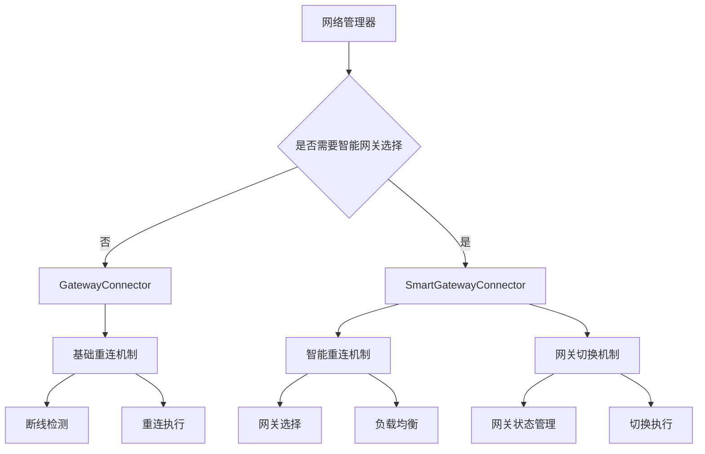
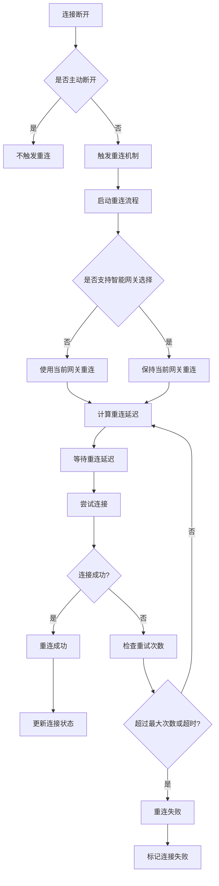
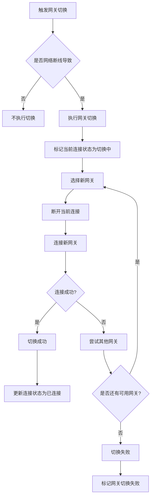

# 客户端断线重连机制设计文档

## 1. 概述

本文档旨在设计客户端断线重连机制，遵循职责单一原则，确保网络重连机制顺畅，逻辑清晰，职责单一，杜绝外部干扰。在关键位置增加必要的调试日志，以便于问题排查和系统监控。

### 1.1 设计目标

- 确保网络重连机制顺畅，逻辑清晰，职责单一
- 明确区分网关切换和断线重连机制，杜绝逻辑混乱
- 网关智能切换和断线重连作为网络管理的基座必须逻辑清晰职责单一杜绝外部干扰
- 仅在关键节点记录必要的调试日志，避免影响系统性能

### 1.2 适用范围

本设计适用于HundunWorld游戏客户端的网络连接和重连机制，包括：
- GatewayConnector类（基础重连）
- SmartGatewayConnector类（智能重连和网关切换）
- ReconnectConfig类
- 相关的网络管理组件

## 2. 架构设计

### 2.1 系统组件

客户端重连机制主要由以下几个组件构成：

| 组件 | 职责 |
|------|------|
| GatewayConnector | 基础网关连接器，负责与指定网关建立连接，处理基础重连逻辑 |
| SmartGatewayConnector | 智能网关连接器，继承基础重连功能，额外支持网关选择、切换和负载均衡 |
| ReconnectConfig | 重连配置，定义重连策略和参数 |
| NetworkManager | 网络管理器，处理底层网络通信 |

### 2.2 职责划分



### 2.3 断线重连流程



### 2.4 网关切换流程



## 3. 关键日志点设计

### 3.1 重连机制日志

在断线重连机制中，仅在关键节点记录必要的日志：

```
[INFO] [重连开始] 触发重连机制，原因: {ReconnectReason}
[DEBUG] [重连延迟] 计算重连延迟，策略: {ReconnectStrategy}, 尝试次数: {AttemptNumber}
[INFO] [连接尝试] 尝试连接到网关 {GatewayIP}:{GatewayPort} (尝试 {AttemptNumber})
[INFO] [重连结果] 重连{Success}，尝试次数: {AttemptNumber}，耗时: {Duration}ms
```

### 3.2 网关切换日志

在网关切换机制中，仅在关键节点记录必要的日志：

```
[INFO] [网关切换] 开始网关切换，原因: {SwitchReason}
[DEBUG] [网关选择] 选择到新网关: {GatewayInfo}
[INFO] [切换结果] 网关切换{Success}，从 {OldGateway} 切换到 {NewGateway}
```

## 4. 实现细节

### 4.1 GatewayConnector实现

GatewayConnector类仅负责基础重连逻辑：

1. 检测连接断开
2. 执行重连尝试
3. 记录必要的重连日志
4. 不处理网关切换逻辑

### 4.2 SmartGatewayConnector实现

SmartGatewayConnector类在继承基础功能外，处理网关选择和切换：

1. 网关选择和负载均衡
2. 网络断线后的网关切换
3. 记录必要的切换日志
4. 确保切换和重连机制相互独立

### 4.3 状态管理

使用ConnectionStatus枚举管理连接状态：

- Disconnected: 已断开
- Connecting: 连接中
- Connected: 已连接
- Reconnecting: 重连中
- GatewaySwitching: 网关切换中（新增）
- Error: 错误状态（新增）
- Failed: 连接失败

## 5. 日志级别规范

| 日志级别 | 使用场景 | 示例 |
|----------|----------|------|
| DEBUG | 详细的调试信息，仅在开发和问题排查时启用 | 延迟计算过程、网关选择细节 |
| INFO | 重要的流程信息，用于监控系统状态 | 连接尝试、重连结果、切换结果 |
| WARN | 潜在的问题，但不影响系统运行 | 连接失败、重连尝试 |
| ERROR | 严重错误，需要立即关注 | 重连失败、切换失败 |

## 6. 性能考虑

1. 日志记录采用异步方式，避免阻塞网络操作
2. 生产环境中默认仅记录INFO级别及以上日志
3. 日志内容避免包含敏感信息
4. 日志格式统一，便于日志收集和分析


