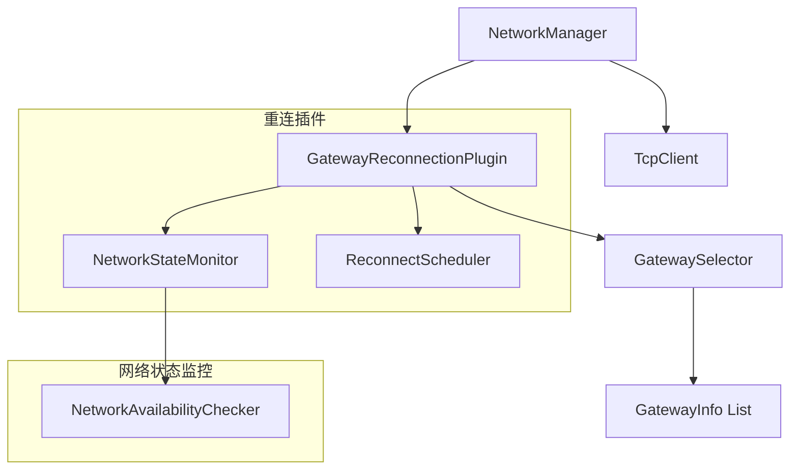
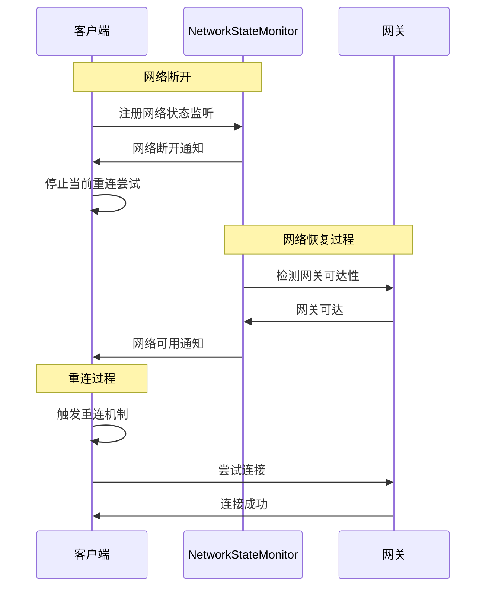
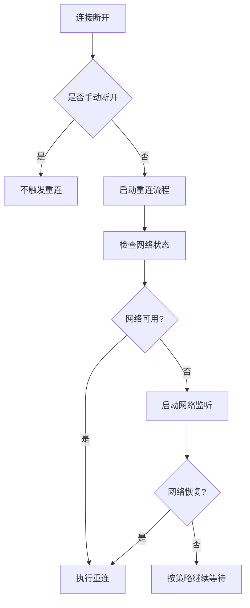
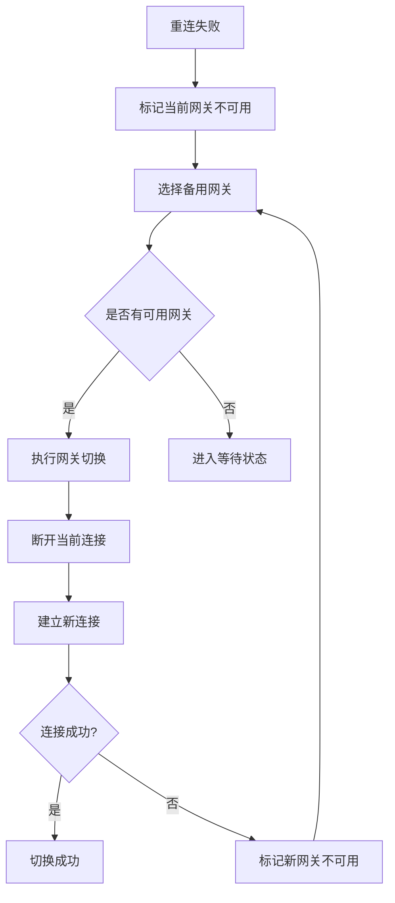

# 客户端断线重连机制修复设计文档

<!--
<auto-generated>
    本文档由Qoder AI基于项目代码分析自动生成，包含对客户端断线重连问题的分析和解决方案。
</auto-generated>
-->

## 1. 概述

### 1.1 问题描述
当前客户端断线重连机制存在以下问题：
1. 在无网络情况下，客户端无法监听到服务端上线
2. 重连机制在某些网络异常情况下无法正常触发
3. 网关切换逻辑存在缺陷，可能导致重连失败

### 1.2 设计目标
1. 实现客户端在网络恢复后能够自动检测并重连到服务端
2. 优化重连机制，提高在网络不稳定环境下的连接成功率
3. 完善网关切换逻辑，确保在主网关不可用时能正确切换到备用网关
4. 增强重连过程中的状态管理和错误处理

## 2. 架构设计

### 2.1 当前架构分析
当前断线重连机制基于TouchSocket的`ReconnectionPlugin`模式实现，主要组件包括：
- `GatewayReconnectionPlugin<TClient>`: 网关重连插件，继承自`ReconnectionPlugin<TClient>`
- `NetworkManager`: 网络管理器，负责TCP客户端的连接管理
- `GatewaySelector`: 网关选择器，负责选择最佳网关服务器

### 2.2 存在的问题
1. **网络监听机制缺失**: 当前实现没有在网络恢复时主动检测服务端状态
2. **重连逻辑不完善**: 重连过程中没有考虑网络状态变化的监听
3. **网关切换缺陷**: 网关切换时没有正确处理连接状态和资源释放

### 2.3 改进方案架构


## 3. 核心组件设计

### 3.1 NetworkStateMonitor (新增)
负责监控网络状态变化，检测网络连接/断开事件。

#### 3.1.1 功能职责
- 监控设备网络状态变化
- 检测网络连通性
- 通知重连插件网络状态变化

#### 3.1.2 接口设计
```csharp
public interface INetworkStateMonitor
{
    event Action<NetworkStatus> NetworkStatusChanged;
    NetworkStatus GetCurrentStatus();
    Task<bool> IsNetworkAvailableAsync();
    Task<bool> IsGatewayReachableAsync(string ip, int port);
}
```

### 3.2 NetworkAvailabilityChecker (新增)
负责检查特定网关的可用性。

#### 3.2.1 功能职责
- 定期检查网关可达性
- 提供网关状态变化通知
- 支持多网关并行检测
- 实现指数退避检测策略，避免频繁检测影响性能

### 3.3 ReconnectScheduler (增强)
负责管理重连任务的调度和执行。

#### 3.3.1 功能增强
- 支持基于网络状态变化的重连触发
- 实现指数退避重连策略
- 提供重连任务取消机制

## 4. 详细设计

### 4.1 GatewayReconnectionPlugin 改进

#### 4.1.1 网络状态监听增强

在现有的`GatewayReconnectionPlugin`基础上，增加网络状态监听机制：

1. **添加网络状态监控器**:
   - 集成`INetworkStateMonitor`接口实现
   - 监听设备网络连接状态变化
   - 在网络恢复时主动触发重连机制

2. **改进OnTcpClosed处理逻辑**:
   - 增加网络状态检查
   - 在无网络情况下启动网络监听而非立即重连
   - 优化重连任务管理，避免重复重连任务



#### 4.1.2 重连逻辑优化
1. **网络状态感知重连**:
   - 当检测到网络断开时，暂停所有重连尝试
   - 当网络恢复时，立即触发重连机制
   - 增加网络连通性检测，确保网络真正可用

2. **网关切换优化**:
   - 在网关切换前保存当前连接状态
   - 确保资源正确释放后再建立新连接
   - 增加切换失败的回退机制

### 4.2 NetworkManager 改进

#### 4.2.1 状态管理增强
增加对网络状态变化的处理:
- 监听网络状态变化事件
- 根据网络状态调整连接策略
- 提供网络状态查询接口
- 增加上下文保存和恢复机制，确保断线重连后能恢复到之前的状态

### 4.3 GatewaySelector 改进

#### 4.3.1 网关可用性检测
增强网关可用性检测逻辑:
- 增加多维度检测（延迟、连接性、服务状态）
- 实现检测结果缓存，避免频繁检测
- 提供检测结果通知机制

## 5. 数据模型

### 5.1 NetworkStatus (新增)
```csharp
public enum NetworkStatus
{
    Unknown,
    Connected,
    Disconnected,
    Limited
}
```

### 5.2 ReconnectContext (新增)
```csharp
public class ReconnectContext
{
    public NetworkStatus NetworkStatus { get; set; }
    public GatewayInfo CurrentGateway { get; set; }
    public List<GatewayInfo> AvailableGateways { get; set; }
    public int ReconnectAttempts { get; set; }
    public DateTime LastReconnectTime { get; set; }
    public ReconnectStrategy Strategy { get; set; }
}
```

## 6. 业务逻辑层

### 6.1 重连触发机制


### 6.2 网关切换逻辑


## 7. 异常处理与错误恢复

### 7.1 网络异常处理
1. **网络断开处理**:
   - 立即停止所有正在进行的连接尝试
   - 保存当前连接上下文信息
   - 启动网络状态监听

2. **重连失败处理**:
   - 根据失败原因调整重连策略
   - 记录失败日志用于问题诊断
   - 在适当时候触发网关切换

### 7.2 资源管理
1. **连接资源释放**:
   - 确保每次重连前正确释放上一次连接资源
   - 避免连接泄露和资源占用

2. **定时器管理**:
   - 正确管理重连定时器的启动和停止
   - 避免定时器累积导致的性能问题

## 8. 测试策略

### 8.1 测试环境配置
1. **网络模拟环境**:
   - 使用网络模拟工具模拟各种网络条件（断网、高延迟、丢包等）
   - 配置多个测试网关服务器，模拟不同网络质量
   - 搭建专用测试网络环境，可控制网络状态变化

2. **测试工具**:
   - 网络模拟器（如Network Emulator）
   - 自动化测试框架
   - 日志分析工具

### 8.2 单元测试
1. **NetworkStateMonitor测试**:
   - 网络状态变化检测
   - 网关可达性检测
   - 网络恢复事件触发测试
   - 多网关并发检测测试

2. **GatewayReconnectionPlugin测试**:
   - 重连逻辑测试
   - 网关切换测试
   - 重连策略执行测试
   - 网络状态响应测试

### 8.3 集成测试
1. **网络断开/恢复场景测试**:
   - 模拟网络断开后恢复的重连过程
   - 验证重连成功率和时间
   - 验证断线期间消息缓存和重发机制

2. **网关切换场景测试**:
   - 主网关不可用时的切换过程
   - 多网关切换的正确性验证
   - 切换过程中的数据一致性验证
   - 切换失败后的回退机制测试

3. **无网络环境测试**:
   - 模拟完全无网络连接环境，验证客户端行为
   - 在无网络状态下启动客户端，检查是否正确处理连接失败
   - 模拟网络从无到有的恢复过程，验证客户端能否正确检测并连接
   - 验证在网络状态频繁变化时的重连稳定性
   - 验证长时间无网络连接后的重连能力

### 8.4 具体测试用例
1. **TC001: 网络断开后自动重连**
   - 步骤：连接服务器后断开网络，等待一段时间后恢复网络
   - 预期：客户端应自动检测到网络恢复并重新连接服务器

2. **TC002: 无网络启动客户端**
   - 步骤：在无网络环境下启动客户端
   - 预期：客户端应正确处理连接失败，并在网络恢复后自动连接

3. **TC003: 网关切换测试**
   - 步骤：连接主网关后关闭主网关，观察是否切换到备用网关
   - 预期：客户端应自动切换到备用网关并保持连接

4. **TC004: 网络频繁断开/恢复**
   - 步骤：模拟网络频繁断开和恢复
   - 预期：客户端应稳定处理网络变化，不会出现连接异常

## 9. 性能与安全考虑

### 9.1 性能优化
1. **减少不必要的网络检测**:
   - 实现检测结果缓存机制
   - 避免频繁的网关可达性检测

2. **优化重连间隔**:
   - 根据网络状况动态调整重连间隔
   - 实现智能退避策略

### 9.2 安全考虑
1. **连接安全性**:
   - 确保重连过程中数据传输的安全性
   - 验证网关身份防止中间人攻击

2. **资源安全**:
   - 防止重连过程中资源泄露
   - 确保并发安全的资源访问