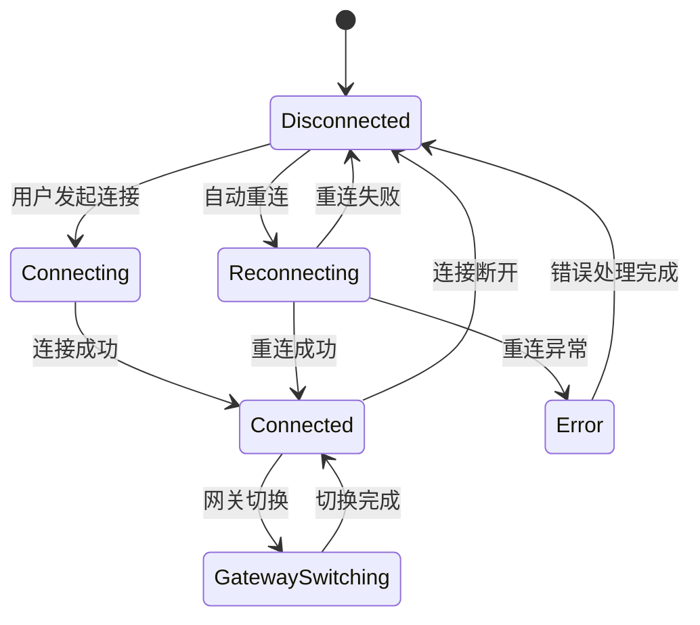
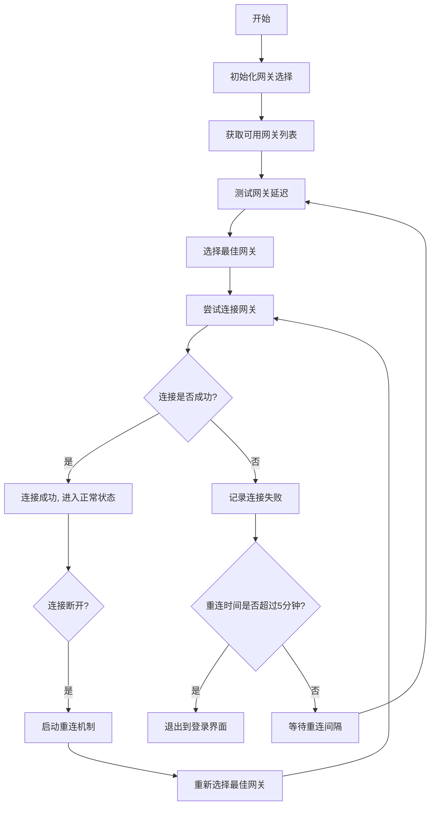

# 客户端断线自动重连与网关选择优化设计文档

## 1. 概述

本文档旨在设计并优化客户端断线自动重连机制，确保在网络不稳定或服务器临时不可用的情况下，客户端能够自动尝试重新连接，并在5分钟内无法连接时自动退出到登录界面。同时，优化网关选择机制，使客户端在初始化连接和断线重连时能够智能选择最佳网关。

## 2. 设计目标

- 实现智能的自动重连机制
- 限制重连尝试时间为5分钟
- 超时后自动返回登录界面
- 提供清晰的用户反馈信息
- 保证系统资源的合理使用
- 在初始化连接和断线重连时增加网关选择机制
- 实现网关延迟检测和最优网关选择

## 3. 架构设计

### 3.1 当前连接状态枚举

系统已定义的连接状态枚举包含以下值：



### 3.2 连接与重连机制流程



## 4. 核心组件设计

### 4.1 GatewayConnector 优化

GatewayConnector类将进行以下增强：

1. **重连时间限制**：新增5分钟时间限制机制
2. **状态管理**：增强连接状态跟踪
3. **用户反馈**：提供详细的重连进度信息
4. **网关选择集成**：在连接和重连时集成网关选择机制

### 4.2 NetworkManager 优化

NetworkManager类将进行以下增强：

1. **连接超时处理**：实现连接超时检测
2. **资源管理**：优化连接断开时的资源释放

### 4.3 GatewaySelector 增强

GatewaySelector类将进行以下增强：

1. **动态网关列表更新**：支持运行时更新网关列表
2. **网关可用性管理**：标记网关为可用或不可用状态
3. **网关负载均衡**：考虑网关负载进行选择

## 5. 详细设计方案

### 5.1 重连参数配置

| 参数 | 类型 | 默认值 | 说明 |
|------|------|--------|------|
| MaxReconnectAttempts | int | 无限 | 最大重连尝试次数 |
| ReconnectDelayMs | int | 5000 | 基础重连间隔(毫秒) |
| MaxReconnectDuration | TimeSpan | 5分钟 | 最大重连持续时间 |
| ReconnectStrategy | ReconnectStrategy | ExponentialBackoff | 重连策略 |

### 5.2 网关选择机制

1. **网关列表获取**：从配置或服务端获取可用网关列表
2. **网关延迟测试**：并发测试各网关连接延迟
3. **最优网关选择**：根据延迟和负载选择最佳网关
4. **网关状态管理**：动态更新网关可用性状态

### 5.3 重连策略

采用指数退避算法，重连间隔随尝试次数增加而增长：

```
重连间隔 = Min(基础间隔 * (2 ^ (尝试次数-1)), 最大间隔)
```

### 5.4 状态管理

新增以下状态管理机制：

1. **重连开始时间记录**：记录首次断开连接的时间
2. **重连持续时间计算**：实时计算重连已用时间
3. **状态转换处理**：处理各种连接状态间的转换
4. **网关状态跟踪**：跟踪网关选择和切换状态

### 5.5 用户界面反馈

在连接和重连过程中，需要向用户提供以下反馈：

1. 当前连接状态
2. 网关选择进度
3. 网关延迟测试结果
4. 连接尝试进度
5. 重连失败原因
6. 超时退出提示

## 6. 异常处理

### 6.1 资源释放

在连接和重连过程中，确保正确释放以下资源：

1. 网络连接资源
2. 定时器资源
3. 事件订阅资源
4. 网关测试连接资源

### 6.2 线程安全

确保连接和重连机制的线程安全性，避免多线程环境下出现竞态条件。

### 6.3 网关选择异常处理

1. **网关列表为空**：提供默认网关或错误提示
2. **网关测试失败**：标记网关为不可用并尝试其他网关
3. **所有网关不可用**：提示用户并返回登录界面

## 7. 测试策略

### 7.1 单元测试

1. 重连时间计算测试
2. 重连策略算法测试
3. 状态转换测试
4. 资源释放测试
5. 网关选择算法测试
6. 网关延迟测试功能测试

### 7.2 集成测试

1. 模拟网络断开重连测试
2. 5分钟超时退出测试
3. 多次断线重连测试
4. 异常情况处理测试
5. 网关选择功能测试
6. 多网关负载均衡测试

## 8. 性能考虑

1. **内存使用**：避免在重连过程中产生过多临时对象
2. **CPU占用**：合理设置重连间隔，避免频繁尝试占用过多CPU
3. **网络资源**：控制重连频率，避免对服务器造成过大压力
4. **网关测试并发**：合理控制并发测试网关数量，避免网络拥塞