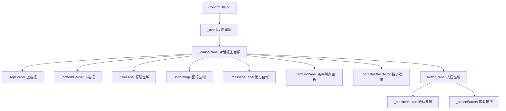
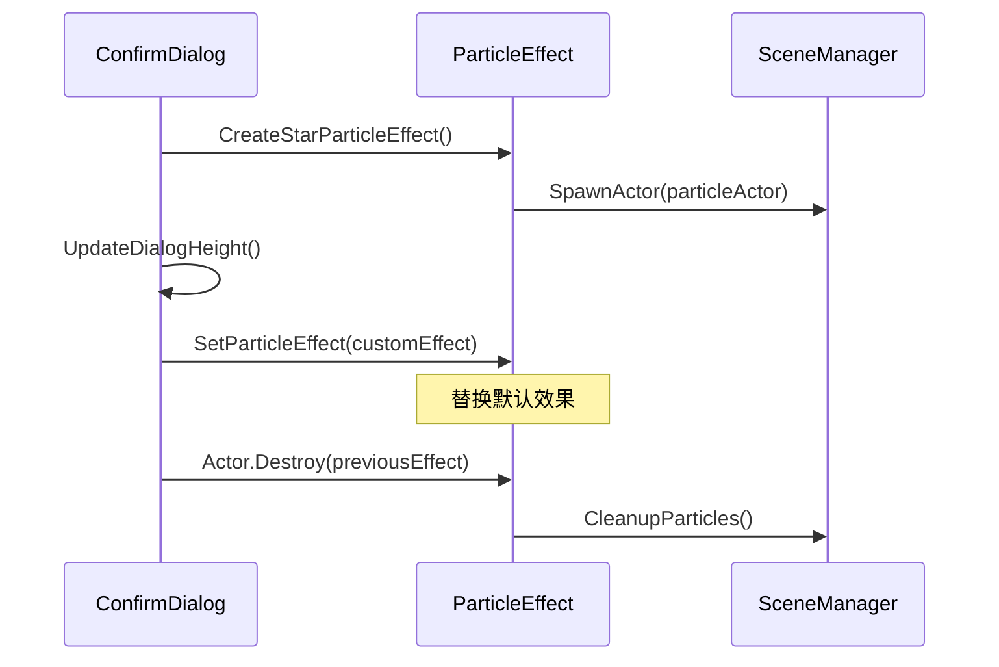
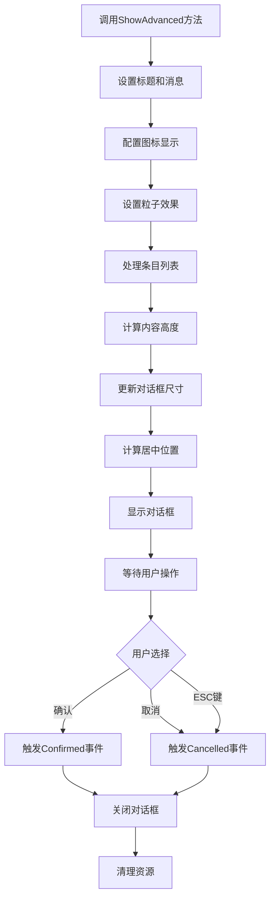
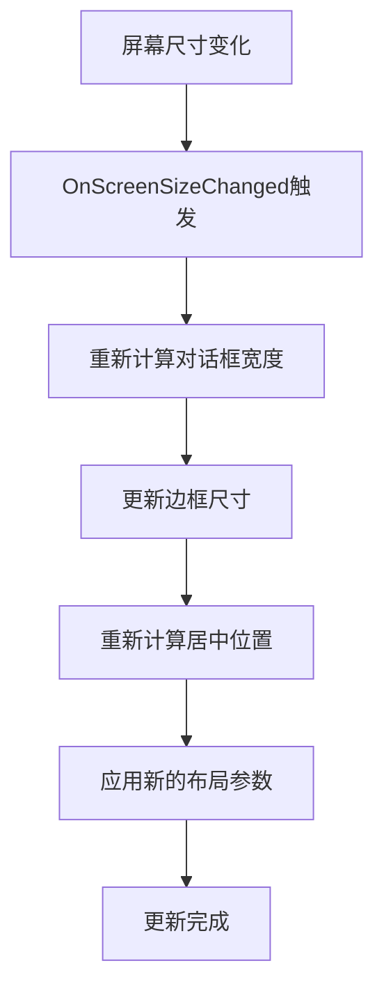

# ConfirmDialog 确认对话框样式优化设计文档

## 概述

本设计文档旨在优化现有的ConfirmDialog类，使其实现垂直居中、水平拉伸的布局方案，并增强视觉效果和用户体验。主要目标是创建一个具有中国古典风格的现代化确认对话框，支持图标、文字、粒子效果以及条目列表的展示。

## 设计目标

### 核心功能要求
- 实现垂直居中、水平拉伸的响应式布局
- 支持上下边框的渐变色效果，无左右边框
- 集成星空粒子效果作为默认背景动画
- 支持图标、文字内容和条目列表的显示
- 高度根据内容自适应调整
- 为条目类文字提供图标占位符功能

### 视觉设计要求
- 遵循中国古典主题设计规范
- 使用UIHelper工具类进行样式统一管理
- 支持多分辨率屏幕的适配
- 提供优雅的动画和过渡效果

## 技术架构

### 组件层次结构

### 布局设计规范

| 布局属性 | 配置说明 | 实现方式 |
|---------|---------|---------|
| 垂直定位 | 屏幕垂直居中 | AnchorPresets.MiddleCenter + 动态位置计算 |
| 水平布局 | 水平拉伸至屏幕80%宽度 | 动态计算：Screen.Size.X * 0.8f |
| 高度适应 | 根据内容自动调整 | 基础高度200px + 动态内容高度计算 |
| 边框样式 | 仅上下边框，渐变色效果 | 3px高度Panel + 渐变色背景 |
| 响应式适配 | 支持超宽屏和标准屏幕 | ResponsiveLayoutCalculator辅助计算 |

## 详细设计

### 布局系统优化

#### 居中定位算法
对话框将使用精确的数学计算实现屏幕居中：

**水平居中计算**：
- X坐标 = (Screen.Size.X - dialogWidth) / 2
- 对话框宽度 = Screen.Size.X * 0.8f（确保在不同分辨率下的一致性）

**垂直居中计算**：
- Y坐标 = (Screen.Size.Y - dialogHeight) / 2
- 高度根据内容动态调整，确保始终垂直居中

#### 高度自适应机制

高度计算采用分层叠加方式：

| 内容类型 | 高度计算方式 | 备注 |
|---------|-------------|------|
| 基础结构 | 200px | 标题区域(60px) + 按钮区域(60px) + 边距(80px) |
| 图标区域 | +70px | 当显示图标时额外增加 |
| 消息文本 | 动态计算 | 基于文本长度和宽度估算行数 |
| 条目列表 | +45px * 条目数 + 20px | 每个条目45px高度，额外20px边距 |
| 最小高度 | 300px | 确保对话框不会过小 |

### 边框渐变设计

#### 渐变色方案
基于ChineseClassicalTheme的色彩体系：

**上边框渐变**：
- 主色：黛青色（PrimaryColor: #2D5569）
- 渐变效果：从深到浅的蓝色系过渡
- 高度：3px

**下边框渐变**：
- 主色：古典金色（SecondaryColor: #CDA555） 
- 渐变效果：从深到浅的金色系过渡
- 高度：3px

#### 边框实现方案
由于Flax引擎Panel不支持直接的BorderColor属性，采用以下替代方案：

1. **背景色模拟**：使用渐变背景色创建边框视觉效果
2. **嵌套Panel**：通过嵌套Panel布局模拟边框
3. **UIHelper扩展**：通过UIHelper.ApplyPanelBorder方法统一管理

### 粒子效果系统

#### 默认星空粒子效果

**效果特征**：
- 粒子类型：星星点点的光芒效果
- 动画模式：缓慢移动和闪烁
- 颜色方案：与中国古典主题协调的蓝白色系
- 密度控制：适中密度，不干扰文字阅读

**技术实现**：
- 使用Actor-based粒子系统
- 支持自定义粒子效果替换
- 粒子效果与对话框生命周期同步

#### 粒子效果管理

### 图标和条目系统

#### 图标显示机制

**图标配置**：
- 尺寸：50x50像素
- 位置：对话框顶部中央，标题下方
- 支持格式：Sprite资源
- 显示控制：通过Visible属性控制显示/隐藏

**图标占位符设计**：
- 当未提供图标时显示默认占位符
- 占位符样式与整体主题协调
- 支持动态图标替换

#### 条目列表设计

**条目结构**：

| 属性 | 类型 | 说明 |
|------|------|------|
| Text | string | 条目显示文本 |
| Icon | SpriteHandle | 条目图标（可选） |
| IsSelected | bool | 选中状态（扩展功能） |

**布局规范**：
- 每个条目高度：45px
- 图标区域：30x30px，左对齐
- 文字区域：右侧剩余空间，左对齐
- 条目间距：5px
- 列表内边距：20px

#### 条目图标占位符

当条目没有指定图标时，系统将显示统一的占位符：
- 占位符样式：简洁的几何图形或点状标记
- 颜色：使用ChineseClassicalTheme.SecondaryColor
- 确保视觉一致性和良好的信息层次

## 用户交互流程

### 对话框显示流程

### 响应式适配流程

## API接口规范

### 核心方法接口

| 方法名 | 参数 | 返回值 | 功能描述 |
|--------|------|--------|----------|
| ShowAdvanced | title, message, icon, particleEffect, items, isButton, action | void | 显示增强版对话框 |
| ShowSimple | title, message, isButton, action | void | 显示简化版对话框 |
| SetIcon | icon: Sprite | void | 设置对话框图标 |
| SetParticleEffect | particleEffect: Actor | void | 设置粒子效果 |
| AddItem | text: string, icon: Sprite | void | 添加条目到列表 |
| UpdateDialogHeight | 无 | void | 更新对话框高度 |
| CenterDialog | 无 | void | 重新计算居中位置 |

### 静态工厂方法

| 方法名 | 参数 | 返回值 | 功能描述 |
|--------|------|--------|----------|
| CreateLogoutDialog | onConfirm: Action | ConfirmDialog | 创建登出确认对话框 |
| CreateAdvancedDialog | title, message, icon, items, onConfirm | ConfirmDialog | 创建高级对话框 |
| CreateDeleteDialog | itemName: string, onConfirm: Action | ConfirmDialog | 创建删除确认对话框 |

### 事件接口

| 事件名 | 参数类型 | 触发时机 |
|--------|----------|----------|
| Confirmed | Action | 用户点击确认按钮 |
| Cancelled | Action | 用户点击取消按钮或ESC键 |

## 样式主题集成

### ChineseClassicalTheme集成

对话框将深度集成ChineseClassicalTheme主题系统：

**色彩应用**：
- 背景色：PanelColor（青石色）
- 文字色：TextColor（清雅白）
- 强调色：SecondaryColor（古典金）
- 边框色：PrimaryColor（黛青色）

**视觉层次**：
- 标题：VisualHierarchy.Primary
- 按钮：VisualHierarchy.Primary/Secondary
- 条目文字：VisualHierarchy.Tertiary
- 说明文字：VisualHierarchy.Auxiliary

### UIHelper工具类扩展

为支持ConfirmDialog的特殊需求，UIHelper将提供以下扩展方法：

| 方法名 | 功能 | 备注 |
|--------|------|------|
| CreateGradientBorder | 创建渐变边框效果 | 专用于上下边框 |
| ApplyDialogStyle | 应用对话框专用样式 | 统一样式管理 |
| CalculateDialogSize | 计算对话框适合尺寸 | 响应式布局支持 |

## 性能优化策略

### 内存管理

**对象池化**：
- 对话框实例重用，避免频繁创建销毁
- 粒子效果Actor的合理生命周期管理
- 条目Panel的动态创建和回收

**资源管理**：
- 图标资源的异步加载和缓存
- 字体资源的预加载
- 粒子效果材质的共享

### 渲染优化

**批处理渲染**：
- 相同材质的UI元素批量渲染
- 减少Draw Call次数
- 优化透明度混合

**响应式计算优化**：
- 缓存布局计算结果
- 仅在必要时重新计算位置
- 使用增量更新策略

## 可访问性设计

### 键盘导航

- 支持Tab键在按钮间切换
- 支持Enter键确认操作
- 支持ESC键取消操作
- 支持方向键在条目列表中导航

### 屏幕阅读器支持

- 为重要UI元素提供明确的标签
- 确保文字对比度符合可访问性标准
- 支持屏幕阅读器的焦点管理

## 测试策略

### 单元测试

**布局测试**：
- 验证居中计算的准确性
- 测试高度自适应算法
- 验证边框位置计算

**功能测试**：
- 测试图标显示/隐藏逻辑
- 验证条目列表的动态更新
- 测试粒子效果的生命周期

### 集成测试

**多分辨率测试**：
- 标准分辨率（1920x1080）
- 超宽屏分辨率（3440x1440）
- 移动设备分辨率（竖屏模式）

**主题兼容性测试**：
- 验证与ChineseClassicalTheme的集成
- 测试色彩方案的一致性
- 验证视觉层次的正确应用

### 性能测试

**内存使用测试**：
- 测量对话框创建销毁的内存占用
- 监控粒子效果的内存使用
- 验证资源释放的完整性

**响应时间测试**：
- 测量对话框显示的响应时间
- 验证布局计算的性能
- 测试大量条目时的渲染性能

## 维护和扩展

### 向后兼容性

确保现有代码的平滑迁移：
- 保持现有API接口不变
- 新增功能通过可选参数实现
- 提供迁移指南和示例

### 扩展接口

为未来功能扩展预留接口：
- 自定义动画效果接口
- 主题切换支持接口
- 多语言本地化接口

### 文档维护

- 保持API文档的及时更新
- 提供详细的使用示例
- 维护设计决策的变更记录
