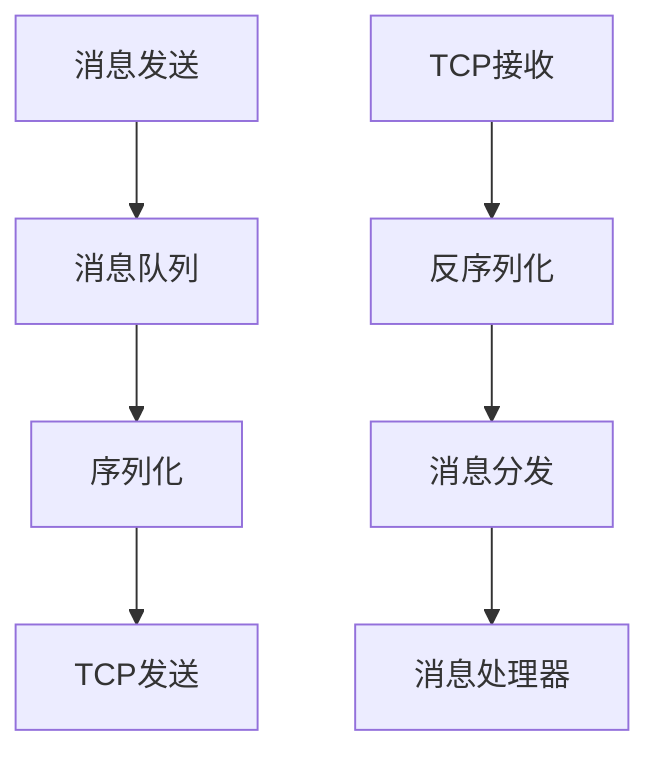
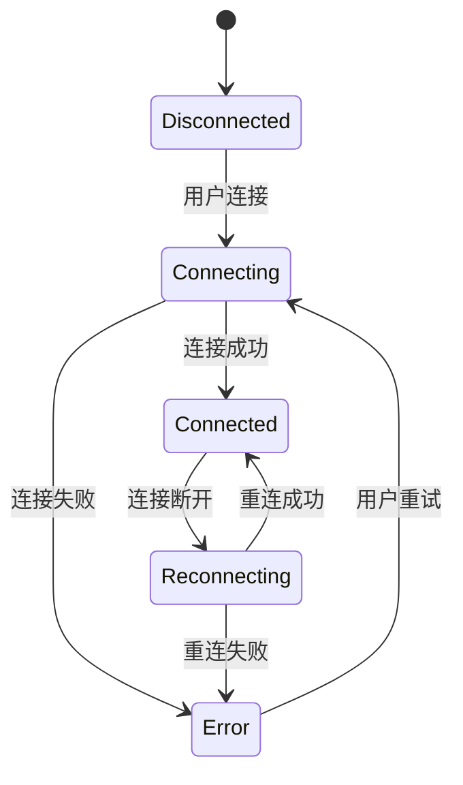
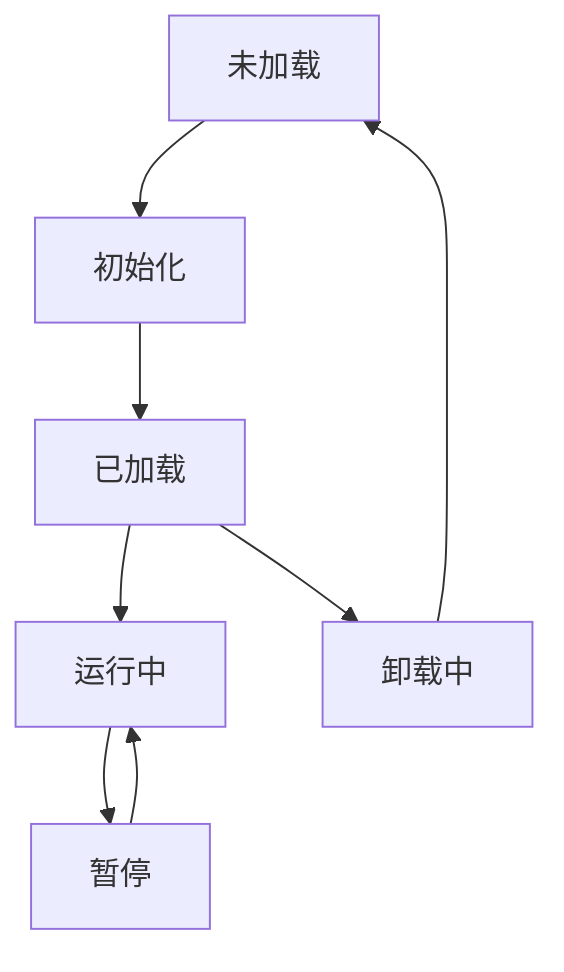

# 客户端原型开发设计文档

## 1. 概述

本文档旨在规划混沌世界MMORPG客户端原型的后续开发工作。基于现有代码架构，我们将继续完善网络通信、游戏模块、ECS系统等核心功能，为后续的游戏功能开发奠定坚实基础。

## 2. 当前架构分析

### 2.1 项目结构
```
HundunWorld/
├── Source/
│   ├── Game/
│   │   ├── Network/          # 网络通信层
│   │   ├── Modules/          # 游戏模块系统
│   │   ├── ECS/              # 实体组件系统
│   │   ├── World/            # 世界管理
│   │   ├── Performance/      # 性能监控
│   │   └── Game.Build.cs     # 项目构建配置
│   └── Game.csproj           # 项目文件
```

### 2.2 核心组件

1. **网络管理器(NetworkManager)**
   - 基于TouchSocket实现TCP连接
   - 支持自动网关选择和重连机制
   - 集成HorizonMessageAdapter进行消息序列化/反序列化
   - 支持心跳检测和连接状态管理

2. **消息处理系统**
   - 使用MessageProcessor分发消息到对应的处理器
   - 支持多种消息类型处理（登录、注册、心跳等）
   - 基于MessageHandler接口的可扩展设计

3. **模块管理系统**
   - 通过ModuleManager管理游戏模块
   - 支持模块的加载、卸载和更新
   - 提供IGameModule接口规范

4. **ECS系统**
   - 基础的实体组件系统框架
   - 包含组件和系统的基本结构

5. **性能监控**
   - PerformanceMonitor用于监控操作性能
   - NetworkOptimizer优化网络通信

## 3. 后续开发计划

### 3.1 网络通信增强

#### 3.1.1 消息处理扩展
- 实现更多游戏消息处理器：
  - 角色选择/创建消息处理器
  - 场景切换消息处理器
  - 聊天消息处理器
  - 战斗消息处理器

#### 3.1.2 连接稳定性优化
- 增强断线重连机制
- 实现连接超时处理
- 添加网络状态UI反馈

#### 3.1.3 消息压缩优化
- 优化LZ4压缩策略
- 实现智能压缩（根据消息大小和类型动态决定是否压缩）

### 3.2 游戏模块开发

#### 3.2.1 核心模块实现
- 登录模块：处理用户认证和角色选择
- 场景模块：管理游戏场景加载和切换
- 角色模块：管理玩家角色状态和行为
- 聊天模块：实现聊天功能

#### 3.2.2 模块间通信机制
- 实现模块间事件系统
- 设计模块依赖管理

### 3.3 ECS系统完善

#### 3.3.1 组件系统扩展
- 实现基础游戏组件（位置、移动、渲染等）
- 设计组件池以提高性能

#### 3.3.2 系统更新机制
- 实现系统间的依赖关系管理
- 优化系统更新顺序

### 3.4 UI系统设计

#### 3.4.1 UI框架搭建
- 设计UI管理器
- 实现UI层级管理
- 支持UI动画和过渡效果

#### 3.4.2 核心界面开发
- 登录界面
- 角色选择界面
- 主游戏界面
- 聊天界面

### 3.5 性能优化

#### 3.5.1 网络优化
- 实现消息批处理
- 优化网络包大小
- 添加网络流量统计

#### 3.5.2 内存优化
- 实现对象池机制
- 优化资源加载和释放
- 添加内存使用监控

## 4. 技术实现方案

### 4.1 网络层改进

#### 4.1.1 消息队列机制


#### 4.1.2 连接状态管理


### 4.2 模块系统设计

#### 4.2.1 模块生命周期


### 4.3 ECS架构扩展

#### 4.3.1 ECS组件设计
- PositionComponent: 位置信息
- MovementComponent: 移动相关数据
- RenderComponent: 渲染信息
- HealthComponent: 生命值信息
- CombatComponent: 战斗相关数据

#### 4.3.2 ECS系统设计
- MovementSystem: 处理实体移动
- RenderingSystem: 处理实体渲染
- CombatSystem: 处理战斗逻辑
- CollisionSystem: 处理碰撞检测

## 5. 开发优先级

### 第一阶段（高优先级）
1. 完善网络通信功能
   - 实现完整的消息处理机制
   - 增强连接稳定性
2. 开发核心游戏模块
   - 登录模块
   - 角色管理模块

### 第二阶段（中优先级）
1. 完善ECS系统
   - 实现基础组件和系统
   - 优化系统更新机制
2. UI系统开发
   - 搭建UI框架
   - 实现核心界面

### 第三阶段（低优先级）
1. 性能优化
   - 网络优化
   - 内存优化
2. 扩展功能模块
   - 聊天模块
   - 社交模块

## 6. 测试策略

### 6.1 单元测试
- 网络消息序列化/反序列化测试
- 模块加载/卸载测试
- ECS系统更新测试

### 6.2 集成测试
- 网络连接和消息处理测试
- 模块间通信测试
- UI交互测试

### 6.3 性能测试
- 网络延迟和吞吐量测试
- 内存使用测试
- FPS稳定性测试