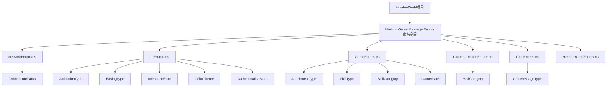

# HundunWorld项目枚举迁移与代码错误修复设计文档

## 1. 概述

本文档旨在设计和规划将HundunWorld项目中的枚举类型迁移至Horizon.Game.Message项目的过程，并修复相关代码错误。迁移后，所有客户端和网络消息相关的枚举都将统一定义在Horizon.Game.Message项目中，以确保代码的一致性和可维护性。

## 2. 架构设计

### 2.1 迁移原则

- 所有与客户端或网络消息相关的枚举必须迁移到Horizon.Game.Message项目
- 保持枚举的语义和值不变，确保向后兼容性
- 更新所有引用这些枚举的代码，指向新的命名空间
- 删除HundunWorld项目中重复的枚举定义

### 2.2 项目结构变更

迁移前：
```
HundunWorld/
  └── Source/
      └── Game/
          ├── Network/
          │   └── ConnectionStatus.cs (定义ConnectionStatus枚举)
          └── UI/
              ├── Chat/
              │   └── ChatMessage.cs (定义ChatMessageType枚举)
              └── UIEnums.cs (定义多个UI相关枚举)

Horizon.Game.Message/
  └── Enums/
      ├── CommunicationEnums.cs
      ├── GameEnums.cs
      ├── MessageType.cs
      ├── NetworkEnums.cs
      ├── RewardType.cs
      ├── ServiceType.cs
      └── UIEnums.cs
```

迁移后：
```
HundunWorld/
  └── Source/
      └── Game/
          ├── Network/
          └── UI/
              ├── Chat/
              └── Panels/
                  └── QuestPanel.cs (引用Horizon.Game.Message.Enums.RewardType)

Horizon.Game.Message/
  └── Enums/
      ├── CommunicationEnums.cs
      ├── GameEnums.cs
      ├── MessageType.cs
      ├── NetworkEnums.cs
      ├── RewardType.cs
      ├── ServiceType.cs
      ├── UIEnums.cs
      ├── ChatEnums.cs (新增)
      ├── HundunWorldEnums.cs (新增)
      └── NetworkEnums.cs (更新)
```

## 3. 枚举迁移详细设计

### 3.1 需要迁移的枚举

| 枚举名称 | 当前位置 | 目标位置 | 说明 |
|---------|---------|---------|------|
| ConnectionStatus | HundunWorld/Source/Game/Network/ConnectionStatus.cs | Horizon.Game.Message/Enums/NetworkEnums.cs | 网络连接状态枚举 |
| ChatMessageType | HundunWorld/Source/Game/UI/Chat/ChatMessage.cs | Horizon.Game.Message/Enums/ChatEnums.cs | 聊天消息类型枚举 |
| AnimationType | HundunWorld/Source/Game/UI/UIEnums.cs | Horizon.Game.Message/Enums/UIEnums.cs | UI动画类型枚举 |
| EasingType | HundunWorld/Source/Game/UI/UIEnums.cs | Horizon.Game.Message/Enums/UIEnums.cs | 缓动类型枚举 |
| AnimationState | HundunWorld/Source/Game/UI/UIEnums.cs | Horizon.Game.Message/Enums/UIEnums.cs | 动画状态枚举 |
| ColorTheme | HundunWorld/Source/Game/UI/UIEnums.cs | Horizon.Game.Message/Enums/UIEnums.cs | 颜色主题枚举 |
| AuthenticationState | HundunWorld/Source/Game/UI/UIEnums.cs | Horizon.Game.Message/Enums/UIEnums.cs | 认证状态枚举 |
| MailCategory | HundunWorld/Source/Game/UI/UIEnums.cs | Horizon.Game.Message/Enums/CommunicationEnums.cs | 邮件分类枚举 |
| AttachmentType | HundunWorld/Source/Game/UI/UIEnums.cs | Horizon.Game.Message/Enums/GameEnums.cs | 附件类型枚举 |
| SkillType | HundunWorld/Source/Game/UI/UIEnums.cs | Horizon.Game.Message/Enums/GameEnums.cs | 技能类型枚举 |
| SkillCategory | HundunWorld/Source/Game/UI/UIEnums.cs | Horizon.Game.Message/Enums/GameEnums.cs | 技能分类枚举 |
| GameState | HundunWorld/Temp/Game/HundunWorldGameState.cs | Horizon.Game.Message/Enums/GameEnums.cs | 游戏状态枚举 |

### 3.2 新增枚举文件

#### 3.2.1 ChatEnums.cs
在Horizon.Game.Message/Enums目录下创建ChatEnums.cs文件，包含聊天相关的枚举定义。

```csharp
using System;

namespace Horizon.Game.Message.Enums
{
    /// <summary>
    /// 聊天消息类型
    /// </summary>
    public enum ChatMessageType
    {
        Normal,      // 普通消息
        System,      // 系统消息
        Private,     // 私聊消息
        Guild,       // 帮派消息
        Team,        // 队伍消息
        World,       // 世界消息
        Announcement // 公告消息
    }
}
```

#### 3.2.2 NetworkEnums.cs更新
在现有的Horizon.Game.Message/Enums/NetworkEnums.cs文件中添加ConnectionStatus枚举定义。

```csharp
    /// <summary>
    /// 连接状态枚举
    /// </summary>
    public enum ConnectionStatus
    {
        Disconnected,    // 未连接
        Connecting,      // 连接中
        Connected,       // 已连接
        Reconnecting,    // 重连中
        GatewaySwitching,// 网关切换中
        Error            // 错误状态
    }
```

#### 3.2.3 HundunWorldEnums.cs
在Horizon.Game.Message/Enums目录下创建HundunWorldEnums.cs文件，包含其他需要迁移的枚举定义。

```csharp
using System;

namespace Horizon.Game.Message.Enums
{
    /// <summary>
    /// UI动画类型枚举
    /// </summary>
    public enum AnimationType
    {
        FadeIn,
        FadeOut,
        SlideIn,
        SlideOut,
        ScaleIn,
        ScaleOut,
        Bounce,
        Elastic
    }

    /// <summary>
    /// 缓动类型枚举
    /// </summary>
    public enum EasingType
    {
        Linear,
        EaseIn,
        EaseOut,
        EaseInOut,
        EaseInQuad,
        EaseOutQuad,
        EaseInOutQuad,
        EaseInCubic,
        EaseOutCubic,
        EaseInOutCubic,
        EaseInQuart,
        EaseOutQuart,
        EaseInOutQuart,
        EaseInQuint,
        EaseOutQuint,
        EaseInOutQuint,
        EaseInSine,
        EaseOutSine,
        EaseInOutSine,
        EaseInExpo,
        EaseOutExpo,
        EaseInOutExpo,
        EaseInCirc,
        EaseOutCirc,
        EaseInOutCirc,
        EaseInBack,
        EaseOutBack,
        EaseInOutBack,
        EaseInBounce,
        EaseOutBounce,
        EaseInOutBounce,
        EaseInElastic,
        EaseOutElastic,
        EaseInOutElastic
    }

    /// <summary>
    /// 动画状态枚举
    /// </summary>
    public enum AnimationState
    {
        Idle,
        Playing,
        Paused,
        Completed,
        Stopped
    }

    /// <summary>
    /// 颜色主题枚举
    /// </summary>
    public enum ColorTheme
    {
        Classic,
        Dark,
        Light,
        Blue,
        Green,
        Red,
        Purple,
        Orange
    }

    /// <summary>
    /// 认证状态枚举
    /// </summary>
    public enum AuthenticationState
    {
        Login,
        Register,
        Loading,
        Success,
        Failed
    }

    /// <summary>
    /// 邮件分类枚举
    /// </summary>
    public enum MailCategory
    {
        All,
        Unread,
        System,
        Friend,
        Guild,
        Trade,
        Attachment
    }

    /// <summary>
    /// 附件类型枚举
    /// </summary>
    public enum AttachmentType
    {
        Gold,
        Silver,
        Experience,
        Item,
        Equipment,
        Skill,
        Title
    }

    /// <summary>
    /// 技能类型枚举
    /// </summary>
    public enum SkillType
    {
        Active,
        Passive,
        Ultimate,
        Buff,
        Debuff
    }

    /// <summary>
    /// 技能分类枚举
    /// </summary>
    public enum SkillCategory
    {
        Combat,
        Defense,
        Support,
        Movement,
        Crafting,
        Social
    }

    /// <summary>
    /// 游戏状态枚举
    /// </summary>
    public enum GameState
    {
        /// <summary>
        /// 初始化状态
        /// </summary>
        Initializing,

        /// <summary>
        /// 连接到网关
        /// </summary>
        Connecting,

        /// <summary>
        /// 登录状态
        /// </summary>
        Login,

        /// <summary>
        /// 角色选择状态
        /// </summary>
        CharacterSelect,

        /// <summary>
        /// 游戏中状态
        /// </summary>
        InGame,

        /// <summary>
        /// 断线重连状态
        /// </summary>
        Reconnecting,

        /// <summary>
        /// 错误状态
        /// </summary>
        Error
    }
}
```

## 4. 数据模型与引用关系

### 4.1 枚举依赖关系图



### 4.2 代码引用变更

迁移后，需要更新以下文件中的using语句和枚举引用：

1. HundunWorld/Source/Game/Network/ConnectionStatus.cs - 删除文件
2. HundunWorld/Source/Game/Network/Handlers/* - 更新ConnectionStatus引用
3. HundunWorld/Source/Game/UI/Chat/ChatMessage.cs - 更新ChatMessageType引用
4. HundunWorld/Source/Game/UI/Panels/QuestPanel.cs - 更新RewardType引用
5. HundunWorld/Source/Game/UI/UIEnums.cs - 删除文件
6. HundunWorld/Source/Game/UI/GameMain/GameMainUI.cs - 更新相关枚举引用
7. HundunWorld/Temp/Game/HundunWorldGameState.cs - 更新GameState引用

## 5. 业务逻辑层设计

### 5.1 迁移步骤

1. **分析现有枚举使用情况**
   - 识别所有使用迁移枚举的代码位置
   - 记录枚举值和语义定义
   - 分析枚举间的依赖关系

2. **创建新的枚举定义**
   - 在Horizon.Game.Message项目中创建相应的枚举文件
   - 复制枚举定义，保持语义和值一致
   - 确保枚举文档注释完整

3. **更新代码引用**
   - 修改所有引用旧枚举的代码，指向新的命名空间
   - 更新using语句
   - 确保类型转换和序列化逻辑正确

4. **清理旧定义**
   - 删除HundunWorld项目中重复的枚举定义文件
   - 确保没有残留引用
   - 更新项目依赖关系

5. **测试验证**
   - 编译项目确保无错误
   - 运行单元测试验证功能正常
   - 进行集成测试确保系统稳定
   - 验证网络消息序列化/反序列化正常

### 5.2 错误处理与兼容性

- 保持枚举值不变以确保序列化兼容性
- 对于已废弃的枚举值，添加注释说明
- 提供迁移指南文档给其他开发人员

## 6. 中间件与拦截器

### 6.1 命名空间引用管理

在迁移过程中，需要确保以下中间件正确处理命名空间变更：

1. **代码生成器** - 更新模板中的命名空间引用
2. **序列化组件** - 确保枚举序列化/反序列化正常工作
3. **消息处理器** - 更新消息处理逻辑中的枚举引用

## 7. 测试策略

### 7.1 单元测试

1. **枚举值测试**
   - 验证迁移后枚举值与原值一致
   - 测试枚举ToString()方法返回正确的字符串表示
   - 验证枚举的CompareTo方法正确工作

2. **序列化测试**
   - 测试枚举在网络消息中的序列化和反序列化
   - 验证不同版本间的兼容性
   - 测试枚举在不同编码格式下的序列化

3. **引用测试**
   - 测试所有使用迁移枚举的代码能正确编译
   - 验证运行时枚举值的正确性
   - 测试枚举在switch语句中的正确匹配

### 7.2 集成测试

1. **网络通信测试**
   - 验证客户端与服务器间使用枚举的消息传递正常
   - 测试不同网络状态下的枚举处理
   - 验证消息类型枚举在网络协议中的正确解析

2. **UI交互测试**
   - 验证UI组件中枚举相关的功能正常
   - 测试动画、主题等UI枚举的正确应用
   - 验证聊天系统中消息类型枚举的正确显示

3. **数据持久化测试**
   - 测试枚举值在数据库中的正确存储和读取
   - 验证枚举在配置文件中的序列化和反序列化

## 8. 迁移实施计划

### 8.1 阶段一：准备阶段
- [ ] 分析所有需要迁移的枚举
- [ ] 创建迁移清单和影响评估
- [ ] 准备测试用例
- [ ] 制定回滚计划

### 8.2 阶段二：实施阶段
- [ ] 在Horizon.Game.Message项目中创建新的枚举定义
- [ ] 更新HundunWorld项目中的代码引用
- [ ] 删除重复的枚举定义文件
- [ ] 进行代码审查
- [ ] 验证编译通过

### 8.3 阶段三：测试阶段
- [ ] 执行单元测试
- [ ] 执行集成测试
- [ ] 执行回归测试
- [ ] 修复发现的问题

### 8.4 阶段四：部署阶段
- [ ] 更新项目文档
- [ ] 通知团队成员变更
- [ ] 监控生产环境运行情况
- [ ] 收集反馈并优化