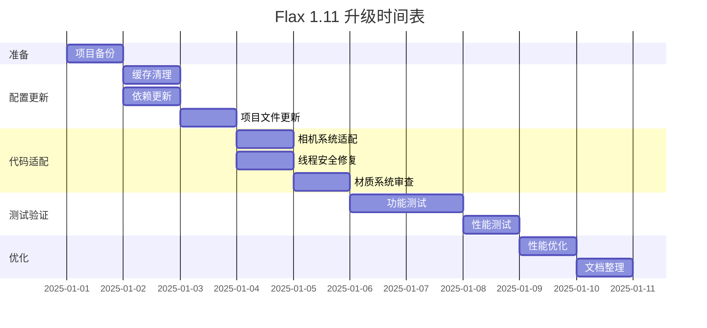

# Flax 1.11 引擎升级重构设计

## 概述

本设计文档定义了将 HundunWorld 项目从 Flax 1.10 升级到 Flax 1.11 的完整重构策略。该升级不仅涉及引擎版本的更新，还需要适配 Flax 1.11 引入的架构变化、新特性和突破性改动。

### 项目信息

| 属性 | 值 |
|------|-----|
| 项目名称 | HundunWorld |
| 项目路径 | D:\Long\FlaxProjcts\HundunWorld |
| 当前引擎版本 | Flax 1.10 |
| 目标引擎版本 | Flax 1.11 |
| .NET 目标框架 | .NET 10.0 |
| 平台 | Windows (x64, ARM64, Win32) |

## 重构目标

### 主要目标

1. **引擎版本升级**：从 Flax 1.10 平滑迁移至 Flax 1.11
2. **兼容性适配**：处理所有突破性 API 变更
3. **新特性利用**：评估并整合 Flax 1.11 新功能
4. **性能优化**：利用 1.11 的性能改进特性
5. **稳定性保证**：确保升级后项目的稳定运行

### 次要目标

- 优化项目构建配置
- 清理过时的缓存和临时文件
- 更新项目依赖引用路径
- 改进开发工作流

## Flax 1.11 关键变更分析

### 突破性变更 (Breaking Changes)

根据 Flax 1.11 发布说明，以下是需要特别关注的突破性变更：

#### 1. Stencil Buffer 变更

| 变更项 | 旧版本 (1.10) | 新版本 (1.11) | 影响范围 |
|--------|---------------|---------------|----------|
| 深度缓冲格式 | 32-bit 纯深度 | 24-bit 深度 + 8-bit 模板 | 图形渲染管线 |
| 模板缓冲用途 | 无 | 前5位存储对象层级 (0-31) | 对象遮罩、贴花系统 |
| 潜在问题 | - | 深度精度降低可能导致 Z-fighting | 相机设置 |

**影响评估**：
- 项目中涉及深度缓冲的自定义着色器需要审查
- 相机的近裁剪面和远裁剪面可能需要调整以避免 Z-fighting
- 如果使用自定义后处理效果，需要考虑模板缓冲的使用

**适配策略**：
- 检查所有相机配置，优化近远平面设置
- 审查自定义着色器，确认是否依赖深度格式
- 如有 Z-fighting 问题，调整阴影偏移参数

#### 2. Lambertian 漫反射变更

| 变更项 | 旧版本 (1.10) | 新版本 (1.11) | 影响范围 |
|--------|---------------|---------------|----------|
| 漫反射计算 | NoL 有偏移 | NoL 无偏移（更精确） | 光照系统 |
| 阴影渲染 | 较亮 | 更真实准确 | 视觉效果 |

**影响评估**：
- 场景光照可能变暗
- 阴影表现更准确但可能需要重新调整
- 材质外观可能发生变化

**适配策略**：
- 场景升级后进行光照审查
- 必要时调整光源强度
- 重新调整阴影偏移参数以消除精度伪影

#### 3. ISceneRenderingListener 异步变更

| 变更项 | 旧版本 (1.10) | 新版本 (1.11) | 影响范围 |
|--------|---------------|---------------|----------|
| 事件调用 | 主线程 + 互斥锁保护 | 任意线程、任意时间 | 场景渲染监听器 |
| 线程安全 | 引擎保证 | 开发者负责 | 并发访问 |

**影响评估**：
- 所有实现 ISceneRenderingListener 的系统需要审查
- 可能出现数据竞争问题

**适配策略**：
- 识别所有 ISceneRenderingListener 实现
- 添加适当的线程同步机制（锁、原子操作等）
- 特别关注资产流式加载时的场景对象访问

#### 4. CreateAndSetVirtualMaterialInstance 行为变更

| 变更项 | 旧版本 (1.10) | 新版本 (1.11) | 影响范围 |
|--------|---------------|---------------|----------|
| 参数继承 | 覆盖所有基础参数 | 默认继承基础参数 | 动态材质实例 |
| 参数设置 | 隐式覆盖 | 显式设置才覆盖 | 材质系统 |

**影响评估**：
- 动态创建材质实例的代码行为可能改变
- 参数传递逻辑需要审查

**适配策略**：
- 审查所有动态材质实例创建代码
- 确认参数显式设置逻辑
- 测试材质实例的参数继承行为

#### 5. 平台最低版本要求更新

| 平台 | 旧要求 (1.10) | 新要求 (1.11) | 影响 |
|------|---------------|---------------|------|
| Windows | Windows 7+ | Windows 10+ | 放弃对旧系统的支持 |
| CPU 架构 | SSE2+ | SSE4.2+ | CPU 兼容性（99.78% 支持率） |
| macOS | 12+ | 13+ | 放弃 macOS 12 支持 |
| iOS | 14+ | 15+ | 放弃 iOS 14 支持 |
| Linux | Clang 12+ | Clang 14+ | 构建工具链更新 |

**影响评估**：
- 目标部署平台兼容性检查
- 项目当前针对 Windows 平台，满足最低版本要求

### 新增功能特性

以下新特性可在后续版本中评估引入：

#### 1. 自定义着色模型 (Custom Shading Models)

- 允许在材质图表中自定义光照计算
- 支持 Toon Shading、各向异性着色等
- 无需修改引擎源码

**应用场景**：
- 如果项目需要特殊视觉风格（卡通渲染、特殊光照效果）
- 当前项目未使用自定义着色，可作为未来优化点

#### 2. 贴花层级系统 (Decal Layers)

- 基于模板缓冲的逐像素对象遮罩
- 可选择性地对特定对象应用贴花
- 支持后处理着色器访问

**应用场景**：
- 精确控制贴花应用范围
- 实现对象轮廓、高光效果
- 当前项目未大量使用贴花，可作为未来功能扩展

#### 3. 内存分析器 (Memory Profiler)

- 低级内存跟踪工具
- 分层类别分组
- 编辑器集成和命令行导出

**应用场景**：
- 性能优化阶段的必备工具
- 特别适用于移动平台或受限内存环境
- **建议在升级后立即使用以建立性能基线**

#### 4. Tracy GPU 分析器集成

- 支持 D3D11、D3D12、Vulkan
- GPU 性能时间线
- CPU/GPU 事件关联

**应用场景**：
- 深度渲染性能分析
- 识别 GPU 瓶颈
- **建议在性能优化时使用**

#### 5. GPU 粒子性能改进

- 渲染和模拟重构
- 并行排序优化
- 小型发射器快速路径（<2048粒子）
- UAV 重叠和优化内存屏障

**影响**：
- 项目如使用 GPU 粒子系统，将自动获得性能提升
- 无需代码修改

#### 6. 异步场景加载

- 基于时间切片的加载机制
- 可配置帧时间预算（默认30%）
- 消除场景加载卡顿

**影响**：
- 大型场景加载更流畅
- 默认配置（60fps时4.8ms预算）通常无需调整
- 可通过配置文件调整时间预算

#### 7. Visject 编辑器增强

- 加法/减法框选
- 节点格式化和对齐选项
- 节点连接拖拽移动
- Time 节点包含缩放/非缩放时间

**影响**：
- 改善材质、粒子、动画图表编辑体验
- 无需代码适配

#### 8. 视口图标缩放

- 基于距离的图标大小调整
- 改善远距离可见性

**影响**：
- 编辑器用户体验改进
- 无需代码适配

#### 9. 多线程优化

- 物理模拟结果处理
- 内容流式加载
- 粒子系统

**影响**：
- 项目自动获得性能提升
- 特别在大型项目中效果明显（参考：10,000物理对象场景从47fps提升至75fps）

## 项目结构分析

### 当前项目组成

#### 目录结构

```
HundunWorld/
├── Content/              # 资产文件
├── Data/                 # 数据文件
├── Source/               # 源代码
│   ├── Game/            # 游戏逻辑
│   │   ├── ClimbingSystem/       # 攀爬系统
│   │   ├── Database/             # 数据库管理
│   │   ├── ECS/                  # ECS架构
│   │   ├── Network/              # 网络系统
│   │   ├── Performance/          # 性能监控
│   │   ├── UI/                   # UI系统
│   │   ├── Worlds/               # 世界管理
│   │   └── *.cs                  # 核心游戏脚本
│   ├── Game.csproj              # 项目文件
│   ├── GameEditorTarget.Build.cs # 编辑器构建配置
│   └── GameTarget.Build.cs      # 游戏构建配置
├── HundunWorld.flaxproj  # Flax 项目文件
└── HundunWorld.sln       # Visual Studio 解决方案
```

#### 关键组件识别

| 组件类型 | 组件名称 | 潜在影响评估 |
|---------|---------|-------------|
| 相机系统 | ThirdPersonCamera.cs | 需审查深度缓冲相关设置 |
| ECS系统 | CameraSystem, RenderingSystem | 需检查场景渲染监听器 |
| 网络系统 | NetworkManager, GatewayConnector | 无直接影响 |
| UI系统 | 完整UI框架 | 检查材质实例创建 |
| 性能监控 | PerformanceMonitor | 可集成新内存分析器 |
| 数据库 | LiteDB集成 | 无直接影响 |
| 粒子系统 | UI粒子效果 | 可能获得性能提升 |

### 外部依赖分析

项目依赖以下外部程序集（位于 Flax 1.11\Binaries\Tools）：

| 依赖库 | 用途 | 升级注意事项 |
|--------|------|------------|
| Newtonsoft.Json | JSON序列化 | 已正确指向 Flax_1.11 路径 |
| Arch | ECS框架 | 验证版本兼容性 |
| TouchSocket | 网络通信 | 验证版本兼容性 |
| MemoryPack | 高性能序列化 | 验证版本兼容性 |
| Horizon.Game.Message | 游戏消息系统 | **需重新编译并部署** |
| K4os.Compression.LZ4 | 压缩算法 | 验证版本兼容性 |
| LiteDB | 嵌入式数据库 | 验证版本兼容性 |
| FlaxEngine.CSharp | Flax引擎API | 自动更新 |

**重要提示**：根据记忆信息，`Horizon.Game.Message` 项目需要重新编译并将生成的 DLL 和 PDB 文件复制到 `D:\Program Files (x86)\Flax\Flax_1.11\Binaries\Tools\` 目录。

## 重构实施策略

### 阶段划分

整个重构过程分为五个阶段，每个阶段都有明确的目标和验收标准。


### 阶段 1: 准备阶段

#### 目标

- 备份现有项目
- 环境准备
- 依赖检查

#### 任务清单

| 任务 | 描述 | 预期结果 |
|------|------|---------|
| 项目备份 | 完整备份 HundunWorld 目录 | 创建 HundunWorld_1.10_Backup |
| 引擎确认 | 验证 Flax 1.11 已安装 | 确认路径 D:\Program Files (x86)\Flax\Flax_1.11 存在 |
| 依赖清单 | 列出所有外部依赖及版本 | 依赖兼容性检查表 |
| 文档审查 | 查阅 Flax 1.11 迁移指南 | 识别所有潜在问题 |
| 关闭编辑器 | 关闭所有 Visual Studio 和 Flax 编辑器实例 | 避免文件锁定 |

#### 备份策略

备份内容应包括：
- 完整源代码目录
- 项目文件 (.flaxproj, .sln)
- Content 目录（资产文件）
- 配置文件

不需要备份：
- Cache 目录（将被清除）
- Binaries 目录（将被重建）
- obj 目录（中间文件）

### 阶段 2: 配置更新阶段

#### 目标

- 更新项目文件指向新引擎
- 清理旧版本构建产物
- 重新生成项目配置

#### 任务清单

##### 2.1 项目文件更新

| 文件 | 更新项 | 旧值 | 新值 | 备注 |
|------|--------|------|------|------|
| HundunWorld.flaxproj | MinEngineVersion | 0.0.6194 | (自动更新) | Flax 编辑器首次打开时更新 |
| Game.csproj | HintPath (所有引用) | Flax_1.10 | Flax_1.11 | 已正确配置为 Flax_1.11 |
| Game.csproj | DefineConstants | FLAX_1_10_OR_NEWER | 包含 FLAX_1_11_OR_NEWER | 已正确配置 |

**注意**：当前 Game.csproj 文件已经包含了 Flax_1.11 的引用路径和宏定义，这表明项目文件可能已经部分更新。需要验证实际引擎版本配置。

##### 2.2 缓存清理

根据历史经验教训，需要执行完整的缓存清理流程：

**清理范围**：

| 路径 | 类型 | 清理原因 |
|------|------|---------|
| HundunWorld/Cache | 项目缓存 | 包含旧版本绑定和中间文件 |
| HundunWorld/Binaries | 构建输出 | 旧版本编译产物 |
| HundunWorld/Source/obj | MSBuild中间文件 | 旧编译状态 |
| %AppData%/Flax | 用户缓存 | 编辑器缓存 |

**清理流程**：

1. 关闭所有 Visual Studio 实例
2. 关闭 Flax 编辑器
3. 删除上述目录
4. 通过 Flax 1.11 编辑器重新打开项目
5. 使用 "Open in IDE" 功能重新生成项目文件

##### 2.3 外部依赖更新

**Horizon.Game.Message 项目部署流程**：

由于引擎版本升级，必须重新部署消息项目依赖：

1. 定位 Horizon.Game.Message 项目源码
2. 使用 .NET 10.0 重新编译
3. 复制生成的文件到部署目录：
   - 源路径：Horizon.Game.Message/bin/[Configuration]/
   - 目标路径：D:\Program Files (x86)\Flax\Flax_1.11\Binaries\Tools\
   - 文件：Horizon.Game.Message.dll, Horizon.Game.Message.pdb

**其他依赖验证**：

对于每个依赖库，验证以下内容：

| 验证项 | 方法 | 问题处理 |
|--------|------|---------|
| 文件存在性 | 检查 Flax_1.11\Binaries\Tools\ 目录 | 从 Flax_1.10 复制或重新获取 |
| .NET 兼容性 | 验证目标框架为 .NET 10.0 | 寻找兼容版本或重新编译 |
| API 兼容性 | 编译项目检查错误 | 更新依赖版本或修改代码 |

### 阶段 3: 代码适配阶段

#### 目标

- 识别并修复突破性变更导致的代码问题
- 适配新的API行为
- 确保线程安全

#### 任务清单

##### 3.1 相机系统适配（Stencil Buffer 变更）

**影响范围**：ThirdPersonCamera.cs, CameraSystem.cs, DynamicCameraAdjuster.cs

**审查检查项**：

| 检查项 | 位置 | 检查内容 | 修复策略 |
|--------|------|---------|---------|
| 近裁剪面设置 | Camera.NearPlane | 是否 < 0.1 | 调整至合理范围（建议 0.1-1.0） |
| 远裁剪面设置 | Camera.FarPlane | 是否过大（>10000） | 根据场景需要调整 |
| Z-fighting 问题 | 运行时观察 | 重叠几何体闪烁 | 调整近远平面、阴影偏移 |
| 深度相关shader | Material/PostProcess | 是否访问深度缓冲 | 确认格式兼容性 |

**验证方法**：
- 在编辑器中运行场景，检查渲染质量
- 特别关注远距离物体、相交几何体
- 使用调试视图检查深度缓冲

##### 3.2 光照系统审查（Lambertian 变更）

**影响范围**：所有使用场景光照的材质和场景

**审查检查项**：

| 检查项 | 检查方法 | 预期影响 | 调整策略 |
|--------|---------|---------|---------|
| 场景整体亮度 | 视觉对比 1.10 vs 1.11 | 可能变暗 | 增加光源强度 10-20% |
| 阴影深度 | 阴影区域观察 | 阴影更深 | 调整阴影强度参数 |
| 材质外观 | 材质对比 | 漫反射表现变化 | 微调材质参数 |
| 阴影偏移 | 阴影边缘质量 | 可能出现伪影 | 调整 ShadowBias 参数 |

**调整流程**：
1. 升级后加载主要场景
2. 截图对比升级前后效果
3. 逐一调整关键光源
4. 调整材质参数以匹配预期外观
5. 优化阴影质量设置

##### 3.3 场景渲染监听器线程安全（ISceneRenderingListener）

**影响范围**：实现了 ISceneRenderingListener 的所有类

**识别步骤**：

在代码库中搜索：
- 实现 ISceneRenderingListener 接口的类
- 重写 OnPostRender、OnPreRender 等方法的类

**审查清单**：

| 审查项 | 检查内容 | 风险等级 | 修复方案 |
|--------|---------|---------|---------|
| 共享数据访问 | 多个线程访问的变量 | 高 | 添加锁或使用原子操作 |
| 场景对象访问 | 在事件中访问 Actor/Script | 高 | 添加线程安全检查 |
| 资产流式加载 | 动态加载时的数据访问 | 中 | 确保访问时对象有效 |
| 集合修改 | List/Dictionary 修改操作 | 高 | 使用线程安全集合或加锁 |

**修复模式**：

场景渲染监听器线程安全修复示例（概念描述）：

```
原有实现模式：
- 直接访问共享数据
- 假设单线程执行

新实现模式：
- 使用锁保护共享数据访问
- 或使用线程安全集合
- 在访问场景对象前验证有效性
```

**验证方法**：
- 在多线程环境下压力测试
- 使用线程分析工具检测数据竞争
- 长时间运行测试以暴露并发问题

##### 3.4 材质实例创建审查（CreateAndSetVirtualMaterialInstance）

**影响范围**：动态创建材质实例的代码

**识别步骤**：

搜索以下模式：
- CreateAndSetVirtualMaterialInstance 方法调用
- 动态材质实例创建相关代码

**审查检查项**：

| 检查项 | 旧行为 | 新行为 | 适配方案 |
|--------|--------|--------|---------|
| 默认参数值 | 覆盖基础材质参数 | 继承基础材质参数 | 显式设置需要覆盖的参数 |
| 参数初始化 | 隐式全覆盖 | 按需覆盖 | 确认哪些参数需要显式设置 |
| 参数传递逻辑 | 简单赋值 | 需要调用 Setter | 使用参数设置方法 |

**验证方法**：
- 检查动态创建的材质实例外观
- 确认参数值是否符合预期
- 测试材质实例的参数继承行为

##### 3.5 代码编译验证

**编译检查流程**：

1. 清理解决方案
2. 完整重新编译
3. 记录所有编译错误和警告
4. 按类别分组处理：
   - API 变更导致的错误
   - 废弃 API 警告
   - 新增编译器检查

**常见问题预期**：

| 问题类型 | 可能原因 | 解决方案 |
|---------|---------|---------|
| 类型加载异常 | 依赖版本不匹配 | 更新依赖库版本 |
| API 不存在 | Flax API 变更 | 查阅 API 文档更新代码 |
| 命名空间变更 | 引擎重构 | 更新 using 声明 |
| 废弃方法警告 | API 标记为过时 | 迁移至新 API |

### 阶段 4: 测试验证阶段

#### 目标

- 验证所有核心功能正常运行
- 确认视觉效果符合预期
- 性能基线建立

#### 测试范围

##### 4.1 功能测试矩阵

| 功能模块 | 测试项 | 验证标准 | 优先级 |
|---------|--------|---------|--------|
| 相机系统 | 第三人称相机跟随 | 平滑跟随，无抖动 | P0 |
| 相机系统 | 碰撞检测 | 正确避开障碍物 | P0 |
| 相机系统 | 相机震动 | 效果正确触发 | P1 |
| 攀爬系统 | 攀爬检测 | 正确识别可攀爬表面 | P1 |
| 攀爬系统 | 攀爬动作 | 动作流畅执行 | P1 |
| 网络系统 | 连接建立 | 成功连接网关 | P0 |
| 网络系统 | 消息收发 | 消息正确序列化/反序列化 | P0 |
| 网络系统 | 心跳机制 | 维持连接稳定 | P0 |
| UI系统 | 认证界面 | 登录/注册功能正常 | P0 |
| UI系统 | 角色管理 | 创建/选择/删除角色 | P0 |
| UI系统 | UI动画 | 动画效果正常播放 | P1 |
| UI系统 | 粒子效果 | 粒子系统正常渲染 | P2 |
| ECS系统 | 实体更新 | 系统正确更新组件 | P0 |
| ECS系统 | 输入处理 | 输入正确传递 | P0 |
| 数据库 | LiteDB读写 | 数据持久化正常 | P1 |
| 性能监控 | 性能数据采集 | 正确收集性能指标 | P2 |

##### 4.2 视觉质量验证

| 验证项 | 检查方法 | 接受标准 |
|--------|---------|---------|
| 光照效果 | 场景对比 | 无明显异常暗/亮区域 |
| 阴影质量 | 阴影边缘检查 | 无明显伪影或条纹 |
| 深度效果 | 远景渲染 | 无 Z-fighting 闪烁 |
| 材质外观 | 材质对比 | 符合设计预期 |
| UI渲染 | 所有UI界面 | 布局正确，无渲染错误 |
| 粒子效果 | 粒子系统测试 | 正常生成和渲染 |

##### 4.3 性能基线建立

**采集指标**：

| 指标类别 | 具体指标 | 采集工具 | 目标值 |
|---------|---------|---------|--------|
| 帧率 | 平均FPS、最低FPS | 内置性能监控 | 平均≥60, 最低≥30 |
| 内存 | 托管内存、本机内存 | Flax内存分析器 | 建立基线 |
| 渲染 | Draw Call、三角形数 | 渲染统计 | 建立基线 |
| 网络 | 延迟、吞吐量 | 网络监控 | 延迟<100ms |
| 加载 | 场景加载时间 | 计时器 | 建立基线 |

**基线建立流程**：

1. 在标准测试场景中运行
2. 记录5分钟的性能数据
3. 计算平均值、最小值、最大值
4. 与 Flax 1.10 版本对比（如有历史数据）
5. 记录到性能基线文档

##### 4.4 回归测试

**测试环境准备**：

| 环境配置 | 值 |
|---------|-----|
| 操作系统 | Windows 10/11 x64 |
| 构建配置 | Debug, Development, Release |
| 测试场景 | 主菜单、角色选择、游戏主场景 |
| 测试时长 | 每个场景至少30分钟 |

**测试执行**：

1. 按照功能测试矩阵执行所有 P0 测试项
2. 记录所有问题和异常
3. 验证关键用户流程端到端工作
4. 长时间稳定性测试

**问题分类**：

| 问题严重性 | 定义 | 处理策略 |
|-----------|------|---------|
| P0 阻断 | 核心功能无法使用 | 必须修复 |
| P1 严重 | 功能可用但有明显缺陷 | 优先修复 |
| P2 一般 | 次要功能或体验问题 | 计划修复 |
| P3 轻微 | 不影响使用的小问题 | 可延后处理 |

### 阶段 5: 优化阶段

#### 目标

- 利用 Flax 1.11 新特性优化项目
- 提升性能和用户体验
- 建立持续优化机制

#### 优化方向

##### 5.1 性能优化

**利用新特性的优化点**：

| 优化项 | Flax 1.11 特性 | 预期收益 | 实施优先级 |
|--------|----------------|---------|-----------|
| 场景加载优化 | 异步场景加载时间切片 | 消除加载卡顿 | 高 |
| GPU粒子优化 | GPU粒子性能改进 | 粒子系统性能提升 | 中 |
| 多线程利用 | 增强的多线程支持 | 整体性能提升 | 高 |
| 内存优化 | 新内存分析器 | 减少内存占用 | 中 |

**场景加载优化配置**：

| 配置项 | 默认值 | 推荐值 | 说明 |
|--------|--------|--------|------|
| 帧时间预算比例 | 30% | 30-40% | 60fps时约4.8-6.4ms |
| 最小帧率保证 | 无 | 30fps | 防止加载时卡顿过度 |
| 优先级策略 | 默认 | 自定义 | 根据游戏需求调整 |

**多线程优化检查**：

验证项目是否充分利用多线程：
- 物理模拟是否并行处理
- 资产流式加载是否异步
- 粒子系统是否多线程更新

##### 5.2 内存优化

**使用新内存分析器优化流程**：

1. 运行内存分析器建立基线
2. 识别内存热点：
   - 内存使用最多的类别
   - 异常增长的内存区域
   - 潜在的内存泄漏
3. 针对性优化：
   - 减少不必要的分配
   - 优化数据结构
   - 实现对象池
4. 验证优化效果

**内存优化目标**：

| 内存类别 | 优化目标 | 验证方法 |
|---------|---------|---------|
| 托管内存 | 减少GC压力 | GC统计信息 |
| 图形内存 | 优化纹理/网格 | 显存使用统计 |
| 本机内存 | 减少引擎开销 | 内存分析器 |

##### 5.3 渲染优化

**深度缓冲优化**（应对 Stencil Buffer 变更）：

| 优化项 | 实施方案 | 预期效果 |
|--------|---------|---------|
| 近平面优化 | 尽可能增大近平面距离 | 提高深度精度 |
| 远平面优化 | 根据场景需要限制远平面 | 提高深度精度 |
| 对数深度缓冲 | 考虑启用（如引擎支持） | 改善大范围深度精度 |
| 阴影级联优化 | 优化级联分布 | 减少阴影伪影 |

**贴花系统优化**（新特性）：

如果项目使用贴花：
- 利用贴花层级系统精确控制应用范围
- 减少不必要的贴花渲染开销
- 使用模板遮罩实现特殊效果

##### 5.4 工作流优化

**编辑器工作流改进**：

| 改进项 | 基于特性 | 收益 |
|--------|---------|------|
| 键盘快捷键使用 | 新键盘快捷键 | 提高编辑效率 |
| 图表编辑优化 | Visject增强 | 改善材质/粒子编辑 |
| UI预览 | 分辨率预览 | 方便多设备适配 |
| 调试效率 | GPU/内存分析器 | 快速定位问题 |

**构建流程优化**：

| 优化项 | 实施方案 | 收益 |
|--------|---------|------|
| 增量构建 | 确保构建系统正确配置 | 减少构建时间 |
| 并行编译 | 多核编译配置 | 加速大型项目编译 |
| 缓存策略 | 合理使用缓存目录 | 避免不必要的重建 |

## 风险评估与缓解

### 风险矩阵

| 风险项 | 可能性 | 影响度 | 风险等级 | 缓解措施 |
|--------|--------|--------|---------|---------|
| 深度缓冲精度问题导致渲染伪影 | 中 | 高 | 高 | 相机参数预先调优，准备回退方案 |
| ISceneRenderingListener线程安全问题 | 低 | 高 | 中 | 代码审查，压力测试 |
| 外部依赖不兼容 | 低 | 中 | 低 | 提前验证依赖版本 |
| 光照效果显著变化 | 高 | 中 | 中 | 美术资源调整计划 |
| 性能退化 | 低 | 高 | 中 | 性能基线对比，优化计划 |
| 材质实例行为变化 | 低 | 中 | 低 | 代码审查，功能测试 |
| 构建失败 | 中 | 高 | 高 | 完整缓存清理流程 |
| 数据丢失 | 低 | 高 | 中 | 完整备份策略 |

### 回退计划

**回退触发条件**：

- 关键功能完全不可用（P0 阻断问题超过3个）
- 性能严重退化（FPS 下降超过30%）
- 出现无法在合理时间内修复的兼容性问题

**回退流程**：

1. 停止所有升级相关工作
2. 从备份恢复 HundunWorld 项目
3. 切换回 Flax 1.10 引擎
4. 验证项目恢复正常运行
5. 分析失败原因，制定新的升级计划

**回退后措施**：

- 详细记录升级失败的原因
- 与 Flax 社区/支持团队沟通问题
- 等待引擎更新或寻找替代方案
- 考虑部分升级策略（如仅升级工具链）

## 验收标准

### 功能验收

| 验收项 | 标准 | 验证方法 |
|--------|------|---------|
| 编译成功 | 所有配置无错误编译 | 构建所有配置 |
| 核心功能 | 所有 P0 测试项通过 | 功能测试矩阵 |
| 网络功能 | 连接、消息收发正常 | 网络集成测试 |
| UI功能 | 所有界面正常显示和交互 | UI测试清单 |
| 数据持久化 | 数据正确读写 | 数据库测试 |
| 视觉质量 | 无明显渲染问题 | 视觉质量检查表 |

### 性能验收

| 指标 | 目标 | 测量方法 |
|------|------|---------|
| 帧率 | 平均 FPS ≥ 1.10 版本的 95% | 性能监控对比 |
| 内存 | 无明显内存泄漏 | 长时间运行测试 |
| 加载时间 | ≤ 1.10 版本的 110% | 场景加载计时 |
| 网络延迟 | 保持稳定 | 网络性能测试 |

### 稳定性验收

| 验收项 | 标准 | 验证方法 |
|--------|------|---------|
| 长时间运行 | 连续运行2小时无崩溃 | 稳定性测试 |
| 并发安全 | 无数据竞争或死锁 | 多线程压力测试 |
| 错误处理 | 异常情况正确处理 | 边界条件测试 |

### 文档验收

| 文档类型 | 要求 | 交付物 |
|---------|------|--------|
| 迁移记录 | 记录所有修改和问题 | 迁移日志 |
| 性能报告 | 对比 1.10 和 1.11 性能 | 性能基线文档 |
| API 变更说明 | 记录代码层面的 API 适配 | API 变更清单 |
| 配置变更 | 记录配置文件变化 | 配置变更文档 |

## 项目时间表

### 时间估算

| 阶段 | 预计时间 | 依赖 | 里程碑 |
|------|---------|------|--------|
| 准备阶段 | 0.5 天 | 无 | 项目备份完成 |
| 配置更新阶段 | 1 天 | 准备阶段 | 项目成功编译 |
| 代码适配阶段 | 2-3 天 | 配置更新 | 所有编译错误修复 |
| 测试验证阶段 | 2-3 天 | 代码适配 | 所有 P0 测试通过 |
| 优化阶段 | 1-2 天 | 测试验证 | 性能基线建立 |
| **总计** | **7-10 天** | - | **项目升级完成** |

### 关键路径



## 后续行动计划

### 升级完成后的持续改进

#### 短期计划（升级后1个月）

| 任务 | 目标 | 负责人 |
|------|------|--------|
| 性能监控 | 收集生产环境性能数据 | 开发团队 |
| 问题跟踪 | 记录升级后出现的问题 | 测试团队 |
| 用户反馈 | 收集用户对变化的反馈 | 产品团队 |
| 小版本更新 | 跟踪 Flax 1.11.x 更新 | 技术主管 |

#### 中期计划（升级后3个月）

| 任务 | 目标 | 价值 |
|------|------|------|
| 新特性评估 | 评估自定义着色模型的应用 | 提升视觉效果 |
| 贴花系统优化 | 引入贴花层级系统 | 提升渲染效率 |
| 工具链改进 | 利用新编辑器特性 | 提高开发效率 |
| 性能深度优化 | 使用 Tracy 分析器 | 识别性能瓶颈 |

#### 长期计划（升级后6个月）

| 任务 | 目标 | 价值 |
|------|------|------|
| 引擎版本跟踪 | 评估 Flax 1.12+ 升级 | 保持技术先进性 |
| 架构优化 | 基于新特性重构系统 | 提升代码质量 |
| 性能基线更新 | 持续优化性能 | 提升用户体验 |

### 知识沉淀

#### 文档输出

| 文档名称 | 内容 | 受众 |
|---------|------|------|
| 迁移指南 | 详细迁移步骤和问题解决 | 开发团队 |
| API 变更手册 | Flax 1.10 到 1.11 API 对照 | 开发者 |
| 性能优化指南 | 性能优化技巧和最佳实践 | 技术团队 |
| 故障排查手册 | 常见问题和解决方案 | 支持团队 |

#### 团队培训

| 培训主题 | 内容 | 时长 |
|---------|------|------|
| Flax 1.11 新特性 | 新功能介绍和使用 | 2小时 |
| 性能分析工具 | 内存分析器、Tracy 使用 | 2小时 |
| 线程安全编程 | 多线程最佳实践 | 3小时 |
| 渲染优化技巧 | 深度缓冲、贴花优化 | 2小时 |

## 附录

### 参考资源

| 资源类型 | 链接 | 说明 |
|---------|------|------|
| 官方文档 | https://docs.flaxengine.com/manual/release-notes/1_11/ | Flax 1.11 发布说明 |
| 官方博客 | https://flaxengine.com/blog/flax-1-11-released/ | 新特性介绍 |
| API 文档 | https://docs.flaxengine.com/api/ | API 参考 |
| 社区论坛 | https://flaxengine.com/community/ | 问题讨论 |
| GitHub | https://github.com/FlaxEngine/FlaxEngine | 源码和问题跟踪 |

### 关键联系人

| 角色 | 职责 | 联系方式 |
|------|------|---------|
| 项目负责人 | 整体协调和决策 | [待填写] |
| 技术主管 | 技术方案和问题解决 | [待填写] |
| 测试负责人 | 测试计划和执行 | [待填写] |
| 美术负责人 | 视觉效果审查和调整 | [待填写] |

### 工具清单

| 工具 | 用途 | 版本 |
|------|------|------|
| Flax Engine | 游戏引擎 | 1.11 |
| Visual Studio | IDE | 2022+ |
| Tracy Profiler | GPU性能分析 | 最新版 |
| Git | 版本控制 | 2.x+ |

### 术语表

| 术语 | 定义 |
|------|------|
| Stencil Buffer | 模板缓冲，用于逐像素遮罩和对象标识 |
| Z-fighting | 深度冲突，导致重叠几何体闪烁 |
| NoL | Normal dot Light，法线与光线方向的点积 |
| UAV | Unordered Access View，无序访问视图 |
| Time-slicing | 时间切片，将任务分散到多帧执行 |
| DDGI | Dynamic Diffuse Global Illumination，动态漫反射全局光照 |
| SSE4.2 | CPU指令集扩展 |
| Tracy | 开源性能分析器 |

---

**文档版本**: 1.0  
**创建日期**: 2025-01-XX  
**最后更新**: 2025-01-XX  
**状态**: 待审核
