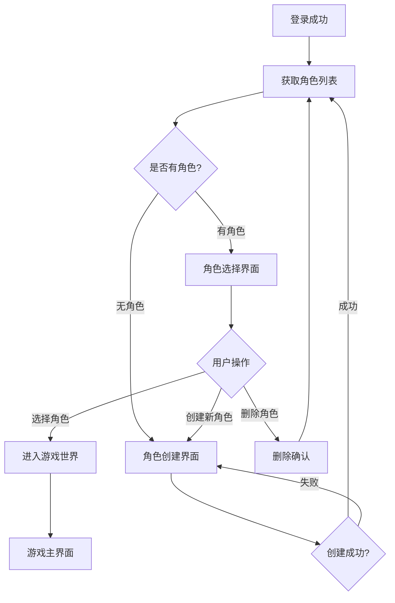
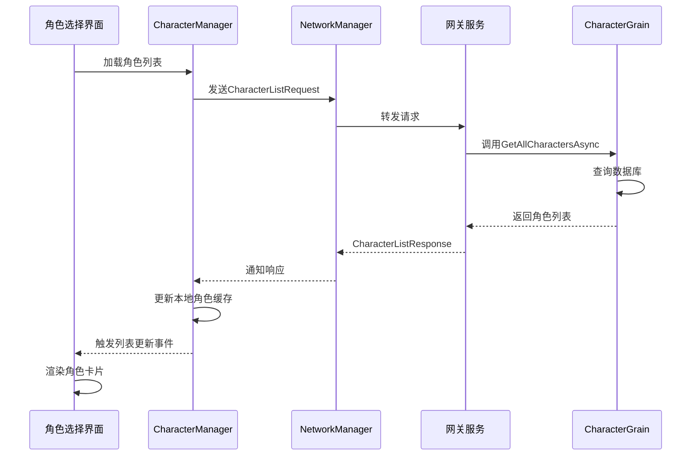
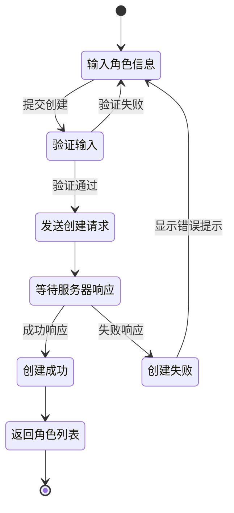
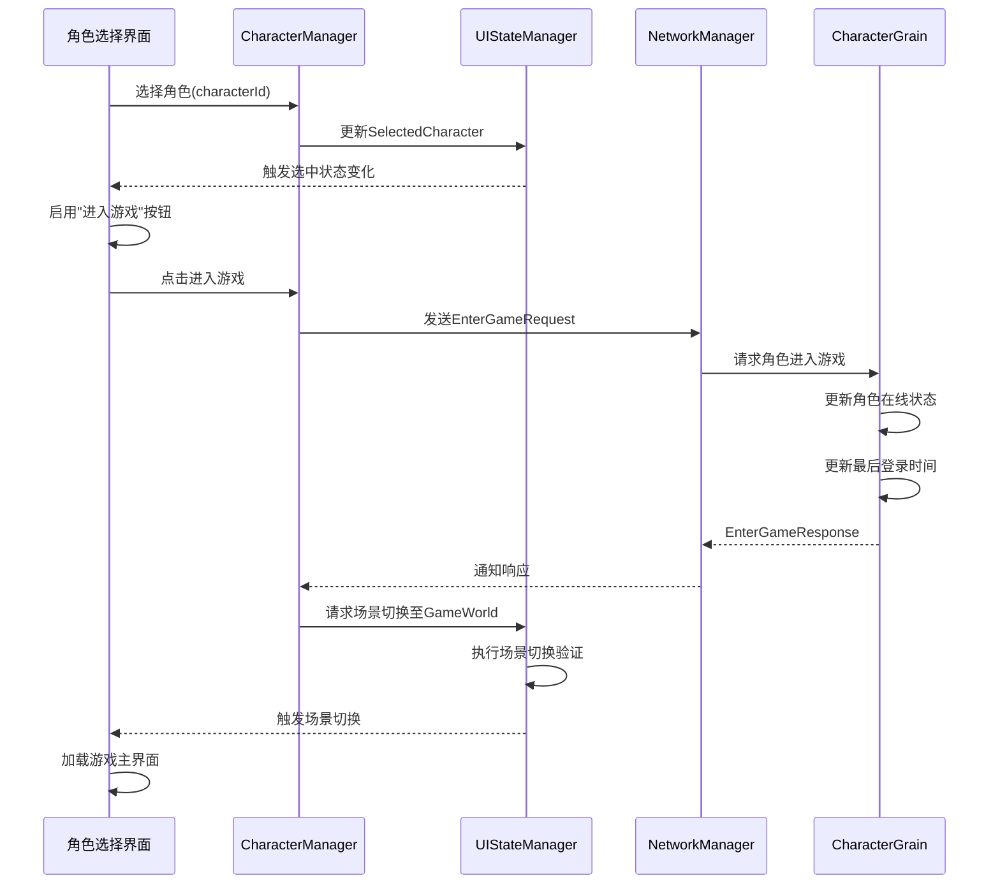
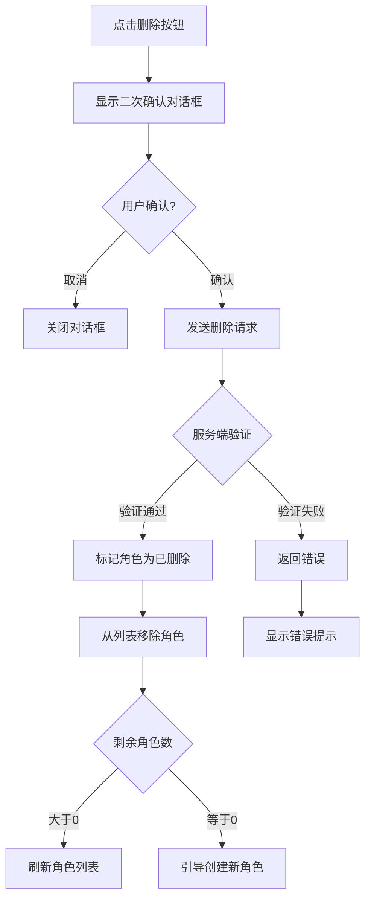

# 登录后角色创建与选择系统设计

## 设计目标

登录认证成功后，用户需要经历角色管理流程才能进入游戏世界。本设计描述从登录完成到进入游戏世界之间的完整用户体验流程，包括角色列表查询、角色创建、角色选择以及进入游戏世界的业务逻辑和交互设计。

## 业务流程概览

登录成功后的用户行为路径呈现为决策树结构:

## 核心业务场景

### 场景一: 登录成功后自动跳转

**触发条件**: 用户成功完成身份认证

**流程说明**:
1. AuthenticationManager 完成登录验证
2. 接收 LoginResponse 消息,包含用户会话信息
3. UIStateManager 更新用户会话状态
4. 自动触发场景切换至角色选择界面
5. 发送角色列表查询请求到服务端

**关键决策点**:
- 若服务端返回角色列表为空,引导用户创建首个角色
- 若角色列表不为空,展示所有可用角色供用户选择

### 场景二: 角色列表查询与展示

**数据流向**:

**角色列表请求消息结构**:

| 字段名 | 类型 | 说明 |
|--------|------|------|
| UserId | ulong | 用户唯一标识 |
| ServerId | int | 服务器标识 |
| GameId | int | 游戏标识(从消息头获取) |

**角色列表响应消息结构**:

| 字段名 | 类型 | 说明 |
|--------|------|------|
| IsSuccess | bool | 查询是否成功 |
| Characters | List&lt;CharacterInfo&gt; | 角色信息列表 |
| ErrorMessage | string | 错误描述(失败时) |
| MaxCharacterCount | int | 允许创建的最大角色数 |

**角色信息展示内容**:

| 信息项 | 数据来源 | 用途 |
|--------|----------|------|
| 角色名称 | CharacterInfo.CharacterName | 主要识别信息 |
| 职业类型 | CharacterInfo.Profession | 角色定位说明 |
| 等级 | CharacterInfo.Level | 角色成长进度 |
| 最后登录时间 | CharacterInfo.LastLoginTime | 辅助识别信息 |
| 外观形象 | CharacterInfo.Appearance | 视觉识别要素 |

**UI交互规则**:
- 角色列表按最后登录时间倒序排列
- 每个角色卡片支持点击选中操作
- 选中角色高亮显示,启用"进入游戏"按钮
- 已达上限时禁用"创建新角色"按钮
- 提供"删除角色"操作入口(需二次确认)

### 场景三: 角色创建流程

**创建流程状态机**:

**角色创建必填信息**:

| 字段 | 约束规则 | 验证方式 |
|------|----------|----------|
| 角色名称 | 2-12个字符,支持中英文 | 客户端正则验证 + 服务端重复检查 |
| 职业选择 | 必须从预设职业列表选择 | 下拉选项限制 |
| 性别 | 男/女二选一 | 单选按钮 |
| 外观配置 | 可选项,包含发型、脸型、服装 | 下拉选择或预设方案 |

**角色创建请求消息结构**:

| 字段名 | 类型 | 说明 |
|--------|------|------|
| UserId | ulong | 用户标识 |
| CharacterName | string | 角色名称 |
| Profession | Profession(枚举) | 职业类型 |
| Gender | int | 性别(0:男,1:女) |
| Appearance | AppearanceInfo | 外观配置数据 |
| GameId | int | 游戏标识 |
| ZoneId | int | 区域标识 |
| ServerId | int | 服务器标识 |

**外观配置数据结构**:

| 字段 | 类型 | 说明 |
|------|------|------|
| HairModel | int | 发型模型ID |
| HairColor | int | 发色ID |
| FaceModel | int | 脸型模型ID |
| Clothing | int | 服装模型ID |

**服务端角色创建验证规则**:
1. 检查用户是否已达角色创建上限(默认5个)
2. 验证用户账号状态(是否有效、未被封禁)
3. 角色名称长度和格式验证
4. 角色名称重复性检查(全服唯一性)
5. 职业类型有效性验证
6. 外观配置合法性检查

**角色创建响应消息结构**:

| 字段名 | 类型 | 说明 |
|--------|------|------|
| IsSuccess | bool | 创建是否成功 |
| Message | string | 结果描述 |
| Character | CharacterInfo | 新创建的角色完整信息(成功时) |

**创建成功后的行为**:
1. 将新角色添加到本地角色列表缓存
2. 更新 UIStateManager 中的角色列表状态
3. 触发角色列表更新事件
4. 自动切换回角色选择界面
5. 可选: 自动选中新创建的角色

**创建失败的错误处理**:

| 错误场景 | 错误消息示例 | 用户引导 |
|----------|--------------|----------|
| 角色名重复 | "该角色名已被使用,请更换其他名称" | 保留其他输入,仅清空角色名 |
| 达到上限 | "角色数量已达上限,请删除旧角色后重试" | 提供返回角色列表选项 |
| 名称不合法 | "角色名包含非法字符或长度不符合要求" | 高亮显示角色名输入框 |
| 网络异常 | "创建角色请求失败,请稍后重试" | 保留所有输入,允许再次提交 |

### 场景四: 角色选择与进入游戏

**选择流程**:

**进入游戏请求消息结构**:

| 字段名 | 类型 | 说明 |
|--------|------|------|
| CharacterId | ulong | 选中的角色标识 |
| ClientVersion | string | 客户端版本号 |

**服务端进入游戏处理逻辑**:
1. 验证角色标识的有效性
2. 检查角色是否属于当前用户
3. 检查角色是否已在线(允许重复登录但记录日志)
4. 更新角色在线状态为 true
5. 更新角色最后登录时间为当前时间
6. 持久化角色状态到数据库
7. 初始化角色游戏数据(背包、技能、位置等)

**进入游戏响应消息结构**:

| 字段名 | 类型 | 说明 |
|--------|------|------|
| Success | bool | 是否成功进入 |
| Message | string | 结果描述 |
| CharacterInfo | CharacterInfo | 完整的角色信息 |

**进入游戏成功后的状态同步**:
- 客户端记录当前活动角色标识
- 建立与游戏服务器的持久连接
- 订阅角色相关的消息频道
- 加载角色所在场景数据
- 初始化角色控制器和相机系统

### 场景五: 角色删除流程

**删除流程保护机制**:

**删除请求消息结构**:

| 字段名 | 类型 | 说明 |
|--------|------|------|
| CharacterId | ulong | 待删除的角色标识 |
| UserId | ulong | 用户标识(用于权限验证) |

**服务端删除验证规则**:
1. 验证角色归属权(是否属于当前用户)
2. 检查角色是否处于在线状态(在线角色不允许删除)
3. 执行软删除(设置IsDeleted标记,保留数据)
4. 记录删除操作日志
5. 更新角色列表缓存

**删除响应消息结构**:

| 字段名 | 类型 | 说明 |
|--------|------|------|
| Success | bool | 删除是否成功 |
| CharacterId | ulong | 被删除的角色标识 |
| Message | string | 结果描述 |

**删除成功后的客户端行为**:
1. 从本地角色列表缓存移除对应角色
2. 若删除的是当前选中角色,清空选中状态
3. 更新 UIStateManager 角色列表
4. 刷新界面显示
5. 若列表为空,自动切换至角色创建界面

## UI界面设计规范

### 角色选择界面组件结构

**布局层次**:
- 主容器 (ContainerControl)
  - 标题标签 (Label) - "选择角色"
  - 用户信息标签 (Label) - 显示用户名和欢迎信息
  - 角色列表滚动视图 (ScrollableControl)
    - 角色卡片容器 (动态生成)
      - 角色形象图 (Image)
      - 角色名称 (Label)
      - 职业标签 (Label)
      - 等级显示 (Label)
      - 最后登录时间 (Label)
      - 删除按钮 (Button)
  - 操作按钮区
    - 创建新角色按钮 (Button)
    - 进入游戏按钮 (Button)
    - 返回登录按钮 (Button)
  - 加载指示器 (LoadingIndicator)

**角色卡片交互状态**:

| 状态 | 视觉反馈 | 触发条件 |
|------|----------|----------|
| 默认 | 标准边框和背景色 | 未选中状态 |
| 悬停 | 高亮边框,背景色渐变 | 鼠标移入 |
| 选中 | 醒目边框,背景高亮 | 点击选中 |
| 禁用 | 灰度显示,不可交互 | 角色状态异常 |

**按钮启用规则**:
- "创建新角色": 仅当角色数量未达上限时启用
- "进入游戏": 仅当有角色被选中时启用
- "返回登录": 始终启用
- 角色删除按钮: 始终启用,但需二次确认

### 角色创建界面组件结构

**布局层次**:
- 主容器 (ContainerControl)
  - 标题标签 (Label) - "创建角色"
  - 创建表单面板 (Panel)
    - 角色名称输入框 (ValidatedTextBox)
      - 输入验证规则: 2-12字符,支持中英文
      - 实时验证反馈
    - 职业选择下拉框 (Dropdown)
      - 选项: 剑客、刀客、拳师、医师、毒师
    - 性别选择下拉框 (Dropdown)
      - 选项: 男、女
    - 外观配置面板 (Panel)
      - 发型选择 (Dropdown)
      - 发色选择 (Dropdown)
      - 脸型选择 (Dropdown)
      - 服装选择 (Dropdown)
    - 角色预览区 (可选,用于显示外观效果)
  - 操作按钮区
    - 确认创建按钮 (Button)
    - 取消按钮 (Button)
  - 加载指示器 (LoadingIndicator)

**输入验证反馈机制**:
- 角色名称实时验证,非法字符即时高亮提示
- 必填项未填写时禁用"确认创建"按钮
- 验证失败时在输入框下方显示错误提示文本
- 服务端返回错误时,使用模态对话框展示详细信息

### 界面切换流程

**场景切换路径定义**:

| 源场景 | 目标场景 | 切换条件 | 切换方式 |
|--------|----------|----------|----------|
| Login | CharacterSelection | 登录成功 | 自动切换 |
| CharacterSelection | CharacterCreation | 点击创建新角色 | 用户主动 |
| CharacterCreation | CharacterSelection | 创建成功或取消 | 自动切换 |
| CharacterSelection | GameWorld | 选择角色并进入游戏 | 用户主动 |
| CharacterSelection | Login | 点击返回登录 | 用户主动 |

**切换动画效果**:
- 淡入淡出: 场景切换时使用 0.3-0.5 秒的淡入淡出过渡
- 滑动效果: 前进流程使用左滑,后退流程使用右滑
- 加载遮罩: 网络请求期间显示半透明加载遮罩和进度提示

**切换验证规则**:
- 登录态验证: 所有角色管理场景需验证用户登录状态
- 路径合法性: 仅允许预定义的场景切换路径
- 状态保护: 切换过程中禁用所有用户交互
- 错误恢复: 切换失败时保持在当前场景并显示错误信息

## 状态管理与数据同步

### UIStateManager 状态定义

**角色管理相关状态字段**:

| 字段名 | 类型 | 说明 | 更新时机 |
|--------|------|------|----------|
| UserSession | UserSession | 用户会话信息 | 登录成功时 |
| Characters | List&lt;CharacterInfo&gt; | 角色列表缓存 | 查询/创建/删除角色后 |
| SelectedCharacter | CharacterInfo | 当前选中角色 | 用户选择角色时 |
| CurrentScene | SceneType | 当前场景类型 | 场景切换时 |
| IsTransitioning | bool | 是否正在切换场景 | 切换开始/结束 |

**状态更新触发事件**:

| 事件名 | 触发时机 | 订阅者 |
|--------|----------|--------|
| SceneChanged | 场景切换完成 | 所有UI界面组件 |
| UserSessionChanged | 用户会话更新 | CharacterManager |
| CharacterListUpdated | 角色列表变更 | 角色选择界面 |
| SelectedCharacterChanged | 选中角色变更 | 角色选择界面 |
| LoadingStateChanged | 加载状态变更 | 加载指示器 |

### CharacterManager 职责范围

**核心职责**:
- 管理角色列表的本地缓存
- 封装角色相关的网络请求
- 处理服务端响应消息
- 发布角色状态变更事件
- 与 UIStateManager 保持状态同步

**对外提供的方法接口**:

| 方法名 | 参数 | 返回值 | 说明 |
|--------|------|--------|------|
| LoadCharacterListAsync | 无 | Task&lt;bool&gt; | 加载角色列表 |
| CreateCharacterAsync | 角色创建参数 | Task&lt;bool&gt; | 创建新角色 |
| SelectCharacter | CharacterInfo | bool | 选择角色 |
| EnterGameAsync | 无 | Task&lt;bool&gt; | 进入游戏 |
| DeleteCharacterAsync | characterId | Task&lt;bool&gt; | 删除角色 |

**内部维护的事件**:

| 事件名 | 参数类型 | 触发时机 |
|--------|----------|----------|
| CharacterListUpdated | List&lt;CharacterInfo&gt; | 角色列表变更 |
| CharacterSelected | CharacterInfo | 角色选择变更 |
| CharacterCreated | CharacterInfo | 角色创建成功 |
| CharacterDeleted | ulong | 角色删除成功 |

### 本地缓存策略

**缓存时机**:
- 登录成功后首次查询角色列表时建立缓存
- 每次创建/删除角色后同步更新缓存
- 场景切换至角色选择时刷新缓存

**缓存失效条件**:
- 用户登出时清空所有角色缓存
- 切换到登录场景时清空缓存
- 网络请求失败时保留旧缓存(不清空)

**缓存一致性保障**:
- 服务端响应作为唯一数据源
- 本地操作成功后立即更新缓存
- UIStateManager 与 CharacterManager 双向同步
- 通过版本号机制检测状态冲突

## 网络通信设计

### 消息类型映射

| 消息类型枚举 | 请求消息类 | 响应消息类 | 处理器类 |
|--------------|------------|------------|----------|
| CharacterList | CharacterListRequest | CharacterListResponse | CharacterManagementHandler |
| CreateCharacter | CreateCharacterRequest | CreateCharacterResponse | CharacterManagementHandler |
| SelectCharacter | SelectCharacterRequest | SelectCharacterResponse | CharacterManagementHandler |
| EnterGame | EnterGameRequest | EnterGameResponse | CharacterManagementHandler |
| CharacterDelete | DeleteCharacterRequest | DeleteCharacterResponse | CharacterManagementHandler |

### 消息发送流程

**客户端发送消息**:
1. UI组件调用 CharacterManager 的业务方法
2. CharacterManager 构造请求消息对象
3. 调用 NetworkManager.SendMessageAsync 发送消息
4. NetworkManager 序列化消息并通过网关发送
5. 设置本地处理状态为"正在处理"

**服务端消息路由**:
1. 网关接收消息并解析消息头
2. 根据 ServiceType 和 MessageType 路由到对应 Handler
3. CharacterManagementHandler 执行业务逻辑
4. 调用 CharacterGrain 的 Orleans 方法
5. CharacterGrain 操作数据库并返回结果
6. Handler 构造响应消息并返回网关
7. 网关推送响应消息到客户端

### 消息响应处理

**客户端响应处理流程**:
1. NetworkManager 接收响应消息
2. 根据 MessageType 查找对应的消息处理器
3. 处理器调用 CharacterManager 的响应处理方法
4. CharacterManager 更新本地状态
5. 触发相关事件通知UI组件
6. UI组件更新界面显示

**超时与重试策略**:
- 网络请求默认超时时间: 10秒
- 超时后自动重试最多3次
- 重试间隔: 1秒、2秒、5秒(递增)
- 所有重试失败后向用户显示错误提示
- 用户可手动点击重试按钮再次发起请求

### 错误处理机制

**客户端错误分类**:

| 错误类型 | 处理方式 | 用户提示 |
|----------|----------|----------|
| 网络连接失败 | 自动重试3次 | "网络连接异常,请检查网络设置" |
| 服务端业务错误 | 显示服务端返回的错误消息 | 具体错误描述 |
| 数据验证错误 | 高亮错误字段 | "输入信息不符合要求,请检查" |
| 权限验证失败 | 强制返回登录界面 | "登录状态已失效,请重新登录" |
| 系统异常 | 记录日志并提示用户 | "系统错误,请稍后重试" |

**服务端错误响应格式**:
- IsSuccess 字段标识操作结果
- Message 或 ErrorMessage 字段包含错误描述
- 业务错误码(可选)用于客户端精准处理
- 关键操作记录错误日志到服务端日志系统

## 后端服务设计

### CharacterGrain 核心方法

**GetAllCharactersAsync 方法**:

职责: 查询用户在指定游戏中的所有角色

输入参数:
- GameQueryDto.GameUserId: 用户标识
- GameQueryDto.GameId: 游戏标识

处理逻辑:
1. 根据 UserId 和 GameId 查询角色实体
2. 过滤条件: IsValid=true 且 IsDeleted=false
3. 按最后登录时间倒序排序
4. 使用 AutoMapper 转换为 CharacterInfo 列表
5. 可选: 填充额外信息(装备、技能等)

返回结果: List&lt;CharacterInfo&gt;

**CreateCharacterAsync 方法**:

职责: 创建新角色并初始化数据

输入参数:
- CreateCharacterRequest.UserId: 用户标识
- CreateCharacterRequest.CharacterName: 角色名称
- CreateCharacterRequest.Profession: 职业类型
- CreateCharacterRequest.Gender: 性别
- CreateCharacterRequest.Appearance: 外观配置
- CreateCharacterRequest.GameId: 游戏标识
- CreateCharacterRequest.ZoneId: 区域标识
- CreateCharacterRequest.ServerId: 服务器标识

处理逻辑:
1. 验证用户角色数量是否已达上限
2. 验证用户账号状态(是否有效)
3. 清理和验证角色名称(去空格、长度检查)
4. 检查角色名重复性(全服唯一)
5. 创建 CharacterEntity 实体对象
6. 初始化角色默认属性(生命值、位置等)
7. 保存到数据库
8. 更新 Grain 状态
9. 持久化 Grain 状态

返回结果: CreateCharacterResponse(包含新角色完整信息)

**EnterGameAsync 方法**:

职责: 角色进入游戏世界

输入参数:
- EnterGameRequest.CharacterId: 角色标识
- EnterGameRequest.ClientVersion: 客户端版本

处理逻辑:
1. 验证 CharacterGrain 是否已有角色数据
2. 检查角色是否已在线(允许重复,记录日志)
3. 更新角色在线状态为 true
4. 更新最后登录时间为当前UTC时间
5. 在数据库中同步更新最后登录时间
6. 持久化 Grain 状态
7. 初始化游戏数据(可选: 背包、技能等)

返回结果: EnterGameResponse(包含角色完整信息)

### 数据持久化策略

**CharacterGrain 状态持久化**:
- 使用 IPersistentState&lt;CharacterState&gt; 管理状态
- 状态包含 CharacterInfo 和 IsOnline 标记
- 关键操作后调用 WriteStateAsync 持久化
- 激活时从持久化存储或数据库加载状态

**数据库操作**:
- 通过 IDataContext 接口访问 CharacterEntity
- 创建角色时插入新记录
- 删除角色时执行软删除(设置 IsDeleted=true)
- 进入游戏时更新 LastLoginTime 字段
- 使用事务保障数据一致性

**缓存策略**:
- Orleans Grain 本身作为内存缓存层
- 活跃角色保持 Grain 激活状态
- 离线角色通过 DeactivateOnIdle 自动释放
- 查询操作优先从 Grain 状态读取
- 写操作同时更新 Grain 状态和数据库

## 用户体验优化

### 新手引导

**首次登录引导**:
- 检测用户角色列表为空时触发
- 自动弹出引导提示: "欢迎来到游戏世界,请创建您的第一个角色"
- 高亮显示"创建新角色"按钮
- 提供角色创建指引说明

**角色创建引导**:
- 依次引导填写角色名称、选择职业、配置外观
- 每个步骤完成后自动聚焦到下一步
- 提供每个职业的简要说明和特色介绍
- 外观配置提供预设方案快速选择

### 加载状态提示

**加载场景**:

| 操作 | 加载文案 | 持续时间估计 |
|------|----------|--------------|
| 查询角色列表 | "正在加载角色列表..." | 1-2秒 |
| 创建角色 | "正在创建角色..." | 2-3秒 |
| 进入游戏 | "正在进入游戏..." | 3-5秒 |
| 删除角色 | "正在删除角色..." | 1-2秒 |

**加载指示器设计**:
- 使用半透明遮罩覆盖整个界面
- 中央显示旋转加载动画
- 显示操作提示文本
- 禁用所有用户交互
- 超时后显示"加载时间过长,请稍候"

### 动画与过渡效果

**角色卡片动画**:
- 列表加载时依次淡入显示(间隔0.05秒)
- 鼠标悬停时边框发光效果
- 选中时缩放动画(scale 1.0 → 1.02)
- 删除时淡出并向右滑动退出

**场景切换动画**:
- 淡入淡出: 透明度 0 → 1 或 1 → 0,持续时间0.3秒
- 缓动函数: EaseOut 或 EaseInOut
- 切换期间显示加载遮罩
- 切换完成后触发场景初始化事件

**按钮交互反馈**:
- 鼠标悬停: 背景色渐变
- 点击: 轻微缩放效果
- 禁用状态: 灰度滤镜 + 降低透明度
- 加载中: 禁用交互并显示加载图标

### 错误恢复机制

**网络错误恢复**:
- 显示错误提示对话框
- 提供"重试"和"返回"按钮
- 保留用户已输入的数据(角色创建时)
- 重试时自动重新发送请求

**数据异常处理**:
- 角色列表为空时引导创建角色
- 服务端返回异常数据时使用默认值
- 关键数据缺失时降级显示
- 记录异常日志到本地文件

**状态不一致修复**:
- 定期同步服务端和客户端状态
- 检测状态版本冲突时以服务端为准
- 关键操作失败后回滚本地状态
- 提供手动刷新按钮重新加载数据

## 安全性考虑

### 客户端验证

**输入验证规则**:
- 角色名称: 正则表达式验证,过滤特殊字符
- 职业选择: 限制为预定义的枚举值
- 外观配置: 验证模型ID的有效范围
- 所有输入进行 HTML 转义防止注入攻击

**操作频率限制**:
- 角色创建: 单位时间内限制创建次数(如每分钟最多3次)
- 角色删除: 需要二次确认,防止误操作
- 进入游戏: 防止短时间内重复请求

### 服务端验证

**权限验证**:
- 验证用户会话令牌有效性
- 验证角色归属权(操作的角色是否属于当前用户)
- 验证用户账号状态(是否被封禁、冻结)

**数据完整性校验**:
- 验证所有必填字段的存在性
- 验证数据类型和格式的正确性
- 验证业务规则约束(如角色数量上限)
- 验证关联数据的一致性

**防刷机制**:
- 限制单个用户的请求频率
- 检测异常请求模式并记录日志
- 对频繁失败的操作进行临时锁定
- 记录所有关键操作的审计日志

### 数据传输安全

**消息加密**:
- 使用 TLS/SSL 加密传输通道
- 敏感数据(如会话令牌)进行额外加密
- 消息体使用 MemoryPack 高效序列化

**会话管理**:
- 会话令牌定期刷新
- 检测会话失效时强制返回登录
- 多端登录策略(是否允许同时登录)

## 性能优化策略

### 客户端性能优化

**UI渲染优化**:
- 角色列表使用虚拟滚动(仅渲染可见区域)
- 角色卡片使用对象池复用
- 减少不必要的UI刷新操作
- 使用异步加载避免阻塞主线程

**网络请求优化**:
- 合并批量请求(如查询角色列表+服务器列表)
- 使用压缩算法减少数据传输量
- 缓存静态资源(如职业图标、外观模型)
- 实现请求队列管理,避免并发过多

### 服务端性能优化

**数据库查询优化**:
- 为常用查询字段建立索引(UserId, GameId, CharacterName)
- 使用分页查询避免一次加载过多数据
- 查询结果缓存到 Redis(可选)
- 使用数据库连接池管理连接

**Orleans Grain 优化**:
- 合理设置 Grain 的空闲超时时间
- 热点 Grain 使用单例或有状态复制
- 避免 Grain 方法执行耗时操作
- 使用异步方法提高吞吐量

### 资源管理

**内存管理**:
- 角色列表使用增量加载
- 及时释放不再使用的 UI 对象
- 监控内存使用情况并设置上限
- 定期执行垃圾回收

**网络资源**:
- 限制并发网络请求数量
- 实现请求取消机制(场景切换时)
- 使用心跳机制保持连接活跃
- 连接异常时自动重连

## 测试验证计划

### 功能测试场景

**角色列表测试**:
- 用户无角色时的空列表展示
- 用户有1个角色时的正常展示
- 用户有5个角色(上限)时的展示和操作限制
- 角色列表查询失败时的错误处理
- 角色列表数据异常时的降级处理

**角色创建测试**:
- 正常创建角色流程
- 角色名重复时的错误提示
- 角色名不合法时的验证提示
- 达到角色数量上限时的限制
- 网络异常时的重试机制
- 创建成功后的列表刷新

**角色选择与进入游戏测试**:
- 选择角色并成功进入游戏
- 角色已在线时的处理
- 进入游戏失败时的错误提示
- 场景切换动画的流畅性

**角色删除测试**:
- 正常删除角色流程
- 删除确认对话框的交互
- 删除最后一个角色后的引导
- 删除在线角色时的限制
- 删除失败时的错误处理

### 性能测试指标

**响应时间要求**:
- 角色列表查询: < 2秒
- 角色创建: < 3秒
- 进入游戏: < 5秒
- 场景切换动画: < 0.5秒

**并发性能**:
- 支持1000个用户同时查询角色列表
- 支持100个用户同时创建角色
- 支持500个用户同时进入游戏

**资源占用**:
- 客户端内存占用: < 200MB
- 网络流量: 单次操作 < 100KB
- CPU占用: < 30%

### 兼容性测试

**客户端平台**:
- Windows 10/11 各版本
- 不同屏幕分辨率(1920x1080, 1366x768, 2560x1440)
- 不同缩放比例(100%, 125%, 150%)

**网络环境**:
- 正常网络(延迟<50ms)
- 慢速网络(延迟100-500ms)
- 不稳定网络(丢包率5%-10%)
- 离线状态下的错误处理

### 安全测试

**输入验证测试**:
- 特殊字符输入测试
- SQL注入攻击测试
- XSS跨站脚本测试
- 超长输入测试

**权限验证测试**:
- 伪造会话令牌访问
- 操作他人角色的权限验证
- 会话过期后的访问限制

**防刷测试**:
- 高频创建角色请求
- 重复删除角色请求
- 并发进入游戏请求

## 扩展性设计

### 支持多服务器

**服务器选择流程**:
- 登录成功后返回服务器列表
- 用户选择服务器后查询该服务器的角色列表
- 不同服务器的角色数据隔离
- 支持跨服角色迁移(未来扩展)

**服务器信息展示**:

| 信息项 | 说明 |
|--------|------|
| 服务器名称 | 显示名称 |
| 服务器状态 | 正常/维护/拥挤 |
| 推荐标签 | 新服/推荐/老服 |
| 在线人数 | 当前在线数/上限 |

### 支持角色转服

**转服流程设计**:
1. 用户在角色列表选择"角色转服"
2. 展示可转入的目标服务器列表
3. 用户确认转服(需二次确认)
4. 服务端验证转服条件(如冷却时间、费用)
5. 执行数据迁移操作
6. 更新角色所属服务器标识
7. 通知用户转服完成

### 支持更多职业

**职业扩展机制**:
- 职业配置数据化(从配置文件加载)
- UI动态生成职业选项
- 服务端验证职业ID有效性
- 支持职业平衡调整和新职业添加

### 支持角色改名

**改名功能设计**:
- 提供角色改名入口(角色列表操作菜单)
- 输入新角色名并验证
- 服务端检查新名称重复性
- 扣除改名道具或费用(可选)
- 更新角色名称并记录改名历史

## 监控与日志

### 关键操作日志

**需记录的操作**:
- 用户登录成功并查询角色列表
- 角色创建成功/失败(包含失败原因)
- 角色删除操作(包含角色信息)
- 角色进入游戏
- 场景切换操作

**日志格式**:
- 时间戳: ISO 8601格式
- 用户标识: UserId
- 操作类型: 操作枚举值
- 操作详情: JSON格式
- 结果状态: 成功/失败
- 错误信息: 失败时的详细错误

### 性能监控指标

**客户端监控**:
- 各场景加载耗时
- 网络请求响应时间
- UI帧率和卡顿统计
- 内存占用峰值

**服务端监控**:
- 角色查询接口 QPS 和响应时间
- 角色创建接口成功率
- 数据库查询耗时
- Orleans Grain 激活数量和耗时

### 异常告警

**告警触发条件**:
- 角色创建成功率低于95%
- 接口响应时间超过阈值
- 数据库连接池耗尽
- 内存占用超过上限
- 异常错误日志频率过高

**告警通知方式**:
- 发送告警邮件到运维团队
- 推送告警消息到监控平台
- 记录到告警日志文件

## 总结

本设计文档完整描述了用户登录成功后进入游戏世界之前的角色管理流程,涵盖角色列表查询、角色创建、角色选择、角色删除以及进入游戏等核心业务场景。设计遵循以下核心原则:

**架构原则**:
- 职责分离: UI组件、业务管理器、网络通信、后端服务各司其职
- 状态集中: UIStateManager 统一管理状态,CharacterManager 负责业务逻辑
- 事件驱动: 通过事件机制实现组件间解耦和状态同步

**用户体验原则**:
- 流程简洁: 最少的操作步骤完成目标
- 反馈及时: 所有操作提供即时的视觉和文本反馈
- 引导明确: 新手引导和错误提示清晰易懂
- 容错友好: 异常情况下保护用户数据并提供恢复路径

**技术实现原则**:
- 前后端分离: 清晰的接口定义和数据契约
- 安全优先: 多层验证机制保障数据和操作安全
- 性能优化: 缓存、异步、对象池等手段提升性能
- 可扩展性: 预留多服务器、职业扩展等能力

通过本设计的实施,将为用户提供流畅、安全、高效的角色管理体验,为进入游戏世界打下坚实基础。

