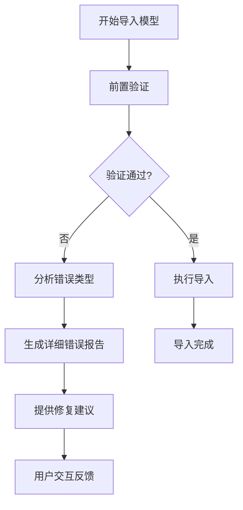

# 模型导入错误处理设计文档

## 1. 概述

本设计文档旨在定义Flax项目中模型导入错误的处理机制，特别是针对FBX格式模型文件导入时可能出现的"无有效几何体"等问题。通过建立完善的错误处理流程和用户反馈机制，提升开发者在资源导入过程中的体验。

## 2. 问题分析

### 2.1 当前问题
根据日志分析，当前模型导入存在以下问题：
- FBX文件导入时报错："Cannot import model file. Imported model has no valid geometry."
- 缺乏详细的错误信息反馈给用户
- 没有提供修复建议或替代方案

### 2.2 错误原因分类
| 错误类型 | 描述 | 可能原因 |
|---------|------|---------|
| 几何体缺失 | 模型不包含有效的网格数据 | 文件损坏、导出设置错误、空模型 |
| 材质丢失 | 模型缺少材质信息 | 路径引用错误、材质未嵌入 |
| 动画冲突 | 动画数据格式不兼容 | 骨骼结构问题、帧率不匹配 |
| 文件格式问题 | FBX版本或编码不兼容 | 使用了不支持的FBX版本或编码格式 |

## 3. 解决方案设计

### 3.1 前置验证机制
在正式导入之前增加模型文件的前置验证步骤：

1. **文件完整性检查**
   - 验证FBX文件头信息
   - 检查文件是否完整未损坏
   
2. **几何体数据验证**
   - 检查模型是否包含顶点数据
   - 验证网格面数是否大于0
   - 确认模型具有有效的边界框
   
3. **材质引用检查**
   - 验证材质路径有效性
   - 检查是否存在循环引用

### 3.2 错误处理流程

### 3.3 组件结构
| 组件 | 职责 | 关键功能 |
|-----|------|---------|
| ModelImportValidator | 模型导入验证器 | 执行前置验证，检查模型完整性 |
| GeometryAnalyzer | 几何体分析器 | 分析模型几何数据有效性 |
| ErrorReportGenerator | 错误报告生成器 | 生成详细的错误信息和修复建议 |
| UserFeedbackHandler | 用户反馈处理器 | 提供用户友好的错误提示和操作选项 |

## 4. 实施步骤

### 4.1 增强错误检测
1. 在导入流程中增加几何体数据检查点
2. 实现FBX文件结构验证
3. 添加材质引用完整性检查

### 4.2 优化用户反馈
1. 提供清晰的错误描述信息
2. 根据错误类型给出具体修复建议
3. 支持一键跳转到相关文档或工具

### 4.3 建立恢复机制
1. 提供模型修复向导
2. 支持使用默认几何体替代
3. 实现导入失败的回滚操作

## 5. 具体修复建议

### 5.1 针对"无有效几何体"错误
1. **检查源文件**
   - 确认FBX文件在原始建模软件中能正常打开
   - 验证模型确实包含网格数据
   
2. **重新导出**
   - 使用支持的FBX导出设置
   - 确保导出时包含几何体和材质信息
   - 尝试不同的FBX版本导出
   
3. **使用中间软件处理**
   - 导入到Blender等开源软件中
   - 检查并修复模型问题
   - 重新导出为FBX格式

### 5.2 预防措施
1. 建立模型导入检查清单
2. 提供导入前的预览功能
3. 实现导入历史记录和回滚机制

## 6. 测试验证

### 6.1 测试用例设计
| 测试场景 | 预期结果 | 验证点 |
|---------|---------|--------|
| 导入空几何体模型 | 显示明确错误信息 | 错误提示准确，建议合理 |
| 导入正常模型 | 成功导入 | 模型正确显示 |
| 导入损坏文件 | 显示文件损坏错误 | 提供修复建议 |

### 6.2 集成测试
- 验证错误处理流程的完整性
- 测试用户反馈机制的有效性
- 确认恢复机制的可靠性
