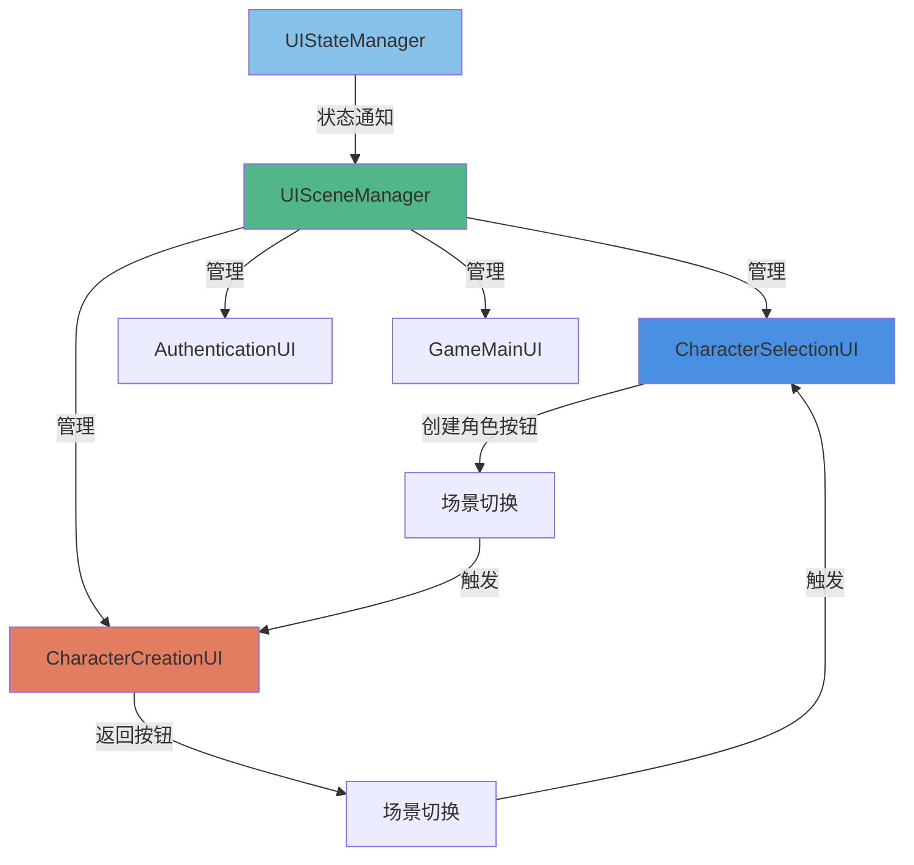
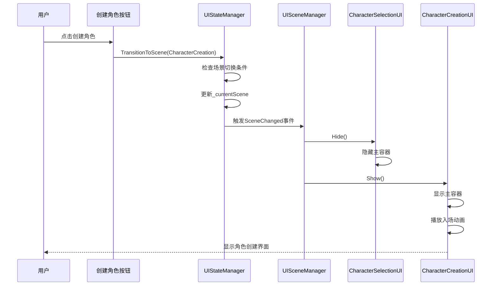
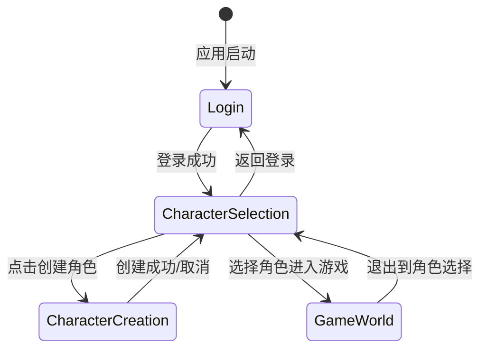

# 角色界面UI优化设计

## 问题分析

### 当前问题
点击创建角色按钮后,角色创建UI没有正常显示,需要重新梳理编排UI逻辑,完善角色界面整体UI,采用全屏UI风格。

### 问题根源

通过代码分析,发现了以下核心问题:

1. **UI架构混乱** - CharacterManagementUI同时管理角色选择和角色创建两个场景,导致职责不清
2. **显示逻辑错误** - 创建角色按钮点击后只触发场景切换,但CharacterManagementUI的OnSceneChanged方法中对CharacterCreation场景的处理与CharacterSelection相同,都调用ShowCharacterCreation方法,但该方法只是切换内部面板可见性
3. **面板尺寸不合理** - 创建角色面板使用固定尺寸(800x700),未采用全屏布局
4. **UI组件分离不彻底** - 存在CharacterManagementUI、CharacterSelectionUI、CharacterCreationUI三个组件,但实际运行时只使用CharacterManagementUI,其他两个组件未被激活

## 设计目标

### 功能目标
- 修复创建角色按钮点击后UI不显示的问题
- 实现全屏UI风格,提升用户体验
- 清晰分离角色选择和角色创建两个场景的UI逻辑
- 确保UI组件职责单一,易于维护

### 用户体验目标
- 全屏沉浸式角色创建体验
- 流畅的场景切换动画
- 清晰的视觉层次和信息架构
- 统一的中国古典风格视觉设计

## 解决方案

### 方案选择

考虑到当前已有CharacterSelectionUI和CharacterCreationUI两个独立组件,但未被正确使用,设计采用**重构现有UI架构**的方案:

**方案优势:**
- 利用现有独立UI组件,减少开发工作量
- 清晰分离职责,便于后续维护
- 符合单一职责原则,提高代码质量

**不采用的方案及原因:**
- ~~在CharacterManagementUI中修复显示逻辑~~ - 会导致组件职责过重,不利于维护
- ~~创建全新UI组件~~ - 浪费现有代码资源,增加工作量

### 架构设计

#### UI组件职责划分



**组件职责定义:**

| 组件名称 | 职责 | 生命周期管理 |
|---------|------|------------|
| UISceneManager | 统一管理所有UI场景的显示/隐藏,响应UIStateManager的场景切换事件 | 持久化,游戏运行期间常驻 |
| CharacterSelectionUI | 负责角色选择界面的显示,包括角色列表、创建按钮、进入游戏按钮 | 按需显示/隐藏 |
| CharacterCreationUI | 负责角色创建界面的显示,包括角色信息输入、外观定制 | 按需显示/隐藏 |
| CharacterManagementUI | **废弃不用**,逐步移除 | 不再使用 |

#### 场景切换流程



### UI布局设计

#### 全屏布局策略

采用响应式全屏布局,适配不同屏幕尺寸。

**布局原则:**
- 主容器使用`AnchorPresets.StretchAll`填充整个屏幕
- 内部面板根据屏幕尺寸动态计算位置和大小
- 保持16:9的核心内容区域比例

**角色选择界面布局:**

```
┌─────────────────────────────────────────────────────┐
│                    标题区域                          │
│                  "选择角色"                          │
├─────────────────────────────────────────────────────┤
│                                                     │
│              角色列表滚动区域                        │
│          (角色卡片垂直排列)                          │
│                                                     │
│                                                     │
│                                                     │
├─────────────────────────────────────────────────────┤
│  [创建角色]    [进入游戏]         [返回登录]        │
└─────────────────────────────────────────────────────┘
```

**角色创建界面布局:**

```
┌─────────────────────────────────────────────────────┐
│                    标题区域                          │
│                  "创建角色"                          │
├────────────────────┬────────────────────────────────┤
│                    │                                │
│   基础信息面板      │      角色预览区域              │
│   ┌─────────────┐  │                                │
│   │ 角色名称    │  │                                │
│   │ 职业选择    │  │       3D预览                   │
│   │ 性别选择    │  │                                │
│   └─────────────┘  │                                │
│                    │                                │
│   外观定制面板      │                                │
│   ┌─────────────┐  │                                │
│   │ 发型        │  │                                │
│   │ 发色        │  │                                │
│   │ 眼睛        │  │                                │
│   │ 肤色        │  │                                │
│   └─────────────┘  │                                │
├────────────────────┴────────────────────────────────┤
│           [随机外观]  [确认创建]  [返回]            │
└─────────────────────────────────────────────────────┘
```

#### 响应式尺寸计算

使用ResponsiveLayoutCalculator计算控件尺寸和位置:

| 元素 | 宽度计算 | 高度计算 | 定位方式 |
|------|---------|---------|---------|
| 主容器 | 100%屏幕宽度 | 100%屏幕高度 | AnchorPresets.StretchAll |
| 标题区域 | 固定400px | 固定60px | AnchorPresets.TopCenter |
| 角色列表面板 | 80%屏幕宽度(最大800px) | 60%屏幕高度(最大500px) | AnchorPresets.MiddleCenter |
| 基础信息面板 | 40%屏幕宽度(最大400px) | 70%屏幕高度(最大600px) | AnchorPresets.MiddleLeft |
| 预览区域 | 50%屏幕宽度(最大600px) | 70%屏幕高度(最大600px) | AnchorPresets.MiddleRight |

### 视觉设计规范

#### 配色方案

继续使用现有的ChineseClassicalTheme中国古典配色:

| 用途 | 颜色名称 | RGB值 | 使用场景 |
|-----|---------|-------|---------|
| 主色调 | 墨青色 | (45, 85, 105) | 主按钮、重要文本 |
| 辅助色 | 古典金 | (205, 165, 85) | 标题、强调元素 |
| 背景色 | 雅致灰 | (35, 40, 45) | 主背景 |
| 面板色 | 青石色 | (45, 50, 55) | 面板背景 |
| 强调色 | 朱砂红 | (185, 65, 65) | 删除按钮、警告 |

#### 动画效果规范

为提升用户体验,定义以下动画效果:

| 动画类型 | 使用场景 | 持续时间 | 缓动函数 |
|---------|---------|---------|---------|
| FadeIn | 界面显示 | 0.5秒 | EaseOut |
| FadeOut | 界面隐藏 | 0.3秒 | EaseIn |
| SlideIn | 面板进入 | 0.5秒 | EaseOut |
| SlideOut | 面板退出 | 0.4秒 | EaseIn |
| Bounce | 按钮点击反馈 | 0.3秒 | EaseInOut |
| Shake | 验证错误提示 | 0.4秒 | EaseInOut |

### 状态管理优化

#### 场景状态定义

明确各UI场景的状态转换规则:



#### 状态验证规则

在UIStateManager.TransitionToScene方法中已实现的场景切换验证规则保持不变:

- CharacterSelection → CharacterCreation: 允许
- CharacterCreation → CharacterSelection: 允许
- Login → CharacterSelection: 允许(登录成功后)
- CharacterSelection → Login: 允许(返回登录)

## 实现路径

### 阶段一:修复UISceneManager场景映射

**目标:** 确保UISceneManager正确管理CharacterSelectionUI和CharacterCreationUI

**修改内容:**

1. 修改UISceneManager.InitializeUIComponents方法
   - 移除CharacterManagementUI的初始化
   - 确保CharacterSelectionUI和CharacterCreationUI正确初始化

2. 修改UISceneManager.SetupSceneMappings方法
   - 更新CharacterSelection场景映射到CharacterSelectionUI
   - 更新CharacterCreation场景映射到CharacterCreationUI

3. 修改UISceneManager场景显示/隐藏方法
   - ShowCharacterSelection调用CharacterSelectionUI.Show()
   - ShowCharacterCreation调用CharacterCreationUI.Show()
   - HideCharacterSelection调用CharacterSelectionUI.Hide()
   - HideCharacterCreation调用CharacterCreationUI.Hide()

### 阶段二:优化CharacterSelectionUI布局

**目标:** 实现全屏响应式布局

**修改内容:**

1. 调整主容器布局
   - 确保_mainContainer使用AnchorPresets.StretchAll
   - 移除固定尺寸限制

2. 优化角色列表面板布局
   - 调整_characterListPanel尺寸为响应式计算
   - 宽度使用屏幕宽度80%(最大800px)
   - 高度使用屏幕高度60%(最大500px)
   - 居中显示

3. 调整按钮区域布局
   - 创建角色按钮: AnchorPresets.BottomLeft
   - 进入游戏按钮: AnchorPresets.BottomCenter
   - 返回登录按钮: AnchorPresets.BottomRight
   - 统一底部边距为80px

### 阶段三:优化CharacterCreationUI布局

**目标:** 实现全屏沉浸式角色创建体验

**修改内容:**

1. 调整主容器布局
   - 确保_mainContainer使用AnchorPresets.StretchAll
   - 设置全屏半透明背景(rgba: 35, 40, 45, 0.95)

2. 重新设计信息面板布局
   - _creationPanel改用响应式尺寸
   - 宽度为屏幕宽度40%(最小350px,最大450px)
   - 高度为屏幕高度70%(最小500px,最大700px)
   - 使用AnchorPresets.MiddleLeft定位
   - 左边距为屏幕宽度5%

3. 重新设计预览区域布局
   - _previewLabel改用响应式尺寸
   - 宽度为屏幕宽度50%(最小400px,最大600px)
   - 高度为屏幕高度70%(最小500px,最大700px)
   - 使用AnchorPresets.MiddleRight定位
   - 右边距为屏幕宽度5%

4. 调整按钮区域布局
   - 随机外观按钮: 位于外观面板内底部
   - 确认创建按钮: AnchorPresets.BottomCenter,左偏移-80px
   - 返回按钮: AnchorPresets.BottomCenter,右偏移80px
   - 统一底部边距为60px

### 阶段四:增强动画效果

**目标:** 提升UI切换流畅度和用户体验

**修改内容:**

1. CharacterSelectionUI显示动画
   - 主容器淡入(0.5秒,EaseOut)
   - 标题从上方滑入(0.4秒,EaseOut)
   - 角色列表面板缩放+淡入(0.6秒,EaseOut)
   - 按钮依次弹出(每个延迟0.1秒)

2. CharacterCreationUI显示动画
   - 主容器淡入(0.5秒,EaseOut)
   - 标题淡入(0.5秒,EaseOut)
   - 信息面板从左侧滑入(0.5秒,EaseOut)
   - 预览区域从右侧滑入(0.5秒,延迟0.1秒,EaseOut)
   - 按钮淡入+弹跳(0.4秒,延迟0.3秒)

3. 场景切换过渡动画
   - 隐藏当前场景: FadeOut(0.3秒,EaseIn)
   - 显示新场景: FadeIn(0.5秒,EaseOut)
   - 总过渡时间: 0.8秒

### 阶段五:清理废弃代码

**目标:** 移除CharacterManagementUI,保持代码整洁

**修改内容:**

1. 从UISceneManager中移除对CharacterManagementUI的引用
2. 标记CharacterManagementUI.cs为废弃
3. 更新相关文档,说明UI组件架构变更

## 验证标准

### 功能验证

- [ ] 点击创建角色按钮后,角色创建UI正常显示
- [ ] 角色创建UI覆盖整个屏幕
- [ ] 创建角色后返回角色选择界面,新角色显示在列表中
- [ ] 取消创建返回角色选择界面
- [ ] 场景切换流畅无闪烁

### 视觉验证

- [ ] 所有UI元素符合中国古典配色规范
- [ ] 响应式布局在不同屏幕尺寸下正常显示
- [ ] 动画效果流畅自然
- [ ] 文字清晰可读,对比度符合标准

### 性能验证

- [ ] 场景切换响应时间<100ms
- [ ] 动画播放帧率稳定在60fps
- [ ] UI渲染不影响游戏主循环性能

## 风险评估

### 技术风险

| 风险项 | 影响程度 | 应对措施 |
|-------|---------|---------|
| UISceneManager初始化时机问题 | 中 | 在UISceneManager.OnStart中确保UIStateManager已初始化 |
| CharacterSelectionUI和CharacterCreationUI未被正确添加到场景 | 高 | 在UISceneManager中动态创建UI组件Actor并添加脚本 |
| 动画播放时组件已被销毁 | 中 | 在动画回调中增加null检查 |
| 响应式布局计算错误 | 低 | 使用ResponsiveLayoutCalculator统一计算 |

### 兼容性风险

| 风险项 | 影响程度 | 应对措施 |
|-------|---------|---------|
| 现有场景引用CharacterManagementUI | 中 | 逐步迁移,保留过渡期兼容 |
| 网络消息处理依赖UI显示状态 | 低 | 确保网络消息处理独立于UI状态 |

## 后续优化方向

### 功能增强

1. 角色预览3D模型集成
   - 在预览区域渲染3D角色模型
   - 支持360度旋转查看
   - 实时预览外观变化

2. 外观预设模板
   - 提供预设外观方案快速选择
   - 支持自定义外观方案保存
   - 外观方案分享功能

### 性能优化

1. UI组件对象池
   - 角色卡片组件复用
   - 减少GC压力

2. 异步资源加载
   - 角色头像异步加载
   - 3D模型资源按需加载

### 用户体验优化

1. 引导系统集成
   - 首次创建角色时显示引导提示
   - 突出显示重要操作按钮

2. 无障碍支持
   - 键盘导航支持
   - 文字大小可调节
   - 色盲模式支持
