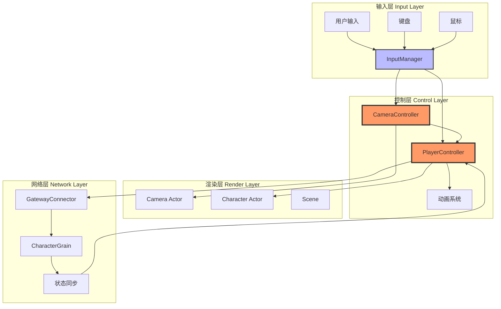
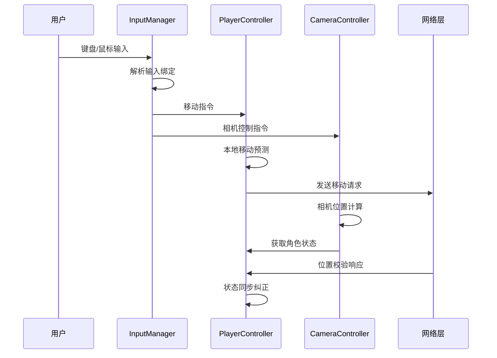
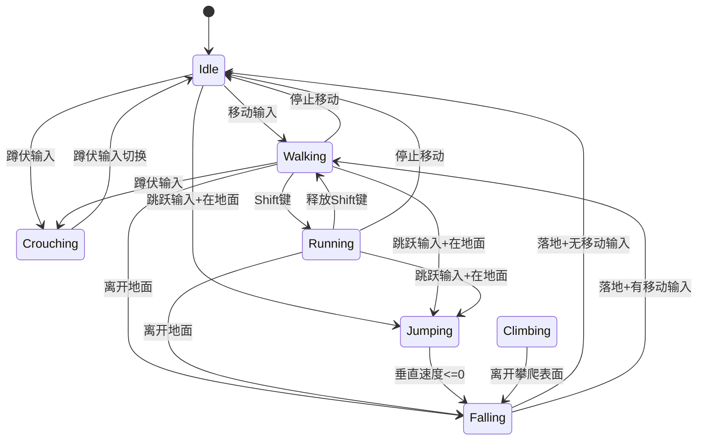
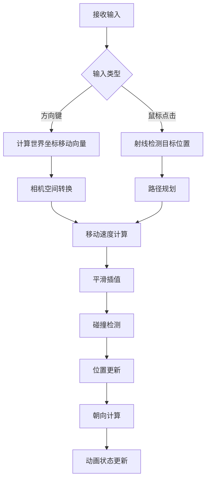
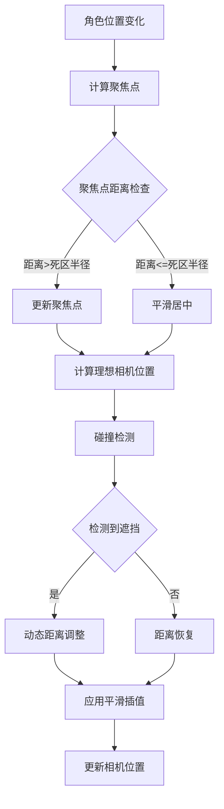
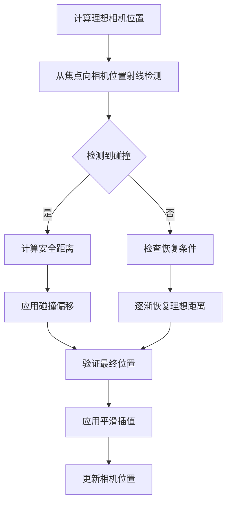
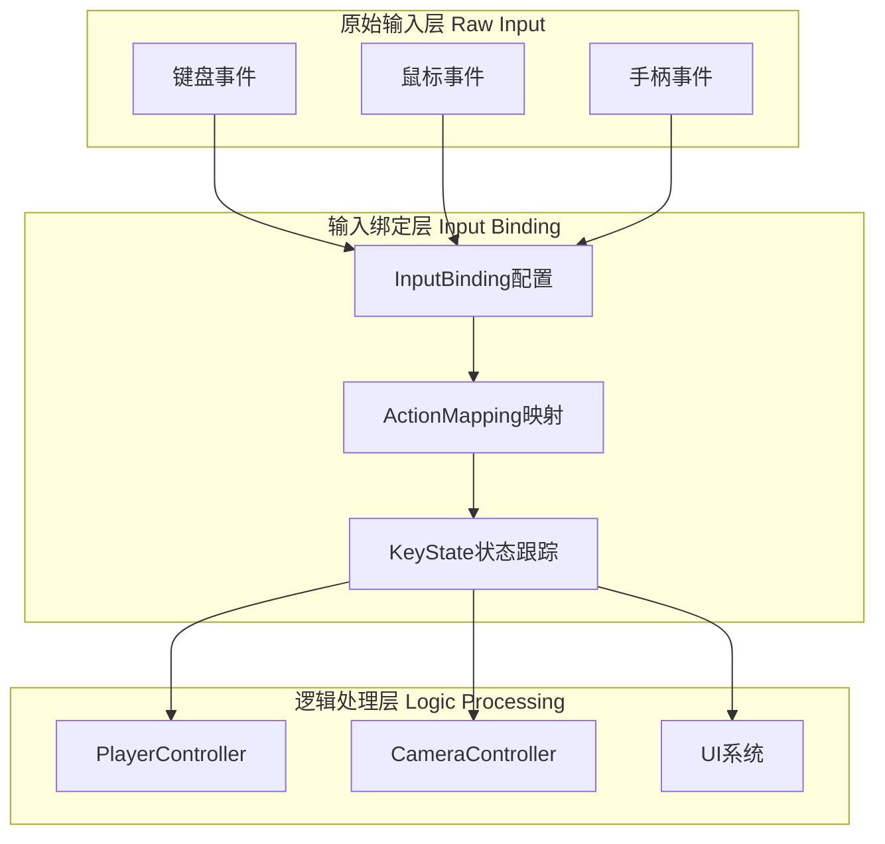
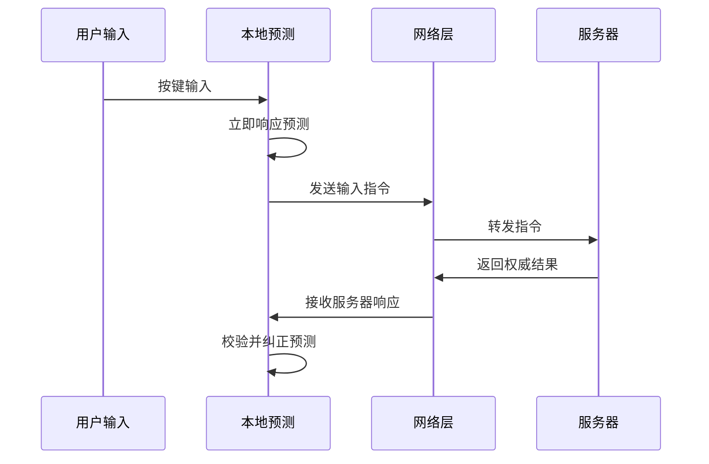
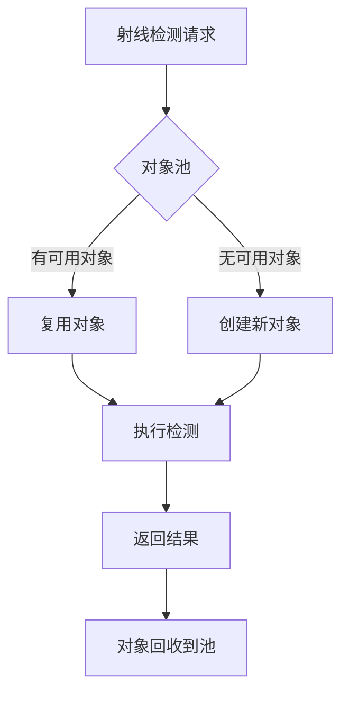
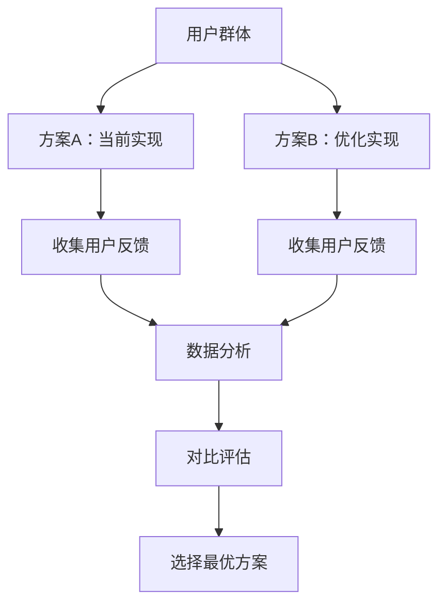

# 第三人称相机和角色控制器优化设计

## 概述

本设计文档旨在完善HundunWorld游戏客户端的第三人称相机系统和角色控制器（PlayerController），主要借鉴剑侠情缘3和魔兽世界两款经典MMORPG的相机控制和角色移动优点，提供更加流畅、自然且用户友好的游戏体验。

### 设计目标

- **流畅的相机控制体验**：参考剑侠情缘3的相机自适应跟随和魔兽世界的精确控制机制
- **自然的角色移动响应**：实现高响应性的角色移动，支持多种移动状态和转换
- **智能的相机自动对齐**：根据角色移动自动调整相机角度，减少手动操作负担
- **优化的碰撞检测系统**：防止相机穿透地形和物体，保持视野清晰
- **可配置的控制方案**：支持用户自定义按键绑定和控制偏好设置

## 技术栈与现有架构

### 当前实现基础

| 组件 | 功能职责 | 文件位置 |
|------|----------|----------|
| PlayerController | 角色移动控制、状态管理、输入处理 | HundunWorld/Source/Game/PlayerController.cs |
| ThirdPersonCamera | 第三人称相机控制、视角管理、碰撞检测 | HundunWorld/Source/Game/ThirdPersonCamera.cs |
| InputManager | 输入绑定管理、按键状态跟踪 | HundunWorld/Source/Game/InputManager.cs |

### 技术依赖

- **FlaxEngine**：3D游戏引擎，提供基础的物理系统、渲染管道和输入系统
- **Orleans集群**：后端服务支持，处理角色状态同步和权威验证
- **网络同步机制**：客户端-服务端移动状态同步，支持本地预测和服务器校验

## 架构设计

### 系统整体架构

### 核心组件交互

#### 输入处理流程

## 角色控制器优化设计

### 移动状态机制

#### 角色状态定义

| 状态 | 描述 | 触发条件 | 转换规则 |
|------|------|----------|----------|
| Idle | 静止状态 | 无移动输入 | 可转换至Walking/Running/Jumping |
| Walking | 正常行走 | 有移动输入且未按住Shift | 可转换至Idle/Running/Jumping |
| Running | 快速跑步 | 有移动输入且按住Shift | 可转换至Idle/Walking/Jumping |
| Jumping | 跳跃状态 | 按下空格键且在地面 | 落地后转换至其他状态 |
| Falling | 下落状态 | 不在地面且非跳跃 | 落地后转换至其他状态 |
| Crouching | 蹲伏状态 | 按下蹲伏键 | 可转换至其他移动状态 |
| Climbing | 攀爬状态 | 接触可攀爬表面 | 离开攀爬表面转换至其他状态 |

#### 状态转换图

### 移动响应优化

#### 输入缓冲系统

为提供更加响应式的操作体验，借鉴魔兽世界的输入缓冲机制：

- **输入缓冲时间**：0.1秒的输入缓冲窗口，避免因网络延迟导致的输入丢失
- **方向预测**：基于当前移动趋势预测下一帧的移动方向
- **输入优先级**：跳跃 > 移动方向 > 其他操作，确保关键操作的响应性

#### 移动平滑算法

### 高级移动特性

#### 智能寻路系统

- **点击移动**：支持鼠标点击地面自动寻路移动
- **障碍物规避**：简单的局部避障算法，防止角色卡在小型障碍物上
- **路径优化**：对于长距离移动，优化移动路径以提供更自然的移动轨迹

#### 地形适应性

- **坡度适应**：角色在斜坡上移动时自动调整移动速度和朝向
- **台阶处理**：自动处理小型台阶的上下移动，无需手动跳跃
- **边缘检测**：在悬崖边缘自动减速，防止意外坠落

## 第三人称相机优化设计

### 相机控制模式

#### 双模式切换系统

| 模式 | 特点 | 适用场景 | 切换方式 |
|------|------|----------|----------|
| 第三人称 | 可调距离和角度 | 探索、战斗、社交 | 默认模式 |
| 第一人称 | 沉浸式视角 | 精确操作、室内探索 | V键切换 |

#### 相机跟随算法

借鉴剑侠情缘3的相机跟随机制：

### 智能对齐系统

#### 自动对齐机制

参考魔兽世界的相机自动对齐特性：

- **延迟触发**：5秒无手动操作后启动自动对齐
- **渐进调整**：平滑旋转至角色移动方向，避免突兀的视角跳跃
- **智能判断**：根据移动距离和方向变化判断是否需要对齐

#### 对齐算法详细设计

| 参数 | 数值 | 说明 |
|------|------|------|
| 自动对齐延迟 | 5.0秒 | 停止手动控制后的等待时间 |
| 平滑范围 | 45度 | 在此角度范围内使用平滑旋转 |
| 旋转速度 | 基于角度差值动态调整 | 角度差越大，初始旋转速度越快 |
| 最小移动阈值 | 0.01单位 | 低于此值不触发对齐 |

### 高级相机特性

#### 动态视野调整

- **距离自适应**：根据环境自动调整相机距离，开阔地带拉远，狭窄空间拉近
- **高度补偿**：在高低落差较大的地形中自动调整相机高度偏移
- **速度响应**：高速移动时稍微拉远相机，提供更好的前方视野

#### 碰撞检测优化

#### 视野遮挡处理

- **透明化系统**：当物体遮挡角色时，自动调整遮挡物体的透明度
- **轮廓高亮**：在角色被遮挡时显示角色轮廓，保持可见性
- **智能穿透**：对于薄墙等小型遮挡物，允许相机适度穿透

### 相机抖动系统

#### 动态抖动效果

借鉴现代游戏的相机反馈机制：

| 触发场景 | 抖动强度 | 持续时间 | 频率特性 |
|----------|----------|----------|----------|
| 角色落地 | 0.1-0.3 | 0.2秒 | 单次冲击 |
| 攻击命中 | 0.05-0.15 | 0.1秒 | 快速振动 |
| 环境冲击 | 0.2-0.5 | 0.5-2秒 | 持续震荡 |
| 技能释放 | 0.1-0.4 | 0.3-1秒 | 渐减衰减 |

## 输入系统优化

### 输入绑定架构

#### 分层输入处理

#### 可配置按键方案

| 功能分类 | 默认绑定 | 可选绑定 | 冲突检测 |
|----------|----------|----------|----------|
| 移动控制 | WASD | 方向键 | 自动解决 |
| 相机控制 | 鼠标右键拖拽 | 鼠标中键 | 用户选择 |
| 功能键 | Shift跑步、Space跳跃 | 自定义 | 警告提示 |
| 切换键 | V视角切换、C蹲伏 | 自定义 | 智能建议 |

### 高级输入特性

#### 手势识别系统

- **双击检测**：支持双击移动键进行冲刺
- **长按识别**：长按某些按键触发特殊功能
- **组合键支持**：Ctrl+点击等组合操作
- **鼠标手势**：特定鼠标移动模式触发快捷功能

#### 输入预测与补偿

## 性能优化策略

### 计算优化

#### 相机更新频率控制

| 场景类型 | 更新频率 | 优化策略 |
|----------|----------|----------|
| 高速移动 | 60 FPS | 全频率更新，保证流畅性 |
| 正常移动 | 30-60 FPS | 自适应频率调整 |
| 静止状态 | 10-30 FPS | 降低更新频率节省性能 |
| 菜单界面 | 5-10 FPS | 最低频率维持基础响应 |

#### 射线检测优化

- **分帧检测**：将复杂的射线检测分散到多帧执行
- **距离剔除**：根据相机距离动态调整检测精度
- **层级过滤**：使用物理层掩码减少不必要的检测
- **缓存机制**：缓存近期的检测结果，避免重复计算

### 内存管理

#### 对象池化

#### 状态缓存策略

| 数据类型 | 缓存策略 | 失效条件 |
|----------|----------|----------|
| 相机位置 | 每帧更新 | 目标移动超过阈值 |
| 碰撞检测结果 | 0.1秒缓存 | 相机位置显著变化 |
| 地面高度 | 1秒缓存 | 角色移动到新区域 |
| 输入状态 | 实时更新 | 按键状态变化 |

## 测试策略

### 功能测试场景

#### 基础功能验证

| 测试场景 | 验证点 | 预期结果 |
|----------|--------|----------|
| 角色移动 | WASD移动、鼠标点击移动 | 响应迅速，移动流畅 |
| 相机跟随 | 角色移动时相机跟随 | 平滑跟随，无抖动 |
| 视角切换 | 第一人称/第三人称切换 | 切换自然，位置正确 |
| 碰撞检测 | 相机遇到障碍物 | 自动调整，不穿透 |

#### 边界条件测试

- **极端移动速度**：测试高速移动时的相机稳定性
- **复杂地形**：在起伏地形中测试相机和角色的适应性
- **网络延迟**：模拟高延迟环境下的响应性
- **资源限制**：低性能设备上的功能完整性

### 性能测试指标

#### 关键性能指标

| 指标名称 | 目标值 | 测量方法 | 优化阈值 |
|----------|--------|----------|----------|
| 输入延迟 | <50ms | 输入到响应的时间差 | >100ms需优化 |
| 帧率稳定性 | >60 FPS | 1分钟内帧率方差 | 方差>10需优化 |
| 内存使用 | <100MB | 相机系统内存占用 | >150MB需优化 |
| CPU使用率 | <15% | 相机更新CPU占用 | >25%需优化 |

### 用户体验测试

#### A/B测试方案

#### 用户反馈收集

- **操作舒适度评分**：1-10分评价操作手感
- **学习成本评估**：新用户上手时间统计
- **功能使用频率**：各项功能的实际使用情况
- **Bug反馈收集**：用户遇到的问题和改进建议
