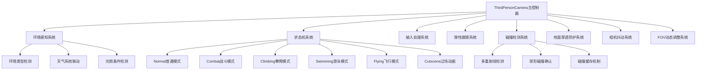
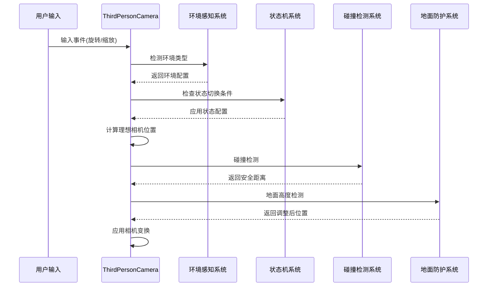
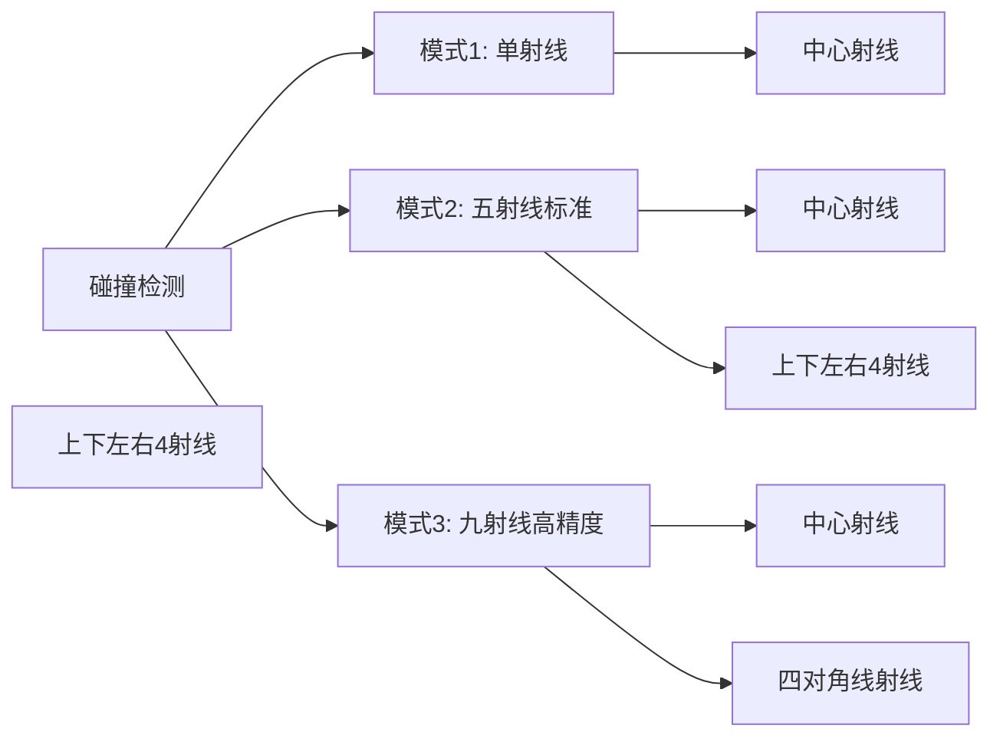
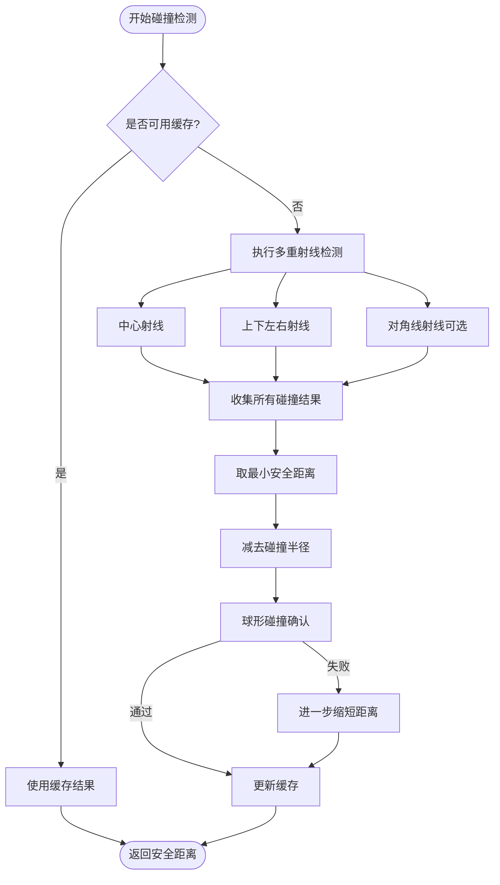
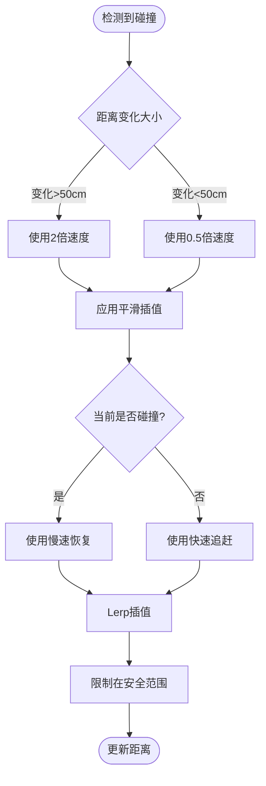
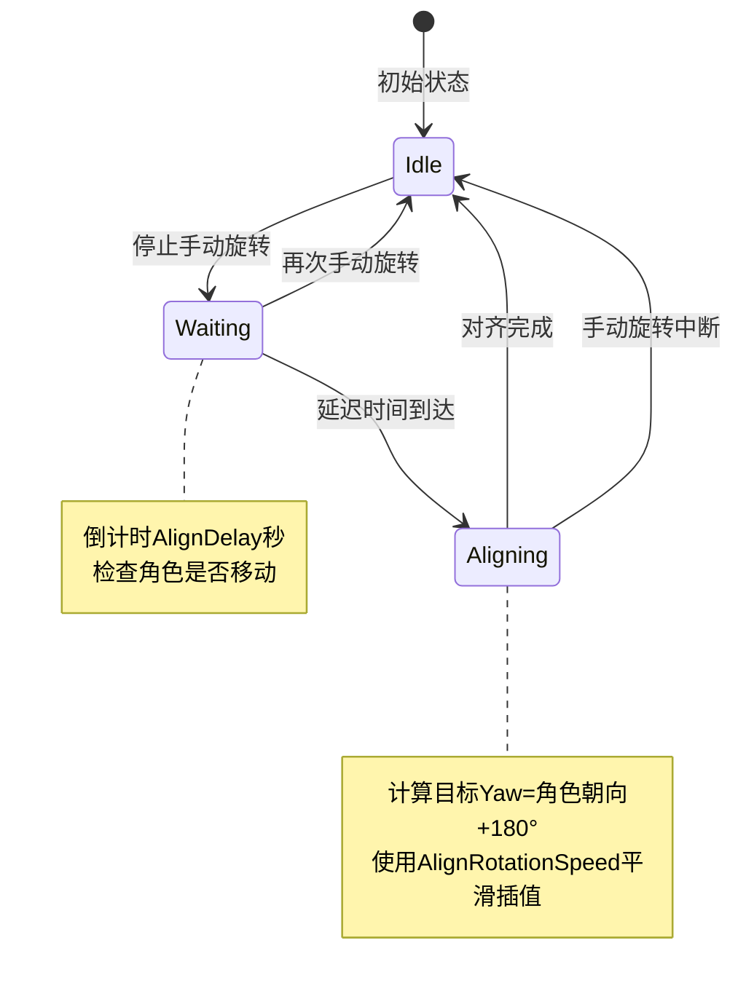
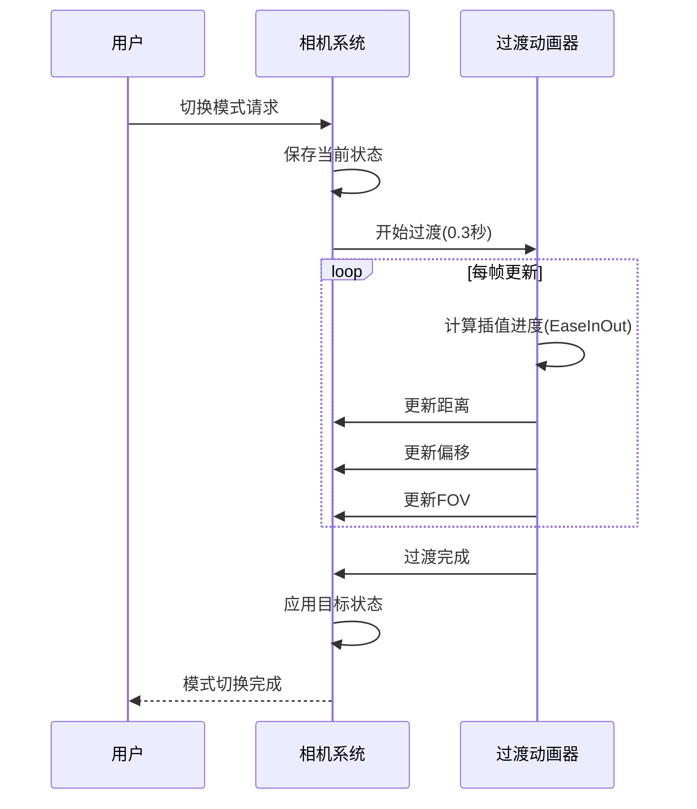
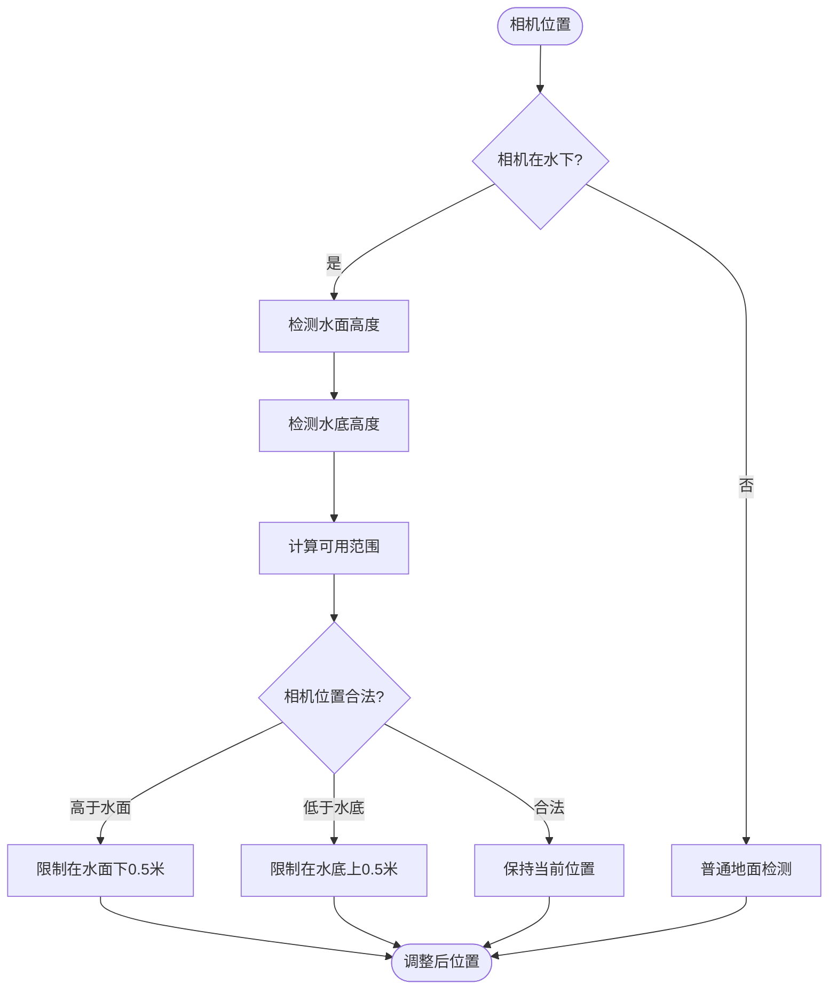
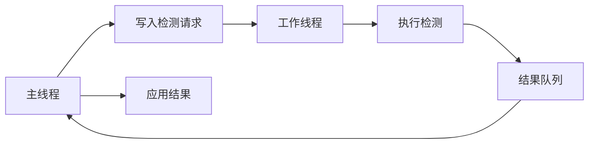
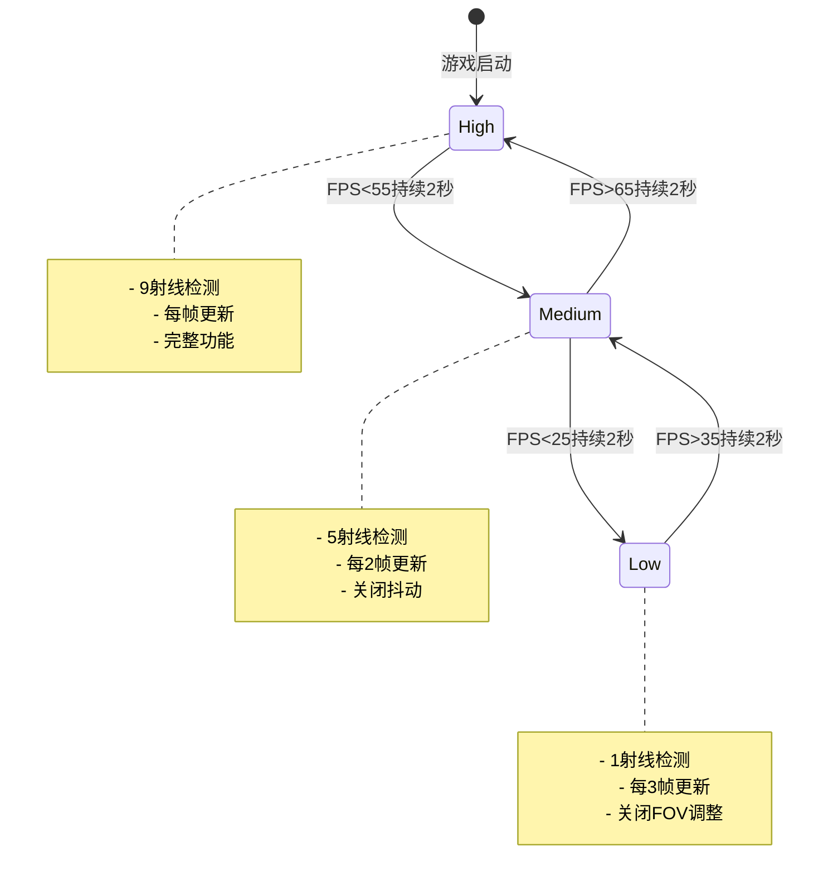

# 第三人称相机系统更新设计文档

## 1. 概述

### 1.1 系统目标

设计一套高品质的第三人称相机系统，借鉴《燕云十六声》、《魔兽世界》和《剑侠情缘3》的经典相机设计理念，为玩家提供沉浸式且流畅的视角体验。系统应满足以下核心目标：

- **智能跟随**：相机与角色保持弹性跟随关系，既能自然响应角色移动，又不会过分敏感
- **视野优化**：确保玩家始终保持良好的游戏视野，避免盲区
- **地形适应**：智能处理各类地形场景，包括室内狭窄空间、户外开阔区域、复杂建筑环境等
- **防穿透保护**：相机不能穿透地形、地面、墙壁或其他实体障碍物
- **平滑响应**：所有相机动作应平滑过渡，避免抖动或突变
- **玩家掌控**：提供直观的相机控制方式，支持自由旋转、缩放和模式切换

### 1.2 设计参考

| 参考游戏 | 借鉴特性 |
|---------|---------||
| **燕云十六声** | 古典美学视角、动态距离调整、智能避障、柔和跟随效果 |
| **魔兽世界** | 弹性跟随系统、地形适应算法、自动对齐机制、多层碰撞检测 |
| **剑侠情缘3** | 角色居中策略、平滑缩放体验、相机抖动反馈 |

### 1.3 系统范围

本设计涵盖以下功能模块：

- ✅ 相机基础参数配置（距离、角度、偏移等）
- ✅ 相机输入控制系统（鼠标、滚轮、快捷键）
- ✅ 相机跟随与聚焦机制
- ⏳ 智能碰撞检测与避障（需增强）
- ✅ 地面穿透防护系统
- ✅ 动态FOV调整
- ⏳ 相机模式切换（需平滑过渡）
- ✅ 相机抖动反馈系统
- ⏳ 自动对齐与平滑旋转（需完善）

**图例说明**：
- ✅ 已实现：功能完整实现且稳定运行
- ⏳ 需完善：基础功能存在但需优化或补充
- ❌ 未实现：功能完全缺失

### 1.4 实施状态总览

| 功能模块 | 完成度 | 优先级 | 状态 |
|---------|--------|--------|------|
| 基础参数配置 | 95% | P0 | ✅ 良好 |
| 碰撞检测系统 | 50% | P0 | ⏳ 需增强 |
| 地面穿透防护 | 80% | P0 | ✅ 良好 |
| 动态FOV调整 | 75% | P1 | ⏳ 需优化 |
| 相机跟随系统 | 85% | P0 | ✅ 良好 |
| 模式切换 | 60% | P1 | ⏳ 需平滑过渡 |
| 自动对齐系统 | 60% | P1 | ⏳ 需完善 |
| 相机抖动 | 90% | P1 | ✅ 良好 |
| 性能优化 | 50% | P1 | ⏳ 需LOD策略 |

## 2. 核心架构

### 2.1 系统组件

### 2.2 执行流程

## 3. 未实现功能详细设计

### 3.1 多重射线碰撞检测系统（P0核心功能）

#### 3.1.1 功能目标

当前碰撞检测仅使用单一射线，容易在边缘情况下发生穿透。需要实现多重射线+球形检测的双重验证机制，确保相机不会穿透任何障碍物。

#### 3.1.2 检测模式

#### 3.1.3 检测策略

| 射线类型 | 偏移向量 | 用途 |
|---------|---------|------|
| 中心射线 | (0, 0, 0) | 主要碰撞检测 |
| 上方射线 | (0, +0.3m, 0) | 检测天花板碰撞 |
| 下方射线 | (0, -0.3m, 0) | 检测地面碰撞 |
| 左侧射线 | (-0.3m, 0, 0) | 检测左侧墙壁 |
| 右侧射线 | (+0.3m, 0, 0) | 检测右侧墙壁 |
| 左上对角 | (-0.21m, +0.21m, 0) | 增强边缘检测 |
| 右上对角 | (+0.21m, +0.21m, 0) | 增强边缘检测 |
| 左下对角 | (-0.21m, -0.21m, 0) | 增强边缘检测 |
| 右下对角 | (+0.21m, -0.21m, 0) | 增强边缘检测 |

#### 3.1.4 球形碰撞确认

多重射线检测后，使用球形碰撞进行二次确认：

- **球体半径**：0.3米（CollisionSphereRadius）
- **检测位置**：相机最终位置
- **检测目的**：确保相机周围有足够的安全空间
- **处理策略**：如果球形检测失败，进一步缩短距离直到安全

#### 3.1.5 数据流设计

### 3.2 碰撞缓存机制（P0核心功能）

#### 3.2.1 功能目标

射线检测是高成本操作，需要通过智能缓存减少60-80%的重复检测，同时保证结果准确性。

#### 3.2.2 缓存数据结构

| 字段 | 类型 | 说明 |
|-----|------|------|
| LastPosition | Vector3 | 上次检测的相机位置 |
| LastDistance | float | 上次检测的相机距离 |
| CacheTime | float | 缓存时间戳 |
| HasObstruction | bool | 是否检测到障碍物 |
| SafeDistance | float | 缓存的安全距离 |

#### 3.2.3 缓存使用条件

缓存可用的条件（同时满足）：

1. **时间条件**：当前时间 - CacheTime < 0.1秒
2. **位置条件**：|当前位置 - LastPosition| < 0.5米
3. **距离条件**：|当前距离 - LastDistance| < 0.2米

#### 3.2.4 缓存失效策略

以下情况立即失效缓存：

- 环境类型变化（如从室外进入室内）
- 相机状态切换（如从Normal切换到Combat）
- 玩家快速移动（速度 > 10m/s）
- 距离大幅调整（滚轮缩放超过1米）

### 3.3 动态距离调整策略（P0核心功能）

#### 3.3.1 功能目标

实现"快速缩短、缓慢恢复"的距离调整策略，提供流畅的视觉体验。

#### 3.3.2 调整速度配置

| 场景 | 速度参数 | 默认值 | 说明 |
|-----|---------|--------|------|
| 遇到障碍物 | DistanceAdjustmentSpeed | 5.0 | 快速缩短，避免穿透 |
| 障碍物消失 | ObstructionRecoverySpeed | 2.0 | 缓慢恢复，避免抖动 |
| 用户滚轮缩放 | ZoomSmoothing | 0.15 | 平滑响应用户输入 |
| 碰撞平滑速度 | CollisionSmoothSpeed | 10.0 | 碰撞调整的插值速度 |

#### 3.3.3 自适应平滑策略

### 3.4 自动对齐系统（P1重要功能）

#### 3.4.1 功能目标

当玩家停止手动旋转相机一定时间后，自动将相机对齐到角色正后方，提供舒适的默认视角。

#### 3.4.2 触发条件

| 条件 | 值 | 说明 |
|-----|---|------|
| 延迟时间 | AlignDelay = 5.0秒 | 停止手动旋转后等待时间 |
| 角度范围 | AlignSmoothRange = 45° | 在此范围内开始平滑对齐 |
| 最小速度 | AlignMinSpeed = 0.1m/s | 角色移动速度低于此值不触发 |
| 战斗状态 | 禁用 | 战斗中不自动对齐 |

#### 3.4.3 对齐流程

#### 3.4.4 平滑对齐算法

对齐过程使用EaseInOut插值曲线，提供自然的动画效果：

- **起始角度**：当前相机Yaw
- **目标角度**：角色Orientation.Yaw + 180°
- **插值速度**：AlignRotationSpeed = 90°/秒
- **角度归一化**：处理-180°到+180°的最短路径

### 3.5 模式切换平滑过渡（P1重要功能）

#### 3.5.1 功能目标

实现第一人称和第三人称模式的平滑切换，避免视角跳变，提升用户体验。

#### 3.5.2 参数状态保存

需要保存和恢复的参数：

| 参数类别 | 第三人称参数 | 第一人称参数 |
|---------|------------|------------|
| 距离 | Distance, MinDistance, MaxDistance | 固定0.0 |
| 角度 | Pitch, Yaw | 继承当前值 |
| 偏移 | Offset = (0, 2, 0) | FirstPersonOffset = (0, 1.8, 0) |
| FOV | BaseFOV = 60° | FirstPersonFOV = 70° |
| 碰撞检测 | EnableCameraCollision = true | EnableCameraCollision = false |

#### 3.5.3 过渡动画设计

#### 3.5.4 过渡期间控制

- **禁用功能**：碰撞检测、地面检测、用户输入
- **启用功能**：FOV插值、位置插值
- **插值曲线**：使用EaseInOutQuad曲线，开始和结束平滑

### 3.6 特殊场景地面处理（P1重要功能）

#### 3.6.1 室内场景（天花板检测）

**问题**：室内环境可能同时存在地面和天花板，相机需要避免穿透两者。

**解决方案**：

| 检测方向 | 射线起点 | 射线方向 | 最大距离 | 层级 |
|---------|---------|---------|---------|------|
| 向下检测地面 | 相机位置 | Vector3.Down | GroundCheckDistance | GroundLayers |
| 向上检测天花板 | 相机位置 | Vector3.Up | CeilingCheckDistance | ObstructionLayers |

**处理逻辑**：

- 如果检测到天花板，且距离<MinCeilingHeight（0.5米），向下调整相机位置
- 如果检测到地面，且距离<MinGroundHeight（0.5米），向上调整相机位置
- 如果地面和天花板距离<1.0米，触发"狭窄空间"模式，缩短相机距离

#### 3.6.2 水下场景（双层检测）

**问题**：水下环境需要同时检测水面和水底。

**检测策略**：

#### 3.6.3 悬崖边缘（角色脚下检测）

**问题**：角色站在悬崖边缘时，相机可能悬空或穿透地面。

**解决方案**：

- **检测基准**：从角色脚下位置向下发射射线，而非从相机位置
- **最大距离**：GroundCheckDistance = 5.0米
- **安全策略**：如果未检测到地面，使用角色当前高度作为最低高度

## 4. 待完善功能设计

### 4.1 角色状态FOV调整（P1重要功能）

#### 4.1.1 状态FOV配置

| 角色状态 | FOV调整 | 说明 |
|---------|--------|------|
| 普通移动 | BaseFOV = 60° | 默认视场角 |
| 冲刺状态 | +10° | 增强速度感 |
| 战斗状态 | -5° | 聚焦目标，减少视觉干扰 |
| 瞄准状态 | -15° | 精确瞄准，窄视角 |
| 骑乘状态 | +5° | 更广阔视野 |
| 飞行状态 | +10° | 空中需要更大视野 |

#### 4.1.2 FOV混合策略

当多个状态同时存在时，使用优先级混合：

1. **最高优先级**：瞄准状态（-15°）
2. **高优先级**：战斗状态（-5°）
3. **中优先级**：飞行/骑乘状态（+5°/+10°）
4. **低优先级**：冲刺状态（+10°）

### 4.2 异步检测系统（P1重要功能）

#### 4.2.1 异步化候选

| 检测类型 | 当前频率 | 异步策略 | 预期收益 |
|---------|---------|---------|---------|
| 地面高度检测 | 每帧 | 每0.1秒异步 | 减少70%开销 |
| 环境类型检测 | 每0.5秒 | 每1秒异步 | 减少50%开销 |
| 障碍物感知 | 每帧 | 每0.2秒异步 | 减少80%开销 |
| 天气系统查询 | 每帧 | 每2秒异步 | 减少95%开销 |

#### 4.2.2 线程安全设计

- **线程安全队列**：使用ConcurrentQueue存储请求和结果
- **原子操作**：使用Interlocked操作更新状态标志
- **数据隔离**：每个异步任务使用独立的数据副本

### 4.3 性能LOD策略（P1重要功能）

#### 4.3.1 性能等级定义

| 性能等级 | FPS阈值 | 碰撞射线数 | 检测频率 | 缓存时间 |
|---------|---------|-----------|---------|---------|
| High | ≥60 FPS | 9射线 | 每帧 | 0.05秒 |
| Medium | 30-60 FPS | 5射线 | 每2帧 | 0.1秒 |
| Low | <30 FPS | 1射线 | 每3帧 | 0.2秒 |

#### 4.3.2 动态调整策略

## 5. 配置参数规范

### 5.1 核心参数表

#### 5.1.1 距离与角度参数（Flax Engine单位：厘米）

| 参数名 | 类型 | 默认值 | 范围 | 单位 | 说明 |
|-------|------|--------|------|------|------|
| Distance | float | 1500.0 | 500.0 - 3000.0 | 厘米 | 相机与目标的默认距离（15米） |
| MinDistance | float | 500.0 | 200.0 - 1000.0 | 厘米 | 相机最小距离（5米） |
| MaxDistance | float | 3000.0 | 2000.0 - 300000.0 | 厘米 | 相机最大距离（30米） |
| Pitch | float | 30.0 | -80.0 - 80.0 | 度 | 相机俯仰角 |
| Yaw | float | 0.0 | 0.0 - 360.0 | 度 | 相机水平角 |
| MinPitch | float | -80.0 | -89.0 - 0.0 | 度 | 最小俯仰角 |
| MaxPitch | float | 80.0 | 0.0 - 89.0 | 度 | 最大俯仰角 |
| FocusOffset | Vector3 | (0, 180, 0) | - | 厘米 | 聚焦点相对目标的偏移（1.8米） |

**重要说明**：Flax Engine使用厘米作为距离单位，100厘米 = 1米。

#### 5.1.2 碰撞检测参数

| 参数名 | 类型 | 默认值 | 范围 | 说明 |
|-------|------|--------|------|------|
| EnableCameraCollision | bool | true | - | 是否启用碰撞检测 |
| CollisionRayCount | int | 5 | 1/5/9 | 射线数量(性能分级) |
| CollisionLayerMask | LayersMask | Default | - | 碰撞检测层级 |
| AutoExcludeTargetCollision | bool | true | - | 自动排除角色碰撞 |
| CollisionRadius | float | 30.0 | 10.0 - 100.0 | 碰撞球体半径(厘米，0.3米) |
| CollisionSmoothSpeed | float | 10.0 | 1.0 - 20.0 | 碰撞平滑速度 |
| EnableSmartAvoidance | bool | true | - | 启用智能避障 |
| SmartAvoidancePitch | float | 45.0 | 30.0 - 60.0 | 智能避障目标角度 |

#### 5.1.3 地面防护参数

| 参数名 | 类型 | 默认值 | 范围 | 说明 |
|-------|------|--------|------|------|
| EnableGroundPenetrationProtection | bool | true | - | 启用地面防护 |
| GroundLayers | LayersMask | Default | - | 地面检测层级 |
| GroundCheckDistance | float | 500.0 | 100.0 - 1000.0 | 地面检测距离(厘米，5米) |
| MinGroundHeight | float | 50.0 | 10.0 - 200.0 | 最小地面高度(厘米，0.5米) |
| GroundHeightAdjustSpeed | float | 10.0 | 1.0 - 20.0 | 高度调整速度 |
| EnableGroundHeightPrediction | bool | true | - | 启用高度预测 |
| GroundPredictionDistance | float | 200.0 | 100.0 - 500.0 | 预测距离(厘米，2米) |

### 5.2 参数验证规则

所有参数在赋值时需要进行以下验证：

1. **范围验证**：确保值在Min-Max范围内
2. **依赖验证**：MinDistance < Distance < MaxDistance
3. **单位验证**：距离参数使用厘米（Flax Engine单位），配置使用米（用户友好）
4. **类型验证**：枚举类型必须在定义范围内

## 6. 测试验证方案

### 6.1 功能测试场景

#### 6.1.1 测试场景列表

| 场景名称 | 测试目的 | 关键要素 |
|---------|---------|---------|
| 平坦草原 | 基础功能测试 | 开阔地形、无障碍物 |
| 复杂建筑 | 碰撞检测测试 | 墙壁、柱子、楼梯 |
| 狭窄走廊 | 智能避障测试 | 2米宽走廊、天花板 |
| 悬崖峭壁 | 地面检测测试 | 高度落差、边缘检测 |
| 地下洞穴 | 特殊场景测试 | 低矮天花板、不规则地形 |
| 水下场景 | 双层检测测试 | 水面、水底、浮力 |

#### 6.1.2 测试检查点

**碰撞检测验证**：
- [ ] 相机在任何情况下不穿透墙壁
- [ ] 边缘检测有效（射线数≥5时）
- [ ] 球形检测二次确认生效
- [ ] 缓存机制减少60%以上射线检测

**地面防护验证**：
- [ ] 相机不穿透地面
- [ ] 天花板检测生效（室内场景）
- [ ] 悬崖边缘处理正确
- [ ] 水下双层检测正常

**模式切换验证**：
- [ ] 第一/三人称切换平滑（0.3秒过渡）
- [ ] 参数状态正确保存和恢复
- [ ] 过渡期间无抖动或闪烁

### 6.2 性能测试指标

#### 6.2.1 性能目标

| 指标 | 目标值 | 测量方法 |
|-----|--------|---------|
| 相机更新耗时 | < 0.5ms | PerformanceMonitor |
| 碰撞检测耗时 | < 0.3ms | Physics.RayCast计时 |
| 内存占用 | < 1MB | 内存分析器 |
| 帧率影响 | < 1% | FPS对比（启用/禁用相机） |

#### 6.2.2 性能测试场景

- **低负载**：平坦草原，无碰撞检测需求
- **中负载**：复杂建筑，持续碰撞检测
- **高负载**：狭窄走廊，高频碰撞+地面检测

### 6.3 用户体验测试

#### 6.3.1 主观评价指标

| 指标 | 评价标准 | 测试方法 |
|-----|---------|---------|
| 操作流畅性 | 无延迟感、无抖动 | 用户操作记录 |
| 视觉舒适性 | 无晕眩感、视角自然 | 用户问卷调查 |
| 控制精确性 | 响应准确、可预测 | 目标跟踪测试 |
| 智能化程度 | 自动调整合理、减少手动操作 | 操作次数统计 |

#### 6.3.2 客观测量指标

| 指标 | 目标值 | 说明 |
|-----|--------|------|
| 穿透发生率 | < 1% | 每100次碰撞中的穿透次数 |
| 操作响应延迟 | < 50ms | 输入到视觉反馈的时间 |
| 视角切换流畅度 | 无抖动 | 使用高速摄像分析 |
| 自动对齐成功率 | > 95% | 对齐后角度误差<5° |

## 7. 实施优先级与时间规划

### 7.1 优先级分级

#### P0级（核心功能，必须实现）

| 功能 | 预计工时 | 依赖 |
|-----|---------|------|
| 多重射线碰撞检测 | 4小时 | 无 |
| 碰撞缓存机制 | 2小时 | 多重射线检测 |
| 动态距离调整完善 | 3小时 | 碰撞缓存 |

**P0总计**：9小时（1-1.5天）

#### P1级（重要功能，应该实现）

| 功能 | 预计工时 | 依赖 |
|-----|---------|------|
| 自动对齐系统完善 | 3小时 | 无 |
| 模式切换平滑过渡 | 4小时 | 无 |
| 特殊场景地面处理 | 5小时 | 地面检测基础 |
| 角色状态FOV调整 | 2小时 | FOV基础 |
| 异步检测实现 | 4小时 | 无 |
| 性能LOD策略 | 3小时 | 性能监控基础 |

**P1总计**：21小时（2.5-3天）

#### P2级（扩展功能，可选实现）

| 功能 | 预计工时 | 说明 |
|-----|---------|------|
| 特写镜头系统 | 6小时 | NPC对话聚焦 |
| 多目标跟随 | 5小时 | 组队视野 |
| 相机轨道系统 | 8小时 | 过场动画 |
| 相机预设系统 | 3小时 | 快速切换 |

**P2总计**：22小时（2.5-3天）

### 7.2 实施阶段划分

#### 阶段1：碰撞检测增强（P0）
- **工期**：1-1.5天
- **交付物**：完善的碰撞检测系统
- **验收标准**：穿透率<1%，性能开销<0.3ms

#### 阶段2：用户体验优化（P1）
- **工期**：1.5-2天
- **交付物**：自动对齐、模式切换、地面处理
- **验收标准**：操作流畅无抖动，智能化程度提升

#### 阶段3：性能优化（P1）
- **工期**：1天
- **交付物**：异步检测、LOD策略
- **验收标准**：帧率影响<1%，低配设备流畅运行

#### 阶段4：功能扩展（P2可选）
- **工期**：2.5-3天
- **交付物**：特写镜头、多目标跟踪等
- **验收标准**：功能完整，符合设计要求

#### 阶段5：测试与文档（必须）
- **工期**：1天
- **交付物**：测试报告、API文档、使用指南
- **验收标准**：所有测试通过，文档完整

**总工期预估**：7-8个工作日

## 8. 风险评估与缓解

### 8.1 技术风险

| 风险项 | 等级 | 影响 | 缓解措施 |
|-------|------|------|---------|
| 碰撞检测性能开销过大 | 中 | 低配设备卡顿 | 实现LOD+缓存，异步检测 |
| 地形系统兼容性问题 | 中 | 地形采样失败 | 保留射线检测降级方案 |
| 异步检测同步问题 | 低 | 数据竞争 | 使用线程安全集合 |
| 多射线检测漏检 | 高 | 仍然穿透 | 增加球形检测二次确认 |

### 8.2 进度风险

| 风险项 | 等级 | 影响 | 缓解措施 |
|-------|------|------|---------|
| 扩展功能时间超期 | 中 | 延误发布 | 作为P2可选功能 |
| 测试场景准备不足 | 低 | 测试不充分 | 提前准备标准测试场景 |
| 性能优化效果不达标 | 中 | 低配设备体验差 | 预留性能优化缓冲时间 |

### 8.3 质量风险

| 风险项 | 等级 | 影响 | 缓解措施 |
|-------|------|------|---------|
| 代码冗余导致维护困难 | 低 | 开发效率降低 | 代码重构清理 |
| 参数配置复杂度高 | 中 | 用户配置困难 | 提供预设方案和快速向导 |
| 边界情况处理不完善 | 中 | 特殊场景bug | 充分的边界测试 |

## 9. 成功标准

### 9.1 功能完整性

- [x] 已实现功能保持稳定（无退化）
- [ ] P0级功能100%实现
- [ ] P1级功能100%实现
- [ ] P2级功能根据时间选择性实现

### 9.2 性能指标

- [ ] 相机更新耗时 < 0.5ms
- [ ] 碰撞检测耗时 < 0.3ms
- [ ] 帧率影响 < 1%
- [ ] 内存占用 < 1MB

### 9.3 质量指标

- [ ] 代码覆盖率 > 80%
- [ ] 穿透发生率 < 1%
- [ ] 操作响应延迟 < 50ms
- [ ] 用户满意度 > 90%

### 9.4 文档完整性

- [ ] API参考文档完整
- [ ] 使用指南清晰
- [ ] 配置参数说明详细
- [ ] 故障排除指南实用

---

**文档版本**：1.0  
**创建日期**：2025年1月  
**适用范围**：HundunWorld游戏第三人称相机系统  
**维护者**：开发团队
