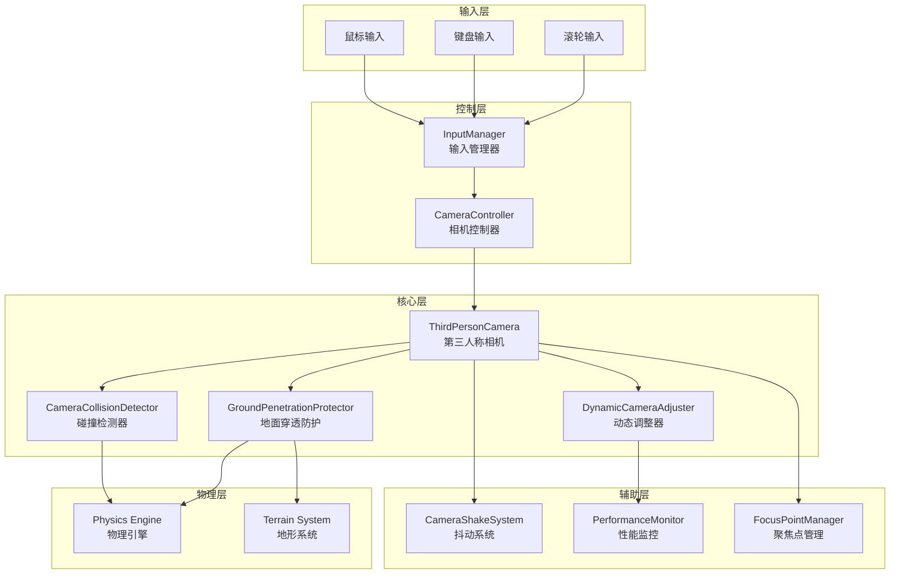
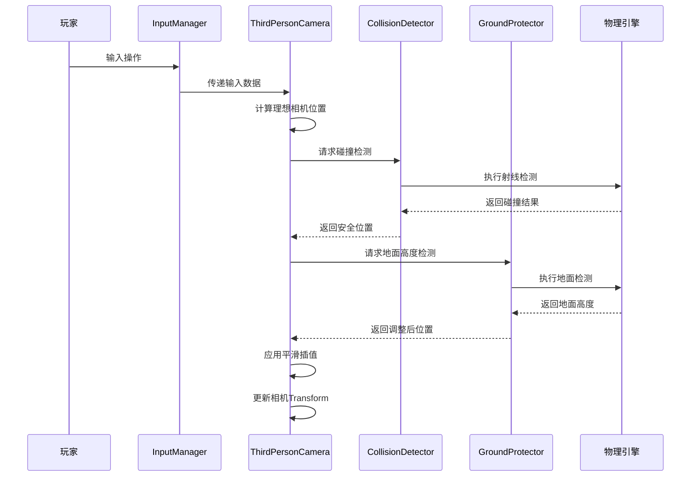
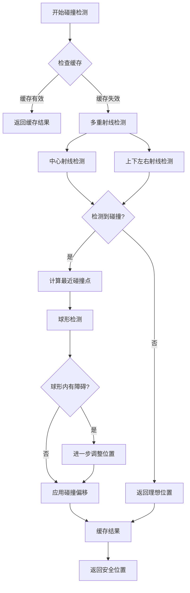
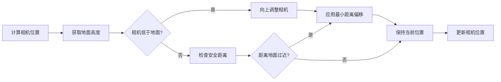
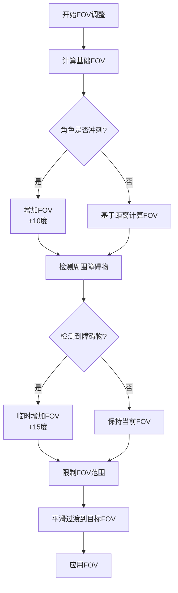
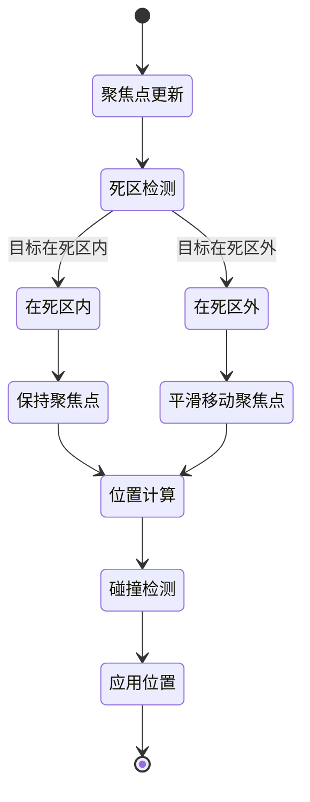
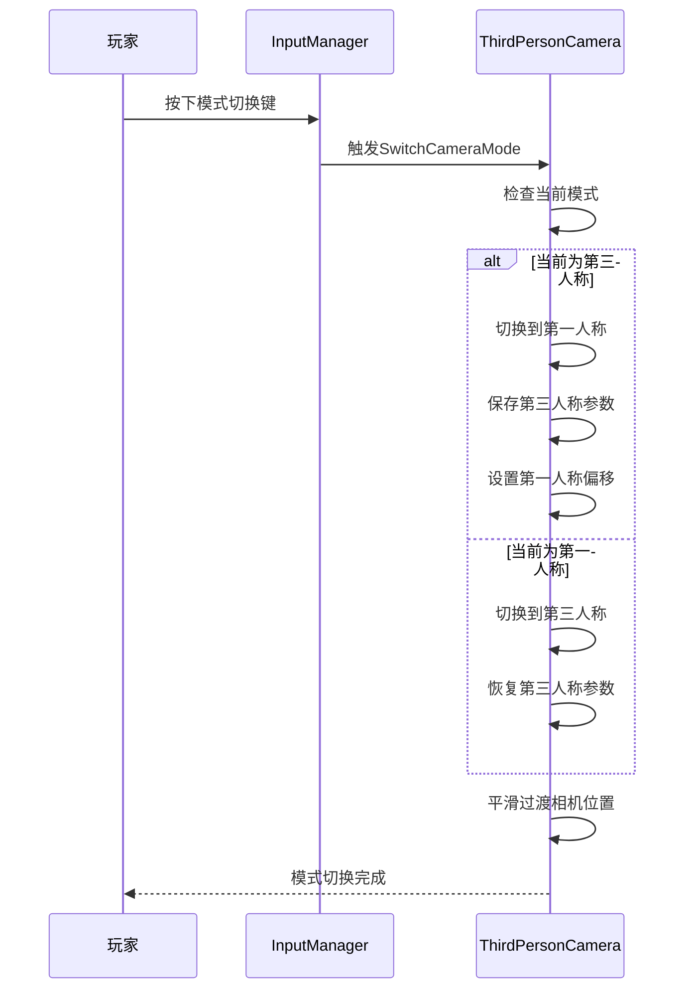
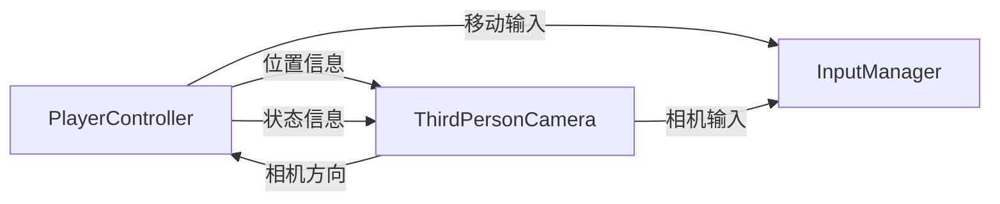

# 第三人称相机系统设计文档

## 1. 概述

### 1.1 系统目标

设计一套高品质的第三人称相机系统，借鉴《燕云十六声》和《魔兽世界》的经典相机设计理念，为玩家提供沉浸式且流畅的视角体验。系统应满足以下核心目标：

- **智能跟随**：相机与角色保持弹性跟随关系，既能自然响应角色移动，又不会过分敏感
- **视野优化**：确保玩家始终保持良好的游戏视野，避免盲区
- **地形适应**：智能处理各类地形场景，包括室内狭窄空间、户外开阔区域、复杂建筑环境等
- **防穿透保护**：相机不能穿透地形、地面、墙壁或其他实体障碍物
- **平滑响应**：所有相机动作应平滑过渡，避免抖动或突变
- **玩家掌控**：提供直观的相机控制方式，支持自由旋转、缩放和模式切换

### 1.2 设计参考

| 参考游戏 | 借鉴特性 |
|---------|---------|
| **燕云十六声** | 古典美学视角、动态距离调整、智能避障、柔和跟随效果 |
| **魔兽世界** | 弹性跟随系统、地形适应算法、自动对齐机制、多层碰撞检测 |
| **剑侠情缘3** | 角色居中策略、平滑缩放体验、相机抖动反馈 |

### 1.3 系统范围

本设计涵盖以下功能模块：

- 相机基础参数配置（距离、角度、偏移等）
- 相机输入控制系统（鼠标、滚轮、快捷键）
- 相机跟随与聚焦机制
- 智能碰撞检测与避障
- 地面穿透防护系统
- 动态FOV调整
- 相机模式切换（第一人称/第三人称）
- 相机抖动反馈系统
- 自动对齐与平滑旋转

## 2. 系统架构

### 2.1 架构总览



### 2.2 组件职责

| 组件 | 职责 |
|------|------|
| **InputManager** | 统一管理所有输入事件，提供输入缓冲和去抖功能 |
| **CameraController** | 接收输入并转换为相机控制指令 |
| **ThirdPersonCamera** | 核心相机逻辑，负责位置计算、旋转处理、跟随算法 |
| **DynamicCameraAdjuster** | 动态调整FOV、智能避障、环境感知 |
| **CameraCollisionDetector** | 多层次碰撞检测，防止相机穿透障碍物 |
| **GroundPenetrationProtector** | 专门处理地面穿透问题，确保相机不低于地面 |
| **CameraShakeSystem** | 提供相机抖动效果，增强游戏反馈 |
| **FocusPointManager** | 管理相机聚焦点，支持死区和平滑居中 |
| **PerformanceMonitor** | 监控相机系统性能，支持动态LOD调整 |

### 2.3 数据流设计



## 3. 相机参数配置

### 3.1 基础参数

| 参数名称 | 默认值 | 取值范围 | 说明 |
|---------|--------|---------|------|
| **距离参数** | | | |
| MinDistance | 5.0f | 3.0f - 10.0f | 相机最小距离（米） |
| MaxDistance | 30.0f | 20.0f - 50.0f | 相机最大距离（米） |
| DefaultDistance | 15.0f | MinDistance - MaxDistance | 默认相机距离（米） |
| **角度参数** | | | |
| MinPitch | -45° | -89° - 0° | 最小俯仰角（向下看） |
| MaxPitch | 45° | 0° - 89° | 最大俯仰角（向上看） |
| DefaultPitch | 30° | MinPitch - MaxPitch | 默认俯仰角 |
| DefaultYaw | 45° | 0° - 360° | 默认偏航角（水平旋转） |
| **偏移参数** | | | |
| CameraOffset.X | 0.0f | -5.0f - 5.0f | X轴偏移（米） |
| CameraOffset.Y | 2.0f | 0.0f - 5.0f | Y轴偏移（米，相机高于角色） |
| CameraOffset.Z | 0.0f | -5.0f - 5.0f | Z轴偏移（米） |

### 3.2 控制参数

| 参数名称 | 默认值 | 取值范围 | 说明 |
|---------|--------|---------|------|
| **旋转控制** | | | |
| RotationSpeed | 2.0f | 0.5f - 5.0f | 鼠标旋转灵敏度 |
| RotationSmoothing | 0.1f | 0.0f - 1.0f | 旋转平滑系数（0=无延迟，1=最平滑） |
| MinInputValue | 0.01f | 0.001f - 0.1f | 忽略微小输入的阈值 |
| **缩放控制** | | | |
| ZoomSpeed | 5.0f | 1.0f - 10.0f | 滚轮缩放速度 |
| ZoomSmoothing | 0.15f | 0.0f - 1.0f | 缩放平滑系数 |
| **跟随控制** | | | |
| CameraSmoothing | 0.1f | 0.0f - 1.0f | 位置跟随平滑系数 |
| FollowCharacterRotation | true | true/false | 是否跟随角色旋转 |
| RotationFollowDelay | 1.0f | 0.0f - 3.0f | 旋转跟随延迟（秒） |
| RotationFollowSpeed | 90.0f | 30.0f - 180.0f | 旋转跟随速度（度/秒） |

### 3.3 聚焦点参数

| 参数名称 | 默认值 | 取值范围 | 说明 |
|---------|--------|---------|------|
| FocusRadius | 1.0f | 0.5f - 3.0f | 聚焦点死区半径（米） |
| FocusCentering | 0.5f | 0.0f - 1.0f | 聚焦点居中速度 |
| FocusOffsetY | 1.5f | 0.0f - 3.0f | 聚焦点Y轴偏移（瞄准头部位置） |

### 3.4 自动对齐参数

| 参数名称 | 默认值 | 取值范围 | 说明 |
|---------|--------|---------|------|
| EnableSmartAlignment | true | true/false | 是否启用智能对齐 |
| AlignDelay | 5.0f | 2.0f - 10.0f | 自动对齐延迟（秒） |
| AlignSmoothRange | 45° | 15° - 90° | 平滑对齐角度范围 |
| AlignRotationSpeed | 90.0f | 30.0f - 180.0f | 对齐旋转速度（度/秒） |
| MinMovementThreshold | 0.01f | 0.001f - 0.1f | 触发对齐的最小移动阈值 |

## 4. 碰撞检测系统

### 4.1 碰撞检测策略

相机系统采用**多层次碰撞检测**策略，确保在各种复杂场景下都能正确处理障碍物：



### 4.2 碰撞检测参数

| 参数名称 | 默认值 | 说明 |
|---------|--------|------|
| EnableCameraCollision | true | 是否启用碰撞检测 |
| CollisionRayCount | 5 | 射线数量（中心+上下左右） |
| CollisionSphereRadius | 0.3f | 球形检测半径（米） |
| CameraCollisionOffset | 0.5f | 碰撞后的安全偏移（米） |
| ObstructionLayerMask | uint.MaxValue | 碰撞检测层掩码 |
| CollisionCacheTime | 0.1f | 碰撞缓存时间（秒） |

### 4.3 碰撞检测算法

#### 4.3.1 主射线检测

从角色位置向相机理想位置发射射线，检测路径上是否有障碍物：

**输入**：
- 角色位置（targetPosition）
- 相机理想位置（idealCameraPosition）

**输出**：
- 安全相机位置
- 是否检测到碰撞

**处理流程**：
1. 计算从角色到相机的方向向量和距离
2. 沿该方向发射射线
3. 如果检测到碰撞，将相机位置调整到碰撞点前方（应用CameraCollisionOffset）
4. 如果未检测到碰撞，返回理想位置

#### 4.3.2 多重射线检测

为提高检测准确性，在主射线基础上增加四条辅助射线：

**射线配置**：

| 射线 | 偏移方向 | 偏移量 |
|------|---------|--------|
| 中心射线 | 无 | 0 |
| 上方射线 | 相机上方向 | +0.3米 |
| 下方射线 | 相机下方向 | -0.3米 |
| 左侧射线 | 相机左方向 | -0.3米 |
| 右侧射线 | 相机右方向 | +0.3米 |

**处理逻辑**：
1. 对所有射线执行碰撞检测
2. 收集所有碰撞点
3. 选择距离角色最近的碰撞点作为参考
4. 基于该碰撞点计算安全相机距离

#### 4.3.3 球形碰撞检测

在射线检测基础上，使用球形检测进一步确认相机位置安全性：

**检测流程**：
1. 在调整后的相机位置执行球形检测
2. 球形半径为CollisionSphereRadius
3. 如果球形内检测到障碍物，沿远离障碍物方向进一步调整位置
4. 重复检测直到球形内无障碍物或达到最小距离

### 4.4 碰撞响应与恢复

#### 4.4.1 距离调整策略

相机距离根据碰撞情况动态调整：

**动态调整规则**：

| 场景 | 调整策略 |
|------|---------|
| 检测到障碍物 | 快速缩短距离至安全位置（DistanceAdjustmentSpeed） |
| 障碍物消失 | 平滑恢复至理想距离（ObstructionRecoverySpeed） |
| 玩家手动缩放 | 立即更新理想距离，当前距离平滑跟随 |

**参数配置**：

| 参数 | 默认值 | 说明 |
|------|--------|------|
| DistanceAdjustmentSpeed | 5.0f | 距离缩短速度（米/秒） |
| ObstructionRecoverySpeed | 2.0f | 距离恢复速度（米/秒） |

#### 4.4.2 平滑过渡

所有碰撞调整都应平滑过渡，避免突变：

**平滑算法**：
- 使用Lerp插值在当前位置和目标位置之间过渡
- 插值速度基于EnableSmoothFollow参数控制
- 碰撞发生时使用较快的插值速度
- 恢复时使用较慢的插值速度

## 5. 地面穿透防护系统

### 5.1 防护策略

地面穿透防护是相机系统的关键功能，必须确保相机在任何情况下都不会低于地面或地形表面。



### 5.2 地面检测参数

| 参数名称 | 默认值 | 说明 |
|---------|--------|------|
| EnableGroundPenetrationProtection | true | 是否启用地面穿透防护 |
| GroundLayerMask | 1 | 地面检测层掩码 |
| MinDistanceFromGround | 0.5f | 与地面的最小安全距离（米） |
| GroundCheckDistance | 100.0f | 地面检测射线长度（米） |
| GroundHeightCacheTime | 0.1f | 地面高度缓存时间（秒） |

### 5.3 地面高度检测算法

#### 5.3.1 射线投射检测

**检测方法**：
1. 从相机位置或角色位置向下发射垂直射线
2. 射线长度为GroundCheckDistance
3. 检测与地面层的第一个交点
4. 返回交点的Y坐标作为地面高度

**优化策略**：
- 使用地面高度缓存减少射线检测频率
- 缓存包含：检测位置、地面高度、缓存时间
- 如果检测位置与缓存位置距离小于GroundHeightCacheDistance（默认5米），且缓存未过期，直接返回缓存值

#### 5.3.2 地形采样检测

对于使用Flax Engine地形系统的场景，可直接采样地形高度：

**检测方法**：
1. 获取地形组件引用
2. 根据相机XZ坐标采样地形高度
3. 返回采样高度值

**优点**：
- 性能更优，无需射线检测
- 精度更高，直接获取地形数据
- 支持地形LOD系统

### 5.4 高度调整策略

当检测到相机低于地面或距离地面过近时，执行以下调整：

**调整规则**：

| 场景 | 调整策略 |
|------|---------|
| 相机低于地面 | 立即调整至地面高度 + MinDistanceFromGround |
| 相机距离地面过近 | 平滑调整至安全高度 |
| 角色在斜坡上 | 根据地面法线调整相机高度 |
| 角色在台阶上 | 快速响应高度变化 |

**平滑调整**：
- 使用Lerp插值平滑过渡到目标高度
- 向上调整速度快于向下调整速度
- 紧急情况（相机明显低于地面）立即调整，无平滑过渡

### 5.5 特殊场景处理

#### 5.5.1 室内场景

在天花板较低的室内场景：

**处理策略**：
1. 同时检测地面和天花板
2. 如果相机被夹在地面和天花板之间，优先保证不穿透地面
3. 动态调整相机俯仰角，避免视角受限
4. 必要时自动缩短相机距离

#### 5.5.2 水下场景

角色进入水下时：

**处理策略**：
1. 将水面视为特殊的地面层
2. 相机可以潜入水下，但不能穿透水底地形
3. 调整相机雾化效果和颜色校正（美术层面）

#### 5.5.3 悬崖边缘

角色站在悬崖边缘时：

**处理策略**：
1. 相机不应受下方深渊影响
2. 基于角色脚下地面高度，而非相机下方地面高度
3. 防止相机因下方地形突变而剧烈抖动

## 6. 动态FOV系统

### 6.1 FOV调整策略

动态FOV（视场角）调整能够提升玩家的沉浸感和视觉体验：



### 6.2 FOV参数配置

| 参数名称 | 默认值 | 取值范围 | 说明 |
|---------|--------|---------|------|
| BaseFOV | 60° | 45° - 90° | 基础视场角 |
| MinFOV | 45° | 30° - 60° | 最小视场角 |
| MaxFOV | 90° | 70° - 120° | 最大视场角 |
| FOVAdjustSpeed | 30.0f | 10.0f - 60.0f | FOV调整速度（度/秒） |
| SprintFOVBoost | 10° | 5° - 20° | 冲刺时FOV增量 |
| ObstacleFOVBoost | 15° | 10° - 25° | 障碍物检测时FOV增量 |

### 6.3 基于距离的FOV调整

相机距离与FOV的关系：

| 相机距离 | FOV调整策略 |
|---------|-----------|
| 最小距离（5米） | MinFOV（45°），视野较窄，聚焦角色 |
| 中等距离（15米） | BaseFOV（60°），标准视野 |
| 最大距离（30米） | MaxFOV（90°），视野开阔，便于观察环境 |

**计算公式**：
```
normalizedDistance = (currentDistance - MinDistance) / (MaxDistance - MinDistance)
distanceBasedFOV = lerp(MinFOV, MaxFOV, normalizedDistance)
```

### 6.4 基于状态的FOV调整

| 角色状态 | FOV调整 |
|---------|---------|
| 正常行走 | BaseFOV |
| 冲刺状态 | BaseFOV + SprintFOVBoost |
| 战斗状态 | BaseFOV - 5°（提高专注度） |
| 瞄准状态 | BaseFOV - 15°（提高精确度） |
| 骑乘坐骑 | BaseFOV + 5°（扩大视野） |

### 6.5 智能障碍物感知

当检测到相机周围有障碍物时，临时增加FOV以提供更好的视野：

**检测方法**：
1. 在相机位置执行球形检测（半径ObstacleDetectionRadius）
2. 向相机前方发射射线检测（距离ObstacleDetectionRadius * 2）
3. 如果检测到障碍物，增加FOV

**恢复机制**：
- 障碍物消失后2秒，逐渐恢复到正常FOV
- 恢复速度为调整速度的一半，确保平滑过渡

## 7. 相机跟随系统

### 7.1 跟随机制设计

相机跟随系统需要平衡响应速度和平滑性：



### 7.2 聚焦点管理

#### 7.2.1 聚焦点死区

聚焦点死区机制防止相机对角色微小移动过度敏感：

**工作原理**：
- 在角色周围定义一个球形死区（半径FocusRadius）
- 当角色在死区内移动时，聚焦点保持不变
- 当角色移出死区时，聚焦点开始跟随角色移动

**优势**：
- 减少相机抖动
- 提供稳定的视觉体验
- 降低计算负担

#### 7.2.2 聚焦点居中

当角色移出死区后，聚焦点逐渐向角色位置移动：

**移动速度**：
- 由FocusCentering参数控制（0.0 - 1.0）
- 0.0表示聚焦点不移动
- 1.0表示聚焦点立即跟随角色
- 0.5表示中等速度平滑跟随

**计算方法**：
```
targetFocusPoint = characterPosition + cameraOffset
currentFocusPoint = lerp(currentFocusPoint, targetFocusPoint, focusCentering)
```

### 7.3 位置跟随策略

相机位置基于聚焦点和相机参数计算：

**计算流程**：

1. **聚焦点确定**：
   - 基于角色位置和偏移量
   - 考虑死区和居中逻辑

2. **理想位置计算**：
   ```
   direction = Vector3(
       cos(pitch) * sin(yaw),
       sin(pitch),
       cos(pitch) * cos(yaw)
   )
   idealPosition = focusPoint - direction * distance
   ```

3. **碰撞调整**：
   - 执行多重射线检测
   - 调整距离避免穿透障碍物

4. **地面检测**：
   - 确保相机不低于地面
   - 应用最小安全距离

5. **平滑插值**：
   ```
   currentPosition = lerp(currentPosition, targetPosition, cameraSmoothing)
   ```

### 7.4 旋转跟随策略

#### 7.4.1 手动旋转模式

玩家通过鼠标控制相机旋转：

**输入处理**：
- 鼠标右键按下：启用旋转控制
- 鼠标移动：更新俯仰角和偏航角
- 应用灵敏度系数（RotationSpeed）

**角度限制**：
- 俯仰角限制在MinPitch到MaxPitch范围内
- 偏航角范围0° - 360°，自动规范化

#### 7.4.2 自动对齐模式

当启用智能对齐（EnableSmartAlignment）时：

**对齐触发条件**：
- 玩家停止手动旋转超过AlignDelay时间
- 角色正在移动（速度大于MinMovementThreshold）

**对齐逻辑**：
1. 计算角色前进方向
2. 计算相机应对齐的目标偏航角（角色后方180°）
3. 计算当前偏航角与目标偏航角的差值
4. 如果差值小于AlignSmoothRange，执行平滑旋转
5. 旋转速度为AlignRotationSpeed

**平滑对齐**：
```
angleDifference = deltaAngle(currentYaw, targetYaw)
rotationAmount = alignRotationSpeed * deltaTime
newYaw = currentYaw + clamp(angleDifference, -rotationAmount, rotationAmount)
```

#### 7.4.3 角色旋转跟随

当启用FollowCharacterRotation时，相机跟随角色旋转：

**跟随条件**：
- 角色旋转角度超过阈值（5°）
- 自上次角色旋转后经过RotationFollowDelay时间
- 玩家未手动控制相机（超过2秒）

**跟随逻辑**：
1. 检测角色当前朝向
2. 计算相机应跟随的目标偏航角
3. 平滑过渡到目标角度（速度RotationFollowSpeed）

## 8. 相机模式切换

### 8.1 支持的相机模式

| 模式 | 说明 | 适用场景 |
|------|------|---------|
| **第三人称模式** | 标准第三人称视角 | 探索、战斗、社交 |
| **第一人称模式** | 角色第一视角 | 精确瞄准、室内探索 |

### 8.2 模式切换流程



### 8.3 第一人称模式特性

| 参数 | 配置 |
|------|------|
| 相机偏移 | Vector3(0, 1.8f, 0) - 眼睛高度 |
| 距离 | 0米（贴近角色） |
| 碰撞检测 | 禁用 |
| 地面检测 | 禁用（跟随角色高度） |
| FOV | BaseFOV - 5°（更自然的视野） |

### 8.4 模式切换动画

为提升切换体验，应用平滑过渡动画：

**过渡参数**：
- 过渡时间：0.3秒
- 插值曲线：EaseInOut
- 过渡期间禁用碰撞检测

**过渡流程**：
1. 记录切换前的相机位置和参数
2. 计算切换后的目标位置和参数
3. 在过渡时间内使用插值平滑过渡
4. 过渡完成后恢复正常功能

## 9. 相机抖动系统

### 9.1 抖动触发场景

| 场景 | 抖动强度 | 持续时间 | 说明 |
|------|---------|---------|------|
| 角色落地 | 0.1f | 0.2秒 | 轻微抖动 |
| 角色受击 | 0.15f | 0.3秒 | 中等抖动 |
| 爆炸效果 | 0.3f | 0.5秒 | 强烈抖动 |
| 地震事件 | 0.5f | 持续 | 持续抖动 |

### 9.2 抖动实现

**抖动参数**：
- ShakeIntensity：抖动强度（偏移量倍数）
- ShakeDuration：抖动持续时间
- ShakeOffset：实时抖动偏移量

**计算方法**：
```
每帧计算：
  if shakeDuration > 0:
    shakeOffset = randomVector3 * shakeIntensity
    shakeDuration -= deltaTime
    shakeIntensity *= 0.95  // 逐渐衰减
  else:
    shakeOffset = Vector3.Zero
    
相机最终位置 = 计算位置 + shakeOffset
```

### 9.3 抖动衰减

抖动效果应平滑衰减，避免突然停止：

**衰减策略**：
- 线性衰减：强度每帧减少固定值
- 指数衰减：强度每帧乘以衰减系数（0.95）
- 混合衰减：开始快速衰减，后期缓慢衰减

### 9.4 抖动方向控制

不同场景可指定抖动方向：

| 抖动类型 | 方向限制 |
|---------|---------|
| 全向抖动 | 随机三维方向 |
| 垂直抖动 | 仅Y轴方向 |
| 水平抖动 | 仅XZ平面方向 |
| 定向抖动 | 指定方向（如爆炸源方向） |

## 10. 性能优化策略

### 10.1 缓存机制

| 缓存类型 | 缓存时间 | 失效条件 |
|---------|---------|---------|
| 碰撞检测结果 | 0.1秒 | 相机或角色位置变化超过阈值 |
| 地面高度 | 0.1秒 | 检测位置移动超过5米 |
| 聚焦点位置 | 实时更新 | 角色移出死区 |

### 10.2 LOD（细节层次）策略

根据性能压力动态调整相机系统精度：

| 性能等级 | 碰撞射线数 | 更新频率 | 地面检测频率 |
|---------|-----------|---------|-------------|
| 高性能 | 5条射线 | 每帧 | 每帧 |
| 中性能 | 3条射线 | 每帧 | 每2帧 |
| 低性能 | 1条射线 | 每2帧 | 每5帧 |

### 10.3 异步检测

对于非关键性检测，可采用异步处理：

**异步任务**：
- 地面高度检测（结果延迟1帧可接受）
- 障碍物感知检测（用于FOV调整）

**同步任务**：
- 主射线碰撞检测（必须实时）
- 地面穿透防护（必须实时）

### 10.4 距离剔除

当相机距离某些检测点过远时，可跳过检测：

**剔除规则**：
- 距离玩家超过100米的地形细节不参与碰撞检测
- 使用简化的碰撞体代替复杂模型

## 11. 输入映射

### 11.1 键盘和鼠标输入

| 输入动作 | 默认按键 | 功能 |
|---------|---------|------|
| CameraControl | 鼠标右键 | 启用相机旋转控制 |
| SwitchCameraMode | V键 | 切换第一/第三人称模式 |
| ToggleFollowRotation | 左Alt键 | 切换角色旋转跟随模式 |
| ZoomIn | 鼠标滚轮向上 | 拉近相机 |
| ZoomOut | 鼠标滚轮向下 | 推远相机 |
| ResetCamera | R键 | 重置相机到默认位置和角度 |

### 11.2 手柄输入

| 输入动作 | 手柄按键 | 功能 |
|---------|---------|------|
| CameraRotate | 右摇杆 | 旋转相机 |
| CameraZoom | LT + 右摇杆Y轴 | 缩放相机 |
| SwitchMode | 右摇杆按下 | 切换相机模式 |
| ResetCamera | 选择键 | 重置相机 |

## 12. 测试场景与验证

### 12.1 功能测试场景

| 测试场景 | 测试目标 | 验证标准 |
|---------|---------|---------|
| **平坦地形** | 基础跟随和旋转 | 相机平滑跟随，无抖动 |
| **复杂建筑** | 碰撞检测 | 相机不穿透墙壁，距离自动调整 |
| **狭窄走廊** | 室内适应性 | 相机自动缩短距离，保持可用视野 |
| **悬崖边缘** | 地面检测 | 相机不受悬崖下方影响 |
| **斜坡地形** | 高度适应 | 相机平滑适应高度变化 |
| **洞穴场景** | 天花板检测 | 相机不穿透天花板 |
| **水下场景** | 特殊环境 | 相机可潜入水下但不穿透水底 |

### 12.2 性能测试指标

| 指标 | 目标值 | 测试方法 |
|------|--------|---------|
| 相机更新耗时 | < 0.5ms | 性能分析器测量 |
| 碰撞检测耗时 | < 0.3ms | 分帧统计 |
| 内存占用 | < 1MB | 内存分析器 |
| 帧率影响 | < 1% | 对比测试 |

### 12.3 用户体验测试

| 测试项 | 评估标准 |
|--------|---------|
| 操作流畅性 | 响应延迟 < 50ms，无明显卡顿 |
| 视觉舒适性 | 无眩晕感，视角自然 |
| 控制精确性 | 能够精确控制相机到期望位置 |
| 智能化程度 | 自动对齐、避障等功能正常工作 |

## 13. 与其他系统的集成

### 13.1 角色控制器集成



**数据交互**：
- PlayerController提供：角色位置、角色朝向、移动状态、冲刺状态
- ThirdPersonCamera提供：相机方向（用于相对移动计算）

### 13.2 ECS系统集成

对于使用ECS架构的项目：

**组件定义**：
- CameraComponent：存储相机参数和状态
- PositionComponent：角色位置信息
- RotationComponent：角色旋转信息

**系统协作**：
- CameraSystem读取PositionComponent和RotationComponent
- CameraSystem更新CameraComponent
- 渲染系统读取CameraComponent更新实际相机

### 13.3 物理引擎集成

**集成点**：
- 使用物理引擎的射线检测API
- 使用物理引擎的球形检测API
- 查询地形高度信息

**优化建议**：
- 为相机碰撞检测使用独立的物理层
- 简化碰撞体以提高检测性能

### 13.4 UI系统集成

**交互场景**：
- UI打开时可选择冻结相机更新
- 锁定模式下禁用玩家相机控制
- 过场动画时接管相机控制

## 14. 扩展功能设计

### 14.1 特写镜头系统

支持临时切换到特定角度的特写镜头：

**应用场景**：
- NPC对话时聚焦NPC脸部
- 剧情动画时的固定机位
- 骑乘坐骑时的特殊视角

**实现方式**：
- 定义特写镜头预设（位置、角度、FOV）
- 提供过渡动画（从当前相机到特写镜头）
- 完成后恢复到原相机状态

### 14.2 多目标跟随

支持相机同时跟随多个目标：

**应用场景**：
- 组队时保持所有队员在视野内
- 战斗时跟随玩家和敌人

**实现方式**：
- 计算所有目标的中心点
- 动态调整相机距离以包含所有目标
- 平滑过渡避免突变

### 14.3 相机轨道系统

支持相机沿预定义轨道运动：

**应用场景**：
- 过场动画
- 展示建筑或场景
- 教学引导

**实现方式**：
- 定义相机路径（样条曲线）
- 支持暂停、继续、跳转
- 与默认相机平滑切换

### 14.4 相机预设系统

允许玩家保存和切换不同的相机配置：

**预设内容**：
- 距离、角度、FOV
- 偏移量、平滑参数
- 启用的功能开关

**用途**：
- 战斗预设：近距离、较低视角
- 探索预设：远距离、较高视角
- 截图预设：自定义角度和FOV
