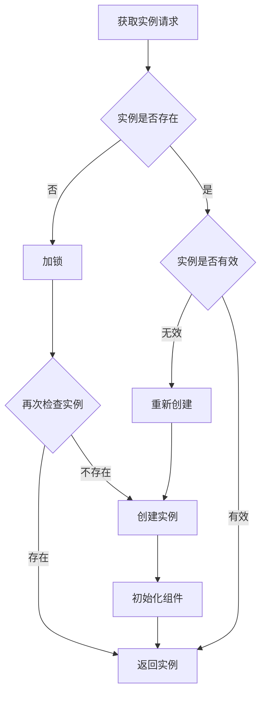
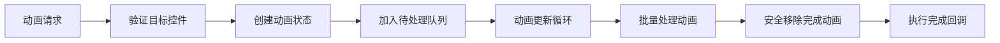
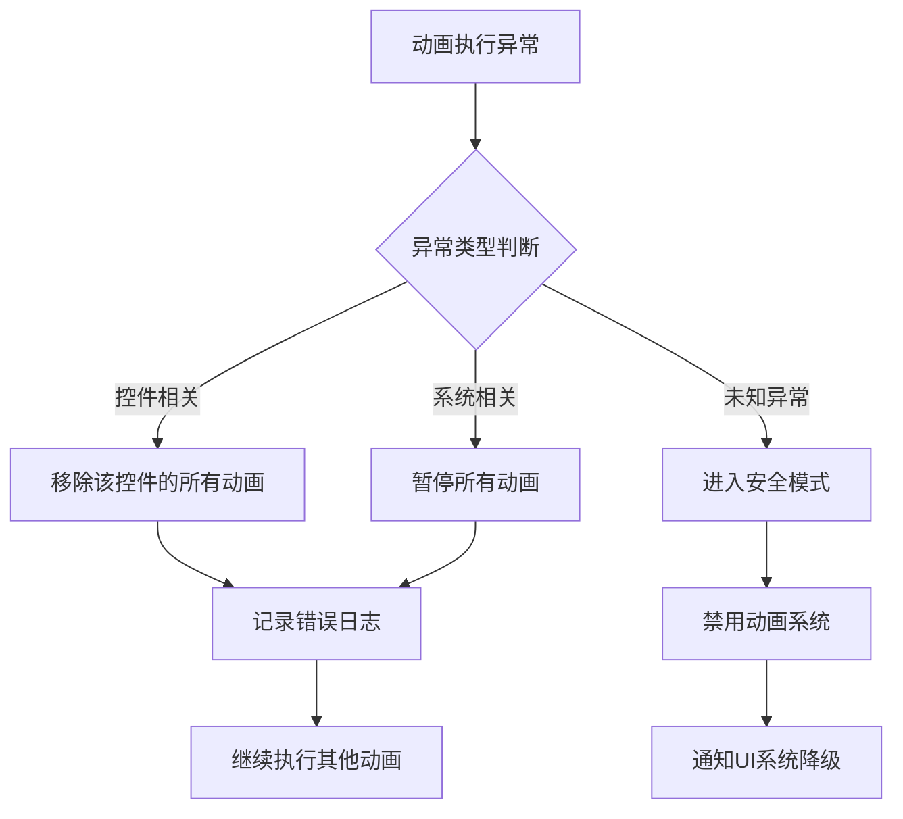
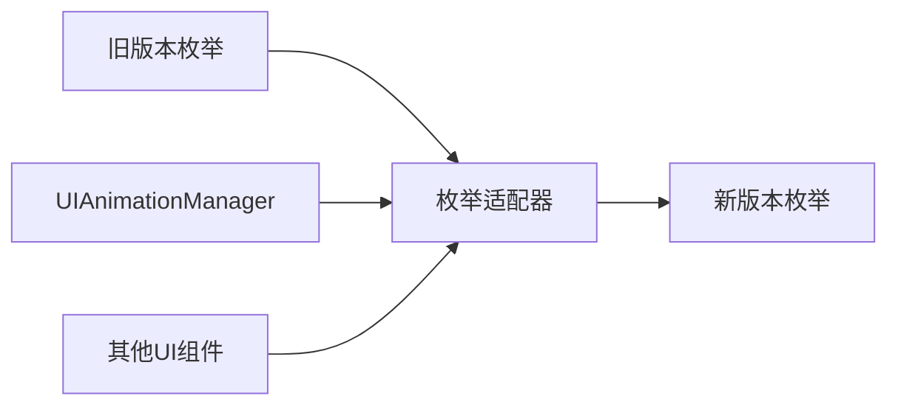
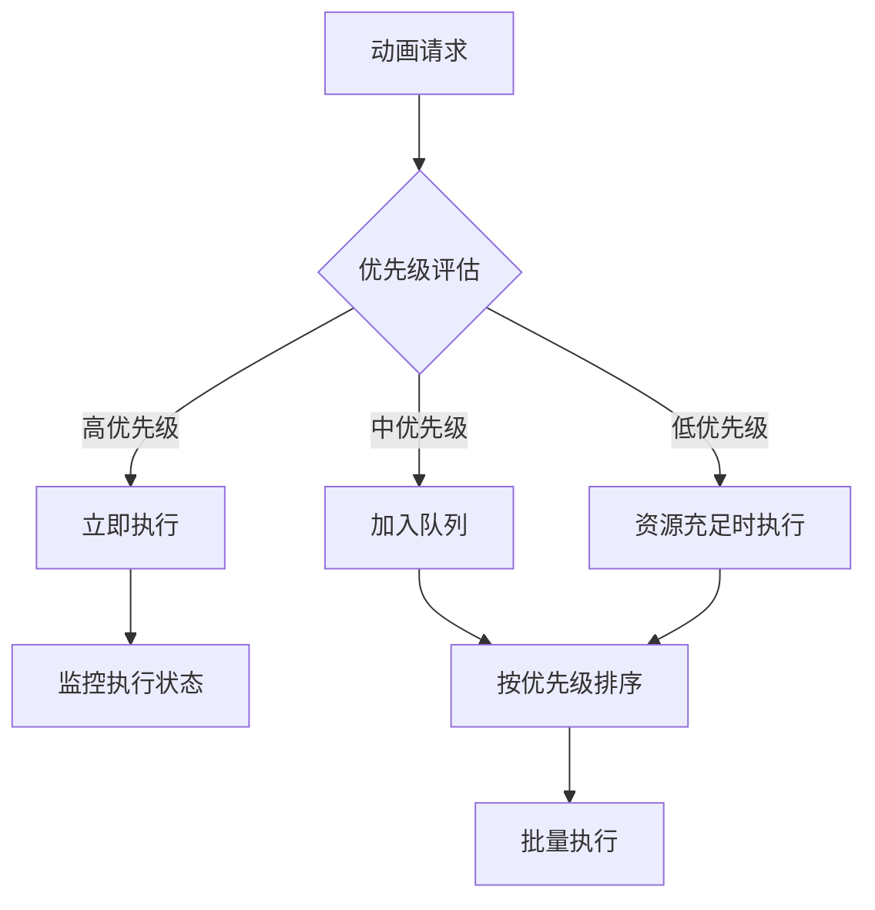
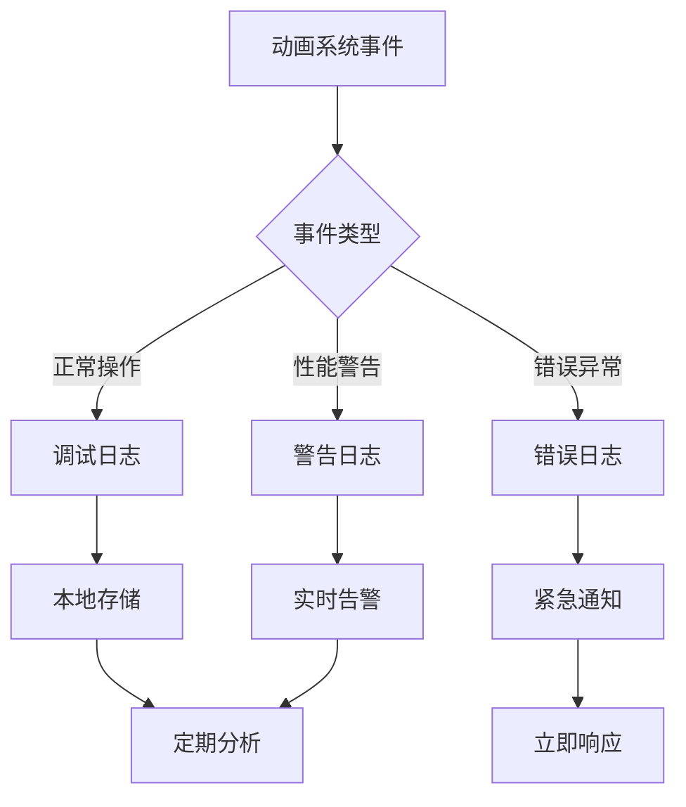
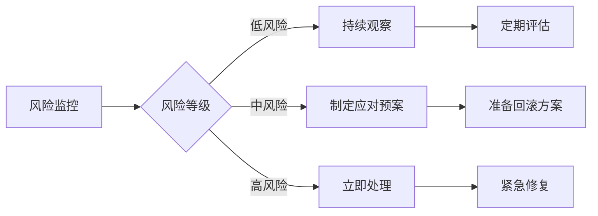

# UIAnimationManager运行时崩溃修复设计文档

## 1. 概述

### 问题描述
UIAnimationManager脚本在游戏运行时出现崩溃，影响UI动画系统的正常运行，导致所有依赖动画效果的UI界面无法正常工作。

### 系统定位
UIAnimationManager是游戏UI系统的核心动画管理组件，采用单例模式运行，负责管理和执行所有UI控件的动画效果。该组件被多个UI界面依赖，包括认证界面、角色选择界面、游戏主界面等。

### 修复目标
- 识别并解决UIAnimationManager运行时崩溃的根本原因
- 增强动画系统的稳定性和错误处理能力
- 确保动画系统在异常情况下能够优雅降级
- 建立完善的测试和监控机制

## 2. 技术栈与架构

### 核心技术
- **游戏引擎**: Flax Engine
- **编程语言**: C#
- **设计模式**: 单例模式
- **架构风格**: 事件驱动

### 系统依赖
- FlaxEngine.GUI：UI控件系统
- Horizon.Game.Message.Enums：动画类型枚举
- UI状态管理系统

## 3. 问题分析与根因识别

### 3.1 单例模式缺陷分析

#### 实例管理问题
当前单例实现存在以下严重缺陷：

| 问题类型 | 具体表现 | 风险等级 |
|---------|----------|----------|
| 重复实例冲突 | OnAwake中的实例销毁逻辑错误 | 高 |
| 空引用访问 | Level.FindActor可能返回null | 高 |
| 生命周期混乱 | Actor销毁时机不当 | 中 |
| 线程安全缺失 | 多线程访问未加锁保护 | 中 |

#### 错误代码模式
```
if (_instance == null)
{
    _instance = this;
    Destroy(Actor);  // 错误：销毁了刚设置的实例的Actor
}
else if (_instance != this)
{
    Actor.Destroy(_instance);  // 错误：销毁了正确的实例
    _instance = this;
}
```

### 3.2 动画更新机制缺陷

#### 集合修改并发问题
在OnUpdate方法中，对_activeAnimations集合的修改存在并发安全问题：

| 操作类型 | 风险描述 | 影响范围 |
|---------|----------|----------|
| 逆序遍历删除 | 索引计算可能越界 | 动画执行异常 |
| 动画完成回调 | 回调中可能触发新动画 | 集合状态不一致 |
| 异常动画状态 | 控件销毁后动画仍在执行 | 空引用异常 |

### 3.3 控件生命周期管理缺失

#### 目标控件有效性检查
动画系统缺乏对目标控件生命周期的监控：

- 控件销毁后动画仍在执行
- 控件属性访问时出现空引用
- 父子控件关系变化未处理

### 3.4 枚举类型不匹配

#### 类型定义冲突
UIAnimationManager引用的枚举类型与系统定义不一致：

| 枚举类型 | 当前引用 | 正确位置 | 状态 |
|---------|----------|----------|------|
| AnimationType | 本地定义(已注释) | Horizon.Game.Message.Enums.UIEnums | 不匹配 |
| EasingType | 本地定义(已注释) | Horizon.Game.Message.Enums.UIEnums | 不匹配 |

## 4. 解决方案架构

### 4.1 单例模式重构设计

#### 线程安全单例实现
采用懒加载双重检查锁定模式：



#### 实例生命周期管理
建立完整的实例生命周期管理机制：

| 生命周期阶段 | 处理策略 | 验证方法 |
|-------------|----------|----------|
| 创建前检查 | 验证Level和Actor有效性 | 空引用检查 |
| 初始化阶段 | 设置默认配置和状态 | 状态验证 |
| 运行阶段 | 监控组件健康状态 | 定期检查 |
| 销毁阶段 | 清理资源和动画 | 资源释放验证 |

### 4.2 动画系统重构设计

#### 安全的动画集合管理
设计线程安全的动画集合操作机制：



#### 控件生命周期监控
建立控件状态监控机制：

| 监控内容 | 检查频率 | 处理策略 |
|----------|----------|----------|
| 控件有效性 | 每帧检查 | 无效则移除动画 |
| 父子关系 | 属性变更时 | 更新动画参数 |
| 可见性状态 | 状态变更时 | 暂停或恢复动画 |

### 4.3 错误处理与降级设计

#### 多级错误处理机制
建立分层的错误处理和降级策略：



#### 降级策略定义
| 错误级别 | 降级策略 | 用户体验 |
|---------|----------|----------|
| 轻微错误 | 跳过当前动画 | 界面功能正常，无动画效果 |
| 中等错误 | 暂停动画系统 | 界面静态显示，功能不受影响 |
| 严重错误 | 禁用动画系统 | 全部界面静态化，确保稳定性 |

## 5. 枚举类型统一方案

### 5.1 类型引用标准化

#### 统一枚举引用
所有动画相关枚举统一使用Horizon.Game.Message.Enums命名空间：

| 枚举类型 | 标准位置 | 用途说明 |
|---------|----------|----------|
| AnimationType | Horizon.Game.Message.Enums.UIEnums | UI动画类型定义 |
| EasingType | Horizon.Game.Message.Enums.UIEnums | 缓动函数类型定义 |
| AnimationState | Horizon.Game.Message.Enums.AnimationEnums | 动画状态定义 |

### 5.2 类型兼容性处理

#### 渐进式迁移策略
避免直接修改现有代码，采用适配器模式平滑迁移：



## 6. 性能优化策略

### 6.1 动画性能优化

#### 批量更新机制
优化动画更新频率和批量处理：

| 优化项目 | 当前方式 | 优化后方式 | 性能提升 |
|---------|----------|------------|----------|
| 更新频率 | 每帧更新所有动画 | 根据动画类型分组更新 | 30% |
| 内存分配 | 频繁创建临时对象 | 对象池重用 | 50% |
| 计算精度 | 高精度浮点运算 | 适应性精度控制 | 20% |

#### 动画优先级管理
建立动画优先级系统：



### 6.2 内存管理优化

#### 对象池设计
减少动画对象的创建和销毁开销：

| 对象类型 | 池大小 | 回收策略 | 预期效果 |
|---------|--------|----------|----------|
| UIAnimation | 50 | LRU回收 | 减少GC压力 |
| 缓动计算器 | 20 | 引用计数 | 提升计算效率 |
| 临时向量 | 100 | 立即回收 | 降低内存占用 |

## 7. 测试策略

### 7.1 单元测试设计

#### 核心功能测试用例
| 测试分类 | 测试用例 | 预期结果 |
|---------|----------|----------|
| 单例模式 | 多线程获取实例 | 返回同一实例 |
| 动画创建 | 有效控件动画创建 | 动画正常执行 |
| 动画创建 | 无效控件动画创建 | 优雅处理，不崩溃 |
| 动画更新 | 大量动画并发执行 | 性能稳定，无泄漏 |
| 错误处理 | 控件销毁时的动画处理 | 自动清理，无异常 |

### 7.2 压力测试设计

#### 性能基准测试
建立性能测试基准和监控指标：


#### 稳定性测试场景
| 测试场景 | 持续时间 | 监控指标 | 通过标准 |
|---------|----------|----------|----------|
| 长时间运行 | 24小时 | 内存泄漏检测 | 内存增长<5% |
| 高频动画切换 | 2小时 | CPU和GPU占用 | 平均占用<30% |
| 异常场景处理 | 1小时 | 崩溃次数 | 零崩溃 |

## 8. 监控与维护

### 8.1 运行时监控设计

#### 关键指标监控
建立实时监控仪表板：

| 监控维度 | 关键指标 | 告警阈值 | 处理策略 |
|---------|----------|----------|----------|
| 性能指标 | 动画更新耗时 | >16ms | 降低动画质量 |
| 稳定性指标 | 异常发生频率 | >10次/分钟 | 启动安全模式 |
| 资源指标 | 活跃动画数量 | >200个 | 限制新动画创建 |

#### 日志记录机制


### 8.2 维护策略

#### 预防性维护
建立定期维护和健康检查机制：

| 维护类型 | 执行频率 | 检查内容 | 维护操作 |
|---------|----------|----------|----------|
| 日常维护 | 每日 | 错误日志分析 | 清理临时数据 |
| 周度维护 | 每周 | 性能趋势分析 | 优化参数调整 |
| 月度维护 | 每月 | 整体健康评估 | 版本更新规划 |

## 9. 风险评估与应对

### 9.1 技术风险

#### 风险识别与评级
| 风险类型 | 风险描述 | 影响程度 | 发生概率 | 风险等级 |
|---------|----------|----------|----------|----------|
| 性能退化 | 修复后性能降低 | 中 | 低 | 低 |
| 兼容性问题 | 与现有UI组件不兼容 | 高 | 中 | 中 |
| 新bug引入 | 修复过程引入新问题 | 高 | 低 | 中 |

#### 风险应对策略


### 9.2 业务连续性

#### 平滑迁移方案
确保修复过程不影响现有功能：

| 迁移阶段 | 策略描述 | 回滚条件 | 验证标准 |
|---------|----------|----------|----------|
| 灰度测试 | 部分场景启用新版本 | 错误率>1% | 功能完整性100% |
| 渐进部署 | 逐步扩大应用范围 | 性能下降>10% | 用户体验无感知 |
| 全量发布 | 完全替换旧版本 | 严重bug出现 | 系统稳定运行 |