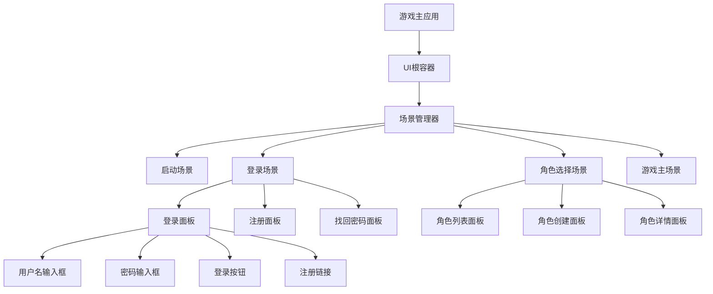
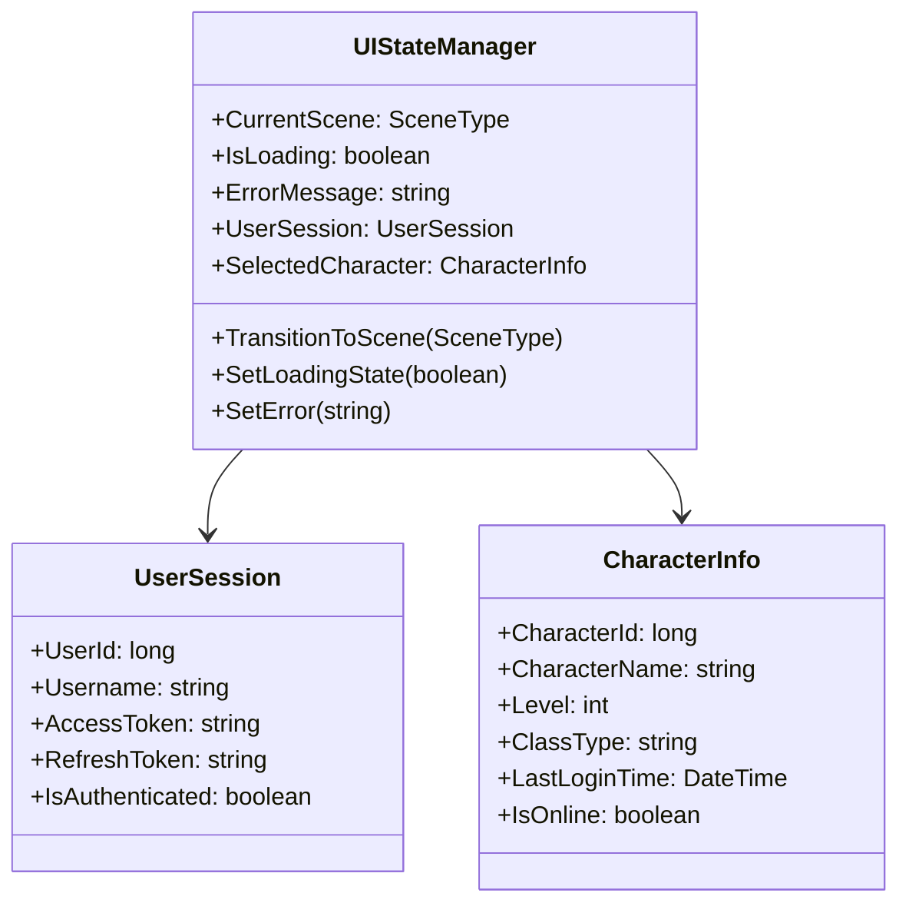

# 游戏UI界面开发设计文档

## 概述

本文档定义了HundunWorld游戏客户端的UI界面系统设计，重点描述游戏初始化后的登录流程、角色管理界面以及相关的用户交互体验。系统基于Flax Engine构建，采用事件驱动的UI架构模式，支持登录认证、用户注册、角色创建和选择等核心功能。

## 技术栈与依赖

### 客户端技术栈
- **游戏引擎**: Flax Engine (版本 >= 0.0.6194)
- **UI框架**: Flax Engine原生UI系统
- **网络通信**: 自定义网络协议，基于TCP连接
- **状态管理**: 本地UI状态管理器
- **数据序列化**: 基于消息协议的序列化机制

### 后端服务依赖
| 服务组件 | 功能描述 | 通信协议 |
|---------|---------|---------|
| 身份认证服务 | 用户登录验证、注册、密码管理 | HTTP REST API |
| 角色管理服务 | 角色创建、查询、进入游戏 | Orleans Grain通信 |
| 网关服务 | 消息路由、连接管理、负载均衡 | TCP Socket |

## UI架构设计

### 核心设计原则
- **状态驱动**: 所有UI组件基于应用状态进行渲染和更新
- **组件化**: 可复用的UI组件，支持组合和继承
- **响应式设计**: 适配不同分辨率和屏幕比例
- **用户体验优先**: 流畅的动画过渡和直观的交互反馈

### UI层次结构



## 界面流程设计

### 用户认证流程

```mermaid
stateDiagram-v2
    [*] --> GameInitialization
    GameInitialization --> LoginScreen
    
    state LoginScreen {
        [*] --> DisplayLoginForm
        DisplayLoginForm --> WaitingUserInput
        WaitingUserInput --> ValidatingCredentials: 点击登录
        WaitingUserInput --> RegisterScreen: 点击注册
        ValidatingCredentials --> LoginSuccess: 验证成功
        ValidatingCredentials --> LoginError: 验证失败
        LoginError --> WaitingUserInput: 显示错误信息
        LoginSuccess --> [*]
    }
    
    state RegisterScreen {
        [*] --> DisplayRegisterForm
        DisplayRegisterForm --> ValidatingRegisterInfo: 提交注册
        DisplayRegisterForm --> LoginScreen: 返回登录
        ValidatingRegisterInfo --> RegisterSuccess: 注册成功
        ValidatingRegisterInfo --> RegisterError: 注册失败
        RegisterError --> DisplayRegisterForm: 显示错误
        RegisterSuccess --> LoginScreen: 自动跳转
    }
    
    LoginScreen --> CharacterSelection: 登录成功
    RegisterScreen --> LoginScreen
```

### 角色管理流程

```mermaid
stateDiagram-v2
    [*] --> CharacterSelection
    
    state CharacterSelection {
        [*] --> LoadCharacterList
        LoadCharacterList --> DisplayCharacters: 加载成功
        LoadCharacterList --> LoadingError: 加载失败
        LoadingError --> LoadCharacterList: 重试
        
        DisplayCharacters --> CharacterSelected: 选择角色
        DisplayCharacters --> CreateNewCharacter: 创建角色
        
        CharacterSelected --> EnterGame: 确认进入
        EnterGame --> [*]: 进入游戏世界
        
        CreateNewCharacter --> CharacterCreation
    }
    
    state CharacterCreation {
        [*] --> DisplayCreationForm
        DisplayCreationForm --> ValidateCharacterInfo: 提交创建
        DisplayCreationForm --> CharacterSelection: 取消创建
        ValidateCharacterInfo --> CreationSuccess: 验证通过
        ValidateCharacterInfo --> CreationError: 验证失败
        CreationError --> DisplayCreationForm: 显示错误
        CreationSuccess --> CharacterSelection: 返回列表
    }
    
    CharacterSelection --> GameWorld: 进入游戏
```

## 界面组件设计

### 登录界面组件

#### LoginPanel 登录面板
| 属性 | 类型 | 描述 |
|------|------|------|
| UsernameField | InputField | 用户名输入框，支持手机号/邮箱格式 |
| PasswordField | InputField | 密码输入框，显示掩码字符 |
| LoginButton | Button | 登录按钮，触发身份验证流程 |
| RegisterLink | TextButton | 注册链接，切换到注册面板 |
| RememberCheckbox | Checkbox | 记住用户名选项 |
| StatusLabel | Label | 状态提示文本，显示登录进度或错误信息 |

#### 交互行为定义
- **输入验证**: 实时验证用户名格式和密码长度
- **按钮状态**: 根据输入完整性启用/禁用登录按钮
- **错误处理**: 显示服务端返回的具体错误信息
- **Loading状态**: 登录过程中显示加载动画

### 注册界面组件

#### RegisterPanel 注册面板
| 属性 | 类型 | 描述 |
|------|------|------|
| UsernameField | InputField | 用户名输入框，支持实时可用性检查 |
| PasswordField | InputField | 密码输入框，强度指示器 |
| ConfirmPasswordField | InputField | 确认密码输入框，实时匹配验证 |
| EmailField | InputField | 邮箱输入框，格式验证 |
| PhoneField | InputField | 手机号输入框，区号选择 |
| RegisterButton | Button | 注册按钮，提交注册请求 |
| BackToLoginLink | TextButton | 返回登录链接 |
| AgreementCheckbox | Checkbox | 同意用户协议复选框 |

#### 数据验证规则
- **用户名**: 3-20字符，字母数字下划线组合
- **密码**: 6-32字符，包含字母和数字
- **邮箱**: 标准邮箱格式验证
- **手机号**: 11位数字，支持主流运营商号段

### 角色选择界面组件

#### CharacterSelectionPanel 角色选择面板
| 属性 | 类型 | 描述 |
|------|------|------|
| CharacterList | ScrollView | 角色列表容器，支持滚动浏览 |
| CreateCharacterButton | Button | 创建新角色按钮 |
| EnterGameButton | Button | 进入游戏按钮，需先选择角色 |
| DeleteCharacterButton | Button | 删除角色按钮，显示确认对话框 |
| CharacterPreview | Model3DViewer | 3D角色预览窗口 |
| ServerInfoLabel | Label | 服务器信息显示 |

#### CharacterListItem 角色列表项
| 属性 | 类型 | 描述 |
|------|------|------|
| CharacterName | Label | 角色名称显示 |
| CharacterLevel | Label | 角色等级信息 |
| CharacterClass | Label | 角色职业信息 |
| LastLoginTime | Label | 最后登录时间 |
| CharacterAvatar | Image | 角色头像缩略图 |
| SelectionIndicator | HighlightFrame | 选中状态指示器 |

### 角色创建界面组件

#### CharacterCreationPanel 角色创建面板
| 属性 | 类型 | 描述 |
|------|------|------|
| CharacterNameField | InputField | 角色名称输入框 |
| ClassSelectionGrid | GridView | 职业选择网格 |
| AppearanceCustomizer | CustomUI | 外观定制组件 |
| AttributeAllocator | CustomUI | 属性点分配组件 |
| CreateButton | Button | 创建角色按钮 |
| CancelButton | Button | 取消创建按钮 |
| PreviewWindow | Model3DViewer | 角色预览窗口 |

## 网络交互协议

### 身份认证协议

#### 登录请求
```
消息类型: LoginRequest
数据结构:
- Username (string): 用户名或手机号/邮箱
- Password (string): 密码（客户端加密）
- AppId (string): 应用标识符
- AppType (enum): 应用类型（Game）
```

#### 登录响应
```
消息类型: LoginResponse
数据结构:
- Success (boolean): 登录成功状态
- ErrorCode (int): 错误代码
- ErrorMessage (string): 错误描述
- UserInfo (object): 用户基本信息
- AccessToken (string): 访问令牌
- RefreshToken (string): 刷新令牌
```

#### 注册请求
```
消息类型: RegisterRequest
数据结构:
- Username (string): 用户名
- Password (string): 密码
- Email (string): 邮箱地址
- Phone (string): 手机号码
- AppId (string): 应用标识符
```

### 角色管理协议

#### 角色列表请求
```
消息类型: GetCharacterListRequest
数据结构:
- UserId (long): 用户ID
- AccessToken (string): 访问令牌
```

#### 角色创建请求
```
消息类型: CreateCharacterRequest
数据结构:
- CharacterName (string): 角色名称
- ClassType (enum): 职业类型
- Appearance (object): 外观设置
- InitialAttributes (object): 初始属性分配
```

#### 进入游戏请求
```
消息类型: EnterGameRequest
数据结构:
- CharacterId (long): 角色ID
- AccessToken (string): 访问令牌
```

## 状态管理架构

### UI状态定义



### 状态转换规则

| 当前状态 | 触发事件 | 目标状态 | 前置条件 |
|---------|---------|---------|---------|
| GameStart | 初始化完成 | LoginScreen | 无 |
| LoginScreen | 登录成功 | CharacterSelection | 用户认证通过 |
| LoginScreen | 点击注册 | RegisterScreen | 无 |
| RegisterScreen | 注册成功 | LoginScreen | 账号创建成功 |
| RegisterScreen | 返回登录 | LoginScreen | 无 |
| CharacterSelection | 选择角色 | EnterGame | 角色数据加载完成 |
| CharacterSelection | 创建角色 | CharacterCreation | 角色槽位可用 |
| CharacterCreation | 创建成功 | CharacterSelection | 角色验证通过 |

## 用户体验设计

### 视觉设计原则
- **一致性**: 统一的色彩方案、字体规范和布局模式
- **层次感**: 通过色彩对比和大小变化建立信息层次
- **可读性**: 确保在不同光照条件下的文字清晰度
- **反馈性**: 所有交互操作提供即时的视觉或听觉反馈

### 动画与过渡效果

#### 场景转换动画
- **淡入淡出**: 场景切换时的渐变效果，持续时间0.3-0.5秒
- **滑动切换**: 登录与注册面板间的横向滑动过渡
- **缩放进入**: 对话框和弹窗的弹性缩放动画

#### 交互反馈动画
- **按钮按压**: 点击时的缩放和颜色变化效果
- **加载指示**: 旋转加载图标和进度条动画
- **错误抖动**: 输入错误时的轻微抖动提示

### 错误处理与用户引导

#### 错误信息分类
| 错误类型 | 显示方式 | 持续时间 | 用户操作 |
|---------|---------|---------|---------|
| 网络连接失败 | 全屏提示 | 持续显示 | 重试按钮 |
| 登录凭据错误 | 内联提示 | 5秒自动消失 | 重新输入 |
| 表单验证失败 | 字段下方提示 | 输入时消失 | 修正输入 |
| 服务器维护 | 模态对话框 | 用户确认 | 关闭应用 |

#### 用户引导策略
- **首次登录**: 显示功能介绍和操作提示
- **角色创建**: 分步引导，突出重要选项
- **快捷操作**: 键盘快捷键提示和记忆

## 性能优化策略

### UI渲染优化
- **批量渲染**: 合并相似UI元素的绘制调用
- **纹理压缩**: 使用适当格式压缩UI纹理资源
- **对象池**: 复用频繁创建/销毁的UI组件
- **延迟加载**: 按需加载非关键UI资源

### 内存管理
- **资源释放**: 场景切换时及时释放未使用资源
- **纹理缓存**: 合理设置UI纹理缓存大小
- **内存监控**: 实时监控UI系统内存占用情况

### 网络优化
- **请求合并**: 合并多个相关的网络请求
- **缓存策略**: 本地缓存用户基本信息和角色数据
- **超时重试**: 设置合理的超时时间和重试机制
- **压缩传输**: 对大型数据包进行压缩传输

## 测试策略

### 功能测试覆盖
- **登录流程**: 覆盖各种登录场景和异常情况
- **注册流程**: 验证注册表单和数据验证逻辑
- **角色操作**: 测试角色创建、选择、删除等功能
- **状态同步**: 验证UI状态与服务端数据一致性

### UI自动化测试
- **界面元素检测**: 验证关键UI组件的存在和可见性
- **交互流程测试**: 模拟用户操作路径的自动化执行
- **兼容性测试**: 不同分辨率和设备的UI适配验证
- **性能基准测试**: UI响应时间和资源消耗监控