# 游戏UI界面优化设计方案

## 项目概述

本设计方案旨在优化《混沌世界》游戏的用户界面系统，解决当前存在的界面居中问题、长宽比例不协调以及登录后界面切换异常等问题。设计将借鉴《江夏情缘3》、《魔兽世界》和《燕云十六声》的优秀UI设计元素，融合中国古典美学与现代游戏界面设计理念，打造具有文化特色且用户体验优良的界面系统。

## 技术栈与依赖

| 技术组件 | 描述 | 用途 |
|---------|------|------|
| Flax Engine GUI | 核心UI渲染系统 | 界面组件绘制与事件处理 |
| UIStateManager | 界面状态管理器 | 场景切换与状态同步 |
| UIAnimationManager | 动画管理系统 | 界面过渡动画与交互反馈 |
| AuthenticationManager | 认证管理器 | 登录注册流程控制 |
| AnchorPresets | 锚点预设系统 | 响应式布局与屏幕适配 |

## 核心问题分析

### 当前存在的问题

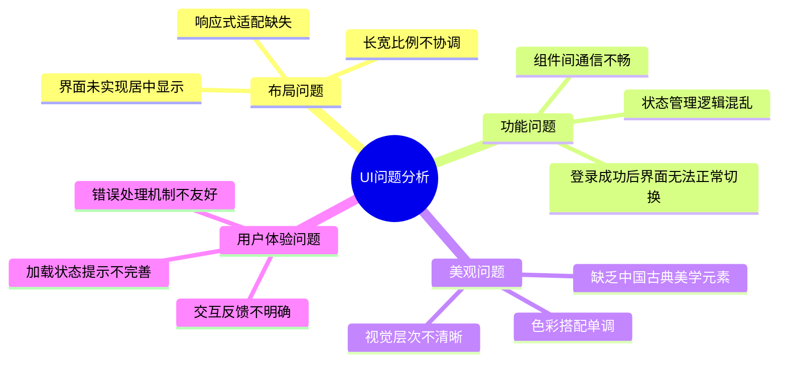

### 问题根因分析

| 问题类别 | 具体表现 | 根本原因 | 影响范围 |
|---------|---------|---------|----------|
| 布局居中 | 登录/注册界面位置偏移 | 未使用AnchorPresets.MiddleCenter | 所有弹窗类界面 |
| 长宽比例 | 界面元素比例失调 | 硬编码尺寸，缺乏动态计算 | 表单类界面 |
| 界面切换 | 登录后无法进入游戏主界面 | 状态管理器回调机制不完善 | 核心游戏流程 |
| 美学设计 | 缺乏文化特色 | 未融入中国古典设计元素 | 整体视觉效果 |

## 设计架构

### 整体架构设计

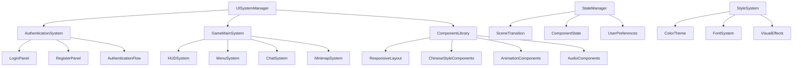

### 响应式布局系统

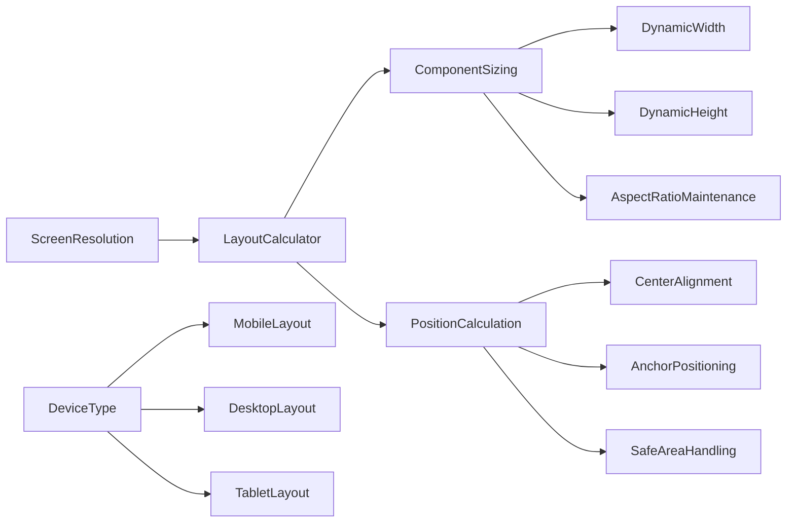

## 界面居中优化方案

### 居中布局实现策略

| 组件类型 | 居中方式 | 锚点设置 | 位置计算 |
|---------|---------|---------|----------|
| 登录面板 | 屏幕绝对居中 | AnchorPresets.MiddleCenter | 屏幕中心 - 面板尺寸的一半 |
| 注册面板 | 屏幕绝对居中 | AnchorPresets.MiddleCenter | 屏幕中心 - 面板尺寸的一半 |
| 模态对话框 | 当前窗口居中 | AnchorPresets.MiddleCenter | 父容器中心对齐 |
| 确认对话框 | 屏幕居中 | AnchorPresets.MiddleCenter | 自适应屏幕尺寸 |

### 动态居中算法

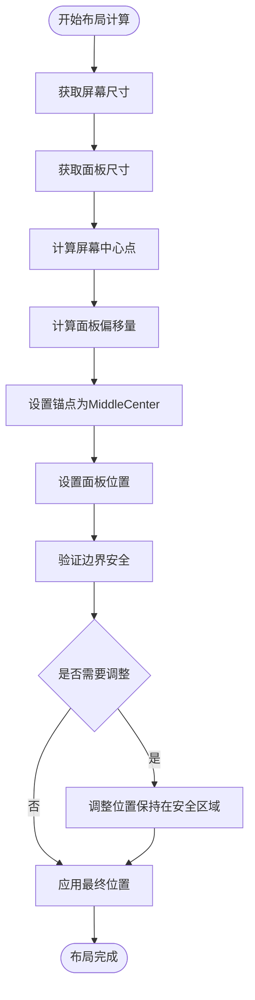

### 多分辨率适配策略

| 分辨率类型 | 范围 | 适配策略 | 缩放因子 |
|-----------|------|---------|----------|
| 低分辨率 | 1024x768 及以下 | 最小化组件，保持核心功能 | 0.8x |
| 标准分辨率 | 1366x768 - 1920x1080 | 标准比例显示 | 1.0x |
| 高分辨率 | 2560x1440 及以上 | 放大显示，保持清晰度 | 1.2x |
| 超宽屏 | 21:9 比例 | 居中显示，两侧留白 | 自适应 |

## 登录注册界面长宽比例优化

### 美学比例设计

根据中国古典美学中的黄金比例原理，结合现代UI设计规范：

| 界面元素 | 推荐比例 | 具体尺寸 | 设计理念 |
|---------|---------|---------|----------|
| 登录面板主体 | 16:10 | 480x300 | 符合视觉黄金比例 |
| 注册面板主体 | 4:3 | 520x390 | 增加垂直空间容纳更多字段 |
| 输入框宽度 | 统一宽度 | 320像素 | 保持视觉一致性 |
| 按钮尺寸 | 3:1 | 120x40 | 易于点击的舒适比例 |

### 中国古典风格融入

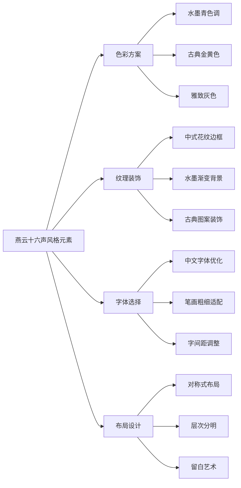

### 视觉层次设计

| 层次等级 | 视觉重要性 | 设计处理 | 具体应用 |
|---------|-----------|---------|----------|
| 主要操作 | 最高 | 突出色彩+较大尺寸 | 登录/注册按钮 |
| 次要操作 | 高 | 中性色彩+标准尺寸 | 切换面板链接 |
| 输入区域 | 中 | 背景色区分+边框 | 用户名密码输入框 |
| 辅助信息 | 低 | 浅色文字+较小字体 | 提示文本、版本信息 |

## 界面切换流程优化

### 状态管理流程重设计

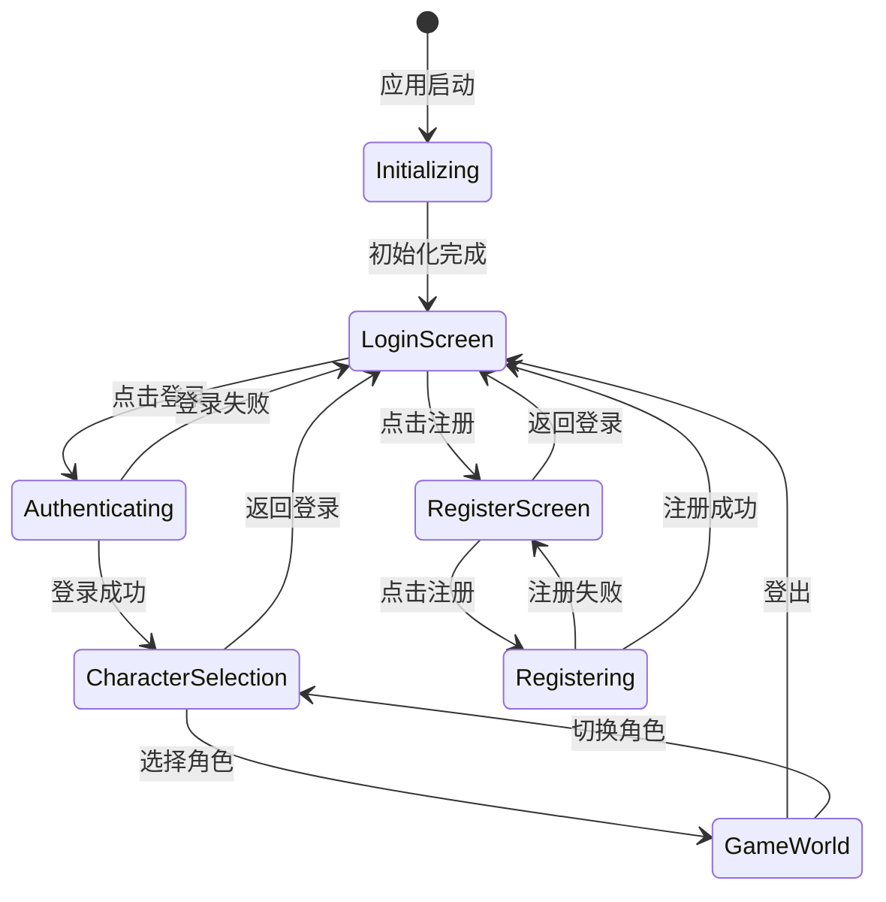

### 场景切换优化机制

| 切换阶段 | 处理内容 | 动画效果 | 时间控制 |
|---------|---------|---------|----------|
| 退出当前场景 | 保存状态、清理资源 | 淡出效果 | 0.3秒 |
| 过渡阶段 | 显示加载提示 | 旋转加载器 | 根据加载时间 |
| 进入新场景 | 初始化界面、加载数据 | 淡入效果 | 0.5秒 |
| 完成切换 | 激活交互、启动动画 | 滑入动画 | 0.2秒 |

### 错误处理与回退机制

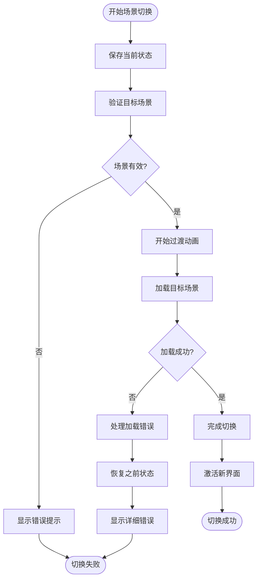

## UI风格设计方案

### 色彩主题系统

借鉴《燕云十六声》的古典美学，融合《魔兽世界》的功能性设计：

| 色彩类型 | 主色调 | RGB值 | 应用场景 |
|---------|--------|-------|----------|
| 主题色 | 墨青色 | (45, 85, 105) | 主要按钮、强调元素 |
| 辅助色 | 古典金 | (205, 165, 85) | 高亮、重要信息 |
| 背景色 | 雅致灰 | (35, 40, 45) | 面板背景、容器 |
| 文字色 | 清雅白 | (245, 245, 245) | 主要文字内容 |
| 警告色 | 朱砂红 | (185, 65, 65) | 错误提示、危险操作 |
| 成功色 | 竹叶青 | (85, 165, 85) | 成功提示、确认操作 |

### 字体与排版系统

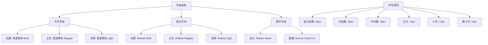

### 组件设计规范

| 组件类型 | 尺寸规范 | 间距规范 | 圆角设计 | 阴影效果 |
|---------|---------|---------|---------|----------|
| 主要按钮 | 120x40px | 外边距16px | 6px圆角 | 轻微阴影 |
| 次要按钮 | 100x36px | 外边距12px | 4px圆角 | 无阴影 |
| 输入框 | 320x36px | 外边距8px | 4px圆角 | 内阴影 |
| 面板容器 | 最小480px宽 | 内边距24px | 8px圆角 | 深度阴影 |
| 对话框 | 最小320px宽 | 内边距20px | 6px圆角 | 明显阴影 |

## 动画与交互设计

### 动画效果系统

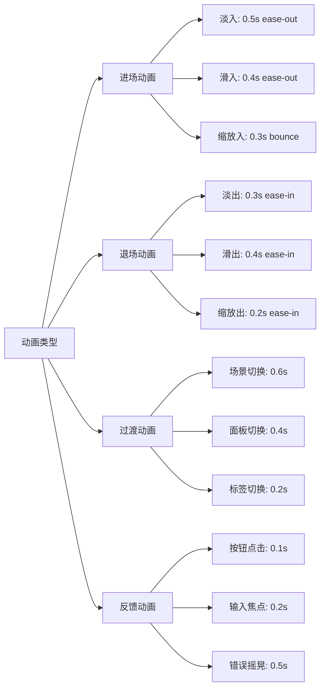

### 交互反馈机制

| 交互类型 | 视觉反馈 | 音效反馈 | 触觉反馈 |
|---------|---------|---------|----------|
| 按钮点击 | 按下状态+颜色变化 | 清脆点击音 | 轻微震动 |
| 输入聚焦 | 边框高亮+内阴影 | 轻柔提示音 | 无 |
| 错误提示 | 红色闪烁+摇晃动画 | 警告音效 | 强震动 |
| 成功确认 | 绿色闪烁+缩放动画 | 成功音效 | 轻震动 |
| 加载状态 | 旋转动画+进度指示 | 循环音效 | 无 |

### 用户引导系统

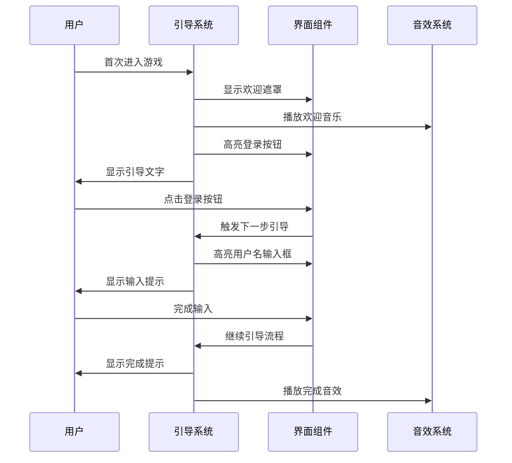

## 音效集成方案

### 音效分类与应用

| 音效类别 | 触发场景 | 音效特征 | 文件格式 |
|---------|---------|---------|----------|
| UI点击音 | 按钮点击、选项选择 | 清脆短促 | OGG/WAV |
| 提示音 | 消息通知、状态变化 | 柔和悦耳 | OGG |
| 警告音 | 错误提示、警告信息 | 急促醒目 | WAV |
| 背景音乐 | 界面背景、场景氛围 | 循环播放 | OGG |
| 过渡音效 | 场景切换、动画配合 | 流畅自然 | WAV |

### 音效播放策略

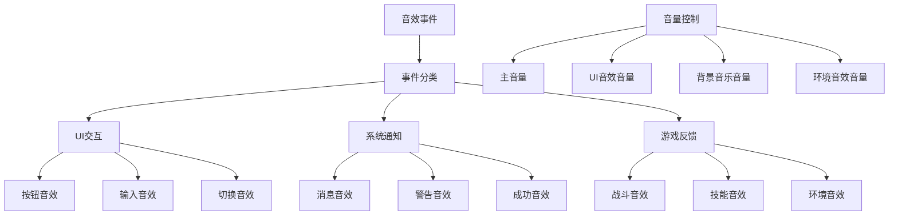

## 组件化架构设计

### 核心组件库

| 组件名称 | 功能描述 | 复用场景 | 配置参数 |
|---------|---------|---------|----------|
| ResponsivePanel | 响应式面板容器 | 所有对话框和表单 | 尺寸、锚点、背景 |
| CenteredDialog | 居中对话框基类 | 登录、注册、确认对话框 | 标题、内容、按钮 |
| StyledButton | 风格化按钮组件 | 所有按钮元素 | 类型、尺寸、状态 |
| ValidatedInput | 带验证的输入框 | 表单输入字段 | 验证规则、格式化 |
| LoadingSpinner | 加载指示器 | 异步操作提示 | 尺寸、颜色、文本 |
| ToastNotification | 消息提示组件 | 操作反馈 | 类型、持续时间、位置 |

### 组件继承体系

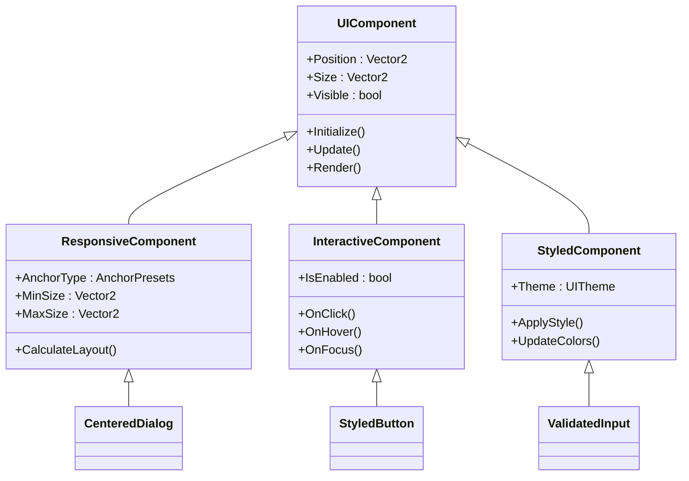

## 实施方案

### 阶段性实施计划

| 阶段 | 实施内容 | 预期成果 | 时间安排 |
|------|---------|---------|----------|
| 第一阶段 | 布局居中系统重构 | 所有弹窗正确居中显示 | 1-2周 |
| 第二阶段 | 长宽比例优化 | 界面元素比例协调美观 | 1周 |
| 第三阶段 | 状态管理重构 | 界面切换流畅无异常 | 2周 |
| 第四阶段 | 风格主题应用 | 融入中国古典美学元素 | 2-3周 |
| 第五阶段 | 动画音效集成 | 完整的交互体验 | 1-2周 |

### 核心修复策略

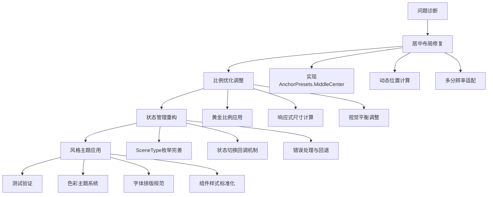

### 关键技术要点

| 技术要点 | 实现方法 | 预期效果 |
|---------|---------|----------|
| 动态居中计算 | 基于屏幕尺寸的实时计算 | 任何分辨率下都能正确居中 |
| 响应式布局 | 百分比布局+最小最大尺寸限制 | 适配不同屏幕尺寸 |
| 状态管理优化 | 事件驱动的状态机模式 | 界面切换流畅可靠 |
| 主题系统 | 可配置的颜色和样式方案 | 统一的视觉风格 |
| 动画集成 | 基于时间轴的缓动动画 | 流畅的过渡效果 |

## 质量保证

### 测试策略

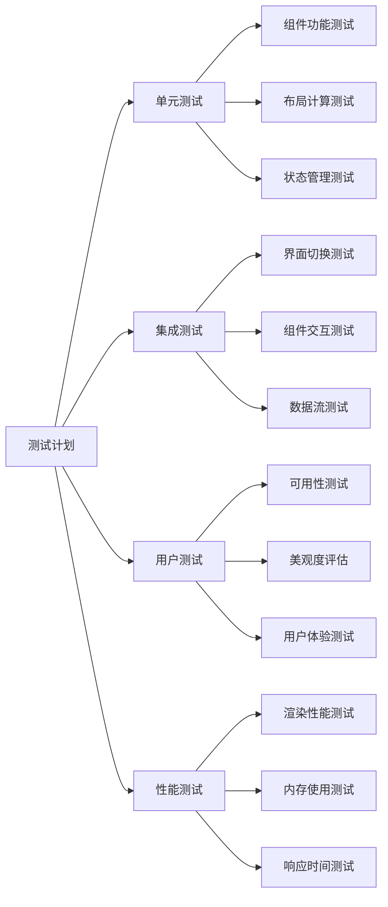

### 验收标准

| 验收项目 | 标准要求 | 测试方法 |
|---------|---------|----------|
| 界面居中 | 所有弹窗在任何分辨率下都完美居中 | 多分辨率测试 |
| 比例协调 | 界面元素符合黄金比例，视觉平衡 | 设计评审 |
| 切换流畅 | 界面切换无卡顿，成功率100% | 压力测试 |
| 风格一致 | 所有界面遵循中国古典美学风格 | 视觉审核 |
| 性能稳定 | 帧率稳定在60FPS以上 | 性能监控 |

### 维护与扩展

| 维护类型 | 维护内容 | 更新频率 |
|---------|---------|----------|
| 日常维护 | 组件状态检查、性能监控 | 每日 |
| 功能维护 | 新功能集成、组件扩展 | 每周 |
| 美学维护 | 视觉效果优化、主题更新 | 每月 |
| 架构维护 | 系统重构、技术升级 | 每季度 |
    
