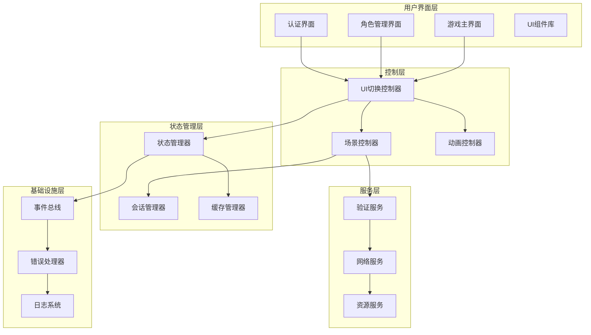
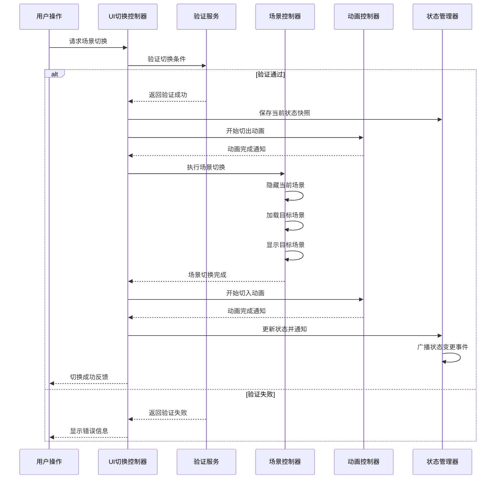
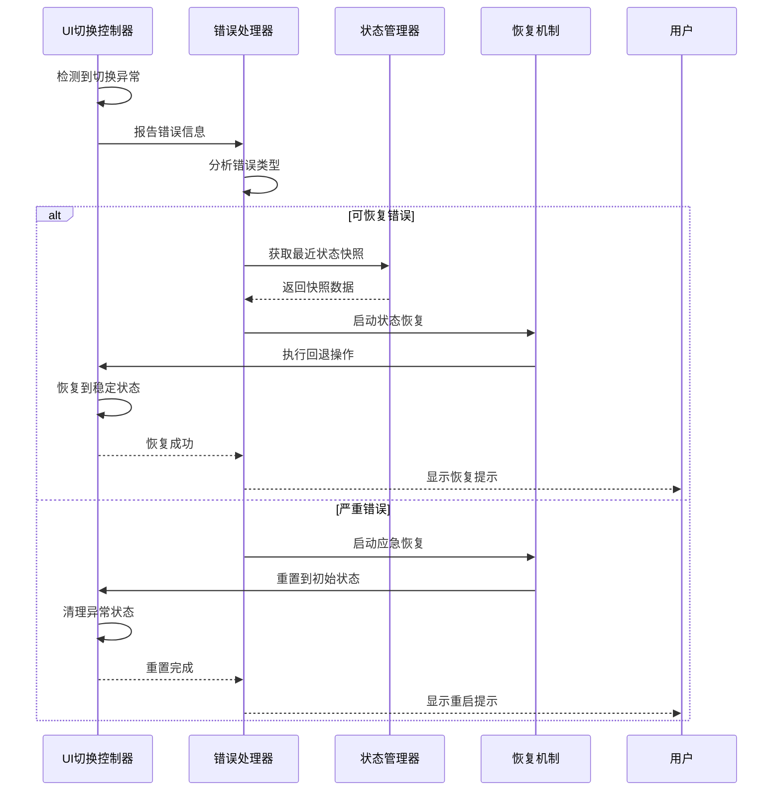
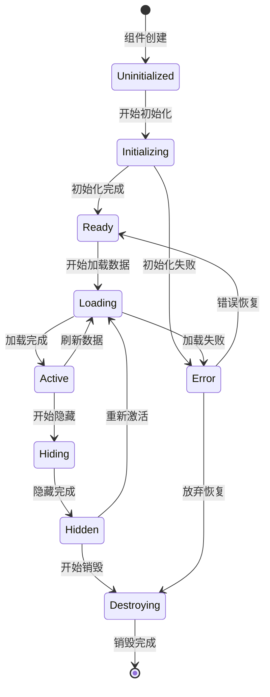

# UI切换逻辑重构设计文档

## 概述

本文档描述了HundunWorld游戏UI切换逻辑的全面重构方案。当前系统存在场景切换不稳定、状态管理混乱、UI组件耦合度高等问题，需要重新设计UI架构以提供稳定、可扩展的界面切换机制。

## 现状分析

### 当前问题

#### 1. 架构层面问题
- **状态管理分散**: UIStateManager、UISceneManager、MainUIManager职责重叠且耦合严重
- **场景切换逻辑不一致**: 各管理器实现切换逻辑不统一，导致状态同步问题
- **事件传递混乱**: 多个组件同时监听和触发场景切换事件，造成事件循环
- **错误处理机制不完善**: 切换失败时缺乏有效的回退和恢复机制

#### 2. 技术实现问题
- **UI生命周期管理不规范**: 组件创建、显示、隐藏、销毁流程不统一
- **资源管理缺失**: UI组件资源分配和释放缺乏统一管理
- **异步操作处理不当**: 场景切换过程中的异步加载缺乏同步机制
- **性能优化不足**: 频繁的UI创建销毁影响性能

#### 3. 用户体验问题
- **切换不流畅**: 场景转换缺乏过渡动画和状态反馈
- **错误提示不友好**: 切换失败时用户得不到明确的错误信息
- **状态恢复能力差**: 异常情况下无法自动恢复到稳定状态

## 重构目标

### 架构目标
- **单一职责**: 每个管理器负责明确的功能领域，避免职责重叠
- **低耦合高内聚**: 组件间通过标准接口通信，降低依赖关系
- **状态一致性**: 建立统一的状态管理机制，确保数据同步
- **可扩展性**: 支持新场景和UI组件的便捷接入

### 技术目标
- **稳定性**: 提供99%的切换成功率，具备完善的错误处理
- **性能优化**: 场景切换响应时间控制在200ms以内
- **资源管理**: 建立完整的UI资源生命周期管理
- **异步处理**: 优化异步加载和状态同步机制

### 用户体验目标
- **流畅切换**: 所有场景转换都具备平滑的过渡动画
- **即时反馈**: 提供实时的加载状态和进度提示
- **智能恢复**: 异常情况下自动恢复到最近的稳定状态

## 核心架构设计

### 系统架构概述



### 核心组件定义

#### 1. UI切换控制器 (UISwitchController)

**职责范围**
- 统一管理所有UI场景的切换操作
- 协调各子控制器完成复杂的切换流程
- 提供标准化的切换接口和状态反馈

**核心功能**
- 场景切换编排与执行
- 切换条件验证与权限检查
- 切换过程监控与异常处理
- 切换历史记录与状态回退

#### 2. 场景控制器 (SceneController)

**职责范围**
- 管理场景的生命周期状态
- 执行场景间的数据传递
- 处理场景切换的业务逻辑

**核心功能**
- 场景状态跟踪与维护
- 场景间数据传递与验证
- 场景激活与去激活管理
- 业务规则验证与执行

#### 3. 动画控制器 (AnimationController)

**职责范围**
- 管理UI切换过程中的动画效果
- 提供标准化的动画播放接口
- 确保动画与场景切换的同步

**核心功能**
- 切换动画的编排与执行
- 动画效果的配置与管理
- 动画播放状态的监控
- 动画资源的优化管理

#### 4. 统一状态管理器 (StateManager)

**职责范围**
- 维护全局UI状态的一致性
- 提供状态变更的通知机制
- 管理状态的持久化与恢复

**核心功能**
- 全局状态的集中管理
- 状态变更事件的分发
- 状态快照的创建与恢复
- 状态同步的保障机制

## 场景切换流程设计

### 标准切换流程



### 错误处理与恢复流程



## 状态管理设计

### 状态模型定义

```mermaid
classDiagram
    class UIState {
        +SceneType currentScene
        +SceneType previousScene
        +boolean isTransitioning
        +string transitionId
        +Map~string,object~ sceneData
        +UserSession userSession
        +List~CharacterInfo~ characters
        +timestamp lastUpdateTime
    }
    
    class SceneState {
        +SceneType sceneType
        +boolean isActive
        +boolean isLoaded
        +Map~string,object~ localData
        +List~string~ requiredPermissions
        +timestamp activatedTime
    }
    
    class TransitionState {
        +string transitionId
        +SceneType fromScene
        +SceneType toScene
        +TransitionPhase currentPhase
        +float progress
        +string errorMessage
        +timestamp startTime
    }
    
    class StateSnapshot {
        +string snapshotId
        +UIState uiState
        +Map~SceneType,SceneState~ sceneStates
        +timestamp createdTime
        +string description
    }
    
    UIState ||--o{ SceneState : contains
    UIState ||--|| TransitionState : current
    StateSnapshot ||--|| UIState : captures
```

### 状态同步机制

#### 1. 事件驱动模式
- **状态变更事件**: 任何状态修改都通过事件总线广播
- **订阅机制**: UI组件按需订阅关心的状态变更事件
- **事件过滤**: 支持基于条件的事件过滤，减少不必要的通知

#### 2. 状态快照管理
- **自动快照**: 在关键操作前自动创建状态快照
- **手动快照**: 支持用户或系统手动创建命名快照
- **快照恢复**: 异常情况下可快速恢复到历史快照

#### 3. 数据一致性保障
- **原子操作**: 状态变更操作具备原子性，避免部分更新
- **版本控制**: 状态数据具备版本标识，支持冲突检测
- **锁机制**: 关键状态变更期间防止并发修改

## UI组件生命周期管理

### 生命周期阶段定义



### 生命周期管理策略

#### 1. 资源管理
- **懒加载**: 组件在首次需要时才进行初始化
- **预加载**: 预测用户行为，提前加载可能用到的组件
- **资源池**: 复用频繁使用的UI组件，减少创建销毁开销
- **内存监控**: 实时监控UI组件的内存使用情况

#### 2. 状态持久化
- **组件状态**: 保存组件的用户交互状态和显示状态
- **数据缓存**: 缓存组件所需的业务数据，避免重复加载
- **用户偏好**: 记住用户的界面设置和操作习惯

#### 3. 异常处理
- **优雅降级**: 组件异常时提供基础功能，而非完全失效
- **自动恢复**: 临时性错误时自动重试初始化
- **错误报告**: 详细记录组件异常信息，便于问题诊断

## 动画系统设计

### 动画类型分类

#### 1. 场景切换动画
- **淡入淡出**: 适用于简单的场景过渡
- **滑动切换**: 提供方向感的场景转换
- **缩放过渡**: 强调层级关系的场景切换
- **自定义动画**: 支持业务特定的复杂过渡效果

#### 2. 状态反馈动画
- **加载动画**: 显示数据加载和处理进度
- **成功反馈**: 操作成功的视觉确认
- **错误提示**: 错误状态的明显视觉反馈
- **用户引导**: 引导用户操作的动画提示

#### 3. 交互增强动画
- **悬停效果**: 鼠标悬停时的视觉反馈
- **点击反馈**: 按钮点击的即时响应动画
- **拖拽动画**: 拖拽操作的视觉跟随效果
- **手势动画**: 触摸手势的动画反馈

### 动画配置管理

```mermaid
classDiagram
    class AnimationConfig {
        +string animationId
        +AnimationType type
        +int duration
        +EasingFunction easing
        +Map~string,object~ parameters
        +boolean canSkip
        +int priority
    }
    
    class AnimationSequence {
        +string sequenceId
        +List~AnimationStep~ steps
        +boolean isParallel
        +int totalDuration
        +function onComplete
    }
    
    class AnimationStep {
        +AnimationConfig config
        +int delay
        +string target
        +Map~string,object~ fromValues
        +Map~string,object~ toValues
    }
    
    class AnimationManager {
        +playAnimation(config)
        +playSequence(sequence)
        +pauseAnimation(id)
        +stopAnimation(id)
        +getAnimationState(id)
    }
    
    AnimationSequence ||--o{ AnimationStep : contains
    AnimationStep ||--|| AnimationConfig : uses
    AnimationManager ..> AnimationConfig : manages
    AnimationManager ..> AnimationSequence : executes
```

## 错误处理与恢复机制

### 错误分类与处理策略

#### 1. 网络错误
- **超时错误**: 自动重试机制，提供用户手动重试选项
- **连接错误**: 显示网络状态，提供离线模式或重连功能
- **服务错误**: 根据错误码提供具体的错误信息和解决建议

#### 2. 业务逻辑错误
- **权限错误**: 引导用户到权限设置或登录界面
- **数据验证错误**: 明确指出数据问题，提供修正建议
- **状态冲突错误**: 自动刷新状态或引导用户手动处理

#### 3. 系统错误
- **内存不足**: 清理缓存，关闭非必要组件
- **资源加载失败**: 降级显示，提供重新加载选项
- **组件异常**: 重置组件状态，必要时重新创建

### 智能恢复策略

#### 1. 自动恢复机制
- **状态回滚**: 失败时自动回退到最近的稳定状态
- **数据重载**: 数据异常时自动重新加载
- **组件重置**: 组件异常时自动重新初始化

#### 2. 用户引导恢复
- **友好提示**: 用简洁明了的语言说明错误和解决方案
- **操作建议**: 提供具体的用户操作步骤
- **联系支持**: 严重错误时提供技术支持联系方式

#### 3. 系统监控与预警
- **性能监控**: 实时监控UI系统的性能指标
- **异常检测**: 自动检测可能导致问题的异常情况
- **预防措施**: 在问题发生前采取预防性措施

## 性能优化策略

### 渲染优化

#### 1. UI组件优化
- **虚拟化渲染**: 大列表使用虚拟滚动，只渲染可见项
- **组件复用**: 建立UI组件对象池，避免频繁创建销毁
- **懒渲染**: 非关键UI组件延迟渲染，优化初始加载速度
- **批量更新**: 将多个UI更新操作合并为单次渲染

#### 2. 动画优化
- **硬件加速**: 利用GPU加速复杂的动画效果
- **动画池**: 复用动画对象，减少内存分配
- **帧率控制**: 根据设备性能动态调整动画帧率
- **动画压缩**: 对相似动画进行合并和压缩

#### 3. 资源优化
- **图片压缩**: 使用适当的图片格式和压缩率
- **字体优化**: 只加载使用到的字体字符集
- **纹理管理**: 智能管理纹理内存，及时释放未使用资源
- **资源预加载**: 预测性加载即将使用的资源

### 内存管理

#### 1. 内存监控
- **使用量跟踪**: 实时监控UI系统的内存使用情况
- **内存泄漏检测**: 自动检测潜在的内存泄漏问题
- **峰值预警**: 内存使用接近限制时发出预警

#### 2. 内存优化
- **智能缓存**: 根据使用频率和内存压力动态调整缓存策略
- **定期清理**: 定时清理不再使用的UI对象和数据
- **内存池**: 使用内存池技术减少内存分配开销

### 网络优化

#### 1. 请求优化
- **请求合并**: 将多个小请求合并为大请求
- **缓存策略**: 智能缓存网络响应数据
- **增量更新**: 只传输变更的数据部分

#### 2. 数据压缩
- **传输压缩**: 对网络传输的数据进行压缩
- **数据去重**: 避免传输重复的数据
- **格式优化**: 使用高效的数据序列化格式

## 测试策略

### 单元测试

#### 1. 状态管理测试
- **状态一致性测试**: 验证状态变更的正确性
- **并发安全测试**: 测试多线程环境下的状态管理
- **状态快照测试**: 验证状态快照和恢复功能

#### 2. 组件生命周期测试
- **初始化测试**: 验证组件正确初始化
- **状态转换测试**: 验证生命周期状态转换
- **资源清理测试**: 验证组件销毁时的资源清理

#### 3. 错误处理测试
- **异常情况模拟**: 模拟各种异常情况
- **恢复机制测试**: 验证错误恢复功能
- **用户体验测试**: 验证错误提示的友好性

### 集成测试

#### 1. 场景切换测试
- **完整流程测试**: 测试完整的场景切换流程
- **边界条件测试**: 测试各种边界情况
- **性能测试**: 测试场景切换的性能表现

#### 2. 跨组件通信测试
- **事件传递测试**: 验证组件间事件传递的准确性和时序
- **数据同步测试**: 验证跨组件数据同步的一致性
- **依赖注入测试**: 验证组件依赖关系的正确性

#### 3. 用户交互测试
- **操作响应测试**: 验证用户操作的响应速度和准确性
- **并发操作测试**: 测试用户快速连续操作的处理
- **异常输入测试**: 验证对异常用户输入的处理

### 性能测试

#### 1. 响应时间测试
- **场景切换时间**: 确保切换时间在200ms内
- **动画流畅度**: 验证动画帧率稳定在60fps
- **内存使用**: 监控内存使用峰值和平均值

#### 2. 压力测试
- **频繁切换测试**: 模拟用户频繁切换场景
- **长时间运行测试**: 验证系统长时间运行的稳定性
- **资源泄漏测试**: 检测潜在的资源泄漏问题

### 用户验收测试

#### 1. 可用性测试
- **操作直观性**: 验证UI操作的直观性和易用性
- **错误提示清晰性**: 验证错误信息的清晰度
- **帮助文档完整性**: 验证帮助文档的完整性和准确性

#### 2. 兼容性测试
- **设备兼容性**: 测试不同设备上的表现
- **分辨率适配**: 验证不同分辨率下的UI适配
- **性能差异**: 测试不同性能设备上的表现差异

## 实施计划

### 阶段1: 核心架构重构 (2周)

#### 第1周: 状态管理系统
- 重新设计UIStateManager，明确单一职责
- 实现统一的状态模型和事件系统
- 建立状态快照和恢复机制
- 完成核心状态管理功能的单元测试

#### 第2周: 切换控制系统
- 实现UISwitchController作为统一入口
- 重构SceneController负责场景生命周期
- 集成动画控制器提供流畅过渡
- 完成切换控制系统的集成测试

### 阶段2: UI组件重构 (2周)

#### 第3周: 认证模块重构
- 重构AuthenticationUI组件，简化职责
- 优化AuthenticationManager的错误处理
- 实现标准化的组件生命周期管理
- 完成认证模块的功能测试

#### 第4周: 角色管理模块
- 重构CharacterManagementUI组件
- 优化角色数据的加载和缓存机制
- 实现角色选择和创建的流畅切换
- 完成角色管理模块的集成测试

### 阶段3: 性能优化与测试 (1周)

#### 第5周: 系统优化与验证
- 实施性能优化策略
- 执行完整的系统集成测试
- 进行用户验收测试
- 修复发现的问题并完善文档

## 技术规格

### 架构约束

#### 1. 设计原则
- **单一职责原则**: 每个组件只负责一个明确的功能
- **开闭原则**: 对扩展开放，对修改封闭
- **依赖倒置原则**: 依赖抽象而非具体实现
- **接口隔离原则**: 使用细粒度的接口定义

#### 2. 通信模式
- **事件驱动**: 组件间通过事件进行解耦通信
- **消息传递**: 使用标准化的消息格式
- **观察者模式**: 状态变更通过观察者模式通知
- **发布订阅**: 支持细粒度的事件订阅机制

#### 3. 状态管理约束
- **不可变状态**: 状态对象实现不可变性
- **原子操作**: 状态变更具备原子性
- **事务支持**: 复杂状态变更支持事务机制
- **版本控制**: 状态数据具备版本标识

### 性能指标

#### 1. 响应时间要求
- 场景切换完成时间: ≤ 200ms
- 用户操作响应时间: ≤ 100ms
- 动画播放帧率: ≥ 60fps
- 网络请求超时: ≤ 5000ms

#### 2. 资源使用限制
- UI系统内存占用: ≤ 256MB
- 纹理内存使用: ≤ 128MB
- CPU占用率: ≤ 15%
- 网络带宽使用: ≤ 1MB/s

#### 3. 稳定性指标
- 场景切换成功率: ≥ 99%
- 系统无响应概率: ≤ 0.1%
- 内存泄漏检测: 零容忍
- 崩溃率: ≤ 0.01%

### 兼容性要求

#### 1. 引擎兼容性
- Flax Engine版本: 1.7+
- C# .NET版本: .NET 6.0+
- 图形API: DirectX 11/12, OpenGL 4.5+
- 操作系统: Windows 10+, macOS 10.15+, Linux Ubuntu 20.04+

#### 2. 硬件兼容性
- 最低内存要求: 4GB RAM
- 显存要求: 1GB VRAM
- CPU要求: 双核2.5GHz+
- 存储要求: 100MB可用空间

## 风险评估与应对

### 技术风险

#### 1. 架构重构风险
- **风险**: 大规模重构可能导致功能回归
- **应对**: 采用渐进式重构，保持向后兼容
- **监控**: 建立完整的自动化测试覆盖

#### 2. 性能回归风险
- **风险**: 新架构可能影响现有性能
- **应对**: 建立性能基准测试，持续监控
- **监控**: 实时性能监控和预警机制

#### 3. 兼容性风险
- **风险**: 新架构可能破坏现有集成
- **应对**: 维护清晰的API契约和版本管理
- **监控**: 兼容性测试和集成验证

### 项目风险

#### 1. 时间风险
- **风险**: 重构复杂度超出预期
- **应对**: 合理分解任务，设置里程碑
- **监控**: 每日进度跟踪和风险评估

#### 2. 资源风险
- **风险**: 开发资源不足或分配不当
- **应对**: 合理规划资源，准备应急方案
- **监控**: 资源使用情况跟踪

#### 3. 质量风险
- **风险**: 赶进度可能影响代码质量
- **应对**: 坚持代码审查和测试标准
- **监控**: 代码质量指标和技术债务跟踪

### 业务风险

#### 1. 用户体验风险
- **风险**: 重构过程中用户体验下降
- **应对**: 灰度发布和快速回退机制
- **监控**: 用户反馈收集和分析

#### 2. 功能缺失风险
- **风险**: 重构可能遗漏现有功能
- **应对**: 详细的功能清单和验收标准
- **监控**: 功能完整性检查

## 成功标准

### 技术成功标准

#### 1. 架构质量
- 组件职责清晰，耦合度显著降低
- 代码可维护性和可扩展性明显提升
- 技术债务减少，代码质量得到改善

#### 2. 性能表现
- 场景切换时间稳定在200ms以内
- 内存使用优化，无明显内存泄漏
- 系统响应性和稳定性显著提升

#### 3. 开发效率
- 新功能开发效率提升30%以上
- 问题定位和修复时间缩短50%
- 代码复用率提升，重复开发减少

### 用户体验成功标准

#### 1. 操作流畅性
- 所有界面切换提供平滑过渡动画
- 用户操作得到即时反馈
- 加载状态和进度得到清晰显示

#### 2. 错误处理
- 错误信息友好且具有指导性
- 异常情况下能自动恢复
- 用户很少遇到系统异常中断

#### 3. 整体满意度
- 用户界面响应速度满意度>90%
- 功能完整性满意度>95%
- 整体使用体验满意度>90%

### 项目交付成功标准

#### 1. 交付质量
- 所有功能通过验收测试
- 性能指标达到设计要求
- 文档完整且准确

#### 2. 时间控制
- 按计划完成各阶段里程碑
- 总体项目延期不超过10%
- 关键路径任务按时完成

#### 3. 团队能力
- 团队成员掌握新架构设计
- 建立完善的开发和维护流程
- 具备独立扩展和优化能力