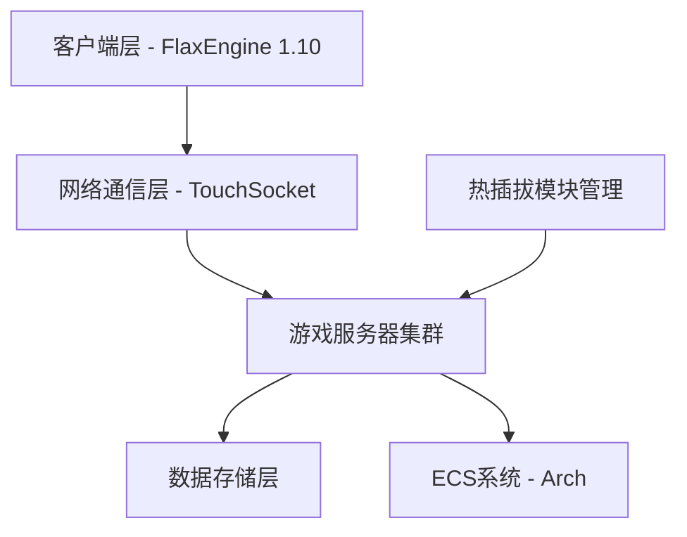
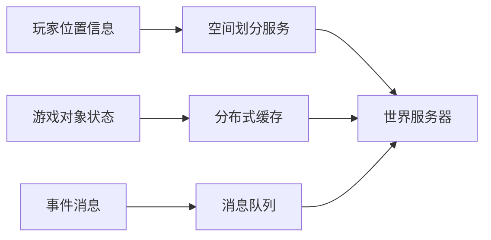
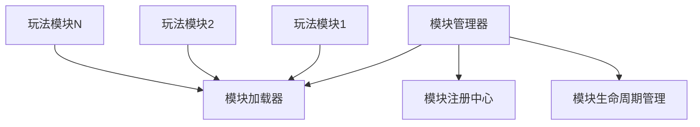
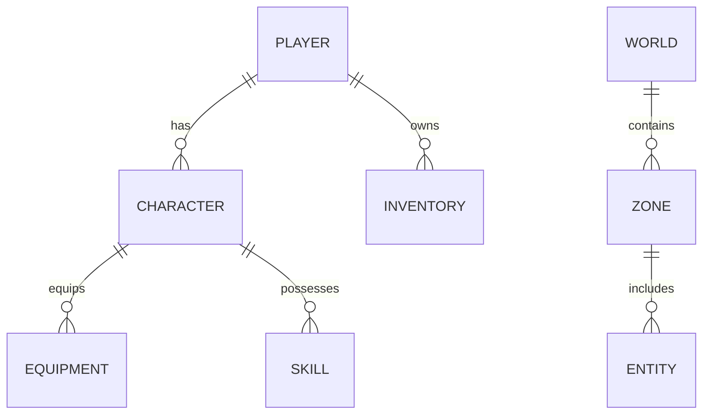
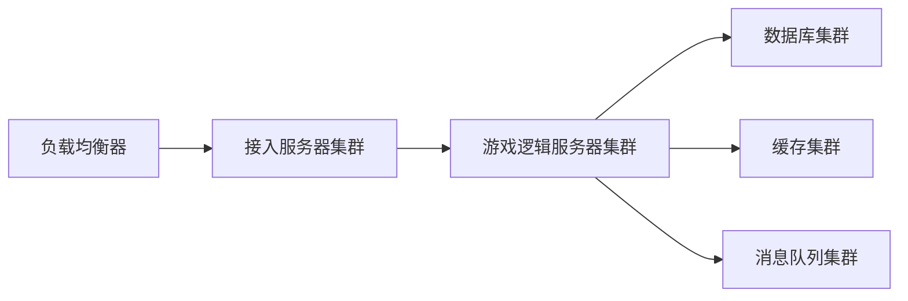

# 支持百万级并发在线用户的统一游戏世界设计方案

## 1. 概述

本设计方案旨在构建一个支持百万级并发在线用户的统一游戏世界，借鉴《燕云十六声》的核心玩法，打造中国风武侠仙侠世界。系统采用FlaxEngine 1.10作为游戏客户端引擎，使用C#技术栈，结合TouchSocket + MemoryPacket作为网络通信基础，并利用Arch的ECS系统解耦客户端所有操作以提升性能。

主要设计目标包括：
- 实现无分区、无分服的统一游戏世界
- 支持热插拔式玩法模块，便于新玩法快速集成和旧玩法下线
- 确保系统的高可用性、可扩展性和高性能

## 2. 系统架构

### 2.1 整体架构



### 2.2 客户端架构

客户端基于FlaxEngine 1.10构建，采用组件化架构设计：
- 使用C#作为主要开发语言
- 利用Arch ECS系统解耦所有客户端操作，提升性能
- 实现现代化的游戏渲染和交互体验

### 2.3 服务器架构

服务器采用分布式集群架构以支持百万级并发：
- 使用TouchSocket + MemoryPacket作为网络通信基础
- 实现无状态游戏服务器，便于水平扩展
- 采用区域服务器和全局服务器相结合的方式处理不同类型的业务

## 3. 核心技术选型

### 3.1 游戏引擎 - FlaxEngine 1.10

FlaxEngine是一个现代化的3D游戏引擎，支持C#脚本开发，具有以下优势：
- 高性能渲染管线
- 组件化架构设计
- 跨平台支持
- 优秀的开发工具链

### 3.2 ECS系统 - Arch

Arch是一个高性能的ECS(Entity-Component-System)框架，用于：
- 解耦客户端所有操作，提升代码可维护性
- 优化CPU缓存使用，提高运行性能
- 支持多线程处理，充分利用硬件资源

### 3.3 网络通信 - TouchSocket + MemoryPacket

TouchSocket是一个集成的.NET网络框架，具有以下特点：
- 支持多种网络协议(TCP, UDP, HTTP, WebSocket等)
- 高性能异步通信，支持海量并发连接
- 轻量级设计，最小化依赖包
- MemoryPacket提供高效的数据包处理能力

## 4. 统一游戏世界实现

### 4.1 无分区无分服架构

为实现真正的统一游戏世界，采用以下技术方案：
- 全局实体ID管理，确保唯一性
- 分布式状态同步机制
- 实时位置服务和空间划分算法
- 动态负载均衡策略

### 4.2 世界状态管理



## 5. 热插拔玩法模块系统

### 5.1 模块化设计原则

- 每个玩法模块独立封装，具有完整的生命周期管理
- 模块间通过标准接口进行通信
- 支持运行时动态加载和卸载

### 5.2 模块管理架构



## 6. 高并发服务器设计

### 6.1 服务器集群架构

为支持百万级并发用户，服务器采用以下架构：
- 接入服务器：处理用户连接和认证
- 游戏逻辑服务器：处理具体游戏业务逻辑
- 数据库服务器：存储持久化数据
- 缓存服务器：提供高速数据访问
- 消息队列：处理异步消息传递

### 6.2 性能优化策略

- 使用异步非阻塞IO模型
- 实现对象池减少GC压力
- 采用数据分片和读写分离
- 利用分布式缓存提升访问速度
- 实施智能负载均衡算法

## 7. 数据模型设计

### 7.1 核心实体关系



### 7.2 数据分布策略

- 玩家数据：按玩家ID分片存储
- 世界数据：按区域划分存储
- 日志数据：按时间分片存储

## 8. 安全性设计

### 8.1 通信安全

- 实现数据加密传输
- 使用安全的身份认证机制
- 防止DDoS攻击的流量控制

### 8.2 数据安全

- 敏感数据加密存储
- 定期数据备份策略
- 访问权限控制机制

## 9. 可扩展性设计

### 9.1 水平扩展能力

- 无状态服务设计，便于添加新节点
- 微服务架构，各模块可独立扩展
- 容器化部署，支持快速扩容

### 9.2 功能扩展能力

- 插件化架构支持新功能模块
- 配置驱动的业务逻辑
- 标准化API接口设计

## 10. 部署架构

### 10.1 物理部署



### 10.2 监控与运维

- 实时性能监控
- 自动故障检测与恢复
- 日志收集与分析系统
- 自动化部署与升级

## 11. 原型开发实施计划

### 11.1 开发目标

现在直接进入原型开发编码工作，我们将按照以下目标进行开发：
1. 实现FlaxEngine客户端与网关的基础连接
2. 集成Arch ECS系统并实现基础组件与系统
3. 实现热插拔模块管理机制
4. 实现统一游戏世界的基础功能

### 11.2 开发任务分解

#### 11.2.1 网络通信模块开发

- 创建客户端网络连接管理器
- 实现消息序列化与反序列化机制
- 开发断线重连功能
- 实现基础消息收发功能

#### 11.2.2 ECS系统集成

- 集成Arch ECS框架到项目中
- 实现基础组件定义（位置、速度等）
- 创建基础系统（移动系统、渲染系统等）
- 实现实体管理机制

#### 11.2.3 热插拔模块机制

- 实现模块加载与卸载功能
- 开发模块生命周期管理器
- 实现模块间通信接口
- 开发模块热重载机制

#### 11.2.4 统一世界功能

- 实现世界状态同步机制
- 开发玩家位置更新功能
- 实现游戏事件广播机制
- 开发基础的世界数据管理

### 11.3 开发环境配置

#### 11.3.1 客户端开发环境

- FlaxEngine 1.10
- .NET 9.0 SDK
- Arch ECS 框架
- TouchSocket 网络库
- MemoryPacket 数据包处理库
- Visual Studio 2026 

#### 11.3.2 服务端环境

- 已有的基于TouchSocket的网关系统
- 基础的游戏服务器
- 数据库与缓存服务

### 11.4 开发时间安排

| 周次 | 开发内容 | 交付物 |
|------|----------|--------|
| 第1周 | 网络通信模块开发 | 可连接网关的客户端 |
| 第2周 | ECS系统集成 | 包含基础系统的客户端 |
| 第3周 | 热插拔模块机制实现 | 支持模块热插拔的客户端 |
| 第4周 | 统一世界功能实现 | 完整的原型系统 |

### 11.5 代码结构规划

```
HundunWorld/Source/
├── Game/
│   ├── Network/
│   │   ├── NetworkManager.cs
│   │   ├── MessageSerializer.cs
│   │   └── GatewayConnector.cs
│   ├── ECS/
│   │   ├── Components/
│   │   │   ├── PositionComponent.cs
│   │   │   └── VelocityComponent.cs
│   │   ├── Systems/
│   │   │   ├── MovementSystem.cs
│   │   │   └── RenderingSystem.cs
│   │   └── ECSManager.cs
│   ├── Modules/
│   │   ├── ModuleManager.cs
│   │   ├── IGameModule.cs
│   │   └── BaseModule.cs
│   ├── World/
│   │   ├── WorldManager.cs
│   │   ├── WorldState.cs
│   │   └── EntityManager.cs
│   ├── Game.Build.cs
│   ├── ExitOnEsc.cs
│   └── FreeCamera.cs
├── Game.csproj
└── Game.Gen.cs
```

### 11.6 开发规范

1. **代码规范**：
   - 遵循C#编码规范
   - 使用清晰的命名约定
   - 添加必要的代码注释

2. **版本控制**：
   - 使用Git进行版本管理
   - 遵循Git Flow工作流
   - 定期提交代码并编写清晰的提交信息

3. **测试要求**：
   - 编写单元测试验证核心功能
   - 进行集成测试确保模块协同工作
   - 定期进行性能测试