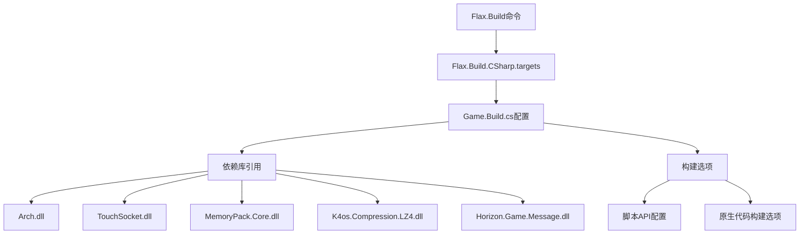
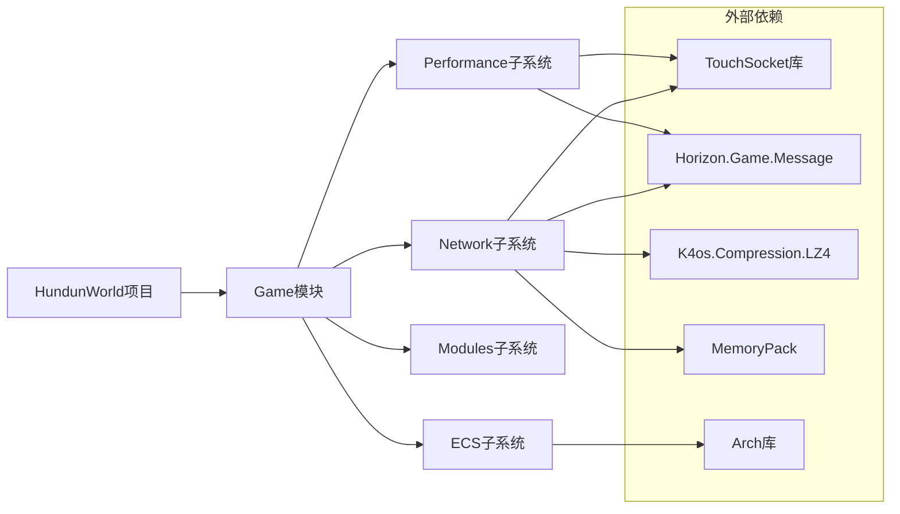
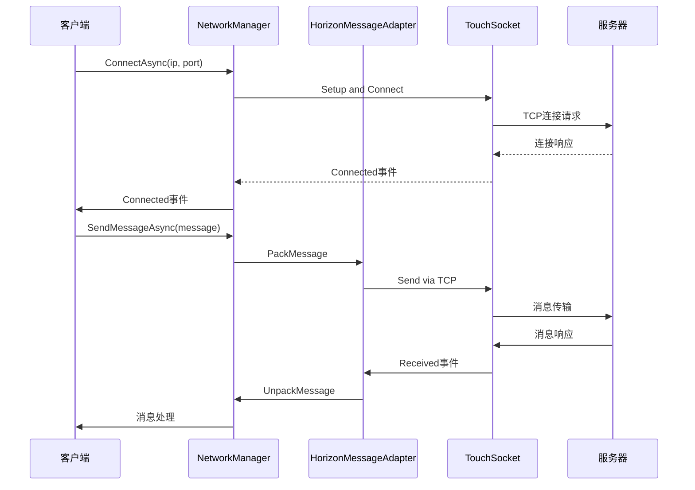
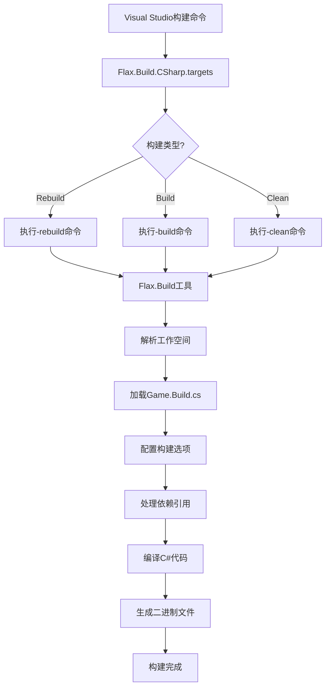

# Flax项目构建错误分析与解决方案

## 1. 概述

## 2. 错误分析

## 3. 项目架构分析

## 4. 解决方案

## 5. 实施步骤

## 6. 预防措施

## 7. 技术架构图



## 8. 项目依赖关系图



## 9. 网络系统架构图



## 1. 概述

本文档旨在分析和解决在构建Flax项目时遇到的MSB3073错误。该错误发生在执行以下命令时：
```
"D:\Program Files (x86)\Flax\Flax_1.10\Binaries\Tools\Flax.Build" -log -mutex -workspace="D:\Long\FlaxProjcts\HundunWorld" -arch=x64 -configuration=Debug -platform=Windows -buildTargets=GameEditorTarget -rebuild
```

## 2. 错误分析

### 2.1 错误详情
- **错误代码**: MSB3073
- **项目**: Game
- **文件**: D:\Long\FlaxProjcts\HundunWorld\Cache\Projects\Flax.Build.CSharp.targets, 行21
- **命令**: Flax.Build工具执行失败，退出代码为1

### 2.2 可能的原因

1. **依赖库引用问题**:
   - 项目引用了多个外部库（Arch、TouchSocket、MemoryPack、K4os.Compression.LZ4等）
   - Game.Build.cs文件中注释掉了直接的DLL引用，但项目文件中仍有PackageReference引用
   - 依赖库版本可能存在冲突

2. **构建配置问题**:
   - Flax.Build.CSharp.targets文件中的构建命令可能配置不正确
   - 工作空间路径或参数可能存在问题
   - 构建目标(GameEditorTarget)配置错误

3. **文件权限或路径问题**:
   - Flax.Build工具可能无法访问某些文件或目录
   - 路径中包含特殊字符或空格可能导致问题
   - 缓存文件损坏

4. **版本兼容性问题**:
   - 使用的Flax引擎版本(1.10)与项目配置可能存在兼容性问题
   - .NET 9.0与某些库可能存在兼容性问题
   - 库之间的版本不兼容

## 3. 项目架构分析

### 3.1 项目结构
```
HundunWorld/
├── Source/
│   ├── Game/
│   │   ├── Network/           # 网络通信模块
│   │   ├── ECS/               # ECS系统
│   │   ├── Modules/           # 模块管理
│   │   └── Performance/       # 性能监控
│   ├── Game.Build.cs          # 构建配置
│   └── Game.csproj            # 项目文件
├── Content/                   # 游戏资源
└── HundunWorld.flaxproj       # Flax项目配置
```

### 3.2 核心组件
1. **网络系统**:
   - 使用TouchSocket库进行TCP通信
   - 自定义HorizonMessageAdapter处理消息打包/解包
   - 支持网关自动选择和重连机制
   - 消息压缩与校验和验证
   - 心跳机制维持连接

2. **ECS系统**:
   - 基于Arch库实现
   - 包含Position、Velocity组件
   - 包含Movement、Rendering系统
   - 组件管理系统

3. **模块系统**:
   - 支持动态加载/卸载游戏模块
   - IGameModule接口定义模块标准
   - 模块生命周期管理

## 4. 解决方案

### 4.1 短期解决方案

#### 方案1: 修复依赖引用
1. 检查Game.Build.cs文件中的依赖引用配置
2. 确保所有引用的库都能正确找到
3. 如果需要直接引用DLL，取消注释并修正路径

#### 方案2: 清理构建缓存
1. 删除以下目录:
   - `HundunWorld/Cache/`
   - `HundunWorld/Binaries/`
   - `HundunWorld/obj/`
2. 重新执行构建命令

#### 方案3: 检查Flax.Build工具
1. 确认Flax.Build工具是否存在且可执行
2. 检查工具的权限设置
3. 尝试手动执行构建命令查看详细错误信息

### 4.2 长期解决方案

#### 方案1: 重构依赖管理
```
public override void Setup(BuildOptions options)
{
    base.Setup(options);
    
    options.ScriptingAPI.IgnoreMissingDocumentationWarnings = true;
    
    // 使用正确的路径引用外部库
    string root = Path.GetDirectoryName(Assembly.GetExecutingAssembly().Location);
    options.ScriptingAPI.FileReferences.Add(Path.Combine(root, "Arch.dll"));
    options.ScriptingAPI.FileReferences.Add(Path.Combine(root, "TouchSocket.dll"));
    // ... 其他库引用
}
```

#### 方案2: 优化构建配置
1. 更新Flax.Build.CSharp.targets文件中的构建命令
2. 确保所有路径参数正确无误
3. 添加更详细的错误日志输出

#### 方案3: 升级项目配置
1. 检查并更新项目兼容的Flax引擎版本
2. 确认.NET版本与库的兼容性
3. 更新项目配置文件以匹配当前环境

## 5. 实施步骤

### 5.1 诊断步骤
1. 手动执行Flax.Build命令并查看详细输出
2. 检查所有引用库的路径和存在性
3. 验证项目配置文件的正确性
4. 检查Flax.Build工具的执行权限
5. 验证工作空间路径的有效性
6. 检查目标平台和架构配置

### 5.2 修复步骤
1. 清理构建缓存目录
2. 修正Game.Build.cs中的依赖引用
3. 检查并修正Flax.Build.CSharp.targets中的构建命令
4. 重新执行构建过程

### 5.3 验证步骤
1. 确认构建过程无错误完成
2. 验证生成的二进制文件功能正常
3. 测试核心功能（网络连接、ECS系统等）
4. 验证模块加载和卸载功能

## 10. 构建流程详解



## 6. 预防措施

1. 建立标准化的依赖管理流程
2. 定期清理构建缓存
3. 维护详细的构建文档
4. 设置自动化构建验证流程

## 11. 常见问题与解决方案

| 问题 | 可能原因 | 解决方案 |
|------|----------|----------|
| MSB3073错误 | 构建命令执行失败 | 检查Flax.Build工具路径和参数 |
| 依赖库找不到 | DLL路径配置错误 | 修正Game.Build.cs中的引用路径 |
| 构建缓存损坏 | 缓存文件不一致 | 删除Cache和Binaries目录重新构建 |
| 权限不足 | 工具无执行权限 | 以管理员身份运行或检查文件权限 |
| 版本不兼容 | 库版本冲突 | 统一所有库的版本或更新Flax引擎 |