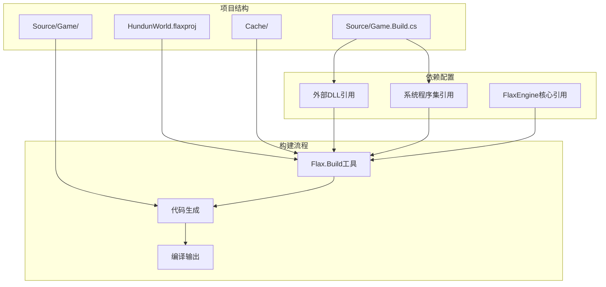
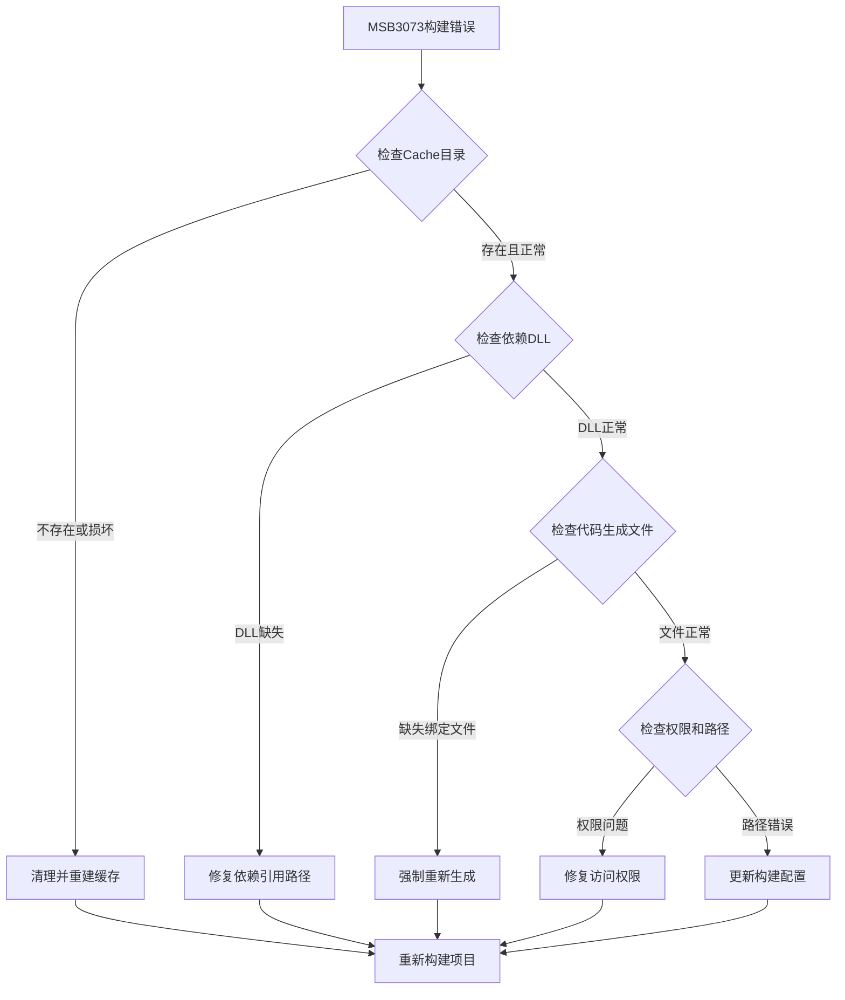
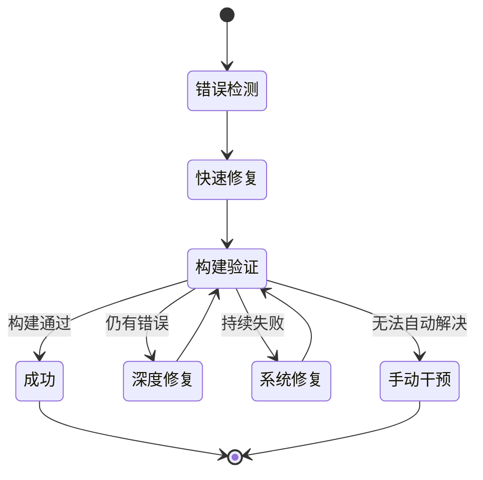

# Flax引擎构建系统错误诊断与修复设计方案

## 概述

本设计方案针对HundunWorld项目遇到的Flax引擎MSB3073构建错误，提供系统性的诊断流程和修复策略。该方案涵盖了Flax引擎特有的构建机制、依赖管理、缓存处理以及错误恢复机制的完整设计。

## 技术背景分析

### Flax引擎构建系统特性

Flax引擎采用自有的构建系统，与传统的MSBuild/NuGet生态存在显著差异：

- **自定义构建流程**：使用Flax.Build工具进行项目编译，而非标准MSBuild
- **依赖管理机制**：通过Game.Build.cs文件手动配置外部DLL引用路径
- **代码生成依赖**：需要Game.Bindings.Gen.cs等自动生成文件参与编译
- **缓存管理策略**：构建过程依赖Cache目录中的临时文件和配置

### 当前项目配置状态

## 错误诊断模型

### MSB3073错误分类框架

基于Flax引擎构建系统的特性，将MSB3073错误分为以下几个主要类别：

| 错误类别 | 描述 | 典型症状 | 影响范围 |
|----------|------|----------|----------|
| 依赖引用错误 | 外部DLL路径配置问题 | 找不到指定的DLL文件 | 编译阶段 |
| 代码生成失败 | 绑定文件生成异常 | Game.Bindings.Gen.cs缺失 | 预编译阶段 |
| 缓存损坏 | Cache目录状态异常 | 构建配置文件损坏 | 整个构建流程 |
| 版本兼容性 | 引擎版本与依赖不匹配 | API调用失败 | 运行时阶段 |
| 环境配置错误 | 路径配置或权限问题 | 无法访问构建工具 | 系统级别 |

### 诊断决策树

## 修复策略设计

### 分层修复方案

#### 第一层：快速恢复策略

**缓存清理重建**
- 删除Cache目录下的所有临时文件
- 重新执行Flax.Build命令生成新的构建配置
- 验证基础构建环境的完整性

**依赖路径验证**
- 检查Game.Build.cs中配置的所有DLL文件是否存在
- 验证文件路径的正确性和可访问性
- 更新过期或错误的引用路径

#### 第二层：深度修复策略

**代码生成文件重建**
- 强制删除所有.Gen.cs文件
- 重新运行代码生成流程
- 创建占位文件以避免编译错误

**系统权限校正**
- 检查构建工具的执行权限
- 验证项目目录的读写权限
- 修复可能的路径访问限制

#### 第三层：系统级修复策略

**环境配置重置**
- 验证Flax引擎安装的完整性
- 检查环境变量和系统路径配置
- 重新配置构建工具的依赖关系

### 修复流程控制机制

## 预防性维护设计

### 构建健康监控

**依赖完整性检查**
- 定期验证所有外部DLL的可用性
- 监控依赖文件的版本兼容性
- 建立依赖变更的自动通知机制

**缓存管理策略**
- 实施定期缓存清理计划
- 建立缓存备份和恢复机制
- 监控缓存目录的磁盘使用情况

### 配置标准化

**构建配置模板**
- 标准化Game.Build.cs的配置模式
- 建立依赖版本管理规范
- 制定构建参数的最佳实践

**环境一致性保证**
- 团队开发环境的标准化配置
- 构建工具版本的统一管理
- 自动化环境验证流程

## 应急响应机制

### 快速回退策略

当修复尝试失败时，提供快速回退到已知可工作状态的能力：

**配置回退**
- 保存已知良好的构建配置快照
- 快速恢复到上一个成功构建的状态
- 最小化停机时间和影响范围

**依赖版本锁定**
- 锁定已验证的依赖库版本
- 避免自动更新导致的兼容性问题
- 建立版本升级的受控流程

### 故障隔离机制

**模块化构建验证**
- 分阶段验证不同构建组件
- 隔离故障影响范围
- 支持部分功能的独立构建

**环境隔离测试**
- 在隔离环境中验证修复方案
- 避免修复过程影响主要开发流程
- 提供安全的实验环境

## 监控与反馈

### 构建质量度量

**关键性能指标**
- 构建成功率统计
- 平均故障恢复时间
- 依赖更新频率和成功率

**趋势分析**
- 错误模式的历史趋势
- 修复效果的长期评估
- 预防措施的有效性分析

### 持续改进机制

**经验积累**
- 记录每次故障的详细诊断过程
- 建立知识库和最佳实践文档
- 分享团队修复经验和教训

**流程优化**
- 定期评估修复流程的效率
- 根据实际经验调整诊断策略
- 持续完善自动化修复能力