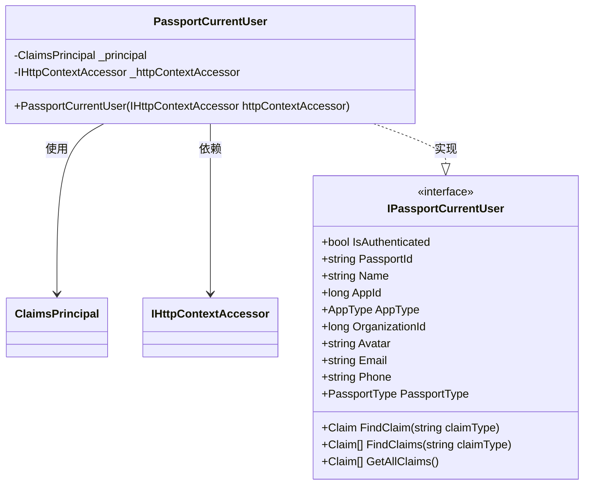
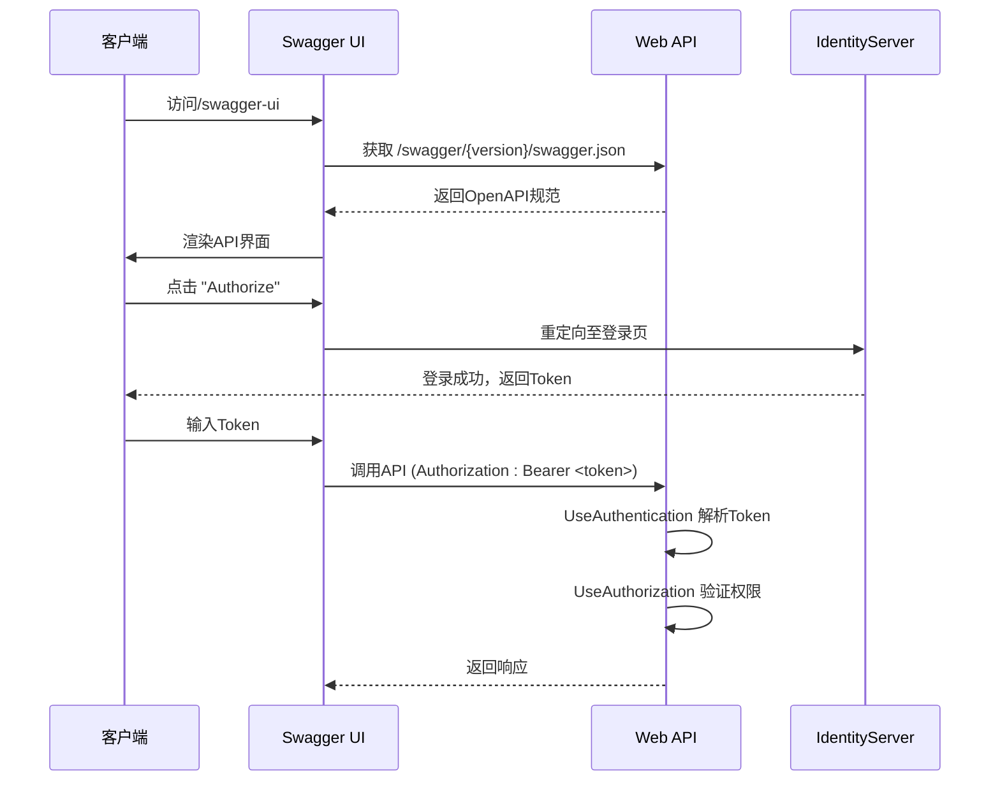

# API配置说明

<cite>
**本文档引用的文件**  
- [Startup.cs](file://Horizon.WebApi/Startup.cs)
- [AdoNetOptions.cs](file://Horizon.Core/Options/AdoNetOptions.cs)
- [PassportSecurityOptions.cs](file://Horizon.Core/Options/PassportSecurityOptions.cs)
- [ApiGroupName.cs](file://Horizon.WebApi/Configs/ApiGroupName.cs)
- [IPassportCurrentUser.cs](file://Horizon.Core.Abstract/IPassportCurrentUser.cs)
- [PassportCurrentUser.cs](file://Horizon.WebApi/Identity/Users/PassportCurrentUser.cs)
</cite>

## 目录
1. [简介](#简介)
2. [项目结构概览](#项目结构概览)
3. [核心配置项分析](#核心配置项分析)
4. [依赖注入与用户上下文](#依赖注入与用户上下文)
5. [Swagger/OpenAPI多版本配置](#swaggeropenapi多版本配置)
6. [中间件管道执行顺序](#中间件管道执行顺序)
7. [静态文件服务配置](#静态文件服务配置)
8. [结论](#结论)

## 简介
本文档深入解析 `Startup.cs` 文件中 `ConfigureServices` 和 `Configure` 方法的关键配置，涵盖选项加载、依赖注入、API文档生成、身份验证流程及静态资源服务等核心功能。旨在为开发人员提供清晰的配置指导和架构理解。

## 项目结构概览
本项目采用分层架构设计，主要包括核心库（Horizon.Core）、抽象接口（Horizon.Core.Abstract）、实体模型（Horizon.Entities）、共享组件（Horizon.Share）以及Web API入口（Horizon.WebApi）。其中，`Startup.cs` 位于 `Horizon.WebApi` 项目中，是整个应用的服务注册与中间件配置中心。

## 核心配置项分析

### 配置选项加载机制
在 `ConfigureServices` 方法中，通过 `IConfiguration` 接口从 `appsettings.json` 加载多个强类型配置选项类：

- **AdoNetOptions**: 用于Orleans集群数据库连接配置，包含 `ConnectionString`（连接字符串）和 `Invariant`（驱动程序集名称）。
- **ClusterOptions**: 集群相关配置（文件未找到，但代码中存在引用）。
- **PassportSecurityOptions**: 通行证安全配置，包含 `Security` 字段，用于安全令牌或加密密钥。
- **SocketEndpoint**: Socket通信端点配置。

这些选项通过 `services.Configure<T>` 方法绑定到配置节，后续可通过 `IOptions<T>` 注入使用。

**Section sources**
- [Startup.cs](file://Horizon.WebApi/Startup.cs#L49-L60)
- [AdoNetOptions.cs](file://Horizon.Core/Options/AdoNetOptions.cs#L9-L20)
- [PassportSecurityOptions.cs](file://Horizon.Core/Options/PassportSecurityOptions.cs#L6-L12)

## 依赖注入与用户上下文

### IPassportCurrentUser 的注册与实现
系统通过依赖注入（DI）容器注册了当前用户上下文服务 `IPassportCurrentUser`，其具体实现为 `PassportCurrentUser` 类。

#### 接口定义
`IPassportCurrentUser` 定义了获取当前认证用户信息的标准方法，包括：
- 基本属性：`PassportId`, `Name`, `Email`, `Phone`, `Avatar` 等。
- 认证状态：`IsAuthenticated`
- 声明查询：`FindClaim`, `FindClaims`, `GetAllClaims`

#### 实现细节
`PassportCurrentUser` 构造函数接收 `IHttpContextAccessor`，从中获取当前请求的 `ClaimsPrincipal` 对象，并基于声明（Claims）实现所有属性访问。例如，`PassportId` 通过查找类型为 `PassportClaimTypes.PassportId` 的声明值返回。

该服务以 `Scoped` 生命周期注册，确保每个请求拥有独立的实例，同时能安全地访问当前请求上下文。

**Diagram sources**
- [IPassportCurrentUser.cs](file://Horizon.Core.Abstract/IPassportCurrentUser.cs#L12-L53)
- [PassportCurrentUser.cs](file://Horizon.WebApi/Identity/Users/PassportCurrentUser.cs#L16-L84)

**Section sources**
- [IPassportCurrentUser.cs](file://Horizon.Core.Abstract/IPassportCurrentUser.cs#L12-L53)
- [PassportCurrentUser.cs](file://Horizon.WebApi/Identity/Users/PassportCurrentUser.cs#L16-L84)

## Swagger/OpenAPI多版本配置

### API分组与元信息设置
系统使用 Swashbuckle.AspNetCore 实现 OpenAPI 文档生成，并通过 `AddSwaggerGen` 方法配置多版本分组。每个分组对应一个 `ApiGroupName` 常量：

- **基础服务**: 版本号 "基础服务"，标题 "地平线基础Api"
- **文识**: 版本号 "文识"，标题 "教学文章Api"
- **用户**: 版本号 "用户"，标题 "用户Api"
- **游戏**: 版本号 "游戏"，标题 "游戏管理接口"

每个分组均设置了版本、标题、描述和联系人信息。

### XML注释集成
为了在API文档中显示控制器和方法的XML注释，系统添加了两个XML文件路径：

- **Horizon.WebApi.xml**: 当前项目的编译输出XML，通过 `Assembly.GetExecutingAssembly()` 动态获取路径。
- **Horizon.Share.xml**: 共享库的XML文档，手动指定文件名。

这两个文件的注释均被包含在Swagger文档中，且启用了控制器级别的注释显示。

### 安全定义
系统通过 `AddSecurityDefinition` 方法定义了名为 "oauth2" 的安全方案：
- **类型**: `ApiKey`
- **位置**: 请求头 (`Header`)
- **名称**: `Authorization`
- **描述**: 提示标准格式为 "Bearer " 后跟一个空格和令牌。

此定义将引导Swagger UI在调用需要授权的接口时自动添加Bearer Token。

**Diagram sources**
- [Startup.cs](file://Horizon.WebApi/Startup.cs#L75-L125)

**Section sources**
- [Startup.cs](file://Horizon.WebApi/Startup.cs#L75-L125)
- [ApiGroupName.cs](file://Horizon.WebApi/Configs/ApiGroupName.cs#L4-L7)

## 中间件管道执行顺序

### 执行顺序与作用
在 `Configure` 方法中，中间件的注册顺序至关重要，它决定了HTTP请求的处理流程：

1. **UseDeveloperExceptionPage**: 开发环境异常页面，仅在 `IsDevelopment` 时启用。
2. **UseHttpsRedirection**: 强制HTTPS重定向。
3. **UseRouting**: 启用路由匹配。
4. **UseIdentityServer()**: 启用IdentityServer4，提供OpenID Connect和OAuth 2.0服务。
5. **UseAuthentication()**: 启用身份验证，解析并建立 `ClaimsPrincipal`。
6. **UseAuthorization()**: 启用授权，根据策略检查访问权限。
7. **UseSwagger & UseSwaggerUI**: 启用Swagger文档和UI界面。
8. **UseEndpoints**: 映射控制器路由。
9. **UseStaticFiles**: 启用默认静态文件服务（如wwwroot）。

**关键点**: `UseIdentityServer` 必须在 `UseAuthentication` 之前调用，因为它会向认证方案提供者注册自己的认证处理器。而 `UseAuthentication` 又必须在 `UseAuthorization` 之前，因为授权依赖于已认证的用户主体。

**Section sources**
- [Startup.cs](file://Horizon.WebApi/Startup.cs#L137-L180)

## 静态文件服务配置

### 自定义静态资源路径
除了默认的静态文件服务，系统还配置了一个自定义静态文件目录 `/Aessets`：

- **物理路径**: 应用程序基目录下的 `Aessets` 文件夹。
- **虚拟路径**: `/Aessets` URL前缀。
- **自动创建**: 如果 `Aessets` 文件夹不存在，则在启动时自动创建。

此配置允许运行时上传的文件（如用户头像、游戏资源）通过HTTP直接访问。

**Section sources**
- [Startup.cs](file://Horizon.WebApi/Startup.cs#L170-L180)

## 结论
`Startup.cs` 是整个Web API应用的配置核心。它通过 `ConfigureServices` 完成服务注册与选项绑定，利用 `Configure` 方法构建了严谨的中间件管道。系统实现了模块化的API版本管理、完善的文档支持、安全的身份验证流程以及灵活的静态资源服务。理解这些配置对于维护和扩展应用至关重要。