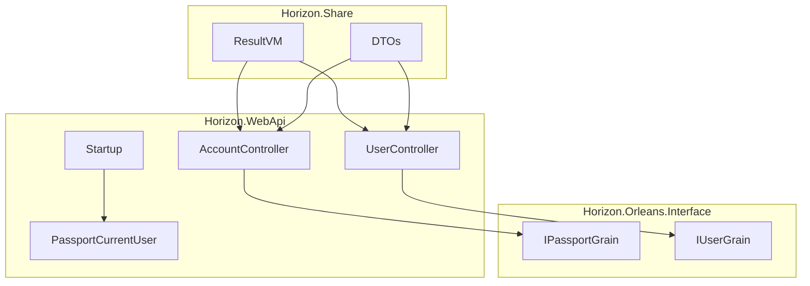
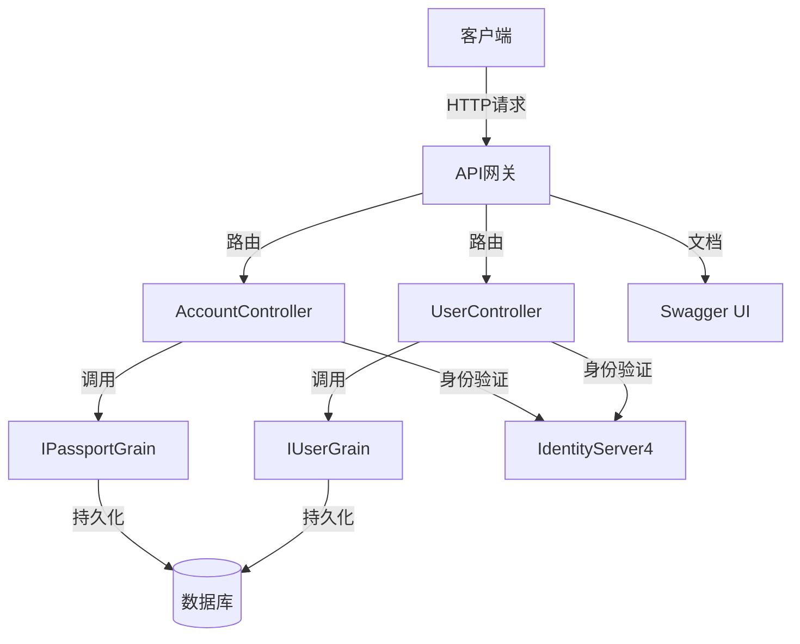
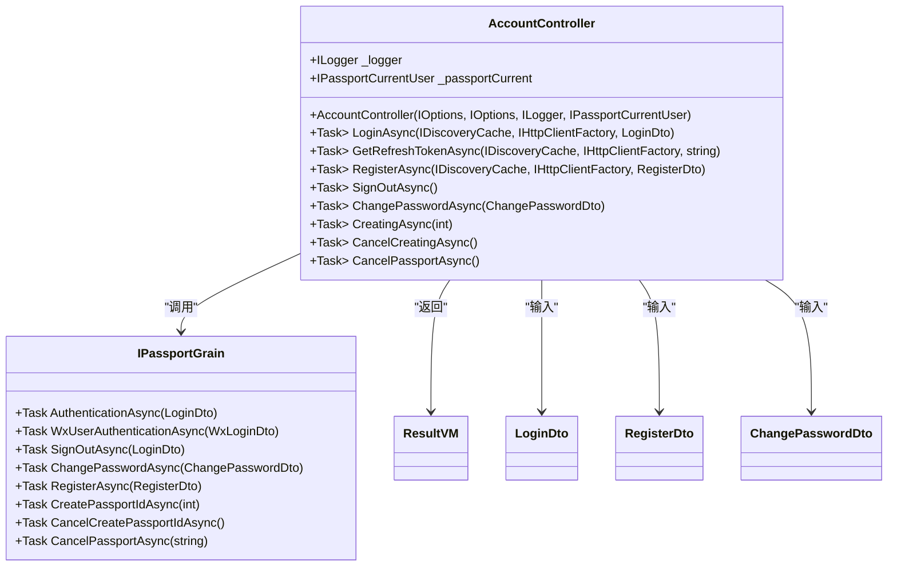
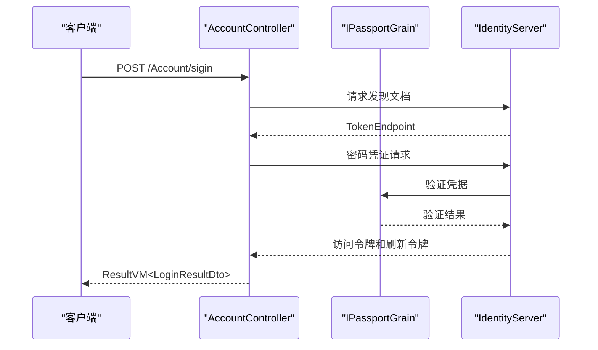
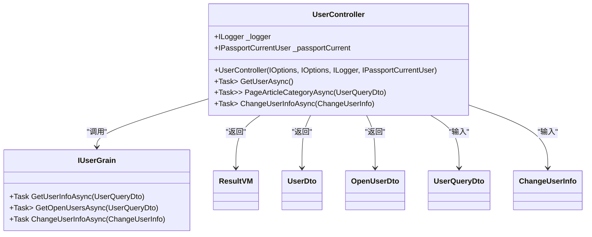
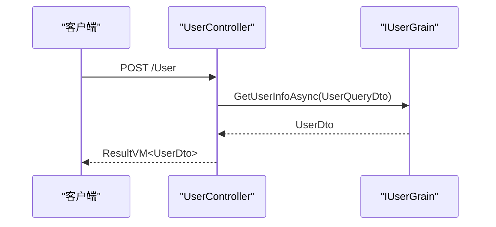
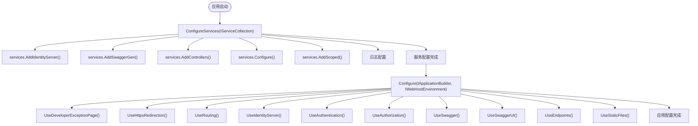
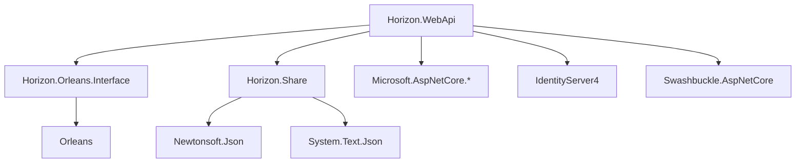

# Web API服务

<cite>
**本文档引用的文件**  
- [AccountController.cs](file://Horizon.WebApi/Controllers/AccountController.cs)
- [UserController .cs](file://Horizon.WebApi/Controllers/Users/UserController .cs)
- [Startup.cs](file://Horizon.WebApi/Startup.cs)
- [appsettings.json](file://Horizon.WebApi/appsettings.json)
- [ResultVM.cs](file://Horizon.Share/VMs/ResultVM.cs)
- [PassportCurrentUser.cs](file://Horizon.WebApi/Identity/Users/PassportCurrentUser.cs)
- [Config.cs](file://Horizon.WebApi/Identity/Config.cs)
- [IPassportGrain.cs](file://Horizon.Orleans.Interface/IPassportGrain.cs)
- [LoginDto.cs](file://Horizon.Share/Dtos/User/LoginDto.cs)
- [RegisterDto.cs](file://Horizon.Share/Dtos/User/RegisterDto.cs)
- [ChangePasswordDto.cs](file://Horizon.Share/Dtos/User/ChangePasswordDto.cs)
- [UserDto.cs](file://Horizon.Share/Dtos/User/UserDto.cs)
- [OpenUserDto .cs](file://Horizon.Share/Dtos/User/OpenUserDto .cs)
- [AppType.cs](file://Horizon.Core.Abstract/AppType.cs)
- [PassportType.cs](file://Horizon.Core.Abstract/Enums/PassportType.cs)
</cite>

## 目录
1. [简介](#简介)
2. [项目结构](#项目结构)
3. [核心组件](#核心组件)
4. [架构概述](#架构概述)
5. [详细组件分析](#详细组件分析)
6. [依赖分析](#依赖分析)
7. [性能考虑](#性能考虑)
8. [故障排除指南](#故障排除指南)
9. [结论](#结论)

## 简介
本文档详细说明了基于ASP.NET Core构建的Web API服务，重点介绍用户账户管理与信息操作功能。系统采用Orleans分布式架构，结合IdentityServer实现安全的身份验证机制。文档涵盖登录、注册、用户信息管理等核心接口设计，解释依赖注入、身份验证配置、API版本控制、错误响应格式等关键实现细节，并提供测试与集成指南。

## 项目结构
项目采用分层架构设计，主要包含以下模块：
- **Horizon.WebApi**：核心Web API服务，包含控制器、启动配置和身份验证逻辑
- **Horizon.Share**：共享组件，包含数据传输对象（DTO）、视图模型（VM）和通用工具
- **Horizon.Orleans.Interface**：Orleans Grain接口定义，实现分布式业务逻辑
- **Horizon.Core**：核心基础库，包含通用助手类和配置选项
- **Horizon.Model**：数据模型定义

**图表来源**  
- [AccountController.cs](file://Horizon.WebApi/Controllers/AccountController.cs#L31-L316)
- [UserController .cs](file://Horizon.WebApi/Controllers/Users/UserController .cs#L22-L101)
- [IPassportGrain.cs](file://Horizon.Orleans.Interface/IPassportGrain.cs#L12-L83)

**本节来源**  
- [AccountController.cs](file://Horizon.WebApi/Controllers/AccountController.cs#L31-L316)
- [UserController .cs](file://Horizon.WebApi/Controllers/Users/UserController .cs#L22-L101)

## 核心组件
系统核心组件包括账户控制器（AccountController）和用户控制器（UserController），分别处理用户认证和用户信息管理。通过Orleans分布式框架实现业务逻辑解耦，使用IdentityServer4进行安全的身份验证和授权。所有API响应遵循统一的ResultVM格式，确保客户端能够一致地处理成功和错误情况。

**本节来源**  
- [AccountController.cs](file://Horizon.WebApi/Controllers/AccountController.cs#L31-L316)
- [UserController .cs](file://Horizon.WebApi/Controllers/Users/UserController .cs#L22-L101)
- [ResultVM.cs](file://Horizon.Share/VMs/ResultVM.cs#L9-L31)

## 架构概述
系统采用微服务架构模式，基于ASP.NET Core和Orleans构建。API网关层处理HTTP请求，通过依赖注入获取服务实例，利用Orleans Grain进行分布式业务逻辑处理。身份验证由IdentityServer4提供，支持OAuth 2.0密码凭证流。Swagger用于API文档生成，支持多版本API管理。

**图表来源**  
- [Startup.cs](file://Horizon.WebApi/Startup.cs#L37-L184)
- [AccountController.cs](file://Horizon.WebApi/Controllers/AccountController.cs#L31-L316)
- [UserController .cs](file://Horizon.WebApi/Controllers/Users/UserController .cs#L22-L101)

## 详细组件分析

### 账户控制器分析
AccountController提供用户账户管理功能，包括登录、注册、密码修改等操作。控制器通过Orleans客户端调用IPassportGrain接口实现业务逻辑，使用IdentityServer4进行令牌管理。

#### 账户控制器类图

**图表来源**  
- [AccountController.cs](file://Horizon.WebApi/Controllers/AccountController.cs#L31-L316)
- [IPassportGrain.cs](file://Horizon.Orleans.Interface/IPassportGrain.cs#L12-L83)
- [LoginDto.cs](file://Horizon.Share/Dtos/User/LoginDto.cs#L12-L50)
- [RegisterDto.cs](file://Horizon.Share/Dtos/User/RegisterDto.cs#L12-L48)

#### 登录流程序列图

**图表来源**  
- [AccountController.cs](file://Horizon.WebApi/Controllers/AccountController.cs#L60-L98)
- [IPassportGrain.cs](file://Horizon.Orleans.Interface/IPassportGrain.cs#L12-L83)

### 用户控制器分析
UserController提供用户信息管理功能，包括获取用户信息、分页查询用户列表和修改用户信息。控制器通过Orleans客户端调用IUserGrain接口实现业务逻辑，所有操作都需要身份验证。

#### 用户控制器类图

**图表来源**  
- [UserController .cs](file://Horizon.WebApi/Controllers/Users/UserController .cs#L22-L101)
- [UserDto.cs](file://Horizon.Share/Dtos/User/UserDto.cs#L10-L61)
- [OpenUserDto .cs](file://Horizon.Share/Dtos/User/OpenUserDto .cs#L10-L46)

#### 获取用户信息流程

**图表来源**  
- [UserController .cs](file://Horizon.WebApi/Controllers/Users/UserController .cs#L50-L63)

### 身份验证与依赖注入分析
Startup.cs配置了系统的依赖注入、身份验证和中间件。通过AddIdentityServer扩展方法集成IdentityServer4，配置API文档生成，并设置请求管道。

#### 启动配置流程图

**图表来源**  
- [Startup.cs](file://Horizon.WebApi/Startup.cs#L37-L184)

## 依赖分析
系统依赖关系清晰，各层职责分明。Web API层依赖于Orleans接口层和共享组件层，Orleans接口层定义业务契约，共享组件层提供数据传输对象和通用功能。

**图表来源**  
- [Startup.cs](file://Horizon.WebApi/Startup.cs#L37-L184)
- [AccountController.cs](file://Horizon.WebApi/Controllers/AccountController.cs#L31-L316)
- [UserController .cs](file://Horizon.WebApi/Controllers/Users/UserController .cs#L22-L101)

## 性能考虑
系统在性能方面进行了多项优化：
- 使用Orleans分布式框架实现水平扩展
- 配置了连接池和异步操作以提高并发处理能力
- 通过Swagger缓存减少文档生成开销
- 合理设置访问令牌有效期（7天）和刷新令牌滑动过期时间（5天）
- 使用静态文件中间件优化资源访问

## 故障排除指南
常见问题及解决方案：
- **401未授权错误**：检查JWT令牌是否有效，确保Authorization头格式正确（Bearer {token}）
- **404找不到资源**：确认API路由是否正确，检查Swagger文档中的端点定义
- **数据库连接失败**：验证appsettings.json中的连接字符串配置
- **Orleans Grain调用超时**：检查Orleans集群状态和网络连接
- **Swagger文档不显示**：确保XML文档注释已生成并正确配置IncludeXmlComments

**本节来源**  
- [Startup.cs](file://Horizon.WebApi/Startup.cs#L37-L184)
- [AccountController.cs](file://Horizon.WebApi/Controllers/AccountController.cs#L31-L316)
- [UserController .cs](file://Horizon.WebApi/Controllers/Users/UserController .cs#L22-L101)

## 结论
本文档详细介绍了基于ASP.NET Core和Orleans构建的Web API服务。系统采用现代化的架构设计，具有良好的可扩展性和安全性。通过统一的ResultVM响应格式、完善的Swagger文档和清晰的依赖关系，为开发者提供了友好的集成体验。建议在生产环境中进一步优化日志记录、监控和安全配置，以确保系统的稳定运行。