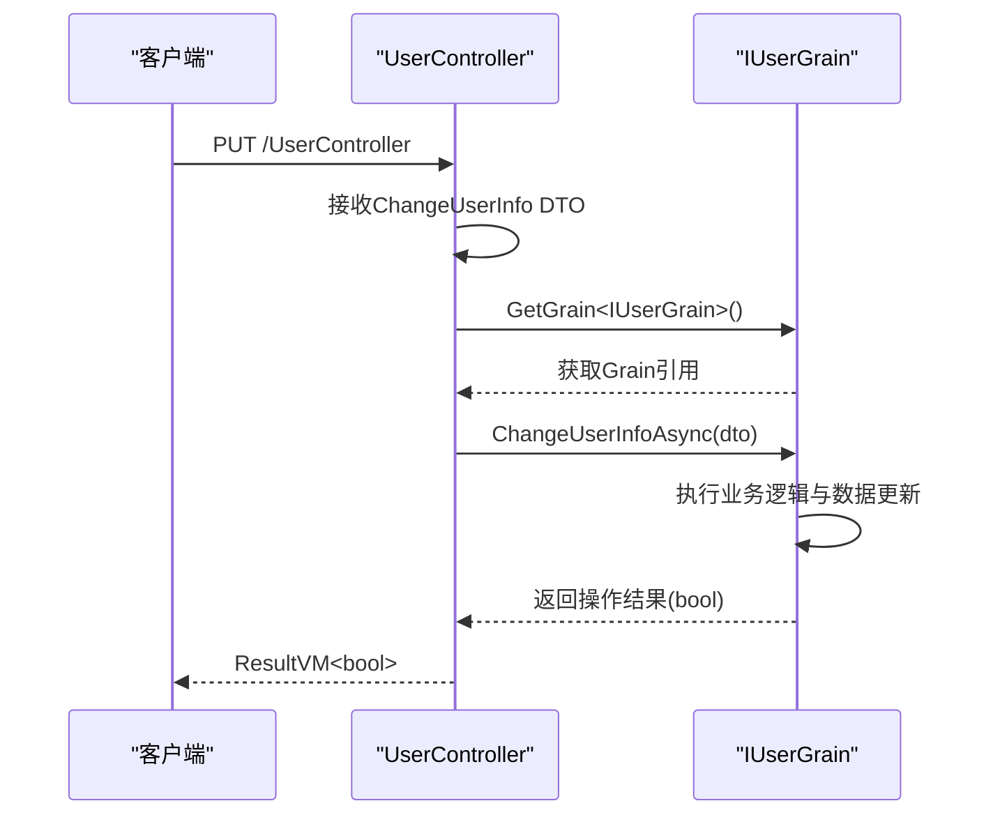

# 用户管理API

<cite>
**Referenced Files in This Document**   
- [UserController .cs](file://Horizon.WebApi/Controllers/Users/UserController .cs)
- [ChangeUserInfo.cs](file://Horizon.Share/Dtos/User/ChangeUserInfo.cs)
- [OpenUserDto .cs](file://Horizon.Share/Dtos/User/OpenUserDto .cs)
- [UserDto.cs](file://Horizon.Share/Dtos/User/UserDto.cs)
- [PageItems.cs](file://Horizon.Share/Commones/PageItems.cs)
- [IPageItems.cs](file://Horizon.Core.Abstract/IPageItems.cs)
- [IPassportCurrentUser.cs](file://Horizon.Core.Abstract/IPassportCurrentUser.cs)
</cite>

## 目录
1. [简介](#简介)
2. [核心端点功能分析](#核心端点功能分析)
3. [数据传输对象（DTO）详解](#数据传输对象dto详解)
4. [授权与用户上下文](#授权与用户上下文)
5. [分页响应结构](#分页响应结构)
6. [数据校验与事务处理](#数据校验与事务处理)

## 简介
本文档详细阐述了用户管理API的核心功能，重点分析`UserController`控制器中的三个关键端点：`GetUserAsync`、`PageArticleCategoryAsync`和`ChangeUserInfoAsync`。文档解释了如何通过Orleans Grain（`IUserGrain`）实现用户信息获取、开放用户列表分页查询以及用户资料更新。同时，文档深入解析了`UserQueryDto`和`ChangeUserInfo`等输入DTO的数据结构及其映射关系，并描述了授权机制如何结合`IPassportCurrentUser`获取上下文用户标识。

## 核心端点功能分析

### 获取当前用户信息 (GetUserAsync)
`GetUserAsync`端点用于获取当前认证用户的基本信息。该方法通过`[Authorize]`特性确保调用者已通过身份验证。

**功能流程**：
1.  从`IPassportCurrentUser`服务中获取当前用户的上下文信息（如PassportId, AppId等）。
2.  构造一个`UserQueryDto`对象，填充当前用户信息。
3.  通过Orleans客户端连接，获取一个`IUserGrain`的Grain引用。
4.  调用Grain的`GetUserInfoAsync`方法，传入查询DTO。
5.  将Grain返回的`UserDto`封装在`ResultVM`中返回。

**Section sources**
- [UserController .cs](file://Horizon.WebApi/Controllers/Users/UserController .cs#L45-L64)

### 分页查询开放用户列表 (PageArticleCategoryAsync)
`PageArticleCategoryAsync`端点用于分页查询系统中的开放用户列表。此端点接受一个`UserQueryDto`作为请求体，支持分页和筛选。

**功能流程**：
1.  接收客户端传入的`UserQueryDto`，其中包含分页参数（`PageIndex`, `PageSize`）和可能的筛选条件。
2.  通过Orleans客户端连接，获取一个`IUserGrain`的Grain引用。
3.  调用Grain的`GetOpenUsersAsync`方法，传入查询DTO。
4.  将Grain返回的`IPageItems<OpenUserDto>`封装在`ResultVM`中返回。

**Section sources**
- [UserController .cs](file://Horizon.WebApi/Controllers/Users/UserController .cs#L70-L81)

### 更新用户信息 (ChangeUserInfoAsync)
`ChangeUserInfoAsync`端点用于修改用户资料。该操作通过`[HttpPut]`方法触发。

**功能流程**：
1.  接收客户端传入的`ChangeUserInfo` DTO，其中包含要修改的用户ID、修改类型和新值。
2.  通过Orleans客户端连接，获取一个`IUserGrain`的Grain引用。
3.  调用Grain的`ChangeUserInfoAsync`方法，传入修改DTO。
4.  将Grain返回的操作结果（布尔值）封装在`ResultVM`中返回。



**Diagram sources**
- [UserController .cs](file://Horizon.WebApi/Controllers/Users/UserController .cs#L88-L99)

**Section sources**
- [UserController .cs](file://Horizon.WebApi/Controllers/Users/UserController .cs#L88-L99)

## 数据传输对象（DTO）详解

### UserQueryDto 输入查询对象
`UserQueryDto`是用于查询用户信息的输入数据结构，它继承自`PageQuery`以支持分页。

**属性说明**：
- `PassportId`: 用户通行证ID。
- `AppId`: 应用ID。
- `AppType`: 应用类型。
- `PassportType`: 通行证类型。
- `OrganizationId`: 机构ID（可选）。
- `PageIndex`: 页码，继承自`PageQuery`。
- `PageSize`: 每页数量，继承自`PageQuery`。

**Section sources**
- [UserDto.cs](file://Horizon.Share/Dtos/User/UserDto.cs#L67-L92)

### ChangeUserInfo 修改信息对象
`ChangeUserInfo` DTO用于指定用户信息的修改内容。

**属性说明**：
- `PassportId`: 目标用户的通行证ID。
- `AppId`: 关联的应用ID。
- `AppType`: 关联的应用类型。
- `Type`: 要修改的字段类型（`UserInfoType`枚举）。
- `Value`: 新的字段值（字符串形式）。

**UserInfoType 枚举**：
该枚举定义了可修改的用户信息类型：
- `IdCard`: 身份证号
- `Phone`: 手机号
- `Email`: 邮箱
- `Avatar`: 头像

**Section sources**
- [ChangeUserInfo.cs](file://Horizon.Share/Dtos/User/ChangeUserInfo.cs#L1-L59)

### OpenUserDto 开放用户输出对象
`OpenUserDto`是分页查询接口返回的用户信息数据结构。

**属性说明**：
- `PassportId`: 通行证ID。
- `NickName`: 昵称。
- `Avatar`: 头像URL。
- `Phone`: 手机号。
- `Email`: 邮箱。
- `RealNameAuthStatus`: 实名认证状态。

**Section sources**
- [OpenUserDto .cs](file://Horizon.Share/Dtos/User/OpenUserDto .cs#L1-L48)

## 授权与用户上下文
所有用户管理端点均使用`[Authorize]`特性进行保护，确保只有经过身份验证的用户才能访问。

**IPassportCurrentUser 的作用**：
- `GetUserAsync`端点依赖`IPassportCurrentUser`服务来获取当前认证用户的身份信息（如`PassportId`, `AppId`等）。
- 该服务通过注入的方式在`UserController`的构造函数中获取。
- 当`GetUserAsync`被调用时，它会从`_passportCurrent`实例中读取当前用户上下文，并将其填充到`UserQueryDto`中，从而确保用户只能获取自己的信息。

**Section sources**
- [UserController .cs](file://Horizon.WebApi/Controllers/Users/UserController .cs#L30-L38)
- [IPassportCurrentUser.cs](file://Horizon.Core.Abstract/IPassportCurrentUser.cs#L12-L53)

## 分页响应结构
分页查询接口（如`PageArticleCategoryAsync`）返回`IPageItems<OpenUserDto>`类型的响应。

**IPageItems 接口**：
- `Total`: 整个数据集的总条数，用于前端计算总页数。
- `Items`: 当前页包含的`OpenUserDto`对象列表。

**PageItems 实现**：
`PageItems<T>`是`IPageItems<T>`的通用实现，它提供了一个构造函数来初始化`Total`和`Items`。

**解析示例**：
```json
{
  "data": {
    "total": 100,
    "items": [
      {
        "passportId": "user123",
        "nickName": "张三",
        "avatar": "https://example.com/avatar.jpg",
        "phone": "138****1234",
        "email": "zhangsan@example.com",
        "realNameAuthStatus": 1
      },
      // ... 更多用户
    ]
  },
  "errorMessage": null
}
```

**Diagram sources**
- [PageItems.cs](file://Horizon.Share/Commones/PageItems.cs#L7-L28)
- [IPageItems.cs](file://Horizon.Core.Abstract/IPageItems.cs#L7-L17)

**Section sources**
- [PageItems.cs](file://Horizon.Share/Commones/PageItems.cs#L7-L28)
- [IPageItems.cs](file://Horizon.Core.Abstract/IPageItems.cs#L7-L17)

## 数据校验与事务处理

### 数据校验规则
- **输入DTO校验**：`ChangeUserInfo`中的`Type`和`Value`应进行有效性检查。例如，当`Type`为`Phone`时，`Value`必须符合手机号格式。
- **权限校验**：`ChangeUserInfoAsync`应验证调用者是否有权修改目标用户（`PassportId`）的信息。通常，用户只能修改自己的信息。
- **业务规则校验**：例如，修改邮箱或手机号时，可能需要验证新值的唯一性。

### 事务处理建议
- **Grain内部处理**：由于用户信息的更新是通过`IUserGrain`执行的，因此事务逻辑应封装在Grain的`ChangeUserInfoAsync`方法内部。
- **原子性操作**：Grain方法应确保对用户数据的更新是原子的。Orleans的单线程执行模型天然保证了同一Grain实例上的操作不会并发执行，这简化了事务管理。
- **持久化**：Grain状态的变更应通过Orleans的持久化机制（如`IPersistentState<T>`）自动保存，开发者需确保状态变更后调用`WriteStateAsync`或配置为自动保存。
- **异常处理**：在Grain方法中应捕获数据访问异常，并返回适当的错误码，避免将底层异常暴露给API层。