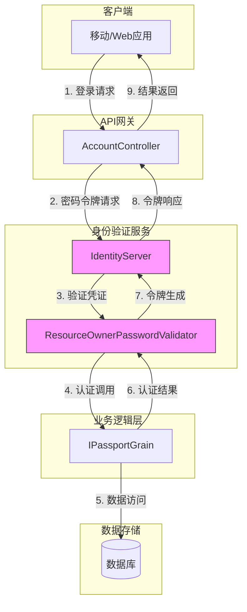
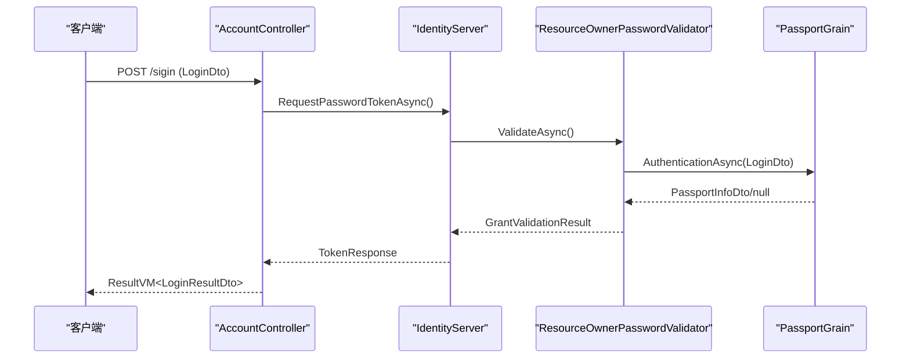
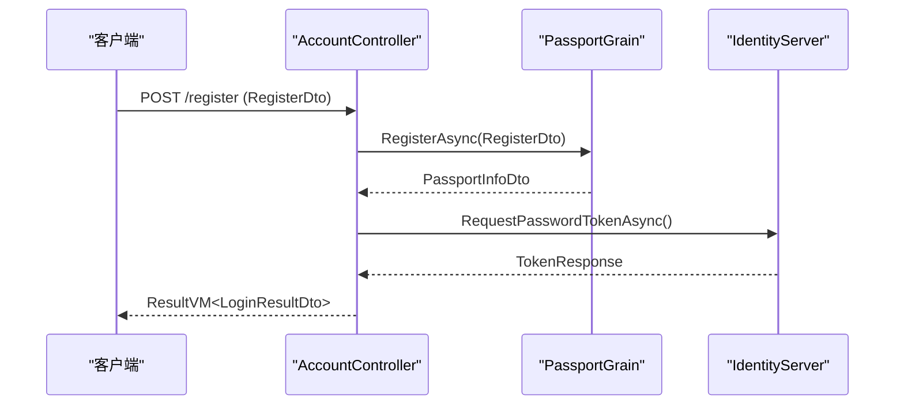
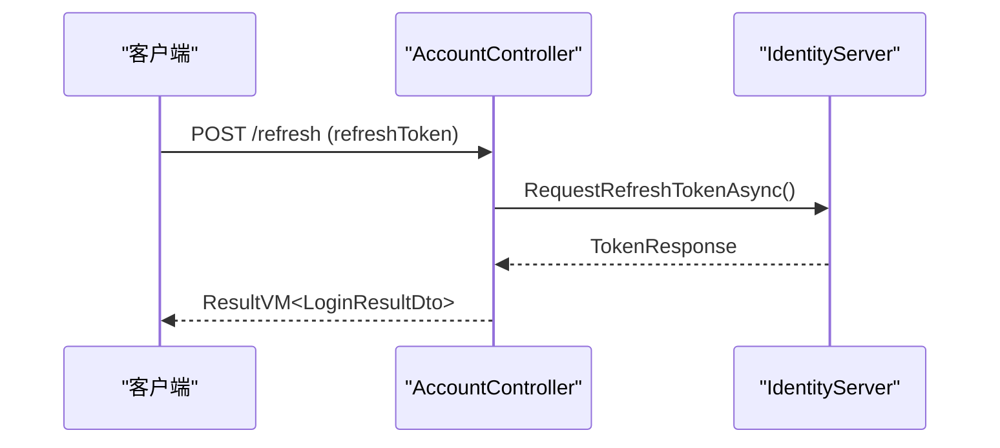
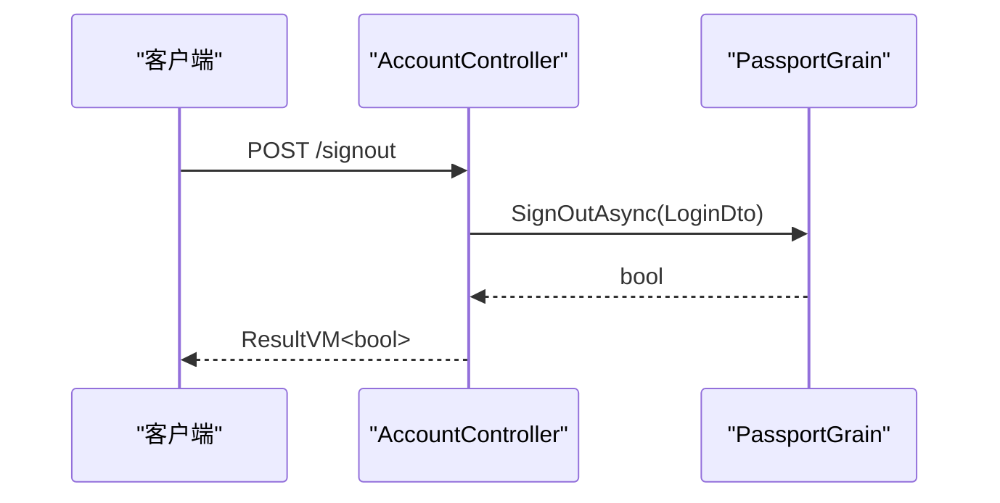
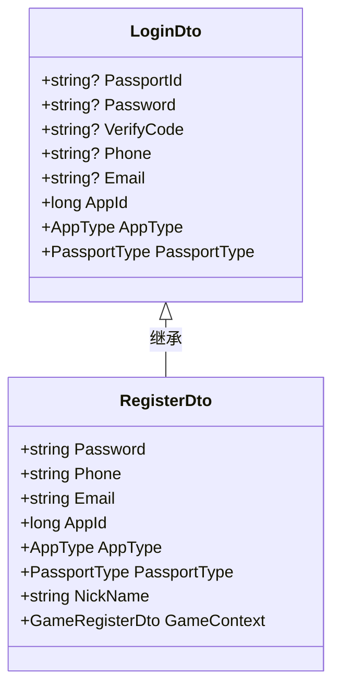
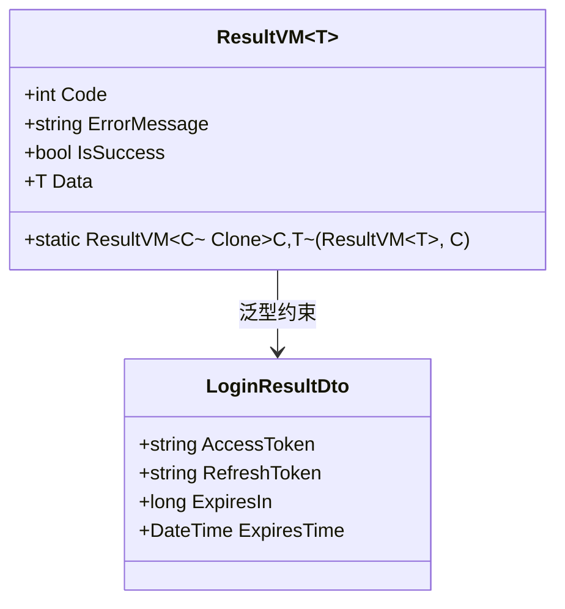
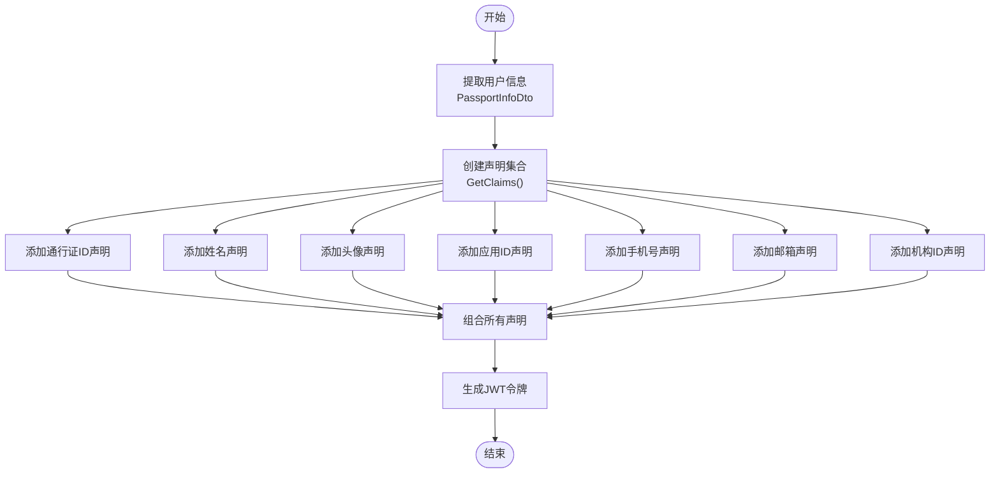
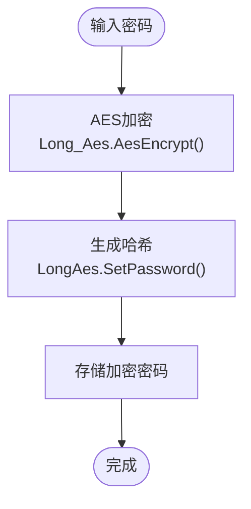
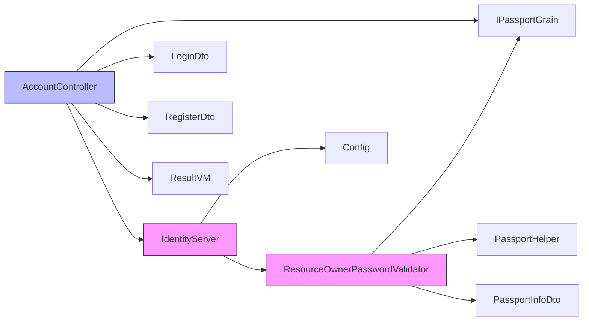

# 身份验证API

<cite>
**Referenced Files in This Document **   
- [AccountController.cs](file://Horizon.WebApi/Controllers/AccountController.cs)
- [LoginDto.cs](file://Horizon.Share/Dtos/User/LoginDto.cs)
- [RegisterDto.cs](file://Horizon.Share/Dtos/User/RegisterDto.cs)
- [LoginResultDto.cs](file://Horizon.Share/Dtos/User/LoginResultDto.cs)
- [ResultVM.cs](file://Horizon.Share/VMs/ResultVM.cs)
- [PassportHelper.cs](file://Horizon.Core/PassportHelper.cs)
- [ResourceOwnerPasswordValidator.cs](file://Horizon.WebApi/Identity/ResourceOwnerPasswordValidator.cs)
- [Config.cs](file://Horizon.WebApi/Identity/Config.cs)
- [Startup.cs](file://Horizon.WebApi/Startup.cs)
- [IPassportGrain.cs](file://Horizon.Orleans.Interface/IPassportGrain.cs)
- [PassportInfoDto.cs](file://Horizon.Share/Dtos/User/PassportInfoDto.cs)
- [LoginErrorCodes.cs](file://Horizon.Share/Commones/LoginErrorCodes.cs)
</cite>

## 目录
1. [简介](#简介)
2. [核心组件](#核心组件)
3. [架构概述](#架构概述)
4. [详细组件分析](#详细组件分析)
5. [依赖关系分析](#依赖关系分析)
6. [性能考虑](#性能考虑)
7. [故障排除指南](#故障排除指南)
8. [结论](#结论)

## 简介
本文档详细介绍了基于IdentityServer的OAuth 2.0密码模式身份验证系统。该系统提供登录、注册、令牌刷新和登出等核心功能，通过JWT令牌实现安全的身份验证和授权。文档涵盖了`AccountController`中关键方法的实现逻辑、请求/响应数据结构、安全机制以及错误处理策略。

## 核心组件

本节分析身份验证系统的核心组件及其交互方式。

**Section sources**
- [AccountController.cs](file://Horizon.WebApi/Controllers/AccountController.cs#L55-L226)
- [ResourceOwnerPasswordValidator.cs](file://Horizon.WebApi/Identity/ResourceOwnerPasswordValidator.cs#L20-L95)
- [IPassportGrain.cs](file://Horizon.Orleans.Interface/IPassportGrain.cs#L19-L33)

## 架构概述

该身份验证系统采用分层架构，结合了Orleans分布式计算框架和IdentityServer进行令牌管理。以下是系统的整体架构：



**Diagram sources **
- [AccountController.cs](file://Horizon.WebApi/Controllers/AccountController.cs)
- [ResourceOwnerPasswordValidator.cs](file://Horizon.WebApi/Identity/ResourceOwnerPasswordValidator.cs)
- [IPassportGrain.cs](file://Horizon.Orleans.Interface/IPassportGrain.cs)

## 详细组件分析

### AccountController分析
`AccountController`是身份验证API的主要入口点，实现了登录、注册、令牌刷新和登出功能。

#### 登录流程


**Diagram sources **
- [AccountController.cs](file://Horizon.WebApi/Controllers/AccountController.cs#L55-L100)
- [ResourceOwnerPasswordValidator.cs](file://Horizon.WebApi/Identity/ResourceOwnerPasswordValidator.cs#L20-L95)
- [IPassportGrain.cs](file://Horizon.Orleans.Interface/IPassportGrain.cs#L19)

#### 注册流程


**Diagram sources **
- [AccountController.cs](file://Horizon.WebApi/Controllers/AccountController.cs#L149-L201)
- [IPassportGrain.cs](file://Horizon.Orleans.Interface/IPassportGrain.cs#L47)

#### 刷新令牌流程


**Diagram sources **
- [AccountController.cs](file://Horizon.WebApi/Controllers/AccountController.cs#L110-L141)

#### 登出流程


**Diagram sources **
- [AccountController.cs](file://Horizon.WebApi/Controllers/AccountController.cs#L207-L226)
- [IPassportGrain.cs](file://Horizon.Orleans.Interface/IPassportGrain.cs#L33)

### 数据传输对象分析

#### 请求参数结构


**Diagram sources **
- [LoginDto.cs](file://Horizon.Share/Dtos/User/LoginDto.cs#L12-L50)
- [RegisterDto.cs](file://Horizon.Share/Dtos/User/RegisterDto.cs#L12-L48)

#### 响应格式


**Diagram sources **
- [ResultVM.cs](file://Horizon.Share/VMs/ResultVM.cs#L9-L31)
- [LoginResultDto.cs](file://Horizon.Share/Dtos/User/LoginResultDto.cs#L10-L34)

### 安全机制分析

#### JWT令牌生成与声明


**Diagram sources **
- [ResourceOwnerPasswordValidator.cs](file://Horizon.WebApi/Identity/ResourceOwnerPasswordValidator.cs#L70-L95)
- [PassportInfoDto.cs](file://Horizon.Share/Dtos/User/PassportInfoDto.cs#L10-L96)

#### 密码加密规则


**Diagram sources **
- [PassportHelper.cs](file://Horizon.Core/PassportHelper.cs#L96-L105)

## 依赖关系分析



**Diagram sources **
- [AccountController.cs](file://Horizon.WebApi/Controllers/AccountController.cs)
- [ResourceOwnerPasswordValidator.cs](file://Horizon.WebApi/Identity/ResourceOwnerPasswordValidator.cs)
- [Config.cs](file://Horizon.WebApi/Identity/Config.cs)

## 性能考虑

系统在设计时考虑了以下性能因素：
- 使用Orleans Grains实现分布式状态管理，提高可扩展性
- JWT令牌自包含特性减少了服务器端会话存储需求
- 令牌有效期设置合理（访问令牌7天，刷新令牌5天滑动过期）
- 异步编程模型确保高并发下的响应能力
- Discovery Cache减少对Discovery Endpoint的频繁调用

## 故障排除指南

### 错误码处理策略
```mermaid
erDiagram
ERROR_CODES {
string code PK
string message
string description
}
ERROR_CODES ||--o{ AUTH_FLOW : "used in"
ERROR_CODES {
"401" "INVALID_USER" "无效用户"
"301" "LIMITED_USER" "受限用户"
"302" "TIMELIMITED_USER" "时限受限用户"
}
```

**Diagram sources **
- [LoginErrorCodes.cs](file://Horizon.Share/Commones/LoginErrorCodes.cs#L10-L25)

当出现认证失败时，系统会返回相应的错误码和描述信息。开发者应根据这些信息进行适当的错误处理和用户提示。

## 结论

本文档全面介绍了基于IdentityServer的OAuth 2.0密码模式身份验证系统的实现细节。系统通过清晰的分层架构、安全的密码处理机制和标准化的API设计，提供了可靠的用户身份验证服务。建议开发者在使用时遵循文档中的示例和最佳实践，确保系统的安全性和稳定性。