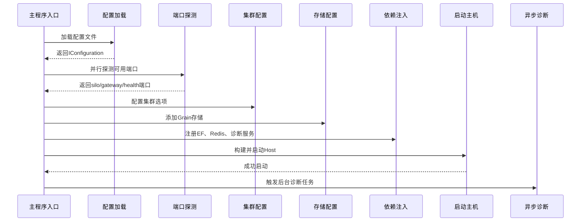
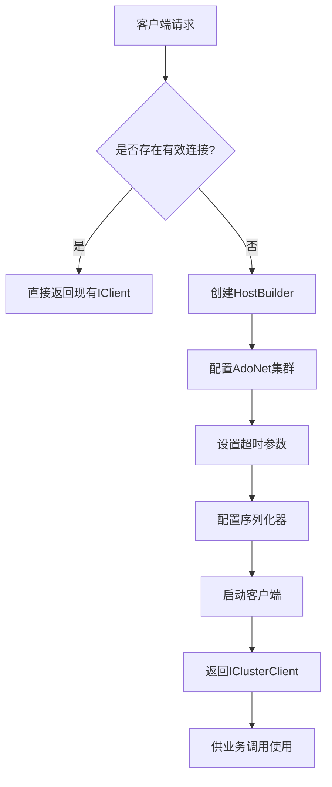

# 技术栈与依赖

<cite>
**本文档中引用的文件**   
- [OrleansClient.cs](file://Horizon.Game.Core/OrleansClient.cs)
- [Program.cs](file://Horizon.Orleans.Silo/Program.cs)
- [Program.cs](file://Horizon.Game.Gateway/Program.cs)
- [OrleansClusteringDbOptions.cs](file://Horizon.Core/Options/OrleansClusteringDbOptions.cs)
- [OrleansConst.cs](file://Horizon.Core.Abstract/OrleansConst.cs)
- [RedisCache.cs](file://Horizon.Strategy.Storage.Redis/RedisCache.cs)
- [GameProfile.cs](file://Horizon.Mapper/GameProfile.cs)
- [Startup.cs](file://Horizon.WebApi/Startup.cs)
- [Horizon.Entities.csproj](file://Horizon.Entities/Horizon.Entities.csproj)
- [Horizon.Orleans.Silo.csproj](file://Horizon.Orleans.Silo/Horizon.Orleans.Silo.csproj)
</cite>

## 目录
1. [技术栈概览](#技术栈概览)
2. [外部依赖与版本兼容性](#外部依赖与版本兼容性)
3. Orleans框架配置与常量作用
4. Orleans Silo启动流程分析
5. Orleans客户端连接建立过程
6. 依赖注入配置示例
7. 潜在依赖冲突与升级注意事项

## 技术栈概览

本项目采用现代化分布式架构，核心技术栈包括：使用Orleans框架构建基于Actor模型的分布式服务，通过Entity Framework Core实现数据库操作，利用ASP.NET Core提供Web API接口，借助Redis实现高性能缓存与会话存储，并通过AutoMapper完成DTO与实体间的映射转换。系统整体设计遵循微服务理念，各组件间通过消息传递和远程调用进行通信。

**Section sources**
- [OrleansClient.cs](file://Horizon.Game.Core/OrleansClient.cs#L1-L167)
- [Program.cs](file://Horizon.Orleans.Silo/Program.cs#L1-L530)
- [Program.cs](file://Horizon.Game.Gateway/Program.cs#L1-L238)

## 外部依赖与版本兼容性

项目依赖多个关键NuGet包，其版本信息如下：
- **Microsoft.EntityFrameworkCore**: 版本9.0.1，用于Entity Framework Core ORM功能。
- **Microsoft.Orleans.Server**: 版本9.1.2，提供Orleans核心运行时支持。
- **OrleansDashboard**: 版本8.2.0，用于可视化监控Orleans集群状态。
- **Caching.CSRedis / CSRedisCore**: 分别为3.8.800和3.8.804版本，提供Redis客户端访问能力。
- **AutoMapper**: 集成于`Horizon.Mapper`项目中，用于对象映射。

所有依赖项均针对.NET 9.0目标框架进行了兼容性验证，确保在当前开发环境中稳定运行。

**Section sources**
- [Horizon.Entities.csproj](file://Horizon.Entities/Horizon.Entities.csproj#L1-L61)
- [Horizon.Orleans.Silo.csproj](file://Horizon.Orleans.Silo/Horizon.Orleans.Silo.csproj#L1-L73)

## Orleans框架配置与常量作用

### Orleans配置常量说明

在`Horizon.Core.Abstract`命名空间下的`OrleansConst.cs`文件中定义了多个关键常量，这些常量在系统中起到重要作用：

```csharp
public static class OrleansConst
{
    public const string PubSubStore = nameof(PubSubStore);
    public const string GameStore = nameof(GameStore);
    public const string PassportStore = nameof(PassportStore);
    public const string CommonMessageStreamProvider = nameof(CommonMessageStreamProvider);
}
```

其中：
- `PubSubStore`: 用于标识发布/订阅模式的数据存储区，支持事件驱动架构中的消息广播。
- `GameStore`: 专用于游戏相关Grain状态持久化的存储名称，隔离游戏核心数据。
- `PassportStore`: 用户认证与通行证信息的专用存储区域，保障安全敏感数据独立管理。
- `CommonMessageStreamProvider`: 定义通用消息流提供者，支持跨Grain的消息通信机制。

这些常量作为配置键值，在Silo初始化时被用于注册不同的AdoNetGrainStorage实例，确保不同类型的状态数据能够按需持久化到数据库。

**Section sources**
- [OrleansConst.cs](file://Horizon.Core.Abstract/OrleansConst.cs#L1-L24)

## Orleans Silo启动流程分析

### Silo启动主流程

`Horizon.Orleans.Silo`项目的`Program.cs`文件实现了Silo主机的完整启动逻辑。启动过程主要包括以下步骤：

1. **日志与配置初始化**：首先创建日志工厂并加载全局配置（`appsettings.json`），获取数据库、集群等核心参数。
2. **端口分配优化**：并行探测可用端口用于Silo通信、网关接入及健康检查服务。
3. **Orleans集群配置**：根据配置选择使用AdoNet或本地主机方式进行集群协调，设置ClusterId和服务ID。
4. **存储层配置**：为不同业务场景（如用户、游戏）注册对应的AdoNetGrainStorage，并指定序列化器。
5. **服务注册与依赖注入**：注册EF上下文、Redis服务、自定义诊断服务等，并应用延迟初始化策略以提升启动性能。
6. **仪表盘与健康检查**：启用Orleans Dashboard监控界面，并配置健康检查端点。
7. **异步诊断执行**：启动后异步运行网关连接诊断任务，避免阻塞主启动流程。

该流程充分考虑了生产环境下的稳定性需求，通过超时控制、异常捕获和日志记录保障了Silo的可靠启动。



**Diagram sources **
- [Program.cs](file://Horizon.Orleans.Silo/Program.cs#L1-L530)

**Section sources**
- [Program.cs](file://Horizon.Orleans.Silo/Program.cs#L1-L530)

## Orleans客户端连接建立过程

### 客户端连接机制

Orleans客户端连接主要由`Horizon.Game.Core`项目中的`OrleansClient`类负责。其实现逻辑如下：

1. **单例模式管理**：通过静态`Instance`属性保证全局唯一客户端实例。
2. **配置读取**：从`appsettings.json`中读取`ClusteringSiloOptions`和`ClusterOptions`。
3. **连接复用检测**：每次请求前检查现有客户端是否已连接且有效，避免重复建立连接。
4. **客户端构建**：使用`HostBuilder.UseOrleansClient()`配置客户端，包含：
   - 使用AdoNet进行集群发现
   - 设置合理的响应超时（30秒）和调试超时（5分钟）
   - 配置网关刷新周期为10分钟以减少网络开销
   - 注册Newtonsoft.Json序列化器以支持特定命名空间类型
5. **异常处理与资源释放**：在析构函数中异步释放客户端资源，确保连接正常关闭。

此外，`Horizon.Game.Gateway`项目也通过`UseOrleansClient()`扩展方法建立了到Silo的连接，用于处理来自游戏客户端的消息路由。



**Diagram sources **
- [OrleansClient.cs](file://Horizon.Game.Core/OrleansClient.cs#L1-L167)
- [Program.cs](file://Horizon.Game.Gateway/Program.cs#L1-L238)

**Section sources**
- [OrleansClient.cs](file://Horizon.Game.Core/OrleansClient.cs#L1-L167)
- [Program.cs](file://Horizon.Game.Gateway/Program.cs#L1-L238)

## 依赖注入配置示例

### 核心服务注册

在Silo启动过程中，通过`ConfigureApplicationServices`方法集中注册了主要服务：

```csharp
private static void ConfigureApplicationServices(IServiceCollection services)
{
    // 配置EF上下文池
    services.AddDbContextPool<BasicEntityContext>(...);
    services.AddDbContextPool<GameEntityContext>(...);

    // 添加数据服务提供者
    services.AddDataServiceProvider();

    // 添加Redis服务提供者
    services.AddRedisServiceProvider();

    // 注册配置选项
    services.ConfigureOptions();

    // 添加AutoMapper配置
    services.AddMappingProfiles();
}
```

其中：
- `AddDbContextPool`: 使用连接池优化EF上下文性能。
- `AddRedisServiceProvider`: 封装了`RedisCache`的注册逻辑，便于统一管理Redis连接。
- `AddMappingProfiles`: 自动扫描并注册所有Profile类（如`GameProfile`），实现DTO与实体的自动映射。

#### AutoMapper配置示例

以`GameProfile.cs`为例，展示了如何定义映射规则：

```csharp
public class GameProfile : Profile
{
    public GameProfile()
    {
        CreateMap<CreateCharacterRequest, CharacterEntity>();
        CreateMap<CharacterEntity, CharacterInfo>()
            .BeforeMap((src, dest) => dest.CharacterId = (ulong)src.Id);
        CreateMap<ServerEntity, ServerInfo>();
    }
}
```

此配置实现了请求对象到领域模型以及领域模型到输出DTO的双向映射，极大简化了数据转换代码。

**Section sources**
- [Program.cs](file://Horizon.Orleans.Silo/Program.cs#L1-L530)
- [ServiceCollectionExtensions.cs](file://Horizon.Core/ServiceCollectionExtensions.cs#L1-L61)
- [GameProfile.cs](file://Horizon.Mapper/GameProfile.cs#L1-L30)

## 潜在依赖冲突与升级注意事项

### 已知依赖风险点

1. **Orleans版本混合问题**：项目同时引用了`Microsoft.Orleans.*` 9.1.2 和第三方`Orleans.Persistence.Redis` 7.0.0，后者可能不完全兼容新版Orleans序列化机制，建议统一使用官方包。
2. **Redis客户端多样性**：同时引入`Caching.CSRedis`、`CSRedisCore`和`Microsoft.Extensions.Caching.Redis`，可能导致连接管理混乱，应统一为单一客户端库。
3. **.NET 9预览依赖**：部分包如EF Core 9.0.1仍处于预览阶段，正式发布前可能存在Breaking Changes，需密切关注更新日志。
4. **Newtonsoft.Json与System.Text.Json共存**：虽然通过条件序列化器解决了兼容性问题，但在高并发场景下可能影响性能，建议逐步迁移到STJ。

### 升级建议

- 在升级Orleans主版本时，务必同步更新所有相关组件（如Dashboard、AdoNet插件）至兼容版本。
- Redis集成推荐优先使用官方`Microsoft.Orleans.Persistence.Redis`包，避免第三方维护滞后带来的安全隐患。
- AutoMapper应保持与项目生命周期一致的更新节奏，避免因映射规则变更导致运行时错误。
- 所有数据库迁移脚本（Migrations）应在升级EF Core后重新评估，必要时重建快照以防止设计时异常。

**Section sources**
- [Horizon.Orleans.Silo.csproj](file://Horizon.Orleans.Silo/Horizon.Orleans.Silo.csproj#L1-L73)
- [RedisCache.cs](file://Horizon.Strategy.Storage.Redis/RedisCache.cs#L1-L485)