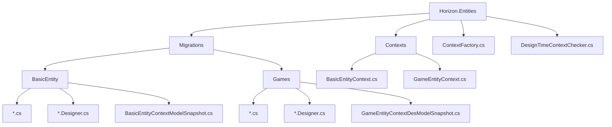
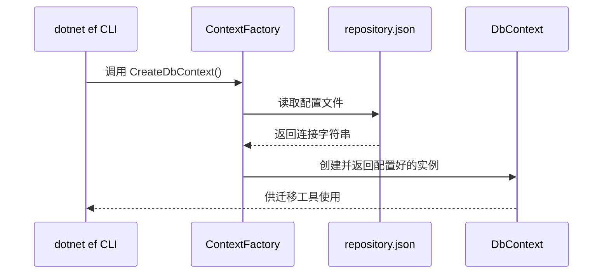

<cite>
**本文档中引用的文件**
- [BasicEntityContext.cs](file://Horizon.Entities/BasicEntityContext.cs)
- [GameEntityContext.cs](file://Horizon.Entities/GameEntityContext.cs)
- [ContextFactory.cs](file://Horizon.Entities/ContextFactory.cs)
- [DesignTimeContextChecker.cs](file://Horizon.Entities/DesignTimeContextChecker.cs)
- [BasicEntityContextModelSnapshot.cs](file://Horizon.Entities/Migrations/BasicEntity/BasicEntityContextModelSnapshot.cs)
- [GameEntityContextDesModelSnapshot.cs](file://Horizon.Entities/Migrations/Games/GameEntityContextDesModelSnapshot.cs)
- [20231009172517_Initial.cs](file://Horizon.Entities/Migrations/BasicEntity/20231009172517_Initial.cs)
- [20250209164754_Init.cs](file://Horizon.Entities/Migrations/BasicEntity/20250209164754_Init.cs)
- [20250714162117_xiugaiEntity.cs](file://Horizon.Entities/Migrations/Games/20250714162117_xiugaiEntity.cs)
</cite>

## 目录
1. [引言](#引言)
2. [项目结构分析](#项目结构分析)
3. [核心组件分析](#核心组件分析)
4. [EF Core迁移操作指南](#ef-core迁移操作指南)
5. [迁移版本控制策略](#迁移版本控制策略)
6. [应用迁移到不同环境](#应用迁移到不同环境)
7. [Migrations文件夹与快照分析](#migrations文件夹与快照分析)
8. [设计时服务与ContextFactory](#设计时服务与contextfactory)
9. [结论](#结论)

## 引言

本指南旨在为开发团队提供一套完整的EF Core数据库迁移操作规范。文档详细阐述了如何为`BasicEntityContext`和`GameEntityContext`两个数据上下文生成和管理数据库迁移，涵盖了从初始创建、后续修改到生产环境部署的全流程。通过分析代码库中的具体实现，本文将解释迁移工具如何与`ContextFactory`协同工作，以及`ModelSnapshot`在确保迁移一致性方面所扮演的关键角色。

## 项目结构分析

项目采用分层架构，数据访问层（Data Access Layer）位于`Horizon.Entities`项目中。该层的核心是实体模型（位于`Horizon.Model`命名空间）和数据上下文（DbContext）。数据库迁移脚本被组织在`Horizon.Entities/Migrations`目录下，并进一步按功能拆分为`BasicEntity`和`Games`子目录，实现了关注点分离。



**Diagram sources**
- [Horizon.Entities/Migrations/BasicEntity](file://Horizon.Entities/Migrations/BasicEntity)
- [Horizon.Entities/Migrations/Games](file://Horizon.Entities/Migrations/Games)

**Section sources**
- [Horizon.Entities](file://Horizon.Entities)

## 核心组件分析

### 数据上下文 (DbContext)

系统定义了两个主要的数据上下文：`BasicEntityContext`用于管理基础业务数据（如用户、组织），而`GameEntityContext`则负责游戏相关的实体（如角色、物品）。每个上下文都通过`DbSet<T>`属性公开其对应的实体集合。

此外，代码中还存在名为`BasicEntityContextDes`和`GameEntityContextDes`的设计时专用上下文。这些类继承自主上下文并实现了`IDesignTimeDbContextFactory<T>`接口，专门用于在设计时（如执行`Add-Migration`命令时）配置连接字符串。这种分离确保了运行时的依赖注入配置不会干扰迁移工具的执行。

### ContextFactory

`ContextFactory<T>`是一个泛型工厂类，它实现了`IDesignTimeDbContextFactory<T>`接口。这是EF Core迁移工具能够实例化`DbContext`的关键。当运行迁移命令时，EF Core会查找实现了此接口的类，并调用其`CreateDbContext`方法来获取一个已正确配置的上下文实例。

**Section sources**
- [BasicEntityContext.cs](file://Horizon.Entities/BasicEntityContext.cs)
- [GameEntityContext.cs](file://Horizon.Entities/GameEntityContext.cs)
- [ContextFactory.cs](file://Horizon.Entities/ContextFactory.cs)

## EF Core迁移操作指南

### 生成新的迁移文件

要为特定的数据上下文生成新的迁移，必须使用`dotnet ef migrations add`命令，并明确指定目标上下文和工厂。

#### 为 BasicEntityContext 生成迁移

```bash
dotnet ef migrations add <MigrationName> `
--project Horizon.Entities `
--startup-project Horizon.WebApi `
--context BasicEntityContext `
--configuration Debug `
--verbose
```

#### 为 GameEntityContext 生成迁移

```bash
dotnet ef migrations add <MigrationName> `
--project Horizon.Entities `
--startup-project Horizon.WebApi `
--context GameEntityContext `
--configuration Debug `
--verbose
```

**关键参数说明:**
- `--project`: 指定包含`DbContext`和迁移的项目。
- `--startup-project`: 指定启动项目，迁移工具需要从中加载配置（如`repository.json`）。
- `--context`: 明确指定要使用的`DbContext`类型。
- `<MigrationName>`: 替换为有意义的迁移名称，例如`AddUserProfileFields`或`xiugaiEntity`。

执行此命令后，EF Core会：
1. 使用`ContextFactory`创建一个`DbContext`实例。
2. 将当前`DbContext`的模型与上一次迁移的`ModelSnapshot`进行比较。
3. 生成一个新的`.cs`文件（包含`Up`和`Down`方法）和一个`.Designer.cs`文件。

**Section sources**
- [ContextFactory.cs](file://Horizon.Entities/ContextFactory.cs#L16-L66)
- [BasicEntityContext.cs](file://Horizon.Entities/BasicEntityContext.cs#L95-L165)
- [GameEntityContext.cs](file://Horizon.Entities/GameEntityContext.cs#L110-L187)

## 迁移版本控制策略

迁移文件的命名遵循`<时间戳>_<迁移名称>.cs`的模式，这确保了它们在源代码管理（如Git）中的有序性。

### 初始迁移 (Initial)

`BasicEntity`文件夹下的`20231009172517_Initial.cs`代表了该数据库的初始状态。`Up`方法包含了创建所有基础表（如`Basic_Sys_Applications`, `Basic_Sys_User`等）的SQL语句。这个迁移是整个数据库演进的起点。

```csharp
// 示例：Initial迁移的部分内容
migrationBuilder.CreateTable(
    name: "Basic_Sys_Applications",
    columns: table => new { ... },
    constraints: table => { ... });
```

### 后续修改迁移 (xiugaiEntity)

`Games`文件夹下的`20250714162117_xiugaiEntity.cs`代表了一次对游戏数据库的修改。它的`Up`方法包含了为新功能（如背包、角色技能、聊天系统）创建新表的SQL语句。这类迁移是在初始结构建立后，为了添加新功能或修改现有结构而生成的。

```csharp
// 示例：xiugaiEntity迁移的部分内容
migrationBuilder.CreateTable(
    name: "Game_HunduShijie_Bag",
    columns: table => new { ... },
    constraints: table => { ... });
```

**最佳实践:**
- **原子性**: 每个迁移应只包含一个逻辑变更。
- **描述性命名**: 迁移名称应清晰地描述其目的。
- **代码审查**: 所有迁移文件都应经过同行评审，以确保SQL语句的正确性和安全性。

**Section sources**
- [20231009172517_Initial.cs](file://Horizon.Entities/Migrations/BasicEntity/20231009172517_Initial.cs#L1-L390)
- [20250714162117_xiugaiEntity.cs](file://Horizon.Entities/Migrations/Games/20250714162117_xiugaiEntity.cs#L1-L1020)

## 应用迁移到不同环境

生成迁移文件后，需要将其应用到目标数据库环境中。

### 更新开发环境

在开发阶段，通常直接使用`Update-Database`命令将最新的迁移应用到本地数据库。

```bash
# 更新 BasicEntityContext 的数据库
dotnet ef database update `
--project Horizon.Entities `
--startup-project Horizon.WebApi `
--context BasicEntityContext `
--configuration Debug

# 更新 GameEntityContext 的数据库
dotnet ef database update `
--project Horizon.Entities `
--startup-project Horizon.WebApi `
--context GameEntityContext `
--configuration Debug
```

### 部署到生产环境

直接在生产服务器上运行`Update-Database`命令风险极高。推荐的做法是生成SQL脚本，然后由DBA审核并手动执行。

```bash
# 为 BasicEntityContext 生成从 Initial 到最新版本的SQL脚本
dotnet ef migrations script "20231009172517_Initial" --output basic_update.sql `
--project Horizon.Entities `
--startup-project Horizon.WebApi `
--context BasicEntityContext

# 为 GameEntityContext 生成完整的SQL脚本
dotnet ef migrations script --output game_full_deploy.sql `
--project Horizon.Entities `
--startup-project Horizon.WebApi `
--context GameEntityContext
```

生成的SQL脚本可以安全地纳入CI/CD流程或由运维团队在维护窗口期间执行。

**Section sources**
- [BasicEntityContext.cs](file://Horizon.Entities/BasicEntityContext.cs#L117-L127)
- [GameEntityContext.cs](file://Horizon.Entities/GameEntityContext.cs#L121-L132)

## Migrations文件夹与快照分析

### .Designer.cs 文件

每个迁移都附带一个`.Designer.cs`文件。这个文件由EF Core工具自动生成，不应手动编辑。它包含了迁移的元数据，如迁移ID、产品版本和目标模型的哈希值。这些信息对于EF Core跟踪数据库的当前状态至关重要。

### ModelSnapshot 文件

`ModelSnapshot`是EF Core迁移机制的核心。`BasicEntityContextModelSnapshot.cs`和`GameEntityContextDesModelSnapshot.cs`文件分别保存了`BasicEntityContext`和`GameEntityContextDes`这两个上下文的**当前**模型的完整定义。

```csharp
// 示例：ModelSnapshot 中定义一个实体
modelBuilder.Entity("Horizon.Model.Apps", b =>
{
    b.Property<long>("Id")
        .ValueGeneratedOnAdd()
        .HasColumnType("bigint");
    // ... 其他属性和配置
});
```

**作用:**
1. **变更检测**: 当你下次运行`Add-Migration`时，EF Core会重新构建内存中的模型，并将其与`ModelSnapshot`中的模型进行比较，从而精确地计算出需要生成哪些`Up`和`Down` SQL语句。
2. **一致性保证**: 它确保了迁移历史与代码模型的一致性。如果`ModelSnapshot`丢失或损坏，EF Core将无法正确计算增量变更。

**重要提示:** `GameEntityContextDesModelSnapshot.cs`对应的是`GameEntityContextDes`，这是一个设计时上下文，但其模型与`GameEntityContext`完全一致，因此快照是有效的。

**Diagram sources**
- [BasicEntityContextModelSnapshot.cs](file://Horizon.Entities/Migrations/BasicEntity/BasicEntityContextModelSnapshot.cs#L1-L696)
- [GameEntityContextDesModelSnapshot.cs](file://Horizon.Entities/Migrations/Games/GameEntityContextDesModelSnapshot.cs#L1-L3383)

**Section sources**
- [BasicEntityContextModelSnapshot.cs](file://Horizon.Entities/Migrations/BasicEntity/BasicEntityContextModelSnapshot.cs)
- [GameEntityContextDesModelSnapshot.cs](file://Horizon.Entities/Migrations/Games/GameEntityContextDesModelSnapshot.cs)

## 设计时服务与ContextFactory

### ContextFactory 的作用

`ContextFactory<T>`是连接EF Core命令行工具和应用程序配置的桥梁。当`dotnet ef`命令运行时，它并不知道如何获取数据库连接字符串（因为这通常由ASP.NET Core的依赖注入容器在运行时提供）。`ContextFactory`解决了这个问题。

其`CreateDbContext`方法通过以下步骤工作：
1. 读取`repository.json`配置文件。
2. 获取指定的连接字符串（如`BasicSqlServer`或`GameSqlServer`）。
3. 使用`DbContextOptionsBuilder`配置一个`DbContextOptions`对象。
4. 返回一个使用该选项的新`DbContext`实例。

### DesignTimeContextChecker

`DesignTimeContextChecker.IsDesignTime()`方法是一个辅助函数，用于判断当前是否处于设计时环境（例如，正在执行迁移命令）。在`BasicEntityContextDes`和`GameEntityContextDes`的`OnConfiguring`方法中，它被用来确保只有在设计时才设置连接字符串，避免了与运行时配置的冲突。



**Diagram sources**
- [ContextFactory.cs](file://Horizon.Entities/ContextFactory.cs#L16-L66)
- [DesignTimeContextChecker.cs](file://Horizon.Entities/DesignTimeContextChecker.cs#L1-L15)

**Section sources**
- [ContextFactory.cs](file://Horizon.Entities/ContextFactory.cs)
- [DesignTimeContextChecker.cs](file://Horizon.Entities/DesignTimeContextChecker.cs)

## 结论

本指南详细阐述了项目中EF Core迁移的完整生命周期。成功实施迁移的关键在于理解各组件间的协作关系：`ContextFactory`为迁移工具提供必要的`DbContext`实例，`ModelSnapshot`确保了模型变更的精确追踪，而清晰的版本控制策略则保障了数据库演进的可追溯性。遵循本指南的操作流程，开发团队可以安全、高效地管理数据库结构变更，无论是应用于开发环境还是严格的生产部署。