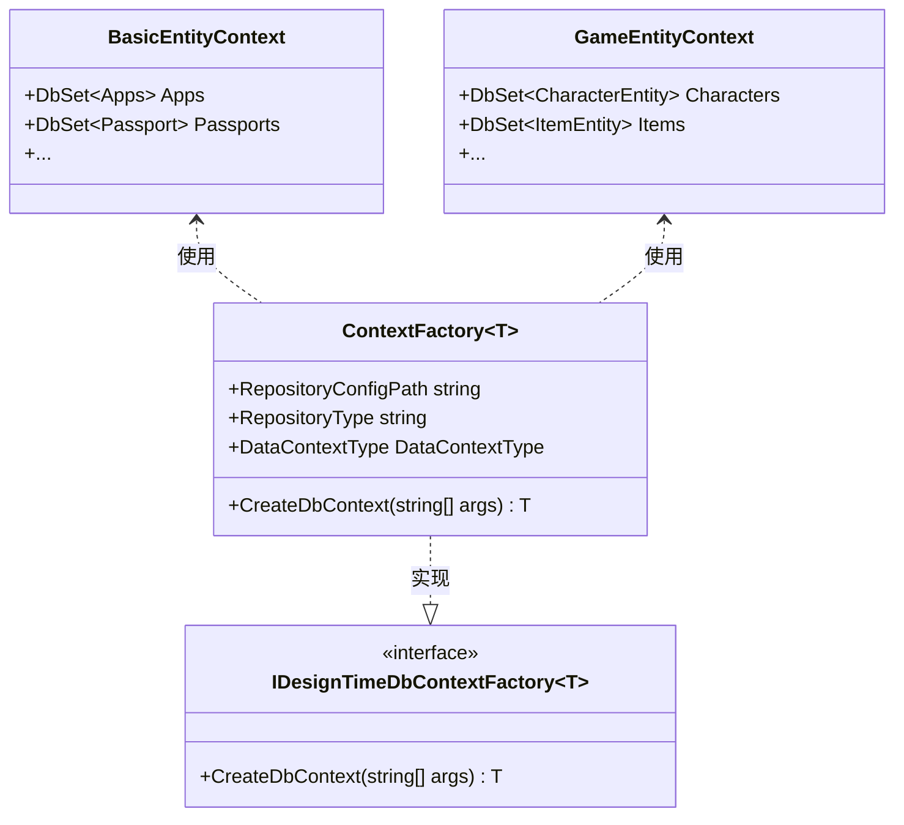
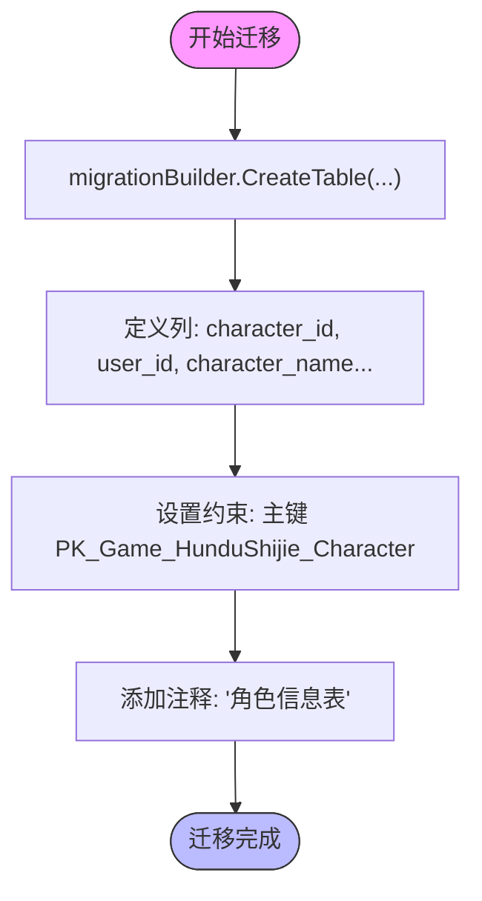

# 迁移文件生成

<cite>
**Referenced Files in This Document**   
- [BasicEntityContext.cs](file://Horizon.Entities/BasicEntityContext.cs)
- [GameEntityContext.cs](file://Horizon.Entities/GameEntityContext.cs)
- [ContextFactory.cs](file://Horizon.Entities/ContextFactory.cs)
- [repository.json](file://Horizon.Entities/repository.json)
- [20250209164754_Init.cs](file://Horizon.Entities/Migrations/BasicEntity/20250209164754_Init.cs)
- [20250714162117_xiugaiEntity.cs](file://Horizon.Entities/Migrations/Games/20250714162117_xiugaiEntity.cs)
</cite>

## 目录
1. [引言](#引言)
2. [迁移命令使用指南](#迁移命令使用指南)
3. [上下文选择策略](#上下文选择策略)
4. [设计时服务配置](#设计时服务配置)
5. [迁移脚本内容示例](#迁移脚本内容示例)
6. [环境命名规范](#环境命名规范)
7. [结论](#结论)

## 引言

本文档详细说明了如何为 `BasicEntityContext` 和 `GameEntityContext` 两个数据上下文生成新的迁移脚本。文档涵盖了在不同环境下进行数据库迁移的完整流程，包括迁移命令的使用、上下文的选择策略、设计时服务的配置方法以及迁移脚本的实际内容示例。通过本指南，开发人员可以确保 EF Core 工具链能够正确识别并实例化对应的 DbContext，从而安全地管理数据库架构变更。

**Section sources**
- [BasicEntityContext.cs](file://Horizon.Entities/BasicEntityContext.cs#L95-L165)
- [GameEntityContext.cs](file://Horizon.Entities/GameEntityContext.cs#L110-L187)

## 迁移命令使用指南

要为特定的数据上下文生成新的迁移脚本，应使用 Entity Framework Core 提供的 `Add-Migration` 命令。该命令会根据当前模型与数据库之间的差异创建一个新的迁移类。

基本语法如下：
```
dotnet ef migrations add <MigrationName> --context <DbContextClassName>
```

其中 `<MigrationName>` 是您为此次迁移指定的名称，而 `<DbContextClassName>` 则是目标数据上下文的类名。

例如，为 `BasicEntityContext` 添加一个名为 "AddNewField" 的迁移：
```
dotnet ef migrations add AddNewField --context BasicEntityContext
```

同样地，为 `GameEntityContext` 添加迁移：
```
dotnet ef migrations add AddIndexToCharacterTable --context GameEntityContext
```

这些命令将分别在 `Migrations/BasicEntity` 和 `Migrations/Games` 目录下生成相应的迁移文件。

**Section sources**
- [XingguangEntityContext.cs](file://Horizon.Entities/XingguangEntityContext.cs#L87)

## 上下文选择策略

在项目中存在多个 `DbContext` 实例的情况下，必须明确指定要操作的上下文。这通过 `--context` 参数实现。选择正确的上下文至关重要，因为它决定了迁移将基于哪个模型进行。

- **BasicEntityContext**: 用于管理基础数据实体，如用户、组织、护照等。
- **GameEntityContext**: 专门处理游戏相关的实体，如角色、物品、技能、聊天记录等。

当执行迁移命令时，EF Core 会查找实现了 `IDesignTimeDbContextFactory<T>` 接口的工厂类来实例化指定的 `DbContext`。在本项目中，通用的 `ContextFactory<T>` 被用来支持所有类型的 `DbContext`。



**Diagram sources**
- [ContextFactory.cs](file://Horizon.Entities/ContextFactory.cs#L16-L66)
- [BasicEntityContext.cs](file://Horizon.Entities/BasicEntityContext.cs#L95-L165)
- [GameEntityContext.cs](file://Horizon.Entities/GameEntityContext.cs#L110-L187)

**Section sources**
- [ContextFactory.cs](file://Horizon.Entities/ContextFactory.cs#L16-L66)
- [BasicEntityContext.cs](file://Horizon.Entities/BasicEntityContext.cs#L95-L165)
- [GameEntityContext.cs](file://Horizon.Entities/GameEntityContext.cs#L110-L187)

## 设计时服务配置

为了使 EF Core 工具能够在设计时（即运行 `Add-Migration` 或 `Update-Database` 命令时）正确创建 `DbContext` 实例，需要配置设计时服务。这是通过实现 `IDesignTimeDbContextFactory<T>` 接口完成的。

在本项目中，`ContextFactory<T>` 类提供了这一功能。它从 `repository.json` 文件中读取连接字符串，并根据泛型参数 `T` 创建相应类型的 `DbContext`。

关键配置点包括：

1. **连接字符串源**: 所有连接字符串都定义在 `repository.json` 文件的 `ConnectionStrings` 节点下。
2. **数据库类型**: 支持多种数据库类型，但当前主要使用 SQL Server。
3. **配置路径**: 默认配置文件路径为 `repository.json`，可在运行时通过参数覆盖。

以下是 `repository.json` 中的相关配置片段：

```json
{
  "ConnectionStrings": {
    "BasicSqlServer": "Data Source=.;Initial Catalog=Basic;...",
    "GameSqlServer": "Data Source=.;Initial Catalog=Game;..."
  }
}
```

此配置确保了 `BasicEntityContext` 和 `GameEntityContext` 分别连接到各自的数据库。

**Section sources**
- [ContextFactory.cs](file://Horizon.Entities/ContextFactory.cs#L16-L66)
- [repository.json](file://Horizon.Entities/repository.json#L1-L12)

## 迁移脚本内容示例

迁移脚本由 `Up()` 和 `Down()` 两个方法组成，分别代表应用和回滚迁移的操作。

### BasicEntityContext 迁移示例

对于 `BasicEntityContext`，初始迁移可能仅包含框架代码，实际的表结构变更将在后续迁移中添加。

```csharp
protected override void Up(MigrationBuilder migrationBuilder)
{
    // 在此处添加创建新字段、修改列等操作
}

protected override void Down(MigrationBuilder migrationBuilder)
{
    // 在此处添加撤销上述变更的操作
}
```

### GameEntityContext 迁移示例

`GameEntityContext` 的迁移脚本展示了完整的表结构定义。以下是从 `xiugaiEntity` 迁移中提取的部分 `Up` 方法内容：

```csharp
migrationBuilder.CreateTable(
    name: "Game_HunduShijie_Character",
    columns: table => new
    {
        character_id = table.Column<long>(type: "bigint", nullable: false, comment: "角色ID")
            .Annotation("SqlServer:Identity", "1, 1"),
        user_id = table.Column<long>(type: "bigint", nullable: false, comment: "用户ID"),
        character_name = table.Column<string>(type: "nvarchar(20)", nullable: false, comment: "角色名"),
        level = table.Column<int>(type: "int", nullable: false, comment: "等级"),
        experience = table.Column<long>(type: "bigint", nullable: false, comment: "经验值"),
        profession = table.Column<int>(type: "int", nullable: false, comment: "职业"),
        gender = table.Column<int>(type: "int", nullable: false, comment: "性别"),
        // ... 其他字段
    },
    constraints: table =>
    {
        table.PrimaryKey("PK_Game_HunduShijie_Character", x => x.character_id);
    },
    comment: "角色信息表");
```

`Down` 方法则负责删除这些表：

```csharp
protected override void Down(MigrationBuilder migrationBuilder)
{
    migrationBuilder.DropTable(name: "Game_HunduShijie_Character");
    // ... 删除其他相关表
}
```

这些方法共同构成了可逆的数据库架构变更。



**Diagram sources**
- [20250714162117_xiugaiEntity.cs](file://Horizon.Entities/Migrations/Games/20250714162117_xiugaiEntity.cs#L20-L80)

**Section sources**
- [20250209164754_Init.cs](file://Horizon.Entities/Migrations/BasicEntity/20250209164754_Init.cs#L10-L22)
- [20250714162117_xiugaiEntity.cs](file://Horizon.Entities/Migrations/Games/20250714162117_xiugaiEntity.cs#L20-L800)

## 环境命名规范

为确保迁移过程的清晰性和可追溯性，建议采用统一的命名规范，特别是在不同的开发环境中。

### 命名约定

- **开发环境**: 使用描述性名称，如 `AddEmailFieldToUser` 或 `CreateChatMessageTable`。
- **测试环境**: 可以在名称后加上 `-Test` 后缀，如 `AddEmailFieldToUser-Test`。
- **生产环境**: 使用版本号或日期前缀，如 `V1.2.0_AddEmailField` 或 `20250714_AddChatIndex`。

### 最佳实践

1. **语义化命名**: 名称应准确反映迁移的目的。
2. **避免空迁移**: 确保每次迁移都有实际的数据库变更。
3. **定期审查**: 定期检查迁移历史，合并不必要的小迁移。
4. **团队协作**: 在团队开发中，协调好迁移顺序，避免冲突。

遵循这些规范有助于维护一个清晰、有序的数据库演进历史。

## 结论

本文档全面介绍了如何使用 `Add-Migration` 命令为 `BasicEntityContext` 和 `GameEntityContext` 生成迁移脚本。通过正确配置 `ContextFactory` 并遵循命名规范，开发团队可以在不同环境中安全、高效地管理数据库架构变更。关键在于理解设计时服务的作用，并利用 EF Core 的强大功能来自动化这一过程。