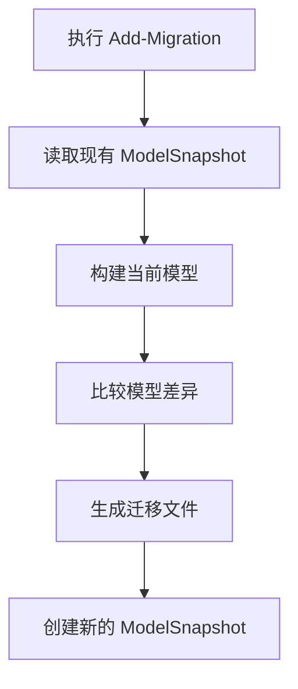
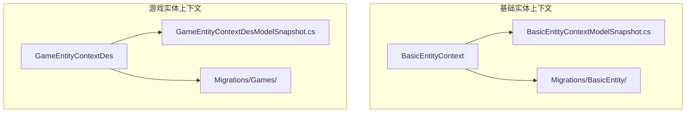

# 迁移文件结构解析

<cite>
**Referenced Files in This Document**   
- [20231009172517_Initial.Designer.cs](file://Horizon.Entities/Migrations/BasicEntity/20231009172517_Initial.Designer.cs)
- [xiugaiEntity.Designer.cs](file://Horizon.Entities/Migrations/Games/20250714162117_xiugaiEntity.Designer.cs)
- [BasicEntityContextModelSnapshot.cs](file://Horizon.Entities/Migrations/BasicEntity/BasicEntityContextModelSnapshot.cs)
- [GameEntityContextDesModelSnapshot.cs](file://Horizon.Entities/Migrations/Games/GameEntityContextDesModelSnapshot.cs)
- [BasicEntityContext.cs](file://Horizon.Entities/BasicEntityContext.cs)
- [GameEntityContext.cs](file://Horizon.Entities/GameEntityContext.cs)
</cite>

## 目录
1. [引言](#引言)
2. [迁移文件中的.Designer.cs自动生成部分](#迁移文件中的designer.cs自动生成部分)
3. [主迁移类与.Designer.cs的关系](#主迁移类与designer.cs的关系)
4. [ModelSnapshot文件在增量迁移中的关键角色](#modelsnapshot文件在增量迁移中的关键角色)
5. [Add-Migration时快照的更新机制](#add-migration时快照的更新机制)
6. [多上下文项目中的模型跟踪策略](#多上下文项目中的模型跟踪策略)
7. [结论](#结论)

## 引言

本文档旨在深入分析.NET Entity Framework Core中迁移文件的结构和工作机制，重点解析`.Designer.cs`自动生成部分的作用机制、`ModelSnapshot`文件在增量迁移中的关键角色以及多上下文项目中的模型跟踪策略。通过分析`BasicEntityContextModelSnapshot.cs`和`GameEntityContextDesModelSnapshot.cs`等具体文件，阐明这些组件如何协同工作以确保数据库模式变更的准确性和一致性。

## 迁移文件中的.Designer.cs自动生成部分

`.Designer.cs`文件是Entity Framework Core迁移系统生成的自动代码文件，其主要作用是为每个迁移版本捕获当时的数据模型状态。这些文件由EF Core工具在执行`Add-Migration`命令时自动生成，并包含描述数据模型结构的元数据。

### 作用机制

`.Designer.cs`文件的核心功能是实现`IMigrationMetadata`接口，提供关于特定迁移的关键信息：

```csharp
[DbContext(typeof(BasicEntityContext))]
[Migration("20231009172517_Initial")]
partial class Initial
{
    protected override void BuildTargetModel(ModelBuilder modelBuilder)
    {
        // 模型定义代码...
    }
}
```

该文件中的`BuildTargetModel`方法包含了构建特定迁移版本数据模型所需的所有配置。当EF Core需要确定从一个迁移版本到另一个迁移版本之间的差异时，它会使用这些`.Designer.cs`文件中的模型定义来计算变更。

**Section sources**
- [20231009172517_Initial.Designer.cs](file://Horizon.Entities/Migrations/BasicEntity/20231009172517_Initial.Designer.cs#L1-L698)
- [xiugaiEntity.Designer.cs](file://Horizon.Entities/Migrations/Games/20250714162117_xiugaiEntity.Designer.cs#L1-L799)

## 主迁移类与.Designer.cs的关系

主迁移类（如`Initial`或`xiugaiEntity`）与对应的`.Designer.cs`文件之间存在紧密的协作关系。主迁移类负责定义实际的数据库变更操作，而`.Designer.cs`文件则提供变更前后的模型状态。

### 协作流程

1. **主迁移类**：包含`Up()`和`Down()`方法，明确指定要执行的SQL操作。
2. **.Designer.cs文件**：包含`BuildTargetModel()`方法，描述应用此迁移后的最终模型状态。

这种分离设计使得EF Core能够：
- 在应用迁移时，验证目标数据库状态是否与预期模型匹配
- 计算两个迁移版本之间的模型差异，生成正确的升级/降级脚本
- 维护迁移历史的完整性

例如，在`xiugaiEntity.Designer.cs`中，`BuildTargetModel`方法详细描述了修改实体后的完整模型结构，为主迁移类的变更提供了基准。

**Section sources**
- [20231009172517_Initial.Designer.cs](file://Horizon.Entities/Migrations/BasicEntity/20231009172517_Initial.Designer.cs#L1-L698)
- [xiugaiEntity.Designer.cs](file://Horizon.Entities/Migrations/Games/20250714162117_xiugaiEntity.Designer.cs#L1-L799)

## ModelSnapshot文件在增量迁移中的关键角色

`ModelSnapshot`文件是EF Core迁移系统的核心组成部分，用于计算模型差异并生成正确的SQL变更脚本。这些文件代表了当前数据模型的"快照"，是增量迁移的基础。

### 差异计算机制

当执行`Add-Migration`命令时，EF Core会：
1. 读取现有的`ModelSnapshot`文件作为基准模型
2. 根据当前的实体类定义构建新的目标模型
3. 比较基准模型和目标模型之间的差异
4. 生成相应的迁移文件来实现这些差异

`BasicEntityContextModelSnapshot.cs`和`GameEntityContextDesModelSnapshot.cs`文件中的`BuildModel`方法定义了各自上下文的完整模型结构，包括实体、属性、索引、关系等所有元数据。



**Diagram sources **
- [BasicEntityContextModelSnapshot.cs](file://Horizon.Entities/Migrations/BasicEntity/BasicEntityContextModelSnapshot.cs#L15-L692)
- [GameEntityContextDesModelSnapshot.cs](file://Horizon.Entities/Migrations/Games/GameEntityContextDesModelSnapshot.cs#L15-L336)

**Section sources**
- [BasicEntityContextModelSnapshot.cs](file://Horizon.Entities/Migrations/BasicEntity/BasicEntityContextModelSnapshot.cs#L1-L695)
- [GameEntityContextDesModelSnapshot.cs](file://Horizon.Entities/Migrations/Games/GameEntityContextDesModelSnapshot.cs#L1-L799)

## Add-Migration时快照的更新机制

每次运行`Add-Migration`命令时，EF Core都会更新相应的`ModelSnapshot`文件，这一过程对于维护迁移系统的准确性至关重要。

### 更新流程

1. **识别变更**：扫描所有实体类，识别新增、修改或删除的属性和关系
2. **重建模型**：基于最新的实体定义重新构建完整的`ModelBuilder`
3. **覆盖快照**：用新模型覆盖原有的`ModelSnapshot`文件

这个更新机制确保了：
- 下一次迁移将基于最新的模型状态进行差异计算
- 迁移历史保持连续性和一致性
- 避免重复或遗漏的数据库变更

值得注意的是，`ModelSnapshot`文件必须提交到版本控制系统，因为它们是计算未来迁移差异的基准。如果缺少或损坏，可能导致迁移脚本生成错误。

**Section sources**
- [BasicEntityContextModelSnapshot.cs](file://Horizon.Entities/Migrations/BasicEntity/BasicEntityContextModelSnapshot.cs#L1-L695)
- [GameEntityContextDesModelSnapshot.cs](file://Horizon.Entities/Migrations/Games/GameEntityContextDesModelSnapshot.cs#L1-L799)

## 多上下文项目中的模型跟踪策略

在包含多个`DbContext`的项目中，如本例中的`BasicEntityContext`和`GameEntityContextDes`，每个上下文都有独立的迁移历史和模型快照。

### 独立跟踪机制

每个`DbContext`：
- 拥有独立的迁移目录（如`BasicEntity`和`Games`）
- 维护自己的`ModelSnapshot`文件
- 保持独立的迁移历史记录

这种设计允许：
- 不同业务领域的数据库模式独立演进
- 针对特定上下文执行迁移操作
- 避免不同领域之间的迁移冲突



**Diagram sources **
- [BasicEntityContext.cs](file://Horizon.Entities/BasicEntityContext.cs#L95-L165)
- [GameEntityContext.cs](file://Horizon.Entities/GameEntityContext.cs#L17-L107)
- [BasicEntityContextModelSnapshot.cs](file://Horizon.Entities/Migrations/BasicEntity/BasicEntityContextModelSnapshot.cs#L12-L693)
- [GameEntityContextDesModelSnapshot.cs](file://Horizon.Entities/Migrations/Games/GameEntityContextDesModelSnapshot.cs#L12-L329)

**Section sources**
- [BasicEntityContext.cs](file://Horizon.Entities/BasicEntityContext.cs#L1-L169)
- [GameEntityContext.cs](file://Horizon.Entities/GameEntityContext.cs#L1-L191)

## 结论

`.Designer.cs`文件和`ModelSnapshot`文件共同构成了EF Core迁移系统的核心机制。`.Designer.cs`文件为每个迁移版本提供精确的模型定义，而`ModelSnapshot`文件作为增量迁移的基准，确保了数据库模式变更的准确计算。在多上下文项目中，每个上下文独立维护其迁移历史和模型快照，实现了不同业务领域数据库模式的独立演进。将`ModelSnapshot`文件提交到版本控制系统是保证迁移系统可靠性的关键实践，它确保了团队成员之间迁移行为的一致性。