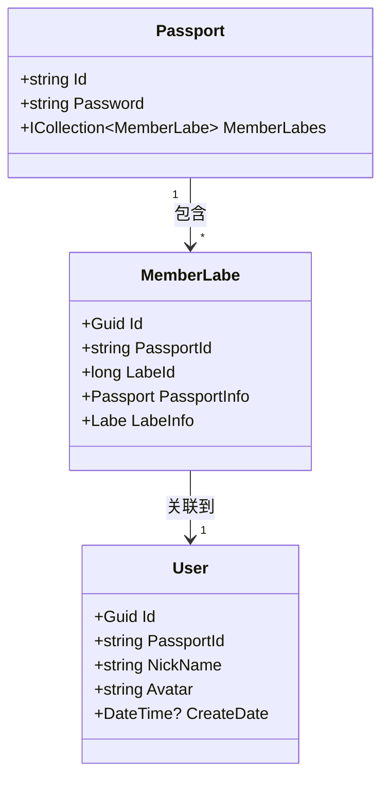

# 基础数据模型

<cite>
**Referenced Files in This Document **   
- [BasicEntityContext.cs](file://Horizon.Entities/BasicEntityContext.cs)
- [Passport.cs](file://Horizon.Model/Basic/Passport.cs)
- [User.cs](file://Horizon.Model/Basic/User.cs)
- [MemberLabe.cs](file://Horizon.Model/Basic/MemberLabe.cs)
- [EntityStorageAttribute.cs](file://Horizon.Core.Abstract/EntityStorageAttribute.cs)
- [IUserModel.cs](file://Horizon.Model/IUserModel.cs)
- [BaseModel.cs](file://Horizon.Core.Abstract/BaseModel.cs)
</cite>

## 目录
1. [核心实体概述](#核心实体概述)
2. [实体关系与数据库设计](#实体关系与数据库设计)
3. [辅助实体说明](#辅助实体说明)
4. [存储配置与EF Core约定](#存储配置与ef-core约定)
5. [典型查询场景示例](#典型查询场景示例)

## 核心实体概述

本系统的基础数据模型围绕两个核心身份实体构建：`Passport`（通行证）和 `User`（用户资料）。`Passport` 作为身份认证的主表，承载了用户最基础的登录凭证信息；而 `User` 则作为用户资料的扩展表，包含了丰富的个人属性。这种分离设计实现了身份认证逻辑与用户业务数据的解耦。

`Passport` 实体位于 `Horizon.Model.Basic.Passport` 类中，其主要职责是管理用户的登录密码。该类继承自 `BaseNoneModel<string>`，并使用字符串类型 `"0"` 作为默认ID。其核心字段为 `Password`，用于存储加密后的登录密码。

`User` 实体位于 `Horizon.Model.Basic.User` 类中，它继承自一个更复杂的泛型基类 `UserModel<Guid>`。这表明用户资料拥有独立的、由GUID生成的唯一标识符。`User` 类在实例化时会自动初始化其ID和创建日期。

**Section sources**
- [Passport.cs](file://Horizon.Model/Basic/Passport.cs#L16-L32)
- [User.cs](file://Horizon.Model/Basic/User.cs#L17-L27)

## 实体关系与数据库设计

`Passport` 和 `User` 之间通过一种间接的1:1关联关系进行连接。这种连接并非直接在 `User` 表中添加外键，而是通过一个名为 `MemberLabe` 的中间关联表来实现。



**Diagram sources **
- [Passport.cs](file://Horizon.Model/Basic/Passport.cs#L16-L32)
- [User.cs](file://Horizon.Model/Basic/User.cs#L17-L27)
- [MemberLabe.cs](file://Horizon.Model/Basic/MemberLabe.cs#L14-L42)

如上图所示，`Passport` 实体包含一个指向 `MemberLabe` 集合的导航属性。`MemberLabe` 表本身定义了一个 `PassportId` 字段，并通过 `[ForeignKey("PassportId")]` 属性明确指定了其外键关系，从而在 `Passport` 和 `MemberLabe` 之间建立了“一对多”的联系。虽然 `User` 实体没有直接引用 `Passport`，但 `MemberLabe` 作为桥梁，将 `Passport` 的身份信息与 `User` 的详细资料关联起来，形成了完整的用户数据链。

## 辅助实体说明

除了核心的 `Passport` 和 `User` 外，基础数据模型还包含多个辅助实体，用于支撑系统的其他功能：

*   **Apps**: 代表系统中的应用程序或服务。该实体记录了应用的名称、类型、负责人、团队、Logo以及上线/下线时间等元数据，是多应用环境下的重要配置。
*   **Organization**: 代表组织机构，支持树形结构。它通过 `ParentId` 字段实现父子层级关系，并关联到 `OrganizationCategory` 进行分类管理。此实体常用于权限控制和数据隔离。
*   **Region**: 代表区域或行政区划，同样支持树形结构。`Region` 实体不仅存储区域名称和等级，还提供了 `GetNamePath()` 和 `GetIdPath()` 等方法，方便获取从当前区域到根节点的完整路径。

这些辅助实体均被纳入基础数据模型的管理范畴，共同构成了系统的基础数据框架。

**Section sources**
- [Apps.cs](file://Horizon.Model/Basic/Apps.cs#L14-L67)
- [Organization.cs](file://Horizon.Model/Basic/Organization.cs#L15-L52)
- [Region.cs](file://Horizon.Model/Basic/Region.cs#L14-L102)

## 存储配置与EF Core约定

所有上述实体都被归类到同一个基础数据库中，这一归类是通过 `EntityStorageAttribute` 特性实现的。例如，在 `Passport`、`User` 和 `Apps` 等类的定义上方，都标注了 `[EntityStorage("Basic")]`。

```csharp
[EntityStorage("Basic")]
public class Passport : BaseNoneModel<string> { ... }
```

`EntityStorageAttribute` 是一个自定义特性，其构造函数接收一个字符串参数 `positionalString`，该参数即为存储库的名称（在此例中为 "Basic"）。这个特性为ORM框架提供了一个标记，指示这些实体应被映射到名为 "Basic" 的数据库上下文。

实体的集合被定义在 `BasicEntityContext` 类中，这是一个继承自 `DbContext` 的数据库上下文类。该类通过 `DbSet<T>` 属性公开了对各个实体集的操作接口，例如 `public DbSet<User> Users { get; set; }`。

目前，`OnModelCreating` 方法的实现较为简单，仅调用了父类的同名方法。这意味着实体的映射主要依赖于数据注解（如 `[Table]`, `[Key]`, `[ForeignKey]`）和EF Core的约定，而非在代码中显式地配置每一个细节。

**Section sources**
- [EntityStorageAttribute.cs](file://Horizon.Core.Abstract/EntityStorageAttribute.cs#L1-L30)
- [BasicEntityContext.cs](file://Horizon.Entities/BasicEntityContext.cs#L95-L165)

## 典型查询场景示例

### 用户登录验证
当用户尝试登录时，系统需要根据用户名（此处为 `Passport.Id`）查找其密码。典型的LINQ查询如下：
```csharp
var passport = context.Passports.FirstOrDefault(p => p.Id == userInputPassportId);
if (passport != null && VerifyPassword(userInputPassword, passport.Password))
{
    // 登录成功
}
```
此查询会生成类似 `SELECT * FROM Basic_Sys_Passport WHERE Id = @p0` 的SQL语句。

### 获取用户资料
在用户通过身份验证后，通常需要加载其详细的个人资料。由于 `User` 实体通过 `PassportId` 与 `Passport` 关联，查询可以这样写：
```csharp
var user = context.Users.Include(u => u.AppType).FirstOrDefault(u => u.PassportId == authenticatedPassportId);
```
此查询会生成一个带有 `JOIN` 的SQL语句，以一次性获取用户及其相关应用类型的信息。