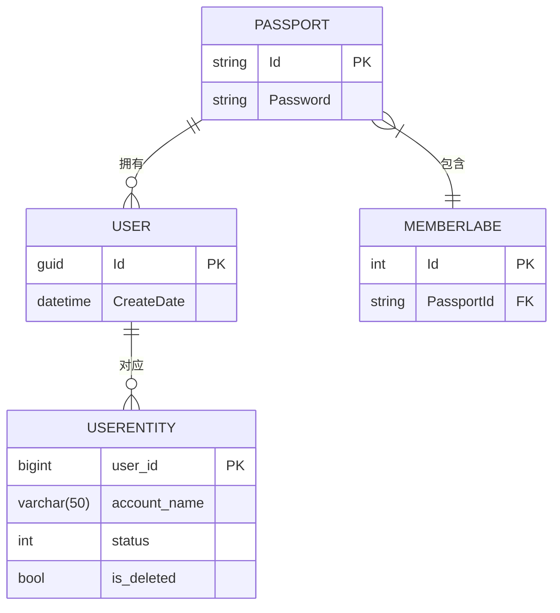
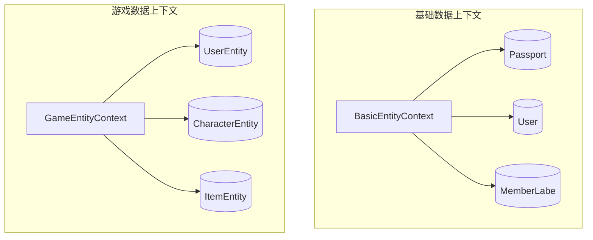

# 数据模型与ORM映射

<cite>
**本文档引用文件**  
- [Passport.cs](file://Horizon.Model/Basic/Passport.cs)
- [User.cs](file://Horizon.Model/Basic/User.cs)
- [UserEntity.cs](file://Horizon.Model/GameModel/UserEntity.cs)
- [BasicEntityContext.cs](file://Horizon.Entities/BasicEntityContext.cs)
- [GameEntityContext.cs](file://Horizon.Entities/GameEntityContext.cs)
- [ISoftDeleted.cs](file://Horizon.Core.Abstract/ISoftDeleted.cs)
- [DataServiceProvide.cs](file://Horizon.Entities/DataServiceProvide.cs)
- [repository.json](file://Horizon.Entities/repository.json)
- [dotnet-tools.json](file://Horizon.WebApi/.config/dotnet-tools.json)
- [20250209164754_Init.cs](file://Horizon.Entities/Migrations/BasicEntity/20250209164754_Init.cs)
- [20250714162117_xiugaiEntity.cs](file://Horizon.Entities/Migrations/Games/20250714162117_xiugaiEntity.cs)
</cite>

## 目录
1. [引言](#引言)  
2. [实体关系图](#实体关系图)  
3. [DbContext职责划分](#dbcontext职责划分)  
4. [实体类设计详解](#实体类设计详解)  
5. [EF Core迁移使用说明](#ef-core迁移使用说明)  
6. [软删除机制实现](#软删除机制实现)  
7. [查询优化建议](#查询优化建议)  
8. [LINQ与SQL对比示例](#linq与sql对比示例)  
9. [结论](#结论)

## 引言
本文档旨在全面描述系统中的数据模型结构，涵盖核心实体 `Passport`（通行证）、`User`（用户资料）和 `UserEntity`（游戏用户）之间的关联关系。详细说明 `BasicEntityContext` 与 `GameEntityContext` 两个数据库上下文的职责划分，解析实体类中的导航属性、主外键约束及索引定义。同时提供 EF Core 迁移操作指南、软删除机制分析以及查询性能优化策略。

## 实体关系图



**图表来源**  
- [Passport.cs](file://Horizon.Model/Basic/Passport.cs#L16-L32)
- [User.cs](file://Horizon.Model/Basic/User.cs#L17-L27)
- [UserEntity.cs](file://Horizon.Model/GameModel/UserEntity.cs#L11-L145)
- [MemberLabe.cs](file://Horizon.Model/Basic/MemberLabe.cs#L35-L36)

## DbContext职责划分

系统采用分库设计，通过两个独立的 `DbContext` 实现数据隔离：

- **BasicEntityContext**：负责基础业务数据管理，包括用户身份认证信息（如 `Passport`、`User`）、组织架构、权限配置等。
- **GameEntityContext**：专用于游戏领域数据，管理玩家账号（`UserEntity`）、角色、物品、聊天记录等游戏相关实体。

这种分离提升了系统的可维护性与扩展性，并支持不同数据库实例部署。



**图表来源**  
- [BasicEntityContext.cs](file://Horizon.Entities/BasicEntityContext.cs#L95-L165)
- [GameEntityContext.cs](file://Horizon.Entities/GameEntityContext.cs#L110-L187)

## 实体类设计详解

### Passport（通行证）
代表用户的登录凭证，存储密码哈希等安全信息。其主键为字符串类型 `"0"` 初始化。

**关键属性**：
- `Id`: 主键，类型为 `string`
- `Password`: 登录密码字段
- 导航属性：`ICollection<MemberLabe>` 表示与标签的多对一关系

**主外键约束**：
- `MemberLabe.PassportInfo` 使用 `[ForeignKey("PassportId")]` 显式指定外键

**索引定义**：未显式声明，依赖数据库默认主键索引

### User（用户资料）
泛型用户模型，继承自 `UserModel<Guid>`，用于存储通用用户信息。

**关键特性**：
- 主键为 `Guid` 类型
- 构造函数自动初始化 `Id` 和 `CreateDate`

### UserEntity（游戏用户）
表示具体游戏中的用户账号，位于游戏数据库中。

**关键属性**：
- `user_id`: 主键，`bigint` 类型
- `account_name`: 账号名，带长度限制 `varchar(50)`
- `status`: 账号状态（0:正常, 1:冻结, 2:封禁）
- `is_deleted`: 软删除标志位，实现 `ISoftDeleted` 接口

**索引与注释**：
- 所有字段均使用 `[Column]` 和 `[TableDescription]` 注解明确指定列名、顺序与描述
- 使用 `[Required]` 确保非空约束

**Section sources**
- [Passport.cs](file://Horizon.Model/Basic/Passport.cs#L16-L32)
- [User.cs](file://Horizon.Model/Basic/User.cs#L17-L27)
- [UserEntity.cs](file://Horizon.Model/GameModel/UserEntity.cs#L11-L145)

## EF Core迁移使用说明

### 环境准备
项目已集成 `dotnet-ef` 工具（版本 5.0.2），配置于：
`Horizon.WebApi/.config/dotnet-tools.json`

数据库连接字符串定义在根目录下的 `repository.json` 文件中，分别对应：
- `BasicSqlServer`: 基础库连接
- `GameSqlServer`: 游戏库连接

### 生成新迁移
执行以下命令生成迁移文件：

```bash
# 进入项目目录
cd 

# 为 BasicEntityContext 生成迁移
dotnet ef migrations add MigrationName --context BasicEntityContext --output-dir Horizon.Entities/Migrations/BasicEntity

# 为 GameEntityContext 生成迁移
dotnet ef migrations add MigrationName --context GameEntityContext --output-dir Horizon.Entities/Migrations/Games
```

### 应用迁移至数据库
```bash
# 更新基础数据库
dotnet ef database update --context BasicEntityContext

# 更新游戏数据库
dotnet ef database update --context GameEntityContext
```

迁移文件示例如下：
- `20250209164754_Init.cs`：基础模块初始迁移
- `20250714162117_xiugaiEntity.cs`：游戏模块结构修改迁移

**Section sources**
- [dotnet-tools.json](file://Horizon.WebApi/.config/dotnet-tools.json#L0-L11)
- [repository.json](file://Horizon.Entities/repository.json)
- [20250209164754_Init.cs](file://Horizon.Entities/Migrations/BasicEntity/20250209164754_Init.cs)
- [20250714162117_xiugaiEntity.cs](file://Horizon.Entities/Migrations/Games/20250714162117_xiugaiEntity.cs)

## 软删除机制实现

系统通过 `ISoftDeleted` 接口统一实现软删除功能。

### 接口定义
```csharp
public interface ISoftDeleted
{
    bool IsDeleted { get; set; }
}
```

### 实现方式
- `UserEntity` 类包含 `IsDeleted` 字段，标记是否已被逻辑删除
- 查询时需手动过滤 `IsDeleted == false` 的记录
- 删除操作应更新该字段而非物理删除行

此机制保障了数据可追溯性与恢复能力。

**Section sources**
- [ISoftDeleted.cs](file://Horizon.Core.Abstract/ISoftDeleted.cs#L9-L15)
- [UserEntity.cs](file://Horizon.Model/GameModel/UserEntity.cs#L143-L145)

## 查询优化建议

为提升只读查询性能，推荐使用 `AsNoTracking()` 方法禁用变更追踪。

### 使用场景
适用于无需修改实体的查询操作，如列表展示、报表统计等。

### 实际应用
在 `DataServiceProvide` 中，多个查询方法默认启用非追踪模式：

```csharp
// 示例：非追踪查询
return await Task.FromResult(DbCurrent.Set<T>().AsQueryable().AsNoTracking()
                            .Where(condition).Select(selecterAction).ToList());
```

### 性能优势
- 减少内存占用
- 提升查询速度（尤其在大数据集上）
- 避免不必要的变更检测开销

**Section sources**
- [DataServiceProvide.cs](file://Horizon.Entities/DataServiceProvide.cs#L190-L227)
- [IDataContext.cs](file://Horizon.Core.Abstract/IDataContext.cs#L75-L107)

## LINQ与SQL对比示例

### 场景：查询活跃用户
#### LINQ 查询
```csharp
var activeUsers = await dataService.QueryAsync<UserEntity>(u => u.Status == 0 && !u.IsDeleted);
```

#### 对应 SQL
```sql
SELECT * FROM Game_HunduShijie_User 
WHERE status = 0 AND is_deleted = 0;
```

### 场景：获取特定通行证的用户信息
#### LINQ 查询
```csharp
var user = await dataService.QueryFirstOrDefaultAsync<UserEntity>(u => u.AccountName == "player001");
```

#### 对应 SQL
```sql
SELECT TOP(1) * FROM Game_HunduShijie_User 
WHERE account_name = 'player001';
```

以上示例展示了 LINQ 到 SQL 的自然映射，便于开发者理解底层执行逻辑。

**Section sources**
- [DataServiceProvide.cs](file://Horizon.Entities/DataServiceProvide.cs#L224-L257)
- [UserEntity.cs](file://Horizon.Model/GameModel/UserEntity.cs#L11-L145)

## 结论
本系统通过清晰的实体划分与双 `DbContext` 架构实现了高内聚低耦合的数据管理。`Passport`、`User`、`UserEntity` 形成完整的用户身份链路，配合 `ISoftDeleted` 接口实现安全的数据删除策略。EF Core 迁移机制成熟可用，结合 `AsNoTracking()` 可显著提升查询性能。整体设计兼顾功能性、安全性与可维护性，适合复杂业务场景下的长期演进。