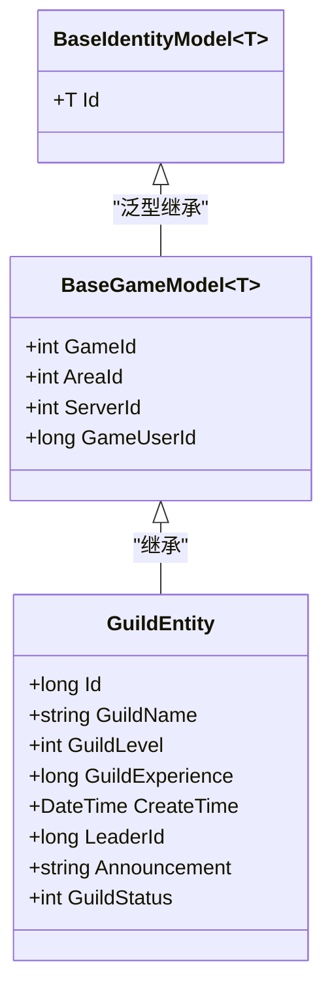
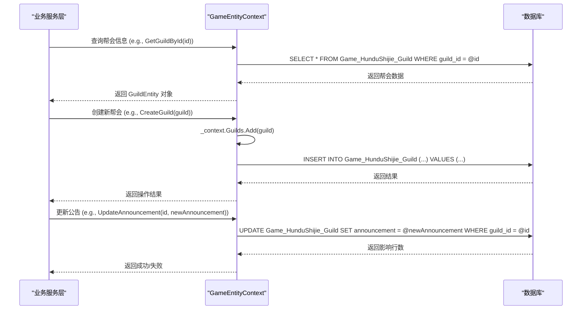
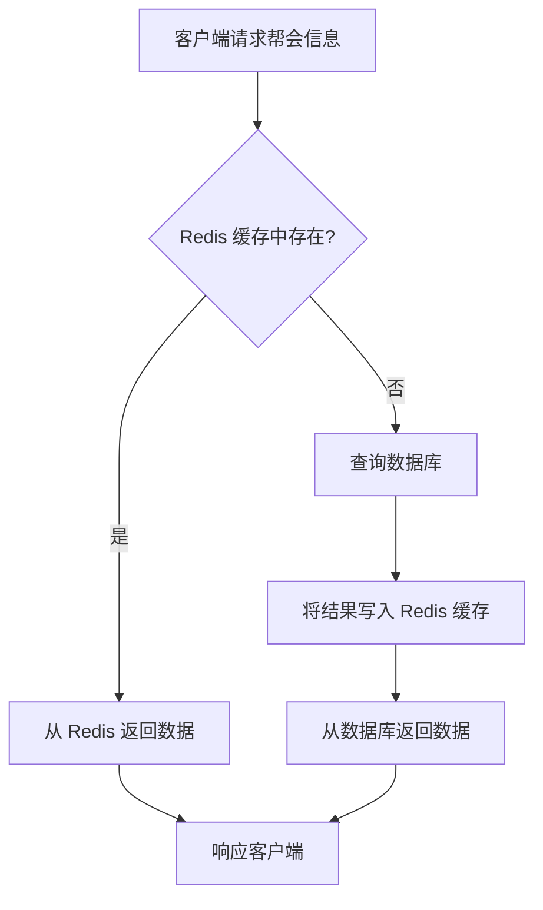

# 帮会实体模型

<cite>
**Referenced Files in This Document **   
- [GuildEntity.cs](file://Horizon.Model/GameModel/GuildEntity.cs)
- [BaseGameModel.cs](file://Horizon.Model/Base/BaseGameModel.cs)
- [GameEntityContext.cs](file://Horizon.Entities/GameEntityContext.cs)
- [RedisGuildRepository.cs](file://Horizon.Strategy.Storage.Redis/RedisGuildRepository.cs)
</cite>

## 目录
1. [简介](#简介)
2. [核心属性分析](#核心属性分析)
3. [数据建模与继承关系](#数据建模与继承关系)
4. [外键关联与一致性维护](#外键关联与一致性维护)
5. [扩展功能的数据建模思路](#扩展功能的数据建模思路)
6. [EF Core 操作实现示例](#ef-core-操作实现示例)
7. [大规模帮会数据的分页查询与缓存优化策略](#大规模帮会数据的分页查询与缓存优化策略)
8. [结论](#结论)

## 简介

帮会实体模型（GuildEntity）是社交系统中的核心组成部分，用于管理游戏内玩家组织的基本信息。该模型定义了帮会的唯一标识、名称、等级、经验、领导结构、创建时间、公告和状态等关键属性。本文档将深入分析该实体的结构设计、数据持久化机制以及在大规模数据场景下的性能优化策略。

**Section sources**
- [GuildEntity.cs](file://Horizon.Model/GameModel/GuildEntity.cs#L11-L72)

## 核心属性分析

帮会实体模型包含以下核心属性：

- **Id (帮会ID)**: 作为主键，使用 `bigint` 类型存储，通过 `[Key]` 和 `[Column("guild_id")]` 特性进行标注，确保其在数据库中的唯一性和正确映射。
- **GuildName (帮会名称)**: 使用 `nvarchar(50)` 类型存储，最大长度为50个字符，用于标识帮会的名称。
- **GuildLevel (帮会等级)**: 整数类型，表示帮会当前的等级，可用于解锁特定功能或权限。
- **GuildExperience (帮会经验)**: 长整型，记录帮会累积的经验值，通常通过成员活动获得，用于升级。
- **CreateTime (创建时间)**: `datetime` 类型，精确记录帮会创建的时间点，对于审计和历史追踪至关重要。
- **LeaderId (帮主ID)**: `bigint` 类型，存储帮主角色的唯一标识，建立与用户实体的外键关联。
- **Announcement (帮会公告)**: `nvarchar(200)` 类型，允许帮主发布最多200个字符的公告，向成员传达重要信息。
- **GuildStatus (帮会状态)**: 整数类型，表示帮会的当前状态（如活跃、暂停、解散中等），便于系统进行状态管理和逻辑判断。

这些属性共同构成了帮会的基础信息框架，支持社交系统的各种功能需求。

**Section sources**
- [GuildEntity.cs](file://Horizon.Model/GameModel/GuildEntity.cs#L19-L69)

## 数据建模与继承关系

帮会实体模型采用了面向对象的继承设计模式，继承自 `BaseGameModel<long>` 基类。这种设计实现了代码复用并建立了清晰的层次结构。

**Diagram sources **
- [GuildEntity.cs](file://Horizon.Model/GameModel/GuildEntity.cs#L11-L72)
- [BaseGameModel.cs](file://Horizon.Model/Base/BaseGameModel.cs#L13-L34)

**Section sources**
- [GuildEntity.cs](file://Horizon.Model/GameModel/GuildEntity.cs#L11-L72)
- [BaseGameModel.cs](file://Horizon.Model/Base/BaseGameModel.cs#L13-L34)

`BaseGameModel<T>` 提供了游戏相关的通用字段，如 `GameId`（游戏ID）、`AreaId`（游戏区）、`ServerId`（游戏服）和 `GameUserId`（游戏本地用户ID）。通过继承，`GuildEntity` 自动获得了这些上下文信息，无需重复定义，保证了数据模型的一致性和可维护性。

## 外键关联与一致性维护

`LeaderId` 属性是维护帮会领导结构一致性的关键。它作为一个外键，指向用户实体（User Entity）的主键（通常是 `Passport.Id` 或类似字段）。虽然在 `GuildEntity` 类中未直接体现外键约束，但其设计意图是通过 `LeaderId` 的值与用户表中的记录进行关联。

当需要验证或获取帮主信息时，系统可以通过 `LeaderId` 进行数据库联表查询（JOIN）或单独查询用户表。这种设计确保了帮主身份的有效性，并且在用户数据变更时，可以通过级联更新或业务逻辑来同步帮会信息，从而维护数据的一致性。

**Section sources**
- [GuildEntity.cs](file://Horizon.Model/GameModel/GuildEntity.cs#L55-L57)

## 扩展功能的数据建模思路

尽管 `GuildEntity` 本身不直接包含成员列表、职位和权限等复杂信息，但可以通过关联表（Join Table）的设计模式来实现这些扩展功能。

- **帮会成员列表**: 可以创建一个 `GuildMember` 实体，包含 `GuildId` 和 `MemberId`（用户ID）作为复合主键，以及 `JoinDate`（加入日期）、`Role`（职位）等字段。这形成了一个典型的多对多关系。
- **职位管理**: `GuildMember` 表中的 `Role` 字段可以是一个枚举或外键，指向一个 `GuildRole` 表，该表定义了不同职位（如副帮主、长老、普通成员）及其基本描述。
- **权限分配**: 权限系统可以更加复杂。一种方案是创建 `GuildPermission` 表，定义所有可能的权限（如“发布公告”、“踢出成员”）。然后通过另一个关联表 `GuildRolePermission` 将 `GuildRole` 和 `GuildPermission` 关联起来，实现基于角色的访问控制（RBAC）。

这种分离的设计保持了 `GuildEntity` 的简洁性，同时提供了高度的灵活性和可扩展性。

## EF Core 操作实现示例

虽然项目中没有提供直接针对 `GuildEntity` 的完整 EF Core 服务类，但根据标准实践和代码库中的上下文配置，可以推断出典型的操作实现方式。

`GameEntityContext` 中包含了 `DbSet<GuildEntity> Guilds { get; set; }`，这表明可以通过依赖注入获取此上下文实例来进行 CRUD 操作。

**Diagram sources **
- [GameEntityContext.cs](file://Horizon.Entities/GameEntityContext.cs#L151-L171)
- [GuildEntity.cs](file://Horizon.Model/GameModel/GuildEntity.cs#L11-L72)

**Section sources**
- [GameEntityContext.cs](file://Horizon.Entities/GameEntityContext.cs#L151-L171)

## 大规模帮会数据的分页查询与缓存优化策略

处理大规模帮会数据时，分页查询和缓存是至关重要的性能优化手段。

- **分页查询**: 在查询帮会列表（如排行榜或搜索结果）时，应始终使用 `Skip()` 和 `Take()` 方法进行分页，避免一次性加载过多数据导致内存溢出和网络延迟。例如：`_context.Guilds.OrderBy(g => g.GuildLevel).ThenByDescending(g => g.GuildExperience).Skip(pageIndex * pageSize).Take(pageSize).ToList();`。

- **缓存优化**: 项目中存在 `RedisGuildRepository` 类，明确指出了使用 Redis 作为缓存层的策略。虽然其实现目前仅包含检查存在性和删除操作，但其设计方向是正确的。完整的缓存策略应包括：
    - **读取缓存**: 在查询帮会信息前，先检查 Redis 中是否存在对应 `guild:{id}` 的缓存。如果存在，则直接返回缓存数据，避免数据库查询。
    - **写入缓存**: 当创建、更新或删除帮会时，除了操作数据库，还应同步更新或清除 Redis 中的相应缓存条目，保证数据一致性。
    - **缓存失效**: 设置合理的缓存过期时间（TTL），或在相关数据变动时主动使缓存失效。

这种“数据库+Redis缓存”的架构能显著降低数据库负载，提高高并发场景下的响应速度。

**Diagram sources **
- [RedisGuildRepository.cs](file://Horizon.Strategy.Storage.Redis/RedisGuildRepository.cs#L11-L63)

**Section sources**
- [RedisGuildRepository.cs](file://Horizon.Strategy.Storage.Redis/RedisGuildRepository.cs#L11-L63)

## 结论

`GuildEntity` 是一个设计良好、职责清晰的实体模型，它通过继承基类复用了通用字段，并通过 `LeaderId` 维护了与用户实体的关键关联。其核心属性全面覆盖了帮会管理的基本需求。通过引入关联表，可以灵活地扩展成员、职位和权限等复杂功能。结合 EF Core 的强大功能和 Redis 缓存策略，该模型能够高效地支撑从小型社区到大型公会的各种社交场景，为游戏的社交生态提供了坚实的数据基础。