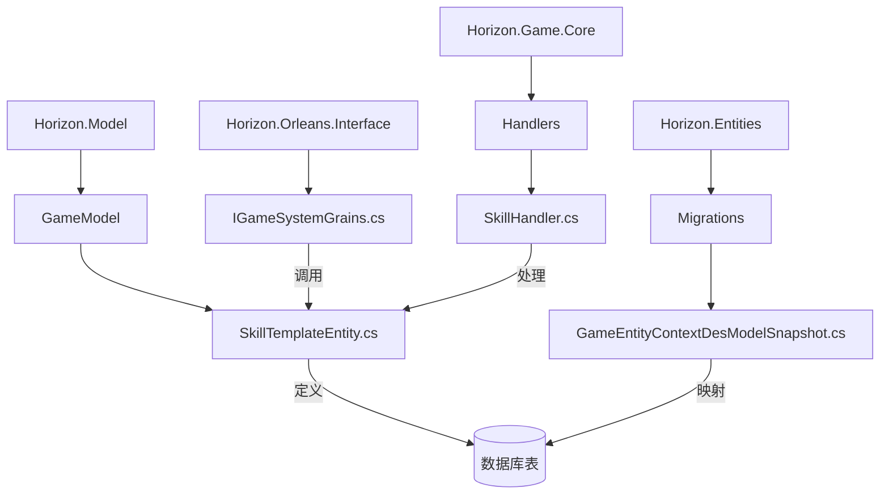
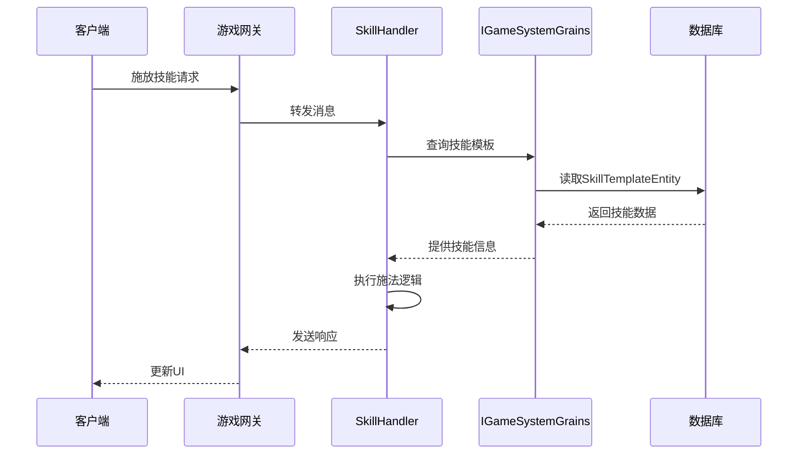
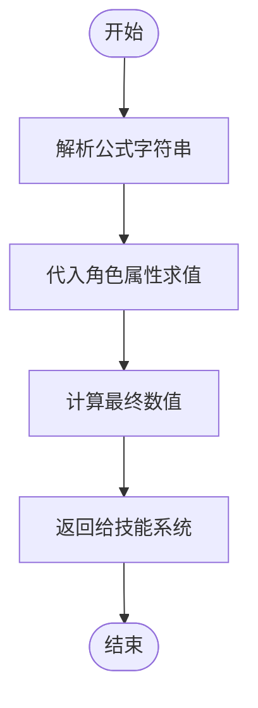
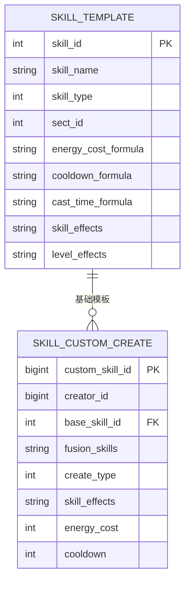
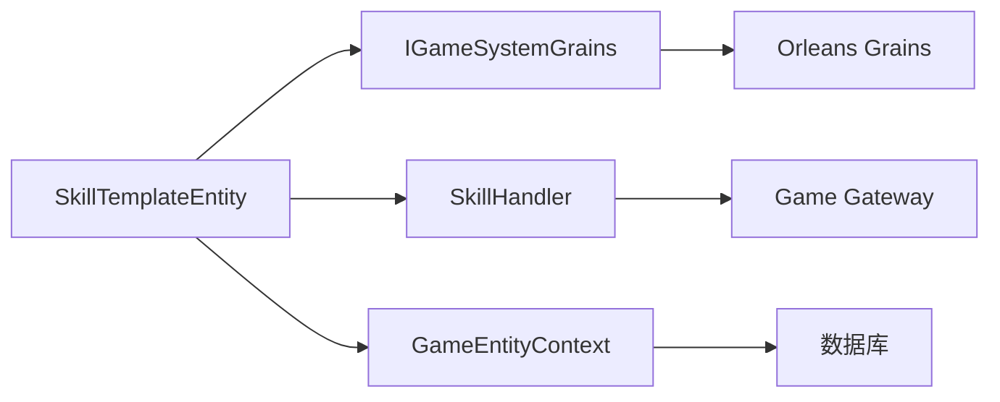

# 技能模板模型

<cite>
**本文档引用的文件**
- [SkillTemplateEntity.cs](file://Horizon.Model\GameModel\SkillTemplateEntity.cs)
- [SkillCustomCreateEntity.cs](file://Horizon.Model\GameModel\SkillCustomCreateEntity.cs)
- [IGameSystemGrains.cs](file://Horizon.Orleans.Interface\IGameSystemGrains.cs)
- [SkillHandler.cs](file://Horizon.Game.Core\Handlers\SkillHandler.cs)
- [GameEntityContextDesModelSnapshot.cs](file://Horizon.Entities\Migrations\Games\GameEntityContextDesModelSnapshot.cs)
</cite>

## 目录
1. [简介](#简介)
2. [项目结构](#项目结构)
3. [核心组件](#核心组件)
4. [架构概述](#架构概述)
5. [详细组件分析](#详细组件分析)
6. [依赖分析](#依赖分析)
7. [性能考虑](#性能考虑)
8. [故障排除指南](#故障排除指南)
9. [结论](#结论)

## 简介
本技术文档全面解析 `SkillTemplateEntity` 技能模板实体模型，作为游戏战斗系统的核心配置。文档深入剖析技能元数据定义、学习与进阶规则、动态公式执行机制、复杂效果存储方案以及运行时数据管理策略。

## 项目结构
`SkillTemplateEntity` 模型位于 `Horizon.Model` 项目的 `GameModel` 命名空间下，是游戏领域模型的核心组成部分。该模型通过 Entity Framework Core 映射到数据库，并被 Orleans 分布式计算框架和游戏网关服务所使用。

**图示来源**
- [SkillTemplateEntity.cs](file://Horizon.Model\GameModel\SkillTemplateEntity.cs)
- [GameEntityContextDesModelSnapshot.cs](file://Horizon.Entities\Migrations\Games\GameEntityContextDesModelSnapshot.cs)
- [IGameSystemGrains.cs](file://Horizon.Orleans.Interface\IGameSystemGrains.cs)
- [SkillHandler.cs](file://Horizon.Game.Core\Handlers\SkillHandler.cs)

**节来源**
- [SkillTemplateEntity.cs](file://Horizon.Model\GameModel\SkillTemplateEntity.cs)

## 核心组件
`SkillTemplateEntity` 类继承自 `BaseGameModel<int>`，代表了游戏中所有技能的基础配置模板。它包含了从基础信息到高级行为规则的完整定义，是技能系统数据驱动设计的核心。

**节来源**
- [SkillTemplateEntity.cs](file://Horizon.Model\GameModel\SkillTemplateEntity.cs#L11-L241)

## 架构概述
技能模板模型在整体架构中扮演着静态配置中心的角色。游戏逻辑层（如 `SkillHandler`）在处理玩家请求时，会查询此模型以获取技能的详细信息，然后结合角色状态进行动态计算。

**图示来源**
- [SkillHandler.cs](file://Horizon.Game.Core\Handlers\SkillHandler.cs#L165-L185)
- [IGameSystemGrains.cs](file://Horizon.Orleans.Interface\IGameSystemGrains.cs#L75-L117)

## 详细组件分析

### 元数据与分类体系分析
`SkillTemplateEntity` 的前半部分字段定义了技能的基础元数据和分类体系。

#### 基础信息
- **Id**: 技能的唯一标识符，对应数据库中的 `skill_id` 字段。
- **SkillName**: 技能名称，必填项，最大长度为50个字符。
- **Description**: 技能描述，用于向玩家展示技能详情。

#### 分类体系
- **SkillType (技能类型)**: 使用整数枚举表示技能类别，包括主动攻击、主动辅助、被动增益、心法、轻功、内功、绝学等。
- **SkillSchool (技能流派)**: 表示技能所属的流派，如外功、内功、医术、毒术、音律、机关等。
- **SectId (所属门派)**: 标识技能归属于哪个门派，0表示通用技能。
- **ProfessionLimit (职业限制)**: 以逗号分隔的职业ID字符串，定义了哪些职业可以学习此技能。

**节来源**
- [SkillTemplateEntity.cs](file://Horizon.Model\GameModel\SkillTemplateEntity.cs#L11-L65)

### 学习与进阶规则分析
该模型精确地定义了技能的学习条件和进阶路径。

#### 学习需求
- **LearnLevelRequire**: 角色需要达到的等级才能学习此技能。
- **LearnRealmRequire**: 角色需要达到的境界才能学习此技能。
- **ComprehensionRequire**: 对角色悟性的要求。

#### 前置与进阶
- **PreSkillId & PreSkillLevel**: 定义了学习此技能必须先掌握的前置技能及其所需等级。
- **AdvanceSkillId**: 指向该技能的进阶版本，形成技能树的升级路径。
- **CanAdvance**: 布尔值，指示该技能是否可以进阶。

**节来源**
- [SkillTemplateEntity.cs](file://Horizon.Model\GameModel\SkillTemplateEntity.cs#L77-L100)
- [SkillTemplateEntity.cs](file://Horizon.Model\GameModel\SkillTemplateEntity.cs#L203-L205)

### 动态公式机制分析
技能的消耗和时间参数并非固定值，而是通过可配置的公式来动态计算。

#### 公式字段
- **EnergyCostFormula**: 内力消耗公式，存储为字符串。
- **CooldownFormula**: 冷却时间公式，单位为毫秒。
- **CastTimeFormula**: 施法时间公式，单位为毫秒。

这些公式在运行时由游戏引擎解析并计算出实际数值，允许设计者创建随角色属性变化而变化的动态技能。

**图示来源**
- [SkillTemplateEntity.cs](file://Horizon.Model\GameModel\SkillTemplateEntity.cs#L119-L135)

**节来源**
- [SkillTemplateEntity.cs](file://Horizon.Model\GameModel\SkillTemplateEntity.cs#L119-L135)

### 复杂效果存储方案分析
为了支持丰富的技能效果，模型采用了JSON格式的字符串字段来存储结构化数据。

#### JSON存储字段
- **SkillEffects**: 存储技能的基础效果，如伤害、治疗、增益/减益状态等，采用JSON格式以便于序列化和反序列化。
- **LevelEffects**: 存储技能每级升级带来的效果变化，同样使用JSON格式，支持复杂的成长曲线定义。

这种设计提供了极大的灵活性，使得无需修改数据库结构即可添加新的效果类型。

**节来源**
- [SkillTemplateEntity.cs](file://Horizon.Model\GameModel\SkillTemplateEntity.cs#L168-L177)

### 运行时数据管理分析
虽然 `SkillTemplateEntity` 本身是静态配置，但其与运行时数据紧密关联。

#### 自创技能关联
`SkillCustomCreateEntity` 实体与 `SkillTemplateEntity` 相关联，其中的 `BaseSkillId` 字段指向一个 `SkillTemplateEntity` 的 `Id`，表明自创技能是基于某个基础模板创建的。

#### 数据热更新与缓存
尽管代码中未直接体现，但此类配置数据通常会在服务器启动时加载到内存缓存中（如Redis），并通过事件总线监听变更，实现不重启服务的数据热更新。

**图示来源**
- [SkillTemplateEntity.cs](file://Horizon.Model\GameModel\SkillTemplateEntity.cs)
- [SkillCustomCreateEntity.cs](file://Horizon.Model\GameModel\SkillCustomCreateEntity.cs)

**节来源**
- [SkillTemplateEntity.cs](file://Horizon.Model\GameModel\SkillTemplateEntity.cs)
- [SkillCustomCreateEntity.cs](file://Horizon.Model\GameModel\SkillCustomCreateEntity.cs)

## 依赖分析
`SkillTemplateEntity` 模型是整个技能系统的基石，被多个模块所依赖。

**图示来源**
- [SkillTemplateEntity.cs](file://Horizon.Model\GameModel\SkillTemplateEntity.cs)
- [IGameSystemGrains.cs](file://Horizon.Orleans.Interface\IGameSystemGrains.cs)
- [SkillHandler.cs](file://Horizon.Game.Core\Handlers\SkillHandler.cs)
- [GameEntityContextDesModelSnapshot.cs](file://Horizon.Entities\Migrations\Games\GameEntityContextDesModelSnapshot.cs)

**节来源**
- [SkillTemplateEntity.cs](file://Horizon.Model\GameModel\SkillTemplateEntity.cs)
- [IGameSystemGrains.cs](file://Horizon.Orleans.Interface\IGameSystemGrains.cs)
- [SkillHandler.cs](file://Horizon.Game.Core\Handlers\SkillHandler.cs)

## 性能考虑
将大量技能数据存储在数据库中并在每次使用时查询会严重影响性能。因此，最佳实践是在服务器启动时将所有 `SkillTemplateEntity` 实例预加载到分布式缓存（如Redis）中，实现O(1)时间复杂度的快速查询。

## 故障排除指南
当遇到技能相关的问题时，应首先检查 `SkillTemplateEntity` 中的配置：
- 确认 `PreSkillId` 和 `PreSkillLevel` 是否正确设置。
- 验证 `EnergyCostFormula` 等公式字符串的语法是否正确。
- 检查 `SkillEffects` 和 `LevelEffects` 的JSON格式是否有效。

**节来源**
- [SkillTemplateEntity.cs](file://Horizon.Model\GameModel\SkillTemplateEntity.cs)

## 结论
`SkillTemplateEntity` 是一个设计精良、功能完备的游戏技能配置模型。它通过结构化的字段定义了技能的方方面面，并利用JSON和公式字符串提供了足够的灵活性。该模型与 `SkillCustomCreateEntity` 等实体协同工作，支撑起一个既稳定又富有扩展性的技能系统。