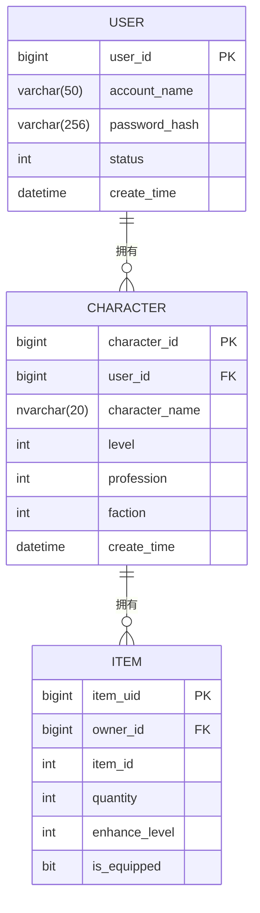

# 游戏数据模型

<cite>
**本文档中引用的文件**  
- [GameEntityContext.cs](file://Horizon.Entities/GameEntityContext.cs)
- [UserEntity.cs](file://Horizon.Model/GameModel/UserEntity.cs)
- [CharacterEntity.cs](file://Horizon.Model/GameModel/CharacterEntity.cs)
- [ItemEntity.cs](file://Horizon.Model/GameModel/ItemEntity.cs)
- [CurrencyEntity.cs](file://Horizon.Model/GameModel/CurrencyEntity.cs)
- [SkillTemplateEntity.cs](file://Horizon.Model/GameModel/SkillTemplateEntity.cs)
- [GuildEntity.cs](file://Horizon.Model/GameModel/GuildEntity.cs)
- [EntityStorageAttribute.cs](file://Horizon.Core.Abstract/EntityStorageAttribute.cs)
- [Passport.cs](file://Horizon.Model/Basic/Passport.cs)
</cite>

## 目录
1. [引言](#引言)
2. [实体层级关系](#实体层级关系)
3. [核心实体表结构设计](#核心实体表结构设计)
4. [EntityStorage属性应用](#entitystorage属性应用)
5. [复杂游戏查询实现与性能优化](#复杂游戏查询实现与性能优化)
6. [结论](#结论)

## 引言
本文档深入阐述由`GameEntityContext`所管理的游戏领域实体模型，重点描述`UserEntity`（游戏用户）、`CharacterEntity`（游戏角色）和`ItemEntity`（角色物品）之间的层级关系。同时，详细说明了`CurrencyEntity`、`SkillTemplateEntity`、`GuildEntity`等核心游戏概念的数据库表结构设计，并分析了`EntityStorage("Game")`属性的应用方式。此外，还提供了针对角色装备查看、公会成员列表等复杂游戏查询的EF Core实现方案及性能优化建议。

## 实体层级关系
游戏领域的核心实体遵循清晰的层级结构：一个游戏用户可拥有多个角色，而一个角色又可拥有多个物品。这种“一对多”的关系通过外键约束在数据库层面得以实现。



**图示来源**
- [UserEntity.cs](file://Horizon.Model/GameModel/UserEntity.cs#L11-L145)
- [CharacterEntity.cs](file://Horizon.Model/GameModel/CharacterEntity.cs#L11-L185)
- [ItemEntity.cs](file://Horizon.Model/GameModel/ItemEntity.cs#L11-L184)

### 用户与角色关系
`UserEntity`与`CharacterEntity`之间通过`UserId`字段建立关联。`CharacterEntity`类中的`UserId`属性作为外键，指向`UserEntity`的主键`Id`，从而确保每个角色都归属于一个特定的用户。

**代码片段路径**: [CharacterEntity.cs](file://Horizon.Model/GameModel/CharacterEntity.cs#L27-L29)

### 角色与物品关系
`CharacterEntity`与`ItemEntity`之间通过`OwnerId`字段建立关联。`ItemEntity`类中的`OwnerId`属性作为外键，指向`CharacterEntity`的主键`Id`，表示该物品的所有者是哪个角色。

**代码片段路径**: [ItemEntity.cs](file://Horizon.Model/GameModel/ItemEntity.cs#L34-L36)

### 用户与基础模块Passport的关联
`UserEntity`并非直接包含`Passport`字段，而是通过业务逻辑层进行关联。系统使用独立的`Passport`实体（位于`Horizon.Model.Basic`命名空间）来管理用户的登录凭证。当用户登录时，系统首先验证`Passport`实体中的凭据，然后根据`PassportId`查找或创建对应的`UserEntity`。这种设计实现了身份认证（Authentication）与游戏账号（Account）的解耦。

**代码片段路径**: 
- [Passport.cs](file://Horizon.Model/Basic/Passport.cs#L16-L32)
- [PassportGrain.cs](file://Horizon.Orleans.Grains/PassportGrain.cs#L57-L111)

## 核心实体表结构设计
以下是对关键游戏实体的数据库表结构的详细说明。

### CurrencyEntity（货币信息）
`CurrencyEntity`表用于存储角色持有的各种货币信息，支持多种货币类型并记录其数量变化。

| 字段名 | 数据类型 | 描述 |
| :--- | :--- | :--- |
| `id` | `bigint` | 自增ID，主键 |
| `character_id` | `bigint` | 角色ID，外键 |
| `currency_type` | `int` | 货币类型（0-铜币, 1-银两, 2-金锭, 3-元宝等） |
| `amount` | `bigint` | 当前持有数量 |
| `total_earned` | `bigint` | 累计获得数量 |
| `total_spent` | `bigint` | 累计消耗数量 |
| `update_time` | `datetime` | 最后更新时间 |

**代码片段路径**: [CurrencyEntity.cs](file://Horizon.Model/GameModel/CurrencyEntity.cs#L12-L60)

### SkillTemplateEntity（技能模板信息）
`SkillTemplateEntity`表定义了游戏中所有技能的静态模板，包含了学习、升级、效果等完整规则。

| 字段名 | 数据类型 | 描述 |
| :--- | :--- | :--- |
| `skill_id` | `int` | 技能ID，主键 |
| `skill_name` | `nvarchar(50)` | 技能名称 |
| `description` | `nvarchar(500)` | 技能描述 |
| `skill_type` | `int` | 技能类型（0-主动攻击, 1-主动辅助, 2-被动增益等） |
| `sect_id` | `int` | 所属门派ID（0为通用） |
| `max_level` | `int` | 最大等级 |
| `learn_cost` | `nvarchar(500)` | 学习消耗（JSON格式） |
| `skill_effects` | `nvarchar(2000)` | 技能效果（JSON格式） |
| `level_effects` | `nvarchar(2000)` | 升级效果（JSON格式） |
| `can_advance` | `bit` | 是否可进阶 |
| `advance_skill_id` | `int` | 进阶后的技能ID |

**代码片段路径**: [SkillTemplateEntity.cs](file://Horizon.Model/GameModel/SkillTemplateEntity.cs#L11-L241)

### GuildEntity（帮会信息）
`GuildEntity`表存储了游戏内帮会的基本信息，包括成员管理的核心数据。

| 字段名 | 数据类型 | 描述 |
| :--- | :--- | :--- |
| `guild_id` | `bigint` | 帮会ID，主键 |
| `guild_name` | `nvarchar(50)` | 帮会名称 |
| `guild_level` | `int` | 帮会等级 |
| `guild_experience` | `bigint` | 帮会经验 |
| `create_time` | `datetime` | 创建时间 |
| `leader_id` | `bigint` | 帮主ID（即角色ID） |
| `announcement` | `nvarchar(200)` | 帮会公告 |
| `guild_status` | `int` | 帮会状态 |

**代码片段路径**: [GuildEntity.cs](file://Horizon.Model/GameModel/GuildEntity.cs#L11-L72)

## EntityStorage属性应用
`EntityStorageAttribute`是一个自定义特性，用于标记实体类所属的存储库。它通过构造函数接收一个字符串参数`positionalString`，该参数指定了存储库的名称。

```csharp
[EntityStorage("Game")]
public class UserEntity : BaseGameModel<long>
{
    // ...
}
```
在上述代码中，`[EntityStorage("Game")]`表明`UserEntity`、`CharacterEntity`、`ItemEntity`等所有被此特性标记的实体都属于名为"Game"的存储库。这有助于框架在运行时将这些实体正确地映射到`GameEntityContext`所连接的数据库中，实现了不同业务模块（如游戏、文章、基础服务）的数据隔离。

**代码片段路径**: 
- [EntityStorageAttribute.cs](file://Horizon.Core.Abstract/EntityStorageAttribute.cs#L9-L27)
- [UserEntity.cs](file://Horizon.Model/GameModel/UserEntity.cs#L11)

## 复杂游戏查询实现与性能优化
### 角色装备查看查询
要查询某个角色当前已装备的所有物品，可以使用LINQ to Entities编写如下查询：

```csharp
var equippedItems = context.Items
    .Where(item => item.OwnerId == characterId && item.IsEquipped)
    .Include(item => item.ItemTemplate) // 包含物品模板信息以获取名称、图标等
    .ToList();
```
**性能优化建议**:
1. **索引优化**: 在`OwnerId`和`IsEquipped`字段上创建复合索引，以加速WHERE条件的过滤。
2. **延迟加载**: 避免不必要的`Include`操作，仅在需要关联数据时才加载。
3. **分页处理**: 如果角色可能拥有大量物品，应实现分页查询。

### 公会成员列表查询
查询公会成员列表通常需要联结`GuildEntity`和`CharacterEntity`表。

```csharp
var guildMembers = context.Characters
    .Where(character => character.GuildId == guildId) // 假设CharacterEntity有GuildId字段
    .Select(c => new { c.Id, c.CharacterName, c.Level, c.Profession })
    .OrderByDescending(c => c.Level)
    .ThenBy(c => c.CharacterName)
    .ToList();
```
**性能优化建议**:
1. **数据库视图**: 对于频繁访问的只读数据，可以考虑创建数据库视图。
2. **缓存策略**: 使用Redis等缓存中间件缓存公会成员列表，减少数据库压力。
3. **异步查询**: 在高并发场景下，使用`ToListAsync()`等异步方法避免阻塞线程。

## 结论
本文档全面解析了基于`GameEntityContext`的游戏数据模型。该模型通过清晰的实体层级关系（用户->角色->物品）和规范化的表结构设计，有效地支撑了游戏的核心玩法。`EntityStorage`特性的应用保证了数据存储的模块化和隔离性。对于复杂的业务查询，结合EF Core的强大功能与合理的性能优化策略，能够确保系统在高负载下的稳定性和响应速度。