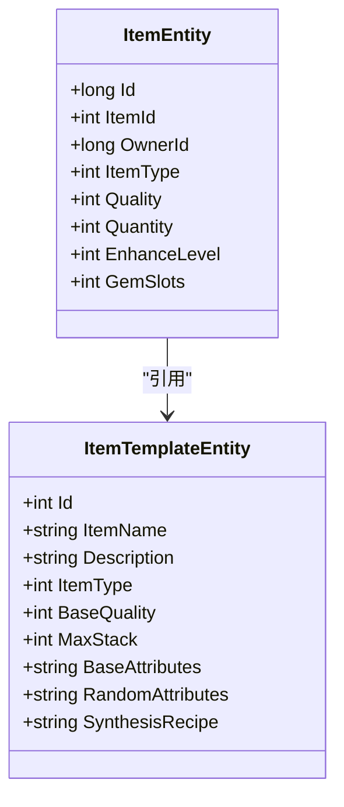
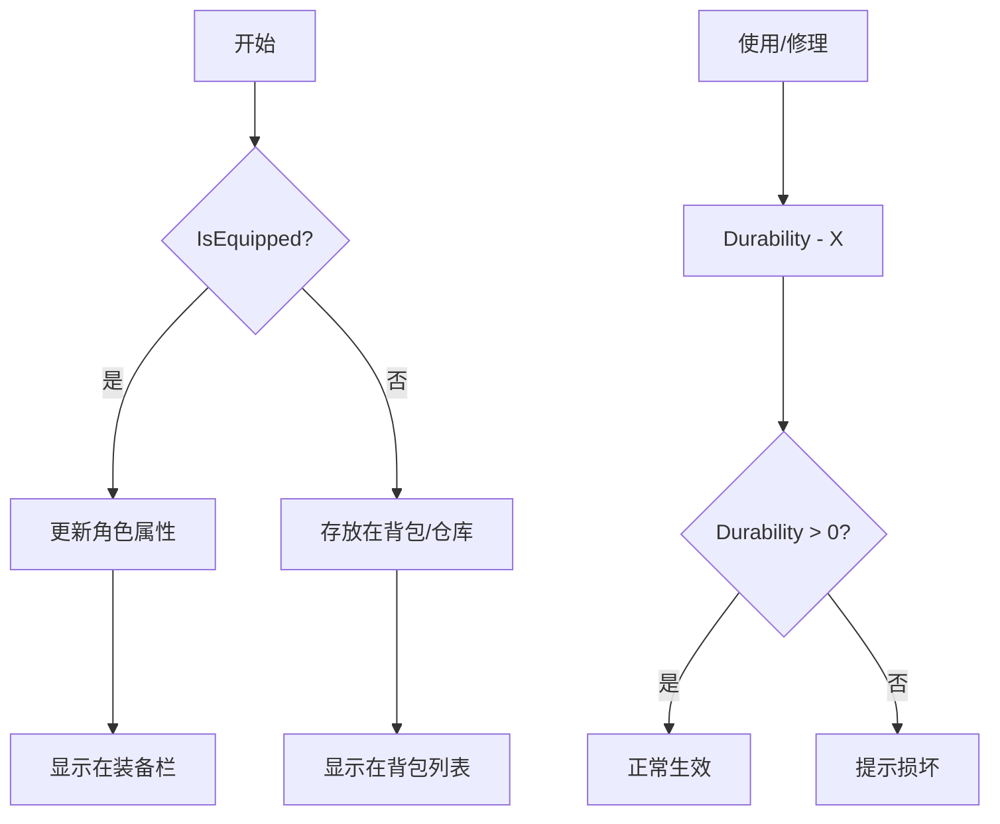
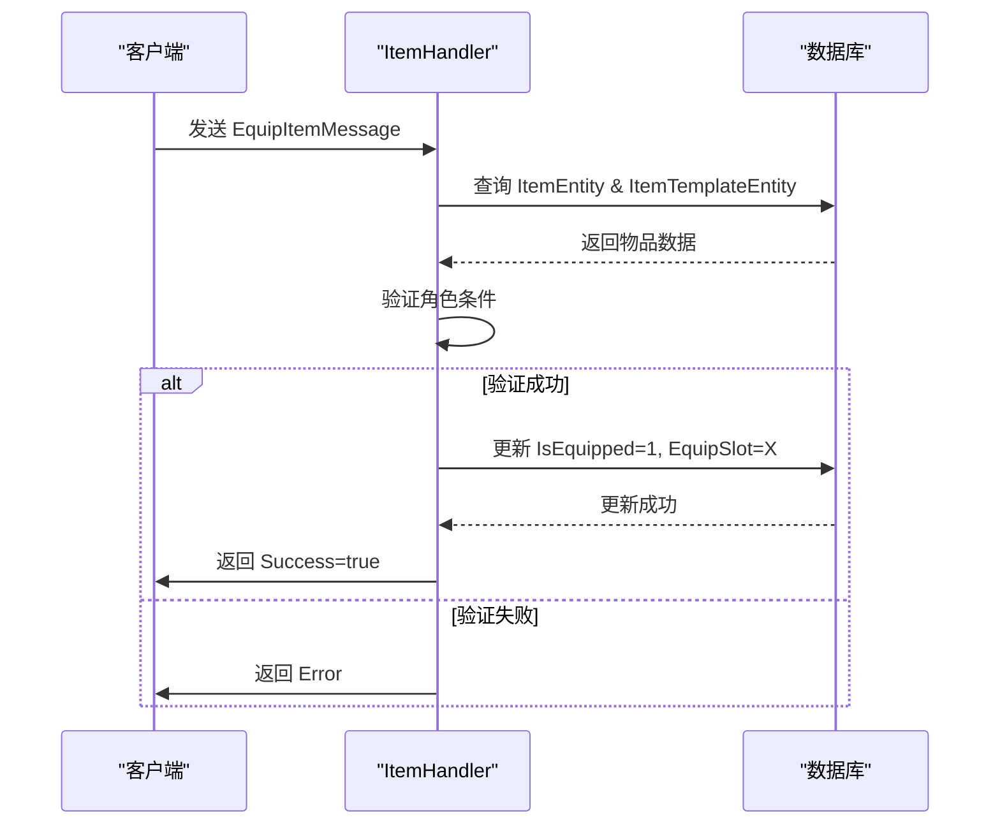

# 物品实体模型

<cite>
**Referenced Files in This Document **   
- [ItemEntity.cs](file://Horizon.Model/GameModel/ItemEntity.cs)
- [ItemTemplateEntity.cs](file://Horizon.Model/GameModel/ItemTemplateEntity.cs)
- [BagEntity.cs](file://Horizon.Model/GameModel/BagEntity.cs)
- [ItemHandler.cs](file://Horizon.Game.Core/Handlers/ItemHandler.cs)
</cite>

## 目录
1. [简介](#简介)
2. [核心属性设计](#核心属性设计)
3. [装备系统字段](#装备系统字段)
4. [背包与位置管理](#背包与位置管理)
5. [合成材料来源序列化](#合成材料来源序列化)
6. [典型业务场景实现](#典型业务场景实现)
7. [高并发库存一致性](#高并发库存一致性)

## 简介
`ItemEntity` 是游戏《混沌世界》中物品系统的基石，它定义了游戏中所有可交互物品的完整状态。该模型不仅承载了物品的基本信息，还通过丰富的状态字段支持复杂的玩法机制，如装备强化、宝石镶嵌、物品交易等。`ItemEntity` 与 `ItemTemplateEntity`（物品模板）和 `BagEntity`（背包实体）共同构成了一个完整的物品管理系统。

**Section sources**
- [ItemEntity.cs](file://Horizon.Model/GameModel/ItemEntity.cs#L11-L184)
- [ItemTemplateEntity.cs](file://Horizon.Model/GameModel/ItemTemplateEntity.cs#L11-L283)
- [BagEntity.cs](file://Horizon.Model/GameModel/BagEntity.cs#L11-L72)

## 核心属性设计
`ItemEntity` 的核心在于其对物品唯一性、类型和状态的精确描述。

### 唯一标识与模板引用
每个物品实例都由全局唯一的 `Id` (`item_uid`) 进行标识，确保了在分布式系统中的精确追踪。而 `ItemId` (`item_id`) 则作为外键，指向 `ItemTemplateEntity`，实现了“实例”与“蓝图”的分离。这种设计使得成千上万的相同物品（如“初级治疗药水”）可以共享同一份模板数据，极大地节省了存储空间并简化了配置管理。



**Diagram sources **
- [ItemEntity.cs](file://Horizon.Model/GameModel/ItemEntity.cs#L19-L29)
- [ItemTemplateEntity.cs](file://Horizon.Model/GameModel/ItemTemplateEntity.cs#L11-L283)

**Section sources**
- [ItemEntity.cs](file://Horizon.Model/GameModel/ItemEntity.cs#L19-L29)

### 所有权与基础状态
`OwnerId` (`owner_id`) 字段明确指定了物品的所有者，通常是角色ID，是实现玩家间交易、赠送功能的基础。`ItemType` (`item_type`) 和 `Quality` (`quality`) 字段则定义了物品的类别（武器、防具、消耗品等）和稀有度，直接影响UI展示和游戏逻辑。`Quantity` (`quantity`) 字段用于堆叠物品，其最大值受 `ItemTemplateEntity.MaxStack` 限制。

### 强化与附加属性
`EnhanceLevel` (`enhance_level`) 和 `GemSlots` (`gem_slots`) 是装备成长性的核心体现。前者代表装备的强化等级，通常会带来基础属性的提升；后者表示装备上可用于镶嵌宝石的槽位数量，为玩家提供了深度的个性化培养路径。这些字段的数值直接决定了装备的战斗力。

**Section sources**
- [ItemEntity.cs](file://Horizon.Model/GameModel/ItemEntity.cs#L34-L71)

## 装备系统字段
`ItemEntity` 模型为装备系统提供了全面的状态管理。

### 绑定机制
绑定机制通过 `BindType` (`bind_type`) 和 `IsBound` (`is_bound`) 两个字段协同工作。`BindType` 定义了物品的绑定规则（拾取绑定、装备绑定等），这是一个静态的模板属性。`IsBound` 则是一个动态的实例标志，一旦物品根据 `BindType` 规则被绑定，此标志将被置为 `true`，此后该物品便无法进行交易或出售。

### 装备状态
`IsEquipped` (`is_equipped`) 和 `EquipSlot` (`equip_slot`) 字段共同管理物品的装备状态。当一件装备被穿戴时，`IsEquipped` 变为 `true`，同时 `EquipSlot` 记录了它所占据的具体装备栏位（如主手、副手、头盔等）。这使得系统能够快速查询角色当前的装备配置。

### 耐久度管理
对于需要耐久度的装备，`Durability` (`durability`) 和 `MaxDurability` (`max_durability`) 字段记录了当前和最大耐久值。当 `Durability` 降至0时，装备可能会失效或需要修理。这两个值通常也与 `ItemTemplateEntity` 中的默认值相关联。



**Diagram sources **
- [ItemEntity.cs](file://Horizon.Model/GameModel/ItemEntity.cs#L90-L141)

**Section sources**
- [ItemEntity.cs](file://Horizon.Model/GameModel/ItemEntity.cs#L90-L141)

## 背包与位置管理
物品的位置信息由 `LocationType` (`location_type`) 和 `BagSlot` (`bag_slot`) 字段精确控制。

### 位置类型
`LocationType` 枚举了物品可能存在的多个容器：0-背包、1-仓库、2-邮件、3-交易。这使得系统可以高效地组织和查询不同状态下的物品。

### 背包格位
`BagSlot` 表示物品在其所在容器（如背包）中的具体格子编号。结合 `BagEntity.CurrentSlots` 和 `MaxSlots`，系统可以实现背包扩容、自动整理等功能。`BagEntity` 实体本身负责管理背包的整体状态，如已用格子数和最后整理时间。

**Section sources**
- [ItemEntity.cs](file://Horizon.Model/GameModel/ItemEntity.cs#L118-L127)
- [BagEntity.cs](file://Horizon.Model/GameModel/BagEntity.cs#L11-L72)

## 合成材料来源序列化
`SynthesisMaterials` (`synthesis_materials`) 字段是一个 `nvarchar(500)` 类型的字符串，用于存储JSON格式的数据。它记录了合成一件物品时所消耗的原材料及其数量。例如，一个合成日志可能如下：
```json
{"materials": [{"itemId": 1001, "quantity": 5}, {"itemId": 1002, "quantity": 3}]}
```
这种设计将非结构化的、可变长度的材料信息以一种紧凑且易于解析的方式存储在数据库中，避免了为每次合成都创建独立的关系表，提高了灵活性和性能。

**Section sources**
- [ItemEntity.cs](file://Horizon.Model/GameModel/ItemEntity.cs#L181-L183)

## 典型业务场景实现
物品的核心操作由 `ItemHandler` 类处理，它监听并响应各种与物品相关的网络消息。

### 物品获取与背包更新
当玩家获得新物品时，客户端发送 `InventoryUpdateMessage`。`ItemHandler.HandleInventoryUpdateAsync` 方法接收此消息，验证后更新 `ItemEntity` 和 `BagEntity` 的状态，并向客户端广播更新后的背包信息。

### 装备穿戴流程
穿戴装备的流程始于客户端发送 `EquipItemMessage`。`ItemHandler.HandleEquipItemAsync` 方法会执行一系列检查：
1.  验证 `ItemId` 对应的物品是否存在且属于该玩家。
2.  检查 `EquipSlot` 是否符合该物品的 `SubType`（如武器不能穿在头盔位）。
3.  检查角色等级和职业是否满足 `ItemTemplateEntity.LevelRequire` 和 `ProfessionLimit`。
4.  如果检查通过，则更新 `ItemEntity.IsEquipped` 和 `EquipSlot`，并通知角色系统应用新的属性加成。



**Diagram sources **
- [ItemHandler.cs](file://Horizon.Game.Core/Handlers/ItemHandler.cs#L99-L121)
- [ItemEntity.cs](file://Horizon.Model/GameModel/ItemEntity.cs#L104-L113)

**Section sources**
- [ItemHandler.cs](file://Horizon.Game.Core/Handlers/ItemHandler.cs#L99-L121)

### 强化升级与交易流转
强化操作由 `HandleEquipmentEnhanceAsync` 处理，它会消耗指定的材料和货币，并根据概率提升 `EnhanceLevel`。交易流转则涉及 `LocationType` 的变更，当物品从“背包”转移到“交易”状态时，系统会锁定该物品，防止在交易完成前被再次移动。

**Section sources**
- [ItemHandler.cs](file://Horizon.Game.Core/Handlers/ItemHandler.cs#L196-L218)

## 高并发库存一致性
在高并发场景下（如大型活动期间大量玩家同时购买或合成物品），必须保证库存数据的一致性，避免超卖。

### 乐观锁解决方案
推荐采用乐观锁策略。在 `ItemEntity` 或 `BagEntity` 中增加一个版本号字段 `Version` (int)。每次更新物品数量时，SQL语句需包含版本号校验：
```sql
UPDATE Game_HunduShijie_Item 
SET quantity = @newQuantity, version = version + 1 
WHERE item_uid = @id AND version = @oldVersion;
```
如果返回受影响的行数为0，说明在读取和写入之间已有其他事务修改了数据，当前操作应重试或失败。这种方式避免了悲观锁带来的性能瓶颈。

### 分布式事务考量
对于跨服务的操作（如商城购买：扣货币+发物品），应使用基于消息队列的最终一致性方案。首先在一个事务中扣除玩家货币并生成待发放的物品订单，然后发布一条“物品发放”消息到消息队列。另一个服务消费该消息并尝试发放物品。若发放失败，消息可被重试，从而保证整个流程的原子性。

**Section sources**
- [ItemEntity.cs](file://Horizon.Model/GameModel/ItemEntity.cs#L55)
- [BagEntity.cs](file://Horizon.Model/GameModel/BagEntity.cs#L60)