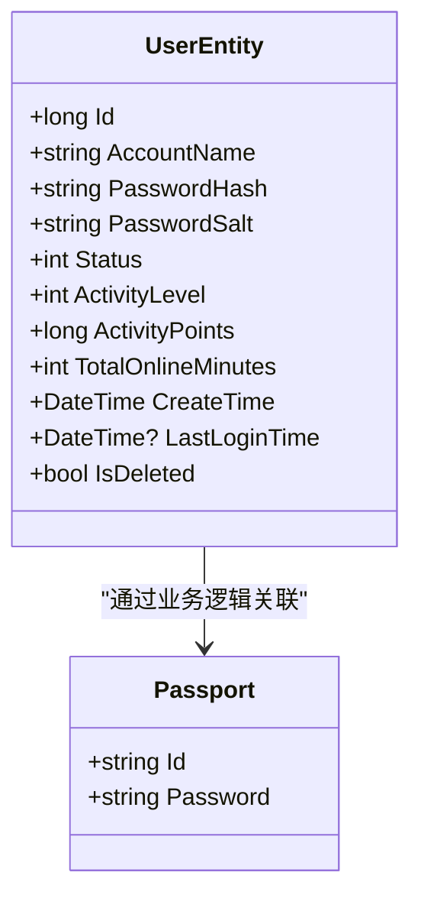

# 用户实体模型

<cite>
**Referenced Files in This Document **   
- [UserEntity.cs](file://Horizon.Model/GameModel/UserEntity.cs)
- [Passport.cs](file://Horizon.Model/Basic/Passport.cs)
- [BaseGameModel.cs](file://Horizon.Model/Base/BaseGameModel.cs)
- [PassportGrain.cs](file://Horizon.Orleans.Grains/PassportGrain.cs)
</cite>

## 目录
1. [简介](#简介)
2. [核心字段设计](#核心字段设计)
3. [与基础模块的关联机制](#与基础模块的关联机制)
4. [软删除标记应用](#软删除标记应用)
5. [常见业务查询实现](#常见业务查询实现)
6. [性能优化建议](#性能优化建议)

## 简介

`UserEntity` 是游戏系统中的核心用户实体模型，作为游戏账号信息的核心数据表，承载了从身份认证到行为分析的完整用户数据。该模型位于 `Horizon.Model.GameModel` 命名空间下，映射到数据库表 `Game_HunduShijie_User`，是游戏《混沌世界》用户管理的基础。

本模型不仅存储了用户的静态身份信息（如账号名、邮箱），还记录了动态的行为数据（如在线时长、活跃等级），为游戏运营和用户服务提供了全面的数据支持。通过继承 `BaseGameModel<long>`，它具备了游戏特有的上下文属性，如服务器ID和区域ID。

**Section sources**
- [UserEntity.cs](file://Horizon.Model/GameModel/UserEntity.cs#L1-L20)

## 核心字段设计

`UserEntity` 模型的设计遵循高安全性、可扩展性和业务实用性原则，其核心字段可分为以下几类：

### 身份与安全凭证
| 字段名称 | 数据类型 | 描述 |
|---------|--------|------|
| `Id` | bigint | 用户唯一标识符，主键 |
| `AccountName` | varchar(50) | 账号名，必填项 |
| `PasswordHash` | varchar(256) | 密码哈希值，用于安全存储密码 |
| `PasswordSalt` | varchar(128) | 密码盐值，增强哈希安全性 |

### 用户状态与行为数据
| 字段名称 | 数据类型 | 描述 |
|---------|--------|------|
| `Status` | int | 账号状态：0-正常，1-冻结，2-封禁 |
| `ActivityLevel` | int | 用户活跃等级 |
| `ActivityPoints` | bigint | 活跃度积分 |
| `TotalOnlineMinutes` | int | 累计在线时长（分钟） |
| `ConsecutiveLoginDays` | int | 连续登录天数 |

### 上下文与元数据
| 字段名称 | 数据类型 | 描述 |
|---------|--------|------|
| `CreateTime` | datetime | 账号创建时间 |
| `LastLoginTime` | datetime? | 最后登录时间 |
| `LastLoginIp` | varchar(50) | 最后登录IP地址 |
| `ServerId` | int | 所属服务器ID |
| `PlatformId` | varchar(50) | 平台ID |
| `DeviceId` | varchar(128) | 设备ID |
| `Email` | varchar(100) | 邮箱地址 |
| `Phone` | varchar(20) | 手机号码 |
| `IsDeleted` | bit | 软删除标记 |

**Section sources**
- [UserEntity.cs](file://Horizon.Model/GameModel/UserEntity.cs#L21-L145)

## 与基础模块的关联机制

`UserEntity` 模型与基础模块 `Passport` 通过业务逻辑层进行关联，而非直接的数据库外键关系。这种设计实现了游戏数据与基础认证系统的解耦。



**Diagram sources **
- [UserEntity.cs](file://Horizon.Model/GameModel/UserEntity.cs#L11-L145)
- [Passport.cs](file://Horizon.Model/Basic/Passport.cs#L16-L32)

在 `PassportGrain` 中，当用户登录时，系统会同时查询 `Passport` 表进行身份验证，并检查或创建对应的 `UserEntity` 记录。这种关联主要通过 `PassportId` 与 `GameUserId` 的映射来实现。

**Section sources**
- [PassportGrain.cs](file://Horizon.Orleans.Grains/PassportGrain.cs#L82-L111)

## 软删除标记应用

`IsDeleted` 字段作为软删除标记，在 `UserEntity` 模型中扮演着重要角色。

### 应用场景
- **用户注销请求**：当用户申请注销账号时，系统将 `IsDeleted` 标记为 `true`，而非物理删除数据。
- **数据恢复需求**：保留历史数据以满足审计、统计或用户后悔的需求。
- **级联操作保护**：防止因删除用户而导致相关游戏数据（如角色、物品）丢失。

### 查询过滤策略
所有对 `UserEntity` 的查询都应默认排除已删除的记录。在使用 `IDataContext` 进行查询时，必须添加 `!m.IsDeleted` 条件：

```csharp
var user = await _gameUserContext.QueryFirstOrDefaultAsync(m => 
    m.GameUserId.ToString() == loginDto.PassportId && 
    m.IsValid && 
    !m.IsDeleted);
```

此策略确保了业务逻辑的一致性，避免了已删除用户数据对系统造成干扰。

**Section sources**
- [UserEntity.cs](file://Horizon.Model/GameModel/UserEntity.cs#L142-L144)
- [PassportGrain.cs](file://Horizon.Orleans.Grains/PassportGrain.cs#L82-L111)

## 常见业务查询实现

以下是基于 `UserEntity` 模型的几个典型业务查询实现。

### 账号唯一性校验
在用户注册时，需检查账号名是否已被占用：
```csharp
var exists = await _gameUserContext.AnyAsync(u => u.AccountName == accountName && !u.IsDeleted);
```

### 登录信息更新
用户成功登录后，更新最后登录时间和IP：
```csharp
user.LastLoginTime = DateTime.Now;
user.LastLoginIp = currentIp;
await _gameUserContext.UpdateAsync(user, user.Id);
```

### 活跃度统计
计算指定时间段内的活跃用户总数：
```csharp
var activeUsers = await _gameUserContext.CountAsync(u => 
    u.LastLoginTime >= startDate && 
    u.LastLoginTime <= endDate && 
    !u.IsDeleted);
```

**Section sources**
- [PassportGrain.cs](file://Horizon.Orleans.Grains/PassportGrain.cs#L57-L83)

## 性能优化建议

### 索引设置
尽管当前代码库中未显式定义索引，但根据查询模式，建议在以下字段上创建数据库索引：
- `(AccountName)`：用于账号唯一性校验和登录查询
- `(GameUserId, IsValid, IsDeleted)`：用于通行证关联查询
- `(LastLoginTime)`：用于活跃度统计和用户行为分析
- `(ServerId, Status)`：用于按服务器和状态筛选用户

### 查询缓存策略
对于频繁读取且不常变更的数据，应实施缓存策略：
- **缓存热点数据**：如顶级活跃用户排行榜，可缓存30分钟。
- **使用分布式缓存**：结合 `RedisCache` 组件，存储高频查询结果。
- **缓存失效机制**：当用户数据更新时（如登录时间变化），及时清除或更新缓存。

这些优化措施能显著提升系统响应速度，降低数据库负载。

**Section sources**
- [PassportGrain.cs](file://Horizon.Orleans.Grains/PassportGrain.cs#L82-L111)