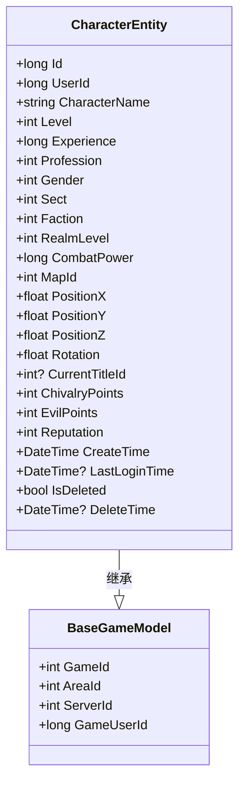
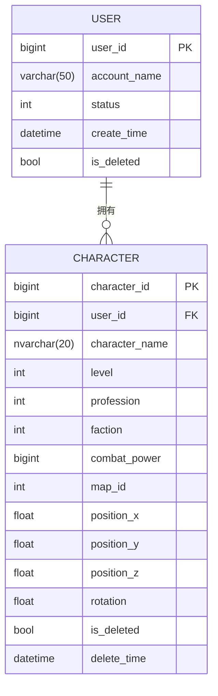
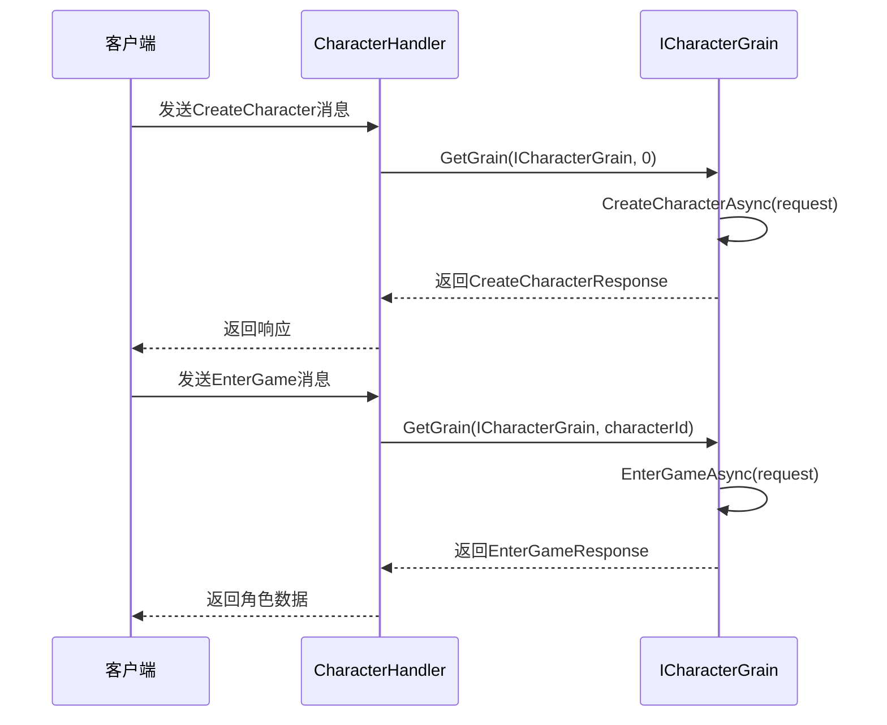

# 角色实体模型

<cite>
**本文档引用文件**  
- [CharacterEntity.cs](file://Horizon.Model/GameModel/CharacterEntity.cs)
- [UserEntity.cs](file://Horizon.Model/GameModel/UserEntity.cs)
- [CharacterHandler.cs](file://Horizon.Game.Core/Handlers/CharacterHandler.cs)
- [ICharacterGrain.cs](file://Horizon.Orleans.Interface/ICharacterGrain.cs)
- [BaseGameModel.cs](file://Horizon.Model/Base/BaseGameModel.cs)
</cite>

## 目录
1. [引言](#引言)
2. [角色实体数据结构](#角色实体数据结构)
3. [属性体系详解](#属性体系详解)
4. [用户与角色关系](#用户与角色关系)
5. [角色回收站机制](#角色回收站机制)
6. [核心业务流程分析](#核心业务流程分析)
7. [数据库优化建议](#数据库优化建议)
8. [结论](#结论)

## 引言

本技术文档全面解析《混浊世界》游戏中的 `CharacterEntity` 实体模型，该模型代表玩家可操作的游戏角色。文档详细阐述其作为核心玩家单位的数据结构设计、属性体系划分、外键关联逻辑以及状态管理机制。通过结合实际 gameplay 场景，展示角色从创建、加载到状态更新的完整生命周期，并针对高频查询场景提出性能优化方案。

**Section sources**
- [CharacterEntity.cs](file://Horizon.Model/GameModel/CharacterEntity.cs#L11-L185)

## 角色实体数据结构

`CharacterEntity` 类是游戏内角色的核心数据载体，继承自 `BaseGameModel<long>`，并使用 Entity Framework Core 的数据注解进行数据库映射配置。其主要特性包括：

- **表名映射**: 映射至数据库表 `Game_HunduShijie_Character`。
- **主键定义**: 使用 `Id` 字段作为主键，对应数据库列 `character_id`，类型为 `bigint`。
- **字段注解**: 每个属性均通过 `[Column]` 和 `[Comment]` 注解明确指定数据库列名、类型、顺序及中文描述，确保代码与数据库结构高度一致。

该实体的设计遵循了清晰的分层原则，将角色信息划分为基础、社会、战斗和空间四大属性体系。

**Diagram sources**
- [CharacterEntity.cs](file://Horizon.Model/GameModel/CharacterEntity.cs#L11-L185)
- [BaseGameModel.cs](file://Horizon.Model/Base/BaseGameModel.cs#L13-L34)

**Section sources**
- [CharacterEntity.cs](file://Horizon.Model/GameModel/CharacterEntity.cs#L11-L185)

## 属性体系详解

### 基础属性

基础属性构成了角色最根本的身份标识和成长线。

| 属性 | 数据库列 | 类型 | 说明 |
| :--- | :--- | :--- | :--- |
| **角色ID** | character_id | bigint | 角色的唯一标识符，主键。 |
| **角色名** | character_name | nvarchar(20) | 角色名称，必填项。 |
| **等级** | level | int | 当前等级，影响角色能力。 |
| **经验值** | experience | bigint | 累计获得的经验值，用于升级。 |
| **职业** | profession | int | 职业类型（0-剑客, 1-刀客, 2-枪客等）。 |
| **性别** | gender | int | 性别（0-男, 1-女）。 |

### 社会属性

社会属性体现了角色在游戏世界中的身份归属和荣誉地位。

| 属性 | 数据库列 | 类型 | 说明 |
| :--- | :--- | :--- | :--- |
| **门派** | sect | int | 所属门派（0-无门派, 1-少林寺, 2-武当派等）。 |
| **阵营** | faction | int | 阵营立场（0-中立, 1-正派, 2-邪派, 3-隐世）。 |
| **当前称号ID** | current_title_id | int (nullable) | 当前佩戴的称号ID，可为空。 |

### 战斗属性

战斗属性直接决定了角色在PVP和PVE中的表现力。

| 属性 | 数据库列 | 类型 | 说明 |
| :--- | :--- | :--- | :--- |
| **战斗力** | combat_power | bigint | 综合战斗力评分。 |
| **侠义值** | chivalry_points | int | 行侠仗义积累的正面声望。 |
| **恶名值** | evil_points | int | 作恶多端积累的负面声望。 |
| **声望值** | reputation | int | 在特定势力或区域内的影响力。 |
| **境界等级** | realm_level | int | 体现内功修为的等级。 |

### 空间属性

空间属性记录了角色在游戏三维世界中的实时位置和朝向。

| 属性 | 数据库列 | 类型 | 说明 |
| :--- | :--- | :--- | :--- |
| **当前地图ID** | map_id | int | 角色所在地图的唯一标识。 |
| **X坐标** | position_x | float | 世界坐标的X轴位置。 |
| **Y坐标** | position_y | float | 世界坐标的Y轴位置。 |
| **Z坐标** | position_z | float | 世界坐标的Z轴位置。 |
| **朝向** | rotation | float | 角色面向的角度（弧度或角度）。 |

**Section sources**
- [CharacterEntity.cs](file://Horizon.Model/GameModel/CharacterEntity.cs#L11-L185)

## 用户与角色关系

`CharacterEntity` 通过 `UserId` 外键与 `UserEntity` 建立关联，实现了“一用户多角色”的业务逻辑。

**Diagram sources**
- [CharacterEntity.cs](file://Horizon.Model/GameModel/CharacterEntity.cs#L11-L185)
- [UserEntity.cs](file://Horizon.Model/GameModel/UserEntity.cs#L11-L145)

此设计允许一个用户账号（`UserEntity`）创建并管理多个游戏角色。`UserId` 字段存储了指向 `UserEntity.Id` 的外键，确保了数据的参照完整性。这种模式极大地提升了玩家的游戏自由度和账号价值。

**Section sources**
- [CharacterEntity.cs](file://Horizon.Model/GameModel/CharacterEntity.cs#L11-L185)
- [UserEntity.cs](file://Horizon.Model/GameModel/UserEntity.cs#L11-L145)

## 角色回收站机制

系统通过 `IsDeleted` 和 `DeleteTime` 两个字段协同工作，实现了一套软删除（Soft Delete）的回收站机制。

- **`IsDeleted` (bit)**: 标记位，`true` 表示角色已被逻辑删除，`false` 表示正常状态。这是查询时过滤已删除角色的主要依据。
- **`DeleteTime` (datetime)**: 记录角色被标记为删除的具体时间戳。此字段可用于实现自动清理策略（例如，30天后物理删除）或提供恢复功能。

该机制避免了直接物理删除数据带来的风险，保障了数据安全性和玩家体验，同时为后续的数据审计和恢复提供了可能。

**Section sources**
- [CharacterEntity.cs](file://Horizon.Model/GameModel/CharacterEntity.cs#L11-L185)

## 核心业务流程分析

### 角色创建与加载流程

角色的创建和加载由 `CharacterHandler` 和 `ICharacterGrain` 协同完成，采用 Orleans 分布式虚拟Actor模型。

**Diagram sources**
- [CharacterHandler.cs](file://Horizon.Game.Core/Handlers/CharacterHandler.cs#L19-L1018)
- [ICharacterGrain.cs](file://Horizon.Orleans.Interface/ICharacterGrain.cs#L13-L334)

1.  **创建 (`CreateCharacterAsync`)**:
    *   客户端发送 `CreateCharacterRequest`。
    *   `CharacterHandler` 接收消息，调用 `ICharacterGrain.CreateCharacterAsync()` 方法。
    *   Grain 内部执行EF Core操作，将新角色持久化到数据库。
2.  **加载 (`EnterGameAsync`)**:
    *   玩家选择角色后，客户端发送 `EnterGameRequest`。
    *   `CharacterHandler` 根据 `characterId` 获取对应的 `ICharacterGrain`。
    *   Grain 调用 `EnterGameAsync()`，通常会从数据库加载完整的 `CharacterEntity` 数据并返回给客户端。

**Section sources**
- [CharacterHandler.cs](file://Horizon.Game.Core/Handlers/CharacterHandler.cs#L19-L1018)
- [ICharacterGrain.cs](file://Horizon.Orleans.Interface/ICharacterGrain.cs#L13-L334)

## 数据库优化建议

针对角色系统的高频查询场景，提出以下优化方案：

### 高频查询场景
1.  **角色列表**: 查询某用户的所有角色（按 `UserId` 过滤）。
2.  **排行榜**: 查询全服或分区的角色（按 `CombatPower`, `Level`, `ChivalryPoints` 等排序）。

### 优化方案

#### 1. 数据库索引优化
为提升查询效率，应在相关字段上建立复合索引：
- **角色列表索引**: `(user_id, is_deleted)`。此索引能高效定位特定用户的未删除角色。
- **战斗力排行榜索引**: `(combat_power DESC, is_deleted)`。支持快速获取高战力角色排名。
- **等级排行榜索引**: `(level DESC, is_deleted)`。支持快速获取高等级角色排名。

#### 2. 读写分离
实施读写分离架构以应对高并发读取压力：
- **写操作**: 所有角色创建、更新、删除操作路由至主数据库（Master），保证数据一致性。
- **读操作**: 角色列表、排行榜等只读查询路由至从数据库（Slave），通过主从复制同步数据，有效分担主库压力，提升整体系统吞吐量。

**Section sources**
- [CharacterEntity.cs](file://Horizon.Model/GameModel/CharacterEntity.cs#L11-L185)

## 结论

`CharacterEntity` 实体模型设计严谨，结构清晰，完整地覆盖了游戏角色所需的各种属性。其通过外键关联实现了灵活的“一用户多角色”机制，并利用软删除字段构建了安全的回收站功能。结合Orleans框架的Grain模型，实现了高效的分布式状态管理。通过实施针对性的数据库索引和读写分离策略，可以有效支撑大规模在线玩家的高性能需求，为游戏的稳定运行和良好用户体验奠定了坚实的基础。