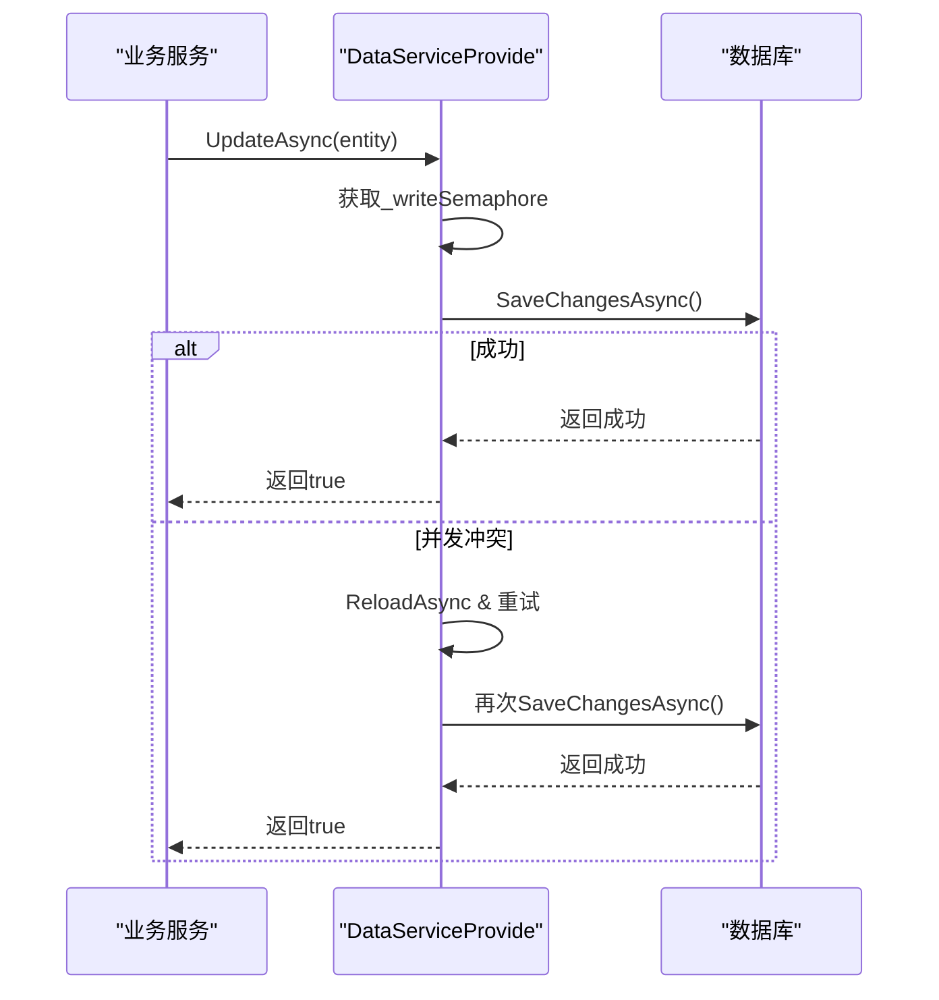
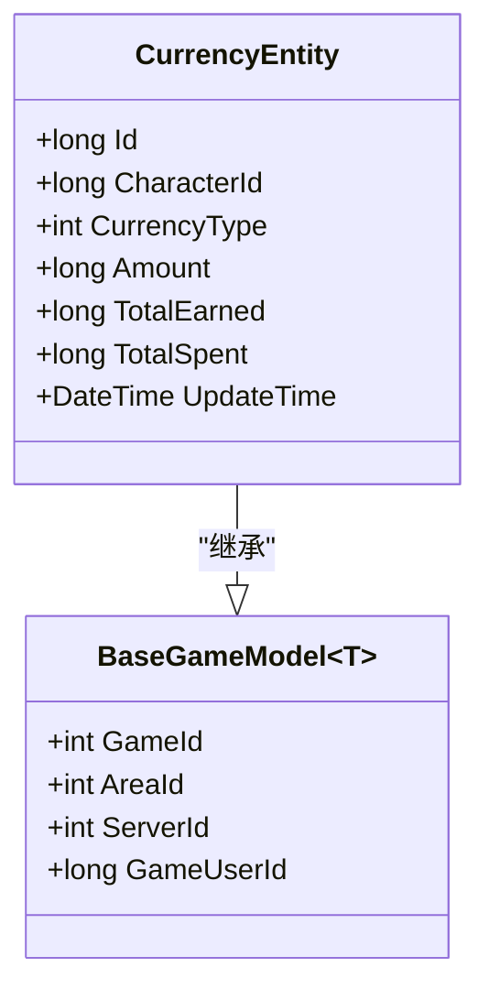
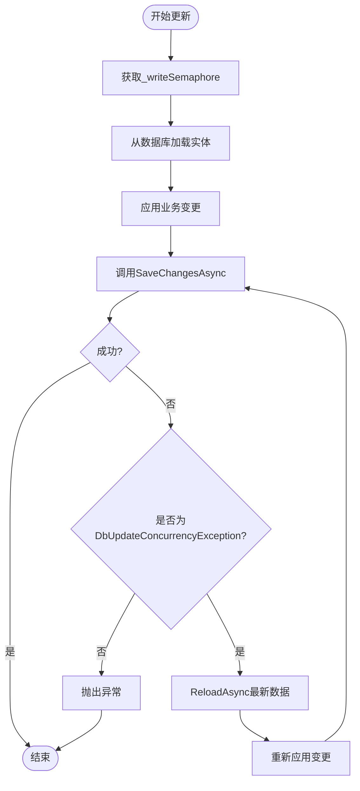

# 货币实体模型

<cite>
**本文档中引用的文件**
- [CurrencyEntity.cs](file://Horizon.Model/GameModel/CurrencyEntity.cs)
- [DataServiceProvide.cs](file://Horizon.Entities/DataServiceProvide.cs)
- [BaseGameModel.cs](file://Horizon.Model/Base/BaseGameModel.cs)
- [GameEnums.cs](file://Horizon.Game.Message/Enums/GameEnums.cs)
</cite>

## 目录
1. [简介](#简介)
2. [项目结构](#项目结构)
3. [核心组件](#核心组件)
4. [架构概述](#架构概述)
5. [详细组件分析](#详细组件分析)
6. [依赖分析](#依赖分析)
7. [性能考虑](#性能考虑)
8. [故障排除指南](#故障排除指南)
9. [结论](#结论)

## 简介
`CurrencyEntity` 是游戏经济系统的核心数据模型，用于管理角色持有的各类货币。该模型采用基于角色（CharacterId）和货币类型（CurrencyType）的分片存储设计，支持铜币、银两、金锭、元宝等多种货币并行存在。通过精确记录当前持有量、累计获得与消耗等关键指标，为游戏内经济行为提供完整的审计追踪能力。本模型结合数据库事务与乐观并发控制机制，确保在高并发场景下货币操作的原子性与数据一致性。

## 项目结构
`CurrencyEntity` 位于 `Horizon.Model` 模块下的 `GameModel` 命名空间中，是游戏领域模型的一部分。其数据持久化由 `Horizon.Entities` 模块中的 `DataServiceProvide` 统一管理，遵循仓储模式（Repository Pattern）。整个系统基于 .NET 生态构建，使用 Entity Framework Core 进行 ORM 映射，并通过 Orleans 框架实现分布式状态管理。

```mermaid
graph TB
subgraph "数据层"
DataService[DataServiceProvide]
CurrencyEntity[CurrencyEntity]
end
subgraph "模型层"
BaseGameModel[BaseGameModel]
end
subgraph "消息层"
GameEnums[GameEnums]
end
CurrencyEntity --> BaseGameModel : "继承"
DataService --> CurrencyEntity : "操作"
```

**Diagram sources**
- [CurrencyEntity.cs](file://Horizon.Model/GameModel/CurrencyEntity.cs#L12-L60)
- [DataServiceProvide.cs](file://Horizon.Entities/DataServiceProvide.cs#L14-L576)
- [BaseGameModel.cs](file://Horizon.Model/Base/BaseGameModel.cs#L13-L34)

**Section sources**
- [CurrencyEntity.cs](file://Horizon.Model/GameModel/CurrencyEntity.cs#L1-L62)
- [DataServiceProvide.cs](file://Horizon.Entities/DataServiceProvide.cs#L1-L576)

## 核心组件
`CurrencyEntity` 类定义了游戏内货币的核心属性，包括角色ID、货币类型、当前数量、累计获得、累计消耗及最后更新时间。它继承自 `BaseGameModel<long>`，具备游戏ID、区服ID等上下文信息。该实体通过复合字段（CharacterId + CurrencyType）保证每个角色每种货币的唯一性，避免重复记录。

**Section sources**
- [CurrencyEntity.cs](file://Horizon.Model/GameModel/CurrencyEntity.cs#L12-L60)

## 架构概述
系统采用分层架构，`CurrencyEntity` 作为领域模型处于核心位置。上层业务逻辑通过 `DataServiceProvide` 提供的标准接口进行增删改查操作。所有写操作均受信号量保护，防止并发冲突，并在发生 `DbUpdateConcurrencyException` 时自动重试，保障数据最终一致性。



**Diagram sources**
- [DataServiceProvide.cs](file://Horizon.Entities/DataServiceProvide.cs#L303-L366)
- [CurrencyEntity.cs](file://Horizon.Model/GameModel/CurrencyEntity.cs#L12-L60)

## 详细组件分析

### CurrencyEntity 分析
`CurrencyEntity` 是一个典型的聚合根实体，封装了货币相关的所有状态和行为。其设计充分考虑了可扩展性和性能优化。

#### 类图


**Diagram sources**
- [CurrencyEntity.cs](file://Horizon.Model/GameModel/CurrencyEntity.cs#L12-L60)
- [BaseGameModel.cs](file://Horizon.Model/Base/BaseGameModel.cs#L13-L34)

#### 字段说明
- **Amount**: 当前持有量，表示角色当前拥有的该种货币数量。
- **TotalEarned**: 累计获得，记录角色自创建以来通过各种途径获得的该货币总量。
- **TotalSpent**: 累计消耗，记录角色自创建以来在各种消费行为中支出的该货币总量。
- **UpdateTime**: 最后更新时间，用于标识该条记录最后一次被修改的时间戳，辅助缓存失效和数据同步。

这些字段共同构成了一个完整的账户视图，不仅支持实时余额查询，还能用于数据分析和反作弊监控。

**Section sources**
- [CurrencyEntity.cs](file://Horizon.Model/GameModel/CurrencyEntity.cs#L12-L60)

### 数据一致性保障
系统通过以下机制确保 `CurrencyEntity` 的数据一致性：
1. **复合主键约束**：虽然未显式声明联合主键，但业务逻辑确保 `(CharacterId, CurrencyType)` 的组合唯一性。
2. **数据库事务**：所有写操作均在 EF Core 的 `SaveChangesAsync()` 中隐式包含事务。
3. **乐观锁机制**：当捕获到 `DbUpdateConcurrencyException` 时，系统会自动重新加载最新数据并重试更新，避免脏写问题。



**Diagram sources**
- [DataServiceProvide.cs](file://Horizon.Entities/DataServiceProvide.cs#L303-L366)

**Section sources**
- [DataServiceProvide.cs](file://Horizon.Entities/DataServiceProvide.cs#L303-L366)

## 依赖分析
`CurrencyEntity` 依赖于多个基础组件协同工作：
- **BaseGameModel**: 提供基础的游戏上下文信息。
- **DataServiceProvide**: 提供统一的数据访问接口和并发控制。
- **EF Core**: 负责对象关系映射和数据库交互。
- **GameEnums.CurrencyType**: 定义了货币类型的枚举值（Gold, Silver, Diamond, Honor），尽管实际存储使用整数，但建议未来统一使用此枚举以增强类型安全。

```mermaid
dependencyDiagram
CurrencyEntity --> BaseGameModel
CurrencyEntity --> DataServiceProvide
CurrencyEntity --> GameEnums
DataServiceProvide --> DbContext
```

**Diagram sources**
- [CurrencyEntity.cs](file://Horizon.Model/GameModel/CurrencyEntity.cs#L12-L60)
- [DataServiceProvide.cs](file://Horizon.Entities/DataServiceProvide.cs#L14-L576)
- [GameEnums.cs](file://Horizon.Game.Message/Enums/GameEnums.cs#L89-L95)

**Section sources**
- [CurrencyEntity.cs](file://Horizon.Model/GameModel/CurrencyEntity.cs#L12-L60)
- [DataServiceProvide.cs](file://Horizon.Entities/DataServiceProvide.cs#L14-L576)

## 性能考虑
为应对高并发场景，系统采取了多项性能优化措施：
- 使用 `SemaphoreSlim` 对写操作进行串行化，防止数据库连接池耗尽。
- 查询操作使用 `AsNoTracking()` 提升读取性能。
- 通过 `DbContextHealthCheck` 主动维护数据库连接状态，减少网络延迟影响。
- 所有异步方法均使用 `async/await` 模式，避免线程阻塞。

## 故障排除指南
常见问题及解决方案：
- **并发更新失败**：系统已内置重试机制，通常无需干预。若频繁发生，需检查业务逻辑是否存在不必要的循环更新。
- **数据不一致**：检查 `TotalEarned` 与 `TotalSpent` 是否与 `Amount` 存在偏差，应确保每次变更都正确累加。
- **性能瓶颈**：监控 `_writeSemaphore` 等待时间，若过长可考虑引入缓存层或进一步分库分表。

**Section sources**
- [DataServiceProvide.cs](file://Horizon.Entities/DataServiceProvide.cs#L303-L366)
- [TranscationException.cs](file://Horizon.Core/TranscationException.cs#L0-L44)

## 结论
`CurrencyEntity` 模型设计合理，具备良好的扩展性与健壮性。通过分片存储、原子操作和乐观锁机制，有效支撑了复杂的游戏经济系统。建议未来将 `CurrencyType` 字段改为强类型枚举，并增加事件溯源机制以实现更精细的操作审计。