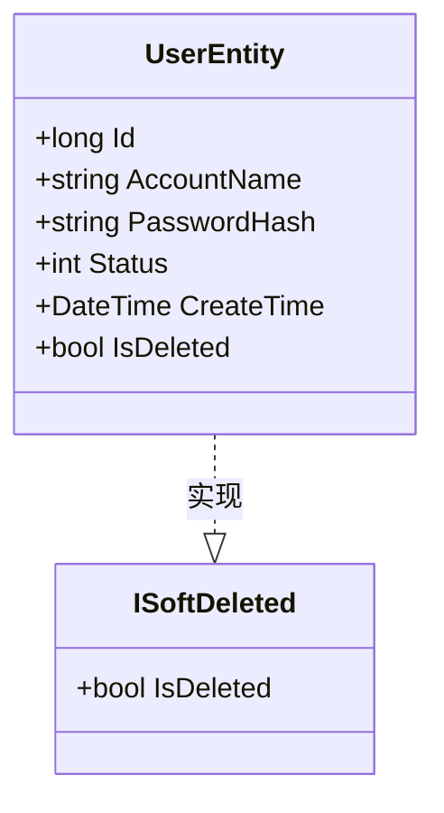
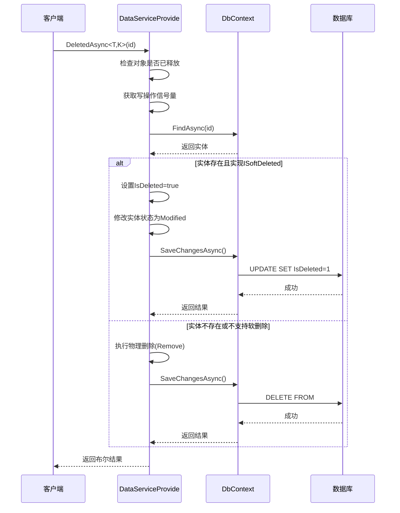
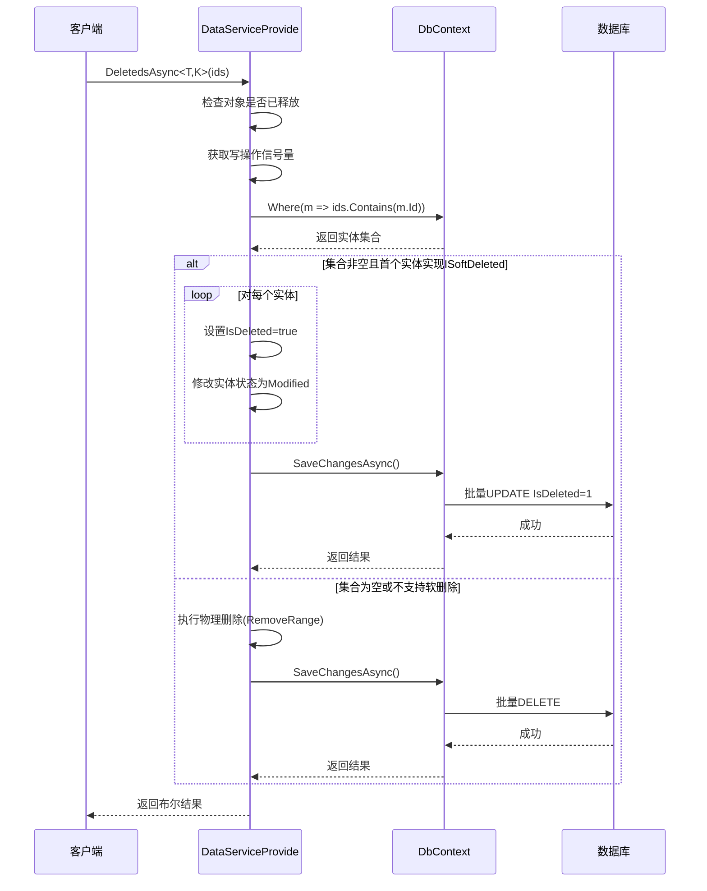
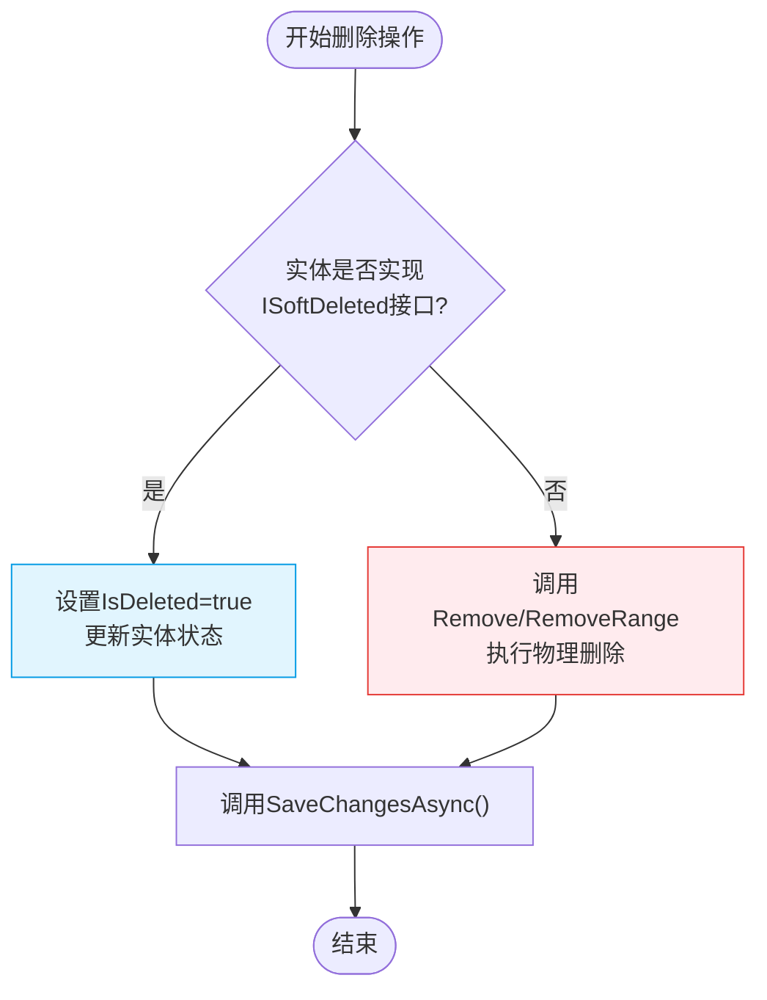
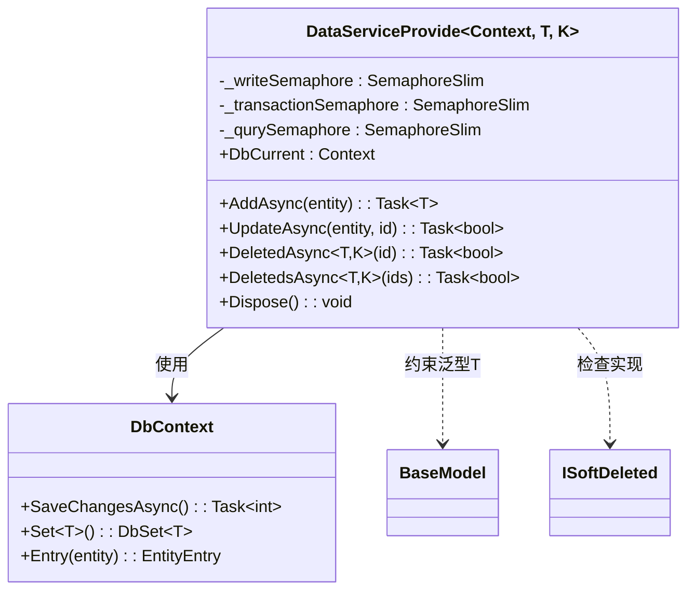

# 软删除机制实现

<cite>
**Referenced Files in This Document **   
- [ISoftDeleted.cs](file://Horizon.Core.Abstract/ISoftDeleted.cs)
- [UserEntity.cs](file://Horizon.Model/GameModel/UserEntity.cs)
- [GameEntityContext.cs](file://Horizon.Entities/GameEntityContext.cs)
- [DataServiceProvide.cs](file://Horizon.Entities/DataServiceProvide.cs)
</cite>

## 目录
1. [引言](#引言)
2. [核心接口与实体设计](#核心接口与实体设计)
3. [软删除执行流程](#软删除执行流程)
4. [物理删除与软删除对比](#物理删除与软删除对比)
5. [数据访问服务分析](#数据访问服务分析)
6. [最佳实践与影响分析](#最佳实践与影响分析)
7. [结论](#结论)

## 引言

本文档全面解析基于`ISoftDeleted`接口的软删除架构设计。该机制通过在数据模型中引入逻辑删除标记，实现了数据的可恢复性与完整性保护。系统通过统一的数据访问层对所有支持软删除的实体进行管理，并在查询时自动过滤已删除记录，确保业务逻辑的一致性和数据安全性。

## 核心接口与实体设计

### ISoftDeleted 接口定义

`ISoftDeleted`接口是软删除功能的核心契约，为所有需要支持逻辑删除的实体提供了统一的标准。



**Diagram sources**
- [ISoftDeleted.cs](file://Horizon.Core.Abstract/ISoftDeleted.cs#L9-L15)
- [UserEntity.cs](file://Horizon.Model/GameModel/UserEntity.cs#L11-L145)

**Section sources**
- [ISoftDeleted.cs](file://Horizon.Core.Abstract/ISoftDeleted.cs#L9-L15)
- [UserEntity.cs](file://Horizon.Model/GameModel/UserEntity.cs#L11-L145)

#### 接口职责

`ISoftDeleted`接口仅包含一个属性：

- `IsDeleted`: 布尔类型，表示实体是否已被逻辑删除。`true`代表已删除，`false`代表未删除。

此设计遵循单一职责原则，将删除状态的管理封装在一个简洁的接口中，便于跨实体复用。

#### UserEntity 实体实现

`UserEntity`类作为游戏用户账号信息的持久化模型，实现了`ISoftDeleted`接口。其关键特性包括：

- 通过`[Column("is_deleted", TypeName = "bit")]`属性将`IsDeleted`字段映射到数据库的位类型列。
- 在实体定义中明确标注了"是否已删除"的业务语义。
- 继承自`BaseGameModel<long>`，表明其具备基础的游戏模型特征。

这种实现方式使得任何查询`UserEntity`的操作都可以根据`IsDeleted`字段的状态来决定是否包含该记录，而无需真正从数据库中移除数据。

## 软删除执行流程

### 单条记录软删除

当调用`DeletedAsync`方法删除单个实体时，系统会执行以下步骤：



**Diagram sources**
- [DataServiceProvide.cs](file://Horizon.Entities/DataServiceProvide.cs#L436-L483)

**Section sources**
- [DataServiceProvide.cs](file://Horizon.Entities/DataServiceProvide.cs#L436-L483)

### 批量软删除

批量删除操作`DeletedsAsync`遵循类似的逻辑，但针对多个ID进行处理：



**Diagram sources**
- [DataServiceProvide.cs](file://Horizon.Entities/DataServiceProvide.cs#L491-L542)

**Section sources**
- [DataServiceProvide.cs](file://Horizon.Entities/DataServiceProvide.cs#L491-L542)

## 物理删除与软删除对比

虽然当前代码库中未直接展示物理删除的完整实现（相关方法被标记为`NotImplementedException`），但可以通过现有逻辑推断两者的差异：



**Diagram sources**
- [DataServiceProvide.cs](file://Horizon.Entities/DataServiceProvide.cs#L436-L542)

**Section sources**
- [DataServiceProvide.cs](file://Horizon.Entities/DataServiceProvide.cs#L436-L542)

### 关键区别

| 特性 | 软删除 | 物理删除 |
|------|--------|----------|
| 数据可见性 | 记录保留在数据库中 | 记录从数据库中永久移除 |
| 可恢复性 | 可通过设置`IsDeleted=false`恢复 | 不可恢复 |
| 性能影响 | 更新操作，通常较快 | 删除操作，可能涉及外键约束检查 |
| 存储占用 | 持续占用存储空间 | 释放存储空间 |
| 查询复杂度 | 需要全局过滤器排除已删除记录 | 无需特殊处理 |

## 数据访问服务分析

`DataServiceProvide`类作为数据访问的核心服务，承担了软删除逻辑的主要实现责任。



**Diagram sources**
- [DataServiceProvide.cs](file://Horizon.Entities/DataServiceProvide.cs#L1-L578)

**Section sources**
- [DataServiceProvide.cs](file://Horizon.Entities/DataServiceProvide.cs#L1-L578)

### 并发控制机制

该服务采用了多种并发控制策略以确保数据一致性：

- `_writeSemaphore`: 控制写操作的并发访问，防止竞态条件。
- `_transactionSemaphore`: 管理事务级别的并发。
- `_qurySemaphore`: 限制查询操作的并发数量。

这些信号量机制有效防止了高并发场景下的数据损坏风险。

### 错误处理与日志记录

在软删除过程中，系统对可能出现的异常进行了周全的处理：

- `DbUpdateConcurrencyException`: 捕获并发更新冲突，并记录错误日志。
- 通用`Exception`: 捕获其他异常并返回`false`表示操作失败。
- 使用`Log.Error()`方法记录详细的错误信息，便于问题排查。

## 最佳实践与影响分析

### 索引设计建议

由于软删除依赖于`IsDeleted`字段进行查询过滤，建议在该字段上创建索引以提高查询性能：

```sql
CREATE INDEX IX_UserEntity_IsDeleted ON Game_HunduShijie_User (is_deleted) 
WHERE is_deleted = 0; -- 过滤掉已删除记录的索引
```

对于频繁查询未删除记录的场景，可以考虑使用过滤索引（Filtered Index）来进一步优化性能。

### 数据归档策略

长期积累的已删除数据可能导致表体积膨胀，建议实施以下归档策略：

1. **定期归档**: 将超过一定时间（如6个月）的`IsDeleted=true`记录迁移到历史归档表。
2. **分区表**: 按时间对主表进行分区，便于管理和清理旧数据。
3. **TTL机制**: 实现自动清理策略，在满足条件后执行物理删除。

### 审计日志集成

为了满足合规性要求，软删除操作应与审计日志系统集成：

- 记录删除操作的执行者（用户或系统）。
- 记录删除的时间戳和上下文信息。
- 提供恢复操作的日志追踪能力。

这不仅能增强系统的可追溯性，也为潜在的数据恢复提供了依据。

### 性能考量

软删除机制对系统性能有双重影响：

- **正面影响**: 避免了物理删除带来的外键级联操作开销。
- **负面影响**: 随着已删除数据的积累，全表扫描的性能会逐渐下降。

因此，需要在数据安全性和系统性能之间找到平衡点，通过合理的索引设计和数据归档策略来维持系统健康。

## 结论

本项目通过`ISoftDeleted`接口和`DataServiceProvide`服务实现了一套完整的软删除机制。该设计具有良好的扩展性和一致性，能够有效地保护数据完整性，同时提供灵活的数据恢复能力。通过在`UserEntity`等实体中应用此模式，系统实现了逻辑删除的功能，避免了因误操作导致的数据永久丢失风险。未来可通过引入更精细化的索引策略、自动化归档机制和完善的审计日志来进一步提升该软删除体系的成熟度和可靠性。