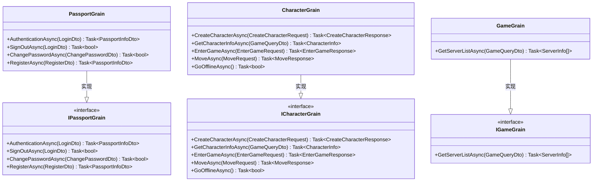
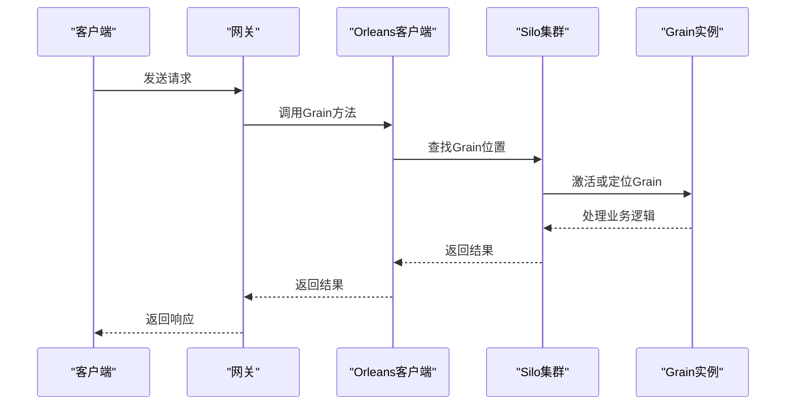
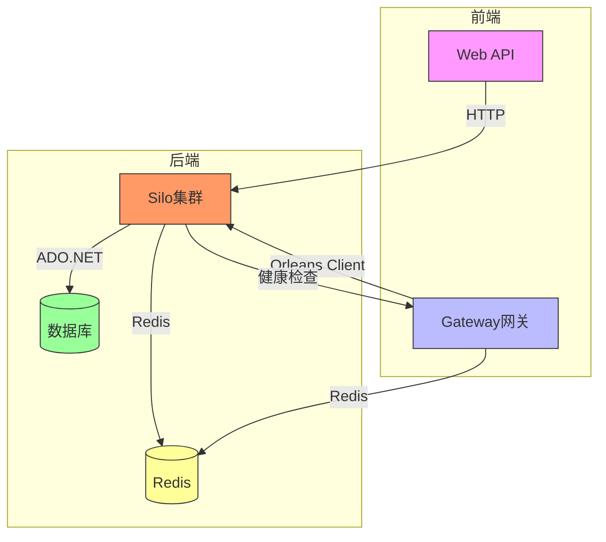
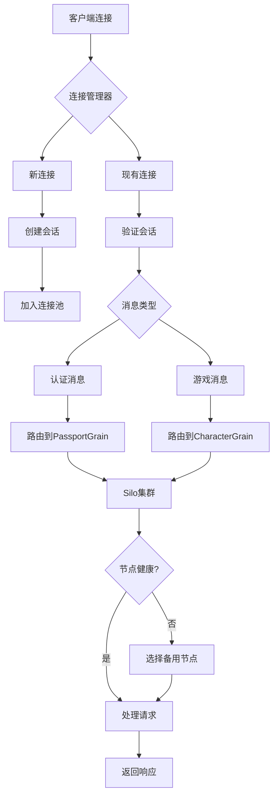
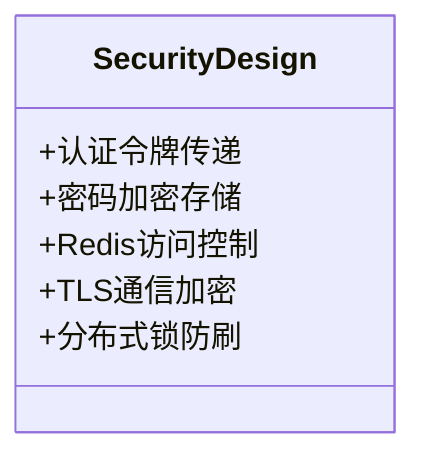

# 核心架构

<cite>
**本文档中引用的文件**  
- [PassportGrain.cs](file://Horizon.Orleans.Grains\PassportGrain.cs)
- [CharacterGrain.cs](file://Horizon.Orleans.Grains\CharacterGrain.cs)
- [GameGrain.cs](file://Horizon.Orleans.Grains\GameGrain.cs)
- [IPassportGrain.cs](file://Horizon.Orleans.Interface\IPassportGrain.cs)
- [ICharacterGrain.cs](file://Horizon.Orleans.Interface\ICharacterGrain.cs)
- [IGameGrain.cs](file://Horizon.Orleans.Interface\IGameGrain.cs)
- [Program.cs](file://Horizon.Orleans.Silo\Program.cs)
- [OrleansClient.cs](file://Horizon.Game.Core\OrleansClient.cs)
- [GatewayService.cs](file://Horizon.Game.Gateway\Services\GatewayService.cs)
- [ConnectionManager.cs](file://Horizon.Game.Gateway\Services\ConnectionManager.cs)
- [ClusterModels.cs](file://Horizon.Game.Gateway\Services\ClusterModels.cs)
- [RedisClusterStorage.cs](file://Horizon.Game.Gateway\Services\RedisClusterStorage.cs)
</cite>

## 目录
1. [系统概述](#系统概述)
2. [Silo集群与Grain实例管理](#silo集群与grain实例管理)
3. [客户端通信机制](#客户端通信机制)
4. [组件交互关系图](#组件交互关系图)
5. [Grain状态管理策略](#grain状态管理策略)
6. [激活/停用机制与资源利用](#激活停用机制与资源利用)
7. [消息路由、负载均衡与故障转移](#消息路由负载均衡与故障转移)
8. [可扩展性与容错能力](#可扩展性与容错能力)
9. [安全性设计](#安全性设计)
10. [性能优化建议](#性能优化建议)

## 系统概述

本系统采用基于Orleans框架的分布式架构，通过Silo集群承载核心业务逻辑的Grain实例。系统由Web API、Gateway网关、Orleans Silo集群、数据库和Redis缓存等组件构成。客户端通过Gateway与后端服务通信，Gateway将请求路由至Orleans Client，最终由Silo集群中的Grain实例处理业务逻辑。该架构实现了高并发、低延迟的游戏服务支持。

**Section sources**
- [Program.cs](file://Horizon.Orleans.Silo\Program.cs#L0-L529)
- [OrleansClient.cs](file://Horizon.Game.Core\OrleansClient.cs#L0-L164)

## Silo集群与Grain实例管理

Silo集群是Orleans框架的核心运行时环境，负责承载和管理Grain实例。系统定义了三种核心Grain：PassportGrain、CharacterGrain和GameGrain，分别处理用户认证、角色管理和游戏服务器信息查询。

PassportGrain继承自`Grain`并实现`IPassportGrain`接口，负责用户注册、登录、登出和密码修改等身份验证操作。它通过依赖注入获取多个数据上下文，用于访问通行证、用户和游戏用户数据。

CharacterGrain继承自`Grain<CharacterState>`并实现`ICharacterGrain`接口，管理游戏角色的全生命周期。它使用`IPersistentState<CharacterState>`来持久化角色状态，并提供了创建角色、进入游戏、移动、战斗等一系列游戏相关方法。

GameGrain实现`IGameGrain`接口，提供游戏服务器列表查询功能，通过映射器将数据库实体转换为传输对象返回给客户端。

**Diagram sources**
- [PassportGrain.cs](file://Horizon.Orleans.Grains\PassportGrain.cs#L24-L394)
- [CharacterGrain.cs](file://Horizon.Orleans.Grains\CharacterGrain.cs#L40-L653)
- [GameGrain.cs](file://Horizon.Orleans.Grains\GameGrain.cs#L18-L41)
- [IPassportGrain.cs](file://Horizon.Orleans.Interface\IPassportGrain.cs#L12-L83)
- [ICharacterGrain.cs](file://Horizon.Orleans.Interface\ICharacterGrain.cs#L13-L334)
- [IGameGrain.cs](file://Horizon.Orleans.Interface\IGameGrain.cs#L6-L14)

**Section sources**
- [PassportGrain.cs](file://Horizon.Orleans.Grains\PassportGrain.cs#L24-L394)
- [CharacterGrain.cs](file://Horizon.Orleans.Grains\CharacterGrain.cs#L40-L653)
- [GameGrain.cs](file://Horizon.Orleans.Grains\GameGrain.cs#L18-L41)

## 客户端通信机制

客户端通过Orleans Client与Silo集群中的Grain实例进行通信。Orleans Client封装了IClusterClient，提供连接管理和重试机制。在Gateway和Web API中，通过OrleansClient类初始化客户端连接，配置AdoNet集群发现、超时设置和序列化器。

客户端首先读取配置文件中的集群选项，包括连接字符串、集群ID和服务ID。然后使用UseAdoNetClustering配置集群发现，确保客户端能自动发现Silo节点。通过Configure<ClientMessagingOptions>设置响应超时为30秒，避免长时间挂起。同时配置网关列表刷新周期为10分钟，减少网络开销。

当需要调用Grain方法时，客户端通过GrainFactory.GetGrain<T>(key)获取Grain引用，然后直接调用其接口方法。Orleans运行时负责透明地定位目标Grain所在的Silo节点，并处理网络通信细节。

**Diagram sources**
- [OrleansClient.cs](file://Horizon.Game.Core\OrleansClient.cs#L75-L164)
- [Program.cs](file://Horizon.Orleans.Silo\Program.cs#L257-L266)

**Section sources**
- [OrleansClient.cs](file://Horizon.Game.Core\OrleansClient.cs#L22-L164)

## 组件交互关系图

系统包含多个关键组件，它们之间通过明确定义的接口和协议进行交互。Web API作为HTTP入口点，处理RESTful请求；Gateway作为TCP长连接网关，管理客户端连接；Silo集群承载业务逻辑；数据库存储持久化数据；Redis提供高速缓存和集群状态存储。

**Diagram sources**
- [Program.cs](file://Horizon.Orleans.Silo\Program.cs#L0-L529)
- [OrleansClient.cs](file://Horizon.Game.Core\OrleansClient.cs#L0-L164)
- [GatewayService.cs](file://Horizon.Game.Gateway\Services\GatewayService.cs#L0-L170)

## Grain状态管理策略

Grain的状态管理采用Orleans的持久化状态机制，通过`IPersistentState<T>`接口实现。每个有状态的Grain（如CharacterGrain）都声明一个持久化状态属性，在构造函数中通过`[PersistentState]`特性指定状态名称和存储提供程序。

例如，CharacterGrain使用`[PersistentState("character", "GameStore")]`注解，表明其状态将存储在名为"GameStore"的存储提供程序中。该提供程序在Silo配置中通过AddAdoNetGrainStorageAsDefault或AddAdoNetGrainStorage注册，指向特定的数据库连接。

状态的读写通过`_characterState.State`属性访问，并在修改后调用`WriteStateAsync()`方法持久化到数据库。系统还实现了自定义的`CustomGrainStorageSerializer`，可能用于加密敏感数据或优化序列化性能。

对于无状态的Grain（如GameGrain），不使用持久化状态，所有数据从数据库实时查询。

**Section sources**
- [CharacterGrain.cs](file://Horizon.Orleans.Grains\CharacterGrain.cs#L56-L70)
- [Program.cs](file://Horizon.Orleans.Silo\Program.cs#L376-L412)

## 激活/停用机制与资源利用

Orleans的Grain具有自动激活和停用机制，有效管理内存资源。当首次调用某个Grain的方法时，Orleans运行时会自动激活该Grain（OnActivateAsync），从持久化存储加载状态到内存。

CharacterGrain重写了OnActivateAsync方法，在激活时检查内存状态是否存在，若不存在则尝试从数据库加载。这保证了即使Silo重启，Grain也能恢复其状态。

当Grain一段时间内无任何调用时，Orleans会自动将其停用（DeactivateOnIdle），释放内存资源。CharacterGrain在角色登出时显式调用DeactivateOnIdle()，立即释放资源。这种按需激活的模式使得系统可以承载远超物理内存限制的Grain实例数量，极大地提高了资源利用率。

PassportGrain作为无状态Grain，虽然也继承自Grain，但不维护持久化状态，其生命周期管理更为轻量。

**Section sources**
- [CharacterGrain.cs](file://Horizon.Orleans.Grains\CharacterGrain.cs#L100-L115)
- [CharacterGrain.cs](file://Horizon.Orleans.Grains\CharacterGrain.cs#L250-L260)

## 消息路由、负载均衡与故障转移

系统通过Gateway实现消息路由和负载均衡。GatewayService管理客户端连接，ConnectionManager跟踪所有活动连接，并通过LoadBalancer选择最优的Silo节点处理请求。

消息路由流程如下：客户端连接到Gateway，Gateway建立会话并记录连接信息。当收到客户端消息时，Gateway根据消息类型和当前负载情况，通过Orleans Client将请求路由到最合适的Silo节点。

故障转移通过Orleans的集群健康监测机制实现。Silo节点定期报告其状态，当某个节点失效时，集群管理器会自动将其标记为不可用，并将流量重定向到其他健康节点。RedisClusterStorage用于存储集群状态快照，支持快速恢复。

**Diagram sources**
- [GatewayService.cs](file://Horizon.Game.Gateway\Services\GatewayService.cs#L130-L170)
- [ConnectionManager.cs](file://Horizon.Game.Gateway\Services\ConnectionManager.cs#L0-L36)
- [RedisClusterStorage.cs](file://Horizon.Game.Gateway\Services\RedisClusterStorage.cs#L307-L336)

**Section sources**
- [GatewayService.cs](file://Horizon.Game.Gateway\Services\GatewayService.cs#L0-L239)
- [ConnectionManager.cs](file://Horizon.Game.Gateway\Services\ConnectionManager.cs#L0-L36)
- [ClusterModels.cs](file://Horizon.Game.Gateway\Services\ClusterModels.cs#L0-L60)

## 可扩展性与容错能力

系统具有良好的可扩展性和容错能力。Silo节点可以水平扩展，只需启动新的Silo实例并配置相同的集群ID和数据库连接，即可自动加入现有集群。Orleans的虚拟Actor模型确保Grain实例在集群中均匀分布，新节点加入后会自动接管部分Grain的激活责任。

容错能力体现在多个层面：Orleans集群使用AdoNetClustering，依赖数据库进行成员资格管理，即使部分Silo节点宕机，集群仍能继续运行。Grain状态持久化到数据库，确保数据不会因节点故障而丢失。Gateway与Silo之间的通信具有重试机制，短暂的网络中断不会影响服务可用性。

通过Dashboard监控工具，可以实时观察Silo集群的健康状况、CPU和内存使用情况，便于及时发现和解决问题。

**Section sources**
- [Program.cs](file://Horizon.Orleans.Silo\Program.cs#L229-L259)
- [Program.cs](file://Horizon.Orleans.Silo\Program.cs#L376-L412)

## 安全性设计

系统在多个层面实施安全措施。认证令牌通过LoginDto和RegisterDto在客户端与PassportGrain之间传递，密码在存储前经过SetPasportPassword方法加密处理。

敏感数据如密码哈希、盐值等在数据库中加密存储。RedisClusterStorage使用JSON序列化存储集群状态，可能包含敏感信息，因此Redis服务器应配置访问控制和加密传输。

Orleans Client与Silo之间的通信可以通过TLS加密，虽然当前配置未明确启用，但框架支持安全通道。系统还实现了防刷机制，如在注册时使用分布式锁防止重复提交。

**Diagram sources**
- [PassportGrain.cs](file://Horizon.Orleans.Grains\PassportGrain.cs#L200-L210)
- [PassportHelper.cs](file://Horizon.Core\Helper\PassportHelper.cs#L0-L10)

**Section sources**
- [PassportGrain.cs](file://Horizon.Orleans.Grains\PassportGrain.cs#L150-L180)

## 性能优化建议

为提升系统性能，建议采取以下最佳实践：

1. **批处理调用**：对于频繁的小型更新操作（如角色移动），可收集一定时间内的变更，批量写入状态，减少数据库IO。
2. **避免阻塞异步方法**：所有Grain方法必须保持异步，避免使用.Result或.Wait()导致线程阻塞。
3. **合理使用缓存**：高频读取的数据（如服务器列表）可在Grain内短期缓存，减少数据库查询。
4. **优化序列化**：使用高效的序列化器如MemoryPack替代Newtonsoft.Json，减少网络传输开销。
5. **控制状态大小**：Grain状态不宜过大，可将不常用的数据存于外部存储，按需加载。
6. **调整超时设置**：根据实际网络环境微调ResponseTimeout，平衡用户体验和资源占用。

这些优化措施能显著提升系统的吞吐量和响应速度，支持更高并发的用户访问。

**Section sources**
- [OrleansClient.cs](file://Horizon.Game.Core\OrleansClient.cs#L100-L120)
- [CharacterGrain.cs](file://Horizon.Orleans.Grains\CharacterGrain.cs#L180-L190)