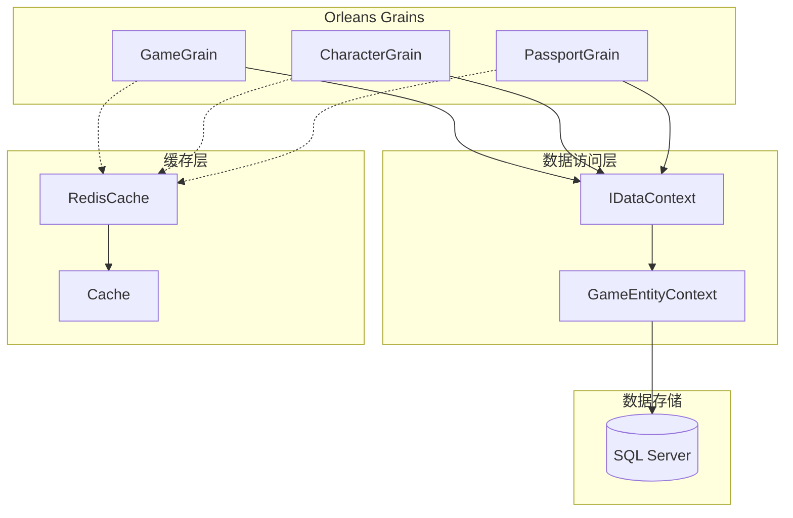
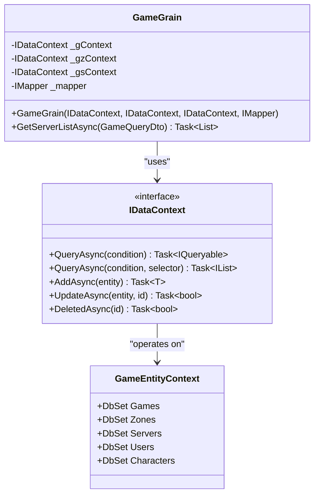
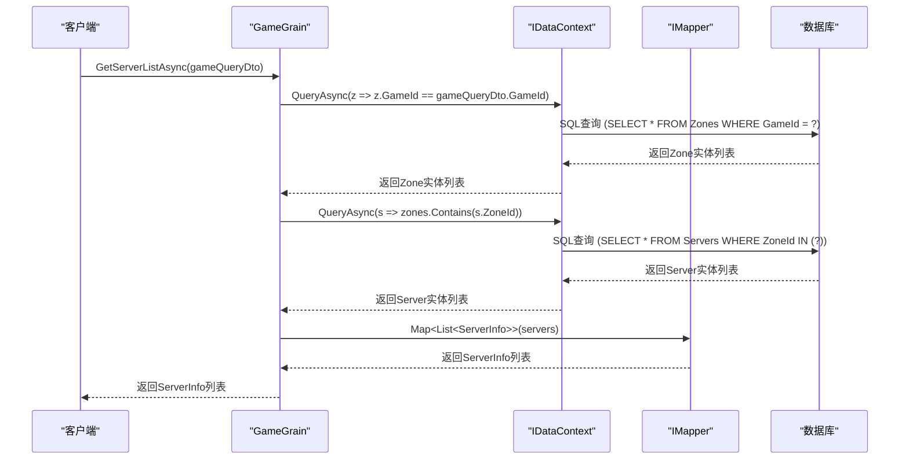
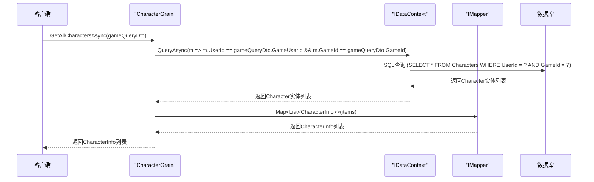
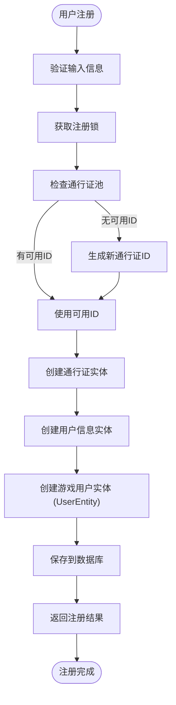
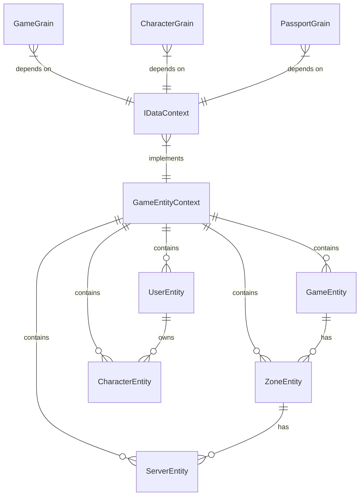

# 游戏服务

<cite>
**Referenced Files in This Document**   
- [GameGrain.cs](file://Horizon.Orleans.Grains/GameGrain.cs)
- [IDataContext.cs](file://Horizon.Core.Abstract/IDataContext.cs)
- [GameEntityContext.cs](file://Horizon.Entities/GameEntityContext.cs)
- [CharacterGrain.cs](file://Horizon.Orleans.Grains/CharacterGrain.cs)
- [PassportGrain.cs](file://Horizon.Orleans.Grains/PassportGrain.cs)
- [IGameGrain.cs](file://Horizon.Orleans.Interface/IGameGrain.cs)
- [RedisCache.cs](file://Horizon.Strategy.Storage.Redis/RedisCache.cs)
- [Cache.cs](file://Horizon.Core/Cache.cs)
- [CacheConst.cs](file://Horizon.Core/CacheConst.cs)
</cite>

## 目录
1. [引言](#引言)
2. [核心组件分析](#核心组件分析)
3. [架构概览](#架构概览)
4. [详细组件分析](#详细组件分析)
5. [依赖关系分析](#依赖关系分析)
6. [缓存策略与性能考量](#缓存策略与性能考量)
7. [可扩展性设计](#可扩展性设计)
8. [接口使用示例](#接口使用示例)
9. [结论](#结论)

## 引言

本文档旨在全面描述基于Orleans框架构建的游戏服务组件`GameGrain`的架构与核心服务能力。该服务作为游戏后端的核心，负责管理全局游戏信息，如服务器列表和游戏配置，并通过`IDataContext`接口与`GameEntityContext`数据上下文进行交互。文档将深入探讨`GameGrain`如何与`CharacterGrain`、`PassportGrain`等其他Grain协同工作，以支持多游戏实例的部署。同时，本文档将详细说明服务的初始化流程、基于`RedisCache`的缓存策略以减轻数据库压力，并提供关键公共接口的使用示例和性能考量。

## 核心组件分析

`GameGrain`是实现`IGameGrain`接口的核心服务组件，其主要职责是提供对全局游戏信息的访问。它通过依赖注入获取多个`IDataContext`实例，这些实例分别用于访问`GameEntityContext`中的不同实体，如游戏（Game）、区域（Zone）和服务器（Server）。`GameGrain`利用`IMapper`进行数据传输对象（DTO）的映射，确保了业务逻辑与数据访问层的解耦。

**Section sources**
- [GameGrain.cs](file://Horizon.Orleans.Grains/GameGrain.cs#L18-L41)
- [IGameGrain.cs](file://Horizon.Orleans.Interface/IGameGrain.cs#L6-L14)

## 架构概览



**Diagram sources **
- [GameGrain.cs](file://Horizon.Orleans.Grains/GameGrain.cs#L18-L41)
- [CharacterGrain.cs](file://Horizon.Orleans.Grains/CharacterGrain.cs#L40-L657)
- [PassportGrain.cs](file://Horizon.Orleans.Grains/PassportGrain.cs#L24-L394)
- [IDataContext.cs](file://Horizon.Core.Abstract/IDataContext.cs#L16-L106)
- [GameEntityContext.cs](file://Horizon.Entities/GameEntityContext.cs#L110-L187)
- [RedisCache.cs](file://Horizon.Strategy.Storage.Redis/RedisCache.cs#L9-L483)
- [Cache.cs](file://Horizon.Core/Cache.cs#L10-L572)

## 详细组件分析

### GameGrain 分析

`GameGrain`是游戏服务的入口点，它通过`IDataContext`接口与`GameEntityContext`进行交互，以获取服务器列表等全局信息。

#### 服务初始化与依赖注入
`GameGrain`的构造函数接收多个`IDataContext`实例和一个`IMapper`实例。这些依赖项由Orleans框架在Grain激活时通过依赖注入容器提供。这种设计模式确保了`GameGrain`的职责单一，并且易于测试。



**Diagram sources **
- [GameGrain.cs](file://Horizon.Orleans.Grains/GameGrain.cs#L18-L41)
- [IDataContext.cs](file://Horizon.Core.Abstract/IDataContext.cs#L16-L106)
- [GameEntityContext.cs](file://Horizon.Entities/GameEntityContext.cs#L110-L187)

#### 获取服务器列表接口
`GetServerListAsync`是`GameGrain`提供的核心公共接口。该方法接收一个`GameQueryDto`对象，根据游戏ID查询所有相关的区域（Zone），然后根据这些区域的ID查询所有服务器（Server），最后将服务器实体映射为`ServerInfo` DTO列表并返回。



**Diagram sources **
- [GameGrain.cs](file://Horizon.Orleans.Grains/GameGrain.cs#L34-L40)
- [IDataContext.cs](file://Horizon.Core.Abstract/IDataContext.cs#L16-L106)
- [GameEntityContext.cs](file://Horizon.Entities/GameEntityContext.cs#L110-L187)

### 协作关系分析

`GameGrain`与其他Grain（如`CharacterGrain`和`PassportGrain`）共同构成了游戏服务的完整生态。

#### 与 CharacterGrain 的协作
`CharacterGrain`负责管理单个游戏角色的状态和行为。当玩家需要获取其在特定游戏中的所有角色时，`GameGrain`本身不直接处理此请求，而是由`CharacterGrain`提供`GetAllCharactersAsync`方法来完成。这体现了职责分离的原则，`GameGrain`关注全局信息，而`CharacterGrain`关注角色实例。



**Diagram sources **
- [CharacterGrain.cs](file://Horizon.Orleans.Grains/CharacterGrain.cs#L251-L255)
- [IDataContext.cs](file://Horizon.Core.Abstract/IDataContext.cs#L16-L106)

#### 与 PassportGrain 的协作
`PassportGrain`负责用户身份验证和注册。当新用户注册时，`PassportGrain`不仅创建通行证和用户信息，还会在`GameEntityContext`中为该游戏创建一个`UserEntity`。这确保了用户信息在游戏系统中的同步，为`GameGrain`和`CharacterGrain`提供了必要的用户数据。



**Diagram sources **
- [PassportGrain.cs](file://Horizon.Orleans.Grains/PassportGrain.cs#L165-L260)
- [GameEntityContext.cs](file://Horizon.Entities/GameEntityContext.cs#L110-L187)

## 依赖关系分析



**Diagram sources **
- [GameEntityContext.cs](file://Horizon.Entities/GameEntityContext.cs#L110-L187)
- [GameGrain.cs](file://Horizon.Orleans.Grains/GameGrain.cs#L18-L41)
- [CharacterGrain.cs](file://Horizon.Orleans.Grains/CharacterGrain.cs#L40-L657)
- [PassportGrain.cs](file://Horizon.Orleans.Grains/PassportGrain.cs#L24-L394)
- [IDataContext.cs](file://Horizon.Core.Abstract/IDataContext.cs#L16-L106)

## 缓存策略与性能考量

系统采用`RedisCache`作为分布式缓存解决方案，通过`Cache`静态类进行统一访问。`CacheConst`类定义了所有缓存键的常量，如`PASSPORTREGISTERLOCK`用于注册时的分布式锁，避免了并发注册问题。这种缓存策略显著减少了对数据库的直接访问，特别是在高并发的注册和登录场景下，有效降低了数据库压力，提升了系统整体性能和响应速度。

**Section sources**
- [RedisCache.cs](file://Horizon.Strategy.Storage.Redis/RedisCache.cs#L9-L483)
- [Cache.cs](file://Horizon.Core/Cache.cs#L10-L572)
- [CacheConst.cs](file://Horizon.Core/CacheConst.cs#L11-L149)

## 可扩展性设计

该架构设计支持多游戏实例的部署。`GameEntityContext`中的实体（如`GameEntity`、`UserEntity`）都包含`GameId`字段，这使得数据可以按游戏进行逻辑隔离。`GameGrain`和`CharacterGrain`的查询方法都接收`GameQueryDto`，其中包含`GameId`，确保了操作的范围限定在特定游戏内。Orleans框架的Grain模型天然支持水平扩展，新的游戏实例可以通过部署新的Silo集群来轻松添加，而无需修改现有代码。

## 接口使用示例

### GetServerListAsync 使用示例

```csharp
// 1. 获取IGameGrain的引用
var gameGrain = clusterClient.GetGrain<IGameGrain>(Guid.NewGuid());

// 2. 构造查询参数
var queryDto = new GameQueryDto { GameId = 1001 };

// 3. 调用异步方法获取服务器列表
var serverList = await gameGrain.GetServerListAsync(queryDto);

// 4. 处理结果
foreach (var server in serverList)
{
    Console.WriteLine($"服务器: {server.Name}, 状态: {server.Status}");
}
```

**性能考量**:
- 该方法执行了两次数据库查询（先查Zone，再查Server），可以通过数据库视图或存储过程优化为一次查询。
- 查询结果未使用缓存，对于频繁访问的服务器列表，建议在`RedisCache`中缓存结果，设置合理的过期时间。

## 结论

`GameGrain`服务通过清晰的职责划分和与`IDataContext`的紧密结合，有效地提供了对全局游戏信息的访问能力。其与`CharacterGrain`和`PassportGrain`的协作，构建了一个完整且可扩展的游戏后端服务架构。通过引入`RedisCache`，系统在性能和并发处理能力上得到了显著提升。该设计充分考虑了多游戏实例部署的需求，具备良好的可维护性和扩展性，为游戏业务的持续发展奠定了坚实的基础。