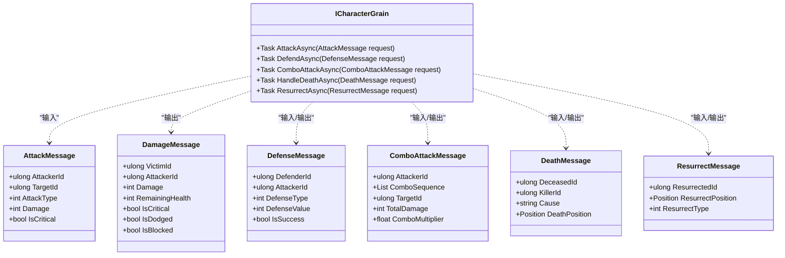
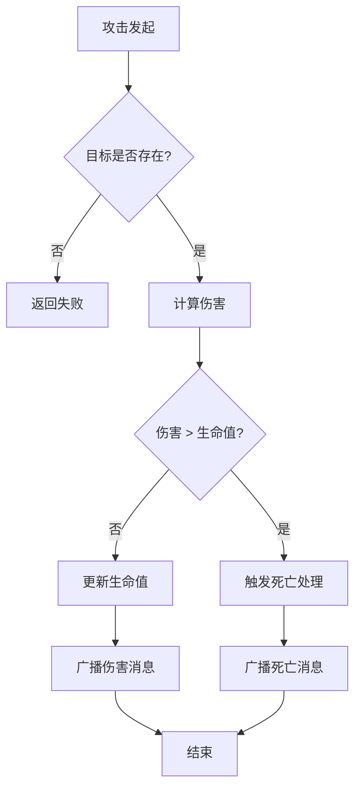

# 基础战斗

<cite>
**本文档中引用的文件**  
- [ICharacterGrain.cs](file://Horizon.Orleans.Interface/ICharacterGrain.cs)
- [CharacterGrain.cs](file://Horizon.Orleans.Grains/CharacterGrain.cs)
- [GameplayMessages.cs](file://Horizon.Game.Message/Network/GameplayMessages.cs)
</cite>

## 目录
1. [简介](#简介)
2. [核心消息结构定义](#核心消息结构定义)
3. [接口契约设计](#接口契约设计)
4. [实现逻辑分析](#实现逻辑分析)
5. [战斗流程与状态变更](#战斗流程与状态变更)
6. [调用示例](#调用示例)
7. [错误处理策略](#错误处理策略)
8. [性能优化建议](#性能优化建议)

## 简介
本文档深入阐述了游戏系统中的基础战斗功能，涵盖攻击、防御、连击、死亡处理和复活等核心机制。详细说明了相关消息结构的字段含义，解析了 `ICharacterGrain` 接口的契约设计及 `CharacterGrain` 类的具体实现逻辑。同时描述了伤害计算、角色状态变更和事件广播的处理流程，并提供实际代码级别的调用示例，分析战斗过程中角色属性的变化方式。

## 核心消息结构定义
基础战斗功能依赖于一系列精心定义的消息类，用于在客户端与服务端之间传递战斗相关的数据。

### DamageMessage（伤害消息）
该消息用于表示一次攻击造成的伤害结果。
- **VictimId**: 受伤者ID
- **AttackerId**: 攻击者ID
- **Damage**: 伤害值
- **RemainingHealth**: 受伤者剩余血量
- **IsCritical**: 是否为暴击
- **IsDodged**: 是否被闪避
- **IsBlocked**: 是否被格挡
- **Type**: 消息类型，固定为 `MessageType.Damage`
- **ServiceType**: 服务类型，固定为 `ServiceType.Combat`

**Section sources**
- [GameplayMessages.cs](file://Horizon.Game.Message/Network/GameplayMessages.cs#L105-L160)

### DefenseMessage（防御消息）
该消息用于表示一次防御行为的结果。
- **DefenderId**: 防御者ID
- **AttackerId**: 攻击者ID
- **DefenseType**: 防御类型（0=格挡，1=闪避）
- **DefenseValue**: 防御效果值
- **IsSuccess**: 防御是否成功
- **Type**: 消息类型，固定为 `MessageType.Defense`
- **ServiceType**: 服务类型，固定为 `ServiceType.Combat`

**Section sources**
- [GameplayMessages.cs](file://Horizon.Game.Message/Network/GameplayMessages.cs#L386-L427)

### ComboAttackMessage（连击消息）
该消息用于表示一次连击攻击的完整信息。
- **AttackerId**: 攻击者ID
- **ComboSequence**: 连击序列，记录攻击动作的顺序
- **TargetId**: 目标ID
- **TotalDamage**: 此次连击造成的总伤害
- **ComboMultiplier**: 连击倍数，影响最终伤害
- **Type**: 消息类型，固定为 `MessageType.ComboAttack`
- **ServiceType**: 服务类型，固定为 `ServiceType.Combat`

**Section sources**
- [GameplayMessages.cs](file://Horizon.Game.Message/Network/GameplayMessages.cs#L336-L377)

### DeathMessage（死亡消息）
该消息用于通知一个角色的死亡事件。
- **DeceasedId**: 死亡者ID
- **KillerId**: 杀手ID
- **Cause**: 死亡原因描述
- **DeathPosition**: 死亡时的位置坐标
- **Type**: 消息类型，固定为 `MessageType.Death`
- **ServiceType**: 服务类型，固定为 `ServiceType.Combat`

**Section sources**
- [GameplayMessages.cs](file://Horizon.Game.Message/Network/GameplayMessages.cs#L165-L199)

### ResurrectMessage（复活消息）
该消息用于表示一个角色的复活事件。
- **ResurrectedId**: 复活者ID
- **ResurrectPosition**: 复活后的位置坐标
- **ResurrectType**: 复活类型（如原地复活、安全区复活等）
- **Type**: 消息类型，固定为 `MessageType.Resurrect`
- **ServiceType**: 服务类型，固定为 `ServiceType.Combat`

**Section sources**
- [GameplayMessages.cs](file://Horizon.Game.Message/Network/GameplayMessages.cs#L204-L231)

## 接口契约设计
所有战斗相关的操作都通过 `ICharacterGrain` 接口进行定义，确保了服务的可扩展性和一致性。

**Diagram sources**
- [ICharacterGrain.cs](file://Horizon.Orleans.Interface/ICharacterGrain.cs#L95-L144)
- [GameplayMessages.cs](file://Horizon.Game.Message/Network/GameplayMessages.cs#L13-L231)

## 实现逻辑分析
`CharacterGrain` 类实现了 `ICharacterGrain` 接口，是处理所有战斗逻辑的核心单元。

### AttackAsync（攻击异步）
此方法处理攻击请求。它接收 `AttackMessage`，记录日志，并构造一个 `DamageMessage` 作为响应。目前的实现使用了占位符逻辑，例如将剩余血量硬编码为100。未来应在此处集成真实的伤害计算公式，考虑攻击力、防御力、暴击率等因素。

**Section sources**
- [CharacterGrain.cs](file://Horizon.Orleans.Grains/CharacterGrain.cs#L259-L274)

### DefendAsync（防御异步）
此方法处理防御请求。它接收 `DefenseMessage` 并直接将其返回。这表明当前的防御逻辑可能在其他地方（如攻击方）计算完成，或者需要进一步开发以包含具体的格挡或闪避判定逻辑。

**Section sources**
- [CharacterGrain.cs](file://Horizon.Orleans.Grains/CharacterGrain.cs#L304-L309)

### ComboAttackAsync（连击攻击异步）
此方法处理连击攻击请求。它接收 `ComboAttackMessage` 并直接返回。完整的实现应遍历 `ComboSequence`，对每个攻击动作执行伤害计算，并累加 `TotalDamage`。

**Section sources**
- [CharacterGrain.cs](file://Horizon.Orleans.Grains/CharacterGrain.cs#L297-L302)

### HandleDeathAsync（处理死亡异步）
此方法处理角色死亡事件。它接收 `DeathMessage` 并直接返回。完整的实现应在此处触发死亡后的逻辑，如掉落物品、更新任务进度、通知队友等。

**Section sources**
- [CharacterGrain.cs](file://Horizon.Orleans.Grains/CharacterGrain.cs#L311-L316)

### ResurrectAsync（复活异步）
此方法处理角色复活事件。它接收 `ResurrectMessage` 并直接返回。完整的实现应在此处重置角色的生命值、清除负面状态，并将角色移动到指定的复活点。

**Section sources**
- [CharacterGrain.cs](file://Horizon.Orleans.Grains/CharacterGrain.cs#L318-L323)

## 战斗流程与状态变更
战斗过程遵循一个清晰的流程：攻击发起 -> 伤害计算 -> 状态变更 -> 事件广播。

### 角色状态管理
角色的状态由 `CharacterState` 类持久化存储，其中包含了 `CharacterInfo` 对象。`CharacterInfo` 包含了角色的等级、职业、位置等关键属性。当发生战斗时，这些属性会根据战斗结果进行更新。

**Diagram sources**
- [CharacterGrain.cs](file://Horizon.Orleans.Grains/CharacterGrain.cs#L26-L35)
- [CharacterGrain.cs](file://Horizon.Orleans.Grains/CharacterGrain.cs#L259-L323)

## 调用示例
以下是一个典型的攻击调用流程：

1.  客户端创建一个 `AttackMessage` 对象，填充 `AttackerId`, `TargetId`, `Damage` 等字段。
2.  客户端通过 Orleans 的 Grain 引用获取目标 `ICharacterGrain` 的代理。
3.  客户端调用 `grain.AttackAsync(attackMessage)` 方法。
4.  服务端的 `CharacterGrain` 实例接收到请求，执行 `AttackAsync` 方法。
5.  服务端计算伤害并生成 `DamageMessage` 响应。
6.  响应被发送回客户端，客户端据此更新UI，播放受击动画等。

**Section sources**
- [ICharacterGrain.cs](file://Horizon.Orleans.Interface/ICharacterGrain.cs#L95)
- [CharacterGrain.cs](file://Horizon.Orleans.Grains/CharacterGrain.cs#L259-L274)

## 错误处理策略
当前的实现主要依赖于日志记录来追踪战斗过程。对于错误处理，建议采用以下策略：
-   在方法内部捕获异常，并返回带有明确错误码和消息的响应对象。
-   利用 Orleans 的内置容错机制，如重试过滤器 (`RetryFilter`) 和超时配置，来处理瞬时故障。
-   对于无效的请求参数（如攻击不存在的目标），应在方法入口处进行验证并立即返回错误。

## 性能优化建议
-   **避免频繁写入状态**: 当前的 `MoveAsync` 方法注释已指出，不应为每次移动都调用 `WriteStateAsync`。同理，频繁的攻击和防御操作也应避免每次都持久化整个角色状态。可以采用批量更新或仅在关键节点（如进入新区域、下线时）保存。
-   **利用 Orleans 特性**: 充分利用 Orleans 的激活/失活机制 (`DeactivateOnIdle`) 来节省服务器资源。确保长时间不活跃的角色 Grain 能够自动释放。
-   **异步非阻塞**: 所有方法均已正确声明为 `async`，确保了非阻塞的 I/O 操作，这是高性能分布式系统的基础。