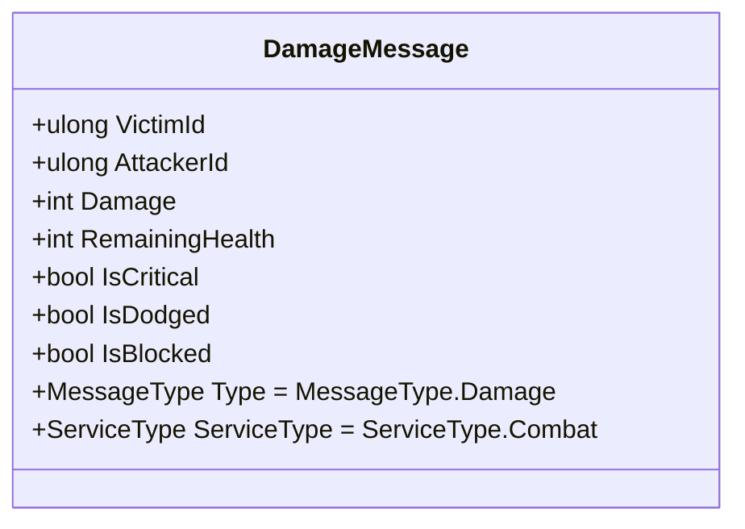
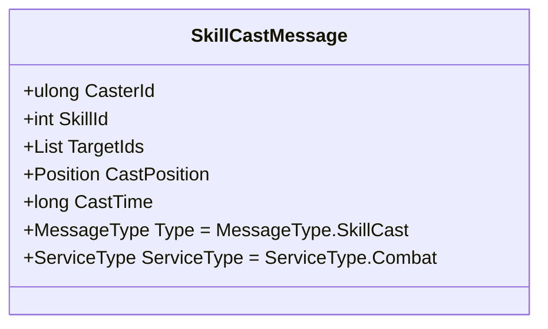
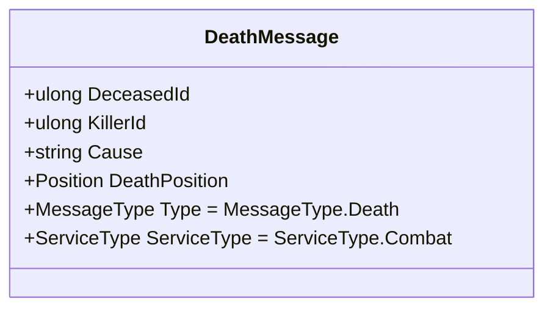
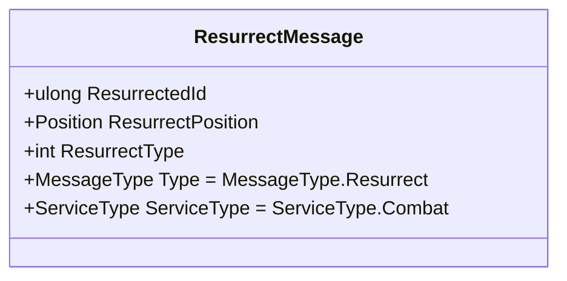
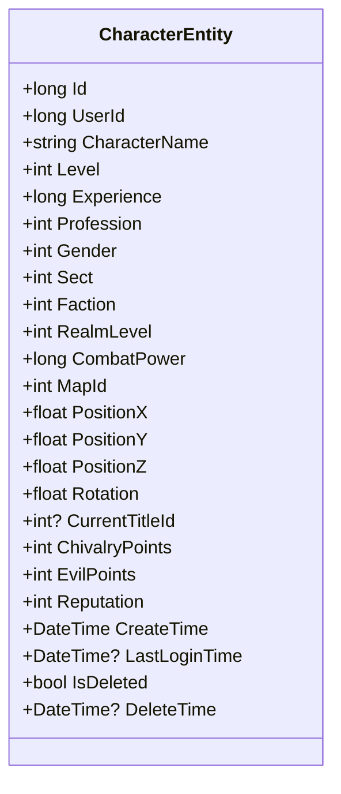
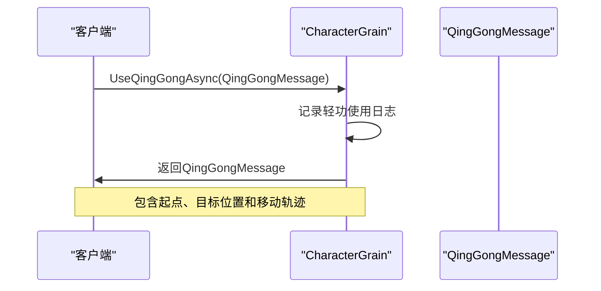
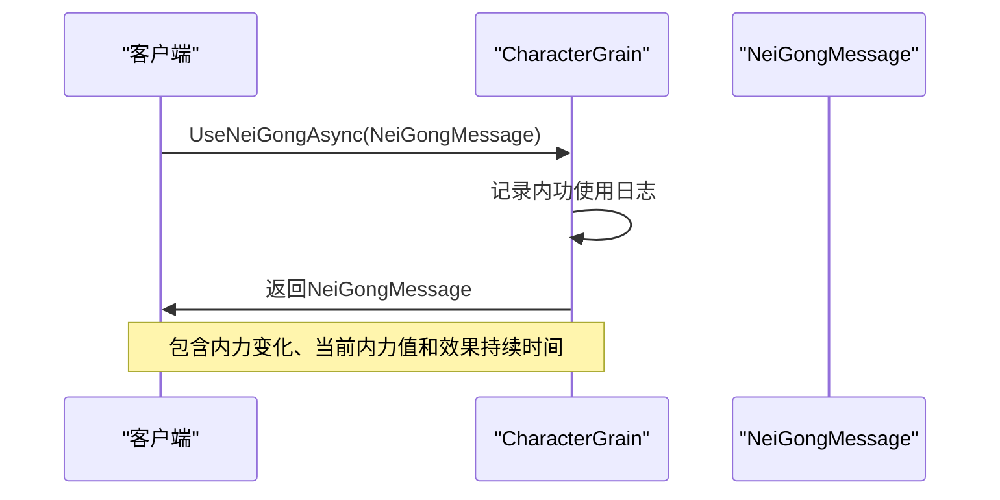
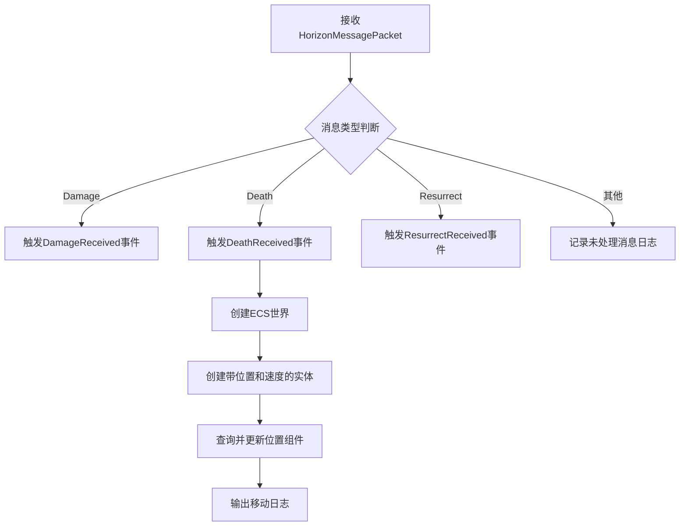

# 战斗系统

<cite>
**Referenced Files in This Document **   
- [CharacterGrain.cs](file://Horizon.Orleans.Grains/CharacterGrain.cs)
- [CharacterEntity.cs](file://Horizon.Model/GameModel/CharacterEntity.cs)
- [GameplayMessages.cs](file://Horizon.Game.Message/Network/GameplayMessages.cs)
- [CombatMessageHandler.cs](file://HundunWorld/Source/Game/Network/MessageHandlers/CombatMessageHandler.cs)
</cite>

## 目录
1. [简介](#简介)
2. [核心战斗功能](#核心战斗功能)
3. [战斗消息结构](#战斗消息结构)
4. [战斗属性存储](#战斗属性存储)
5. [特殊能力调用流程](#特殊能力调用流程)
6. [战斗事件广播](#战斗事件广播)
7. [性能优化建议](#性能优化建议)

## 简介
本文档深入阐述了游戏战斗系统的实现机制，涵盖攻击、技能释放、连击、防御、死亡处理和复活等核心功能。详细说明了各战斗动作的消息结构、处理逻辑及状态变更，并解释了轻功和内功等特殊能力的调用流程。同时描述了战斗相关属性在角色实体中的存储方式，以及战斗事件的广播机制和性能优化建议。

## 核心战斗功能

### 攻击(AttackAsync)
`AttackAsync`方法处理角色间的攻击行为。该方法接收`AttackMessage`作为输入参数，记录攻击日志，并构造包含伤害结果的`DamageMessage`响应。攻击逻辑包括计算伤害值、判断是否暴击等，并将结果返回给调用方。

**Section sources**
- [CharacterGrain.cs](file://Horizon.Orleans.Grains/CharacterGrain.cs#L259-L274)

### 技能释放(CastSkillAsync)
`CastSkillAsync`方法负责处理技能施放请求。它接收`SkillCastMessage`参数，记录施法日志，并直接返回原始请求消息。此方法为技能系统的核心入口，后续可在此基础上扩展复杂的技能效果计算逻辑。

**Section sources**
- [CharacterGrain.cs](file://Horizon.Orleans.Grains/CharacterGrain.cs#L276-L281)

### 连击(ComboAttackAsync)
`ComboAttackAsync`方法处理连续攻击动作。它接收`ComboAttackMessage`参数，记录连击日志，并返回原始请求。连击系统允许玩家执行一系列预设的攻击组合，提升战斗流畅度和策略性。

**Section sources**
- [CharacterGrain.cs](file://Horizon.Orleans.Grains/CharacterGrain.cs#L297-L302)

### 防御(DefendAsync)
`DefendAsync`方法处理角色的防御行为。它接收`DefenseMessage`参数，记录防御日志，并返回原始请求。防御机制包括格挡和闪避两种形式，可在受到攻击时减少或规避伤害。

**Section sources**
- [CharacterGrain.cs](file://Horizon.Orleans.Grains/CharacterGrain.cs#L304-L309)

### 死亡处理(HandleDeathAsync)
`HandleDeathAsync`方法处理角色死亡事件。它接收`DeathMessage`参数，记录死亡日志，并返回原始请求。死亡处理包含角色状态变更、掉落物品计算、复活点设置等复杂逻辑。

**Section sources**
- [CharacterGrain.cs](file://Horizon.Orleans.Grains/CharacterGrain.cs#L311-L316)

### 复活(ResurrectAsync)
`ResurrectAsync`方法处理角色复活逻辑。它接收`ResurrectMessage`参数，记录复活日志，并返回原始请求。复活系统支持多种复活方式，如原地复活、安全区复活或使用复活道具。

**Section sources**
- [CharacterGrain.cs](file://Horizon.Orleans.Grains/CharacterGrain.cs#L318-L323)

## 战斗消息结构

### 伤害消息(DamageMessage)

**Diagram sources **
- [GameplayMessages.cs](file://Horizon.Game.Message/Network/GameplayMessages.cs#L102-L160)

### 技能施放消息(SkillCastMessage)

**Diagram sources **
- [GameplayMessages.cs](file://Horizon.Game.Message/Network/GameplayMessages.cs#L52-L100)

### 死亡消息(DeathMessage)

**Diagram sources **
- [GameplayMessages.cs](file://Horizon.Game.Message/Network/GameplayMessages.cs#L162-L189)

### 复活消息(ResurrectMessage)

**Diagram sources **
- [GameplayMessages.cs](file://Horizon.Game.Message/Network/GameplayMessages.cs#L191-L215)

## 战斗属性存储

### 角色实体(CharacterEntity)

**Diagram sources **
- [CharacterEntity.cs](file://Horizon.Model/GameModel/CharacterEntity.cs#L11-L185)

## 特殊能力调用流程

### 轻功(QingGong)调用流程

**Diagram sources **
- [CharacterGrain.cs](file://Horizon.Orleans.Grains/CharacterGrain.cs#L283-L288)

### 内功(NeiGong)调用流程

**Diagram sources **
- [CharacterGrain.cs](file://Horizon.Orleans.Grains/CharacterGrain.cs#L290-L295)

## 战斗事件广播

### 战斗消息处理器(CombatMessageHandler)

**Diagram sources **
- [CombatMessageHandler.cs](file://HundunWorld/Source/Game/Network/MessageHandlers/CombatMessageHandler.cs#L15-L75)

## 性能优化建议

### ECS集成优化
在`DeathReceived`事件处理中，代码展示了如何通过ECS（实体-组件-系统）架构进行性能优化：
1. 使用`World.Create()`创建独立的世界实例
2. 通过`world.Create()`快速创建带有位置和速度组件的实体
3. 利用`QueryDescription`高效查询特定组件组合
4. 在查询回调中直接操作组件数据，避免对象分配开销

这种设计模式能够显著提升大规模实体更新的性能表现。

**Section sources**
- [CombatMessageHandler.cs](file://HundunWorld/Source/Game/Network/MessageHandlers/CombatMessageHandler.cs#L45-L58)