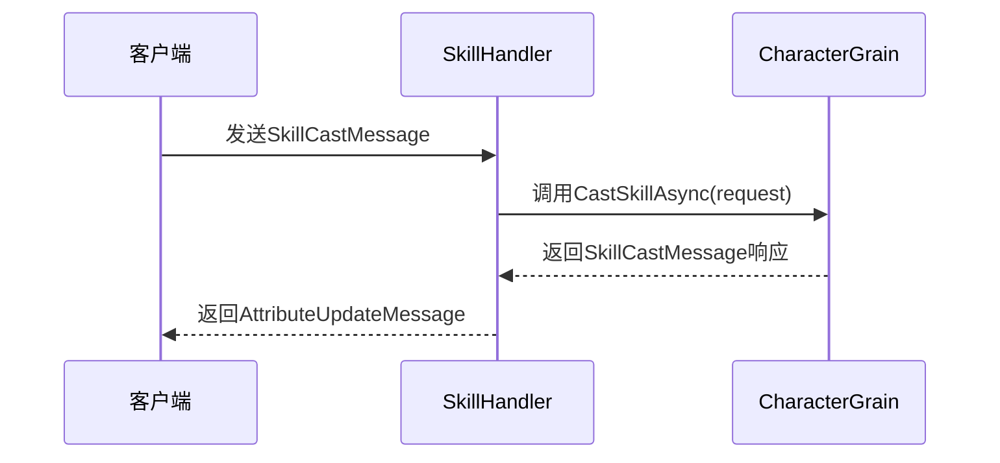
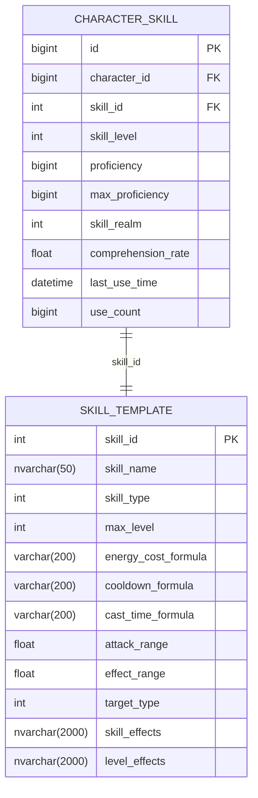

# 技能系统

<cite>
**本文档引用的文件**
- [CharacterGrain.cs](file://Horizon.Orleans.Grains/CharacterGrain.cs)
- [ICharacterGrain.cs](file://Horizon.Orleans.Interface/ICharacterGrain.cs)
- [SkillHandler.cs](file://Horizon.Game.Core/Handlers/SkillHandler.cs)
- [GameplayMessages.cs](file://Horizon.Game.Message/Network/GameplayMessages.cs)
- [CharacterSkillEntity.cs](file://Horizon.Model/GameModel/CharacterSkillEntity.cs)
- [SkillTemplateEntity.cs](file://Horizon.Model/GameModel/SkillTemplateEntity.cs)
</cite>

## 目录
1. [技能施放流程](#技能施放流程)
2. [技能施放消息结构](#技能施放消息结构)
3. [技能数据模型](#技能数据模型)
4. [技能功能实现机制](#技能功能实现机制)
5. [技能释放逻辑处理](#技能释放逻辑处理)
6. [Orleans异步处理机制](#orleans异步处理机制)
7. [异常处理与最佳实践](#异常处理与最佳实践)

## 技能施放流程

技能施放请求从客户端发起，通过网络层传递至游戏服务器。`SkillHandler`作为消息处理器，接收并路由`SkillCastMessage`类型的消息。该请求随后被转发至对应的`CharacterGrain`实例进行处理。`CharacterGrain`中的`CastSkillAsync`方法负责执行具体的技能施放逻辑，包括权限校验、资源消耗计算和效果判定等。

**图示来源**
- [SkillHandler.cs](file://Horizon.Game.Core/Handlers/SkillHandler.cs#L165-L185)
- [CharacterGrain.cs](file://Horizon.Orleans.Grains/CharacterGrain.cs#L276-L281)

**本节来源**
- [SkillHandler.cs](file://Horizon.Game.Core/Handlers/SkillHandler.cs#L165-L185)
- [CharacterGrain.cs](file://Horizon.Orleans.Grains/CharacterGrain.cs#L276-L281)

## 技能施放消息结构

`SkillCastMessage`类定义了技能施放请求的核心数据结构，包含以下关键字段：

| 字段 | 类型 | 说明 |
|------|------|------|
| CasterId | ulong | 施法者ID，标识发起技能的角色 |
| SkillId | int | 技能ID，指定要施放的具体技能 |
| TargetIds | List<ulong> | 目标ID列表，包含技能作用的目标实体 |
| CastPosition | Position | 施法位置，用于地面目标或范围技能的定位 |
| CastTime | long | 施法时间，记录请求发起的时间戳（Ticks） |

这些字段共同构成了完整的技能施放上下文，确保服务端能够准确解析和处理技能请求。

**本节来源**
- [GameplayMessages.cs](file://Horizon.Game.Message/Network/GameplayMessages.cs#L59-L100)

## 技能数据模型

### 角色技能实体 (CharacterSkillEntity)

`CharacterSkillEntity`存储角色已学习技能的实例化数据，其核心属性包括：
- **SkillLevel**: 技能等级，反映当前技能的强化程度
- **Proficiency**: 当前熟练度，用于升级判定
- **MaxProficiency**: 升级所需熟练度，随等级提升而增加
- **SkillRealm**: 技能境界，影响技能基础属性
- **ComprehensionRate**: 领悟度，决定技能实际效果强度
- **LastUseTime**: 最后使用时间，用于冷却和活跃度计算
- **UseCount**: 使用次数，关联成就和熟练度增长

### 技能模板实体 (SkillTemplateEntity)

`SkillTemplateEntity`定义了技能的基础配置和规则，主要字段有：
- **EnergyCostFormula**: 内力消耗公式，动态计算每次施法的资源消耗
- **CooldownFormula**: 冷却时间公式，基于角色属性动态调整
- **CastTimeFormula**: 施法时间公式，影响技能前摇
- **AttackRange**: 攻击范围，决定技能有效距离
- **EffectRange**: 效果范围，用于AOE技能判定
- **TargetType**: 目标类型，约束技能可选择的目标
- **SkillEffects**: 技能效果，JSON格式存储具体增益/减益效果
- **LevelEffects**: 升级效果，描述每级提升的具体数值

这两个实体通过`SkillId`建立关联，实现了技能配置与角色数据的分离。

**图示来源**
- [CharacterSkillEntity.cs](file://Horizon.Model/GameModel/CharacterSkillEntity.cs#L11-L149)
- [SkillTemplateEntity.cs](file://Horizon.Model/GameModel/SkillTemplateEntity.cs#L11-L241)

**本节来源**
- [CharacterSkillEntity.cs](file://Horizon.Model/GameModel/CharacterSkillEntity.cs#L11-L149)
- [SkillTemplateEntity.cs](file://Horizon.Model/GameModel/SkillTemplateEntity.cs#L11-L241)

## 技能功能实现机制

技能系统的各项功能通过数据模型与业务逻辑的结合实现：

- **技能学习**: 基于`SkillTemplateEntity`中的`LearnLevelRequire`、`LearnRealmRequire`等字段进行条件校验，成功后在`CharacterSkillEntity`中创建新记录。
- **技能升级**: 比较`Proficiency`与`MaxProficiency`，满足条件时提升`SkillLevel`并重置熟练度。
- **冷却管理**: 利用`LastUseTime`和`CooldownFormula`计算剩余冷却时间，防止技能滥用。
- **熟练度查询**: 通过`UseCount`和特定算法递增`Proficiency`，反映角色对技能的掌握程度。

这些功能均依赖于持久化存储的数据实体，确保状态在服务器重启后依然保持一致。

**本节来源**
- [CharacterSkillEntity.cs](file://Horizon.Model/GameModel/CharacterSkillEntity.cs#L11-L149)
- [SkillTemplateEntity.cs](file://Horizon.Model/GameModel/SkillTemplateEntity.cs#L11-L241)

## 技能释放逻辑处理

技能释放过程包含多个关键步骤：
1. **权限校验**: 验证施法者是否拥有该技能及达到使用条件
2. **资源消耗**: 根据`EnergyCostFormula`计算并扣除内力值
3. **冷却检查**: 确认技能不在冷却中，更新`LastUseTime`
4. **效果判定**: 解析`SkillEffects`和`LevelEffects`，应用相应增益/减益
5. **状态更新**: 增加`UseCount`，可能提升`Proficiency`

目前代码中`HandleSkillCastAsync`方法返回`AttributeUpdateMessage`，表明技能效果主要体现为角色属性的变更，符合MMORPG常见的设计模式。

**本节来源**
- [SkillHandler.cs](file://Horizon.Game.Core/Handlers/SkillHandler.cs#L165-L185)
- [CharacterSkillEntity.cs](file://Horizon.Model/GameModel/CharacterSkillEntity.cs#L11-L149)
- [SkillTemplateEntity.cs](file://Horizon.Model/GameModel/SkillTemplateEntity.cs#L11-L241)

## Orleans异步处理机制

技能系统采用Orleans框架实现高并发处理：
- 每个角色对应一个`CharacterGrain`实例，由Orleans自动激活和管理生命周期
- `CastSkillAsync`方法声明为`Task`返回类型，支持非阻塞调用
- Grain间通信通过`IClusterClient`完成，保证分布式环境下的状态一致性
- 消息处理链路从`SkillHandler`到`CharacterGrain`全程异步，最大化吞吐量

这种架构设计使得系统能够高效处理大量并发技能请求，同时保持良好的可扩展性和容错性。

**本节来源**
- [CharacterGrain.cs](file://Horizon.Orleans.Grains/CharacterGrain.cs#L276-L281)
- [ICharacterGrain.cs](file://Horizon.Orleans.Interface/ICharacterGrain.cs#L102-L102)

## 异常处理与最佳实践

### 异常处理
`SkillHandler.HandleSkillCastAsync`方法包含完整的异常捕获机制，当处理失败时返回带有错误码500的`ErrorMessage`，确保客户端能收到明确的失败反馈。

### 配置扩展建议
1. 将复杂的公式计算移至专用服务，便于维护和热更新
2. 使用缓存减少对数据库的频繁访问
3. 实现技能配置的热加载，无需重启服务器即可更新技能平衡性

### 性能优化
1. 对高频访问的技能数据实施内存缓存
2. 批量处理技能相关的属性更新
3. 限制技能效果计算的复杂度，避免影响主线程性能

**本节来源**
- [SkillHandler.cs](file://Horizon.Game.Core/Handlers/SkillHandler.cs#L165-L185)