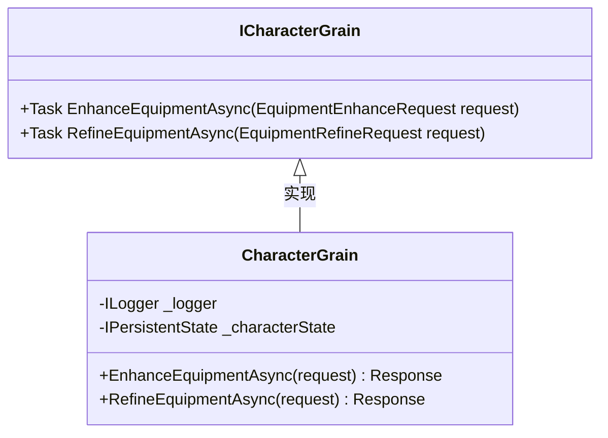
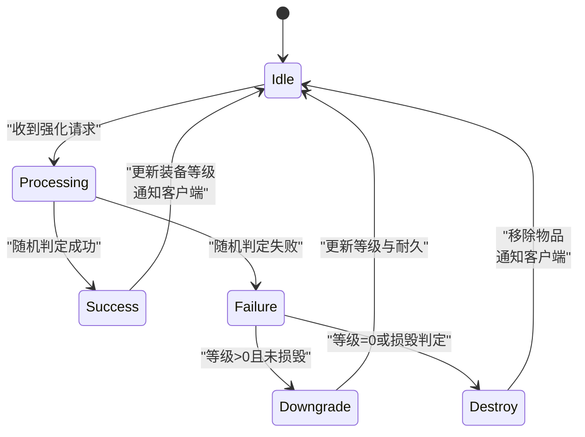

# 装备强化

<cite>
**本文档引用文件**   
- [ICharacterGrain.cs](file://Horizon.Orleans.Interface/ICharacterGrain.cs)
- [ItemMessages.cs](file://Horizon.Game.Message/Network/ItemMessages.cs)
- [ItemEntity.cs](file://Horizon.Model/GameModel/ItemEntity.cs)
- [ItemTemplateEntity.cs](file://Horizon.Model/GameModel/ItemTemplateEntity.cs)
- [CharacterGrain.cs](file://Horizon.Orleans.Grains/CharacterGrain.cs)
</cite>

## 目录
1. [引言](#引言)
2. [核心接口与方法](#核心接口与方法)
3. [请求与响应结构](#请求与响应结构)
4. [数据模型分析](#数据模型分析)
5. [业务规则与机制](#业务规则与机制)
6. [状态机与事务处理](#状态机与事务处理)
7. [前端交互与防作弊](#前端交互与防作弊)

## 引言
本文档详细说明游戏系统中装备强化与精炼功能的技术实现。基于 `ICharacterGrain` 接口中的 `EnhanceEquipmentAsync` 和 `RefineEquipmentAsync` 方法，结合相关消息定义、数据实体和业务逻辑，全面阐述该功能的参数结构、存储机制、成功率计算、材料消耗及失败惩罚等核心内容。

## 核心接口与方法
装备强化与精炼功能由角色Grain（`ICharacterGrain`）提供异步服务接口，确保在分布式环境下对角色状态的安全操作。



**图示来源**
- [ICharacterGrain.cs](file://Horizon.Orleans.Interface/ICharacterGrain.cs#L214-L221)
- [CharacterGrain.cs](file://Horizon.Orleans.Grains/CharacterGrain.cs#L413-L473)

**本节来源**
- [ICharacterGrain.cs](file://Horizon.Orleans.Interface/ICharacterGrain.cs#L214-L221)
- [CharacterGrain.cs](file://Horizon.Orleans.Grains/CharacterGrain.cs#L413-L473)

## 请求与响应结构
装备强化与精炼通过网络消息进行通信，其请求和响应结构定义在 `ItemMessages.cs` 中。

### 装备强化请求 (EquipmentEnhanceRequest)
| 字段 | 类型 | 说明 |
|------|------|------|
| CharacterId | ulong | 发起请求的角色ID |
| EquipmentId | long | 待强化的装备唯一ID |
| MaterialIds | List<long> | 用于强化的材料物品ID列表 |

### 装备精炼请求 (EquipmentRefineRequest)
| 字段 | 类型 | 说明 |
|------|------|------|
| CharacterId | ulong | 发起请求的角色ID |
| EquipmentId | long | 待精炼的装备唯一ID |
| MaterialIds | List<long> | 精炼所需辅助材料ID列表 |
| RefineStoneId | long | 使用的精炼石ID |

### 响应结构共性
两种操作的响应均包含以下字段：
- **Success**: 操作是否成功
- **Message**: 结果描述信息
- **ConsumedMaterials**: 消耗的材料ID列表
- **ConsumedGold**: 消耗的金币数量
此外，各自返回新的等级（NewEnhanceLevel / NewRefineLevel）。

**本节来源**
- [ItemMessages.cs](file://Horizon.Game.Message/Network/ItemMessages.cs#L449-L561)

## 数据模型分析
装备属性的持久化存储依赖于 `ItemEntity` 和 `ItemTemplateEntity` 两个核心实体。

### ItemEntity (物品实体)
该实体记录了每一件具体物品的实例化数据。
- **Id**: 物品唯一ID (`item_uid`)
- **ItemId**: 物品模板ID (`item_id`)
- **OwnerId**: 拥有者（角色）ID
- **ItemType**: 物品类型（0-武器, 1-防具, 2-饰品...）
- **Quality**: 物品品质（0-普通至5-神器）
- **EnhanceLevel**: 当前强化等级
- **IsEquipped**: 是否已装备
- **Durability**: 当前耐久度

### ItemTemplateEntity (物品模板实体)
该实体定义了物品的基础属性和生成规则。
- **BaseQuality**: 基础品质，决定初始属性范围
- **BaseAttributes**: 基础属性（JSON格式）
- **RandomAttributes**: 随机属性池定义
- **GemSlotRates**: 宝石槽生成概率
- **InheritRate**: 属性继承率范围
- **MaterialGrade**: 材料品阶，影响合成产出

```mermaid
erDiagram
ITEM_ENTITY {
long item_uid PK
int item_id FK
bigint owner_id
int item_type
int quality
int enhance_level
bool is_equipped
int durability
}
ITEM_TEMPLATE_ENTITY {
int item_id PK
nvarchar(50) item_name
int base_quality
nvarchar(1000) base_attributes JSON
nvarchar(2000) random_attributes JSON
varchar(100) gem_slot_rates JSON
varchar(50) inherit_rate
int material_grade
}
ITEM_TEMPLATE_ENTITY ||--o{ ITEM_ENTITY : "实例化"
```

**图示来源**
- [ItemEntity.cs](file://Horizon.Model/GameModel/ItemEntity.cs#L1-L186)
- [ItemTemplateEntity.cs](file://Horizon.Model/GameModel/ItemTemplateEntity.cs#L1-L285)

**本节来源**
- [ItemEntity.cs](file://Horizon.Model/GameModel/ItemEntity.cs#L1-L186)
- [ItemTemplateEntity.cs](file://Horizon.Model/GameModel/ItemTemplateEntity.cs#L1-L285)

## 业务规则与机制
### 强化等级上限
装备的最大强化等级受其**品质**和**类型**共同决定。高品质（如史诗、传说）或关键部位（如武器）通常拥有更高的强化上限。此规则应在 `ItemTemplateEntity` 的配置中定义，并在 `EnhanceEquipmentAsync` 方法中进行校验。

### 成功率计算
成功率并非固定值，而是动态计算的结果，主要影响因素包括：
- **当前强化等级**: 等级越高，成功率越低。
- **装备品质**: 品质越高，相同等级下成功率可能更高。
- **使用材料**: 可能存在“幸运符”类材料可临时提升成功率。
- **玩家状态**: 特定BUFF或活动期间可能提高成功率。

### 材料消耗
每次强化/精炼都会消耗指定的材料和金币。材料消耗量随等级提升而增加。`EquipmentEnhanceResponse` 和 `RefineEquipmentResponse` 中的 `ConsumedMaterials` 字段会明确告知客户端本次操作消耗了哪些具体物品。

### 失败惩罚机制
强化失败可能导致以下一种或多种后果：
- **降级**: 装备等级下降一级（例如从+7降至+6）。
- **损坏**: 耐久度大幅降低，甚至归零导致装备无法使用。
- **消失**: 极低概率下，装备可能直接损毁消失（通常为高风险强化）。
这些规则需在 `CharacterGrain` 的实现逻辑中根据配置表进行判定。

**本节来源**
- [CharacterGrain.cs](file://Horizon.Orleans.Grains/CharacterGrain.cs#L413-L473)
- [ItemEntity.cs](file://Horizon.Model/GameModel/ItemEntity.cs#L62-L64)
- [ItemTemplateEntity.cs](file://Horizon.Model/GameModel/ItemTemplateEntity.cs#L56-L58)

## 状态机与事务处理
### 状态机设计
装备强化流程可抽象为一个简单的状态机：


### 事务处理方案
由于操作涉及多个数据变更（装备等级、材料库存、金币余额），必须保证原子性。
- **Orleans Grain特性**: 利用Grain的单线程执行模型，避免并发修改。
- **持久化状态**: `CharacterGrain` 使用 `IPersistentState` 存储角色状态，所有变更在调用 `WriteStateAsync()` 后才提交到后端存储。
- **数据库事务**: 在访问 `IDataContext` 进行库存扣减时，应包裹在显式数据库事务中，确保要么全部成功，要么全部回滚。

**图示来源**
- [CharacterGrain.cs](file://Horizon.Orleans.Grains/CharacterGrain.cs#L413-L473)

**本节来源**
- [CharacterGrain.cs](file://Horizon.Orleans.Grains/CharacterGrain.cs#L413-L473)

## 前端交互与防作弊
### 前端交互提示
- **进度反馈**: 显示强化动画和成功率百分比。
- **结果展示**: 成功时播放特效并突出显示新等级；失败时明确提示“降级”或“损坏”。
- **材料预览**: 允许玩家在操作前查看本次强化所需的材料清单和预计消耗。

### 日志记录
`CharacterGrain` 内部使用 `_logger.LogInformation` 记录关键操作，如：
- `Enhancing equipment {request.EquipmentId} for character {request.CharacterId}.`
这有助于追踪问题和审计异常行为。

### 防作弊措施
- **服务端验证**: 所有逻辑在服务端执行，客户端仅发送请求和接收结果。
- **输入校验**: 严格校验请求中的 `EquipmentId` 是否属于该 `CharacterId`，以及材料是否真实存在且可消耗。
- **频率限制**: 可通过中间件或Grain内部计数器防止短时间内高频次请求。
- **数据加密**: 网络传输使用MemoryPack序列化，敏感数据可额外加密。

**本节来源**
- [CharacterGrain.cs](file://Horizon.Orleans.Grains/CharacterGrain.cs#L413-L473)
- [ItemMessages.cs](file://Horizon.Game.Message/Network/ItemMessages.cs#L449-L561)