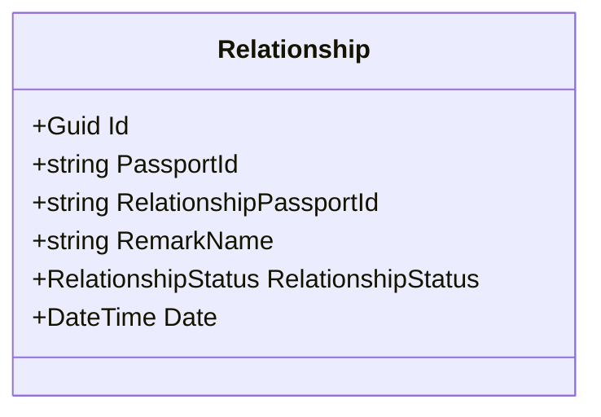
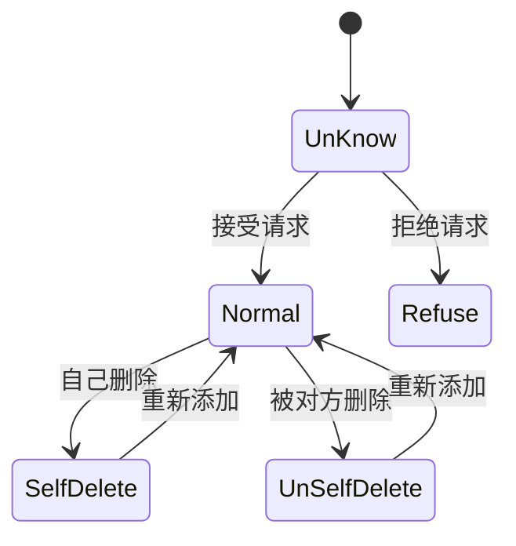
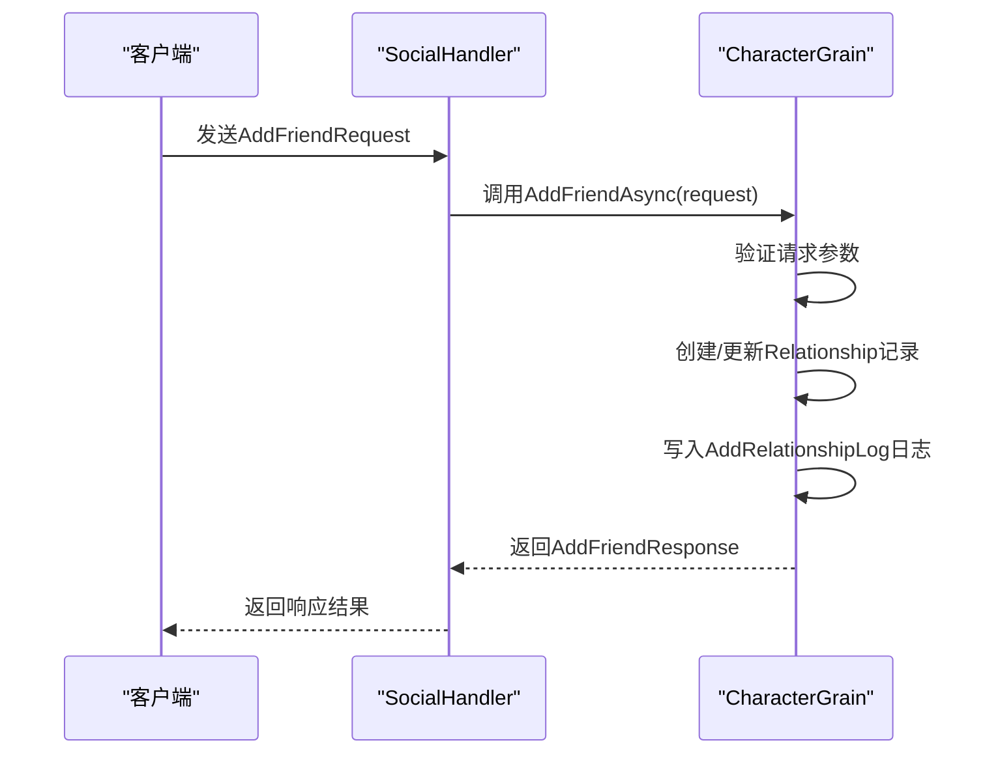
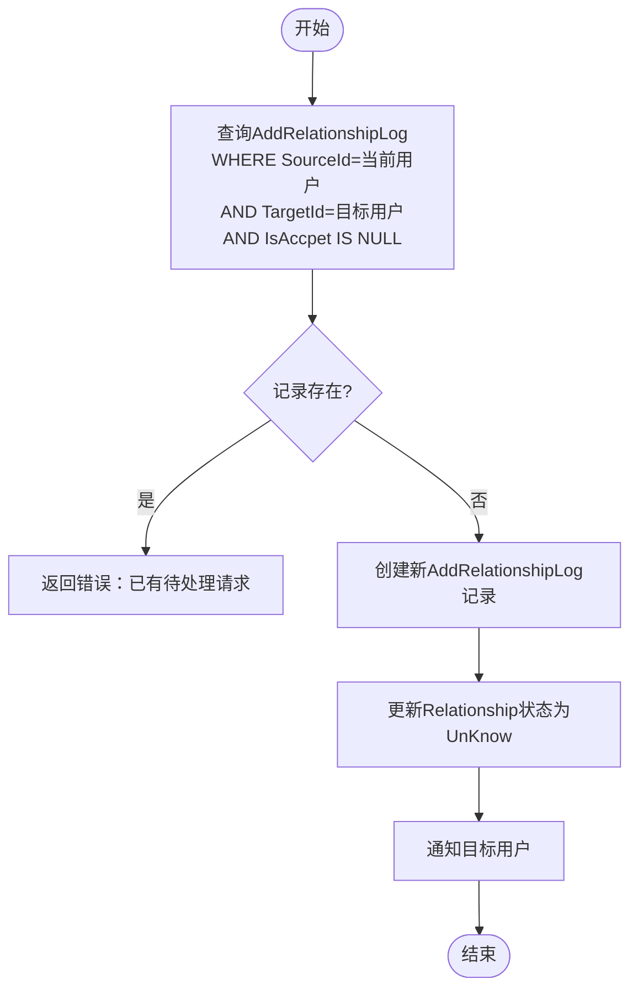
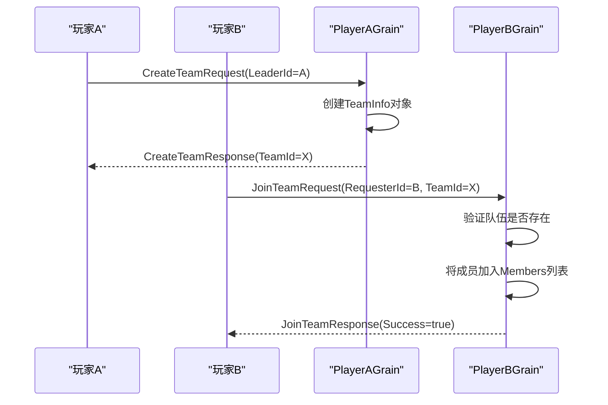
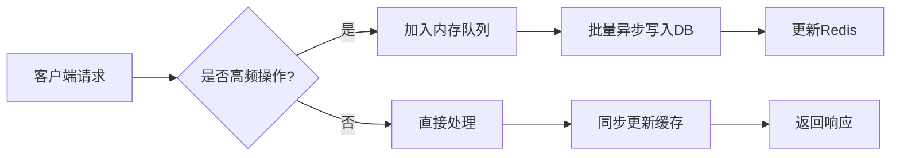

# 好友与队伍系统

<cite>
**本文档引用文件**  
- [Relationship.cs](file://Horizon.Model/IM/Relationship.cs)
- [RelationshipStatus.cs](file://Horizon.Core.Abstract/Enums/RelationshipStatus.cs)
- [AddFriendRequest.cs](file://Horizon.Game.Message/Network/InteractionMessages.cs#L263-L290)
- [AddFriendResponse.cs](file://Horizon.Game.Message/Network/InteractionMessages.cs#L295-L322)
- [CreateTeamRequest.cs](file://Horizon.Game.Message/Network/InteractionMessages.cs#L469-L496)
- [JoinTeamRequest.cs](file://Horizon.Game.Message/Network/InteractionMessages.cs#L533-L553)
- [CharacterGrain.cs](file://Horizon.Orleans.Grains/CharacterGrain.cs#L559-L596)
- [AddRelationshipLog.cs](file://Horizon.Model/IM/AddRelationshipLog.cs)
</cite>

## 目录
1. [简介](#简介)
2. [核心数据模型](#核心数据模型)
3. [好友系统实现机制](#好友系统实现机制)
4. [队伍管理系统](#队伍管理系统)
5. [分布式同步方案](#分布式同步方案)
6. [典型使用场景](#典型使用场景)
7. [性能瓶颈与优化措施](#性能瓶颈与优化措施)

## 简介
本系统实现了游戏中的社交核心功能，包括好友关系管理与队伍协作机制。基于Orleans框架的Grain模型设计，系统具备良好的可扩展性与高并发处理能力。通过定义清晰的数据结构与状态流转逻辑，确保了跨服交互的一致性与实时性。

## 核心数据模型

### 好友关系数据模型（Relationship）
`Relationship` 类用于持久化存储用户间的好友关系信息，主要字段如下：

- **PassportId**: 当前用户的唯一标识ID
- **RelationshipPassportId**: 对方用户的唯一标识ID
- **RemarkName**: 对好友设置的备注名称
- **RelationshipStatus**: 好友关系当前状态（见下文状态枚举）
- **Date**: 首次添加该好友的时间戳



**图示来源**
- [Relationship.cs](file://Horizon.Model/IM/Relationship.cs#L16-L54)

**本节来源**
- [Relationship.cs](file://Horizon.Model/IM/Relationship.cs#L16-L54)

### 关系状态枚举（RelationshipStatus）
定义了好友关系的五种状态及其流转规则：

```csharp
public enum RelationshipStatus
{
    /// <summary> 正常 </summary>
    Normal = 0,
    
    /// <summary> 未确认（已发送请求但未被处理） </summary>
    UnKnow = 1,
    
    /// <summary> 拒绝（对方拒绝了好友请求） </summary>
    Refuse = 2,
    
    /// <summary> 已删除（自己删除了对方） </summary>
    SelfDelete = 3,
    
    /// <summary> 已删除（对方删除了自己） </summary>
    UnSelfDelete = 4
}
```

状态流转说明：
- 初始状态为 `UnKnow`（当一方发起请求时）
- 若对方接受，则变为 `Normal`
- 若对方拒绝，则变为 `Refuse`
- 双方可随时将状态设为 `SelfDelete` 或 `UnSelfDelete` 来解除关系



**图示来源**
- [RelationshipStatus.cs](file://Horizon.Core.Abstract/Enums/RelationshipStatus.cs#L12-L39)

**本节来源**
- [RelationshipStatus.cs](file://Horizon.Core.Abstract/Enums/RelationshipStatus.cs#L12-L39)

## 好友系统实现机制

### 添加好友请求-响应流程
1. 客户端构造 `AddFriendRequest` 消息并发送至服务端
2. 服务端通过 `SocialHandler` 路由到目标角色的 `CharacterGrain`
3. 执行 `AddFriendAsync` 方法进行业务逻辑处理
4. 创建或更新 `Relationship` 记录，并写入临时日志表 `AddRelationshipLog`
5. 返回 `AddFriendResponse` 给客户端



**图示来源**
- [AddFriendRequest.cs](file://Horizon.Game.Message/Network/InteractionMessages.cs#L263-L290)
- [AddFriendResponse.cs](file://Horizon.Game.Message/Network/InteractionMessages.cs#L295-L322)
- [CharacterGrain.cs](file://Horizon.Orleans.Grains/CharacterGrain.cs#L559-L570)

**本节来源**
- [AddFriendRequest.cs](file://Horizon.Game.Message/Network/InteractionMessages.cs#L263-L290)
- [AddFriendResponse.cs](file://Horizon.Game.Message/Network/InteractionMessages.cs#L295-L322)
- [CharacterGrain.cs](file://Horizon.Orleans.Grains/CharacterGrain.cs#L559-L570)

### 去重策略
系统通过以下方式防止重复添加好友请求：
- 使用 `AddRelationshipLog` 表记录所有待处理的请求，主键为 `Guid`
- 在插入新请求前检查 `(SourceId, TargetId)` 组合是否已存在且状态为 `IsAccpet == null`
- 若存在未处理的请求，则拒绝新的添加操作，避免消息风暴



**图示来源**
- [AddRelationshipLog.cs](file://Horizon.Model/IM/AddRelationshipLog.cs#L15-L61)
- [Relationship.cs](file://Horizon.Model/IM/Relationship.cs#L16-L54)

**本节来源**
- [AddRelationshipLog.cs](file://Horizon.Model/IM/AddRelationshipLog.cs#L15-L61)

## 队伍管理系统

### 创建与加入队伍流程
队伍管理的核心方法包括 `CreateTeamAsync` 和 `JoinTeamAsync`，其调用流程如下：



相关数据结构：
- `CreateTeamRequest`: 包含队长ID、队伍名称、目标描述
- `JoinTeamRequest`: 包含请求者ID和目标队伍ID
- `TeamInfo`: 包含队伍ID、队长ID、成员列表、队伍名等

**本节来源**
- [CreateTeamRequest.cs](file://Horizon.Game.Message/Network/InteractionMessages.cs#L469-L496)
- [JoinTeamRequest.cs](file://Horizon.Game.Message/Network/InteractionMessages.cs#L533-L553)
- [CharacterGrain.cs](file://Horizon.Orleans.Grains/CharacterGrain.cs#L572-L596)

## 分布式同步方案

### 队伍成员状态实时更新
在分布式环境下，队伍成员的状态变更通过事件驱动机制实现最终一致性：
- 当成员上线/下线时，触发 `OnFriendAddedAsync` / `OnFriendRemovedAsync` 回调
- 回调通知所有相关队伍Grain刷新成员在线状态
- 使用Redis缓存 `TeamInfo` 提升读取性能
- 定期持久化到数据库保证数据安全

### 跨服组队处理逻辑
跨服组队依赖于全局唯一的Grain ID路由机制：
- 所有 `CharacterGrain` 使用 `Guid` 作为Key，确保跨Silo可达
- 队伍信息存储在独立的 `TeamGrain` 中，可通过 `TeamId` 全局访问
- 消息总线（MessageBus）负责跨节点广播队伍聊天、状态变更等事件

```mermaid
graph TB
subgraph "服务器节点A"
A[PlayerA Grain]
end
subgraph "服务器节点B"
B[PlayerB Grain]
end
subgraph "共享服务"
C[TeamGrain]
D[Redis Cache]
E[MessageBus]
end
A --> C : 加入/创建队伍
B --> C : 加入队伍
C --> D : 缓存TeamInfo
C --> E : 广播状态变更
E --> A : 推送更新
E --> B : 推送更新
```

**本节来源**
- [ISocialSystemGrains.cs](file://Horizon.Orleans.Interface/ISocialSystemGrains.cs#L72-L108)
- [CharacterGrain.cs](file://Horizon.Orleans.Grains/CharacterGrain.cs#L559-L596)

## 典型使用场景

### 好友上线通知
当某用户上线时，系统自动推送其好友列表中所有在线用户的上线事件：

```csharp
// 示例伪代码
public async Task OnPlayerOnline(long playerId)
{
    var friends = await GetFriends(playerId);
    foreach (var friend in friends.Where(f => f.RelationshipStatus == Normal))
    {
        var grain = _clusterClient.GetGrain<ICharacterGrain>(friend.PassportId);
        await grain.OnFriendAddedAsync(playerId); // 触发通知
    }
}
```

### 队伍聊天消息广播
队伍内聊天消息通过 `TeamGrain` 进行集中分发：

```csharp
// 示例伪代码
public async Task SendTeamChat(TeamChatMessage msg)
{
    var teamGrain = _clusterClient.GetGrain<ITeamGrain>(msg.TeamId);
    await teamGrain.BroadcastMessage(msg);
    
    // 所有成员Grain接收并转发给客户端
}
```

**本节来源**
- [ISocialSystemGrains.cs](file://Horizon.Orleans.Interface/ISocialSystemGrains.cs#L72-L108)
- [SocialHandler.cs](file://Horizon.Game.Core/Handlers/SocialHandler.cs)

## 性能瓶颈与优化措施

### 高并发场景下的潜在瓶颈
1. **热点Grain问题**：热门玩家收到大量好友请求，导致单个Grain负载过高
2. **数据库写入压力**：频繁的关系状态变更造成DB IOPS升高
3. **内存占用增长**：大规模队伍的 `TeamInfo` 加载可能导致GC压力

### 优化措施
- **请求合并**：对同一目标的多次添加请求进行去重与合并处理
- **异步持久化**：将 `Relationship` 更新操作放入队列异步写入数据库
- **二级缓存**：使用Redis缓存常用的好友关系与队伍信息，降低DB查询频率
- **分片策略**：对超大规模队伍拆分为多个子组Grain管理
- **限流保护**：对接口实施速率限制，防止恶意刷请求



**本节来源**
- [ThreadSafePerformanceMetrics.cs](file://Horizon.Game.Core/Monitoring/ThreadSafePerformanceMetrics.cs)
- [CharacterGrain.cs](file://Horizon.Orleans.Grains/CharacterGrain.cs#L559-L596)
- [AddRelationshipLog.cs](file://Horizon.Model/IM/AddRelationshipLog.cs)