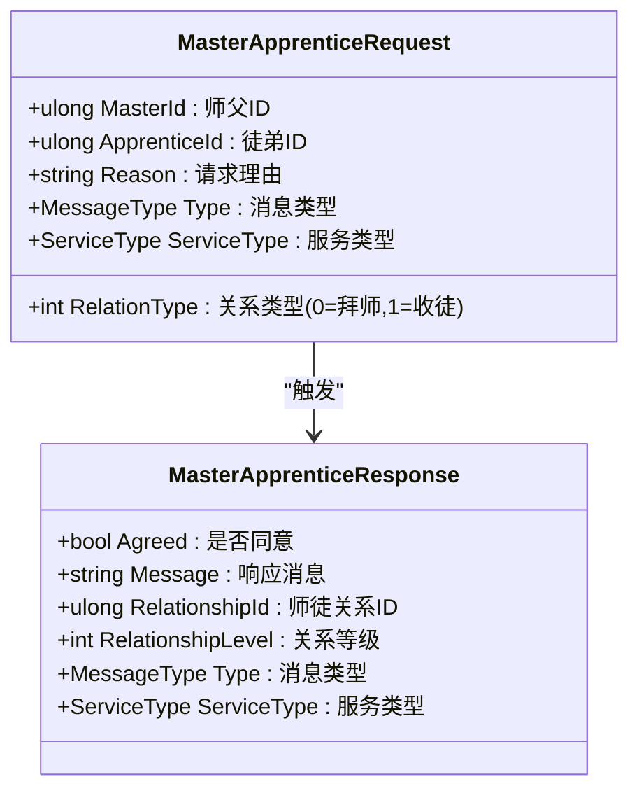
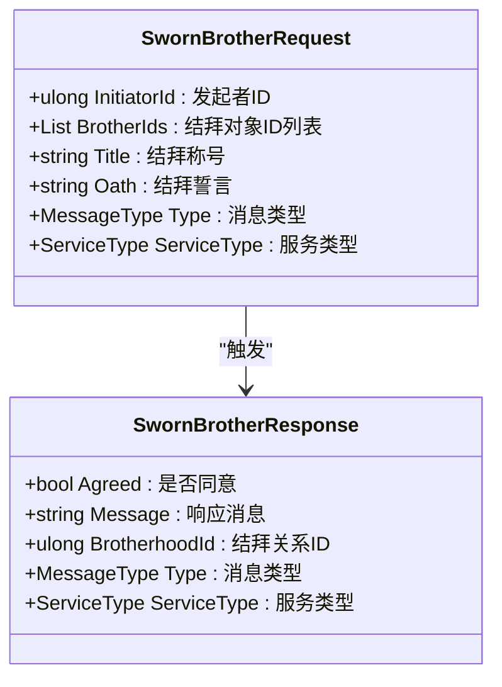
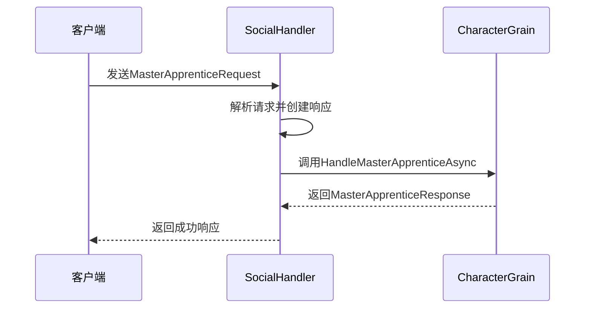
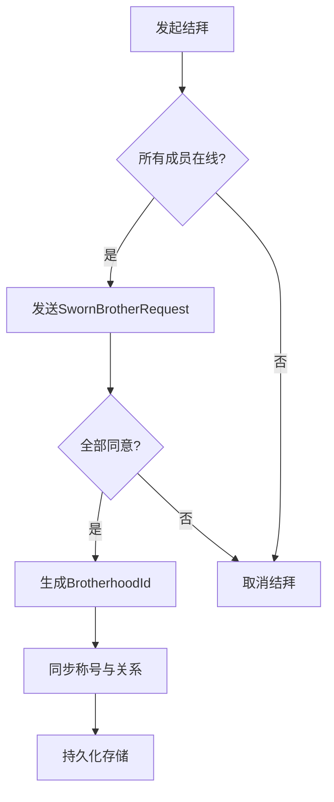

# 师徒与结拜系统

<cite>
**本文档引用文件**  
- [SocialMessages.cs](file://Horizon.Game.Message/Network/SocialMessages.cs)
- [SocialHandler.cs](file://Horizon.Game.Core/Handlers/SocialHandler.cs)
- [CharacterGrain.cs](file://Horizon.Orleans.Grains/CharacterGrain.cs)
- [ICharacterGrain.cs](file://Horizon.Orleans.Interface/ICharacterGrain.cs)
</cite>

## 目录
1. [引言](#引言)
2. [核心消息结构分析](#核心消息结构分析)
3. [师徒关系业务流程](#师徒关系业务流程)
4. [结拜系统业务流程](#结拜系统业务流程)
5. [衍生功能实现机制](#衍生功能实现机制)
6. [边界情况与事务一致性](#边界情况与事务一致性)
7. [异常恢复最佳实践](#异常恢复最佳实践)
8. [总结](#总结)

## 引言
本文档深入解析游戏系统中的师徒关系（HandleMasterApprenticeAsync）与结拜系统（HandleSwornBrotherAsync）的完整业务流程。基于 `MasterApprenticeRequest` 与 `SwornBrotherRequest` 消息结构，详细阐述双向确认机制、关系等级成长体系、多角色ID列表的原子性处理方案及称号同步策略。同时，分析任务进度追踪、专属技能解锁等衍生功能，并探讨关系断裂、继承等边界情况下的事务一致性保障措施。

## 核心消息结构分析

### 师徒关系请求与响应结构


**图示来源**
- [SocialMessages.cs](file://Horizon.Game.Message/Network/SocialMessages.cs#L492-L526)
- [SocialMessages.cs](file://Horizon.Game.Message/Network/SocialMessages.cs#L531-L565)

### 结拜请求与响应结构


**图示来源**
- [SocialMessages.cs](file://Horizon.Game.Message/Network/SocialMessages.cs#L421-L455)
- [SocialMessages.cs](file://Horizon.Game.Message/Network/SocialMessages.cs#L456-L487)

## 师徒关系业务流程

### 双向确认机制
师徒关系建立采用双向确认机制，通过 `RelationType` 字段区分“拜师”与“收徒”两种操作。系统在接收到 `MasterApprenticeRequest` 后，由服务端进行身份验证与权限校验，确保双方未处于黑名单或封禁状态，并检查是否存在已有师徒关系以避免循环或冲突。



**图示来源**
- [SocialHandler.cs](file://Horizon.Game.Core/Handlers/SocialHandler.cs#L336-L357)
- [CharacterGrain.cs](file://Horizon.Orleans.Grains/CharacterGrain.cs#L379-L391)

### 关系等级成长体系
初始师徒关系等级为1级，存储于 `MasterApprenticeResponse.RelationshipLevel` 字段中。后续可通过完成共同任务、赠送礼物等方式提升关系等级，系统将根据等级解锁不同奖励与特权，如经验加成、专属称号等。

**代码路径**
- [MasterApprenticeResponse](file://Horizon.Game.Message/Network/SocialMessages.cs#L531-L565)

## 结拜系统业务流程

### 多角色ID列表的原子性处理
`SwornBrotherRequest` 中的 `BrotherIds` 字段为 `List<ulong>` 类型，支持多人同时结拜。系统在处理时采用原子性操作，确保所有参与者均在线且同意，任一成员拒绝则整个结拜流程失败，防止部分成员关系不一致。

### 结拜称号同步策略
发起者在请求中指定 `Title` 字段作为结拜称号，该信息随 `SwornBrotherResponse` 广播至所有参与者的客户端，实现称号的实时同步与显示。称号数据持久化存储于数据库，确保跨服与重启后仍可读取。



**图示来源**
- [SwornBrotherRequest](file://Horizon.Game.Message/Network/SocialMessages.cs#L421-L455)
- [SocialHandler.cs](file://Horizon.Game.Core/Handlers/SocialHandler.cs#L314-L334)

## 衍生功能实现机制

### 师徒任务进度追踪
系统通过监听师徒双方的任务完成事件，自动更新关联任务进度。任务数据存储于角色状态中，通过 Orleans Grain 的持久化机制保证数据一致性。

### 结拜专属技能解锁
当结拜关系达到特定等级或完成特定条件后，系统通过 `SkillTemplateEntity` 动态授予专属技能。技能解锁状态记录在 `CharacterState` 中，确保角色重连后技能依然可用。

**代码路径**
- [CharacterGrain.cs](file://Horizon.Orleans.Grains/CharacterGrain.cs#L40-L657)

## 边界情况与事务一致性

### 关系断裂处理
当师父或徒弟角色被删除或永久封禁时，系统触发关系断裂逻辑，清除双方的关系数据，并通知相关模块（如任务、技能）进行状态重置。此操作通过数据库事务保证原子性。

### 继承机制
若师父角色离线或不可用，其徒弟的某些权益（如经验加成）可临时继承至指定代理角色，继承关系独立记录，原关系恢复后自动切换回原始状态。

**代码路径**
- [CharacterGrain.cs](file://Horizon.Orleans.Grains/CharacterGrain.cs#L379-L391)

## 异常恢复最佳实践

### 消息处理异常捕获
所有社交消息处理器均包含完整的异常捕获机制，如 `HandleMasterApprenticeAsync` 和 `HandleSwornBrotherAsync` 方法使用 try-catch 包裹，确保任何异常不会导致服务崩溃，并返回标准化错误响应。

```csharp
// 示例：异常处理模式
try 
{
    // 业务逻辑
} 
catch (Exception ex) 
{
    Logger.LogError(ex, "处理消息失败");
    return (false, CreateErrorMessage());
}
```

**代码路径**
- [SocialHandler.cs](file://Horizon.Game.Core/Handlers/SocialHandler.cs#L336-L357)

### 状态一致性保障
利用 Orleans 框架的 `IPersistentState<CharacterState>` 机制，在关键操作后调用 `WriteStateAsync()` 持久化状态，防止因节点故障导致数据丢失。

## 总结
师徒与结拜系统通过清晰的消息结构、可靠的双向确认机制和原子性操作，构建了稳定的社会关系网络。系统设计充分考虑了扩展性与容错能力，结合 Orleans 分布式架构，实现了高并发下的数据一致性与用户体验优化。

**文档来源**
- [SocialMessages.cs](file://Horizon.Game.Message/Network/SocialMessages.cs)
- [SocialHandler.cs](file://Horizon.Game.Core/Handlers/SocialHandler.cs)
- [CharacterGrain.cs](file://Horizon.Orleans.Grains/CharacterGrain.cs)
- [ICharacterGrain.cs](file://Horizon.Orleans.Interface/ICharacterGrain.cs)