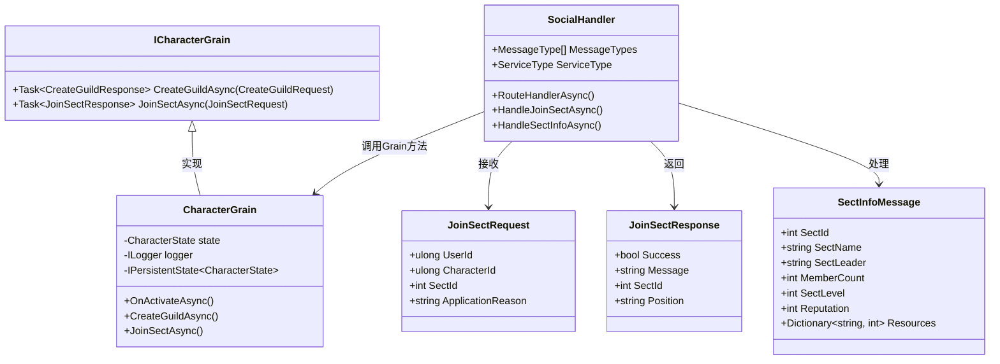
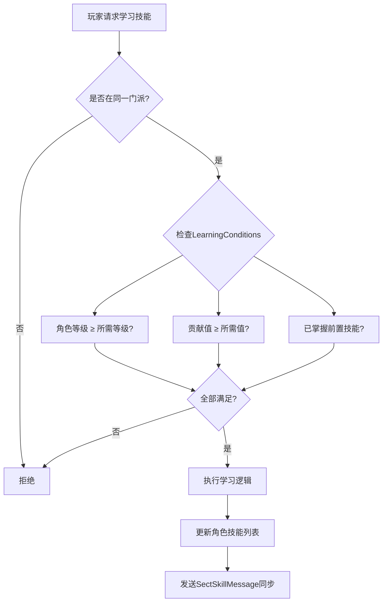
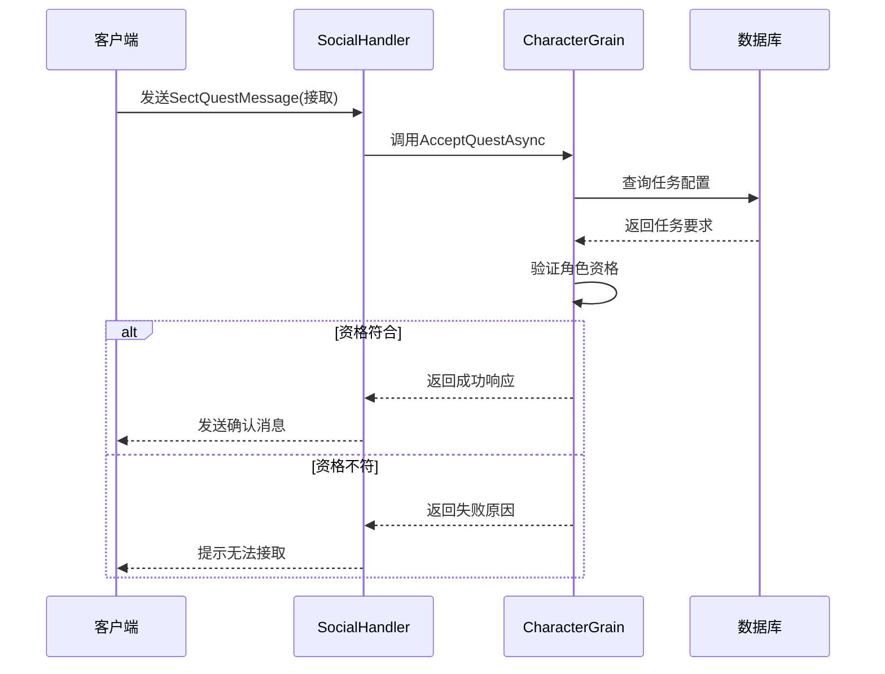
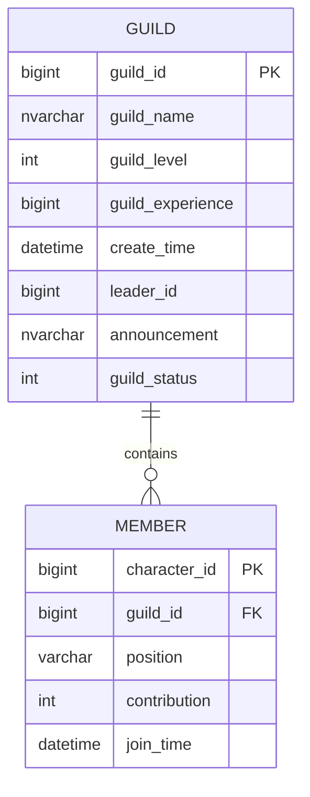

# 帮派与门派系统

<cite>
**本文档引用文件**  
- [SocialMessages.cs](file://Horizon.Game.Message/Network/SocialMessages.cs)
- [CharacterGrain.cs](file://Horizon.Orleans.Grains/CharacterGrain.cs)
- [SocialHandler.cs](file://Horizon.Game.Core/Handlers/SocialHandler.cs)
- [GuildEntity.cs](file://Horizon.Model/GameModel/GuildEntity.cs)
</cite>

## 目录
1. [帮派与门派系统架构设计](#帮派与门派系统架构设计)  
2. [SectInfoMessage数据同步机制](#sectinfomessage数据同步机制)  
3. [门派技能学习条件与权限控制](#门派技能学习条件与权限控制)  
4. [门派任务流程与奖励分发](#门派任务流程与奖励分发)  
5. [大型社交玩法事件驱动架构](#大型社交玩法事件驱动架构)  
6. [帮派数据分库分表与内存优化](#帮派数据分库分表与内存优化)

## 帮派与门派系统架构设计

帮派（Guild）与门派（Sect）系统采用基于Orleans框架的Actor模型实现，通过Grain粒度隔离保证高并发下的状态一致性。`CreateGuildAsync`方法在`ICharacterGrain`接口中定义，并由`CharacterGrain`类实现，接收`CreateGuildRequest`参数完成帮派创建逻辑。

门派相关操作如加入、信息查询等通过`JoinSectRequest`和`JoinSectResponse`消息类型进行通信，属于社交服务模块（ServiceType.Social），由`SocialHandler`统一处理路由。该处理器注册了包括门派、帮派、结拜、师徒在内的多种社交消息类型，确保请求被正确分发至对应异步处理方法。

**图表来源**  
- [SocialMessages.cs](file://Horizon.Game.Message/Network/SocialMessages.cs#L13-L146)
- [CharacterGrain.cs](file://Horizon.Orleans.Grains/CharacterGrain.cs#L598-L609)
- [SocialHandler.cs](file://Horizon.Game.Core/Handlers/SocialHandler.cs#L0-L48)

**本节来源**  
- [SocialMessages.cs](file://Horizon.Game.Message/Network/SocialMessages.cs#L73-L146)
- [CharacterGrain.cs](file://Horizon.Orleans.Grains/CharacterGrain.cs#L598-L609)
- [SocialHandler.cs](file://Horizon.Game.Core/Handlers/SocialHandler.cs#L0-L48)

## SectInfoMessage数据同步机制

`SectInfoMessage`用于传输门派核心属性，包含门派ID、名称、掌门、成员数、等级、声望及资源字典。该消息通过网络序列化协议MemoryPack进行高效编解码，确保跨节点通信性能。

当客户端请求门派信息时，`SocialHandler`调用`HandleSectInfoAsync`方法，从后端服务获取最新状态并封装为`SectInfoMessage`返回。所有字段均使用`[MemoryPackOrder]`特性标注顺序，保障反序列化一致性。资源以键值对形式存储，支持动态扩展不同类型资源（如灵石、木材、贡献点等）。

数据更新由业务逻辑触发后主动推送，例如门派升级、成员变动或资源增减时，系统生成新的`SectInfoMessage`并通过消息通道广播给所有相关在线成员，实现准实时同步。

**本节来源**  
- [SocialMessages.cs](file://Horizon.Game.Message/Network/SocialMessages.cs#L13-L68)
- [SocialHandler.cs](file://Horizon.Game.Core/Handlers/SocialHandler.cs#L200-L220)

## 门派技能学习条件与权限控制

`SectSkillMessage`承载门派技能信息，其中`LearningConditions`字段为`Dictionary<string, object>`类型，允许灵活配置学习前置条件。典型条件包括角色等级、门派贡献度、特定任务完成状态、前置技能等级等。

权限控制策略在Grain层执行：当玩家尝试学习技能时，`CharacterGrain`会验证其所属门派、职位权限及个人属性是否满足`LearningConditions`要求。例如，高级技能可能仅限“内门弟子”及以上职位学习，且需达到一定声望门槛。

此设计支持热更新技能配置而无需重启服务，条件规则可从数据库加载并缓存至Redis，提升判断效率。同时利用Orleans的持久化状态管理，确保技能学习过程具备事务性与幂等性。

**图表来源**  
- [SocialMessages.cs](file://Horizon.Game.Message/Network/SocialMessages.cs#L151-L199)

**本节来源**  
- [SocialMessages.cs](file://Horizon.Game.Message/Network/SocialMessages.cs#L151-L199)
- [CharacterGrain.cs](file://Horizon.Orleans.Grains/CharacterGrain.cs#L300-L331)

## 门派任务流程与奖励分发

`SectQuestMessage`定义了门派任务结构，包含任务ID、名称、描述、奖励、要求及所属门派ID。任务发布由门派管理层触发，经校验后写入数据库并推送给门派成员。

接取流程如下：
1. 客户端发送`SectQuestMessage`含目标任务ID；
2. `SocialHandler`路由至`HandleSectQuestAsync`；
3. `CharacterGrain`验证角色资格（如等级、前置任务完成情况）；
4. 成功则记录任务进度，失败返回错误信息。

任务完成后，系统解析`Rewards`字典中的奖励项（如金币、经验、道具ID），调用物品发放服务完成分发。奖励逻辑支持脚本化扩展，可通过配置实现概率掉落或多阶段奖励。

**图表来源**  
- [SocialMessages.cs](file://Horizon.Game.Message/Network/SocialMessages.cs#L204-L252)
- [SocialHandler.cs](file://Horizon.Game.Core/Handlers/CharacterHandler.cs#L728-L757)

**本节来源**  
- [SocialMessages.cs](file://Horizon.Game.Message/Network/SocialMessages.cs#L204-L252)
- [SocialHandler.cs](file://Horizon.Game.Core/Handlers/CharacterHandler.cs#L728-L757)

## 大型社交玩法事件驱动架构

帮派战、门派活动等大型社交玩法采用事件驱动架构，基于Orleans的观察者模式（Observer Pattern）实现。关键组件包括：

- **事件发布者**：战斗结算、活动计时器等触发事件；
- **订阅管理器**：`ObserverSubscriptionManager`维护参与者订阅关系；
- **事件消费者**：各客户端连接实现`IBaseCallback`接口接收推送。

例如，在帮派战中，当一方占领据点时，服务器发布`BattleUpdateEvent`，所有订阅该战场的成员即时收到UI刷新指令。消息通过`MessageObserver`广播，结合Redis实现跨Silo事件分发，保障大规模并发下的低延迟通知。

此类事件归类于`ServiceType.Combat`或`ServiceType.Activity`，独立于常规社交消息流，避免阻塞核心交互。

**本节来源**  
- [SocialHandler.cs](file://Horizon.Game.Core/Handlers/SocialHandler.cs#L0-L48)
- [CharacterGrain.cs](file://Horizon.Orleans.Grains/CharacterGrain.cs#L598-L609)

## 帮派数据分库分表与内存优化

帮派数据存储于`Game_HunduShijie_Guild`表，实体映射为`GuildEntity`，采用`EntityStorage("Game")`注解指定存储库。为应对海量成员在线场景，实施以下优化策略：

### 分库分表方案
- 按`GuildId`哈希分片，分散至多个MySQL实例；
- 使用`DatabaseOptions`配置读写分离，主库负责写入，从库承担查询；
- 热门帮派数据预加载至Redis集群，键格式为`guild:{id}:info`。

### 内存优化技巧
- 利用Orleans Grain单例特性，每个帮派仅存在一个活跃Grain实例；
- 非活跃状态自动钝化（DeactivateOnIdle），释放内存；
- 成员列表采用懒加载，仅在需要时从数据库或缓存拉取；
- 使用`PooledBufferManager`减少高频消息序列化的GC压力；
- 关键数据变更通过增量更新而非全量同步降低带宽消耗。

上述措施有效支撑万人规模帮派的稳定运行，同时控制资源占用在合理区间。

**图表来源**  
- [GuildEntity.cs](file://Horizon.Model/GameModel/GuildEntity.cs#L0-L73)

**本节来源**  
- [GuildEntity.cs](file://Horizon.Model/GameModel/GuildEntity.cs#L0-L73)
- [CharacterGrain.cs](file://Horizon.Orleans.Grains/CharacterGrain.cs#L598-L609)
- [SocialHandler.cs](file://Horizon.Game.Core/Handlers/SocialHandler.cs#L0-L48)