# 社交交互系统

<cite>
**本文档引用的文件**
- [SocialHandler.cs](file://Horizon.Game.Core\Handlers\SocialHandler.cs)
- [ChatHandler.cs](file://Horizon.Game.Core\Handlers\ChatHandler.cs)
- [Relationship.cs](file://Horizon.Model\IM\Relationship.cs)
- [InteractionMessages.cs](file://Horizon.Game.Message\Network\InteractionMessages.cs)
- [MessageUnion.cs](file://Horizon.Game.Message\MessageUnion.cs)
- [HorizonMessagePacket.cs](file://Horizon.Game.Message\Network\HorizonMessagePacket.cs)
- [MessageHeader.cs](file://Horizon.Game.Message\Network\MessageHeader.cs)
- [HorizonMessageAdapter.cs](file://Horizon.Game.Core\Adapters\HorizonMessageAdapter.cs)
- [IMessageHandler.cs](file://Horizon.Game.Core\IMessageHandler.cs)
- [RelationshipStatus.cs](file://Horizon.Core.Abstract\Enums\RelationshipStatus.cs)
</cite>

## 目录
1. [简介](#简介)
2. [核心社交功能](#核心社交功能)
3. [数据模型与状态机](#数据模型与状态机)
4. [比武切磋流程](#比武切磋流程)
5. [聊天消息处理机制](#聊天消息处理机制)
6. [社交数据一致性与实时同步](#社交数据一致性与实时同步)

## 简介
本系统实现了角色间的多种社交交互功能，包括好友系统、队伍管理、帮派操作、师徒关系和结拜系统。系统通过统一的消息处理框架实现各类社交请求的路由与响应，并确保社交数据的一致性与实时同步。

## 核心社交功能

### 好友系统
`AddFriendAsync` 功能通过 `HandleFriendAsync` 方法实现，处理添加好友请求并返回响应结果。

**节段来源**
- [SocialHandler.cs](file://Horizon.Game.Core\Handlers\SocialHandler.cs#L278-L290)

### 队伍管理
队伍管理功能包含 `CreateTeamAsync` 和 `JoinTeamAsync` 两个核心操作：
- `CreateTeamAsync` 通过 `HandleTeamAsync` 方法处理创建队伍请求
- `JoinTeamAsync` 通过 `HandleTeamAsync` 方法处理加入队伍请求

**节段来源**
- [SocialHandler.cs](file://Horizon.Game.Core\Handlers\SocialHandler.cs#L292-L312)

### 帮派操作
帮派操作功能包含 `CreateGuildAsync` 和 `JoinGuildAsync` 两个核心操作：
- `CreateGuildAsync` 通过 `HandleGuildAsync` 方法处理创建帮派请求
- `JoinGuildAsync` 通过 `HandleGuildAsync` 方法处理加入帮派请求

**节段来源**
- [SocialHandler.cs](file://Horizon.Game.Core\Handlers\SocialHandler.cs#L314-L334)

### 师徒关系
`HandleMasterApprenticeAsync` 方法处理师徒关系建立请求，生成师徒关系响应。

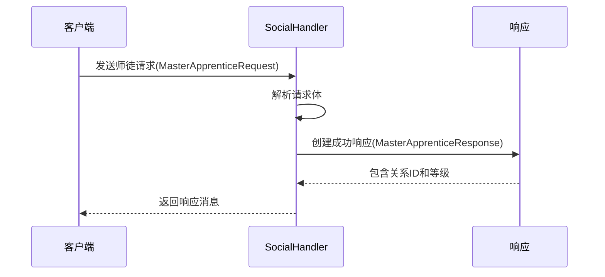

**图示来源**
- [SocialHandler.cs](file://Horizon.Game.Core\Handlers\SocialHandler.cs#L336-L357)

### 结拜系统
`HandleSwornBrotherAsync` 方法处理结拜请求，生成结拜响应。

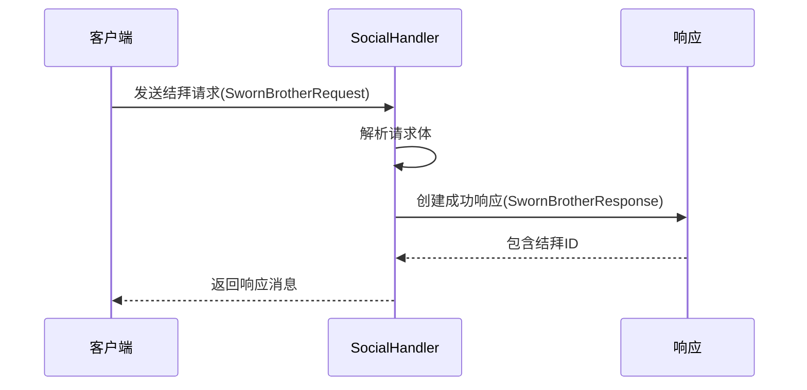

**图示来源**
- [SocialHandler.cs](file://Horizon.Game.Core\Handlers\SocialHandler.cs#L314-L334)

## 数据模型与状态机

### 关系数据模型
`Relationship` 类定义了好友关系的数据结构，包含双方ID、备注名、关系状态和添加日期等属性。

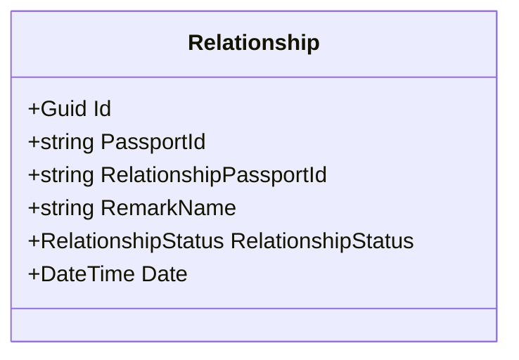

**图示来源**
- [Relationship.cs](file://Horizon.Model\IM\Relationship.cs#L16-L54)

### 队伍信息模型
`TeamInfo` 类定义了队伍的基本信息，包括队伍ID、队长ID、成员列表、队伍名称和目标。

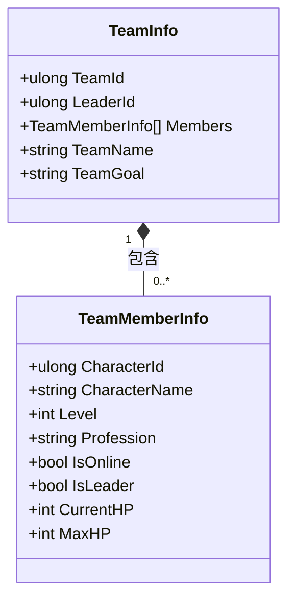

**图示来源**
- [InteractionMessages.cs](file://Horizon.Game.Message\Network\InteractionMessages.cs#L356-L397)
- [InteractionMessages.cs](file://Horizon.Game.Message\Network\InteractionMessages.cs#L402-L464)

### 帮派信息模型
`GuildInfo` 类定义了帮派的基本信息，包括帮派ID、名称、帮主信息、等级、成员数量和资源等。

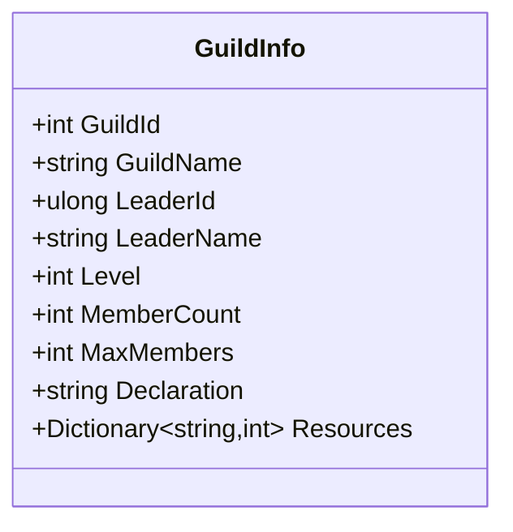

**图示来源**
- [InteractionMessages.cs](file://Horizon.Game.Message\Network\InteractionMessages.cs#L594-L663)

### 关系状态机
`RelationshipStatus` 枚举定义了好友关系的五种状态：正常、未确认、拒绝、已删除（自己删除对方）和已删除（对方删除自己）。

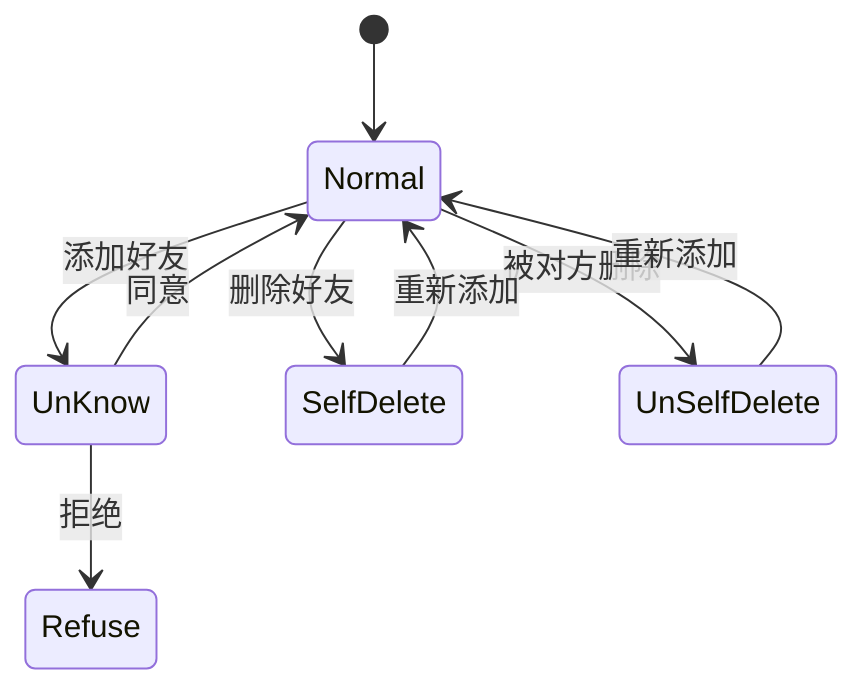

**图示来源**
- [RelationshipStatus.cs](file://Horizon.Core.Abstract\Enums\RelationshipStatus.cs#L12-L39)

## 比武切磋流程

`HandleDuelAsync` 方法处理比武切磋请求，实现请求-响应流程。

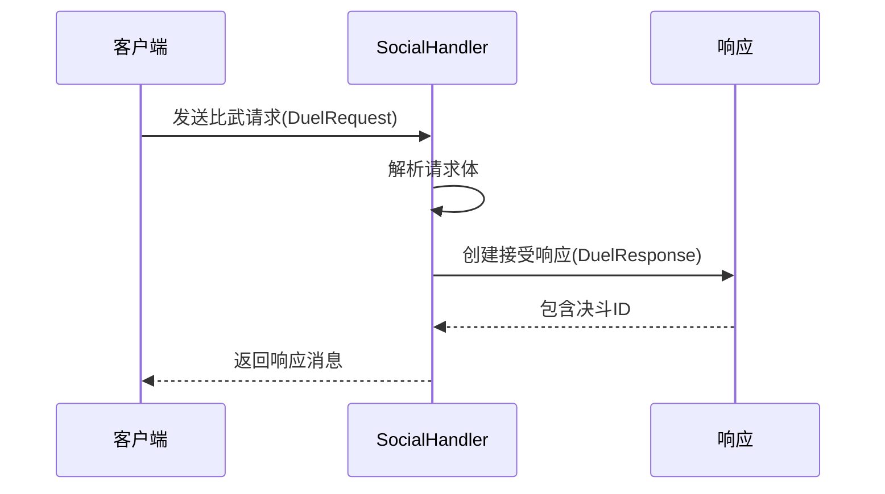

**图示来源**
- [SocialHandler.cs](file://Horizon.Game.Core\Handlers\SocialHandler.cs#L292-L312)

## 聊天消息处理机制

### 消息处理流程
`ChatHandler` 类负责处理聊天消息和聊天历史请求。

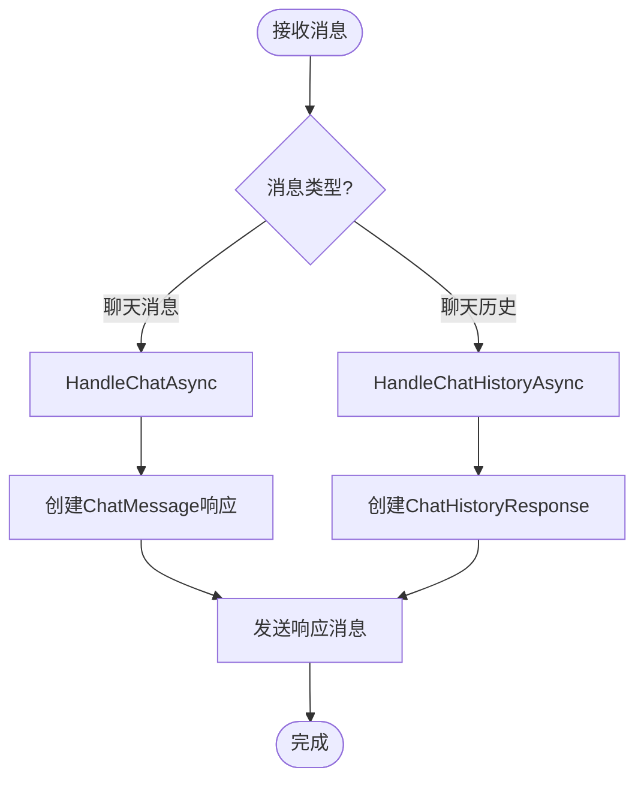

**图示来源**
- [ChatHandler.cs](file://Horizon.Game.Core\Handlers\ChatHandler.cs#L15-L94)

### 消息序列化与反序列化
系统使用 `HorizonMessagePacket` 作为消息容器，包含服务类型、消息头和消息体三部分。

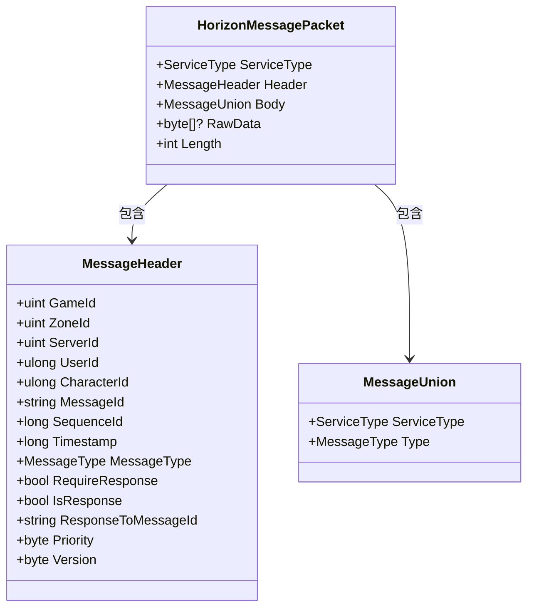

**图示来源**
- [HorizonMessagePacket.cs](file://Horizon.Game.Message\Network\HorizonMessagePacket.cs#L13-L70)
- [MessageHeader.cs](file://Horizon.Game.Message\Network\MessageHeader.cs#L10-L153)
- [MessageUnion.cs](file://Horizon.Game.Message\MessageUnion.cs#L11-L134)

### 消息创建与解包
`HorizonMessageAdapter` 提供消息创建和解包功能，确保消息的正确序列化和反序列化。

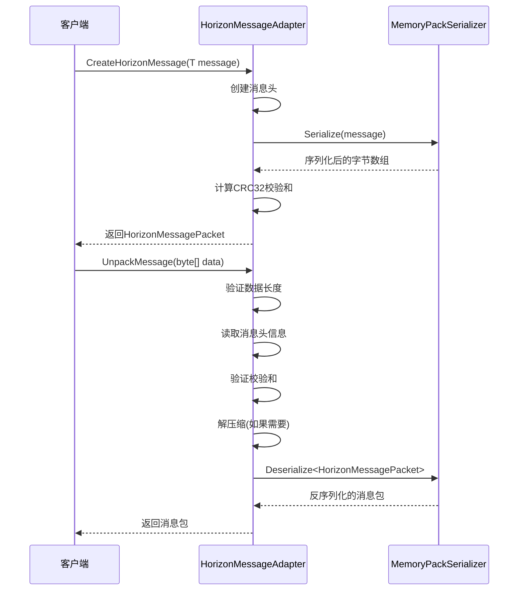

**图示来源**
- [HorizonMessageAdapter.cs](file://Horizon.Game.Core\Adapters\HorizonMessageAdapter.cs#L132-L270)
- [HorizonMessagePacket.cs](file://Horizon.Game.Message\Network\HorizonMessagePacket.cs#L13-L70)

## 社交数据一致性与实时同步

### 消息处理基类
`MessageHandlerBase` 提供了创建消息的通用方法，确保所有响应消息格式一致。

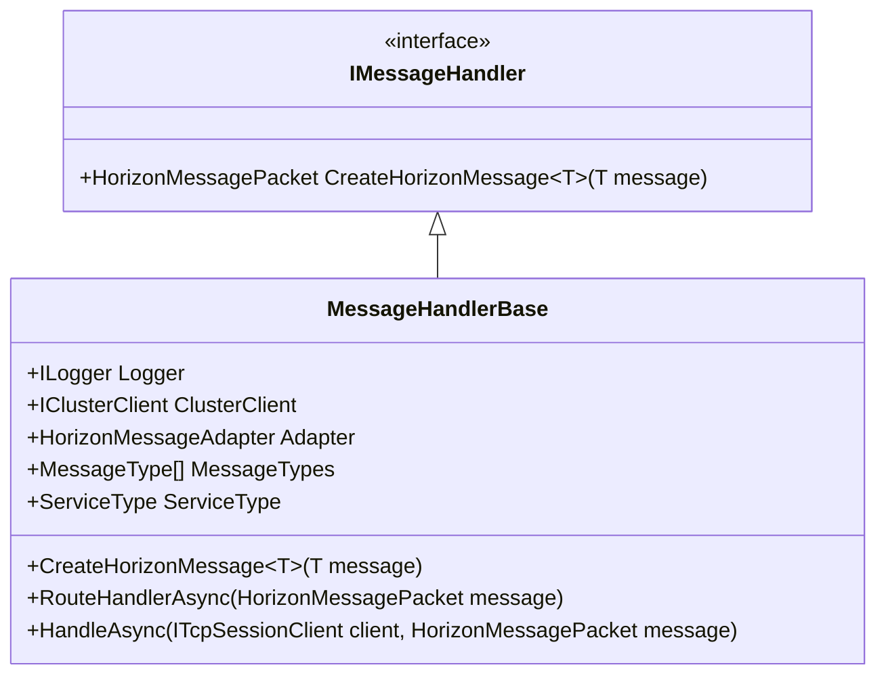

**图示来源**
- [IMessageHandler.cs](file://Horizon.Game.Core\IMessageHandler.cs#L45-L45)
- [MessageHandlerBase.cs](file://Horizon.Game.Core\IMessageHandler.cs#L130-L158)

### 实时同步机制
系统通过消息广播机制实现社交数据的实时同步，当社交关系发生变化时，相关用户会立即收到更新通知。

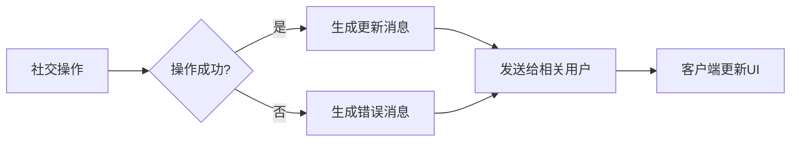

**节段来源**
- [SocialHandler.cs](file://Horizon.Game.Core\Handlers\SocialHandler.cs)
- [ChatHandler.cs](file://Horizon.Game.Core\Handlers\ChatHandler.cs)